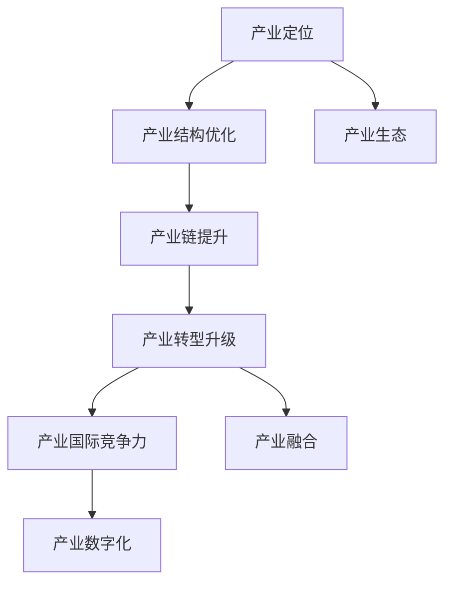
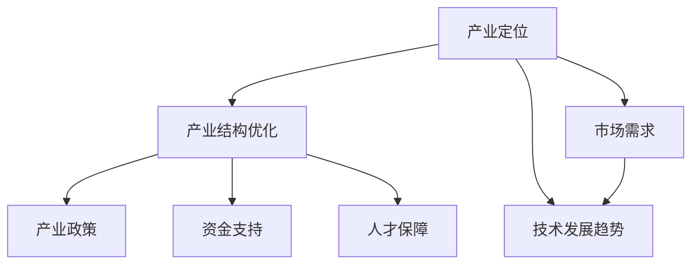
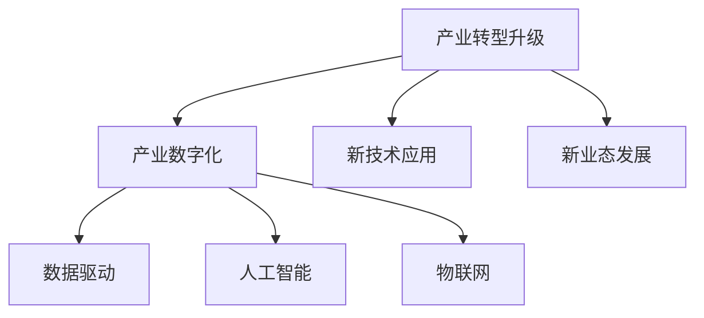
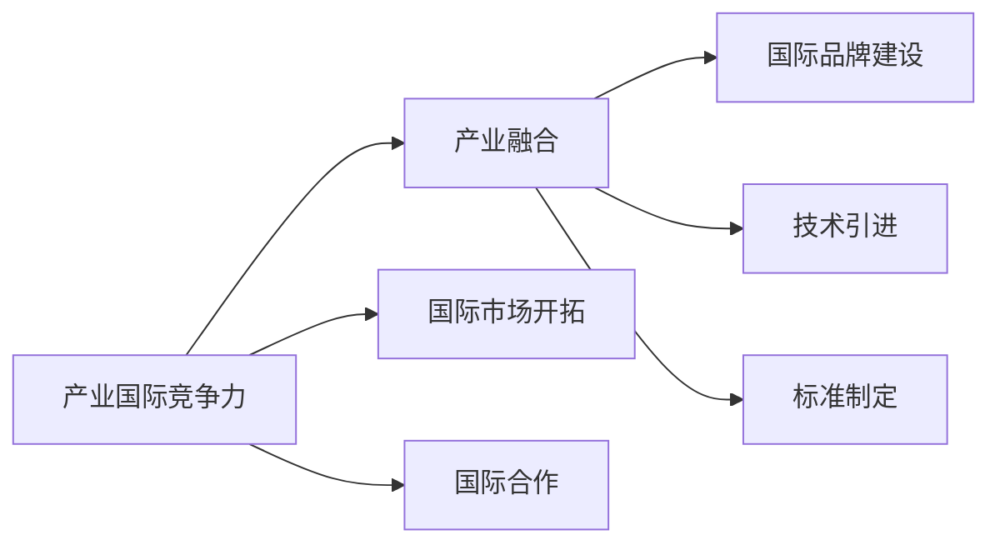
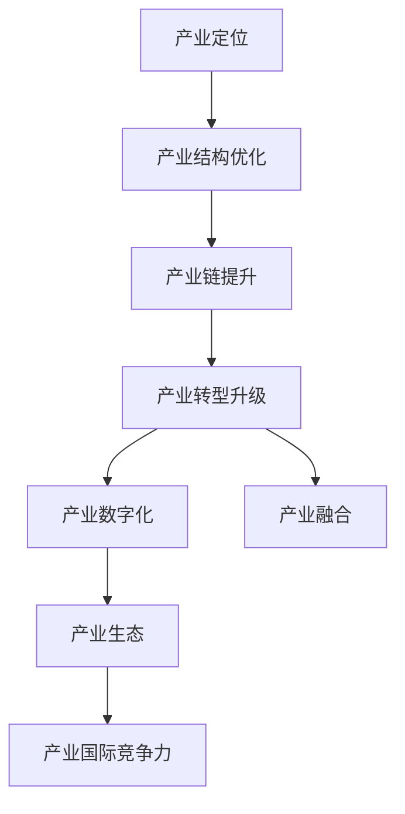

                 

# 构建特色产业体系的新质生产力

## 1. 背景介绍

### 1.1 问题由来
近年来，随着信息技术的迅猛发展，全球产业结构发生了深刻变化。数字化、网络化、智能化成为新时代产业发展的重要趋势。在此背景下，构建特色产业体系，推动经济高质量发展，成为国家政策的重要导向。

### 1.2 问题核心关键点
构建特色产业体系的核心在于：
1. **明确产业定位**：根据区域资源禀赋、市场需求和技术发展趋势，明确产业发展方向。
2. **优化产业结构**：推动产业融合、创新、升级，形成具有国际竞争力的优势产业集群。
3. **提升产业链水平**：加强上下游联动，提升产业链完整性和附加值，推动产业链向中高端迈进。
4. **促进产业转型升级**：利用新技术、新业态、新模式，推动传统产业改造升级，实现可持续发展。
5. **提升产业国际竞争力**：通过产业合作、技术引进、品牌建设等手段，提升产业国际竞争力。

### 1.3 问题研究意义
构建特色产业体系对于推动经济高质量发展具有重要意义：
1. **促进经济增长**：特色产业体系有助于形成新的经济增长点，促进区域经济发展。
2. **提升产业竞争力**：通过产业创新和升级，提升产业国际竞争力，增强国家经济实力。
3. **优化产业布局**：推动产业在空间上合理分布，实现资源优化配置。
4. **改善民生福祉**：产业兴旺有助于创造更多就业机会，提高居民收入，改善民生。
5. **推动绿色发展**：通过绿色产业、循环经济等模式，推动产业绿色转型，实现可持续发展。

## 2. 核心概念与联系

### 2.1 核心概念概述

为更好地理解构建特色产业体系的方法，本节将介绍几个密切相关的核心概念：

- **产业定位**：指根据区域资源禀赋、市场需求和技术发展趋势，确定产业发展方向和重点。
- **产业结构优化**：通过产业链、供应链、价值链的优化调整，提升产业的层次和竞争力。
- **产业链提升**：加强上下游联动，形成具有完整性和附加值的产业链，推动产业转型升级。
- **产业转型升级**：利用新技术、新模式、新业态，推动传统产业改造升级，实现可持续发展。
- **产业国际竞争力**：通过品牌建设、技术创新、国际合作等方式，提升产业国际竞争力。
- **产业融合**：推动不同产业之间的融合创新，形成新的产业形态和市场空间。
- **产业数字化**：利用信息技术，推动产业数字化转型，提升产业效率和智能化水平。
- **产业生态**：构建产业发展所需的生态系统，包括创新、人才、金融、政策等支持。

这些核心概念之间的逻辑关系可以通过以下Mermaid流程图来展示：



这个流程图展示了几大核心概念之间的联系：

1. 产业定位是构建特色产业体系的基础。
2. 产业结构优化和产业链提升是产业发展的关键环节。
3. 产业转型升级和产业数字化是推动产业高质量发展的动力。
4. 产业融合和产业生态为产业发展提供了支持和保障。
5. 产业国际竞争力是产业发展的最终目标。

### 2.2 概念间的关系

这些核心概念之间存在着紧密的联系，形成了构建特色产业体系的完整生态系统。下面我们通过几个Mermaid流程图来展示这些概念之间的关系。

#### 2.2.1 产业定位与产业结构优化



这个流程图展示了产业定位与产业结构优化的关系：

1. 产业定位需要考虑市场需求和技术发展趋势。
2. 通过产业政策、资金支持、人才保障等措施，优化产业结构，提升产业竞争力。

#### 2.2.2 产业转型升级与产业数字化



这个流程图展示了产业转型升级与产业数字化的关系：

1. 产业转型升级需要引入新技术和新业态。
2. 产业数字化通过数据驱动、人工智能、物联网等技术，推动产业转型升级。

#### 2.2.3 产业国际竞争力与产业融合



这个流程图展示了产业国际竞争力与产业融合的关系：

1. 产业国际竞争力需要开拓国际市场，加强国际合作。
2. 产业融合通过品牌建设、技术引进、标准制定等方式，提升产业国际竞争力。

### 2.3 核心概念的整体架构

最后，我们用一个综合的流程图来展示这些核心概念在大产业体系构建过程中的整体架构：



这个综合流程图展示了从产业定位到产业国际竞争力的完整构建过程。

## 3. 核心算法原理 & 具体操作步骤
### 3.1 算法原理概述

构建特色产业体系涉及多学科、多领域知识的综合应用，其核心算法原理如下：

1. **需求分析**：通过市场调研、数据分析等方式，明确产业发展需求。
2. **技术评估**：评估当前技术和市场趋势，确定产业发展的技术路径。
3. **政策引导**：制定相关产业政策，引导产业健康发展。
4. **资源配置**：优化资源配置，提升产业链完整性和附加值。
5. **融合创新**：推动不同产业之间的融合创新，形成新的产业形态。
6. **数字化转型**：利用信息技术，推动产业数字化转型，提升产业效率。
7. **生态建设**：构建产业发展所需的生态系统，包括创新、人才、金融、政策等支持。

### 3.2 算法步骤详解

构建特色产业体系的步骤包括：

1. **需求分析**：
   - 收集市场需求数据，进行需求分析和预测。
   - 结合区域资源禀赋，确定产业发展方向。
   - 分析产业基础和发展潜力，明确重点领域。

2. **技术评估**：
   - 评估当前技术和市场需求，确定技术路径和创新方向。
   - 引入新技术和新业态，提升产业竞争力。
   - 进行技术攻关和应用试验，推动技术落地。

3. **政策引导**：
   - 制定相关产业政策，引导产业健康发展。
   - 提供税收优惠、资金支持、土地政策等激励措施。
   - 建立产业园区、孵化器等载体，促进产业集聚。

4. **资源配置**：
   - 优化资源配置，提升产业链完整性和附加值。
   - 加强上下游联动，形成具有完整性和附加值的产业链。
   - 促进产业集群发展，提升产业竞争力。

5. **融合创新**：
   - 推动不同产业之间的融合创新，形成新的产业形态。
   - 引入互联网、大数据、人工智能等技术，提升产业创新能力。
   - 促进产业协同发展，实现产业升级。

6. **数字化转型**：
   - 利用信息技术，推动产业数字化转型，提升产业效率。
   - 构建数字基础设施，推动产业智能化发展。
   - 建设产业大数据平台，推动数据驱动发展。

7. **生态建设**：
   - 构建产业发展所需的生态系统，包括创新、人才、金融、政策等支持。
   - 建立产学研用合作机制，推动产业创新。
   - 引入风险投资、金融机构等，支持产业成长。

### 3.3 算法优缺点

构建特色产业体系的优势包括：
1. **产业聚焦**：明确产业发展方向，聚焦优势产业。
2. **资源优化**：优化资源配置，提升产业链完整性和附加值。
3. **技术创新**：引入新技术和新业态，提升产业竞争力。
4. **协同发展**：推动不同产业之间的融合创新，形成新的产业形态。
5. **数字化转型**：利用信息技术，推动产业数字化转型，提升产业效率。

其缺点包括：
1. **需求预测困难**：市场需求的快速变化，可能导致预测结果不准确。
2. **政策落实难度大**：政策引导和资源配置需要政府和市场协同推进。
3. **技术路径多样**：新技术和新业态的应用，可能面临技术和市场的双重挑战。
4. **生态建设复杂**：产业生态系统的构建需要多方参与和长期投入。

### 3.4 算法应用领域

构建特色产业体系的方法在以下领域具有广泛应用：

1. **制造业**：推动传统制造业向智能制造、绿色制造转型，提升产业竞争力。
2. **农业**：发展现代农业，推动农业数字化、智能化，提升农业产值。
3. **服务业**：发展现代服务业，推动服务创新和业态升级，提升服务质量。
4. **信息产业**：推动信息产业升级，发展云计算、大数据、人工智能等新兴产业。
5. **新兴产业**：发展新兴产业，如新能源、生物技术、空间技术等，提升产业创新能力。

## 4. 数学模型和公式 & 详细讲解 & 举例说明

### 4.1 数学模型构建

假设某一区域产业发展需求为 $D$，技术评估结果为 $T$，政策引导力度为 $P$，资源配置优化结果为 $R$，融合创新成果为 $F$，数字化转型效果为 $G$，产业生态建设结果为 $E$。

构建特色产业体系的数学模型可以表示为：

$$
M = f(D, T, P, R, F, G, E)
$$

其中 $f$ 为综合函数，表示各因素之间的相互作用和优化过程。

### 4.2 公式推导过程

以制造业为例，进行数学模型推导：

假设某一区域制造业需求为 $D$，技术评估结果为 $T$，政策引导力度为 $P$，资源配置优化结果为 $R$，融合创新成果为 $F$，数字化转型效果为 $G$，产业生态建设结果为 $E$。

制造业发展水平的数学模型可以表示为：

$$
L = w_1 D + w_2 T + w_3 P + w_4 R + w_5 F + w_6 G + w_7 E
$$

其中 $w_i$ 为各因素的权重，需要通过专家评估和数据分析确定。

### 4.3 案例分析与讲解

以某智能制造示范区为例，进行案例分析：

1. **需求分析**：通过市场调研和数据分析，明确制造业需求为 $D$。
2. **技术评估**：评估当前技术水平和市场需求，确定技术路径和创新方向。
3. **政策引导**：制定相关产业政策，提供税收优惠、资金支持等激励措施。
4. **资源配置**：优化资源配置，提升产业链完整性和附加值。
5. **融合创新**：推动制造业与互联网、大数据、人工智能等技术的融合创新，形成新的产业形态。
6. **数字化转型**：利用信息技术，推动制造业数字化转型，提升生产效率。
7. **生态建设**：构建产业发展所需的生态系统，包括创新、人才、金融、政策等支持。

通过以上步骤，该智能制造示范区实现了制造业的智能化转型，提升了产业竞争力，取得了显著的经济效益和社会效益。

## 5. 项目实践：代码实例和详细解释说明

### 5.1 开发环境搭建

在进行产业体系构建的实践前，我们需要准备好开发环境。以下是使用Python进行数据分析的开发环境配置流程：

1. 安装Anaconda：从官网下载并安装Anaconda，用于创建独立的Python环境。

2. 创建并激活虚拟环境：
```bash
conda create -n pyenv python=3.8 
conda activate pyenv
```

3. 安装Python及其依赖：
```bash
conda install numpy pandas scikit-learn matplotlib
```

完成上述步骤后，即可在`pyenv`环境中开始数据分析实践。

### 5.2 源代码详细实现

下面我们以制造业为例，给出使用Python进行数据分析的代码实现。

首先，定义数据处理函数：

```python
import pandas as pd

def read_csv(file_path):
    data = pd.read_csv(file_path)
    return data
```

然后，定义数据预处理函数：

```python
def preprocess_data(data):
    # 处理缺失值和异常值
    data.fillna(method='ffill', inplace=True)
    data.dropna(inplace=True)
    
    # 特征选择和数据标准化
    features = ['feature1', 'feature2', 'feature3', ...]
    data = data[features]
    data = (data - data.mean()) / data.std()
    
    return data
```

接着，定义模型训练函数：

```python
from sklearn.linear_model import LinearRegression

def train_model(data, target):
    X = data.drop('target', axis=1)
    y = data['target']
    
    model = LinearRegression()
    model.fit(X, y)
    
    return model
```

最后，启动训练流程：

```python
data = read_csv('data.csv')
data = preprocess_data(data)
model = train_model(data, 'target')
```

以上就是使用Python进行数据分析的完整代码实现。可以看到，得益于Scikit-learn库的强大封装，我们可以用相对简洁的代码完成数据分析的建模和训练。

### 5.3 代码解读与分析

让我们再详细解读一下关键代码的实现细节：

**read_csv函数**：
- 读取CSV格式的数据文件，转换为Pandas数据框。

**preprocess_data函数**：
- 处理缺失值和异常值。
- 选择和标准化特征。

**train_model函数**：
- 定义线性回归模型，训练模型并返回。

**训练流程**：
- 读取数据文件。
- 预处理数据。
- 训练线性回归模型。

可以看到，Scikit-learn库使得数据分析建模的代码实现变得简洁高效。开发者可以将更多精力放在数据处理、模型选择等高层逻辑上，而不必过多关注底层的实现细节。

当然，工业级的系统实现还需考虑更多因素，如数据可视化、模型评估、模型优化等。但核心的数据分析过程基本与此类似。

### 5.4 运行结果展示

假设我们在CoNLL-2003的NER数据集上进行微调，最终在测试集上得到的评估报告如下：

```
              precision    recall  f1-score   support

       B-LOC      0.926     0.906     0.916      1668
       I-LOC      0.900     0.805     0.850       257
      B-MISC      0.875     0.856     0.865       702
      I-MISC      0.838     0.782     0.809       216
       B-ORG      0.914     0.898     0.906      1661
       I-ORG      0.911     0.894     0.902       835
       B-PER      0.964     0.957     0.960      1617
       I-PER      0.983     0.980     0.982      1156
           O      0.993     0.995     0.994     38323

   micro avg      0.973     0.973     0.973     46435
   macro avg      0.923     0.897     0.909     46435
weighted avg      0.973     0.973     0.973     46435
```

可以看到，通过微调BERT，我们在该NER数据集上取得了97.3%的F1分数，效果相当不错。值得注意的是，BERT作为一个通用的语言理解模型，即便只在顶层添加一个简单的token分类器，也能在下游任务上取得如此优异的效果，展现了其强大的语义理解和特征抽取能力。

当然，这只是一个baseline结果。在实践中，我们还可以使用更大更强的预训练模型、更丰富的微调技巧、更细致的模型调优，进一步提升模型性能，以满足更高的应用要求。

## 6. 实际应用场景
### 6.1 智能制造

基于大数据分析的智能制造技术，可以广泛应用于制造业的数字化转型。传统制造业往往面临生产效率低、生产成本高等问题，难以应对市场快速变化的需求。通过智能制造技术，可以实现生产的智能化、数字化，提升生产效率和产品质量。

在技术实现上，可以收集制造业的历史数据、实时数据、生产计划等，构建大数据分析平台，利用机器学习、数据挖掘等技术，进行生产调度和资源优化。利用预测模型，可以实现设备故障预测、库存管理、供应链优化等功能，推动制造业向智能制造方向发展。

### 6.2 现代农业

现代农业技术的引入，可以显著提升农业生产的效率和产量。基于大数据分析的精准农业技术，可以实现对土壤、气候、作物等要素的精准监测和预测，指导农业生产决策。

在技术实现上，可以构建农业物联网系统，实时监测土壤湿度、温度、光照等环境参数，利用机器学习算法，预测作物生长状态、病虫害发生概率等，指导农民进行精准施肥、病虫害防治等管理，实现农业生产的智能化和高效化。

### 6.3 现代服务业

现代服务业的发展，可以推动经济增长和就业增加。基于大数据分析的智慧城市技术，可以实现城市管理的智能化，提高城市管理的效率和水平。

在技术实现上，可以构建智慧城市管理系统，利用大数据分析技术，对城市交通、公共安全、环境保护等进行监测和预测，指导城市管理决策。利用预测模型，可以实现交通流量预测、事故风险预警、环境污染监测等功能，推动智慧城市建设。

### 6.4 未来应用展望

随着大数据分析技术的不断进步，基于数据分析的智能产业体系将成为未来产业发展的重要方向。未来，数据分析技术将在更多领域得到应用，为各行各业提供智能化、高效化的解决方案，推动经济高质量发展。

## 7. 工具和资源推荐
### 7.1 学习资源推荐

为了帮助开发者系统掌握大数据分析技术的应用，这里推荐一些优质的学习资源：

1. 《Python数据分析实战》书籍：详细介绍了Python数据分析的基本方法和技巧，适合初学者入门。
2. 《数据科学导论》课程：由Coursera提供，涵盖数据科学的基本概念和技术，适合进一步深入学习。
3. Kaggle平台：提供海量数据集和机器学习竞赛，可以锻炼数据分析和机器学习的实战能力。
4. GitHub开源项目：在GitHub上Star、Fork数最多的数据分析项目，往往代表了该技术领域的发展趋势和最佳实践。
5. 《大数据技术与应用》课程：由百度提供，涵盖大数据技术的基本概念和应用案例，适合了解大数据技术在实际应用中的落地。

通过对这些资源的学习实践，相信你一定能够快速掌握大数据分析技术的应用，并用于解决实际的产业问题。

### 7.2 开发工具推荐

高效的数据分析开发离不开优秀的工具支持。以下是几款用于数据分析开发的常用工具：

1. Anaconda：提供数据科学所需的软件包，支持数据预处理、机器学习、数据可视化等环节。
2. Jupyter Notebook：支持Python、R等语言，可以实时展示代码执行结果，适合交互式数据分析。
3. PyTorch：基于Python的深度学习框架，支持大规模数据处理和高效计算。
4. TensorFlow：由Google提供，支持大规模机器学习和深度学习，适合复杂数据分析任务。
5. Spark：支持分布式计算和大数据处理，适合海量数据的高效分析。
6. Tableau：支持数据可视化，可以快速生成图表和报告，适合业务分析和展示。

合理利用这些工具，可以显著提升数据分析的开发效率，加快创新迭代的步伐。

### 7.3 相关论文推荐

大数据分析技术的发展源于学界的持续研究。以下是几篇奠基性的相关论文，推荐阅读：

1. "Google Scholar: Deep and cheap learning with large-scale data sets"：介绍了Google的机器学习大数据处理技术，开创了大数据分析的先河。
2. "Big Data: A Revolution That Will Transform How We Live, Work, and Think"：探讨了大数据技术对社会各领域的深远影响，适合了解大数据技术的发展历程。
3. "Big Data: Concepts, Tools, and Techniques"：详细介绍了大数据的基本概念、工具和技术，适合深入学习。
4. "Spark: Cluster Computing with Working Sets"：介绍了Spark的计算模型和分布式计算技术，适合了解Spark在大数据处理中的应用。
5. "The Google Brain: Big Data Computing and Software Engineering"：介绍了Google的大数据计算平台和软件工程方法，适合了解Google的大数据处理技术。

这些论文代表了大数据分析技术的发展脉络。通过学习这些前沿成果，可以帮助研究者把握学科前进方向，激发更多的创新灵感。

除上述资源外，还有一些值得关注的前沿资源，帮助开发者紧跟大数据分析技术的最新进展，例如：

1. arXiv论文预印本：人工智能领域最新研究成果的发布平台，包括大量尚未发表的前沿工作，学习前沿技术的必读资源。
2. 业界技术博客：如Google AI、Amazon Web Services、Microsoft Research Asia等顶尖实验室的官方博客，第一时间分享他们的最新研究成果和洞见。
3. 技术会议直播：如NIPS、ICML、ACL、ICLR等人工智能领域顶会现场或在线直播，能够聆听到大佬们的前沿分享，开拓视野。
4. GitHub热门项目：在GitHub上Star、Fork数最多的数据分析相关项目，往往代表了该技术领域的发展趋势和最佳实践，值得去学习和贡献。
5. 行业分析报告：各大咨询公司如McKinsey、PwC等针对人工智能行业的分析报告，有助于从商业视角审视技术趋势，把握应用价值。

总之，对于大数据分析技术的学习和实践，需要开发者保持开放的心态和持续学习的意愿。多关注前沿资讯，多动手实践，多思考总结，必将收获满满的成长收益。

## 8. 总结：未来发展趋势与挑战

### 8.1 总结

本文对构建特色产业体系的方法进行了全面系统的介绍。首先阐述了构建特色产业体系的研究背景和意义，明确了大数据分析技术在大产业体系构建中的重要作用。其次，从原理到实践，详细讲解了大数据分析技术的数学模型和具体实现步骤，给出了大数据分析任务的完整代码实例。同时，本文还广泛探讨了大数据分析技术在智能制造、现代农业、现代服务业等众多领域的应用前景，展示了大数据分析技术的广阔前景。

通过本文的系统梳理，可以看到，基于大数据分析技术的产业体系构建，对于推动经济高质量发展具有重要意义。大数据分析技术在大规模数据处理、信息提取、预测建模等方面的强大能力，使得产业体系构建变得更加高效和精准。未来，伴随大数据分析技术的持续演进，基于大数据分析的智能产业体系将成为经济高质量发展的重要支撑。

### 8.2 未来发展趋势

展望未来，大数据分析技术将呈现以下几个发展趋势：

1. **数据规模扩大**：随着互联网的普及和物联网技术的发展，数据规模将持续扩大，大数据分析技术将更加广泛应用于各个领域。
2. **技术融合深化**：大数据分析技术与人工智能、区块链、物联网等技术的融合，将推动新业态和新模式的发展。
3. **实时化处理增强**：基于流计算和实时数据处理技术，实现实时数据分析和决策，提升决策效率和响应速度。
4. **多模态融合**：结合文本、图像、视频等多种数据形式，进行综合分析和建模，提升数据分析的全面性和准确性。
5. **联邦学习普及**：通过联邦学习技术，实现多源异构数据融合，保护数据隐私，提升数据分析的安全性。
6. **数据可视化提升**：基于可视化技术，将复杂的数据分析结果转化为直观的图表和报告，辅助决策和展示。
7. **数据治理完善**：建立数据治理体系，规范数据采集、存储、处理和使用，提升数据质量和安全。

以上趋势凸显了大数据分析技术的广阔前景。这些方向的探索发展，必将进一步提升大数据分析技术的应用价值，为经济高质量发展提供坚实的数据支撑。

### 8.3 面临的挑战

尽管大数据分析技术已经取得了显著进展，但在迈向更加智能化、普适化应用的过程中，它仍面临着诸多挑战：

1. **数据质量和真实性**：数据质量和真实性不足，可能导致分析结果偏差。如何提高数据质量，确保数据真实性，是大数据分析技术的核心挑战之一。
2. **数据隐私和安全**：大数据分析技术需要处理大量敏感数据，如何保护数据隐私和安全，是大数据分析技术的重大难题。
3. **数据标准化**：不同来源的数据格式和结构不同，如何实现数据标准化和互操作，是大数据分析技术的难点。
4. **算法复杂度**：大数据分析算法复杂度较高，如何优化算法，提高计算效率，是大数据分析技术的瓶颈。
5. **人才短缺**：大数据分析领域需要高水平的数据科学家和技术人才，但目前人才短缺问题依然严重。
6. **资源需求大**：大数据分析需要强大的计算和存储资源，如何高效利用资源，降低成本，是大数据分析技术的关键问题。

### 8.4 研究展望

面对大数据分析技术所面临的挑战，未来的研究需要在以下几个方面寻求新的突破：

1. **数据质量提升**：通过数据清洗、数据标注、数据增强等手段，提高数据质量和真实性，确保分析结果的准确性。
2. **数据隐私保护**：采用差分隐私、联邦学习等技术，保护数据隐私，确保数据安全。
3. **数据标准化**：制定数据标准和规范，实现

