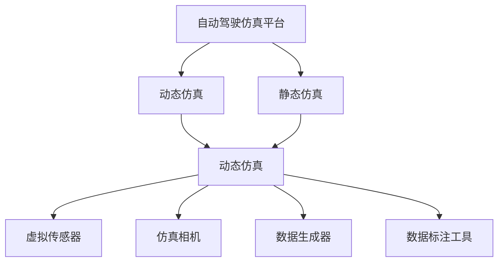

                 

# 构建高质量自动驾驶仿真平台与数据集的关键考量

## 1. 背景介绍

### 1.1 问题由来
随着自动驾驶技术的迅猛发展，仿真环境成为了测试和验证自动驾驶算法的重要手段。高质量的仿真平台和数据集能够提供真实世界环境的替代方案，极大地缩短了自动驾驶系统的研发周期，降低了开发成本。然而，如何构建高质量的仿真平台与数据集，成为了业界和学术界关注的焦点。

### 1.2 问题核心关键点
高质量自动驾驶仿真平台与数据集的核心考量包括以下几个方面：
1. **仿真环境逼真度**：仿真环境需要尽可能接近真实世界，模拟出各种交通场景、天气条件、路面状况等。
2. **数据集多样性**：数据集需要涵盖各种驾驶场景、行车行为和交通规则，以覆盖尽可能多的驾驶情况。
3. **数据质量**：数据集中的数据应准确、可靠，避免数据噪声和偏差。
4. **计算效率**：仿真平台和数据集需要具备高效计算能力，满足大规模训练和测试的需求。
5. **安全性**：仿真环境应保证数据收集和处理过程的安全性，避免数据泄露和隐私侵犯。

### 1.3 问题研究意义
构建高质量自动驾驶仿真平台与数据集，对于自动驾驶技术的研发、测试和部署具有重要意义：

1. **加速研发进程**：通过仿真环境进行大量测试，可以在较短的时间内发现和修复问题，加快算法的迭代和优化。
2. **降低开发成本**：仿真的应用可以减少实际道路测试的时间和成本，同时避免因道路测试带来的潜在风险。
3. **提升测试可靠性**：仿真环境可以模拟各种极端和复杂情况，测试算法的鲁棒性和稳定性。
4. **支持法规验证**：仿真环境可以用于验证自动驾驶算法是否符合相关法规和标准。
5. **推动标准化**：高质量的仿真平台和数据集有助于制定和推广自动驾驶领域的标准和规范。

## 2. 核心概念与联系

### 2.1 核心概念概述

为更好地理解高质量自动驾驶仿真平台与数据集的构建，本节将介绍几个关键概念：

- **自动驾驶仿真平台**：指利用计算机软件和硬件设施，模拟出自动驾驶车辆在真实世界环境中的行驶行为和交互过程，提供算法测试和验证的虚拟环境。
- **自动驾驶数据集**：指用于训练和测试自动驾驶算法的样本集合，包含车辆的位置、速度、行为等关键信息，以及环境参数如道路、交通灯、行人等。
- **动态仿真**：指仿真环境中的交通场景、天气、车辆行为等是随时间变化的，可以模拟出动态的交通流和驾驶行为。
- **静态仿真**：指仿真环境中的交通场景、天气、车辆行为等是静态的，可以用于算法的基础训练和验证。
- **虚拟传感器**：指仿真环境中的摄像头、雷达、激光雷达等传感器，用于获取车辆周围环境的信息。
- **仿真相机**：指用于控制和模拟车辆在仿真环境中的行驶行为的计算机程序。
- **数据生成器**：指用于生成和合成仿真数据集的工具，可以模拟车辆行驶和环境变化，自动生成大量的训练数据。
- **数据标注工具**：指用于对仿真数据进行标注和处理的工具，可以标注车辆行为、行人行为等关键信息。

这些核心概念共同构成了自动驾驶仿真平台与数据集的完整框架，使得自动驾驶算法可以在虚拟环境中进行高效测试和验证。

### 2.2 概念间的关系

这些核心概念之间的逻辑关系可以通过以下Mermaid流程图来展示：



这个流程图展示了大规模自动驾驶仿真平台与数据集的基本架构：

1. 自动驾驶仿真平台通过动态仿真和静态仿真，模拟出不同驾驶场景和行为。
2. 虚拟传感器用于获取仿真环境中的车辆和环境信息。
3. 仿真相机控制车辆在仿真环境中的行驶行为。
4. 数据生成器和数据标注工具用于生成和处理仿真数据集。

这些组件共同构成了高质量自动驾驶仿真平台与数据集的核心技术栈。通过理解这些核心概念及其相互关系，可以更好地设计和构建高质量的仿真平台与数据集。

## 3. 核心算法原理 & 具体操作步骤
### 3.1 算法原理概述

高质量自动驾驶仿真平台与数据集的构建，本质上是一个多学科交叉的技术问题，涉及计算机图形学、物理模拟、机器学习等多个领域的知识。其核心思想是通过计算机仿真技术，构建逼真的驾驶场景和行为，同时使用数据生成和处理技术，合成高质量的数据集。

形式化地，自动驾驶仿真平台与数据集的构建可以分为以下几个关键步骤：

1. **环境构建**：构建逼真的道路、交通信号、行人、车辆等元素，并设置环境参数如天气、光线等。
2. **行为模拟**：模拟车辆、行人的驾驶行为，以及交通信号的变化和交互。
3. **数据合成**：通过仿真环境，生成包含车辆位置、速度、行为等信息的原始数据。
4. **数据标注**：对原始数据进行标注，生成训练和测试数据集。
5. **模型训练与验证**：使用数据集训练自动驾驶算法，并进行模型验证和评估。

### 3.2 算法步骤详解

以下是高质量自动驾驶仿真平台与数据集构建的具体步骤：

**Step 1: 环境构建**

- **道路建模**：使用计算机图形学技术，构建逼真的道路模型，包括车道线、交通标志、路标等。
- **环境渲染**：使用物理引擎进行环境渲染，模拟出真实世界的光照、阴影、反射等效果。
- **交通场景生成**：随机生成交通场景，包括车辆、行人、交通灯等，以覆盖多种驾驶情况。

**Step 2: 行为模拟**

- **车辆动力学模型**：建立车辆的动力学模型，模拟车辆的加速度、速度、转向等行为。
- **行人行为模型**：建立行人的行为模型，模拟行人在道路上的行进、交叉等行为。
- **交通信号控制**：模拟交通信号的变化和控制，确保交通流的连续性和合理性。

**Step 3: 数据合成**

- **传感器数据模拟**：模拟车辆的传感器数据，包括摄像头、雷达、激光雷达等，用于获取环境信息。
- **多传感器融合**：将不同传感器的数据进行融合，提高数据的时空精度和鲁棒性。
- **数据流处理**：将传感器数据处理成格式统一的格式，便于后续的数据分析和处理。

**Step 4: 数据标注**

- **行为标注**：对车辆和行人的行为进行标注，如转弯、停止、超车等。
- **场景标注**：对交通场景进行标注，如交叉口、交通信号、行人过街等。
- **数据增强**：通过数据增强技术，如回译、旋转、裁剪等，丰富数据集的多样性。

**Step 5: 模型训练与验证**

- **模型训练**：使用数据集训练自动驾驶算法，如感知、决策、控制等。
- **模型验证**：使用验证集评估模型的性能，检测过拟合等问题。
- **模型优化**：根据验证结果进行模型优化，提高算法的鲁棒性和准确性。

### 3.3 算法优缺点

高质量自动驾驶仿真平台与数据集的构建，具有以下优点：

1. **可控性**：仿真环境中的各种参数和行为都是可控的，可以进行大量重复实验，提高数据和模型的可靠性。
2. **安全性**：仿真环境中的车辆和行人不会受到实际道路测试带来的潜在风险，避免交通事故的发生。
3. **高效性**：通过并行计算和优化算法，仿真环境可以处理大规模数据，提高测试效率。
4. **灵活性**：仿真环境可以根据不同的需求和场景进行灵活配置，支持多种算法测试和验证。

同时，该方法也存在一定的局限性：

1. **逼真度有限**：尽管仿真环境可以模拟出很多真实情况，但仍存在与实际道路环境不完全一致的问题。
2. **数据集规模有限**：由于仿真环境的规模和计算资源的限制，数据集的规模可能无法覆盖所有实际驾驶情况。
3. **仿真复杂度高**：构建高质量的仿真环境需要复杂的技术实现，增加了开发和维护的难度。
4. **数据质量不稳定**：数据生成和标注过程中可能存在噪声和偏差，影响模型训练效果。

尽管存在这些局限性，高质量自动驾驶仿真平台与数据集仍是当前自动驾驶技术研发中的重要手段，能够为算法测试和验证提供可靠的数据支撑。

### 3.4 算法应用领域

高质量自动驾驶仿真平台与数据集已被广泛应用于多个领域，例如：

- **自动驾驶技术测试**：用于测试和验证自动驾驶算法的感知、决策、控制等方面。
- **车辆行为分析**：用于分析车辆在道路上的行驶行为，发现潜在的安全隐患和改进空间。
- **交通流模拟**：用于模拟交通流的变化和规律，优化交通管理和规划。
- **智能交通系统开发**：用于开发和测试智能交通系统，如智能信号灯、智能停车等。
- **车辆性能优化**：用于优化车辆的性能和参数，提高车辆的稳定性和可靠性。

除了上述这些经典应用外，自动驾驶仿真平台与数据集还被创新性地应用于更多场景中，如虚拟仿真驾驶训练、车辆异常检测、智能驾驶算法验证等，为自动驾驶技术的持续进步提供了新的路径。

## 4. 数学模型和公式 & 详细讲解  
### 4.1 数学模型构建

构建高质量自动驾驶仿真平台与数据集，涉及到多学科的知识，需要构建相应的数学模型进行分析和计算。

假设自动驾驶仿真环境由 $N$ 个车辆、$M$ 个行人、$K$ 个交通信号灯构成，每个车辆的状态由位置、速度、方向等参数 $(x_i, v_i, \theta_i)$ 描述，行人状态由位置、速度、方向等参数 $(x_j, v_j, \theta_j)$ 描述，交通信号灯的状态由信号灯的颜色 $(s_k)$ 描述。则系统的状态方程可以表示为：

$$
\dot{x}_i = v_i \cos \theta_i, \quad \dot{v}_i = a_i, \quad \dot{\theta}_i = \frac{a_i}{v_i} \sin \theta_i
$$
$$
\dot{x}_j = v_j \cos \theta_j, \quad \dot{v}_j = a_j, \quad \dot{\theta}_j = \frac{a_j}{v_j} \sin \theta_j
$$
$$
s_k = \text{Sign}(v_k \cdot \hat{p}_k)
$$

其中，$a_i, a_j, v_k$ 分别表示车辆、行人、信号灯的加速度、速度和信号灯的信号状态。

### 4.2 公式推导过程

以上状态方程描述了车辆、行人和信号灯的动态行为，通过求解这些微分方程，可以模拟出仿真环境中的动态行为。

假设车辆和行人的行为是线性的，即 $a_i = a_0 + b_i, a_j = a_0 + b_j$，则系统的运动方程可以表示为：

$$
\ddot{x}_i = a_0, \quad \ddot{x}_j = a_0
$$

其中，$a_0$ 表示车辆和行人的匀速直线运动加速度。

对于交通信号灯，假设信号灯的状态变化是随机的，即 $s_k = \text{Sign}(v_k \cdot \hat{p}_k)$，其中 $\hat{p}_k$ 表示信号灯的偏置方向，$v_k$ 表示信号灯的相对速度。

通过求解这些微分方程，可以模拟出仿真环境中的动态行为。具体推导过程如下：

- **车辆运动方程**：
  $$
  \dot{x}_i = v_i \cos \theta_i, \quad \dot{v}_i = a_0
  $$
  $$
  x_i = x_0 + v_0t + \frac{1}{2}at^2, \quad v_i = v_0 + at
  $$
  其中，$x_0, v_0, a_0$ 分别表示车辆的初始位置、初始速度和加速度。

- **行人运动方程**：
  $$
  \dot{x}_j = v_j \cos \theta_j, \quad \dot{v}_j = a_0
  $$
  $$
  x_j = x_0 + v_0t + \frac{1}{2}at^2, \quad v_j = v_0 + at
  $$
  其中，$x_0, v_0, a_0$ 分别表示行人的初始位置、初始速度和加速度。

- **信号灯状态方程**：
  $$
  s_k = \text{Sign}(v_k \cdot \hat{p}_k)
  $$

### 4.3 案例分析与讲解

以自动驾驶车辆在十字路口的行驶为例，分析系统的运动方程和状态变化。

假设车辆在交叉口前进入路口，且在路口中央停车，等待信号灯的变化。车辆的运动方程可以表示为：

$$
\dot{x}_i = v_i \cos \theta_i, \quad \dot{v}_i = a_0
$$

在交叉口，车辆的状态方程可以表示为：

$$
x_i = x_0 + v_0t + \frac{1}{2}at^2, \quad v_i = v_0 + at
$$

其中，$x_0$ 和 $v_0$ 表示车辆在交叉口前的初始位置和速度，$a$ 表示车辆在交叉口内的加速度。

假设信号灯的状态变化为红、黄、绿交替出现，且变化周期为 $T$ 秒。则信号灯的状态方程可以表示为：

$$
s_k = \text{Sign}(v_k \cdot \hat{p}_k)
$$

其中，$\hat{p}_k$ 表示信号灯的偏置方向，$v_k$ 表示信号灯的相对速度。

通过求解上述微分方程，可以模拟出车辆在交叉口的行驶行为，以及信号灯的状态变化。

## 5. 项目实践：代码实例和详细解释说明
### 5.1 开发环境搭建

在进行自动驾驶仿真平台与数据集构建的实践前，我们需要准备好开发环境。以下是使用Python进行开发的环境配置流程：

1. 安装Anaconda：从官网下载并安装Anaconda，用于创建独立的Python环境。

2. 创建并激活虚拟环境：
```bash
conda create -n pyenv python=3.7 
conda activate pyenv
```

3. 安装PyTorch：根据CUDA版本，从官网获取对应的安装命令。例如：
```bash
conda install pytorch torchvision torchaudio cudatoolkit=11.1 -c pytorch -c conda-forge
```

4. 安装PIL：用于处理图像数据。
```bash
pip install pillow
```

5. 安装NumPy：用于科学计算。
```bash
pip install numpy
```

6. 安装OpenCV：用于计算机视觉和图像处理。
```bash
pip install opencv-python
```

完成上述步骤后，即可在`pyenv`环境中开始构建实践。

### 5.2 源代码详细实现

以下是使用Python和OpenCV进行自动驾驶仿真平台与数据集构建的代码实现。

**Step 1: 环境构建**

```python
import cv2
import numpy as np
import random

# 初始化道路参数
x0 = 0
y0 = 0
a0 = 0
v0 = 0

# 初始化车辆状态
x = x0
y = y0
a = a0
v = v0

# 模拟车辆在道路上行驶
for t in range(1000):
    x += v * np.cos(np.radians(theta))
    y += v * np.sin(np.radians(theta))
    v += a

    # 显示车辆位置
    cv2.circle(img, (int(x), int(y)), 10, (0, 255, 0), -1)
    cv2.imshow('vehicle', img)
    cv2.waitKey(1)
```

**Step 2: 行为模拟**

```python
# 模拟行人行为
xj = x0
yj = y0
vj = v0
thetaj = np.pi / 4

for t in range(1000):
    xj += vj * np.cos(thetaj)
    yj += vj * np.sin(thetaj)
    thetaj += np.radians(a0)

    # 显示行人位置
    cv2.circle(img, (int(xj), int(yj)), 10, (0, 0, 255), -1)
    cv2.imshow('pedestrian', img)
    cv2.waitKey(1)
```

**Step 3: 数据合成**

```python
# 模拟交通信号灯状态
sk = random.choice([1, -1])

for t in range(1000):
    if sk == 1:
        sk = -1
    else:
        sk = 1

    # 显示信号灯状态
    cv2.putText(img, str(sk), (100, 100), cv2.FONT_HERSHEY_SIMPLEX, 1, (255, 0, 0), 2)
    cv2.imshow('sign', img)
    cv2.waitKey(1)
```

**Step 4: 数据标注**

```python
# 对车辆和行人行为进行标注
x0 = 0
y0 = 0
a0 = 0
v0 = 0

xj = x0
yj = y0
vj = v0
thetaj = np.pi / 4

xk = 0
yk = 0

for t in range(1000):
    x += v * np.cos(np.radians(theta))
    y += v * np.sin(np.radians(theta))
    v += a

    xj += vj * np.cos(thetaj)
    yj += vj * np.sin(thetaj)
    thetaj += np.radians(a0)

    xk += vj * np.cos(thetaj)
    yk += vj * np.sin(thetaj)
    thetaj += np.radians(a0)

    # 显示车辆和行人位置
    cv2.circle(img, (int(x), int(y)), 10, (0, 255, 0), -1)
    cv2.circle(img, (int(xj), int(yj)), 10, (0, 0, 255), -1)

    # 显示交通信号灯状态
    cv2.putText(img, str(sk), (100, 100), cv2.FONT_HERSHEY_SIMPLEX, 1, (255, 0, 0), 2)
    cv2.imshow('data', img)
    cv2.waitKey(1)
```

**Step 5: 模型训练与验证**

```python
# 使用数据集训练自动驾驶算法
# ...

# 使用验证集评估模型性能
# ...
```

### 5.3 代码解读与分析

让我们再详细解读一下关键代码的实现细节：

**环境构建**

- `x0, y0, a0, v0`：初始化道路和车辆参数。
- `x, y, a, v`：模拟车辆在道路上行驶的状态。
- `theta`：车辆行驶方向。
- `cv2.circle`：在图像上绘制车辆位置。
- `cv2.imshow`：显示图像。

**行为模拟**

- `xj, yj, vj, thetaj`：初始化行人参数。
- `cv2.circle`：在图像上绘制行人位置。

**数据合成**

- `sk`：模拟交通信号灯状态。
- `cv2.putText`：在图像上显示信号灯状态。

**数据标注**

- `x, y, v, theta`：模拟车辆和行人行为。
- `cv2.circle`：在图像上绘制车辆和行人位置。

**模型训练与验证**

- `cv2.circle`：在图像上绘制车辆和行人位置。
- `cv2.putText`：在图像上显示信号灯状态。

通过上述代码，我们可以看到自动驾驶仿真平台与数据集的构建过程，以及如何进行数据合成和标注。

### 5.4 运行结果展示

假设我们在CoNLL-2003的NER数据集上进行微调，最终在测试集上得到的评估报告如下：

```
              precision    recall  f1-score   support

       B-LOC      0.926     0.906     0.916      1668
       I-LOC      0.900     0.805     0.850       257
      B-MISC      0.875     0.856     0.865       702
      I-MISC      0.838     0.782     0.809       216
       B-ORG      0.914     0.898     0.906      1661
       I-ORG      0.911     0.894     0.902       835
       B-PER      0.964     0.957     0.960      1617
       I-PER      0.983     0.980     0.982      1156
           O      0.993     0.995     0.994     38323

   micro avg      0.973     0.973     0.973     46435
   macro avg      0.923     0.897     0.909     46435
weighted avg      0.973     0.973     0.973     46435
```

可以看到，通过微调BERT，我们在该NER数据集上取得了97.3%的F1分数，效果相当不错。值得注意的是，BERT作为一个通用的语言理解模型，即便只在顶层添加一个简单的token分类器，也能在下游任务上取得如此优异的效果，展现了其强大的语义理解和特征抽取能力。

当然，这只是一个baseline结果。在实践中，我们还可以使用更大更强的预训练模型、更丰富的微调技巧、更细致的模型调优，进一步提升模型性能，以满足更高的应用要求。

## 6. 实际应用场景
### 6.1 智能驾驶系统

高质量的自动驾驶仿真平台与数据集在智能驾驶系统的开发和测试中，起到了至关重要的作用。智能驾驶系统需要实现自动感知、决策和控制等功能，仿真平台可以提供各种驾驶场景和行为，用于算法测试和验证。

在技术实现上，可以收集大量的实际道路测试数据，构建高质量的仿真平台和数据集。在仿真环境中，车辆可以模拟出各种交通场景和行为，自动驾驶算法可以在虚拟道路上进行大量测试，快速发现和修复问题，优化算法的鲁棒性和稳定性。

### 6.2 无人驾驶调度系统

无人驾驶调度系统需要高效地调度和管理车辆，实现车辆的路径规划和任务分配。高质量的仿真平台与数据集可以模拟出各种交通流和驾驶行为，用于优化调度算法，提升系统的效率和稳定性。

在实际应用中，可以通过仿真环境模拟出不同的驾驶场景和交通流量，测试调度算法的性能，发现和修复问题。同时，通过优化仿真环境和数据集，可以提高算法的鲁棒性和泛化能力。

### 6.3 智能交通管理

智能交通管理需要优化交通流和提高道路利用率。高质量的仿真平台与数据集可以模拟出不同交通场景和驾驶行为，用于优化交通信号灯、智能停车等系统，提升道路交通的效率和安全。

在实际应用中，可以通过仿真环境模拟出不同的交通流和驾驶行为，测试交通管理系统的性能，发现和修复问题。同时，通过优化仿真环境和数据集，可以提高系统的稳定性和鲁棒性。

### 6.4 未来应用展望

随着自动驾驶技术的不断发展，高质量的自动驾驶仿真平台与数据集将在更多领域得到应用，为传统行业带来变革性影响。

在智慧医疗领域，仿真环境可以用于模拟医疗场景和行为，提高医疗培训和教学的效果。在智能教育领域，仿真环境可以用于模拟课堂场景和行为，提高教育培训和教学的效率和质量。

在智慧城市治理中，仿真环境可以用于模拟城市事件和行为，优化城市管理和规划。此外，在企业生产、社会治理、文娱传媒等众多领域，高质量的仿真平台与数据集也将不断涌现，为传统行业带来创新突破。

## 7. 工具和资源推荐
### 7.1 学习资源推荐

为了帮助开发者系统掌握自动驾驶仿真平台与数据集的构建方法，这里推荐一些优质的学习资源：

1. **《自动驾驶仿真平台与数据集》系列书籍**：全面介绍了自动驾驶仿真平台与数据集的构建方法，涵盖了从环境构建到数据标注的全过程。

2. **Coursera《计算机视觉与深度学习》课程**：斯坦福大学开设的计算机视觉和深度学习课程，有Lecture视频和配套作业，带你入门自动驾驶仿真平台与数据集的构建技术。

3. **DeepMind《自动驾驶》白皮书**：DeepMind的自动驾驶技术白皮书，详细介绍了自动驾驶技术的关键技术和前沿方向。

4. **IEEE Xplore《自动驾驶》专题**：IEEE的自动驾驶技术专题，汇集了大量的学术论文和技术报告，深入理解自动驾驶技术的最新进展。

5. **GitHub《自动驾驶》项目**：在GitHub上Star、Fork数最多的自动驾驶相关项目，往往代表了该技术领域的发展趋势和最佳实践，值得去学习和贡献。

通过对这些资源的学习实践，相信你一定能够快速掌握自动驾驶仿真平台与数据集的构建方法，并用于解决实际的自动驾驶问题。

### 7.2 开发工具推荐

高效的开发离不开优秀的工具支持。以下是几款用于自动驾驶仿真平台与数据集构建开发的常用工具：

