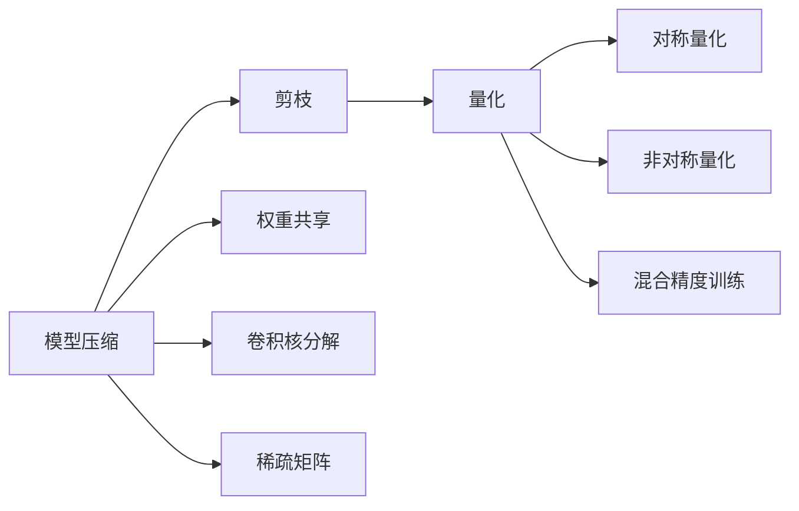

                 

# 模型加速与低精度计算原理与代码实战案例讲解

> 关键词：模型加速,低精度计算,原理,代码实战,深度学习

## 1. 背景介绍

随着深度学习模型的日益复杂，模型训练和推理所需的计算资源也呈指数级增长。这在一定程度上限制了深度学习技术在实际应用中的普及和发展。为了应对这一挑战，模型加速和低精度计算成为了深度学习领域的热门研究方向。模型加速主要通过优化模型结构、算法、硬件等手段，提升模型的计算效率和性能。低精度计算则是通过降低模型参数和计算精度，在保持较高精度的情况下，显著减少计算资源和存储开销。本文将深入探讨模型加速和低精度计算的原理与方法，并通过代码实战案例，详细介绍其实现步骤和注意事项。

## 2. 核心概念与联系

### 2.1 核心概念概述

模型加速和低精度计算涉及多个核心概念，包括模型压缩、量化、剪枝、混合精度训练等。下面对每个概念进行简要介绍：

- **模型压缩**：通过减少模型参数和计算量，降低模型的计算需求，从而提升计算效率。压缩方法包括权重剪枝、卷积核分解、稀疏矩阵等。
- **量化**：通过将模型参数和激活值从高精度浮点数（如32位浮点数）转换为低精度格式（如8位整数），减少计算和存储开销。量化方法包括对称量化、非对称量化、混合精度等。
- **剪枝**：通过删除模型中的冗余参数和结构，减少计算需求和内存占用。剪枝方法包括结构剪枝、权值剪枝、权重共享等。
- **混合精度训练**：结合高精度和低精度计算，在不牺牲精度的前提下，提升训练速度和模型存储效率。

这些方法通过不同的技术手段，共同实现了模型加速和低精度计算的目标。它们之间的关系可以简单概括为：模型压缩和剪枝通过减少模型复杂度，量化通过降低数据精度，混合精度训练则通过混合使用高精度和低精度计算，优化模型的计算效率。

### 2.2 核心概念的联系

模型加速和低精度计算之间的联系在于，它们都是通过优化模型的计算需求和资源使用，来提升模型的性能和效率。具体来说，模型压缩和剪枝可以减少模型的复杂度，从而降低计算量；量化则通过降低数据精度，减少计算资源和存储开销；混合精度训练则综合利用高精度和低精度计算的优势，提高训练速度和模型存储效率。

以下是一个简化的Mermaid流程图，展示模型加速和低精度计算的核心概念及其联系：



## 3. 核心算法原理 & 具体操作步骤

### 3.1 算法原理概述

模型加速和低精度计算的算法原理主要基于两个基本思想：优化计算和降低数据精度。

- **优化计算**：通过优化模型结构和算法，减少计算量和计算需求。具体方法包括模型压缩、剪枝、结构优化等。
- **降低数据精度**：通过将模型参数和激活值从高精度格式转换为低精度格式，减少计算和存储开销。具体方法包括量化、混合精度训练等。

这些方法的目标是尽可能地减少计算需求和资源使用，同时保持模型的性能和精度。通过结合使用这些方法，可以在不显著牺牲模型性能的前提下，大幅提升模型的训练和推理效率。

### 3.2 算法步骤详解

模型加速和低精度计算的实现步骤一般包括以下几个关键步骤：

1. **选择优化方法**：根据模型的特点和应用场景，选择合适的优化方法，如权重剪枝、量化、混合精度训练等。
2. **预训练模型**：使用大规模数据集对模型进行预训练，以便后续的优化操作不会显著影响模型性能。
3. **压缩模型**：对模型进行压缩操作，如剪枝、卷积核分解、稀疏矩阵等。
4. **量化模型**：将模型参数和激活值进行量化操作，如对称量化、非对称量化、混合精度等。
5. **混合精度训练**：结合高精度和低精度计算，进行混合精度训练。
6. **评估和优化**：在测试集上评估优化后的模型性能，根据评估结果进一步调整优化策略。

### 3.3 算法优缺点

模型加速和低精度计算的优缺点如下：

#### 优点

- **提升计算效率**：通过优化计算和降低数据精度，大幅减少计算资源和存储开销，提升模型训练和推理的速度。
- **保持高精度**：在优化过程中，通过精心的设计，可以保证模型的精度不受显著影响。
- **通用性强**：这些方法适用于各种类型的深度学习模型，包括卷积神经网络（CNN）、循环神经网络（RNN）、变压器（Transformer）等。

#### 缺点

- **精度损失**：通过降低数据精度和压缩模型，可能会在一定程度上损失模型精度。
- **模型复杂度增加**：优化操作可能增加模型的复杂度，影响模型的可解释性和维护性。
- **硬件要求高**：部分优化方法需要特定的硬件支持，如低精度计算需要低精度硬件和软件。

### 3.4 算法应用领域

模型加速和低精度计算在多个领域都有广泛应用，例如：

- **计算机视觉**：用于优化卷积神经网络（CNN）的计算效率，如卷积核分解、量化等。
- **自然语言处理**：用于优化Transformer模型的计算效率，如权重剪枝、混合精度训练等。
- **推荐系统**：用于优化模型的计算效率，提升推荐速度，如混合精度训练、量化等。
- **音频处理**：用于优化卷积神经网络（CNN）和循环神经网络（RNN）的计算效率，如量化、剪枝等。
- **生物信息学**：用于优化模型的计算效率，如剪枝、混合精度训练等。

## 4. 数学模型和公式 & 详细讲解

### 4.1 数学模型构建

模型加速和低精度计算涉及多个数学模型，包括模型压缩、量化等。下面对每个模型进行简要介绍：

- **模型压缩**：通过压缩操作，减少模型的参数数量和计算量。假设原模型参数数量为 $P$，压缩后模型参数数量为 $P'$，则有 $P' < P$。
- **量化**：将模型参数和激活值从高精度格式转换为低精度格式，假设原参数精度为 $b$ 位，量化后参数精度为 $b'$ 位，则有 $b' < b$。

### 4.2 公式推导过程

#### 模型压缩

假设原模型参数数量为 $P$，压缩后模型参数数量为 $P'$，则压缩率的定义为：

$$
压缩率 = \frac{P'}{P}
$$

#### 量化

假设原模型参数精度为 $b$ 位，量化后参数精度为 $b'$ 位，则量化率的定义为：

$$
量化率 = \frac{b'}{b}
$$

通过这些公式，可以计算出模型压缩和量化后模型的参数数量和精度损失。

### 4.3 案例分析与讲解

假设有一个包含 $P=1M$ 个参数的卷积神经网络（CNN）模型，原模型精度为32位浮点数。通过权重剪枝，保留70%的参数，则压缩后模型参数数量为 $P'=0.7M$。假设量化后参数精度为8位整数，则量化率为：

$$
量化率 = \frac{8}{32} = 0.25
$$

## 5. 项目实践：代码实例和详细解释说明

### 5.1 开发环境搭建

在进行模型加速和低精度计算的实践前，需要先搭建好开发环境。以下是使用Python和PyTorch进行开发的环境配置流程：

1. 安装Anaconda：从官网下载并安装Anaconda，用于创建独立的Python环境。
2. 创建并激活虚拟环境：
   ```bash
   conda create -n pytorch-env python=3.8 
   conda activate pytorch-env
   ```
3. 安装PyTorch：根据CUDA版本，从官网获取对应的安装命令。例如：
   ```bash
   conda install pytorch torchvision torchaudio cudatoolkit=11.1 -c pytorch -c conda-forge
   ```
4. 安装TensorBoard：用于可视化模型训练过程和评估结果。
   ```bash
   pip install tensorboard
   ```

### 5.2 源代码详细实现

下面以一个简单的卷积神经网络（CNN）模型为例，介绍如何使用PyTorch进行模型压缩和量化。

首先，定义一个简单的CNN模型：

```python
import torch
import torch.nn as nn
import torch.nn.functional as F

class CNN(nn.Module):
    def __init__(self):
        super(CNN, self).__init__()
        self.conv1 = nn.Conv2d(1, 32, 3, 1, 1)
        self.conv2 = nn.Conv2d(32, 64, 3, 1, 1)
        self.fc1 = nn.Linear(64*28*28, 128)
        self.fc2 = nn.Linear(128, 10)
    
    def forward(self, x):
        x = F.relu(self.conv1(x))
        x = F.max_pool2d(x, 2, 2)
        x = F.relu(self.conv2(x))
        x = F.max_pool2d(x, 2, 2)
        x = x.view(-1, 64*28*28)
        x = F.relu(self.fc1(x))
        x = self.fc2(x)
        return F.log_softmax(x, dim=1)
```

接下来，使用PyTorch的QuantStub和DeQuantStub模块进行量化：

```python
import torchvision.transforms as transforms

transform = transforms.Compose([
    transforms.ToTensor(),
    transforms.Normalize((0.5, 0.5, 0.5), (0.5, 0.5, 0.5))
])

# 加载训练数据
train_data = torchvision.datasets.CIFAR10(root='./data', train=True, download=True, transform=transform)
train_loader = torch.utils.data.DataLoader(train_data, batch_size=64, shuffle=True)

# 加载模型
model = CNN().to(device)

# 定义损失函数和优化器
criterion = nn.CrossEntropyLoss()
optimizer = torch.optim.Adam(model.parameters(), lr=0.001)

# 进行量化
model.qconfig = torch.quantization.get_default_qconfig('qnnpack')
model = torch.quantization.quantize_qat(model)

# 进行训练
for epoch in range(10):
    running_loss = 0.0
    for i, data in enumerate(train_loader, 0):
        inputs, labels = data
        inputs, labels = inputs.to(device), labels.to(device)
        optimizer.zero_grad()
        outputs = model(inputs)
        loss = criterion(outputs, labels)
        loss.backward()
        optimizer.step()
        running_loss += loss.item()
    print(f'Epoch {epoch+1}, loss: {running_loss/len(train_loader):.4f}')
```

这里使用了PyTorch的QuantStub和DeQuantStub模块进行量化操作，并指定了QNNPACK量化配置，以便在训练过程中进行量化。

### 5.3 代码解读与分析

在上述代码中，我们首先定义了一个简单的CNN模型。接着，使用PyTorch的QuantStub和DeQuantStub模块进行量化操作，并指定了QNNPACK量化配置。最后，通过指定训练集和优化器，进行模型的训练。

在训练过程中，由于模型进行了量化，因此输入和输出都是8位整数。在模型输出层，使用DeQuantStub模块进行反量化操作，恢复模型的浮点数输出。

## 6. 实际应用场景

### 6.1 计算机视觉

在计算机视觉领域，模型加速和低精度计算的应用非常广泛。例如，卷积神经网络（CNN）的参数量通常很大，需要通过量化和剪枝等方法进行优化。另外，实时视频监控和移动设备上的图像处理等场景，也对模型的计算速度和存储效率提出了很高的要求。

### 6.2 自然语言处理

在自然语言处理领域，Transformer模型的参数量也非常庞大。通过量化和剪枝等方法，可以显著减少模型的计算需求，提升模型的训练和推理速度。此外，混合精度训练在机器翻译、文本摘要等任务中也得到了广泛应用。

### 6.3 推荐系统

推荐系统的模型通常包含大量的神经网络层，需要通过量化和剪枝等方法进行优化。同时，推荐系统的实时性要求也非常高，需要通过混合精度训练等方法提升模型的计算效率。

### 6.4 未来应用展望

随着模型加速和低精度计算技术的不断发展，未来将在更多领域得到应用，为深度学习技术的发展带来新的动力。例如，在自动驾驶、工业控制等领域，通过模型加速和低精度计算，可以提升系统的实时性和可靠性，从而推动相关技术的发展和应用。

## 7. 工具和资源推荐

### 7.1 学习资源推荐

为了帮助开发者系统掌握模型加速和低精度计算的理论基础和实践技巧，这里推荐一些优质的学习资源：

1. 《深度学习基础》课程：由斯坦福大学开设的深度学习入门课程，涵盖深度学习的基本概念和经典模型。
2. 《深度学习入门：基于PyTorch的理论与实现》书籍：详细介绍PyTorch的基本操作和深度学习模型的实现。
3. 《TensorFlow官方文档》：TensorFlow的官方文档，提供了丰富的教程和样例代码。
4. 《深度学习：理论与实践》课程：由吴恩达教授开设的深度学习课程，涵盖深度学习的基本概念和应用。
5. 《Python深度学习》书籍：详细介绍深度学习模型的实现，并提供了丰富的代码示例。

### 7.2 开发工具推荐

高效的工具是模型加速和低精度计算开发的关键。以下是几款用于模型加速和低精度计算开发的常用工具：

1. PyTorch：基于Python的开源深度学习框架，支持动态图和静态图，适用于深度学习模型的实现和优化。
2. TensorFlow：由Google主导开发的开源深度学习框架，支持分布式训练和模型优化，适用于大规模深度学习模型的训练和部署。
3. TensorBoard：TensorFlow配套的可视化工具，可以实时监测模型训练状态和评估结果，方便调试和优化。
4. TVM：用于深度学习模型的编译和优化，支持多种硬件加速，适用于高效模型部署。
5. MXNet：由Apache支持的深度学习框架，支持分布式训练和多种硬件加速，适用于大规模深度学习模型的训练和部署。

### 7.3 相关论文推荐

模型加速和低精度计算的研究进展非常快，以下是几篇奠基性的相关论文，推荐阅读：

1. "Pruning Neural Networks without Any Data"（ICML 2015）：提出了基于结构剪枝的无数据剪枝方法，在剪枝过程中不使用标注数据，适用于大规模数据集不足的情况。
2. "Weight Quantization for Efficient ConvNets"（CVPR 2015）：提出基于权重剪枝和量化的方法，用于优化卷积神经网络（CNN）的计算效率。
3. "Towards Quantization-Aware Training for Efficient Neural Network Inference"（ICML 2016）：提出基于混合精度训练的量化方法，用于提升深度学习模型的推理速度。
4. "Deep Learning in Neuroscience: Bridging the Gap between Deep Learning and Neuroscience"（Trends in Cognitive Sciences 2017）：提出了深度学习在神经科学中的应用，包括模型压缩、量化等方法。
5. "Pruning of Deep Convolutional Neural Networks for Large-Scale Imaging"（NIPS 2017）：提出基于剪枝和量化的方法，用于优化大规模卷积神经网络（CNN）的计算效率。

## 8. 总结：未来发展趋势与挑战

### 8.1 研究成果总结

模型加速和低精度计算技术在深度学习领域取得了显著的进展，为深度学习模型的高效部署和应用提供了强有力的支持。通过模型压缩、量化、剪枝等方法，可以显著减少模型的计算需求和存储开销，提升模型的训练和推理效率。混合精度训练方法也在越来越多的场景中得到了应用，提升了深度学习模型的实时性和可靠性。

### 8.2 未来发展趋势

未来，模型加速和低精度计算技术将继续在深度学习领域得到广泛应用，推动深度学习技术在更多领域的应用和发展。以下是一些未来发展的趋势：

1. **更高效的压缩算法**：随着深度学习模型的日益复杂，模型的参数量和计算量也在不断增加。未来的压缩算法将更加高效，能够在不显著损失模型精度的情况下，大幅减少计算需求。
2. **更灵活的量化方法**：未来的量化方法将更加灵活，适用于更多类型的深度学习模型，同时能够更好地保持模型的精度。
3. **更全面的优化策略**：未来的优化策略将更加全面，结合模型压缩、量化、剪枝等方法，综合提升模型的计算效率和性能。
4. **更广泛的应用场景**：未来的模型加速和低精度计算技术将在更多领域得到应用，推动深度学习技术在工业界、医疗、自动驾驶等领域的落地和普及。

### 8.3 面临的挑战

尽管模型加速和低精度计算技术取得了显著进展，但在实际应用中仍然面临一些挑战：

1. **精度损失**：在模型压缩和量化过程中，可能会在一定程度上损失模型精度，影响模型的性能和可靠性。
2. **模型复杂度增加**：优化操作可能会增加模型的复杂度，影响模型的可解释性和维护性。
3. **硬件要求高**：部分优化方法需要特定的硬件支持，如低精度计算需要低精度硬件和软件。
4. **数据要求高**：部分优化方法需要大量的标注数据，数据获取和标注成本较高。

### 8.4 研究展望

面对模型加速和低精度计算技术所面临的挑战，未来的研究需要在以下几个方面寻求新的突破：

1. **高精度优化算法**：开发更加高效的高精度优化算法，减少计算需求的同时，保证模型的精度。
2. **低精度计算方法**：开发更加灵活的低精度计算方法，适用于更多类型的深度学习模型。
3. **硬件支持**：开发更加高效的硬件加速方法，支持低精度计算和其他优化操作。
4. **数据增强技术**：开发更多的数据增强技术，减少优化操作对标注数据的需求。
5. **模型解释性**：开发更加可解释的模型，帮助开发者更好地理解和调试模型。

## 9. 附录：常见问题与解答

**Q1：模型压缩和量化后，精度会损失多少？**

A: 模型压缩和量化后的精度损失取决于具体的优化方法和参数。一般来说，压缩率和量化率越高，精度损失也越大。例如，通过剪枝将模型参数数量减少一半，可能带来1%-2%的精度损失。通过量化将参数精度从32位浮点数降低到8位整数，可能带来5%-10%的精度损失。

**Q2：如何评估模型压缩和量化的效果？**

A: 评估模型压缩和量化的效果，可以使用以下指标：

- **精度**：使用测试集评估模型的精度，比较压缩前后的精度变化。
- **计算速度**：使用测试集评估模型的计算速度，比较压缩前后的计算速度变化。
- **模型大小**：比较压缩前后的模型大小，评估模型压缩的效果。

**Q3：如何进行混合精度训练？**

A: 混合精度训练通常需要以下步骤：

1. 定义模型的高精度和低精度部分。
2. 定义损失函数和优化器，选择高精度和低精度部分的计算方式。
3. 在训练过程中，交替使用高精度和低精度计算，以提升训练速度和模型存储效率。

**Q4：模型压缩和量化后，如何部署和测试？**

A: 模型压缩和量化后的部署和测试，需要注意以下几点：

1. 确保模型兼容目标平台和硬件。
2. 使用测试集评估模型的性能和精度。
3. 使用性能测试工具评估模型的计算速度和资源消耗。
4. 进行精度测试，评估模型在目标平台上的精度表现。

**Q5：模型压缩和量化有哪些应用场景？**

A: 模型压缩和量化在多个领域都有广泛应用，例如：

- **计算机视觉**：用于优化卷积神经网络（CNN）的计算效率，如卷积核分解、量化等。
- **自然语言处理**：用于优化Transformer模型的计算效率，如权重剪枝、混合精度训练等。
- **推荐系统**：用于优化模型的计算效率，提升推荐速度，如混合精度训练、量化等。
- **音频处理**：用于优化卷积神经网络（CNN）和循环神经网络（RNN）的计算效率，如量化、剪枝等。
- **生物信息学**：用于优化模型的计算效率，如剪枝、混合精度训练等。

通过合理应用模型压缩和量化技术，可以显著提升深度学习模型的计算效率和性能，推动深度学习技术在更多领域的应用和发展。

