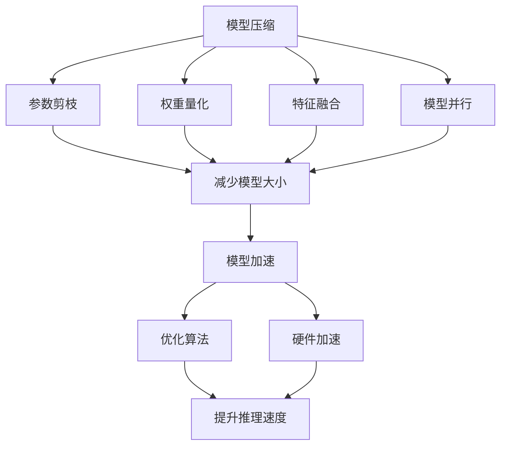
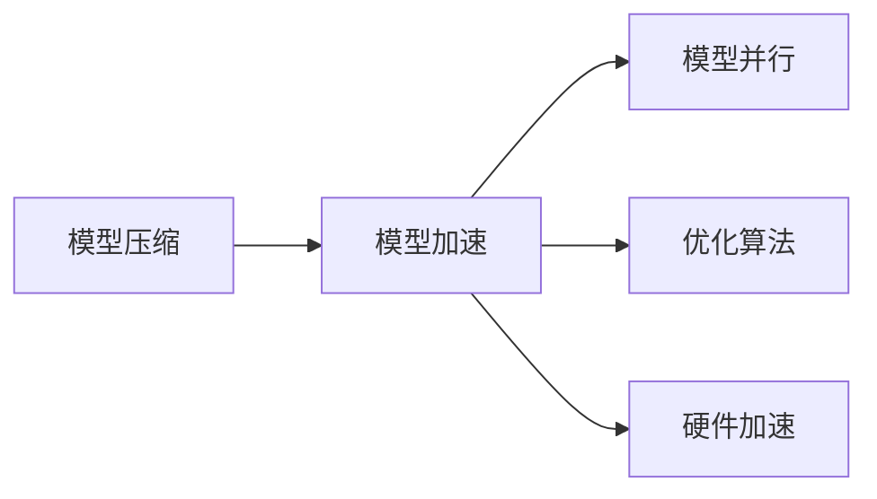
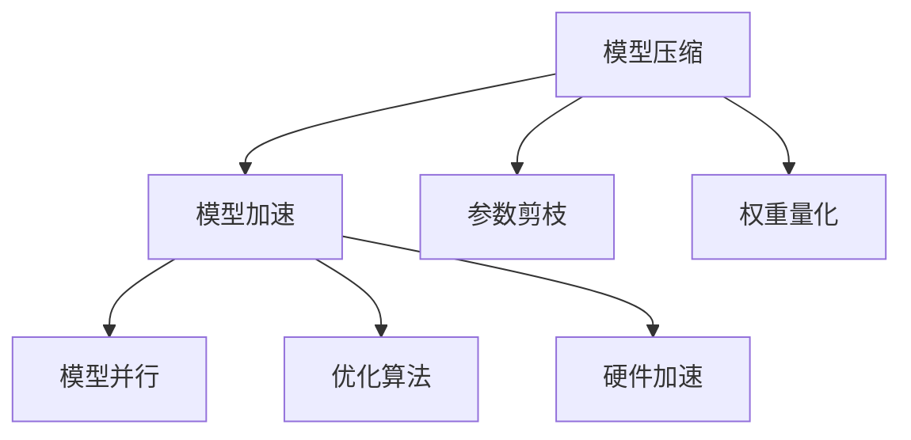
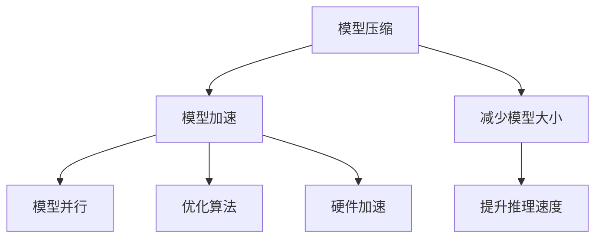
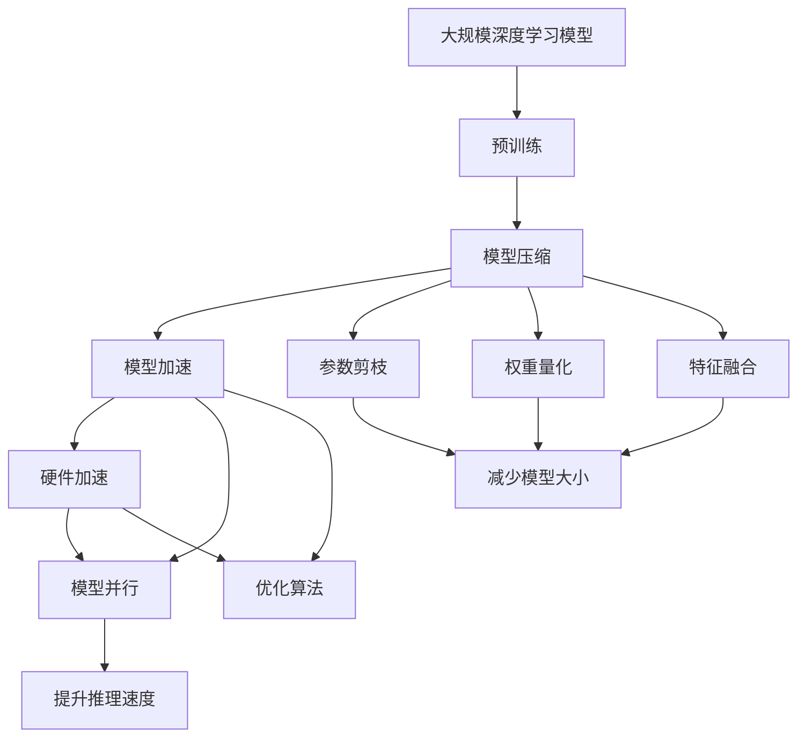

                 

# 模型压缩与加速原理与代码实战案例讲解

## 1. 背景介绍

### 1.1 问题由来

随着深度学习技术的迅猛发展，模型规模不断增大，带来了两个显著问题：模型大小和训练/推理时间。大模型通常具有数十亿甚至百亿的参数，导致模型在计算、存储和部署方面面临严峻挑战。此外，训练和推理大模型需要消耗大量的计算资源和时间，使得模型在实际应用中难以推广。

因此，模型压缩与加速技术应运而生。模型压缩旨在减小模型大小，减少计算和存储开销，从而降低资源需求。模型加速则通过优化模型结构，提升模型推理速度，加快模型响应时间，提高系统效率。

模型压缩与加速技术在大规模深度学习模型（如ImageNet、BERT等）上得到了广泛应用，极大地推动了深度学习技术的产业化进程。本文将详细介绍模型压缩与加速的原理与方法，并通过具体案例展示其实现过程和效果。

### 1.2 问题核心关键点

模型压缩与加速的核心问题可以归纳为以下几个关键点：

- 压缩方法：如何在保留模型性能的前提下减小模型大小？常见的压缩方法包括参数剪枝、权重量化、特征融合等。
- 加速方法：如何通过优化模型结构、量化、稀疏化等技术提升模型推理速度？加速技术包括模型并行、优化算法、硬件加速等。
- 压缩与加速结合：如何将压缩和加速技术结合起来，优化整个模型性能？
- 目标应用：不同应用场景下，如何选择合适的压缩和加速方法？

理解这些核心问题，对于掌握模型压缩与加速技术至关重要。本文将详细讲解这些关键问题，并通过具体案例展示其应用效果。

## 2. 核心概念与联系

### 2.1 核心概念概述

为了更好地理解模型压缩与加速技术，我们先介绍几个核心概念：

- **模型压缩**：通过移除冗余参数、减少特征数量等方法，在不显著降低模型性能的前提下，减小模型大小。常见方法包括参数剪枝、权重量化、特征融合等。
- **模型加速**：通过优化模型结构、量化、稀疏化等方法，提升模型推理速度。常见方法包括模型并行、优化算法、硬件加速等。
- **权衡点**：模型压缩与加速需要找到模型大小、推理速度和性能之间的最佳平衡点，以达到最优的资源利用效果。
- **训练与推理分离**：对于模型推理速度的提升，可以考虑将训练与推理分离，通过预训练模型或迁移学习等方式，降低推理计算量。
- **硬件加速**：通过GPU、TPU等高性能硬件，加速模型训练和推理过程，提升计算效率。

这些核心概念通过以下Mermaid流程图展示了它们之间的联系：



这个流程图展示了模型压缩与加速的关键技术和它们之间的关系。

### 2.2 概念间的关系

这些核心概念之间存在着紧密的联系，形成了模型压缩与加速的完整生态系统。下面我们通过几个Mermaid流程图来展示这些概念之间的关系。

#### 2.2.1 模型压缩与加速的关系



这个流程图展示了模型压缩和模型加速之间的关系。模型压缩可以通过减少参数和特征，降低计算和存储需求；而模型加速则通过优化算法和硬件加速，提升模型推理速度。

#### 2.2.2 压缩与加速结合



这个流程图展示了压缩与加速结合的方法。通过结合参数剪枝、权重量化等压缩方法，以及模型并行、优化算法、硬件加速等加速方法，可以最大化地优化模型性能。

#### 2.2.3 模型压缩与推理速度的权衡



这个流程图展示了模型压缩与推理速度之间的权衡关系。通过减少模型大小，可以降低计算和存储开销，但同时也会影响推理速度。如何平衡这两个因素，是模型压缩与加速中的关键问题。

### 2.3 核心概念的整体架构

最后，我们用一个综合的流程图来展示这些核心概念在大规模深度学习模型中的应用：



这个综合流程图展示了从预训练到模型压缩和加速的完整过程，以及各个关键技术的应用。

## 3. 核心算法原理 & 具体操作步骤

### 3.1 算法原理概述

模型压缩与加速的原理可以归纳为以下几点：

1. **参数剪枝（Pruning）**：通过移除冗余参数，减小模型大小，提升模型推理速度。
2. **权重量化（Quantization）**：将权重从浮点型转为整型或低精度类型，减小模型大小，提升推理速度。
3. **特征融合（Feature Fusion）**：通过合并相似的特征，减少特征数量，提升模型推理速度。
4. **模型并行（Model Parallelism）**：将模型分解为多个子模块，并行计算，提升模型推理速度。
5. **优化算法（Optimization Algorithms）**：通过优化算法，如Adam、SGD等，提升模型训练和推理效率。
6. **硬件加速（Hardware Acceleration）**：通过GPU、TPU等高性能硬件，加速模型训练和推理过程，提升计算效率。

这些技术可以单独应用，也可以结合使用，以达到最优的模型性能。

### 3.2 算法步骤详解

#### 3.2.1 参数剪枝

参数剪枝的目的是通过移除冗余参数，减小模型大小，提升推理速度。常见的参数剪枝方法包括：

1. **L1/L2正则化（Regularization）**：在损失函数中添加正则化项，惩罚权重的大小，移除冗余参数。
2. **Pruning by Threshold**：设定阈值，移除小于阈值的权重。
3. **Gradient-based Pruning**：根据梯度大小，移除梯度较小的权重。

以L1正则化为例，其损失函数可以表示为：

$$
\mathcal{L}(\theta) = \frac{1}{N} \sum_{i=1}^N \ell(M_{\theta}(x_i), y_i) + \lambda ||\theta||_1
$$

其中，$\lambda$ 为正则化系数，$||\theta||_1$ 为L1范数。

#### 3.2.2 权重量化

权重量化是将权重从浮点型转为整型或低精度类型，减小模型大小，提升推理速度。常见的权重量化方法包括：

1. **均匀量化（Uniform Quantization）**：将权重映射到一个固定范围，如$\{-8, -7, \cdots, 8\}$。
2. **非均匀量化（Non-Uniform Quantization）**：使用对称范围或非对称范围进行量化，如$\{-128, -127, \cdots, 127\}$。
3. **深度可分量化（Deep Divisible Quantization）**：将权重分成多个小范围，使用不同精度进行量化。

以均匀量化为例，其量化过程可以表示为：

$$
\mathcal{L}(\theta) = \frac{1}{N} \sum_{i=1}^N \ell(M_{\theta}(x_i), y_i) + \lambda ||\Delta\theta||_2^2
$$

其中，$\Delta\theta$ 为量化误差，$\lambda$ 为正则化系数。

#### 3.2.3 特征融合

特征融合是通过合并相似的特征，减少特征数量，提升模型推理速度。常见的特征融合方法包括：

1. **特征选择（Feature Selection）**：选择对模型性能影响大的特征，移除冗余特征。
2. **特征合并（Feature Concatenation）**：将相似的特征合并为一个特征，减小特征数量。
3. **特征降维（Feature Dimensionality Reduction）**：使用降维技术，如PCA、LDA等，减少特征数量。

以特征选择为例，其损失函数可以表示为：

$$
\mathcal{L}(\theta) = \frac{1}{N} \sum_{i=1}^N \ell(M_{\theta}(x_i), y_i) + \lambda ||\theta||_0
$$

其中，$\lambda$ 为正则化系数，$||\theta||_0$ 为L0范数，表示参数个数。

#### 3.2.4 模型并行

模型并行是将模型分解为多个子模块，并行计算，提升模型推理速度。常见的模型并行方法包括：

1. **数据并行（Data Parallelism）**：将模型分解为多个副本，并行计算不同批次的数据。
2. **模型并行（Model Parallelism）**：将模型分解为多个子模块，并行计算不同模块的输出。
3. **混合并行（Mixed Parallelism）**：结合数据并行和模型并行，提升模型推理速度。

以数据并行为例，其推理过程可以表示为：

$$
M_{\theta}(x) = \frac{1}{M} \sum_{m=1}^M M_{\theta_m}(x)
$$

其中，$M$ 为模型副本数，$M_{\theta_m}$ 为第$m$个模型副本。

#### 3.2.5 优化算法

优化算法通过优化模型参数，提升模型训练和推理效率。常见的优化算法包括：

1. **Adam**：自适应矩估计优化算法，适用于大规模深度学习模型。
2. **SGD**：随机梯度下降优化算法，适用于小规模深度学习模型。
3. **Adafactor**：自适应学习率优化算法，适用于分布式训练。

以Adam算法为例，其更新过程可以表示为：

$$
\theta \leftarrow \theta - \eta \frac{m}{\sqrt{v} + \epsilon} = \theta - \frac{\eta}{\sqrt{v} + \epsilon} g
$$

其中，$\eta$ 为学习率，$m$ 为梯度累加器，$v$ 为动量，$\epsilon$ 为防止除零的常数。

#### 3.2.6 硬件加速

硬件加速通过使用高性能硬件，加速模型训练和推理过程。常见的硬件加速方法包括：

1. **GPU**：图形处理器，适用于大规模深度学习模型。
2. **TPU**：张量处理器，适用于大规模深度学习模型。
3. **FPGA**：可编程门阵列，适用于特定计算需求的应用。

以GPU为例，其加速过程可以表示为：

$$
\mathcal{L}(\theta) = \frac{1}{N} \sum_{i=1}^N \ell(M_{\theta}(x_i), y_i) + \lambda ||\theta||_2^2
$$

其中，$\lambda$ 为正则化系数，$||\theta||_2^2$ 为L2范数，表示模型参数大小。

### 3.3 算法优缺点

模型压缩与加速方法具有以下优点：

1. **减小模型大小**：通过参数剪枝、权重量化、特征融合等方法，减小模型大小，降低计算和存储开销。
2. **提升推理速度**：通过模型并行、优化算法、硬件加速等方法，提升模型推理速度，加快模型响应时间。
3. **提高计算效率**：通过优化模型结构和算法，提高模型训练和推理效率，加速模型迭代。

同时，这些方法也存在以下缺点：

1. **性能损失**：压缩和加速技术可能会对模型性能产生一定的影响，如降低模型精度、增加计算误差等。
2. **实现复杂**：压缩和加速技术的实现过程较为复杂，需要综合考虑模型大小、推理速度和性能之间的平衡。
3. **数据依赖**：压缩和加速技术的效果很大程度上依赖于训练数据的质量和数量，获取高质量数据成本较高。

尽管存在这些缺点，但就目前而言，模型压缩与加速方法仍然是深度学习技术的重要组成部分。

### 3.4 算法应用领域

模型压缩与加速方法已经在多个领域得到了广泛应用，包括：

1. **计算机视觉**：在图像分类、目标检测、人脸识别等任务中，通过压缩和加速方法，提升模型推理速度，降低计算开销。
2. **自然语言处理**：在机器翻译、文本分类、问答系统等任务中，通过压缩和加速方法，提升模型推理速度，降低计算开销。
3. **语音识别**：在语音识别、语音合成等任务中，通过压缩和加速方法，提升模型推理速度，降低计算开销。
4. **推荐系统**：在推荐系统、广告推荐等任务中，通过压缩和加速方法，提升模型推理速度，降低计算开销。
5. **医疗影像**：在医疗影像、疾病诊断等任务中，通过压缩和加速方法，提升模型推理速度，降低计算开销。

## 4. 数学模型和公式 & 详细讲解 & 举例说明

### 4.1 数学模型构建

模型压缩与加速的数学模型构建，主要涉及以下几个方面：

1. **参数剪枝**：定义模型参数剪枝的条件，如阈值、梯度大小等。
2. **权重量化**：定义权重量化的方法，如均匀量化、非均匀量化等。
3. **特征融合**：定义特征融合的方法，如特征选择、特征合并等。
4. **模型并行**：定义模型并行的方式，如数据并行、模型并行等。
5. **优化算法**：定义优化算法的参数，如学习率、动量等。
6. **硬件加速**：定义硬件加速的方式，如GPU、TPU等。

#### 4.1.1 参数剪枝

参数剪枝的数学模型可以表示为：

$$
\mathcal{L}(\theta) = \frac{1}{N} \sum_{i=1}^N \ell(M_{\theta}(x_i), y_i) + \lambda ||\theta||_1
$$

其中，$\lambda$ 为正则化系数，$||\theta||_1$ 为L1范数，表示参数个数。

#### 4.1.2 权重量化

权重量化的数学模型可以表示为：

$$
\mathcal{L}(\theta) = \frac{1}{N} \sum_{i=1}^N \ell(M_{\theta}(x_i), y_i) + \lambda ||\Delta\theta||_2^2
$$

其中，$\Delta\theta$ 为量化误差，$\lambda$ 为正则化系数。

#### 4.1.3 特征融合

特征融合的数学模型可以表示为：

$$
\mathcal{L}(\theta) = \frac{1}{N} \sum_{i=1}^N \ell(M_{\theta}(x_i), y_i) + \lambda ||\theta||_0
$$

其中，$\lambda$ 为正则化系数，$||\theta||_0$ 为L0范数，表示参数个数。

#### 4.1.4 模型并行

模型并行的数学模型可以表示为：

$$
M_{\theta}(x) = \frac{1}{M} \sum_{m=1}^M M_{\theta_m}(x)
$$

其中，$M$ 为模型副本数，$M_{\theta_m}$ 为第$m$个模型副本。

#### 4.1.5 优化算法

优化算法的数学模型可以表示为：

$$
\theta \leftarrow \theta - \eta \frac{m}{\sqrt{v} + \epsilon} = \theta - \frac{\eta}{\sqrt{v} + \epsilon} g
$$

其中，$\eta$ 为学习率，$m$ 为梯度累加器，$v$ 为动量，$\epsilon$ 为防止除零的常数。

#### 4.1.6 硬件加速

硬件加速的数学模型可以表示为：

$$
\mathcal{L}(\theta) = \frac{1}{N} \sum_{i=1}^N \ell(M_{\theta}(x_i), y_i) + \lambda ||\theta||_2^2
$$

其中，$\lambda$ 为正则化系数，$||\theta||_2^2$ 为L2范数，表示模型参数大小。

### 4.2 公式推导过程

以下我们以参数剪枝为例，推导其数学模型的具体推导过程。

假设模型包含$N$个参数，其中$n$个参数被保留，剩余参数被剪枝。剪枝的条件可以表示为：

$$
||\theta_i||_2 < \alpha
$$

其中，$\alpha$ 为剪枝阈值。对于被剪枝的参数，可以将其初始化为一个极小值，如$0$。

在剪枝后的模型中，新的损失函数可以表示为：

$$
\mathcal{L}_{pruned}(\theta) = \frac{1}{N} \sum_{i=1}^N \ell(M_{\theta_{pruned}}(x_i), y_i) + \lambda ||\theta_{pruned}||_1
$$

其中，$\ell$ 为损失函数，$\theta_{pruned}$ 为剪枝后的模型参数。

为了便于推导，我们可以将$\theta_{pruned}$ 表示为：

$$
\theta_{pruned} = \begin{bmatrix}
\theta_{retained} \\
\theta_{pruned}
\end{bmatrix}
$$

其中，$\theta_{retained}$ 为保留的参数，$\theta_{pruned}$ 为被剪枝的参数。

将$\theta_{pruned}$ 代入新的损失函数中，得到：

$$
\mathcal{L}_{pruned}(\theta) = \frac{1}{N} \sum_{i=1}^N \ell(M_{\theta_{retained}}(x_i), y_i) + \lambda ||\theta_{retained}||_1
$$

其中，$\ell$ 为损失函数，$\theta_{retained}$ 为保留的参数。

将$\theta_{retained}$ 表示为：

$$
\theta_{retained} = \begin{bmatrix}
\theta_1 \\
\theta_2 \\
\vdots \\
\theta_n
\end{bmatrix}
$$

其中，$\theta_1, \theta_2, \cdots, \theta_n$ 为保留的参数。

将$\theta_{retained}$ 代入新的损失函数中，得到：

$$
\mathcal{L}_{pruned}(\theta) = \frac{1}{N} \sum_{i=1}^N \ell(M_{\theta_{retained}}(x_i), y_i) + \lambda ||\theta_{retained}||_1
$$

其中，$\ell$ 为损失函数，$\theta_{retained}$ 为保留的参数。

对于保留的参数，其损失函数可以表示为：

$$
\mathcal{L}_{retained}(\theta) = \frac{1}{N} \sum_{i=1}^N \ell(M_{\theta_{retained}}(x_i), y_i)
$$

因此，新的损失函数可以表示为：

$$
\mathcal{L}_{pruned}(\theta) = \mathcal{L}_{retained}(\theta) + \lambda ||\theta_{retained}||_1
$$

其中，$\mathcal{L}_{retained}$ 为保留参数的损失函数，$\lambda$ 为正则化系数。

### 4.3 案例分析与讲解

下面我们以一个具体案例来说明参数剪枝的实现过程。

假设我们有一个深度卷积神经网络（CNN）模型，包含$10000$个参数，其中$5000$个参数被保留，剩余$5000$个参数被剪枝。剪枝条件为$||\theta_i||_2 < 1$。

在剪枝后，新的损失函数可以表示为：

$$
\mathcal{L}_{pruned}(\theta) = \frac{1}{N} \sum_{i=1}^N \ell(M_{\theta_{retained}}(x_i), y_i) + \lambda ||\theta_{retained}||_1
$$

其中，$\ell$ 为损失函数，$\theta_{retained}$ 为保留的参数。

保留的参数有$5000$个，可以表示为：

$$
\theta_{retained} = \begin{bmatrix}
\theta_1 \\
\theta_2 \\
\vdots \\
\theta_5000
\end{bmatrix}
$$

其中，$\theta_1, \theta_2, \cdots, \theta_5000$ 为保留的参数。

对于保留的参数，其损失函数可以表示为：

$$
\mathcal{L}_{retained}(\theta) = \frac{1}{N} \sum_{i=1}^N \ell(M_{\theta_{retained}}(x_i), y_i)
$$

因此，新的损失函数可以表示为：

$$
\mathcal{L}_{pruned}(\theta) = \mathcal{L}_{retained}(\theta) + \lambda ||\theta_{retained}||_1
$$

其中，$\mathcal{L}_{retained}$ 为保留参数的损失函数，$\lambda$ 为正则化系数。

通过参数剪枝，我们可以显著减小模型大小，提升推理速度。同时，保留的参数经过充分训练，可以保持模型的性能。

## 5. 项目实践：代码实例和详细解释说明

### 5.1 开发环境搭建

在进行模型压缩与加速实践前，我们需要准备好开发环境。以下是使用Python进行TensorFlow开发的环境配置流程：

1. 安装Anaconda：从官网下载并安装Anaconda，用于创建独立的Python环境。

2. 创建并激活虚拟环境：
```bash
conda create -n tf-env python=3.8 
conda activate tf-env
```

3. 安装TensorFlow：根据CUDA版本，从官网获取对应的安装命令。例如：
```bash
conda install tensorflow -c pytorch -c conda-forge
```

4. 安装TensorBoard：
```bash
pip install tensorboard
```

5. 安装numpy、scikit-learn等工具包：
```bash
pip install numpy scipy scikit-learn
```

完成上述步骤后，即可在`tf-env`环境中开始模型压缩与加速实践。

### 5.2 源代码详细实现

下面我们以一个具体案例来说明参数剪枝的实现过程。

假设我们有一个深度卷积神经网络（CNN）模型，包含$10000$个参数，其中$5000$个参数被保留，剩余$5000$个参数被剪枝。剪枝条件为$||\theta_i||_2 < 1$。

首先，定义模型和数据集：

```python
import tensorflow as tf
from tensorflow.keras import layers
from tensorflow.keras.datasets import mnist
from tensorflow.keras.losses import sparse_categorical_crossentropy
from tensorflow.keras.optimizers import Adam

# 定义模型
model = tf.keras.Sequential([
    layers.Conv2D(32, (3, 3), activation='relu', input_shape=(28, 28, 1)),
    layers.MaxPooling2D((2, 2)),
    layers.Conv2D(64, (3, 3), activation='relu'),
    layers.MaxPooling2D((2, 2)),
    layers.Flatten(),
    layers.Dense(10, activation='softmax')
])

# 加载MNIST数据集
(x_train, y_train), (x_test, y_test) = mnist.load_data()
x_train = x_train.reshape(-1, 28, 28, 1).astype('float32') / 255
x_test = x_test.reshape(-1, 28, 28, 1).astype('float32') / 255
y_train = tf.keras.utils.to_categorical(y_train, 10)
y_test = tf.keras.utils.to_categorical(y_test, 10)

# 定义损失函数和优化器
loss_fn = sparse_categorical_crossentropy
optimizer = Adam(learning_rate=0.001)
```

然后，定义参数剪枝过程：

```python
# 定义剪枝函数
def prune_model(model, threshold):


