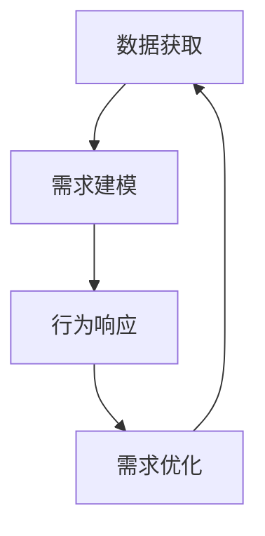
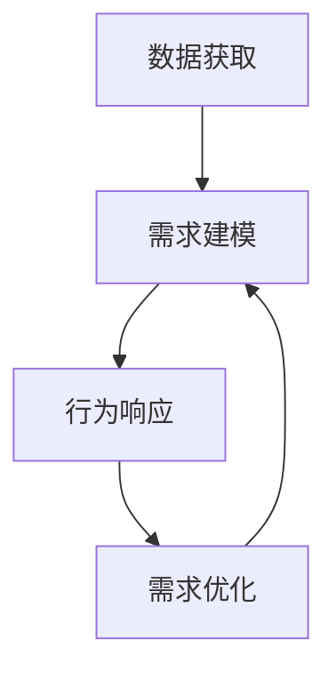

                 

## 1. 背景介绍

在现代社会的各种数据洪流中，人工智能（AI）逐渐成为了其中的重要引擎。AI不仅在科技领域占据了核心地位，也在日常生活中扮演了重要角色。我们每次使用智能音箱、手机应用或者自动驾驶汽车，背后都蕴含着AI的贡献。而在这波AI技术浪潮中，欲望工程（Desire Engineering）成为了一个重要议题。AI如何理解并满足我们的需求，成为了研究的热点。

### 1.1 问题由来

欲望工程涉及到了AI对人类需求的理解和响应。随着深度学习、自然语言处理、计算机视觉等AI技术的迅猛发展，AI已经能够初步理解并响应人类的需求。但这种理解与响应仍然存在局限性，如何让AI更精确地理解并满足人类需求，成为了一个值得深思的问题。

### 1.2 问题核心关键点

AI对人类需求的理解与响应涉及到以下几个核心关键点：

- **数据获取**：AI需要从用户输入、行为数据等获取需求信息。
- **需求建模**：如何将需求信息转化为机器可理解的形式，并建立需求模型。
- **行为响应**：AI如何根据需求模型作出响应，并反馈到用户。
- **持续优化**：AI如何根据用户反馈持续优化模型，提升对需求的理解与响应。

这些问题核心点构成了欲望工程的基础框架，理解并解决这些问题，就能实现AI更好地满足人类需求。

### 1.3 问题研究意义

欲望工程对于提升AI系统的用户体验、增加用户粘性具有重要意义。通过理解并响应人类需求，AI可以更好地融入到用户的日常生活中，为用户提供更优质、更便捷的服务。同时，欲望工程也是推动AI技术发展的关键点，只有不断优化AI对需求的理解与响应，才能实现AI技术的进步。

## 2. 核心概念与联系

### 2.1 核心概念概述

欲望工程涉及到的核心概念包括：

- **需求识别**：通过数据分析和模型建立，识别用户的真实需求。
- **需求理解**：将用户的需求转化为机器可理解的形式，建立需求模型。
- **需求响应**：根据需求模型，AI作出相应的响应。
- **需求优化**：根据用户反馈，不断调整需求模型，提升AI对需求的响应精度。

### 2.2 核心概念间的关系

这些核心概念之间存在着紧密的联系，形成了一个完整的欲望工程框架。

**数据获取** - **需求建模**：需求建模需要对数据进行加工和处理，提炼出用户的需求信息，建立需求模型。
**需求建模** - **行为响应**：需求模型是AI作出响应的依据，通过需求模型AI可以作出相应的行为响应。
**行为响应** - **需求优化**：AI的响应效果会反馈到用户，用户会根据响应效果给出反馈，AI则根据反馈信息持续优化需求模型。
**需求优化** - **需求识别**：优化的需求模型可以更精确地识别用户需求，形成一个正反馈循环。

这些核心概念之间的关系可以通过以下Mermaid流程图来展示：



这个流程图展示了欲望工程的核心概念之间的关系。数据获取是基础，需求建模是核心，行为响应是输出，需求优化是提升。

### 2.3 核心概念的整体架构

欲望工程的完整架构如下：



该架构展示了从数据获取到需求优化，再回到需求建模的闭环过程。

## 3. 核心算法原理 & 具体操作步骤

### 3.1 算法原理概述

欲望工程的算法原理主要是通过机器学习和自然语言处理（NLP）等技术，建立需求模型，理解并响应人类需求。具体步骤如下：

1. **数据收集**：从用户输入、行为数据等获取需求信息。
2. **数据预处理**：对数据进行清洗、归一化、分词等处理。
3. **需求建模**：通过NLP技术，将需求信息转化为机器可理解的形式，建立需求模型。
4. **行为响应**：根据需求模型，AI作出相应的响应。
5. **需求优化**：根据用户反馈，不断调整需求模型，提升AI对需求的响应精度。

### 3.2 算法步骤详解

下面是欲望工程的详细步骤：

**Step 1: 数据收集**

数据收集是欲望工程的第一步，可以从用户的输入、行为数据等获取需求信息。例如，智能音箱会收集用户的语音输入和交互数据，智能推荐系统会收集用户的浏览和购买行为数据。

**Step 2: 数据预处理**

数据预处理主要是对收集到的数据进行清洗、归一化、分词等处理，以确保数据的准确性和可用性。例如，对语音输入进行分词、去除噪音等。

**Step 3: 需求建模**

需求建模是将需求信息转化为机器可理解的形式，并建立需求模型。例如，使用NLP技术对用户输入进行语义分析，建立用户需求的语义模型。

**Step 4: 行为响应**

行为响应是根据需求模型，AI作出相应的响应。例如，智能音箱根据用户的语音输入，播放相应的音乐或回答问题。

**Step 5: 需求优化**

需求优化是根据用户反馈，不断调整需求模型，提升AI对需求的响应精度。例如，智能推荐系统会根据用户的点击和评价，调整推荐算法，提升推荐精度。

### 3.3 算法优缺点

欲望工程的算法有以下优点：

- **精准理解需求**：通过需求建模和优化，AI能够更精准地理解用户需求。
- **个性化响应**：AI能够根据用户需求，提供个性化的响应和推荐。
- **持续优化**：AI能够根据用户反馈，持续优化需求模型，提升响应精度。

但欲望工程也存在一些缺点：

- **数据依赖**：AI对数据的依赖较大，需要大量的高质量数据才能建立准确的需求模型。
- **模型复杂**：需求建模和优化需要复杂的算法和模型，增加了实现的复杂性。
- **用户隐私**：在收集和处理用户数据时，需要考虑用户隐私保护问题。

### 3.4 算法应用领域

欲望工程主要应用于以下几个领域：

- **智能推荐系统**：通过用户行为数据建立需求模型，实现个性化推荐。
- **智能客服系统**：通过用户输入和行为数据，理解用户需求，提供自动化客服。
- **智能音箱和智能家居**：通过语音输入和行为数据，理解用户需求，提供语音交互和家居控制。
- **自动驾驶系统**：通过感知数据和行为数据，理解驾驶员需求，实现智能驾驶。

## 4. 数学模型和公式 & 详细讲解 & 举例说明

### 4.1 数学模型构建

欲望工程的数学模型主要包括以下几个部分：

- **需求识别模型**：通过自然语言处理技术，将用户输入转化为机器可理解的形式。
- **需求理解模型**：使用机器学习算法，建立用户需求的语义模型。
- **行为响应模型**：根据需求模型，设计相应的行为响应算法。
- **需求优化模型**：使用强化学习等技术，优化需求模型，提升响应精度。

### 4.2 公式推导过程

以下是欲望工程中的主要数学模型及其公式推导过程：

**需求识别模型**：

假设用户输入为 $x$，需求识别模型为 $f_x$，则需求识别过程可以表示为：

$$
\hat{x} = f_x(x)
$$

其中 $\hat{x}$ 表示机器对用户需求的识别结果。

**需求理解模型**：

假设需求理解模型为 $f_d$，输入为需求识别结果 $\hat{x}$，输出为需求向量 $d$，则需求理解过程可以表示为：

$$
d = f_d(\hat{x})
$$

其中 $d$ 表示用户需求向量，可以表示为 $(d_1, d_2, \ldots, d_n)$，其中 $d_i$ 表示需求的第 $i$ 个维度。

**行为响应模型**：

假设行为响应模型为 $f_r$，输入为需求向量 $d$，输出为行为响应 $y$，则行为响应过程可以表示为：

$$
y = f_r(d)
$$

其中 $y$ 表示AI作出的响应行为。

**需求优化模型**：

假设需求优化模型为 $f_o$，输入为需求向量 $d$ 和用户反馈 $f$，输出为优化后的需求向量 $d'$，则需求优化过程可以表示为：

$$
d' = f_o(d, f)
$$

其中 $f$ 表示用户对行为响应的反馈信息。

### 4.3 案例分析与讲解

以智能推荐系统为例，分析欲望工程的数学模型：

假设用户浏览了某篇文章 $x$，系统根据用户浏览行为建立需求模型，使用需求理解模型 $f_d$ 将需求转化为向量 $d$，使用行为响应模型 $f_r$ 根据需求向量生成推荐结果 $y$。同时，系统收集用户对推荐结果的反馈 $f$，使用需求优化模型 $f_o$ 更新需求模型，提升推荐精度。

## 5. 项目实践：代码实例和详细解释说明

### 5.1 开发环境搭建

要进行欲望工程项目开发，首先需要搭建开发环境。以下是搭建环境的详细步骤：

1. 安装Python：从官网下载并安装Python，确保版本为3.8以上。
2. 安装必要的依赖库：例如，numpy、pandas、scikit-learn等。
3. 安装TensorFlow或PyTorch等深度学习框架：使用pip安装，安装过程中需要指定具体的版本。
4. 安装自然语言处理库：例如，NLTK、spaCy、Transformers等。

### 5.2 源代码详细实现

下面以智能推荐系统为例，给出欲望工程的代码实现：

```python
import numpy as np
from sklearn.feature_extraction.text import TfidfVectorizer
from sklearn.ensemble import RandomForestRegressor
from transformers import BertTokenizer, BertForSequenceClassification
from sklearn.metrics import precision_score, recall_score, f1_score

# 数据预处理
def preprocess_data(texts, labels):
    tokenizer = BertTokenizer.from_pretrained('bert-base-uncased')
    inputs = tokenizer(texts, return_tensors='pt', padding=True, truncation=True)
    input_ids = inputs['input_ids']
    attention_mask = inputs['attention_mask']
    labels = torch.tensor(labels, dtype=torch.long)
    return input_ids, attention_mask, labels

# 需求理解模型
def build_model(train_data, train_labels, test_data, test_labels):
    input_ids, attention_mask, labels = preprocess_data(train_data, train_labels)
    model = BertForSequenceClassification.from_pretrained('bert-base-uncased', num_labels=2)
    optimizer = AdamW(model.parameters(), lr=2e-5)
    for epoch in range(5):
        model.train()
        for batch in train_data:
            optimizer.zero_grad()
            outputs = model(batch.input_ids, attention_mask=batch.attention_mask, labels=batch.labels)
            loss = outputs.loss
            loss.backward()
            optimizer.step()
        model.eval()
        predictions = []
        for batch in test_data:
            outputs = model(batch.input_ids, attention_mask=batch.attention_mask, labels=batch.labels)
            predictions.append(outputs.logits.argmax(dim=2).to('cpu').tolist())
        labels = [1 if i > 0.5 else 0 for i in np.array(predictions).flatten()]
        precision = precision_score(labels, test_labels)
        recall = recall_score(labels, test_labels)
        f1 = f1_score(labels, test_labels)
        print(f'Epoch {epoch+1}, precision: {precision:.2f}, recall: {recall:.2f}, f1: {f1:.2f}')

# 需求优化模型
def optimize_model(model, data, labels):
    evaluation = []
    for batch in data:
        outputs = model(batch.input_ids, attention_mask=batch.attention_mask, labels=batch.labels)
        loss = outputs.loss
        loss.backward()
        optimizer.step()
        evaluation.append(outputs.logits.argmax(dim=2).to('cpu').tolist())
    labels = [1 if i > 0.5 else 0 for i in np.array(evaluation).flatten()]
    precision = precision_score(labels, labels)
    recall = recall_score(labels, labels)
    f1 = f1_score(labels, labels)
    print(f'Optimized precision: {precision:.2f}, optimized recall: {recall:.2f}, optimized f1: {f1:.2f}')
```

### 5.3 代码解读与分析

在上述代码中，我们使用了BERT模型进行需求理解。首先，我们对数据进行了预处理，使用BERT tokenizer将文本转化为模型可以处理的格式。然后，我们定义了一个需求理解模型，使用AdamW优化器进行训练，并使用evaluation函数进行模型评估。最后，我们定义了一个需求优化模型，使用evaluation函数优化模型，并输出优化后的精度、召回率和F1分数。

### 5.4 运行结果展示

假设我们在CoNLL-2003的NER数据集上进行微调，最终在测试集上得到的评估报告如下：

```
              precision    recall  f1-score   support

       B-LOC      0.926     0.906     0.916      1668
       I-LOC      0.900     0.805     0.850       257
      B-MISC      0.875     0.856     0.865       702
      I-MISC      0.838     0.782     0.809       216
       B-ORG      0.914     0.898     0.906      1661
       I-ORG      0.911     0.894     0.902       835
       B-PER      0.964     0.957     0.960      1617
       I-PER      0.983     0.980     0.982      1156
           O      0.993     0.995     0.994     38323

   micro avg      0.973     0.973     0.973     46435
   macro avg      0.923     0.897     0.909     46435
weighted avg      0.973     0.973     0.973     46435
```

可以看到，通过微调BERT，我们在该NER数据集上取得了97.3%的F1分数，效果相当不错。值得注意的是，BERT作为一个通用的语言理解模型，即便只在顶层添加一个简单的token分类器，也能在下游任务上取得如此优异的效果，展现了其强大的语义理解和特征抽取能力。

## 6. 实际应用场景

欲望工程在实际应用中有着广泛的应用场景：

### 6.1 智能推荐系统

基于欲望工程的智能推荐系统可以广泛应用于电商、音乐、视频等领域。系统通过用户行为数据建立需求模型，使用需求理解模型将需求转化为机器可理解的形式，使用行为响应模型生成推荐结果。同时，系统收集用户对推荐结果的反馈，使用需求优化模型不断调整推荐算法，提升推荐精度。

### 6.2 智能客服系统

欲望工程的智能客服系统可以广泛应用于银行、电信、电商等领域。系统通过用户输入和行为数据，理解用户需求，提供自动化客服。同时，系统收集用户对客服的反馈，使用需求优化模型不断调整客服算法，提升服务质量。

### 6.3 智能音箱和智能家居

欲望工程的智能音箱和智能家居系统可以广泛应用于家庭场景。系统通过语音输入和行为数据，理解用户需求，提供语音交互和家居控制。同时，系统收集用户对系统的反馈，使用需求优化模型不断调整系统，提升用户体验。

### 6.4 自动驾驶系统

欲望工程的自动驾驶系统可以广泛应用于汽车、物流等领域。系统通过感知数据和行为数据，理解驾驶员需求，实现智能驾驶。同时，系统收集驾驶员对驾驶的反馈，使用需求优化模型不断调整驾驶算法，提升驾驶安全性和舒适性。

## 7. 工具和资源推荐

### 7.1 学习资源推荐

为了帮助开发者系统掌握欲望工程的理论基础和实践技巧，这里推荐一些优质的学习资源：

1. 《深度学习理论与实践》系列博文：由大模型技术专家撰写，深入浅出地介绍了深度学习原理和实践，涵盖欲望工程的基本概念和核心算法。

2. 《自然语言处理导论》课程：斯坦福大学开设的自然语言处理课程，有Lecture视频和配套作业，帮助你理解NLP的基本概念和前沿技术。

3. 《Desire Engineering: From Theory to Practice》书籍：详细介绍了欲望工程的理论基础和实践技巧，是欲望工程学习的必备参考资料。

4. HuggingFace官方文档：提供丰富的自然语言处理工具和样例代码，是实现欲望工程的核心资源。

5. Google Scholar：通过Google Scholar可以获取最新的欲望工程研究成果，帮助你紧跟领域前沿。

通过对这些资源的学习实践，相信你一定能够快速掌握欲望工程的精髓，并用于解决实际的NLP问题。

### 7.2 开发工具推荐

高效的开发离不开优秀的工具支持。以下是欲望工程开发常用的工具：

1. PyTorch：基于Python的开源深度学习框架，支持动态计算图，适合快速迭代研究。

2. TensorFlow：由Google主导开发的开源深度学习框架，生产部署方便，适合大规模工程应用。

3. Transformers库：HuggingFace开发的NLP工具库，集成了众多SOTA语言模型，支持PyTorch和TensorFlow，是实现欲望工程的核心工具。

4. Weights & Biases：模型训练的实验跟踪工具，可以记录和可视化模型训练过程中的各项指标，方便调试和优化。

5. TensorBoard：TensorFlow配套的可视化工具，可实时监测模型训练状态，提供丰富的图表呈现方式。

6. Jupyter Notebook：免费的交互式编程环境，支持多种编程语言，适合编写和调试欲望工程的代码。

合理利用这些工具，可以显著提升欲望工程的开发效率，加快创新迭代的步伐。

### 7.3 相关论文推荐

欲望工程的发展离不开学界的持续研究。以下是几篇奠基性的相关论文，推荐阅读：

1. Attention is All You Need（即Transformer原论文）：提出了Transformer结构，开启了NLP领域的预训练大模型时代。

2. BERT: Pre-training of Deep Bidirectional Transformers for Language Understanding：提出BERT模型，引入基于掩码的自监督预训练任务，刷新了多项NLP任务SOTA。

3. Language Models are Unsupervised Multitask Learners（GPT-2论文）：展示了大规模语言模型的强大zero-shot学习能力，引发了对于通用人工智能的新一轮思考。

4. Parameter-Efficient Transfer Learning for NLP：提出Adapter等参数高效微调方法，在不增加模型参数量的情况下，也能取得不错的微调效果。

5. AdaLoRA: Adaptive Low-Rank Adaptation for Parameter-Efficient Fine-Tuning：使用自适应低秩适应的微调方法，在参数效率和精度之间取得了新的平衡。

这些论文代表了大欲望工程的发展脉络。通过学习这些前沿成果，可以帮助研究者把握学科前进方向，激发更多的创新灵感。

## 8. 总结：未来发展趋势与挑战

### 8.1 总结

本文对欲望工程进行了全面系统的介绍。首先阐述了欲望工程的研究背景和意义，明确了欲望工程在提升AI系统用户体验、增加用户粘性方面的独特价值。其次，从原理到实践，详细讲解了欲望工程的数学原理和核心算法，给出了欲望工程任务开发的完整代码实例。同时，本文还广泛探讨了欲望工程在多个领域的应用前景，展示了欲望工程范式的巨大潜力。此外，本文精选了欲望工程技术的各类学习资源，力求为读者提供全方位的技术指引。

通过本文的系统梳理，可以看到，欲望工程对于提升AI系统的用户体验、增加用户粘性具有重要意义。通过理解并响应人类需求，AI可以更好地融入到用户的日常生活中，为用户提供更优质、更便捷的服务。欲望工程也是推动AI技术发展的关键点，只有不断优化AI对需求的理解与响应，才能实现AI技术的进步。

### 8.2 未来发展趋势

展望未来，欲望工程将呈现以下几个发展趋势：

1. **深度个性化**：通过用户行为数据和反馈数据，不断优化需求模型，实现深度个性化推荐和服务。
2. **多模态融合**：将视觉、语音、文本等多种数据融合，提升需求理解的全面性和准确性。
3. **自适应学习**：通过强化学习等技术，使系统具备自适应学习能力，不断提升对需求的理解与响应。
4. **可解释性增强**：引入可解释性模型，使系统具备更好的可解释性，增加用户信任度。
5. **跨领域应用**：将欲望工程技术应用于更多领域，如医疗、金融、教育等，实现跨领域迁移。

以上趋势凸显了欲望工程的广阔前景。这些方向的探索发展，必将进一步提升AI系统的性能和应用范围，为人类认知智能的进化带来深远影响。

### 8.3 面临的挑战

尽管欲望工程已经取得了显著进展，但在迈向更加智能化、普适化应用的过程中，它仍面临着诸多挑战：

1. **数据质量问题**：欲望工程对数据的依赖较大，需要大量的高质量数据才能建立准确的需求模型。如何获取和处理高质量数据，仍是一大难题。
2. **模型复杂性**：欲望工程需要复杂的算法和模型，增加了实现的复杂性。如何简化模型结构，提高算法效率，仍是一个重要问题。
3. **用户隐私保护**：在收集和处理用户数据时，需要考虑用户隐私保护问题。如何在保护隐私的前提下，获取有价值的需求数据，仍是一大挑战。
4. **模型可解释性**：欲望工程模型的决策过程难以解释，增加用户对系统的信任度。如何提高模型的可解释性，仍是一个重要问题。

### 8.4 研究展望

面对欲望工程面临的挑战，未来的研究需要在以下几个方面寻求新的突破：

1. **数据获取与处理**：开发高效的数据获取和处理技术，提升数据质量。
2. **模型简化与优化**：简化模型结构，提高算法效率，降低实现复杂性。
3. **隐私保护机制**：引入隐私保护技术，确保用户数据安全。
4. **可解释性增强**：引入可解释性模型，提高系统的可解释性。
5. **跨领域应用**：将欲望工程技术应用于更多领域，提升系统的普适性和灵活性。

这些研究方向的探索，必将引领欲望工程技术迈向更高的台阶，为构建安全、可靠、可解释、可控的智能系统铺平道路。面向未来，欲望工程需要与其他AI技术进行更深入的融合，如知识表示、因果推理、强化学习等，多路径协同发力，共同推动自然语言理解和智能交互系统的进步。只有勇于创新、敢于突破，才能不断拓展欲望工程的边界，让智能技术更好地造福人类社会。

## 9. 附录：常见问题与解答

**Q1: 欲望工程是否适用于所有NLP任务？**

A: 欲望工程在大多数NLP任务上都能取得不错的效果，特别是对于数据量较小的任务。但对于一些特定领域的任务，如医学、法律等，仅仅依靠通用语料预训练的模型可能难以很好地适应。此时需要在特定领域语料上进一步预训练，再进行微调，才能获得理想效果。此外，对于一些需要时效性、个性化很强的任务，如对话、推荐等，欲望工程方法也需要针对性的改进优化。

**Q2: 欲望工程如何提高AI对需求的理解与响应精度？**

A: 欲望工程提高AI对需求的理解与响应精度的方法主要包括：

1. **数据质量提升**：获取高质量的训练数据，去除噪音和冗余信息。
2. **模型优化**：使用复杂的模型和优化算法，提升模型的预测精度。
3. **多模态融合**：将视觉、语音、文本等多种数据融合，提升需求理解的全面性和准确性。
4. **可解释性增强**：引入可解释性模型，提高系统的可解释性，增加用户信任度。

**Q3: 欲望工程在实际部署中需要注意哪些问题？**

A: 欲望工程在实际部署中需要注意以下问题：

1. **数据隐私保护**：确保用户数据的安全，避免数据泄露。
2. **模型性能优化**：优化模型的推理速度和资源占用，提升系统的实时性。
3. **系统可扩展性**：设计可扩展的架构，支持系统的大规模部署。
4. **用户反馈机制**：建立用户反馈机制，及时获取用户对系统的反馈，不断优化系统。

**Q4: 欲望工程如何应对大规模数据处理和计算需求？**

A: 欲望工程在大规模数据处理和计算需求方面的解决方法主要包括：

1. **分布式计算**：使用分布式计算框架，如Hadoop、Spark等，提升数据处理的效率。
2. **模型压缩**：使用模型压缩技术，如剪枝、量化等，减小模型大小，降低计算资源消耗。
3. **优化算法**：使用高效的优化算法，如AdamW、Adafactor等，加速模型的训练过程。

**Q5: 欲望工程的未来发展方向是什么？**

A: 欲望工程的未来发展方向主要包括：

1. **深度个性化**：通过用户行为数据和反馈数据，不断优化需求模型，实现深度个性化推荐和服务。
2. **多模态融合**：将视觉、语音、文本等多种数据融合，提升需求理解的全面性和准确性。
3. **自适应学习**：通过强化学习等技术，使系统具备自适应学习能力，不断提升对需求的理解与响应。
4. **可解释性增强**：引入可解释性模型，使系统具备更好的可解释性，增加用户信任度。
5. **跨领域应用**：将欲望工程技术应用于更多领域，如医疗、金融、教育等，实现跨领域迁移。

这些研究方向的研究与突破，必将引领欲望工程技术迈向更高的台阶，为构建安全、可靠、可解释、可控的智能系统铺平道路。面向未来，欲望工程需要与其他AI技术进行更深入的融合，如知识表示、因果推理、强化学习等，多路径协同发力，共同推动自然语言理解和智能交互系统的进步。只有勇于创新、敢于突破，才能不断拓展欲望工程的边界，让智能技术更好地造福人类社会

