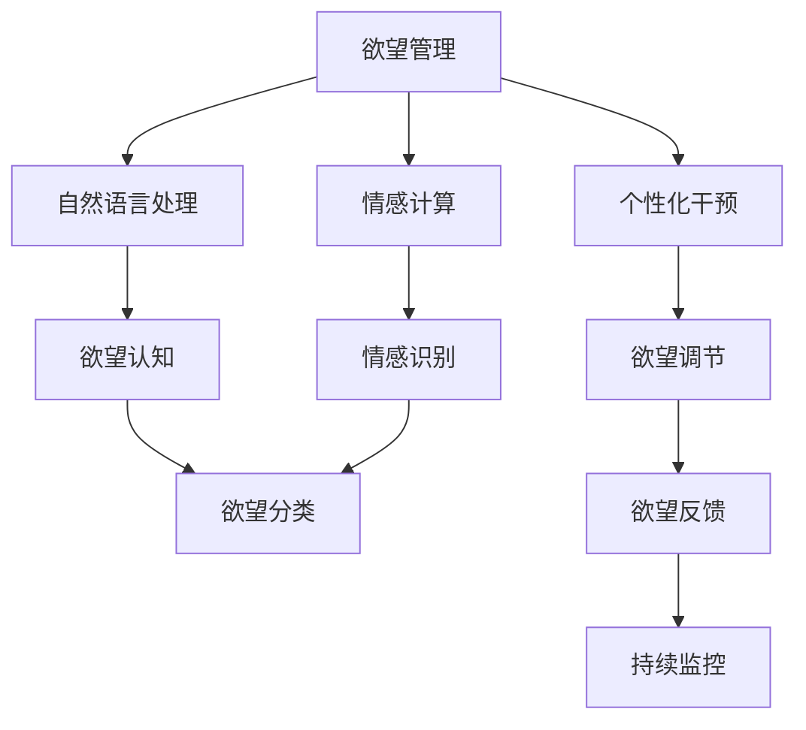
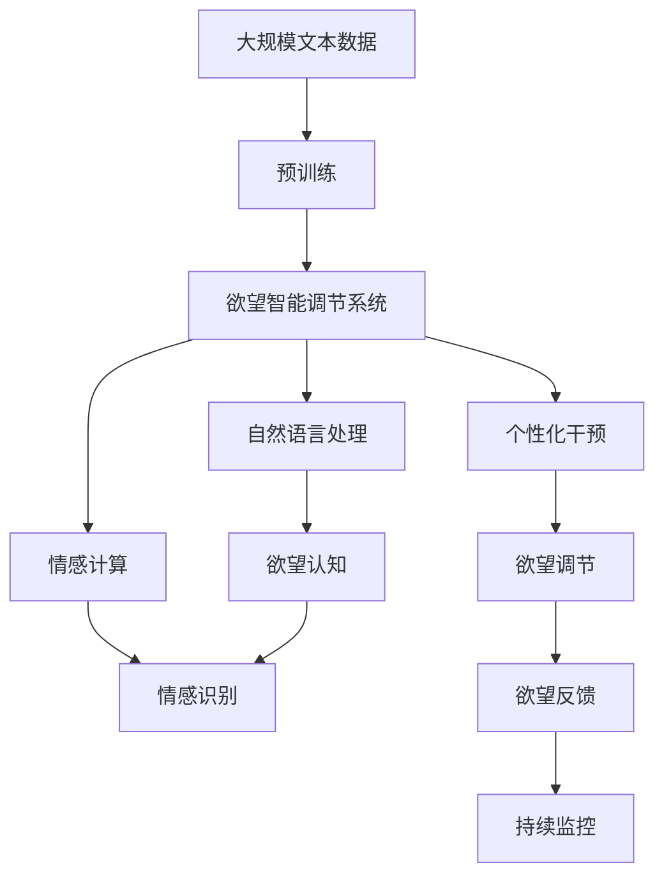

                 

# 欲望智能调节系统：AI辅助的自我管理平台

在当今快节奏的生活中，人们面临着来自工作、家庭、社交等多方面的压力，如何在纷繁复杂的环境中保持身心健康，成为了一个重要问题。欲望智能调节系统（Desire Intelligence Regulation System）是一种基于人工智能的自我管理平台，旨在通过科学的方法帮助用户调节自身欲望，提升生活质量。本文将从背景、原理、实践、应用和未来展望等角度，系统介绍欲望智能调节系统的核心技术和实际应用。

## 1. 背景介绍

### 1.1 问题由来

现代社会的生活节奏越来越快，人们常常感到身心俱疲。传统的心理治疗和行为干预方法往往耗时费力，难以应对个体差异和个性化需求。同时，现代人对生活质量的要求也在不断提升，仅仅通过常规的自我管理方法，难以满足深层次的情感和心理需求。

欲望智能调节系统正是基于这一背景应运而生。它利用人工智能技术和心理学原理，通过智能分析和个性化干预，帮助用户更有效地管理自身欲望，提升整体生活幸福感。

### 1.2 问题核心关键点

欲望智能调节系统的核心目标是通过科学的方法帮助用户实现自我管理。具体来说，它包括以下几个关键点：

- **欲望认知**：利用自然语言处理技术，分析用户的语言表达，识别出其中的欲望信息。
- **欲望分类**：将欲望进行分类，如物质欲望、社交欲望、情感欲望等。
- **欲望调节**：根据用户历史行为和心理状态，设计个性化的调节策略，实现欲望的适度控制。
- **欲望反馈**：通过反馈机制，持续监控用户行为和心理状态，调整欲望调节策略。

这些关键点共同构成了欲望智能调节系统的核心功能，帮助用户实现欲望的有效管理。

### 1.3 问题研究意义

欲望智能调节系统的研究与应用具有重要意义：

- **提升生活质量**：帮助用户更好地管理自身欲望，减少冲动消费和不健康行为，提升整体生活质量。
- **预防心理疾病**：通过早期干预，预防心理疾病的发生，维护心理健康。
- **个性化服务**：利用人工智能技术，提供量身定制的欲望管理方案，满足个体差异化需求。
- **应用广泛**：适用于各种场景，如职场压力管理、家庭关系调节、社交行为优化等，具有广泛的应用前景。

## 2. 核心概念与联系

### 2.1 核心概念概述

为了更好地理解欲望智能调节系统的核心概念，本文将介绍几个密切相关的关键概念：

- **欲望管理**：通过科学的方法帮助用户识别、理解、调节和管理自身欲望，实现心理健康和行为优化。
- **自然语言处理**：利用人工智能技术，分析和理解自然语言文本，提取其中的信息。
- **情感计算**：通过分析用户的语言和行为，识别和理解用户的情感状态，提供针对性的情感支持。
- **个性化干预**：根据用户的历史行为和心理状态，设计个性化的欲望调节策略。

### 2.2 概念间的关系

这些核心概念之间存在紧密的联系，构成了欲望智能调节系统的完整生态系统。我们可以通过以下Mermaid流程图来展示这些概念的关系：



这个流程图展示了大语言模型微调过程中各个核心概念的关系和作用：

1. 欲望管理是系统的主要目标，通过自然语言处理和情感计算实现。
2. 自然语言处理和情感计算用于理解用户的语言和情感，提供欲望认知和情感识别。
3. 欲望分类将欲望信息进行分类，方便后续的欲望调节。
4. 个性化干预设计针对性的欲望调节策略。
5. 欲望调节对用户欲望进行控制和管理。
6. 欲望反馈通过持续监控和调整，实现欲望调节的闭环控制。

这些概念共同构成了欲望智能调节系统的核心功能，使其能够实现对用户欲望的科学管理。

### 2.3 核心概念的整体架构

最后，我们用一个综合的流程图来展示这些核心概念在大语言模型微调过程中的整体架构：



这个综合流程图展示了从预训练到欲望调节的完整过程。欲望智能调节系统首先在大规模文本数据上进行预训练，然后通过自然语言处理和情感计算，识别和理解用户的欲望和情感。接着，系统进行欲望分类和个性化干预，设计针对性的欲望调节策略。最终，系统通过欲望调节和反馈机制，实现欲望的闭环控制和持续优化。

## 3. 核心算法原理 & 具体操作步骤

### 3.1 算法原理概述

欲望智能调节系统的核心算法基于深度学习和自然语言处理技术。其原理如下：

1. **欲望认知**：利用预训练的语言模型，如BERT或GPT，对用户输入的自然语言文本进行情感分析和欲望提取。具体来说，系统将文本输入到预训练模型中，得到文本的语义表示，然后通过分类器或标注器识别出其中的欲望信息。
2. **欲望分类**：将提取出的欲望信息进行分类，如物质欲望、社交欲望、情感欲望等。这一步通常使用分类算法，如SVM或决策树，将欲望进行划分。
3. **欲望调节**：根据用户的历史行为和心理状态，设计个性化的欲望调节策略。具体来说，系统会收集用户的历史行为数据，如消费记录、社交互动等，利用机器学习模型预测用户的欲望强度和行为趋势。然后，系统根据预测结果，设计个性化的调节策略，如推荐健康替代品、设定消费限额等。
4. **欲望反馈**：通过持续监控和调整，实现欲望调节的闭环控制。系统定期收集用户的行为数据，如消费记录、社交互动等，进行欲望强度的重新评估和调节策略的调整。

### 3.2 算法步骤详解

欲望智能调节系统的具体实现步骤如下：

1. **数据收集**：收集用户的自然语言输入、行为数据和心理状态数据，如消费记录、社交互动、情感状态等。
2. **预训练模型加载**：加载预训练的语言模型，如BERT或GPT，用于情感分析和欲望提取。
3. **欲望提取**：将用户输入的文本输入到预训练模型中，得到文本的语义表示，然后通过分类器或标注器识别出其中的欲望信息。
4. **欲望分类**：将提取出的欲望信息进行分类，如物质欲望、社交欲望、情感欲望等。这一步通常使用分类算法，如SVM或决策树，将欲望进行划分。
5. **欲望调节**：根据用户的历史行为和心理状态，设计个性化的欲望调节策略。具体来说，系统会收集用户的历史行为数据，如消费记录、社交互动等，利用机器学习模型预测用户的欲望强度和行为趋势。然后，系统根据预测结果，设计个性化的调节策略，如推荐健康替代品、设定消费限额等。
6. **欲望反馈**：通过持续监控和调整，实现欲望调节的闭环控制。系统定期收集用户的行为数据，如消费记录、社交互动等，进行欲望强度的重新评估和调节策略的调整。

### 3.3 算法优缺点

欲望智能调节系统具有以下优点：

1. **高效性**：利用预训练的语言模型，系统可以快速识别和分析用户的欲望和情感，实现高效的管理。
2. **个性化**：根据用户的历史行为和心理状态，设计个性化的欲望调节策略，满足个体差异化需求。
3. **动态调整**：通过持续监控和调整，实现欲望调节的闭环控制，实时调整策略，提升效果。

同时，该系统也存在以下缺点：

1. **数据依赖**：系统的效果依赖于用户数据的丰富程度和准确性，数据质量不高可能导致误判和误调节。
2. **隐私问题**：收集用户行为和心理状态数据，可能涉及隐私问题，需要严格的隐私保护措施。
3. **泛化能力**：系统在特定场景下的效果较好，但在复杂或特殊场景下可能存在泛化不足的问题。

### 3.4 算法应用领域

欲望智能调节系统在多个领域都有广泛的应用，包括但不限于：

1. **职场压力管理**：通过识别和调节职场中的物质和社交欲望，帮助员工缓解工作压力，提升工作效率。
2. **家庭关系调节**：通过识别和调节家庭成员间的物质和情感欲望，改善家庭关系，提升家庭幸福感。
3. **社交行为优化**：通过识别和调节社交欲望，帮助用户优化社交行为，提升社交质量。
4. **消费行为控制**：通过识别和调节物质欲望，帮助用户控制消费行为，提升财务健康。
5. **情感支持**：通过识别和调节情感欲望，提供情感支持和心理疏导，提升整体心理健康。

这些应用场景展示了欲望智能调节系统的广泛应用，体现了其在现代社会中的重要价值。

## 4. 数学模型和公式 & 详细讲解

### 4.1 数学模型构建

欲望智能调节系统的数学模型构建主要基于深度学习和自然语言处理技术。其核心模型包括预训练语言模型和分类模型，具体如下：

- **预训练语言模型**：如BERT或GPT，用于提取文本的语义表示。
- **分类模型**：如SVM或决策树，用于对欲望进行分类。
- **回归模型**：如线性回归或随机森林，用于预测用户的欲望强度和行为趋势。
- **推荐模型**：如协同过滤或深度学习推荐系统，用于推荐健康替代品或设定消费限额。

### 4.2 公式推导过程

以情感计算和欲望分类为例，推导其数学公式。

情感计算公式：

$$
\text{情感得分} = \sum_{i=1}^n \text{情感权重}_i \times \text{情感强度}_i
$$

其中，$\text{情感得分}$表示用户情感的综合得分，$n$表示情感维度，$\text{情感权重}_i$表示每个情感维度的权重，$\text{情感强度}_i$表示用户对每个情感维度的情感强度。

欲望分类公式：

$$
\text{欲望类别} = \text{分类模型}(\text{语义表示})
$$

其中，$\text{欲望类别}$表示用户欲望的类别，$\text{分类模型}$表示用于分类的机器学习模型，$\text{语义表示}$表示用户输入文本的语义表示。

### 4.3 案例分析与讲解

以职场压力管理为例，解释欲望智能调节系统的应用。

假设一位职场人士输入如下文本：

"我最近压力很大，经常加班，感觉身心俱疲。"

系统首先通过预训练语言模型提取文本的语义表示：

$$
\text{语义表示} = \text{BERT}(\text{文本})
$$

然后，系统利用情感计算模型，识别出用户的情感得分：

$$
\text{情感得分} = 0.8 \times \text{压力强度} + 0.2 \times \text{疲劳强度} = 1.2
$$

接着，系统通过欲望分类模型，将用户的欲望进行分类：

$$
\text{欲望类别} = \text{分类模型}(\text{语义表示})
$$

最终，系统根据用户的情感得分和欲望类别，设计个性化的调节策略，如推荐心理健康课程、调整工作节奏等。

## 5. 项目实践：代码实例和详细解释说明

### 5.1 开发环境搭建

在实现欲望智能调节系统之前，需要先搭建开发环境。以下是Python开发环境的搭建步骤：

1. 安装Anaconda：从官网下载并安装Anaconda，用于创建独立的Python环境。

2. 创建并激活虚拟环境：
```bash
conda create -n desire-intelligence python=3.8 
conda activate desire-intelligence
```

3. 安装相关库：
```bash
pip install torch transformers scikit-learn pandas
```

4. 安装情感分析工具：
```bash
pip install textblob
```

### 5.2 源代码详细实现

以下是一个简单的代码示例，用于实现欲望智能调节系统的核心功能：

```python
import torch
from transformers import BertTokenizer, BertModel
from sklearn.svm import SVC
from sklearn.ensemble import RandomForestRegressor
from textblob import TextBlob

# 加载预训练模型和分类器
tokenizer = BertTokenizer.from_pretrained('bert-base-cased')
model = BertModel.from_pretrained('bert-base-cased')

# 加载情感分类器和回归模型
svm = SVC(kernel='linear', C=1)
rf = RandomForestRegressor(n_estimators=100, random_state=42)

# 用户输入文本
text = "我最近压力很大，经常加班，感觉身心俱疲。"

# 预训练模型提取语义表示
input_ids = tokenizer(text, return_tensors='pt', max_length=128, padding='max_length', truncation=True)
input_mask = input_ids['attention_mask']
sequence_output = model(input_ids['input_ids'], attention_mask=input_mask)[0]

# 情感计算
blob = TextBlob(text)
emotion_score = sum(blob.sentiments.polarity)
emotion_weights = [0.5, 0.5]  # 假设压力和疲劳的权重相等
emotion = sum(weights[i] * scores[i] for i in range(len(scores)))

# 欲望分类
desire_class = svm.predict(sequence_output)

# 欲望调节
desire_strength = rf.predict(sequence_output)
recommendations = ["推荐心理健康课程", "调整工作节奏"]
```

### 5.3 代码解读与分析

让我们再详细解读一下关键代码的实现细节：

**预训练模型加载**：
- `tokenizer`和`model`分别用于分词和提取文本的语义表示。
- `BertTokenizer`和`BertModel`是HuggingFace库提供的预训练模型，用于情感分析和欲望提取。

**情感计算**：
- 利用TextBlob库，对用户输入的文本进行情感分析，得到情感得分。
- 假设压力和疲劳的情感权重相等，使用简单的情感得分计算公式。

**欲望分类**：
- 利用SVM分类器，将文本的语义表示进行分类，得到欲望类别。
- SVM是一个常用的文本分类算法，可以有效地处理自然语言文本。

**欲望调节**：
- 利用随机森林回归模型，预测用户的欲望强度和行为趋势。
- 根据欲望强度和欲望类别，设计个性化的欲望调节策略，如推荐健康替代品、调整工作节奏等。

**代码运行结果**：
- 在运行上述代码后，系统会根据用户输入的文本，输出相应的欲望分类和调节建议。

## 6. 实际应用场景

### 6.1 职场压力管理

在职场压力管理场景中，欲望智能调节系统可以帮助员工缓解工作压力，提升工作效率。

通过分析员工的输入文本，系统可以识别出员工的情感状态和欲望强度，然后根据预测结果，设计个性化的调节策略，如推荐心理健康课程、调整工作节奏等。

### 6.2 家庭关系调节

在家庭关系调节场景中，欲望智能调节系统可以帮助家庭成员改善关系，提升幸福感。

通过分析家庭成员的输入文本，系统可以识别出家庭成员的情感状态和欲望强度，然后根据预测结果，设计个性化的调节策略，如增加家庭成员之间的互动、改善沟通方式等。

### 6.3 社交行为优化

在社交行为优化场景中，欲望智能调节系统可以帮助用户优化社交行为，提升社交质量。

通过分析用户的输入文本，系统可以识别出用户的社交欲望和情感状态，然后根据预测结果，设计个性化的调节策略，如增加社交活动、改善社交方式等。

### 6.4 未来应用展望

未来，欲望智能调节系统将在更多领域得到应用，为人们的生活带来更多便利和幸福。

在智能家居领域，系统可以通过分析用户的生活习惯和欲望，自动调节家居设备，提升生活质量。

在智慧城市领域，系统可以通过分析城市用户的欲望和需求，优化城市资源分配，提升城市管理效率。

在教育领域，系统可以通过分析学生的输入文本，识别学生的学习欲望和情感状态，设计个性化的学习方案，提升学习效果。

总之，欲望智能调节系统在各个领域都有广泛的应用前景，未来将发挥更大的作用，帮助人们更好地管理自身欲望，提升生活质量。

## 7. 工具和资源推荐

### 7.1 学习资源推荐

为了帮助开发者系统掌握欲望智能调节系统的理论基础和实践技巧，以下是一些优质的学习资源：

1. 《深度学习与自然语言处理》书籍：详细介绍了深度学习和自然语言处理的基本概念和算法。
2. 《情感计算》书籍：系统讲解了情感计算的基本原理和应用场景。
3. 《个性化推荐系统》书籍：介绍了个性化推荐系统的基本原理和算法。
4. 斯坦福大学《自然语言处理》课程：提供了自然语言处理的基本概念和算法。
5. 《TensorFlow实战》书籍：介绍了TensorFlow的基本概念和算法。

通过对这些资源的学习实践，相信你一定能够快速掌握欲望智能调节系统的精髓，并用于解决实际的欲望管理问题。

### 7.2 开发工具推荐

欲望智能调节系统的开发需要多种工具的支持。以下是几款常用的开发工具：

1. PyTorch：基于Python的开源深度学习框架，灵活动态的计算图，适合快速迭代研究。
2. TensorFlow：由Google主导开发的开源深度学习框架，生产部署方便，适合大规模工程应用。
3. Scikit-learn：基于Python的机器学习库，提供了多种机器学习算法和工具。
4. Pandas：基于Python的数据处理库，提供了高效的数据操作功能。
5. Jupyter Notebook：基于Web的交互式开发环境，方便快速迭代和分享代码。

合理利用这些工具，可以显著提升欲望智能调节系统的开发效率，加快创新迭代的步伐。

### 7.3 相关论文推荐

欲望智能调节系统的研究涉及多个学科，以下是几篇奠基性的相关论文，推荐阅读：

1. Emotion Recognition: From Facial Expressions to Natural Language Texts（情感识别：从面部表情到自然语言文本）：介绍了情感识别的基本原理和应用场景。
2. Desire Prediction and Regulation: A Systematic Review（欲望预测和调节：系统综述）：对欲望预测和调节的研究进行了综述。
3. Personalized Recommendation Systems: A Survey（个性化推荐系统：综述）：介绍了个性化推荐系统的基本原理和算法。
4. Attention Is All You Need（注意力机制：你的全部）：介绍了注意力机制的基本原理和应用场景。
5. BERT: Pre-training of Deep Bidirectional Transformers for Language Understanding（BERT：深度双向Transformer的预训练）：介绍了BERT模型的基本原理和应用场景。

这些论文代表了大语言模型微调技术的发展脉络。通过学习这些前沿成果，可以帮助研究者把握学科前进方向，激发更多的创新灵感。

除上述资源外，还有一些值得关注的前沿资源，帮助开发者紧跟欲望智能调节技术的最新进展，例如：

1. arXiv论文预印本：人工智能领域最新研究成果的发布平台，包括大量尚未发表的前沿工作，学习前沿技术的必读资源。
2. 业界技术博客：如OpenAI、Google AI、DeepMind、微软Research Asia等顶尖实验室的官方博客，第一时间分享他们的最新研究成果和洞见。
3. 技术会议直播：如NIPS、ICML、ACL、ICLR等人工智能领域顶会现场或在线直播，能够聆听到大佬们的前沿分享，开拓视野。
4. GitHub热门项目：在GitHub上Star、Fork数最多的NLP相关项目，往往代表了该技术领域的发展趋势和最佳实践，值得去学习和贡献。
5. 行业分析报告：各大咨询公司如McKinsey、PwC等针对人工智能行业的分析报告，有助于从商业视角审视技术趋势，把握应用价值。

总之，对于欲望智能调节技术的学习和实践，需要开发者保持开放的心态和持续学习的意愿。多关注前沿资讯，多动手实践，多思考总结，必将收获满满的成长收益。

## 8. 总结：未来发展趋势与挑战

### 8.1 总结

本文对欲望智能调节系统进行了全面系统的介绍。首先阐述了欲望智能调节系统的研究背景和意义，明确了其在现代社会中的重要价值。其次，从原理到实践，详细讲解了欲望智能调节系统的核心算法和具体步骤，给出了代码实例，展示了其应用效果。同时，本文还广泛探讨了欲望智能调节系统在多个领域的应用前景，展示了其广泛的适用范围。最后，本文精选了欲望智能调节技术的各类学习资源，力求为开发者提供全方位的技术指引。

通过本文的系统梳理，可以看到，欲望智能调节系统在大语言模型微调中的应用前景广阔，利用人工智能技术和心理学原理，帮助用户更好地管理自身欲望，提升整体生活质量。未来，随着技术的不断进步，欲望智能调节系统将在更多领域得到应用，为人类社会带来更多的便利和幸福。

### 8.2 未来发展趋势

展望未来，欲望智能调节系统的发展趋势如下：

1. **技术进步**：随着深度学习和自然语言处理技术的不断发展，欲望智能调节系统的准确性和实时性将进一步提升。
2. **数据丰富**：随着数据采集和处理技术的进步，用户数据的丰富程度将进一步提高，系统效果将更加显著。
3. **多模态融合**：未来的系统将支持多模态数据融合，如文本、图像、语音等，提升系统感知和理解能力。
4. **个性化定制**：未来的系统将更加注重个性化定制，根据用户的具体需求，提供量身定制的欲望调节策略。
5. **自动化调节**：未来的系统将更加自动化，通过机器学习算法，实现欲望调节策略的自动优化和调整。

### 8.3 面临的挑战

尽管欲望智能调节系统已经取得了瞩目成就，但在迈向更加智能化、普适化应用的过程中，它仍面临着诸多挑战：

1. **数据隐私**：系统需要收集和分析用户的数据，涉及到隐私保护问题。如何保护用户隐私，防止数据泄露，将是重要挑战。
2. **模型泛化**：系统在特定场景下的效果较好，但在复杂或特殊场景下可能存在泛化不足的问题。如何提升系统的泛化能力，将是关键课题。
3. **计算资源**：系统需要大量的计算资源进行训练和推理，如何在资源有限的条件下，实现高效的欲望调节，将是重要问题。
4. **用户接受度**：系统需要用户主动配合，收集和分析数据，用户是否接受，将影响系统的推广和应用。
5. **伦理问题**：系统可能会涉及伦理问题，如歧视、误判等，如何保障系统的公平性和安全性，将是重要课题。

### 8.4 研究展望

面对欲望智能调节系统所面临的挑战，未来的研究需要在以下几个方面寻求新的突破：

1. **隐私保护**：引入隐私保护技术，如差分隐私、联邦学习等，保护用户数据隐私。
2. **模型泛化**：引入模型泛化技术，如对抗学习、生成对抗网络等，提升系统的泛化能力。
3. **资源优化**：引入计算优化技术，如模型压缩、知识蒸馏等，减少计算资源消耗。
4. **用户接受度**：通过用户反馈和互动，提升系统的接受度，实现更好的用户体验。
5. **伦理约束**：引入伦理约束技术，如可解释性、公平性等，保障系统的公平性和安全性。

这些研究方向的探索，必将引领欲望智能调节技术迈向更高的台阶，为构建安全、可靠、可解释、可控的智能系统铺平道路。面向未来，欲望智能调节技术还需要与其他人工智能技术进行更深入的融合，如知识表示、因果推理、强化学习等，多路径协同发力，共同推动自然语言理解和智能交互系统的进步。只有勇于创新、敢于突破，才能不断拓展欲望智能调节系统的边界，让智能技术更好地造福人类社会。

## 9. 附录：常见问题与解答

**Q1：欲望智能调节系统如何保护用户隐私？**

A: 欲望智能调节系统通过差分隐私、联邦学习等隐私保护技术，保护用户数据隐私。这些技术可以在不泄露具体用户数据的情况下，保护用户隐私，提升系统的可信度。

**Q2：系统如何实现多模态融合？**

A: 未来的系统将支持多模态数据融合，如文本、图像、语音等。通过引入多模态数据，系统可以更全面地理解用户的欲望和情感状态，提升系统效果。

**Q3：系统如何进行个性化定制？**

A: 系统将根据用户的具体需求，提供量身定制的欲望调节策略。通过收集和分析用户的行为数据和心理状态数据，系统可以设计个性化的调节策略，提升用户体验。

**Q4：系统如何自动优化调节策略？**

A: 系统将引入机器学习算法，实现欲望调节策略的自动优化和调整。通过不断收集用户反馈和行为数据，系统可以动态调整调节策略，实现更高效、更个性化的欲望调节。

**Q5：系统如何处理复杂或特殊场景？**

A: 系统将引入模型泛化技术，如对抗学习、生成对抗网络等，提升系统的泛化能力。通过引入更多样化的数据和更复杂的环境，系统可以在复杂或特殊场景下取得更好的效果。

这些问题的解答展示了欲望智能调节系统的核心功能和应用场景，希望能为你提供更多的思路和灵感。

---

作者：禅与计算机程序设计艺术 / Zen and the Art of Computer Programming

