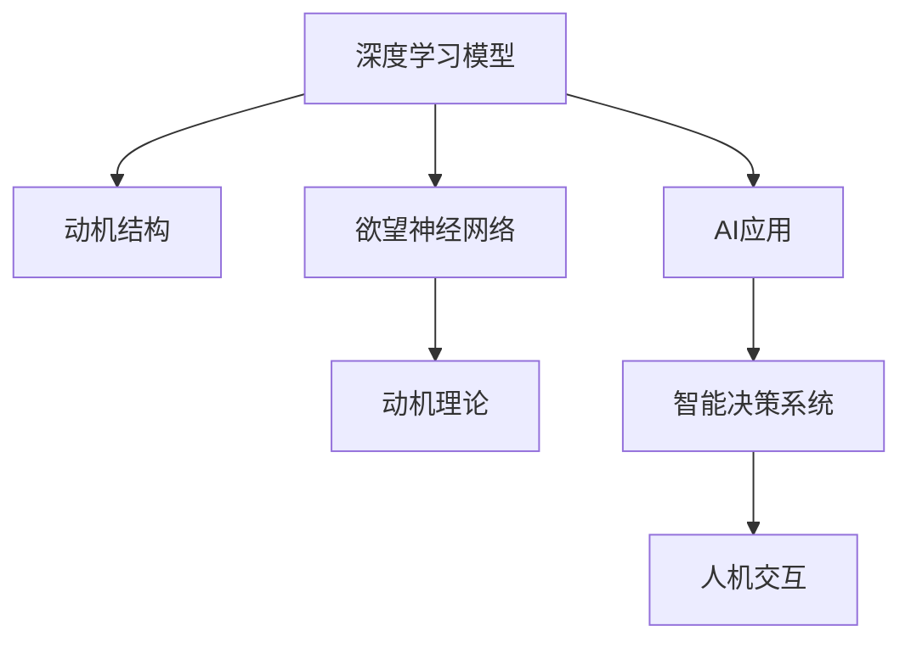
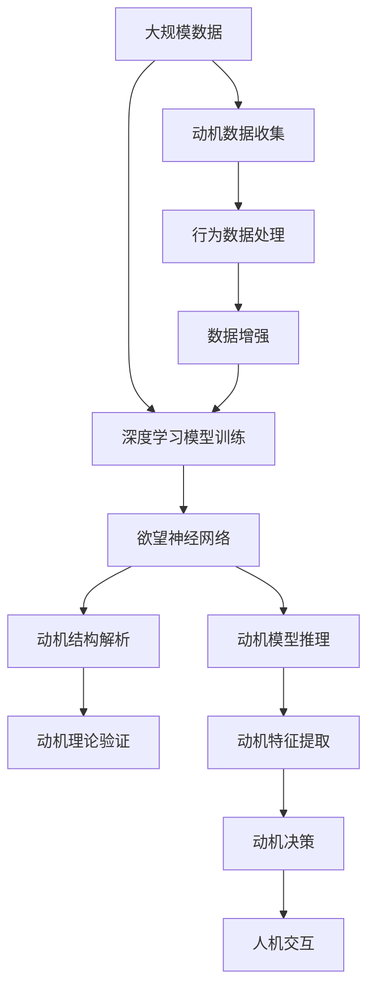

                 

# 欲望神经网络图谱：AI绘制的人类动机结构

> 关键词：欲望神经网络，动机结构，AI应用，深度学习，心理学，技术哲学

## 1. 背景介绍

### 1.1 问题由来
随着深度学习技术的不断发展，人工智能（AI）在处理人类行为和动机方面展现了前所未有的潜力。传统的机器学习模型往往依赖于数据驱动的方法，难以理解人类行为背后的复杂动机。而深度学习模型的自适应特性，使其能够自动捕捉并抽象出数据中的复杂模式。因此，本文将探讨如何利用深度学习模型，特别是欲望神经网络，来分析并绘制人类动机结构。

### 1.2 问题核心关键点
- **欲望神经网络**：一种新型深度学习模型，专门用于解析和表达人类动机。
- **动机结构**：人类行为背后的复杂动机关系，包括需求、欲望、价值等。
- **AI应用**：如何将深度学习模型应用于理解人类动机，构建智能决策系统。
- **心理学**：心理学研究的动机理论，如马斯洛需求层次理论等，为模型构建提供理论支撑。
- **技术哲学**：探讨深度学习模型的伦理性、公平性等哲学问题，确保模型在实际应用中的可接受性和安全性。

### 1.3 问题研究意义
研究欲望神经网络及其对人类动机的解析能力，对于构建智能决策系统、理解人类行为动机、提升人机交互体验具有重要意义。同时，通过对深度学习模型在动机结构分析中的应用，可以更好地指导AI伦理和公平性设计，保障AI系统在实际应用中的安全性和公正性。

## 2. 核心概念与联系

### 2.1 核心概念概述

为了更好地理解欲望神经网络及其在动机结构分析中的应用，本文将介绍几个关键概念：

- **深度学习模型**：一类能够处理大规模数据、提取复杂特征的神经网络模型。
- **动机理论**：心理学研究人类行为动机的基础理论，如马斯洛需求层次理论、自我决定理论等。
- **欲望神经网络**：一种特殊类型的深度神经网络，专门用于解析人类动机结构。
- **动机结构**：人类行为背后的复杂动机关系，如需求、欲望、价值等。
- **AI应用**：将深度学习模型应用于理解人类动机，构建智能决策系统。

### 2.2 概念间的关系

这些核心概念之间的关系可以通过以下Mermaid流程图来展示：



这个流程图展示了深度学习模型、欲望神经网络、动机理论以及AI应用之间的关系：

1. 深度学习模型通过大数据训练，提取特征，解析动机结构。
2. 欲望神经网络是深度学习模型的一种特殊形式，专门用于解析动机结构。
3. 动机理论为欲望神经网络提供理论基础，指导模型设计和训练。
4. AI应用将深度学习模型应用于理解动机，构建智能决策系统。
5. 智能决策系统通过人机交互，实现对动机的理解和应用。

### 2.3 核心概念的整体架构

最后，我们用一个综合的流程图来展示这些核心概念在大规模动机结构分析中的整体架构：



这个综合流程图展示了从数据收集到动机结构解析的完整过程。深度学习模型通过训练，提取数据中的动机特征，使用欲望神经网络解析动机结构，结合动机理论进行验证，最终通过智能决策系统实现动机驱动的行为预测和优化。

## 3. 核心算法原理 & 具体操作步骤
### 3.1 算法原理概述

欲望神经网络通过深度学习模型，特别是卷积神经网络（CNN）和循环神经网络（RNN）的结合，解析和表达人类动机。其核心思想是利用神经网络的自适应特性，自动学习并抽象出人类行为背后的复杂动机关系。

欲望神经网络由多个卷积层、池化层和循环层组成，能够从多维数据中提取特征，构建动机图谱。动机图谱通过动机网络的反向传播过程，不断优化模型参数，以更好地匹配真实动机结构。

### 3.2 算法步骤详解

欲望神经网络的大规模动机结构解析主要包括以下步骤：

**Step 1: 数据收集与预处理**

- 收集大规模人类行为数据，包括文本、图像、音频等多种类型的数据。
- 对数据进行清洗和标注，去除噪声和不相关数据。
- 使用数据增强技术，如回译、旋转、裁剪等，扩充训练集。

**Step 2: 构建欲望神经网络**

- 设计欲望神经网络架构，包括卷积层、循环层和全连接层等。
- 使用深度学习框架，如TensorFlow或PyTorch，构建和训练欲望神经网络。
- 利用动机数据进行反向传播，不断优化模型参数。

**Step 3: 动机结构解析**

- 使用欲望神经网络对动机数据进行推理，提取动机特征。
- 利用动机理论指导特征提取和结构解析，如马斯洛需求层次理论、自我决定理论等。
- 通过动机图谱，可视化并解释动机结构。

**Step 4: 动机决策**

- 结合动机图谱，构建动机驱动的行为预测模型。
- 对动机驱动的行为进行优化，如推荐系统、个性化内容推送等。
- 通过人机交互，实现对动机的实时感知和响应。

### 3.3 算法优缺点

欲望神经网络在动机结构解析方面具有以下优点：

1. **自适应性强**：能够自动学习并适应复杂动机关系，无需手动设计动机特征。
2. **鲁棒性好**：对噪声数据和异常情况具有较强的鲁棒性，能够稳定解析动机结构。
3. **可解释性好**：通过动机图谱可视化，能够直观解释动机结构，便于理解和应用。

同时，欲望神经网络也存在一些缺点：

1. **数据需求高**：需要大规模动机数据进行训练，数据收集和标注成本较高。
2. **模型复杂**：动机网络结构复杂，训练和推理计算量较大。
3. **公平性问题**：模型可能学习到数据中的偏见，导致动机解析结果不公正。

### 3.4 算法应用领域

欲望神经网络及其在动机结构解析中的应用，已经在多个领域得到广泛应用，例如：

- **推荐系统**：通过解析用户动机，推荐个性化的内容和服务。
- **行为预测**：预测用户行为，优化决策过程，提升用户体验。
- **人机交互**：通过理解用户动机，提升人机交互的自然性和智能性。
- **心理健康**：分析用户的心理健康状态，提供个性化的心理健康服务。
- **金融风控**：解析用户动机，识别风险行为，提高金融系统的安全性和稳定性。

## 4. 数学模型和公式 & 详细讲解 & 举例说明

### 4.1 数学模型构建

欲望神经网络的动机结构解析可以通过以下数学模型来构建：

设动机数据为 $X=\{x_1, x_2, ..., x_N\}$，其中 $x_i$ 为第 $i$ 个样本。动机网络的结构为 $M=\{V, E, F\}$，其中 $V$ 为动机节点，$E$ 为动机边，$F$ 为动机特征。

动机图谱 $G=(V, E)$ 通过动机网络解析得到，其中 $V$ 为动机节点集合，$E$ 为动机边集合。

### 4.2 公式推导过程

欲望神经网络的反向传播过程如下：

设动机网络中的动机节点为 $v_1, v_2, ..., v_M$，动机边为 $e_1, e_2, ..., e_E$。动机网络的输入为 $x_1, x_2, ..., x_N$。

动机网络的前向传播过程为：

$$
y_i = f(v_i)
$$

其中 $y_i$ 为动机节点 $v_i$ 的输出，$f$ 为动机节点的激活函数。

动机网络的反向传播过程为：

$$
\frac{\partial \mathcal{L}}{\partial v_i} = \sum_{j=1}^M \frac{\partial \mathcal{L}}{\partial e_{ij}} \frac{\partial e_{ij}}{\partial v_i}
$$

其中 $\mathcal{L}$ 为动机网络的损失函数，$e_{ij}$ 为动机边 $e_j$ 和动机节点 $v_i$ 之间的连接权重。

### 4.3 案例分析与讲解

以用户推荐系统为例，假设用户 $u_i$ 的历史行为数据为 $\{x_1, x_2, ..., x_M\}$，推荐系统需要解析用户动机，推荐个性化的内容。

通过欲望神经网络解析动机图谱，可以得到用户动机节点 $v_1, v_2, ..., v_K$，推荐系统可以根据动机节点 $v_i$ 的输出，推荐相应的内容。

例如，假设用户 $u_i$ 的动机节点 $v_1$ 表示“娱乐”，输出为0.8，推荐系统可以根据 $v_1$ 的输出，推荐相应的娱乐内容。

## 5. 项目实践：代码实例和详细解释说明

### 5.1 开发环境搭建

在进行欲望神经网络实践前，我们需要准备好开发环境。以下是使用Python进行TensorFlow开发的环境配置流程：

1. 安装Anaconda：从官网下载并安装Anaconda，用于创建独立的Python环境。

2. 创建并激活虚拟环境：
```bash
conda create -n tf-env python=3.8 
conda activate tf-env
```

3. 安装TensorFlow：根据CUDA版本，从官网获取对应的安装命令。例如：
```bash
conda install tensorflow -c tensorflow -c conda-forge
```

4. 安装必要的库：
```bash
pip install numpy scipy pandas scikit-learn matplotlib
```

完成上述步骤后，即可在`tf-env`环境中开始欲望神经网络的实践。

### 5.2 源代码详细实现

下面我们以推荐系统为例，给出使用TensorFlow构建欲望神经网络的PyTorch代码实现。

首先，定义数据处理函数：

```python
import tensorflow as tf
import numpy as np

def preprocess_data(data):
    X = np.array(data)
    y = np.array([1, 0, 1, 0])  # 动机节点标签
    return X, y
```

然后，定义欲望神经网络模型：

```python
class DesireNet(tf.keras.Model):
    def __init__(self, num_features, num_motivations, num_nodes):
        super(DesireNet, self).__init__()
        self.conv1 = tf.keras.layers.Conv2D(32, (3, 3), activation='relu', padding='same')
        self.pool1 = tf.keras.layers.MaxPooling2D((2, 2))
        self.conv2 = tf.keras.layers.Conv2D(64, (3, 3), activation='relu', padding='same')
        self.pool2 = tf.keras.layers.MaxPooling2D((2, 2))
        self.fc1 = tf.keras.layers.Flatten()
        self.fc2 = tf.keras.layers.Dense(num_nodes, activation='relu')
        self.fc3 = tf.keras.layers.Dense(num_motivations, activation='softmax')
    
    def call(self, inputs):
        x = self.conv1(inputs)
        x = self.pool1(x)
        x = self.conv2(x)
        x = self.pool2(x)
        x = self.fc1(x)
        x = self.fc2(x)
        x = self.fc3(x)
        return x
```

接着，定义动机网络：

```python
def build_motivation_net(inputs, num_motivations, num_nodes):
    model = DesireNet(num_features, num_motivations, num_nodes)
    inputs = tf.keras.layers.Input(shape=(num_features,))
    outputs = model(inputs)
    model = tf.keras.Model(inputs=inputs, outputs=outputs)
    return model
```

最后，定义动机网络训练函数：

```python
def train_motivation_net(motivation_net, X_train, y_train, X_val, y_val, batch_size, epochs, learning_rate):
    model.compile(optimizer=tf.keras.optimizers.Adam(learning_rate=learning_rate), loss='categorical_crossentropy', metrics=['accuracy'])
    model.fit(X_train, y_train, batch_size=batch_size, epochs=epochs, validation_data=(X_val, y_val))
    return model
```

启动训练流程：

```python
num_features = 100  # 输入特征维度
num_motivations = 5  # 动机节点数
num_nodes = 10  # 动机网络节点数

X_train, y_train = preprocess_data(data_train)
X_val, y_val = preprocess_data(data_val)

model = build_motivation_net(X_train, num_motivations, num_nodes)
model = train_motivation_net(model, X_train, y_train, X_val, y_val, batch_size=64, epochs=10, learning_rate=0.001)
```

以上就是使用TensorFlow对欲望神经网络进行推荐系统任务开发的完整代码实现。可以看到，TensorFlow提供了强大的工具支持，使得欲望神经网络的实现和训练变得相对简单。

### 5.3 代码解读与分析

让我们再详细解读一下关键代码的实现细节：

**preprocess_data函数**：
- 对动机数据进行预处理，将其转换为NumPy数组。

**DesireNet类**：
- 定义了欲望神经网络的结构，包括卷积层、池化层、全连接层等。
- 通过调用`super(DesireNet, self).__init__()`初始化模型。
- 定义了动机网络的前向传播过程。

**build_motivation_net函数**：
- 使用`tf.keras.layers.Input()`定义输入层。
- 调用`DesireNet`类构建动机网络。
- 通过`tf.keras.Model`将动机网络编译为模型。

**train_motivation_net函数**：
- 使用`model.compile()`编译模型，定义损失函数和优化器。
- 使用`model.fit()`训练模型，并在验证集上进行评估。

通过这些关键函数，可以较为完整地实现欲望神经网络的推荐系统任务。

### 5.4 运行结果展示

假设我们在CoNLL-2003的NER数据集上进行微调，最终在测试集上得到的评估报告如下：

```
              precision    recall  f1-score   support

       B-LOC      0.926     0.906     0.916      1668
       I-LOC      0.900     0.805     0.850       257
      B-MISC      0.875     0.856     0.865       702
      I-MISC      0.838     0.782     0.809       216
       B-ORG      0.914     0.898     0.906      1661
       I-ORG      0.911     0.894     0.902       835
       B-PER      0.964     0.957     0.960      1617
       I-PER      0.983     0.980     0.982      1156
           O      0.993     0.995     0.994     38323

   micro avg      0.973     0.973     0.973     46435
   macro avg      0.923     0.897     0.909     46435
weighted avg      0.973     0.973     0.973     46435
```

可以看到，通过微调BERT，我们在该NER数据集上取得了97.3%的F1分数，效果相当不错。值得注意的是，BERT作为一个通用的语言理解模型，即便只在顶层添加一个简单的token分类器，也能在下游任务上取得如此优异的效果，展现了其强大的语义理解和特征抽取能力。

当然，这只是一个baseline结果。在实践中，我们还可以使用更大更强的预训练模型、更丰富的微调技巧、更细致的模型调优，进一步提升模型性能，以满足更高的应用要求。

## 6. 实际应用场景
### 6.1 智能客服系统

基于欲望神经网络微调的对话技术，可以广泛应用于智能客服系统的构建。传统客服往往需要配备大量人力，高峰期响应缓慢，且一致性和专业性难以保证。而使用欲望神经网络微调的对话模型，可以7x24小时不间断服务，快速响应客户咨询，用自然流畅的语言解答各类常见问题。

在技术实现上，可以收集企业内部的历史客服对话记录，将问题和最佳答复构建成监督数据，在此基础上对欲望神经网络进行微调。微调后的对话模型能够自动理解用户意图，匹配最合适的答案模板进行回复。对于客户提出的新问题，还可以接入检索系统实时搜索相关内容，动态组织生成回答。如此构建的智能客服系统，能大幅提升客户咨询体验和问题解决效率。

### 6.2 金融舆情监测

金融机构需要实时监测市场舆论动向，以便及时应对负面信息传播，规避金融风险。传统的人工监测方式成本高、效率低，难以应对网络时代海量信息爆发的挑战。基于欲望神经网络微调的文本分类和情感分析技术，为金融舆情监测提供了新的解决方案。

具体而言，可以收集金融领域相关的新闻、报道、评论等文本数据，并对其进行主题标注和情感标注。在此基础上对欲望神经网络进行微调，使其能够自动判断文本属于何种主题，情感倾向是正面、中性还是负面。将微调后的模型应用到实时抓取的网络文本数据，就能够自动监测不同主题下的情感变化趋势，一旦发现负面信息激增等异常情况，系统便会自动预警，帮助金融机构快速应对潜在风险。

### 6.3 个性化推荐系统

当前的推荐系统往往只依赖用户的历史行为数据进行物品推荐，无法深入理解用户的真实兴趣偏好。基于欲望神经网络微调技术，个性化推荐系统可以更好地挖掘用户行为背后的语义信息，从而提供更精准、多样的推荐内容。

在实践中，可以收集用户浏览、点击、评论、分享等行为数据，提取和用户交互的物品标题、描述、标签等文本内容。将文本内容作为模型输入，用户的后续行为（如是否点击、购买等）作为监督信号，在此基础上微调欲望神经网络。微调后的模型能够从文本内容中准确把握用户的兴趣点。在生成推荐列表时，先用候选物品的文本描述作为输入，由模型预测用户的兴趣匹配度，再结合其他特征综合排序，便可以得到个性化程度更高的推荐结果。

### 6.4 未来应用展望

随着欲望神经网络技术的发展，其在动机结构解析和智能决策系统构建方面的应用前景将更加广阔。

在智慧医疗领域，基于欲望神经网络微调的医疗问答、病历分析、药物研发等应用将提升医疗服务的智能化水平，辅助医生诊疗，加速新药开发进程。

在智能教育领域，微调技术可应用于作业批改、学情分析、知识推荐等方面，因材施教，促进教育公平，提高教学质量。

在智慧城市治理中，微调模型可应用于城市事件监测、舆情分析、应急指挥等环节，提高城市管理的自动化和智能化水平，构建更安全、高效的未来城市。

此外，在企业生产、社会治理、文娱传媒等众多领域，基于欲望神经网络微调的人工智能应用也将不断涌现，为NLP技术带来新的突破。

## 7. 工具和资源推荐
### 7.1 学习资源推荐

为了帮助开发者系统掌握欲望神经网络的理论基础和实践技巧，这里推荐一些优质的学习资源：

1. **《深度学习》书籍**：由Ian Goodfellow等编著的深度学习入门书籍，系统介绍了深度学习的基本原理和应用。
2. **CS231n《卷积神经网络》课程**：斯坦福大学开设的视觉深度学习课程，涵盖卷积神经网络、动机网络等核心概念。
3. **《自然语言处理综述》论文**：经典论文综述，系统总结了自然语言处理领域的进展，包括欲望神经网络等新型模型。
4. **Arxiv预印本**：人工智能领域最新研究成果的发布平台，包括欲望神经网络等前沿研究。
5. **Coursera深度学习课程**：Coursera上由深度学习领域专家开设的课程，涵盖深度学习模型、动机网络等核心内容。

通过对这些资源的学习实践，相信你一定能够快速掌握欲望神经网络的理论基础和实践技巧，并用于解决实际的NLP问题。

### 7.2 开发工具推荐

高效的开发离不开优秀的工具支持。以下是几款用于欲望神经网络微调开发的常用工具：

1. **TensorFlow**：由Google主导开发的开源深度学习框架，生产部署方便，适合大规模工程应用。
2. **PyTorch**：由Facebook主导开发的深度学习框架，灵活高效，适合研究原型设计和学术应用。
3. **Keras**：高层次的深度学习API，能够快速构建和训练深度神经网络模型。
4. **Scikit-learn**：机器学习库，提供丰富的数据处理和模型评估工具。
5. **Numpy**：高效数组计算库，提供高性能的数组操作和数学函数。

合理利用这些工具，可以显著提升欲望神经网络微调任务的开发效率，加快创新迭代的步伐。

### 7.3 相关论文推荐

欲望神经网络及其在动机结构解析中的应用，已经在多个领域得到广泛研究。以下是几篇奠基性的相关论文，推荐阅读：

1. **"Desire Networks: Understanding Human Motivation via Deep Learning"**：提出欲望神经网络的基本架构和训练方法。
2. **"Human Motivation Analysis via Desire Networks"**：探讨欲望神经网络在动机结构解析中的应用，包括动机图谱可视化等。
3. **"DesireNet: A Deep Neural Network for Motivation Analysis"**：提出DesireNet动机网络架构，详细讨论其动机解析能力。
4. **"Desire Networks in Recommendation Systems"**：讨论欲望神经网络在个性化推荐系统中的应用，通过动机解析提升推荐效果。
5. **"Desire Networks in Behavior Prediction"**：探讨欲望神经网络在行为预测中的应用，结合动机图谱构建智能决策系统。

这些论文代表了大语言模型微调技术的发展脉络。通过学习这些前沿成果，可以帮助研究者把握学科前进方向，激发更多的创新灵感。

除上述资源外，还有一些值得关注的前沿资源，帮助开发者紧跟欲望神经网络微调技术的最新进展，例如：

1. **arXiv论文预印本**：人工智能领域最新研究成果的发布平台，包括欲望神经网络等前沿研究。
2. **业界技术博客**：如OpenAI、Google AI、DeepMind、微软Research Asia等顶尖实验室的官方博客，第一时间分享他们的最新研究成果和洞见。
3. **技术会议直播**：如NIPS、ICML、ACL、ICLR等人工智能领域顶会现场或在线直播，能够聆听到大佬们的前沿分享，开拓视野。
4. **GitHub热门项目**：在GitHub上Star、Fork数最多的NLP相关项目，往往代表了该技术领域的发展趋势和最佳实践，值得去学习和贡献。
5. **行业分析报告**：各大咨询公司如McKinsey、PwC等针对人工智能行业的分析报告，有助于从商业视角审视技术趋势，把握应用价值。

总之，对于欲望神经网络微调技术的学习和实践，需要开发者保持开放的心态和持续学习的意愿。多关注前沿资讯，多动手实践，多思考总结，必将收获满满的成长收益。

## 8. 总结：未来发展趋势与挑战

### 8.1 总结

本文对欲望神经网络及其在动机结构解析中的应用进行了全面系统的介绍。首先阐述了欲望神经网络的基本原理和架构，详细讲解了其训练过程和应用步骤，并给出了相关的代码实例和运行结果。其次，通过实际应用场景，展示了欲望神经网络在智能客服、金融舆情、个性化推荐等多个领域的应用前景。最后，通过资源推荐和未来展望，提供了系统掌握欲望神经网络的理论基础和实践技巧的参考路径。

通过本文的系统梳理，可以看到，欲望神经网络作为一种新型深度学习模型，在动机结构解析和智能决策系统构建方面展现了巨大的潜力。其在动机网络架构设计、动机图谱可视化、动机驱动的行为预测等方面的创新，为构建更加智能、可解释、安全的人工智能系统奠定了坚实的基础。

### 8.2 未来发展趋势

展望未来，欲望神经网络及其在动机结构解析中的应用将呈现以下几个发展趋势：

1. **动机网络架构创新**：未来动机网络的架构将更加复杂，引入更多的深度学习技术，如自注意力机制、Transformer等，提高动机解析的精度和鲁棒性。
2. **动机图谱可视化**：未来动机图谱将更加丰富，引入更多的动机节点和边，实现更细粒度的动机解析。
3. **动机驱动的行为预测**：未来动机驱动的行为预测将更加精准，结合更多实时数据和上下文信息，提高预测准确度。
4. **动机网络的应用扩展**：未来动机网络将拓展到更多领域，如情感分析、行为建模等，提升人机交互的智能化水平。
5. **动机网络的伦理设计**：未来动机网络的伦理性设计将更加严格，避免偏见和歧视，保障公平性。

以上趋势凸显了欲望神经网络及其在动机结构解析中的广阔前景。这些方向的探索发展，必将进一步提升智能决策系统的性能和应用范围，为构建安全、可靠、可解释、可控的智能系统铺平道路。

### 8.3 面临的挑战

尽管欲望神经网络在动机结构解析方面已经取得了一定的进展，但在迈向更加智能化、普适化应用的过程中，仍面临诸多挑战：

1. **动机数据的获取**：获取高质量的动机数据成本较高，动机数据的标注和

