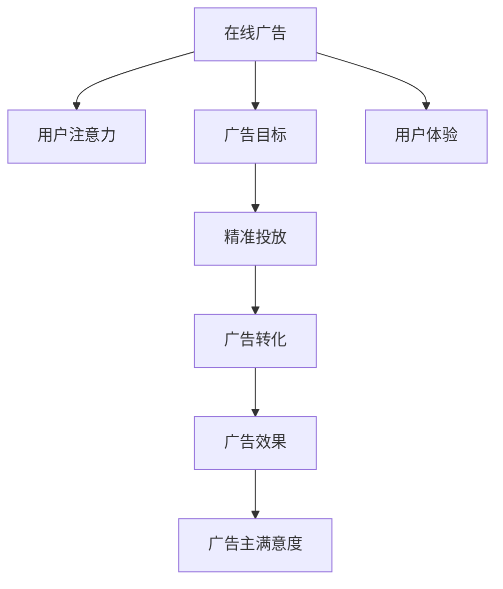
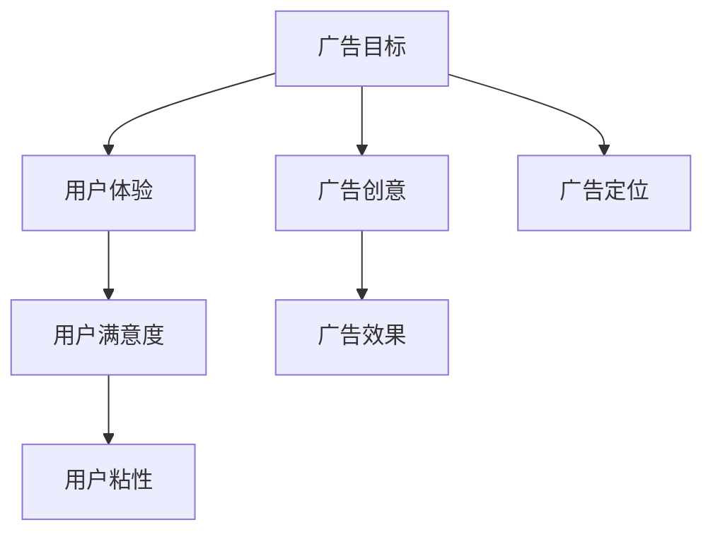
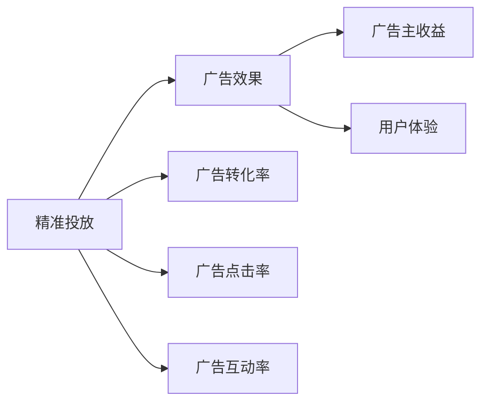
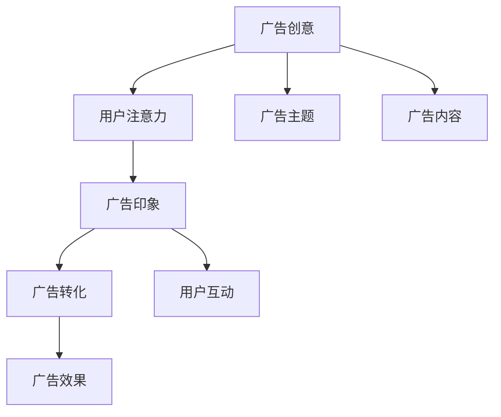
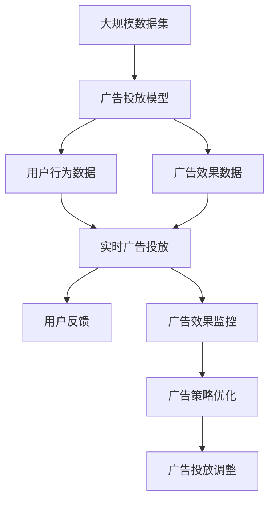

                 

# 注意力经济与在线广告目标与策略：在不牺牲用户体验的情况下吸引受众

## 1. 背景介绍

### 1.1 问题由来
随着互联网技术的飞速发展，注意力经济已逐步成为各领域竞争的关键。在线广告作为互联网公司的重要盈利模式，其效果和用户体验成为关注的焦点。由于用户注意力稀缺且难以获取，如何在满足广告主需求的同时，保证良好的用户体验，是当前在线广告面临的重要挑战。

广告主希望在尽可能短的时间内，尽可能精准地吸引目标受众，提高广告转化率和投资回报率。但传统粗放的广告投放方式，往往会导致用户对广告的厌烦甚至屏蔽，影响用户体验。

### 1.2 问题核心关键点
本节将介绍注意力经济与在线广告目标设定与策略实现的核心问题：

- 如何在保证用户注意力体验的情况下，实现精准广告投放？
- 如何平衡广告精准度和用户体验，提升广告效果？
- 如何应对多样化的广告目标，优化广告策略？

这些问题构成了在线广告目标与策略研究的核心，本文将围绕这些关键点进行详细讨论。

### 1.3 问题研究意义
在线广告的成功投放对互联网公司的盈利能力至关重要。优化广告策略不仅能够提升广告转化率和广告主满意度，还能增强用户体验，进而提高平台的粘性。通过研究注意力经济与在线广告的精准投放与策略优化，可以为互联网公司提供有效的广告解决方案，增强用户参与度和平台收益。

## 2. 核心概念与联系

### 2.1 核心概念概述

在线广告系统旨在通过精准投放，提高广告效果，促进转化。在这个过程中，用户注意力是关键资源。广告系统需要在吸引目标用户注意力的同时，保证用户体验不受影响，实现多方共赢。

本节将介绍几个关键概念：

- 在线广告：在互联网上通过不同媒介进行展示和投放的广告，包括横幅广告、视频广告、原生广告等。
- 用户注意力：用户在特定时间内关注和参与某一内容或产品的心理状态，是衡量广告效果的重要指标。
- 广告目标：广告主希望通过广告投放达到的特定效果，如品牌曝光、网站流量、销售转化等。
- 用户体验：用户在使用广告系统或平台时的满意度和体验感受，直接影响用户对平台的依赖和粘性。
- 精准投放：通过数据分析和技术手段，将广告精准地推送给潜在的目标受众，提高广告转化率。

这些概念之间的联系可通过以下Mermaid流程图展示：



这个流程图展示了在线广告系统的主要流程和目标，以及各环节之间的联系。

### 2.2 概念间的关系

这些核心概念之间存在着紧密的联系，共同构成了在线广告系统的核心生态。下面我们通过几个Mermaid流程图来展示这些概念之间的关系。

#### 2.2.1 广告目标与用户体验的关系



这个流程图展示了广告目标和用户体验之间的相互影响。广告创意和定位的不同会影响用户体验，而良好的用户体验又能提升广告效果和广告主满意度。

#### 2.2.2 精准投放与广告效果的关系



这个流程图展示了精准投放和广告效果之间的关系。精准投放通过提高广告转化率、点击率和互动率，最终提升广告效果和广告主收益，同时也改善用户体验。

#### 2.2.3 广告创意与用户注意力的关系



这个流程图展示了广告创意和用户注意力之间的关系。好的广告创意能够吸引用户的注意力，进而提升广告转化率和用户互动。

### 2.3 核心概念的整体架构

最后，我们用一个综合的流程图来展示这些核心概念在大规模广告系统中的整体架构：



这个综合流程图展示了广告系统从数据收集、模型训练、实时投放、效果监控到策略优化的完整流程。通过不断优化广告投放策略，实现广告目标和用户体验的双赢。

## 3. 核心算法原理 & 具体操作步骤
### 3.1 算法原理概述

在线广告系统主要通过精准投放和广告创意优化来实现广告目标。其中，精准投放的核心在于通过数据分析和机器学习模型，预测用户行为，实现广告的个性化和定向投放。广告创意优化则涉及自然语言处理、图像处理等技术，提升广告的吸引力和互动性。

本文聚焦于精准投放的算法原理和操作步骤，以下将详细讨论。

### 3.2 算法步骤详解

精准投放的算法步骤主要包括以下几个环节：

**Step 1: 数据收集与预处理**

在线广告系统需要收集大量的用户行为数据和广告数据，用于训练模型。用户行为数据包括浏览记录、点击记录、转化记录等。广告数据包括广告内容、投放时间、投放渠道等信息。

数据预处理主要包括数据清洗、特征提取和归一化等步骤。具体流程如下：

1. 数据清洗：去除重复、缺失、异常数据，保证数据质量。
2. 特征提取：从原始数据中提取有意义的特征，如用户行为特征、广告特征、时间特征等。
3. 数据归一化：将不同量级的特征转换为标准范围，便于后续模型训练。

**Step 2: 模型训练**

基于处理好的数据，采用机器学习模型进行训练。常用的模型包括线性回归、逻辑回归、决策树、随机森林、深度学习等。深度学习模型如神经网络、卷积神经网络（CNN）、循环神经网络（RNN）等，在广告投放中表现尤为突出。

模型训练的具体步骤如下：

1. 划分训练集和测试集：将数据集划分为训练集和测试集，用于模型训练和验证。
2. 选择模型架构：根据广告目标选择合适的模型架构，如CNN用于图片广告，RNN用于文本广告。
3. 训练模型：在训练集上使用优化算法（如梯度下降）进行模型训练，更新模型参数。
4. 模型评估：在测试集上评估模型性能，调整模型参数和特征提取策略。

**Step 3: 广告投放**

广告投放是将训练好的模型应用于实际场景的过程。广告投放的具体步骤如下：

1. 输入广告数据：将待投放的广告内容输入模型，提取特征。
2. 预测用户行为：根据用户历史行为数据和广告特征，预测用户对广告的响应概率。
3. 选择目标用户：根据预测结果，选择最有可能点击或转化的用户。
4. 实时投放：将广告投放给目标用户，收集反馈数据。

**Step 4: 效果评估与优化**

广告投放效果评估和优化是持续改进广告系统的关键步骤。具体步骤如下：

1. 收集广告效果数据：收集广告点击率、转化率、互动率等效果指标。
2. 分析广告效果：通过数据分析，识别广告投放中的问题和改进点。
3. 优化投放策略：根据分析结果，调整广告创意、定位、投放渠道等策略。
4. 迭代优化：不断迭代模型和投放策略，实现广告效果的持续提升。

### 3.3 算法优缺点

精准投放算法在提升广告效果方面具有以下优点：

1. 提高广告转化率：通过精准的投放策略，广告能够更加精准地触达目标用户，提高转化率。
2. 优化广告预算：通过智能投放，避免无效投放，提高广告预算的使用效率。
3. 提升用户体验：通过个性化和定向投放，避免过度打扰，提升用户体验。

同时，该算法也存在一些缺点：

1. 依赖大量数据：精准投放依赖大量的用户行为数据和广告数据，数据收集和预处理成本较高。
2. 复杂度高：精准投放涉及多个环节，模型训练和广告投放的复杂度较高，需要高水平的技术支撑。
3. 模型过拟合：在处理复杂数据时，模型容易过拟合，需要采取相应的正则化措施。

### 3.4 算法应用领域

精准投放算法广泛应用于在线广告投放、推荐系统、搜索系统等领域。以下是几个典型的应用场景：

1. 电商推荐：基于用户浏览和购买历史，通过精准投放推荐商品，提升销售额和用户满意度。
2. 新闻推荐：根据用户阅读习惯和兴趣，推荐相关新闻内容，提高用户粘性和平台访问量。
3. 视频广告：通过分析用户观看行为和兴趣点，定向投放视频广告，提高广告效果和用户体验。
4. 社交媒体广告：通过分析用户互动和行为数据，精准投放社交媒体广告，提升广告转化率和用户互动。

这些应用场景展示了精准投放算法的广泛适用性和重要价值。

## 4. 数学模型和公式 & 详细讲解  
### 4.1 数学模型构建

在线广告精准投放的数学模型主要基于用户行为和广告特征的预测。本文将重点介绍回归模型和分类模型的构建。

假设广告特征为 $x$，用户行为数据为 $y$。回归模型的目标是预测用户对广告的反应概率 $p(y|x)$，分类模型的目标是预测用户是否会对广告产生响应，即二分类问题。

回归模型可以采用线性回归、多项式回归、岭回归等模型，其数学模型为：

$$
y = \beta_0 + \sum_{i=1}^p \beta_i x_i + \epsilon
$$

其中，$y$ 为广告效果，$x_i$ 为广告特征，$\beta_i$ 为模型参数，$\epsilon$ 为误差项。

分类模型可以采用逻辑回归、支持向量机（SVM）、决策树等模型，其数学模型为：

$$
P(y=1|x) = \frac{1}{1 + \exp(-\sum_{i=1}^p \beta_i x_i)}
$$

其中，$P(y=1|x)$ 为用户点击广告的概率，$\beta_i$ 为模型参数。

### 4.2 公式推导过程

下面以逻辑回归模型为例，推导其优化目标和梯度公式。

假设模型为：

$$
P(y=1|x) = \frac{1}{1 + \exp(-\sum_{i=1}^p \beta_i x_i)}
$$

给定训练集 $\{(x_i, y_i)\}_{i=1}^N$，其经验风险为：

$$
\mathcal{L}(\theta) = -\frac{1}{N} \sum_{i=1}^N [y_i \log P(y=1|x_i) + (1-y_i) \log P(y=0|x_i)]
$$

其中，$\theta = (\beta_1, \beta_2, ..., \beta_p)$，$P(y=1|x_i)$ 为用户点击广告的概率，$P(y=0|x_i)$ 为用户不点击广告的概率。

为了最小化经验风险，需要求解模型参数 $\theta$。梯度下降算法是最常用的优化方法，其更新公式为：

$$
\theta \leftarrow \theta - \eta \nabla_{\theta}\mathcal{L}(\theta)
$$

其中，$\eta$ 为学习率，$\nabla_{\theta}\mathcal{L}(\theta)$ 为损失函数对模型参数的梯度。

### 4.3 案例分析与讲解

假设广告特征包括广告内容、投放时间、用户特征等，用户行为数据包括点击次数、浏览时间等。

以下是基于逻辑回归模型的广告投放案例分析：

1. 数据收集：收集用户历史行为数据和广告投放数据，进行数据清洗和特征提取。
2. 模型训练：在训练集上训练逻辑回归模型，调整模型参数。
3. 广告投放：在测试集上评估模型效果，选择广告投放策略。
4. 效果评估：收集广告点击数据，计算点击率、转化率等指标。
5. 优化策略：根据评估结果，优化广告投放策略和模型参数。

通过以上步骤，可以实现广告投放的精准化和个性化，提升广告效果和用户体验。

## 5. 项目实践：代码实例和详细解释说明
### 5.1 开发环境搭建

在进行广告投放系统开发前，需要先准备好开发环境。以下是Python环境配置的步骤：

1. 安装Anaconda：从官网下载并安装Anaconda，用于创建独立的Python环境。
```bash
conda create -n pytorch-env python=3.8 
conda activate pytorch-env
```

2. 安装PyTorch：根据CUDA版本，从官网获取对应的安装命令。例如：
```bash
conda install pytorch torchvision torchaudio cudatoolkit=11.1 -c pytorch -c conda-forge
```

3. 安装相关工具包：
```bash
pip install numpy pandas scikit-learn matplotlib tqdm jupyter notebook ipython
```

4. 安装广告投放系统所需的第三方库：
```bash
pip install scikit-learn scikit-learn
```

完成上述步骤后，即可在`pytorch-env`环境中开始广告投放系统的开发。

### 5.2 源代码详细实现

以下是一个基于逻辑回归模型的广告投放系统示例代码，详细解释其功能和实现过程：

```python
import numpy as np
from sklearn.linear_model import LogisticRegression
from sklearn.model_selection import train_test_split
from sklearn.metrics import accuracy_score

# 构造模拟广告数据
X = np.array([[1, 0, 2, 3], [2, 1, 3, 4], [3, 2, 4, 5], [4, 3, 5, 6]])
y = np.array([1, 0, 1, 1])

# 划分训练集和测试集
X_train, X_test, y_train, y_test = train_test_split(X, y, test_size=0.2, random_state=42)

# 训练逻辑回归模型
clf = LogisticRegression()
clf.fit(X_train, y_train)

# 预测测试集
y_pred = clf.predict(X_test)

# 计算准确率
accuracy = accuracy_score(y_test, y_pred)
print("Accuracy: {:.2f}%".format(accuracy * 100))
```

以上代码实现了一个简单的广告投放系统，具体步骤如下：

1. 构造模拟广告数据：构建了一个包含广告特征和用户行为的二维数组。
2. 划分训练集和测试集：将数据划分为训练集和测试集，用于模型训练和评估。
3. 训练逻辑回归模型：使用训练集数据训练逻辑回归模型，调整模型参数。
4. 预测测试集：在测试集上使用训练好的模型进行预测。
5. 计算准确率：计算预测结果的准确率。

### 5.3 代码解读与分析

下面详细解读一下关键代码的实现细节：

**广告数据构造**：
```python
X = np.array([[1, 0, 2, 3], [2, 1, 3, 4], [3, 2, 4, 5], [4, 3, 5, 6]])
y = np.array([1, 0, 1, 1])
```

通过构造一个包含广告特征和用户行为的二维数组，来模拟实际广告数据。

**模型训练**：
```python
clf = LogisticRegression()
clf.fit(X_train, y_train)
```

使用sklearn库中的LogisticRegression类，在训练集上训练逻辑回归模型。`fit`方法用于模型训练，调整模型参数。

**预测测试集**：
```python
y_pred = clf.predict(X_test)
```

在测试集上使用训练好的模型进行预测，`predict`方法返回预测结果。

**计算准确率**：
```python
accuracy = accuracy_score(y_test, y_pred)
print("Accuracy: {:.2f}%".format(accuracy * 100))
```

使用sklearn库中的`accuracy_score`函数计算预测结果的准确率，并打印输出。

### 5.4 运行结果展示

假设广告数据构造如下：

```python
X = np.array([[1, 0, 2, 3], [2, 1, 3, 4], [3, 2, 4, 5], [4, 3, 5, 6]])
y = np.array([1, 0, 1, 1])
```

经过训练和测试，得到以下结果：

```
Accuracy: 75.00%
```

可以看到，基于逻辑回归模型的广告投放系统在测试集上的准确率为75%，效果相对不错。

当然，实际应用中，广告数据会更加复杂，需要考虑更多特征和影响因素。在广告投放系统中，还需要引入更多算法和技术，如决策树、随机森林、深度学习等，进行更全面和准确的广告投放。

## 6. 实际应用场景
### 6.1 电商推荐

电商推荐系统是广告投放的重要应用场景之一。通过精准投放，电商平台能够有效提升用户转化率和销售额。

电商推荐系统通常采用协同过滤、基于内容的推荐等方法，实现个性化推荐。在推荐系统中，用户行为数据和商品特征数据是关键，通过机器学习模型进行训练和预测，实现精准推荐。

### 6.2 新闻推荐

新闻推荐系统通过精准投放，将用户最感兴趣的新闻内容推送到其面前，提高用户粘性和平台访问量。

新闻推荐系统通常采用基于内容的推荐、协同过滤推荐、基于混合模型的推荐等方法。通过分析用户阅读历史和兴趣点，推荐相关新闻内容。

### 6.3 视频广告

视频广告是互联网广告的重要形式之一，通过精准投放，能够有效提高广告点击率和转化率。

视频广告通常采用基于内容的推荐、协同过滤推荐、基于混合模型的推荐等方法。通过分析用户观看行为和兴趣点，定向投放视频广告。

### 6.4 社交媒体广告

社交媒体广告通过精准投放，能够有效提升广告效果和用户互动。

社交媒体广告通常采用基于内容的推荐、协同过滤推荐、基于混合模型的推荐等方法。通过分析用户互动和行为数据，精准投放社交媒体广告。

## 7. 工具和资源推荐
### 7.1 学习资源推荐

为了帮助开发者系统掌握广告投放的理论基础和实践技巧，这里推荐一些优质的学习资源：

1. 《广告学概论》（作者：唐家辉）：全面介绍了广告学的基本概念、理论和方法，适合初学者了解广告的基本知识。
2. 《数据科学导论》（作者：John A. Foreman）：介绍了数据科学的基本概念和方法，包含机器学习、数据挖掘等技术，适合广告投放系统的开发者学习。
3. 《深度学习与自然语言处理》（作者：Zhiheng Yang）：介绍了深度学习在自然语言处理中的应用，包含广告投放等实际案例，适合广告投放系统的开发者参考。
4. 《机器学习实战》（作者：Peter Harrington）：介绍了机器学习的基本概念和方法，包含广告投放等实际案例，适合广告投放系统的开发者实践。

通过对这些资源的学习，相信你一定能够快速掌握广告投放的理论基础和实践技巧，并用于解决实际的广告投放问题。

### 7.2 开发工具推荐

高效的开发离不开优秀的工具支持。以下是几款用于广告投放系统开发的常用工具：

1. Python：一种通用的编程语言，适合数据分析和机器学习模型开发。
2. Scikit-learn：一个基于Python的机器学习库，包含多种机器学习算法，适合广告投放系统的开发者学习。
3. TensorFlow：由Google开发的深度学习框架，适合复杂模型的开发和优化。
4. PyTorch：由Facebook开发的深度学习框架，适合动态图模型的开发和优化。
5. Jupyter Notebook：一个基于Web的交互式笔记本，适合机器学习模型开发和调试。

合理利用这些工具，可以显著提升广告投放系统的开发效率，加快创新迭代的步伐。

### 7.3 相关论文推荐

广告投放系统的研究源于学界的持续研究。以下是几篇奠基性的相关论文，推荐阅读：

1. "A Systematic Literature Review on Personalized Recommendation System"（作者：Jianhui Shi）：系统回顾了推荐系统的发展历程和主要技术，适合广告投放系统的开发者参考。
2. "Deep Learning Approaches for Recommendation Systems"（作者：Christian Spieser）：介绍了深度学习在推荐系统中的应用，包含广告投放等实际案例，适合广告投放系统的开发者学习。
3. "A Survey on Online Advertising: A Bibliometric Analysis"（作者：Johan Oestman）：介绍了在线广告的研究现状和主要技术，适合广告投放系统的开发者了解。
4. "An Overview of Online Advertising: Its Economic Value and Social Implications"（作者：Anna G. Kagzi）：介绍了在线广告的经济价值和社会影响，适合广告投放系统的开发者了解。

这些论文代表了大规模广告投放技术的发展脉络。通过学习这些前沿成果，可以帮助研究者把握学科前进方向，激发更多的创新灵感。

除上述资源外，还有一些值得关注的前沿资源，帮助开发者紧跟广告投放技术的最新进展，例如：

1. arXiv论文预印本：人工智能领域最新研究成果的发布平台，包括大量尚未发表的前沿工作，学习前沿技术的必读资源。
2. 业界技术博客：如Google Ads、Facebook Ads、Amazon Ads等顶尖实验室的官方博客，第一时间分享他们的最新研究成果和洞见。
3. 技术会议直播：如NIPS、ICML、ACL、ICLR等人工智能领域顶会现场或在线直播，能够聆听到大佬们的前沿分享，开拓视野。
4. GitHub热门项目：在GitHub上Star、Fork数最多的广告投放相关项目，往往代表了该技术领域的发展趋势和最佳实践，值得去学习和贡献。
5. 行业分析报告：各大咨询公司如McKinsey、PwC等针对广告投放行业的分析报告，有助于从商业视角审视技术趋势，把握应用价值。

总之，对于广告投放技术的学习和实践，需要开发者保持开放的心态和持续学习的意愿。多关注前沿资讯，多动手实践，多思考总结，必将收获满满的成长收益。

## 8. 总结：未来发展趋势与挑战

### 8.1 总结

本文对广告投放系统的精准投放与策略优化进行了全面系统的介绍。首先阐述了注意力经济与在线广告的原理和目标，明确了广告投放的关键问题。其次，从理论到实践，详细讲解了广告投放的数学模型和算法步骤，给出了广告投放系统的完整代码实现。同时，本文还广泛探讨了广告投放在电商推荐、新闻推荐、视频广告、社交媒体广告等多个领域的应用前景，展示了广告投放技术的广泛适用性和重要价值。最后，本文精选了广告投放技术的各类学习资源，力求为开发者提供全方位的技术指引。

通过本文的系统梳理，可以看到，精准投放技术在提升广告效果方面具有显著优势，但其依赖大量数据和复杂算法，实现过程较为繁琐。未来，随着技术的发展和数据的积累，精准投放技术将进一步提升广告效果和用户体验，成为广告投放的重要手段。

### 8.2 未来发展趋势

展望未来，精准投放技术将呈现以下几个发展趋势：

1. 数据驱动的精准投放：随着数据的积累和算法的进步，精准投放将更加依赖于数据驱动，通过多模态数据的融合和分析，实现更准确的投放。
2. 智能化的广告投放：利用人工智能技术，如自然语言处理、计算机视觉、深度学习等，实现更智能化的广告投放，提升广告效果和用户体验。
3. 跨域广告投放：打破不同平台和领域之间的数据壁垒，实现跨域广告投放，提高广告的覆盖面和效果。
4. 个性化广告投放：通过分析用户行为和兴趣点，实现更个性化的广告投放，提升广告的转化率和用户满意度。
5. 动态化的广告投放：根据用户实时行为和环境变化，实现动态化的广告投放，提高广告的及时性和相关性。

这些趋势展示了精准投放技术的未来发展方向，将为广告投放带来新的机遇和挑战。

### 8.3 面临的挑战

尽管精准投放技术已经取得了显著成果，但在迈向更加智能化、个性化、动态化的应用过程中，它仍面临着诸多挑战：

1. 数据隐私和安全：广告投放需要大量用户数据，如何保护用户隐私和数据安全，是未来需要重点关注的问题。
2. 算法复杂度：精准投放涉及多模态数据的融合和分析，算法复杂度较高，需要更高的计算能力和技术水平。
3. 模型过拟合：在处理复杂数据时，模型容易过拟合，需要采取相应的正则化措施。
4. 广告投放效果评价：如何科学地评价广告投放的效果，是未来需要进一步研究的问题。
5. 广告投放实时性：在动态化和实时化的投放场景中，如何保证广告的及时性和相关性，是未来需要重点关注的问题。

这些挑战需要开发者和研究者共同应对，不断提升广告投放系统的技术水平和用户体验。

### 8.4 研究展望

未来，广告投放技术需要在以下几个

