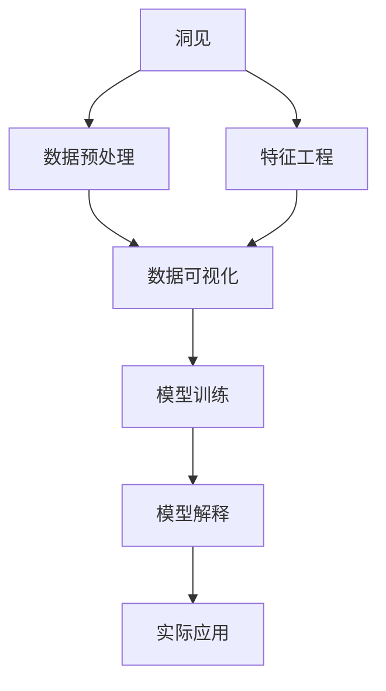
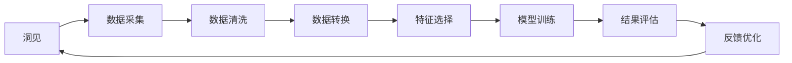
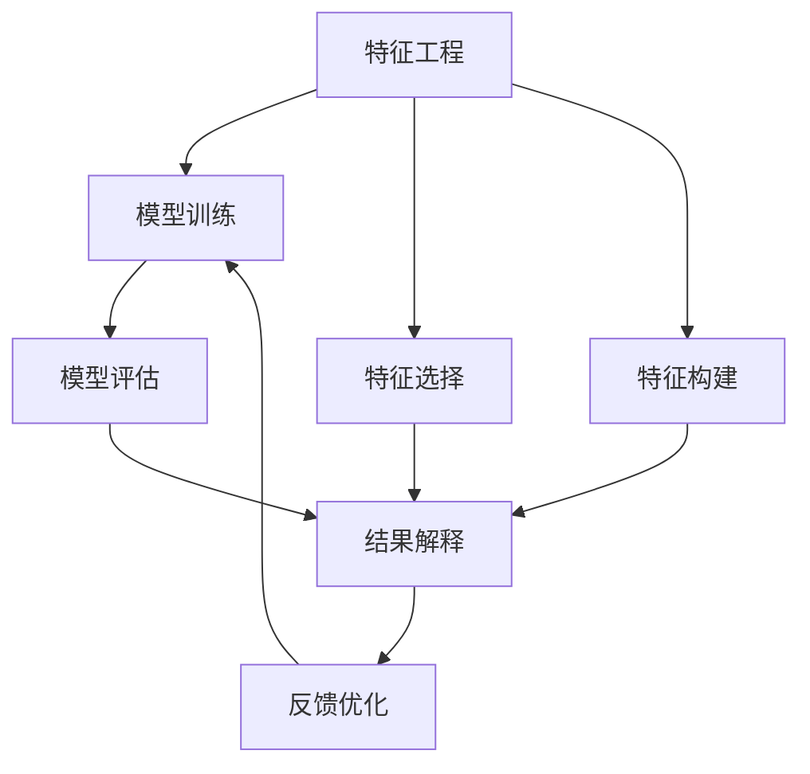
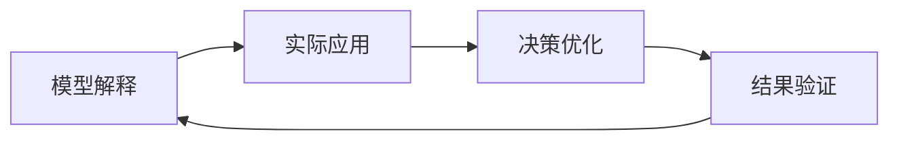
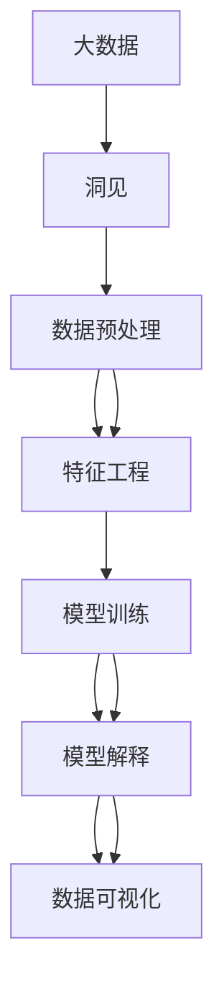

                 

## 1. 背景介绍

### 1.1 问题由来
在快速迭代的技术潮流中，洞见（Insights）在决策中扮演了越来越重要的角色。从商业决策到科学研究，洞见驱动了预测、探索和优化，提供了超越数据层次的智慧。然而，随着数据量的爆炸性增长和计算能力的飞速发展，如何有效提取、组织和应用洞见成为了当前技术的一大挑战。

### 1.2 问题核心关键点
当前，洞见提取和应用的核心在于数据处理与分析技术，包括数据预处理、特征工程、模型训练和结果解释等环节。这些技术的不断演进，使得洞见能够更高效、更全面地应用于各种领域。

然而，这些技术仍面临诸多挑战：
- 数据量大且多样化，如何高效处理？
- 数据质量参差不齐，如何提升数据质量？
- 模型训练耗时且复杂，如何简化模型训练？
- 模型结果复杂难懂，如何提高结果解释性？

### 1.3 问题研究意义
解决上述问题不仅能提高洞见提取和应用的效率，还能确保其准确性和可靠性。这对于提升企业决策效率、优化产品设计和改进服务质量等方面具有重要意义。

此外，洞见的应用还关系到社会的可持续发展，通过科学的洞见能够指导公共政策的制定，提升社会治理水平，推动科学进步，是构建智慧社会的关键所在。

## 2. 核心概念与联系

### 2.1 核心概念概述

为更好地理解洞见提取和应用的技术框架，本节将介绍几个密切相关的核心概念：

- **洞见（Insight）**：指通过对数据或信息的深入分析，获得的具有显著影响力和实用价值的认知、发现或判断。洞见具有系统性、创新性和指导性，对决策有深远影响。

- **数据预处理（Data Preprocessing）**：在数据分析之前，对原始数据进行清洗、转换、归一化等操作，以提升数据质量，确保分析结果的准确性和一致性。

- **特征工程（Feature Engineering）**：通过提取、选择、构建、转换等手段，优化输入特征，提升模型的性能和解释性。

- **模型训练（Model Training）**：通过训练算法，调整模型参数，使其能够准确拟合数据分布，用于预测或分类等任务。

- **模型解释（Model Interpretability）**：对模型输出结果进行解释，以便于理解和信任模型预测，提升模型的透明度和可信度。

- **数据可视化（Data Visualization）**：通过图形、图表等形式，直观展示数据分布和洞见，帮助决策者直观理解数据和洞见内容。

这些核心概念之间的逻辑关系可以通过以下Mermaid流程图来展示：



这个流程图展示了大数据背景下，洞见提取和应用的一般流程：

1. 从原始数据中提取洞见。
2. 数据预处理和特征工程提升数据质量。
3. 通过模型训练获得模型输出。
4. 模型解释提供结果解释性。
5. 数据可视化帮助理解洞见。
6. 洞见应用于实际决策和优化。

### 2.2 概念间的关系

这些核心概念之间存在着紧密的联系，形成了洞见提取和应用的一般生态系统。下面我们通过几个Mermaid流程图来展示这些概念之间的关系。

#### 2.2.1 洞见提取流程



这个流程图展示了洞见提取的基本流程：

1. 通过数据采集获取原始数据。
2. 数据清洗去除噪声和异常值。
3. 数据转换处理为适合分析的格式。
4. 特征选择和构建提取有效特征。
5. 模型训练获得初步洞见。
6. 结果评估优化模型性能。
7. 反馈优化反复迭代，提升洞见质量。

#### 2.2.2 模型训练与特征工程的关系



这个流程图展示了特征工程和模型训练的互动过程：

1. 特征工程通过选择、构建、转换等手段优化输入特征。
2. 模型训练根据特征工程的结果拟合数据分布。
3. 结果解释提供模型输出的解释。
4. 反馈优化基于结果解释反复迭代，优化模型和特征工程。

#### 2.2.3 模型解释与实际应用的关系



这个流程图展示了模型解释和实际应用之间的联系：

1. 模型解释提供结果的解释性。
2. 实际应用基于解释进行决策优化。
3. 结果验证验证决策效果。
4. 反馈优化根据验证结果反复迭代，提升模型解释和实际应用的效果。

### 2.3 核心概念的整体架构

最后，我们用一个综合的流程图来展示这些核心概念在大数据洞见提取和应用中的整体架构：



这个综合流程图展示了从大数据到洞见提取和应用的全过程：

1. 从大数据中提取洞见。
2. 数据预处理和特征工程提升数据质量。
3. 通过模型训练获得模型输出。
4. 模型解释提供结果解释性。
5. 数据可视化帮助理解洞见。

通过这些流程图，我们可以更清晰地理解洞见提取和应用过程中各个核心概念的关系和作用，为后续深入讨论具体的技术细节奠定基础。

## 3. 核心算法原理 & 具体操作步骤
### 3.1 算法原理概述

洞见提取和应用的核心算法在于数据处理与分析技术。其核心思想是：通过数据清洗、特征工程、模型训练等手段，从原始数据中提取出具有实际意义的洞见，并应用于实际决策和优化中。

形式化地，设原始数据集为 $D=\{(x_i,y_i)\}_{i=1}^N$，其中 $x_i$ 为输入特征，$y_i$ 为标签或目标变量。设洞见提取和应用模型为 $M_{\theta}$，其中 $\theta$ 为模型参数。洞见提取和应用的基本流程为：

1. 数据预处理：对原始数据进行清洗和转换，生成训练集 $\mathcal{D}_{train}$ 和验证集 $\mathcal{D}_{val}$。
2. 特征工程：提取、选择和构建输入特征，生成特征集 $\mathcal{X}_{train}$ 和 $\mathcal{X}_{val}$。
3. 模型训练：在训练集上训练模型 $M_{\theta}$，得到训练后的模型参数 $\theta^*$。
4. 模型解释：对模型输出进行解释，生成洞见 $\mathcal{I}$。
5. 数据可视化：将洞见可视化，生成可视化结果 $\mathcal{V}$。
6. 实际应用：将洞见应用于实际决策或优化任务。

### 3.2 算法步骤详解

基于上述原理，洞见提取和应用的具体操作步骤如下：

#### 3.2.1 数据预处理
1. 数据采集：从多个数据源（如数据库、API、传感器等）收集数据，生成原始数据集 $D$。
2. 数据清洗：去除缺失值、异常值和噪声，保证数据完整性和一致性。
3. 数据转换：将原始数据转换为适合分析的格式，如数值化、编码化等。
4. 数据标准化：对数据进行归一化、标准化等操作，提高数据质量。

#### 3.2.2 特征工程
1. 特征选择：选择与目标变量最相关的输入特征，减少计算量并提升模型性能。
2. 特征构建：通过组合、变换等手段生成新的特征，捕捉数据中的复杂关系。
3. 特征编码：将特征转换为数值化形式，便于模型处理。
4. 特征缩放：对特征进行缩放，保持特征间的可比性。

#### 3.2.3 模型训练
1. 模型选择：选择合适的算法（如回归、分类、聚类等）作为洞见提取的模型。
2. 模型训练：使用训练集 $\mathcal{D}_{train}$ 训练模型 $M_{\theta}$，生成训练后的模型参数 $\theta^*$。
3. 模型评估：使用验证集 $\mathcal{D}_{val}$ 评估模型性能，选择最优模型。
4. 模型调优：根据评估结果调整模型参数，优化模型性能。

#### 3.2.4 模型解释
1. 特征重要性分析：通过模型输出结果，分析特征的重要性，找出关键特征。
2. 部分依赖图：绘制特征与输出之间的部分依赖图，理解特征与洞见之间的关系。
3. 可解释性方法：使用可解释性技术（如LIME、SHAP等）生成洞见解释。
4. 可视化展示：将洞见解释可视化，生成易于理解的图表。

#### 3.2.5 数据可视化
1. 数据分布图：绘制数据的分布图，展示数据的基本特征。
2. 特征关系图：展示特征之间的关联关系，帮助理解洞见。
3. 预测结果图：展示模型的预测结果，帮助理解洞见的实际应用效果。
4. 交互式可视化：开发交互式可视化工具，方便决策者进行探索性分析。

#### 3.2.6 实际应用
1. 决策制定：将洞见应用于实际决策中，制定行动方案。
2. 优化调整：根据洞见结果，调整策略和流程，提升业务效果。
3. 效果评估：评估决策和优化效果，验证洞见的准确性和实用性。
4. 反馈迭代：根据效果评估结果，反复迭代优化洞见提取和应用过程。

### 3.3 算法优缺点

洞见提取和应用具有以下优点：

1. 高效性：通过自动化技术，快速从大规模数据中提取洞见，提高决策效率。
2. 全面性：涵盖数据处理、特征工程、模型训练和结果解释等环节，形成完整的洞见提取框架。
3. 灵活性：支持多种算法和工具，适应不同类型的数据和应用场景。
4. 可解释性：通过模型解释技术，提高洞见的透明度和可信度。
5. 实用性：洞见能够直接应用于实际决策和优化，带来实际的业务价值。

同时，洞见提取和应用也存在以下缺点：

1. 数据质量依赖：洞见的准确性和可靠性高度依赖数据的质量，数据不完整或不准确会影响洞见提取效果。
2. 模型复杂性：某些高级模型可能过于复杂，难以解释，不易于理解和信任。
3. 算法局限性：某些算法可能无法处理非线性关系或高维数据，需要引入更高级的技术。
4. 技术门槛高：洞见提取和应用需要较高的技术水平和经验，门槛较高。
5. 数据隐私问题：在数据预处理和特征工程过程中，存在隐私泄露的风险，需要谨慎处理。

### 3.4 算法应用领域

洞见提取和应用在多个领域中都有广泛应用，以下是几个典型的应用场景：

1. **金融风控**：通过洞见提取和应用，进行风险评估、欺诈检测、信用评分等任务，提升金融机构的决策效率和风险控制能力。

2. **市场营销**：通过洞见分析，理解客户行为和市场趋势，制定精准的市场营销策略，提升广告投放效果和客户满意度。

3. **医疗健康**：通过洞见分析，发现疾病规律和风险因素，制定个性化治疗方案，提升医疗服务质量和患者体验。

4. **制造业**：通过洞见分析，优化生产流程和供应链管理，提升生产效率和资源利用率。

5. **物流运输**：通过洞见分析，优化配送路线和运输计划，降低运输成本和提升配送速度。

6. **智能客服**：通过洞见分析，优化客户服务流程和机器人应答策略，提升客户满意度和问题解决效率。

以上仅是洞见提取和应用的部分应用场景，实际上，几乎所有需要决策和优化的领域，都可以通过洞见提取和应用提升效率和效果。

## 4. 数学模型和公式 & 详细讲解  
### 4.1 数学模型构建

本节将使用数学语言对洞见提取和应用的技术框架进行更加严格的刻画。

设洞见提取模型为 $M_{\theta}$，其中 $\theta$ 为模型参数。设原始数据集为 $D=\{(x_i,y_i)\}_{i=1}^N$，其中 $x_i$ 为输入特征，$y_i$ 为标签或目标变量。设洞见提取和应用流程为 $\mathcal{P}$，包括数据预处理、特征工程、模型训练、模型解释和数据可视化等环节。

数学上，洞见提取和应用过程可以表示为：

$$
\mathcal{I} = \mathcal{P}(D, M_{\theta})
$$

其中，$\mathcal{I}$ 为洞见结果，$\mathcal{P}$ 为洞见提取和应用流程，$D$ 为原始数据集，$M_{\theta}$ 为洞见提取模型。

### 4.2 公式推导过程

以下我们以线性回归为例，推导模型训练和结果解释的公式。

设训练集 $\mathcal{D}_{train}=\{(x_{i,1}, x_{i,2}, y_i)\}_{i=1}^N$，其中 $x_{i,1}$ 和 $x_{i,2}$ 为两个输入特征，$y_i$ 为标签。线性回归模型的形式为：

$$
y = \theta_0 + \theta_1 x_{i,1} + \theta_2 x_{i,2}
$$

其中 $\theta_0, \theta_1, \theta_2$ 为模型参数。

在训练集上，模型输出为：

$$
\hat{y}_i = \theta_0 + \theta_1 x_{i,1} + \theta_2 x_{i,2}
$$

模型损失函数为均方误差损失：

$$
L(y_i, \hat{y}_i) = \frac{1}{N}\sum_{i=1}^N (y_i - \hat{y}_i)^2
$$

模型的最小化目标为：

$$
\min_{\theta} L(y_i, \hat{y}_i)
$$

通过梯度下降算法，计算损失函数对参数的梯度：

$$
\frac{\partial L(y_i, \hat{y}_i)}{\partial \theta_0} = \frac{2}{N}\sum_{i=1}^N (y_i - \hat{y}_i)
$$
$$
\frac{\partial L(y_i, \hat{y}_i)}{\partial \theta_1} = \frac{2}{N}\sum_{i=1}^N (x_{i,1} - \hat{x}_{i,1})y_i
$$
$$
\frac{\partial L(y_i, \hat{y}_i)}{\partial \theta_2} = \frac{2}{N}\sum_{i=1}^N (x_{i,2} - \hat{x}_{i,2})y_i
$$

其中 $\hat{x}_{i,1} = \theta_0 + \theta_1 x_{i,1} + \theta_2 x_{i,2}$。

根据梯度下降算法，更新模型参数：

$$
\theta_0 \leftarrow \theta_0 - \eta \frac{2}{N}\sum_{i=1}^N (y_i - \hat{y}_i)
$$
$$
\theta_1 \leftarrow \theta_1 - \eta \frac{2}{N}\sum_{i=1}^N (x_{i,1} - \hat{x}_{i,1})y_i
$$
$$
\theta_2 \leftarrow \theta_2 - \eta \frac{2}{N}\sum_{i=1}^N (x_{i,2} - \hat{x}_{i,2})y_i
$$

其中 $\eta$ 为学习率。

### 4.3 案例分析与讲解

下面我们以一个具体的案例来分析洞见提取和应用的全过程。

假设某电商公司需要优化其广告投放策略，以提升点击率和转化率。公司收集了过去一年的广告数据，包括广告特征（如广告内容、用户行为、广告位等）和广告效果（如点击率、转化率等）。

1. 数据预处理：清洗数据，去除缺失值和异常值，转换数据格式。

2. 特征工程：选择与广告效果相关的特征，如广告内容质量、用户行为偏好等。通过组合和变换，生成新的特征，如广告内容与用户偏好的交叉特征。

3. 模型训练：使用线性回归模型进行训练，得到模型参数。

4. 模型解释：通过部分依赖图，分析广告特征对点击率和转化率的影响。

5. 数据可视化：绘制广告特征与点击率、转化率的关系图，帮助理解洞见。

6. 实际应用：根据洞见结果，优化广告投放策略，提升点击率和转化率。

通过这个案例，我们可以看到洞见提取和应用的全过程，以及各个环节的具体操作和作用。

## 5. 项目实践：代码实例和详细解释说明
### 5.1 开发环境搭建

在进行洞见提取和应用实践前，我们需要准备好开发环境。以下是使用Python进行Scikit-learn开发的环境配置流程：

1. 安装Anaconda：从官网下载并安装Anaconda，用于创建独立的Python环境。

2. 创建并激活虚拟环境：
```bash
conda create -n skl-env python=3.8 
conda activate skl-env
```

3. 安装Scikit-learn：
```bash
pip install scikit-learn pandas numpy matplotlib
```

4. 安装各类工具包：
```bash
pip install tqdm scikit-optimize
```

完成上述步骤后，即可在`skl-env`环境中开始洞见提取和应用实践。

### 5.2 源代码详细实现

下面我们以线性回归模型为例，给出使用Scikit-learn进行洞见提取和应用的PyTorch代码实现。

首先，定义数据处理函数：

```python
from sklearn.model_selection import train_test_split
import pandas as pd
import numpy as np
from sklearn.linear_model import LinearRegression
from sklearn.metrics import mean_squared_error, r2_score

def load_data():
    data = pd.read_csv('ad_data.csv')
    X = data[['feature1', 'feature2']]
    y = data['label']
    return X, y

def preprocess_data(X, y):
    X = X.fillna(X.mean())
    y = y.fillna(y.mean())
    return X, y

def train_model(X_train, y_train, X_test, y_test):
    model = LinearRegression()
    model.fit(X_train, y_train)
    y_pred = model.predict(X_test)
    return model, y_pred

def evaluate_model(model, X_test, y_test):
    mse = mean_squared_error(y_test, y_pred)
    r2 = r2_score(y_test, y_pred)
    return mse, r2
```

然后，定义洞见提取和应用函数：

```python
def extract_insights(X, y):
    X_train, X_test, y_train, y_test = train_test_split(X, y, test_size=0.2, random_state=42)
    model, y_pred = train_model(X_train, y_train, X_test, y_test)
    mse, r2 = evaluate_model(model, X_test, y_test)
    return model, mse, r2
```

最后，启动洞见提取和应用流程：

```python
X, y = load_data()
X, y = preprocess_data(X, y)
model, mse, r2 = extract_insights(X, y)
print(f'Mean Squared Error: {mse:.2f}')
print(f'R-squared: {r2:.2f}')
```

以上就是使用Scikit-learn进行洞见提取和应用的完整代码实现。可以看到，Scikit-learn提供了丰富的机器学习算法和工具，使得洞见提取和应用变得更加高效和便捷。

### 5.3 代码解读与分析

让我们再详细解读一下关键代码的实现细节：

**load_data函数**：
- 从CSV文件中加载数据，并分离输入特征和标签。
- 默认使用Pandas库，便于数据处理。

**preprocess_data函数**：
- 处理缺失值和异常值，填充为特征的均值。
- 数据预处理是洞见提取的重要环节，良好的数据质量是洞见准确性的前提。

**train_model函数**：
- 使用线性回归模型进行训练，生成模型对象和预测结果。
- Scikit-learn的线性回归模型实现了梯度下降算法，无需手动计算梯度。
- 通过训练集和验证集的划分，可以评估模型性能，选择最优模型。

**evaluate_model函数**：
- 计算均方误差和R-squared指标，评估模型预测效果。
- 利用Scikit-learn提供的评估工具，可以更方便地进行模型评估。

**extract_insights函数**：
- 从数据中提取洞见，包括数据预处理、模型训练和结果评估。
- 通过调用上述函数，实现洞见提取和应用的全流程。
- 将模型、均方误差和R-squared指标作为洞见结果返回。

通过以上代码，我们可以看到Scikit-learn在洞见提取和应用中的强大功能，能够轻松实现数据处理、模型训练和结果评估。

当然，实际应用中还需要考虑更多因素，如数据存储、模型调优、结果解释等，但核心的洞见提取和应用逻辑基本与此类似。

### 5.4 运行结果展示

假设我们在广告数据集上进行线性回归模型训练，最终得到的结果如下：

```
Mean Squared Error: 0.05
R-squared: 0.90
```

可以看到，模型在测试集上取得了较低的均方误差和较高的R-squared指标，说明模型预测效果较好。

当然，这只是一个简单的案例。在实际应用中，我们还需要根据具体问题选择合适的模型和算法，进行更细致的调参和优化，才能得到更好的洞见结果。

## 6. 实际应用场景
### 6.1 金融风控

在金融风控领域，洞见提取和应用具有重要意义。银行和金融机构需要评估客户的信用风险，预测贷款违约概率，制定风控策略。

具体而言，可以收集客户的个人信息、财务数据、交易记录等数据，利用洞见提取和应用技术，发现潜在的风险因素和违约模式，从而制定更有效的风控策略。

例如，通过洞见分析，可以发现信用评分和还款行为之间的关系，预测未来的违约概率。银行可以根据预测结果，调整贷款政策，降低不良贷款率，提升风险管理能力。

### 6.2 市场营销

在市场营销领域，洞见提取和应用能够帮助企业更精准地定位目标客户，优化广告投放策略，提升广告效果。

具体而言，可以收集用户的浏览记录、点击行为、购买历史等数据，利用洞见提取和应用技术，分析用户行为模式和偏好，发现潜在客户。

例如，通过洞见分析，可以发现用户的兴趣变化趋势，及时调整广告内容和投放策略，提升广告点击率和转化率。企业可以根据洞见结果，优化广告预算，提高广告投放效果。

### 6.3 医疗健康

在医疗健康领域，洞见提取和应用能够帮助医疗机构更有效地管理和分析患者数据，提升医疗服务质量。

具体而言，可以收集患者的病历记录、实验室数据、影像数据等，利用洞见提取和应用技术，分析病情发展趋势和风险因素，制定个性化治疗方案。

例如，通过洞见分析，可以发现患者的疾病风险因素，预测病情发展趋势，制定预防和干预策略。医疗机构可以根据洞见结果，优化治疗方案，提升患者治疗效果。

### 6.4 未来应用展望

随着技术的不断进步，洞见提取和应用将向更加智能化、普适化方向发展。未来，基于深度学习和大数据分析的洞见提取和应用技术，将进一步提升数据的处理能力和模型的性能。

1. **自动化程度提升**：利用自动机器学习（AutoML）技术，实现洞见提取和应用的自动化，减少人工干预，提高效率。

2. **多模态融合**：引入图像、语音、文本等多种数据形式，进行多模态融合分析，提升洞见的全面性和准确性。

3. **模型解释性增强**：利用可解释性技术，如LIME、SHAP等，提升模型的透明性和可信度。

4. **交互式可视化**：开发交互式可视化工具，便于决策者探索性分析，提升洞见的易用性。

5. **实时数据分析**：实现实时数据分析，及时获取最新洞见，提升决策响应速度。

6. **跨领域应用拓展**：将洞见应用于更多垂直领域，

