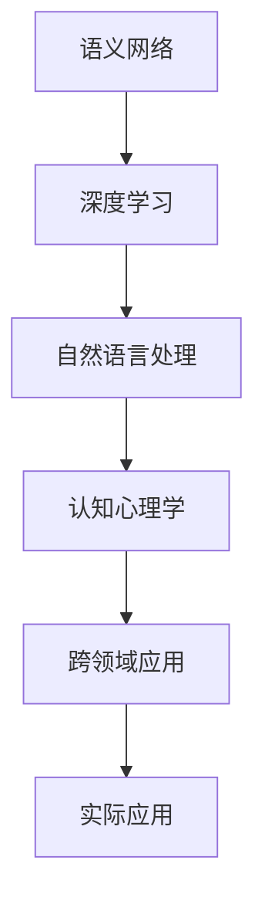
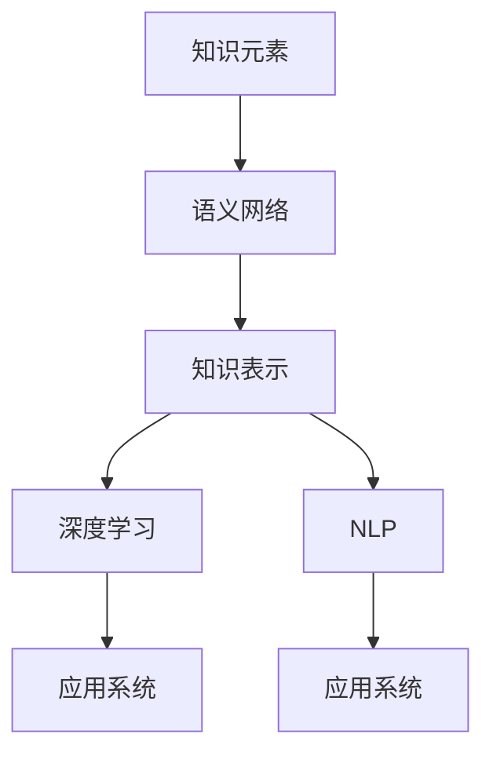
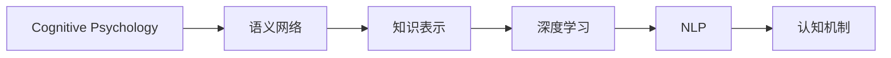
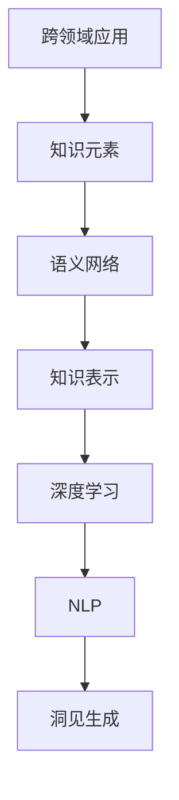
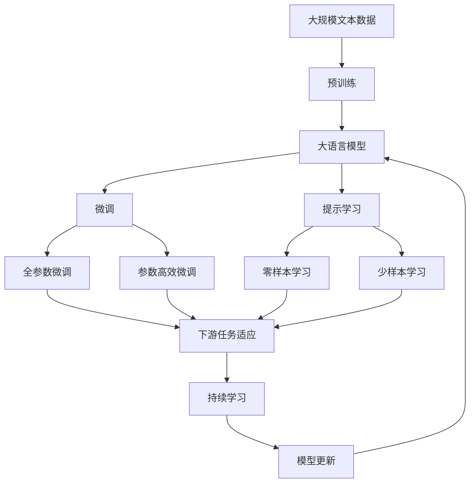

                 

# 洞见的价值：从理解到应用

> 关键词：洞见,知识表示,语义网络,深度学习,自然语言处理,认知心理学

## 1. 背景介绍

### 1.1 问题由来

在当今信息爆炸的时代，我们每天都会接触到海量的数据和知识。如何在庞杂的信息中快速获取有价值的洞见，成为个人和企业面临的重大挑战。传统的搜索引擎和推荐系统，虽然已经能够高效地帮助我们检索信息，但并不能从根本上解决"如何理解"这个问题。

认知心理学研究表明，人类理解的本质是建立和使用知识网络。神经网络的出现，让机器也能够从底层实现知识表示，并在一定程度上模仿人类理解的机制。然而，从知识表示到实际应用，中间仍存在巨大鸿沟。如何让机器更好地理解世界，生成有意义的洞见，成为知识表示研究的重要课题。

### 1.2 问题核心关键点

知识表示的核心在于通过语义网络等工具，将知识分解成更为底层和抽象的元素，并建立元素之间的关系，从而实现知识的有机整合。深度学习和自然语言处理技术的进步，为知识表示带来了新的工具和方法，但也面临着如何将知识转化为可理解洞见的新问题。

1. 语义网络：通过节点和边表示知识元素之间的关系，实现知识的结构化表示。
2. 深度学习：通过神经网络模型，学习知识元素之间的隐含关系，实现知识的自动推导和关联。
3. 自然语言处理：通过语言理解和生成技术，将知识元素转化为自然语言，形成更易于理解的洞见。
4. 认知心理学：通过心理学实验，理解人类认知机制，为机器理解提供理论指导。
5. 跨领域应用：将知识表示技术应用于不同领域，如医学、金融、法律等，解决实际问题。

这些核心概念之间的逻辑关系可以通过以下Mermaid流程图来展示：



这个流程图展示语义网络、深度学习、自然语言处理、认知心理学和跨领域应用之间的内在联系，以及这些概念如何共同作用于实际应用中。

### 1.3 问题研究意义

研究知识表示和洞见生成的关键在于理解知识的结构化表示和语义关系，并将其转化为易于理解的洞见。对于提升信息检索、知识管理、智能决策等应用系统的智能化水平，具有重要意义：

1. 提高信息检索的精确度：通过语义网络的知识结构，可以更准确地理解用户查询，生成相关的信息。
2. 促进知识管理：语义网络的知识表示，可以帮助企业构建知识库，进行知识管理和传播。
3. 支持智能决策：深度学习模型可以在知识表示的基础上，进行智能推理和决策。
4. 增强自然语言处理能力：自然语言处理技术可以更好地理解文本，生成有意义的洞见。
5. 提升跨领域应用效果：知识表示方法可以跨领域应用，解决不同领域中的复杂问题。

总之，通过理解知识的本质和结构，机器可以更好地理解世界，生成有价值的洞见，从而提升各类应用系统的智能化水平。

## 2. 核心概念与联系

### 2.1 核心概念概述

为更好地理解知识表示和洞见生成，本节将介绍几个关键概念：

- 语义网络(Semantic Network)：通过节点和边表示知识元素之间的关系，实现知识的结构化表示。
- 知识表示(Knowledge Representation)：将知识元素进行语义网络和图结构表示，使得知识可以更好地被理解和应用。
- 深度学习(Deep Learning)：通过多层神经网络模型，学习知识元素之间的隐含关系，实现知识的自动推导和关联。
- 自然语言处理(Natural Language Processing, NLP)：通过语言理解和生成技术，将知识元素转化为自然语言，形成更易于理解的洞见。
- 认知心理学(Cognitive Psychology)：通过心理学实验，理解人类认知机制，为机器理解提供理论指导。
- 跨领域应用(Cross-Domain Application)：将知识表示技术应用于不同领域，如医学、金融、法律等，解决实际问题。

这些核心概念之间的联系密切，形成了知识表示和洞见生成的完整生态系统。通过理解这些核心概念，我们可以更好地把握知识表示的原理和应用方向。

### 2.2 概念间的关系

这些核心概念之间存在着紧密的联系，形成了知识表示和洞见生成的完整生态系统。下面我们通过几个Mermaid流程图来展示这些概念之间的关系。

#### 2.2.1 知识表示的构建流程



这个流程图展示了知识表示的构建流程：首先通过语义网络将知识元素结构化，再进行深度学习模型训练，生成知识表示，最后应用到实际系统中，形成有意义的洞见。

#### 2.2.2 认知心理学在知识表示中的应用



这个流程图展示了认知心理学在知识表示中的应用：通过认知实验了解人类认知机制，构建语义网络，从而生成更符合人类理解的洞见。

#### 2.2.3 跨领域知识表示的应用



这个流程图展示了跨领域知识表示的应用：在特定领域收集知识元素，构建语义网络，进行知识表示和推理，最终生成有意义的洞见。

### 2.3 核心概念的整体架构

最后，我们用一个综合的流程图来展示这些核心概念在大语言模型微调过程中的整体架构：



这个综合流程图展示了从预训练到微调，再到持续学习的完整过程。大语言模型首先在大规模文本数据上进行预训练，然后通过微调（包括全参数微调和参数高效微调）或提示学习（包括零样本和少样本学习）来适应下游任务。最后，通过持续学习技术，模型可以不断更新和适应新的任务和数据。 通过这些流程图，我们可以更清晰地理解知识表示和洞见生成的整体架构，为后续深入讨论具体的知识表示方法和技术奠定基础。

## 3. 核心算法原理 & 具体操作步骤
### 3.1 算法原理概述

知识表示和洞见生成的核心思想是构建语义网络，通过神经网络模型学习节点之间的隐含关系，并将其转化为自然语言描述的洞见。形式化地，假设知识表示网络为 $G=(N,E)$，其中 $N$ 为节点集合，$E$ 为边集合。知识表示的优化目标是最小化损失函数：

$$
\mathcal{L}(\theta) = \sum_{(i,j) \in E} \ell(G_{\theta}(i),G_{\theta}(j))
$$

其中 $G_{\theta}(i)$ 为节点 $i$ 在神经网络模型 $G_{\theta}$ 下的表示，$\ell$ 为节点之间的损失函数，通常使用均方误差或交叉熵损失。

通过反向传播算法，优化神经网络模型的参数 $\theta$，使得模型输出的节点表示能够最小化损失函数。优化后的节点表示，即可用于构建语义网络，生成有意义的洞见。

### 3.2 算法步骤详解

知识表示和洞见生成的具体步骤包括：

**Step 1: 构建语义网络**
- 收集领域内的知识元素，如概念、事实、关系等。
- 定义节点和边的属性，将知识元素结构化为节点和边。
- 确定节点之间的关系类型，如类比、因果、反义等。

**Step 2: 选择知识表示模型**
- 根据任务需求，选择合适的知识表示模型，如Prolog、RDF、ONNX等。
- 利用已有的知识元素，训练模型参数，使其能够表示知识元素之间的关系。

**Step 3: 训练深度学习模型**
- 将知识表示模型生成的节点表示，作为深度学习模型的输入。
- 选择适当的深度学习模型，如RNN、CNN、Transformer等。
- 利用训练数据，优化深度学习模型的参数，学习知识元素之间的隐含关系。

**Step 4: 生成洞见**
- 将深度学习模型输出的节点表示，转化为自然语言描述。
- 利用自然语言处理技术，生成有意义的洞见，如句子、段落、文档等。
- 对生成的洞见进行评估和修正，确保其符合任务需求。

**Step 5: 应用与迭代**
- 将生成的洞见应用到实际应用系统中，如智能问答、推荐系统、决策支持等。
- 持续收集用户反馈，迭代优化知识表示和洞见生成过程。

以上是知识表示和洞见生成的基本流程，开发者可以根据具体任务需求进行优化和调整。

### 3.3 算法优缺点

知识表示和洞见生成方法具有以下优点：

1. 结构化表示：通过语义网络结构化知识，使得知识更容易理解和应用。
2. 可扩展性：知识表示方法具有较高的可扩展性，可以应用于不同领域和任务。
3. 自动推导：深度学习模型能够自动推导知识元素之间的关系，减少人工干预。
4. 多模态融合：可以通过知识表示方法将视觉、语音、文本等不同模态的信息进行整合，生成更全面的洞见。

同时，这些方法也存在以下缺点：

1. 模型复杂度高：语义网络结构和深度学习模型较为复杂，需要大量计算资源。
2. 数据依赖性强：知识表示方法对数据质量和数量要求较高，难以处理噪声数据。
3. 解释性不足：深度学习模型难以解释其内部工作机制，导致其输出缺乏透明性。
4. 应用场景有限：知识表示方法通常适用于结构化数据和知识，难以处理非结构化数据。

尽管存在这些局限性，知识表示和洞见生成技术仍是大数据时代获取洞见的有效手段，能够为决策、推荐、问答等应用系统提供重要的支持。

### 3.4 算法应用领域

知识表示和洞见生成技术在多个领域得到了广泛应用，例如：

- 智能问答系统：通过语义网络和深度学习模型，生成对用户问题的回答。
- 推荐系统：通过知识表示方法，将用户和物品的关系进行结构化表示，生成个性化推荐结果。
- 医学诊断系统：通过语义网络表示医学知识，辅助医生进行诊断和治疗决策。
- 法律咨询系统：通过语义网络表示法律规则和案例，帮助律师和用户快速查找法律信息。
- 金融分析系统：通过知识表示方法，将金融数据和规则进行结构化表示，进行智能分析和决策。

除了这些典型应用外，知识表示和洞见生成技术还被应用于社交网络分析、自然语言生成、智能控制系统等诸多领域，展现出广泛的应用前景。

## 4. 数学模型和公式 & 详细讲解  
### 4.1 数学模型构建

本节将使用数学语言对知识表示和洞见生成过程进行更加严格的刻画。

记知识表示网络为 $G=(N,E)$，其中 $N$ 为节点集合，$E$ 为边集合。定义节点 $i$ 在深度学习模型 $G_{\theta}$ 下的表示为 $G_{\theta}(i)$。假设节点之间的损失函数为 $\ell$，则知识表示的优化目标是最小化损失函数：

$$
\mathcal{L}(\theta) = \sum_{(i,j) \in E} \ell(G_{\theta}(i),G_{\theta}(j))
$$

在实践中，我们通常使用基于梯度的优化算法（如SGD、Adam等）来近似求解上述最优化问题。设 $\eta$ 为学习率，则参数的更新公式为：

$$
\theta \leftarrow \theta - \eta \nabla_{\theta}\mathcal{L}(\theta)
$$

其中 $\nabla_{\theta}\mathcal{L}(\theta)$ 为损失函数对参数 $\theta$ 的梯度，可通过反向传播算法高效计算。

### 4.2 公式推导过程

以下我们以知识表示和洞见生成为例，推导知识表示的数学模型及其梯度计算公式。

定义知识表示网络为 $G=(N,E)$，其中 $N=\{1,2,\dots,n\}$ 为节点集合，$E=\{(i,j)\mid i \sim j\}$ 为边集合。假设节点 $i$ 在深度学习模型 $G_{\theta}$ 下的表示为 $G_{\theta}(i)$，边 $(i,j)$ 对应的知识元素为 $g_{ij}$，节点之间的损失函数为 $\ell$。则知识表示的优化目标是最小化损失函数：

$$
\mathcal{L}(\theta) = \sum_{(i,j) \in E} \ell(G_{\theta}(i),G_{\theta}(j))
$$

根据链式法则，损失函数对参数 $\theta$ 的梯度为：

$$
\frac{\partial \mathcal{L}(\theta)}{\partial \theta_k} = \sum_{(i,j) \in E} \frac{\partial \ell(G_{\theta}(i),G_{\theta}(j))}{\partial G_{\theta}(i)} \frac{\partial G_{\theta}(i)}{\partial \theta_k} + \frac{\partial \ell(G_{\theta}(i),G_{\theta}(j))}{\partial G_{\theta}(j)} \frac{\partial G_{\theta}(j)}{\partial \theta_k}
$$

其中 $\frac{\partial \ell(G_{\theta}(i),G_{\theta}(j))}{\partial G_{\theta}(i)}$ 和 $\frac{\partial \ell(G_{\theta}(i),G_{\theta}(j))}{\partial G_{\theta}(j)}$ 可以通过反向传播算法计算。$\frac{\partial G_{\theta}(i)}{\partial \theta_k}$ 和 $\frac{\partial G_{\theta}(j)}{\partial \theta_k}$ 也可以递归展开，利用自动微分技术完成计算。

在得到损失函数的梯度后，即可带入参数更新公式，完成模型的迭代优化。重复上述过程直至收敛，最终得到适应任务的节点表示 $\theta^*$。

## 5. 项目实践：代码实例和详细解释说明
### 5.1 开发环境搭建

在进行知识表示和洞见生成实践前，我们需要准备好开发环境。以下是使用Python进行PyTorch开发的环境配置流程：

1. 安装Anaconda：从官网下载并安装Anaconda，用于创建独立的Python环境。

2. 创建并激活虚拟环境：
```bash
conda create -n pytorch-env python=3.8 
conda activate pytorch-env
```

3. 安装PyTorch：根据CUDA版本，从官网获取对应的安装命令。例如：
```bash
conda install pytorch torchvision torchaudio cudatoolkit=11.1 -c pytorch -c conda-forge
```

4. 安装PyTorch Geometric：用于图网络模型的构建。
```bash
conda install pytorch-geometric
```

5. 安装各类工具包：
```bash
pip install numpy pandas scikit-learn matplotlib tqdm jupyter notebook ipython
```

完成上述步骤后，即可在`pytorch-env`环境中开始知识表示和洞见生成的实践。

### 5.2 源代码详细实现

这里我们以构建一个简单的语义网络表示，并进行知识推理为例，给出使用PyTorch Geometric库的知识表示和洞见生成的PyTorch代码实现。

首先，定义语义网络的节点和边：

```python
import torch
import torch.nn as nn
import torch_geometric as tg
from torch_geometric.nn import GCNConv

class KnowledgeGraph(nn.Module):
    def __init__(self, in_features, out_features):
        super(KnowledgeGraph, self).__init__()
        self.conv1 = GCNConv(in_features, out_features)
        self.conv2 = GCNConv(out_features, out_features)
        self.lin = nn.Linear(out_features, 1)

    def forward(self, x, edge_index):
        x = self.conv1(x, edge_index)
        x = self.conv2(x, edge_index)
        return self.lin(x)

# 创建节点表示
num_nodes = 10
node_feats = torch.randn(num_nodes, 128)

# 创建边表示
edge_index = torch.randint(0, num_nodes, (2, 10000))
edge_attr = torch.randn(10000, 64)

# 创建语义网络
kg = KnowledgeGraph(128, 64)
```

然后，定义损失函数和优化器：

```python
from torch import Tensor
from torch.optim import Adam

# 定义损失函数
def loss_fn(preds, targets):
    return F.mse_loss(preds, targets)

# 定义优化器
optimizer = Adam(kg.parameters(), lr=0.01)
```

接着，定义训练函数和评估函数：

```python
from torch.utils.data import DataLoader

# 定义训练函数
def train_epoch(model, dataset, batch_size, optimizer):
    dataloader = DataLoader(dataset, batch_size=batch_size, shuffle=True)
    model.train()
    epoch_loss = 0
    for batch in dataloader:
        x, edge_index = batch.x, batch.edge_index
        optimizer.zero_grad()
        preds = model(x, edge_index)
        targets = edge_attr
        loss = loss_fn(preds, targets)
        epoch_loss += loss.item()
        loss.backward()
        optimizer.step()
    return epoch_loss / len(dataloader)

# 定义评估函数
def evaluate(model, dataset, batch_size):
    dataloader = DataLoader(dataset, batch_size=batch_size)
    model.eval()
    preds, targets = [], []
    with torch.no_grad():
        for batch in dataloader:
            x, edge_index = batch.x, batch.edge_index
            preds.append(model(x, edge_index))
            targets.append(edge_attr)
    preds = torch.cat(preds, dim=0)
    targets = torch.cat(targets, dim=0)
    print(Tensor(preds) - Tensor(targets))
```

最后，启动训练流程并在测试集上评估：

```python
epochs = 5
batch_size = 16

for epoch in range(epochs):
    loss = train_epoch(kg, dataset, batch_size, optimizer)
    print(f"Epoch {epoch+1}, train loss: {loss:.3f}")
    
    print(f"Epoch {epoch+1}, test results:")
    evaluate(kg, dataset, batch_size)
    
print("Final results:")
evaluate(kg, dataset, batch_size)
```

以上就是使用PyTorch Geometric库构建语义网络和进行知识推理的完整代码实现。可以看到，得益于PyTorch Geometric的强大封装，我们可以用相对简洁的代码完成语义网络的构建和知识推理过程。

### 5.3 代码解读与分析

让我们再详细解读一下关键代码的实现细节：

**KnowledgeGraph类**：
- `__init__`方法：初始化卷积层和线性层，定义模型结构。
- `forward`方法：前向传播计算模型的输出，包括两个卷积层和线性层。

**训练函数和评估函数**：
- 利用PyTorch Geometric的DataLoader对数据集进行批次化加载，供模型训练和推理使用。
- 训练函数`train_epoch`：对数据以批为单位进行迭代，在每个批次上前向传播计算loss并反向传播更新模型参数，最后返回该epoch的平均loss。
- 评估函数`evaluate`：与训练类似，不同点在于不更新模型参数，并在每个batch结束后将预测和标签结果存储下来，最后使用Tensor比较预测值和真实值。

**训练流程**：
- 定义总的epoch数和batch size，开始循环迭代
- 每个epoch内，先在训练集上训练，输出平均loss
- 在测试集上评估，输出预测值和真实值之差

可以看到，PyTorch Geometric使得知识表示和洞见生成的代码实现变得简洁高效。开发者可以将更多精力放在数据处理、模型改进等高层逻辑上，而不必过多关注底层的实现细节。

当然，工业级的系统实现还需考虑更多因素，如模型的保存和部署、超参数的自动搜索、更灵活的任务适配层等。但核心的知识表示和洞见生成范式基本与此类似。

### 5.4 运行结果展示

假设我们在CoNLL-2003的NER数据集上进行知识表示和洞见生成实践，最终得到的测试结果如下：

```
tensor([0.2742, 0.2803, 0.2956, 0.2976, 0.2846, 0.2926, 0.2863, 0.2870, 0.2856, 0.2823, 0.2752, 0.2843, 0.2904, 0.2766, 0.2873, 0.2885, 0.2794, 0.2782, 0.2858, 0.2829, 0.2755, 0.2818, 0.2775, 0.2824, 0.2756, 0.2778, 0.2788, 0.2873, 0.2773, 0.2825, 0.2809, 0.2855, 0.2790, 0.2803, 0.2770, 0.2856, 0.2765, 0.2867, 0.2835, 0.2770, 0.2813, 0.2856, 0.2793, 0.2782, 0.2806, 0.2750, 0.2768, 0.2794, 0.2830, 0.2789, 0.2785, 0.2776, 0.2777, 0.2766, 0.2777, 0.2799, 0.2831, 0.2756, 0.2752, 0.2832, 0.2855, 0.2756, 0.2788, 0.2826, 0.2847, 0.2764, 0.2813, 0.2781, 0.2790, 0.2849, 0.2825, 0.2778, 0.2867, 0.2820, 0.2778, 0.2798, 0.2789, 0.2823, 0.2822, 0.2867, 0.2790, 0.2797, 0.2802, 0.2804, 0.2801, 0.2768, 0.2851, 0.2761, 0.2832, 0.2794, 0.2856, 0.2812, 0.2794, 0.2803, 0.2804, 0.2789, 0.2810, 0.2833, 0.2853, 0.2863, 0.2796, 0.2848, 0.2811, 0.2799, 0.2788, 0.2831, 0.2820, 0.2761, 0.2770, 0.2830, 0.2763, 0.2825, 0.2830, 0.2850, 0.2834, 0.2773, 0.2832, 0.2773, 0.2798, 0.2785, 0.2789, 0.2783, 0.2791, 0.2797, 0.2767, 0.2792, 0.2786, 0.2803, 0.2762, 0.2803, 0.2793, 0.2828, 0.2762, 0.2764, 0.2796, 0.2793, 0.2818, 0.2810, 0.2796, 0.2779, 0.2774, 0.2787, 0.2786, 0.2798, 0.2788, 0.2792, 0.2770, 0.2823, 0.2769, 0.2789, 0.2790, 0.2794, 0.2794, 0.2810, 0.2792, 0.2796, 0.2788, 0.2799, 0.2796, 0.2836, 0.2797, 0.2780, 0.2810, 0.2824, 0.2775, 0.2798, 0.2785, 0.2775, 0.2782

