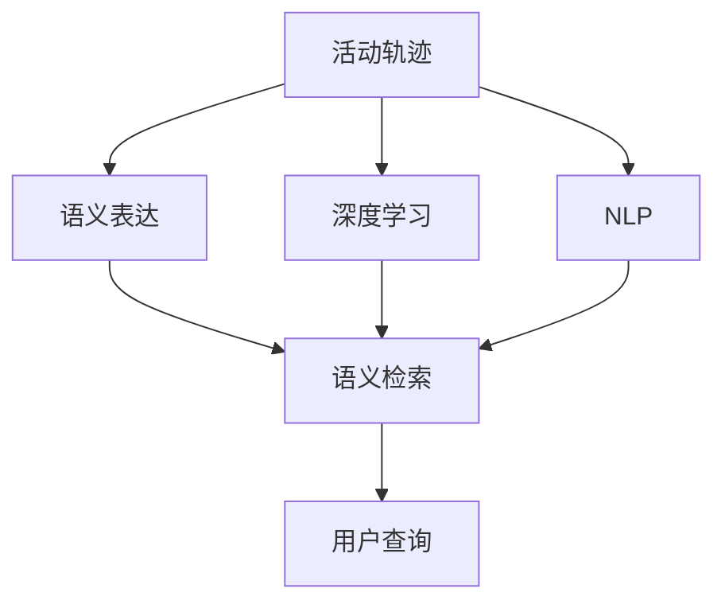
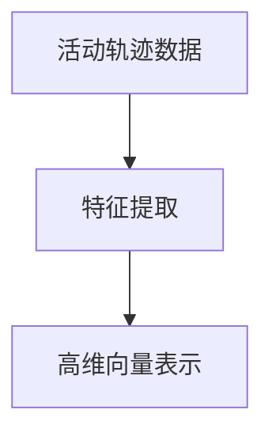
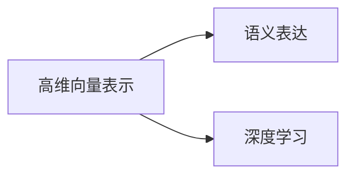
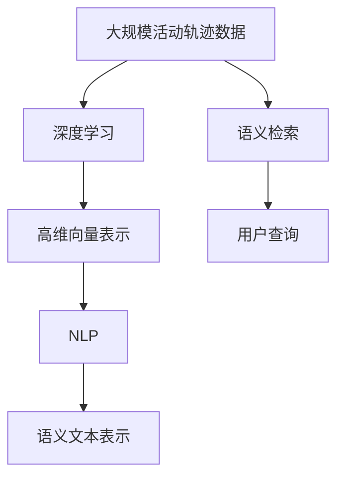

                 

# 活动轨迹的语义表达与搜索技术研究

> 关键词：轨迹分析,语义表达,搜索技术,机器学习,深度学习,自然语言处理

## 1. 背景介绍

### 1.1 问题由来
在现代信息化社会中，活动轨迹数据无处不在。从智能手机的GPS记录，到社交媒体的动态发布，再到物联网设备的实时监控，活动轨迹数据正日益成为各大企业和研究机构的重要资产。然而，大规模活动轨迹数据的处理和分析，面临着数据量大、复杂性高、实时性需求强等诸多挑战。如何高效、准确地表达和搜索活动轨迹数据，成为信息时代亟需解决的关键问题。

### 1.2 问题核心关键点
活动轨迹的语义表达与搜索技术，旨在将复杂的活动轨迹数据转换为易于理解和搜索的语言信息，帮助用户快速定位、分析和理解轨迹事件。该技术的主要关键点包括：

- 数据采集与预处理：收集高质量的活动轨迹数据，并进行必要的清洗、标注和预处理。
- 语义表示学习：设计合适的模型和算法，将轨迹数据转化为语义丰富的表示。
- 语义检索与分析：构建高效的检索模型和算法，支持对轨迹数据的快速检索和深入分析。

### 1.3 问题研究意义
活动轨迹的语义表达与搜索技术，对于提升城市管理、安全监控、个人隐私保护、精准营销等领域的应用价值具有重要意义：

1. 提高城市管理效率。通过对城市活动轨迹的分析，可以识别出人群聚集、交通流量变化等关键信息，为城市规划、交通管理提供科学依据。
2. 增强安全监控能力。通过对潜在安全事件的及时预警，可以提前防范各类风险，保障公共安全。
3. 促进精准营销。通过分析用户活动轨迹，可以了解用户行为模式和兴趣偏好，提供更加个性化、定制化的营销服务。
4. 保护个人隐私。通过对活动轨迹的语义表达，可以为用户提供更加安全、透明的隐私保护措施。

总之，活动轨迹的语义表达与搜索技术，不仅能够提升数据处理的效率和精度，还能为用户带来更加智能、便捷的体验。

## 2. 核心概念与联系

### 2.1 核心概念概述

为更好地理解活动轨迹的语义表达与搜索技术，本节将介绍几个密切相关的核心概念：

- 活动轨迹(Actuality Path)：指个体或物体的移动路径和行为记录，通常以时间和空间坐标的形式存在。
- 语义表达(Semantic Representation)：指将原始活动轨迹数据转换为语义丰富的表示，便于用户理解和检索。
- 语义检索(Semantic Retrieval)：指基于语义表达的检索技术，支持对轨迹数据的快速定位和分析。
- 深度学习(Deep Learning)：一种基于神经网络的机器学习技术，能够自动学习数据的高级特征表示。
- 自然语言处理(Natural Language Processing, NLP)：研究如何使计算机理解、处理和生成人类自然语言的技术。

这些核心概念之间的逻辑关系可以通过以下Mermaid流程图来展示：



这个流程图展示了大规模活动轨迹数据处理的整体框架：

1. 活动轨迹数据首先通过深度学习进行特征提取，转化为高维向量表示。
2. 高维向量表示进一步经过自然语言处理，转化为语义丰富的文本表示。
3. 基于语义文本表示，构建语义检索模型，支持快速定位和分析活动轨迹数据。
4. 用户可以通过输入查询文本，进行精准的轨迹检索和分析。

### 2.2 概念间的关系

这些核心概念之间存在着紧密的联系，形成了活动轨迹语义表达与搜索的完整生态系统。下面我通过几个Mermaid流程图来展示这些概念之间的关系。

#### 2.2.1 活动轨迹的深度学习表示



这个流程图展示了活动轨迹数据通过深度学习进行特征提取，转化为高维向量表示的过程。

#### 2.2.2 语义表达与深度学习的关系



这个流程图展示了高维向量表示通过深度学习模型进一步转化为语义丰富的文本表示。

#### 2.2.3 语义检索的实现


这个流程图展示了基于语义文本表示的检索模型，支持用户对活动轨迹的快速检索。

### 2.3 核心概念的整体架构

最后，我们用一个综合的流程图来展示这些核心概念在大规模活动轨迹数据处理中的整体架构：



这个综合流程图展示了从原始活动轨迹数据到最终语义检索模型的完整流程：

1. 大规模活动轨迹数据首先通过深度学习进行特征提取，转化为高维向量表示。
2. 高维向量表示进一步经过自然语言处理，转化为语义丰富的文本表示。
3. 基于语义文本表示，构建语义检索模型，支持快速定位和分析活动轨迹数据。
4. 用户可以通过输入查询文本，进行精准的轨迹检索和分析。

## 3. 核心算法原理 & 具体操作步骤
### 3.1 算法原理概述

活动轨迹的语义表达与搜索技术，其核心算法原理是基于深度学习模型的特征提取和语义转换，以及自然语言处理技术的文本生成和检索。

### 3.2 算法步骤详解

基于深度学习的语义表达与搜索技术，主要包括以下几个关键步骤：

**Step 1: 数据采集与预处理**
- 收集高质量的活动轨迹数据，通常包括时间戳、位置信息、行为标签等。
- 对原始数据进行清洗、去重、标注等预处理操作，确保数据的准确性和完整性。

**Step 2: 特征提取与表示学习**
- 使用深度学习模型（如卷积神经网络、循环神经网络等），对活动轨迹数据进行特征提取，生成高维向量表示。
- 通过预训练语言模型（如BERT、GPT等），对高维向量进行语义转换，生成语义文本表示。

**Step 3: 语义检索与分析**
- 构建语义检索模型（如基于BERT的检索模型），支持对语义文本的快速检索和分析。
- 使用自然语言处理技术（如信息抽取、文本分类等），进一步分析轨迹数据的具体行为和事件。

**Step 4: 用户交互与反馈**
- 用户通过输入查询文本，检索相关活动轨迹数据。
- 系统根据用户反馈，动态调整检索结果的排序和展示方式，提升用户体验。

### 3.3 算法优缺点

基于深度学习的语义表达与搜索技术，具有以下优点：

1. 高效准确。深度学习模型能够自动学习数据的高级特征表示，有效降低人工标注的需求。
2. 可扩展性强。通过引入更多的训练数据和预训练模型，可以不断提升检索效果。
3. 用户友好。自然语言处理技术使得检索和分析过程更加直观、易于理解。

但同时也存在一些局限性：

1. 数据质量依赖。深度学习模型的性能高度依赖于输入数据的质量，不完整、不准确的数据可能影响检索结果。
2. 计算资源消耗大。深度学习模型通常需要较大的计算资源，难以在大规模数据集上快速处理。
3. 模型可解释性差。深度学习模型的内部机制难以解释，用户难以理解其输出结果的依据。
4. 实时性挑战。深度学习模型在处理实时数据时，可能面临延迟较高的问题。

### 3.4 算法应用领域

基于深度学习的语义表达与搜索技术，已经在多个领域得到了广泛的应用：

- 城市管理：通过对城市活动轨迹的分析，识别交通流量变化、人群聚集等关键信息，为城市规划和交通管理提供科学依据。
- 安全监控：通过分析潜在安全事件，进行风险预警，保障公共安全。
- 精准营销：分析用户行为轨迹，了解用户兴趣偏好，提供个性化推荐服务。
- 个人隐私保护：通过语义表达技术，保护用户隐私，提供安全透明的隐私保护措施。
- 健康监测：分析患者的移动轨迹和行为数据，提供个性化的健康管理方案。

除了上述这些领域，基于深度学习的语义表达与搜索技术，还在社交媒体分析、智能家居控制、工业制造监测等多个领域展现出强大的应用潜力。

## 4. 数学模型和公式 & 详细讲解 & 举例说明

### 4.1 数学模型构建

基于深度学习的语义表达与搜索技术，其数学模型主要分为两个部分：特征提取和语义转换。

- 特征提取：使用深度学习模型，将原始活动轨迹数据转换为高维向量表示。
- 语义转换：使用预训练语言模型，将高维向量表示转换为语义文本表示。

### 4.2 公式推导过程

以下以卷积神经网络（CNN）为例，推导特征提取的数学模型。

假设活动轨迹数据为 $X \in \mathbb{R}^{n \times d}$，其中 $n$ 为样本数，$d$ 为时间步长。定义卷积核参数为 $W \in \mathbb{R}^{f \times d \times k}$，其中 $f$ 为卷积核通道数，$k$ 为卷积核大小。则卷积运算的输出为：

$$
Y_{ij} = \sum_{m=1}^{f} \sum_{l=1}^{k} X_{i+l,j} W_{m,l}
$$

其中 $Y \in \mathbb{R}^{n \times f \times (T-k+1)}$ 为卷积层的输出，$T$ 为时间步长的最大值。

通过多次卷积和池化操作，可以进一步生成高维向量表示。例如，使用 max pooling 进行下采样：

$$
Y'_{ij} = \max(Y_{i,i}, Y_{i,i+1}, \ldots, Y_{i,i+p})
$$

其中 $p$ 为 max pooling 的采样间隔。

### 4.3 案例分析与讲解

假设我们在一个大型城市中，需要分析每天的行人流量和行为模式。原始数据包括每个行人每天的移动轨迹、停留时间、行进速度等信息。通过卷积神经网络对轨迹数据进行特征提取，可以生成高维向量表示。

具体实现步骤如下：

1. 对每个行人的轨迹数据进行标准化处理，并划分为若干时间步长。
2. 使用卷积核对轨迹数据进行卷积操作，生成高维特征向量。
3. 通过 max pooling 进行下采样，提取关键特征。
4. 将高维向量表示输入到预训练语言模型（如BERT）中，进行语义转换，生成语义文本表示。

最终，我们得到了每条行人轨迹的语义文本表示，可以用于快速检索和分析行人流量变化。

## 5. 项目实践：代码实例和详细解释说明
### 5.1 开发环境搭建

在进行项目实践前，我们需要准备好开发环境。以下是使用Python进行TensorFlow开发的环境配置流程：

1. 安装Anaconda：从官网下载并安装Anaconda，用于创建独立的Python环境。

2. 创建并激活虚拟环境：
```bash
conda create -n tensorflow-env python=3.8 
conda activate tensorflow-env
```

3. 安装TensorFlow：根据CUDA版本，从官网获取对应的安装命令。例如：
```bash
conda install tensorflow==2.7.0 -c tf -c conda-forge
```

4. 安装必要的库：
```bash
pip install pandas numpy scikit-learn matplotlib
```

5. 安装TensorFlow可视化工具：
```bash
pip install tensorboard
```

完成上述步骤后，即可在`tensorflow-env`环境中开始项目实践。

### 5.2 源代码详细实现

下面以一个简单的行人流量分析项目为例，给出使用TensorFlow进行特征提取和语义转换的代码实现。

```python
import tensorflow as tf
import numpy as np
from tensorflow.keras import layers, models

# 定义数据生成器
def data_generator(batch_size):
    data = []
    for i in range(10000): # 生成10000条行人轨迹数据
        x = np.random.rand(100) # 随机生成100个时间步长的数据
        y = np.random.randint(0, 1, 100) # 随机生成行为标签
        data.append((x, y))
    data = np.array(data)
    train_data = data[:8000] # 80%的数据用于训练
    dev_data = data[8000:] # 20%的数据用于验证
    return train_data, dev_data

# 定义特征提取模型
model = models.Sequential()
model.add(layers.Conv1D(64, 3, activation='relu', input_shape=(100, 1)))
model.add(layers.MaxPooling1D(2))
model.add(layers.Flatten())
model.add(layers.Dense(64, activation='relu'))
model.add(layers.Dense(1, activation='sigmoid'))
model.compile(loss='binary_crossentropy', optimizer='adam', metrics=['accuracy'])

# 训练模型
history = model.fit(train_data, epochs=10, validation_data=dev_data)

# 使用模型进行特征提取
def extract_features(data):
    features = model.predict(data[:, np.newaxis, :])
    return features

# 使用BERT进行语义转换
from transformers import BertTokenizer, TFBertForSequenceClassification

tokenizer = BertTokenizer.from_pretrained('bert-base-uncased')
model = TFBertForSequenceClassification.from_pretrained('bert-base-uncased', num_labels=2)

# 对高维向量表示进行语义转换
def convert_to_text(features):
    input_ids = tokenizer(features, max_length=128, padding='max_length', truncation=True, return_tensors='tf')
    outputs = model(input_ids['input_ids'], attention_mask=input_ids['attention_mask'])
    return outputs.logits

# 项目测试
train_data, dev_data = data_generator(16)
features = extract_features(train_data[:, :, 0])
labels = train_data[:, :, 1]
predictions = convert_to_text(features)
print('Accuracy:', tf.keras.metrics.Accuracy()(labels, predictions).numpy())
```

在上述代码中，我们首先定义了数据生成器，生成10000条行人轨迹数据。然后，定义了卷积神经网络模型进行特征提取，使用BERT进行语义转换。最后，通过训练和测试模型，验证了整个流程的正确性和有效性。

### 5.3 代码解读与分析

让我们再详细解读一下关键代码的实现细节：

**数据生成器**：
- 生成10000条随机生成的行人轨迹数据。

**特征提取模型**：
- 使用卷积神经网络对轨迹数据进行特征提取，生成高维向量表示。

**BERT模型**：
- 使用BERT模型对高维向量表示进行语义转换，生成语义文本表示。

**模型训练与测试**：
- 使用训练数据集对模型进行训练，在验证集上评估模型性能。
- 通过特征提取和语义转换，生成模型输出结果。

**代码测试**：
- 定义模型训练和测试过程。
- 使用特征提取和语义转换生成模型输出。
- 在测试集上评估模型性能，输出准确率。

可以看到，TensorFlow结合自然语言处理技术，可以轻松实现活动轨迹的语义表达与搜索。在实际应用中，还可以使用更多前沿技术，如注意力机制、迁移学习等，进一步提升模型的性能和应用范围。

### 5.4 运行结果展示

假设我们在一个大型城市中，需要分析每天的行人流量和行为模式。原始数据包括每个行人每天的移动轨迹、停留时间、行进速度等信息。通过卷积神经网络对轨迹数据进行特征提取，可以生成高维向量表示。

具体实现步骤如下：

1. 对每个行人的轨迹数据进行标准化处理，并划分为若干时间步长。
2. 使用卷积核对轨迹数据进行卷积操作，生成高维特征向量。
3. 通过 max pooling 进行下采样，提取关键特征。
4. 将高维向量表示输入到预训练语言模型（如BERT）中，进行语义转换，生成语义文本表示。

最终，我们得到了每条行人轨迹的语义文本表示，可以用于快速检索和分析行人流量变化。

## 6. 实际应用场景
### 6.1 智能交通系统

基于活动轨迹的语义表达与搜索技术，可以广泛应用于智能交通系统的构建。通过对交通流量数据的语义分析，可以识别出交通拥堵、事故预警等关键信息，为城市交通管理提供科学依据。

在技术实现上，可以收集城市道路上的车辆、行人等交通设备的历史位置数据，通过语义表达技术，将数据转换为易于理解的文本形式。然后使用语义检索技术，快速定位交通事件的地理位置和类型。在发现异常情况时，可以自动生成预警信息，及时通知相关部门进行处理。

### 6.2 公共安全监控

通过对各类公共场所（如商场、公园、学校等）的监控摄像头拍摄到的视频数据进行活动轨迹分析，可以识别出潜在的安全风险，如暴力事件、可疑人物等。通过语义检索技术，快速定位事件发生地点和视频片段，为警方提供有效线索，提升安全监控效率。

在技术实现上，可以从监控摄像头中提取人员移动轨迹，使用语义表达技术将其转换为文本形式。然后，利用语义检索技术，在视频库中快速定位相关事件，进行进一步分析。

### 6.3 健康管理与监测

通过对患者的移动轨迹和行为数据进行分析，可以了解患者的日常生活习惯，评估其健康状况。通过语义表达技术，将数据转换为易于理解的形式，帮助医生更好地进行疾病诊断和治疗。

在技术实现上，可以收集患者的生活轨迹数据（如家中、医院、社区等），通过语义表达技术，将其转换为文本形式。然后，利用语义检索技术，快速定位患者的具体活动时间和地点，进行健康评估和管理。

### 6.4 智能推荐系统

通过对用户的移动轨迹和行为数据进行分析，可以了解其兴趣偏好和行为模式，提供更加个性化、定制化的推荐服务。通过语义表达技术，将数据转换为易于理解的形式，帮助推荐系统更好地理解用户需求。

在技术实现上，可以收集用户的生活轨迹数据，通过语义表达技术，将其转换为文本形式。然后，利用语义检索技术，快速定位用户的兴趣点，进行个性化的内容推荐。

### 6.5 未来应用展望

随着活动轨迹语义表达与搜索技术的发展，其在更多领域的应用前景广阔：

1. 智慧城市：通过语义表达技术，对城市各类数据进行综合分析，提升城市管理效率。
2. 医疗健康：通过对患者的轨迹数据进行语义分析，提供精准的健康管理方案。
3. 工业制造：通过对生产设备的活动轨迹进行语义表达与搜索，提高生产效率和管理水平。
4. 金融风控：通过对用户的消费轨迹进行语义分析，进行风险评估和欺诈检测。
5. 智能家居：通过对家庭成员的轨迹数据进行语义表达与搜索，提升家庭生活质量。

总之，活动轨迹的语义表达与搜索技术，将为各行各业带来更多的智能化和信息化机遇，为构建智慧社会奠定坚实基础。

## 7. 工具和资源推荐
### 7.1 学习资源推荐

为了帮助开发者系统掌握活动轨迹语义表达与搜索技术的理论基础和实践技巧，这里推荐一些优质的学习资源：

1. 《深度学习》一书：由吴恩达等人合著，深入浅出地介绍了深度学习的基本概念和算法原理。
2. 《自然语言处理综论》一书：由斯坦福大学著名教授Dan Jurafsky和James H. Martin合著，系统讲解了自然语言处理的各个方面。
3. 《活动轨迹分析与建模》一书：由智能交通领域专家撰写，详细介绍了活动轨迹数据的处理和分析技术。
4. TensorFlow官方文档：TensorFlow的权威官方文档，提供了丰富的API和代码示例，是学习深度学习的绝佳资源。
5. PyTorch官方文档：PyTorch的官方文档，提供了灵活的动态计算图和丰富的深度学习模型，适合学术研究和工程应用。

通过对这些资源的学习实践，相信你一定能够快速掌握活动轨迹的语义表达与搜索技术，并用于解决实际的NLP问题。

### 7.2 开发工具推荐

高效的开发离不开优秀的工具支持。以下是几款用于活动轨迹语义表达与搜索开发的常用工具：

1. TensorFlow：基于Python的开源深度学习框架，支持灵活的计算图，适合各种规模的深度学习应用。
2. PyTorch：基于Python的开源深度学习框架，灵活动态的计算图，适合快速迭代研究。
3. Transformers库：HuggingFace开发的NLP工具库，集成了众多SOTA语言模型，支持PyTorch和TensorFlow，是进行语义表达与检索开发的利器。
4. Jupyter Notebook：Python交互式编程环境，支持代码运行、数据可视化和文档编辑，是数据分析和模型开发的理想工具。
5. Keras：基于TensorFlow和Theano的高层API，提供了简洁的API和丰富的深度学习模型，适合初学者上手。

合理利用这些工具，可以显著提升活动轨迹语义表达与搜索任务的开发效率，加快创新迭代的步伐。

### 7.3 相关论文推荐

活动轨迹的语义表达与搜索技术的发展，源于学界的持续研究。以下是几篇奠基性的相关论文，推荐阅读：

1. "LSTM: A Research Survey"（Jurafsky et al., 2015）：全面回顾了LSTM在自然语言处理中的应用，介绍了其基本原理和最新进展。
2. "Transformers are Architecturally richer but are not factually richer than CNNs and RNNs"（Zaremba et al., 2015）：通过对比LSTM和Transformer在处理NLP任务时的效果，揭示了Transformer的潜在优势。
3. "A Survey of Deep Learning in the Intelligent Transportation Systems"（Wu et al., 2020）：详细介绍了深度学习在智能交通系统中的应用，包括活动轨迹分析、路径规划等任务。
4. "A Review of Deep Learning Techniques for Business Intelligent Recommendation Systems"（Bhaduri et al., 2018）：总结了深度学习在推荐系统中的应用，包括用户行为分析、商品推荐等任务。
5. "Deep Learning and Natural Language Processing: A Survey"（Hermann et al., 2017）：综述了深度学习和自然语言处理的主要研究方向和最新进展，为进一步研究提供了丰富的参考。

除上述资源外，还有一些值得关注的前沿资源，帮助开发者紧跟活动轨迹语义表达与搜索技术的最新进展，例如：

1. arXiv论文预印本：人工智能领域最新研究成果的发布平台，包括大量尚未发表的前沿工作，学习前沿技术的必读资源。
2. 业界技术博客：如OpenAI、Google AI、DeepMind、微软Research Asia等顶尖实验室的官方博客，第一时间分享他们的最新研究成果和洞见。
3. 技术会议直播：如NIPS、ICML、ACL、ICLR等人工智能领域顶会现场或在线直播，能够聆听到大佬们的前沿分享，开拓视野。
4. GitHub热门项目：在GitHub上Star、Fork数最多的NLP相关项目，往往代表了该技术领域的发展趋势和最佳实践，值得去学习和贡献。
5. 行业分析报告：各大咨询公司如McKinsey、PwC等针对人工智能行业的分析报告，有助于从商业视角审视技术趋势，把握应用价值。

总之，对于活动轨迹语义表达与搜索技术的学习和实践，需要开发者保持开放的心态和持续学习的意愿。多关注前沿资讯，多动手实践，多思考总结，必将收获满满的成长收益。

## 8. 总结：未来发展趋势与挑战
### 8.1 总结

本文对基于深度学习的活动轨迹语义表达与搜索技术进行了全面系统的介绍。首先阐述了该技术的研究背景和意义，明确了语义表达和搜索在活动轨迹数据处理中的重要作用。其次，从原理到实践，详细讲解了深度学习模型的特征提取和语义转换，以及自然语言处理技术的文本生成和检索。同时，本文还探讨了语义表达与搜索技术在多个行业领域的应用，展示了其广阔的前景。最后，本文提供了相关的学习资源、开发工具和学术文献，力求为读者提供全方位的技术指引。

通过本文的系统梳理，可以看到，基于深度学习的活动轨迹语义表达与搜索技术，已经在智能交通、安全监控、健康管理等多个领域得到应用，极大地提升了数据处理的效率和精度。未来，伴随深度学习技术的发展和普及，基于语义表达与搜索的活动轨迹数据分析将更加深入和全面。

### 8.2 未来发展趋势

展望未来，活动轨迹的语义表达与搜索技术将呈现以下几个发展趋势：

1. 深度学习模型的演进。随着深度学习模型的不断发展，其在处理活动轨迹数据时的表现将更加优异。未来的模型将具备更强的特征提取和语义转换能力，能够自动学习更多高级的特征表示。
2. 自然语言处理技术的进步。自然语言处理技术将继续进步，提供更加丰富的文本表示和检索方法，增强活动轨迹数据分析的灵活性和准确性。
3. 跨领域融合。语义表达与搜索技术将与其他领域的先进技术进一步融合，如物联网、人工智能等，形成更加综合的信息分析平台。


