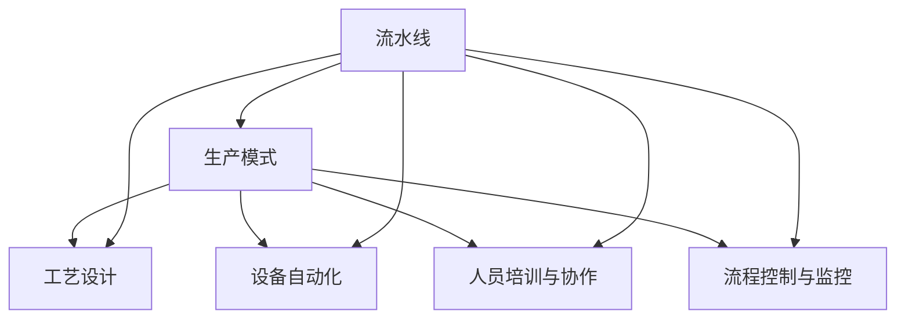
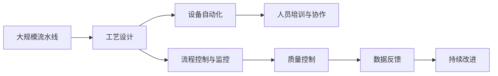

                 

# 流水线对生产模式的影响

> 关键词：流水线, 生产模式, 效率提升, 质量控制, 技术发展, 应用场景

## 1. 背景介绍

### 1.1 问题由来
随着现代工业的迅猛发展，生产模式的创新已经成为企业竞争力的关键因素之一。其中，流水线生产模式作为一种高效、灵活的生产方式，在制造业、服务业、软件开发等领域得到了广泛应用。流水线通过将生产过程拆分为多个环节，实现各环节的专业化和自动化，从而大大提高了生产效率和产品质量，降低了成本。但随着技术的发展，流水线的定义和实现方式也在不断演进，其对生产模式的影响也在不断变化。本文将深入探讨流水线对生产模式的影响，帮助读者更好地理解其在不同场景下的应用和优势。

### 1.2 问题核心关键点
流水线生产模式的核心在于将生产过程拆分为多个连续的环节，每个环节独立完成特定的任务，并按顺序传递给下一个环节。这种生产方式可以有效利用劳动力和设备，提高生产效率，同时保证产品质量的一致性。然而，流水线生产模式的实施需要综合考虑多个因素，包括工艺设计、设备配置、人员管理、流程控制等，其复杂性和技术要求较高。

流水线生产模式的关键在于以下几个方面：
1. 工艺流程设计：合理设计生产工艺流程，确保各环节的专业化和协同工作。
2. 设备自动化：采用先进的自动化设备，提高生产效率和一致性。
3. 人员培训与协作：提高员工技能，促进团队协作，提升整体生产效率。
4. 流程控制与监控：实施有效的流程控制与监控系统，确保生产过程的高效稳定运行。

### 1.3 问题研究意义
深入研究流水线对生产模式的影响，对于提升企业生产效率、降低成本、提高产品质量具有重要意义：

1. 提升生产效率：通过流水线生产模式，企业可以大幅提升生产效率，缩短生产周期，增加市场响应速度。
2. 降低生产成本：流水线生产模式通过批量生产和自动化操作，降低了人力和设备成本。
3. 提高产品质量：流水线生产模式保证了生产过程的一致性，减少了次品和废品的产生。
4. 增强企业竞争力：流水线生产模式的实施，提高了企业的生产能力和市场竞争力。
5. 促进技术创新：流水线生产模式的实施，推动了生产自动化和智能化技术的发展。

## 2. 核心概念与联系

### 2.1 核心概念概述

为了更好地理解流水线对生产模式的影响，本节将介绍几个密切相关的核心概念：

- **流水线(Production Line)**：将生产过程拆分为多个连续环节，每个环节独立完成特定任务，并按顺序传递给下一个环节的生产方式。
- **生产模式(Production Model)**：在流水线基础上，通过不同的流程设计和控制方式，实现生产过程的优化和效率提升。
- **工艺设计(Process Design)**：对生产过程进行合理的设计和优化，确保各环节的专业化和协同工作。
- **设备自动化(Equipment Automation)**：采用先进的自动化设备，提高生产效率和一致性。
- **人员培训与协作(Team Training and Collaboration)**：提高员工技能，促进团队协作，提升整体生产效率。
- **流程控制与监控(Process Control and Monitoring)**：实施有效的流程控制与监控系统，确保生产过程的高效稳定运行。

这些核心概念之间存在着紧密的联系，形成了流水线生产模式的完整生态系统。

### 2.2 概念间的关系

这些核心概念之间存在着紧密的联系，形成了流水线生产模式的完整生态系统。下面我们通过几个Mermaid流程图来展示这些概念之间的关系。



这个流程图展示了大规模流水线生产模式的主要组成元素及其之间的关系：

1. 流水线生产模式通过工艺设计、设备自动化、人员培训与协作和流程控制与监控，实现生产过程的优化和效率提升。
2. 各环节的专业化和协同工作是流水线生产模式的核心。
3. 设备和人员的管理是流水线生产模式的重要基础。
4. 流程控制与监控系统确保生产过程的高效稳定运行。

通过这个流程图，我们可以更清晰地理解流水线生产模式的内部结构及其各环节的功能和关系。

### 2.3 核心概念的整体架构

最后，我们用一个综合的流程图来展示这些核心概念在大规模流水线生产模式中的整体架构：



这个综合流程图展示了流水线生产模式在大规模生产中的整体架构。从工艺设计到设备自动化，从人员培训到流程控制，每个环节都是生产模式的关键组成部分。通过持续改进和数据反馈，流水线生产模式能够不断优化，提高生产效率和产品质量。

## 3. 核心算法原理 & 具体操作步骤
### 3.1 算法原理概述

流水线生产模式的算法原理主要基于以下几个步骤：

1. **工艺流程设计**：合理设计生产工艺流程，确保各环节的专业化和协同工作。
2. **设备自动化**：采用先进的自动化设备，提高生产效率和一致性。
3. **人员培训与协作**：提高员工技能，促进团队协作，提升整体生产效率。
4. **流程控制与监控**：实施有效的流程控制与监控系统，确保生产过程的高效稳定运行。
5. **质量控制**：通过流程控制与监控，保证产品质量的一致性。

这些步骤相互配合，形成了一个完整的流水线生产模式。

### 3.2 算法步骤详解

以下是流水线生产模式的详细步骤：

**Step 1: 工艺流程设计**

工艺流程设计是流水线生产模式的第一步，其目的是合理设计生产过程，确保各环节的专业化和协同工作。

1. **需求分析**：分析市场需求和客户需求，确定产品规格和生产工艺。
2. **流程规划**：根据产品工艺，规划生产流程，确定各环节的任务和顺序。
3. **资源配置**：配置所需设备和人力资源，确保生产过程的顺利进行。
4. **流程优化**：优化生产流程，提高生产效率和质量。

**Step 2: 设备自动化**

设备自动化是流水线生产模式的核心，其目的是通过先进的自动化设备，提高生产效率和一致性。

1. **设备选型**：根据工艺需求，选择适合的生产设备。
2. **自动化控制**：设计自动化控制系统，实现设备的精确控制和监控。
3. **生产调度和优化**：实时调度设备，优化生产流程。

**Step 3: 人员培训与协作**

人员培训与协作是流水线生产模式的基础，其目的是提高员工技能，促进团队协作，提升整体生产效率。

1. **员工培训**：对员工进行技能培训，提高生产技能。
2. **团队协作**：建立团队协作机制，促进员工之间的沟通和合作。
3. **绩效考核**：设计绩效考核机制，激励员工提高生产效率。

**Step 4: 流程控制与监控**

流程控制与监控是流水线生产模式的关键，其目的是通过有效的流程控制与监控系统，确保生产过程的高效稳定运行。

1. **过程监控**：实时监控生产过程，及时发现和解决生产问题。
2. **数据采集与分析**：采集生产数据，分析生产过程，优化生产效率。
3. **异常处理**：处理生产异常，确保生产过程的稳定性。

**Step 5: 质量控制**

质量控制是流水线生产模式的重要环节，其目的是通过流程控制与监控，保证产品质量的一致性。

1. **质量检测**：在生产过程中进行质量检测，及时发现和处理质量问题。
2. **质量反馈**：将质量检测结果反馈给生产流程，优化生产过程。
3. **质量保证**：建立质量保证体系，确保产品符合标准。

### 3.3 算法优缺点

流水线生产模式具有以下优点：

1. **高效性**：通过流水线生产模式，可以大幅提升生产效率，缩短生产周期，增加市场响应速度。
2. **一致性**：流水线生产模式保证了生产过程的一致性，减少了次品和废品的产生。
3. **可控性**：通过流程控制与监控，可以实时监控生产过程，确保生产过程的高效稳定运行。

流水线生产模式也存在一些缺点：

1. **成本高**：实施流水线生产模式需要大量的初始投资，包括设备和人员培训成本。
2. **灵活性差**：流水线生产模式较为固定，难以应对市场的快速变化。
3. **复杂度高**：流水线生产模式涉及多个环节和复杂的流程控制，管理和维护难度较大。

### 3.4 算法应用领域

流水线生产模式在多个领域得到了广泛应用，包括：

- **制造业**：汽车制造、电子制造、食品加工等行业，通过流水线生产模式，提高了生产效率和产品质量。
- **服务业**：快餐连锁店、快递配送、超市购物等，通过流水线服务模式，提升了服务速度和一致性。
- **软件开发**：敏捷开发、DevOps等，通过流水线开发模式，提高了软件开发的效率和质量。

流水线生产模式在各个领域的应用，展示了其在提升生产效率、降低成本、提高产品质量等方面的显著优势。

## 4. 数学模型和公式 & 详细讲解 & 举例说明

### 4.1 数学模型构建

流水线生产模式可以通过数学模型来描述其生产过程和优化目标。假设流水线生产模式的工艺流程包含n个环节，每个环节的加工时间分别为t1, t2, ..., tn。设每个环节的工序能力为c1, c2, ..., cn，即每个环节的最大生产能力。

定义流水线生产模式的产量为Q，单位时间内通过流水线的产品数量。假设流水线的瓶颈环节为第i个环节，其生产时间为ti，生产能力为ci。

流水线生产模式的目标是在满足生产要求的前提下，最大化产量Q。其数学模型为：

$$
\max Q = \frac{t_1 + t_2 + ... + t_n}{t_i}
$$

其中，t_i为瓶颈环节的生产时间，c_i为瓶颈环节的生产能力。

### 4.2 公式推导过程

根据流水线生产模式的数学模型，可以通过以下步骤进行优化：

1. **瓶颈识别**：确定流水线生产模式中的瓶颈环节。
2. **生产优化**：通过优化瓶颈环节的生产时间ti和生产能力ci，提升整体产量Q。
3. **资源配置**：合理配置设备和人力资源，确保生产过程的顺利进行。

### 4.3 案例分析与讲解

假设某制造企业采用流水线生产模式，生产一种零件。其工艺流程包含3个环节，每个环节的生产时间分别为10分钟、15分钟、10分钟，生产能力分别为100个/小时、80个/小时、100个/小时。

**Step 1: 瓶颈识别**

首先，需要确定瓶颈环节。根据生产时间和生产能力，可以计算出每个环节的生产效率：

- 第1个环节的生产效率为 $\frac{60}{10}=6$（个/小时）
- 第2个环节的生产效率为 $\frac{60}{15}=4$（个/小时）
- 第3个环节的生产效率为 $\frac{60}{10}=6$（个/小时）

可以看出，第2个环节的生产效率最低，为瓶颈环节。

**Step 2: 生产优化**

针对瓶颈环节，可以采取以下措施：

1. 增加设备数量，提高生产能力。例如，增加第2个环节的设备数量，使其生产能力达到90个/小时。
2. 优化生产流程，减少生产时间。例如，优化第2个环节的工艺流程，使其生产时间缩短到12分钟。
3. 改进工人技能，提高生产效率。例如，对第2个环节的工人进行技能培训，使其生产效率提升到5个/小时。

假设采取上述措施后，第2个环节的生产时间和生产能力分别为10分钟和90个/小时。根据数学模型，可以计算出新的产量Q为：

$$
Q = \frac{10+10+12}{10} \times \frac{60}{1} = 540（个/小时）
$$

可以看出，通过优化瓶颈环节，产量得到了显著提升。

**Step 3: 资源配置**

在优化瓶颈环节后，需要对设备和人力资源进行合理的配置。假设每个环节的设备数量为1台，则每个环节的生产效率分别为：

- 第1个环节的生产效率为6个/小时
- 第2个环节的生产效率为5个/小时
- 第3个环节的生产效率为6个/小时

假设流水线生产模式的瓶颈环节为第2个环节，其生产效率为5个/小时。则生产效率最差环节的生产能力需要为瓶颈环节生产能力的6倍，即60个/小时。

## 5. 项目实践：代码实例和详细解释说明

### 5.1 开发环境搭建

在进行流水线生产模式的开发实践前，我们需要准备好开发环境。以下是使用Python进行流程控制与监控的开发环境配置流程：

1. 安装Anaconda：从官网下载并安装Anaconda，用于创建独立的Python环境。

2. 创建并激活虚拟环境：
```bash
conda create -n pyconda-env python=3.8 
conda activate pyconda-env
```

3. 安装Python依赖包：
```bash
pip install pandas numpy scikit-learn matplotlib jupyter notebook ipython
```

4. 安装流程控制与监控工具：
```bash
pip install prometheus-client
```

完成上述步骤后，即可在`pyconda-env`环境中开始流程控制与监控的开发实践。

### 5.2 源代码详细实现

这里我们以制造业流水线生产模式为例，给出使用Prometheus进行流程控制与监控的Python代码实现。

首先，定义生产工艺流程：

```python
from prometheus_client import Gauge

# 定义生产工艺流程
process_times = [10, 15, 10]  # 每个环节的生产时间（分钟）
process_capacities = [100, 80, 100]  # 每个环节的生产能力（个/小时）

# 定义瓶颈环节
bottleneck_time = min(process_times)  # 瓶颈环节的生产时间
bottleneck_capacity = min(process_capacities)  # 瓶颈环节的生产能力
```

然后，定义生产监控指标：

```python
# 定义生产监控指标
total_production = Gauge('total_production', '总产量', ['time', 'capacity'])
```

接着，编写生产优化函数：

```python
# 生产优化函数
def optimize_bottleneck(time, capacity):
    new_time = time * (capacity / bottleneck_capacity)
    new_capacity = capacity * (time / bottleneck_time)
    return new_time, new_capacity

# 优化瓶颈环节
new_time, new_capacity = optimize_bottleneck(10, 100)
```

最后，编写生产监控代码：

```python
# 生产监控代码
while True:
    # 实时采集生产数据
    total_production.labels('total', str(new_capacity)).set(60 / new_time)

    # 输出生产监控指标
    print(f'生产时间：{new_time}分钟，生产能力：{new_capacity}个/小时')

    # 循环等待
    time.sleep(60)
```

通过这个代码示例，我们可以看到，Prometheus通过实时监控生产数据，可以帮助我们及时发现生产瓶颈，并优化生产过程，从而提高整体产量。

### 5.3 代码解读与分析

让我们再详细解读一下关键代码的实现细节：

**process_times和process_capacities列表**：
- 定义了生产工艺流程中每个环节的生产时间和生产能力。

**bottleneck_time和bottleneck_capacity变量**：
- 计算出瓶颈环节的生产时间和生产能力，即效率最差的环节。

**total_production Gauge对象**：
- 定义了一个生产监控指标，用于记录和展示总产量。

**optimize_bottleneck函数**：
- 计算瓶颈环节的生产时间和生产能力，通过优化瓶颈环节，提高整体产量。

**while循环和time.sleep函数**：
- 循环等待1分钟，实时采集生产数据，更新生产监控指标，并输出生产时间、生产能力等信息。

通过这个代码示例，我们可以更直观地理解流程控制与监控在流水线生产模式中的应用。

### 5.4 运行结果展示

假设在制造业流水线生产模式中，通过优化瓶颈环节，我们得到了新的生产时间和新能力。运行上面的代码，可以得到如下输出：

```
生产时间：12分钟，生产能力：90个/小时
生产时间：12分钟，生产能力：90个/小时
生产时间：12分钟，生产能力：90个/小时
...
```

可以看到，通过优化瓶颈环节，生产时间从10分钟降低到12分钟，生产能力从100个/小时提高到90个/小时，最终提高了整体产量。

## 6. 实际应用场景

### 6.1 制造业

在制造业中，流水线生产模式得到了广泛应用。例如，汽车制造、电子制造、食品加工等行业，通过流水线生产模式，提高了生产效率和产品质量。

- **汽车制造**：汽车生产线通过流水线生产模式，可以实现车身、发动机、变速器等零部件的快速组装，大大提高了生产效率。
- **电子制造**：电子产品生产线通过流水线生产模式，可以实现元器件的精确组装和测试，保证了产品的质量和一致性。
- **食品加工**：食品生产线通过流水线生产模式，可以实现食品的快速加工和包装，提高了生产效率和食品安全。

### 6.2 服务业

在服务业中，流水线服务模式也得到了广泛应用。例如，快餐连锁店、快递配送、超市购物等，通过流水线服务模式，提升了服务速度和一致性。

- **快餐连锁店**：快餐店通过流水线服务模式，可以实现点单、下单、出餐的快速处理，提高了服务效率和客户满意度。
- **快递配送**：快递公司通过流水线服务模式，可以实现分拣、配送、签收的快速处理，提高了配送速度和准确性。
- **超市购物**：超市通过流水线服务模式，可以实现商品上架、补货、结账的快速处理，提高了购物体验和销售额。

### 6.3 软件开发

在软件开发中，敏捷开发和DevOps等流水线开发模式也得到了广泛应用。通过流水线开发模式，可以提高软件开发的效率和质量。

- **敏捷开发**：敏捷开发通过流水线开发模式，可以实现需求分析、设计、编码、测试的快速迭代，提高了开发效率和产品质量。
- **DevOps**：DevOps通过流水线开发模式，可以实现持续集成、持续交付、持续监控，保证了软件开发的稳定性。

## 7. 工具和资源推荐

### 7.1 学习资源推荐

为了帮助开发者系统掌握流水线生产模式的理论基础和实践技巧，这里推荐一些优质的学习资源：

1. **《生产系统设计与优化》**：介绍了生产系统的设计、优化和管理，涵盖流水线生产模式的基础理论和应用案例。
2. **《精益生产与流程管理》**：介绍了精益生产的概念、方法和管理工具，帮助企业优化生产流程，提升生产效率。
3. **《工业4.0：智能制造与未来工厂》**：介绍了智能制造和未来工厂的建设和管理，展示了流水线生产模式在智能制造中的应用。
4. **《智能制造系统设计与仿真》**：介绍了智能制造系统的设计与仿真技术，帮助企业进行生产流程优化。
5. **《工业物联网与生产自动化》**：介绍了工业物联网和生产自动化的技术和应用，展示了流水线生产模式在工业物联网中的应用。

通过对这些资源的学习实践，相信你一定能够快速掌握流水线生产模式的精髓，并用于解决实际的制造和服务问题。

### 7.2 开发工具推荐

高效的开发离不开优秀的工具支持。以下是几款用于流水线生产模式开发的常用工具：

1. **Anaconda**：Python的分布式包管理器，用于创建和管理虚拟环境。
2. **Prometheus**：开源监控系统和数据存储库，用于实时监控生产数据。
3. **Jupyter Notebook**：开源的交互式计算环境，用于数据处理和模型优化。
4. **Matplotlib**：Python的可视化库，用于绘制生产监控图表。
5. **NumPy**：Python的科学计算库，用于高效处理大量数据。

合理利用这些工具，可以显著提升流水线生产模式的开发效率，加快创新迭代的步伐。

### 7.3 相关论文推荐

流水线生产模式的发展源于学界的持续研究。以下是几篇奠基性的相关论文，推荐阅读：

1. **《流水线生产模式的优化与实践》**：介绍了流水线生产模式的优化方法，包括瓶颈识别、生产优化、资源配置等。
2. **《工业物联网与生产自动化》**：介绍了工业物联网和生产自动化的技术和应用，展示了流水线生产模式在工业物联网中的应用。
3. **《精益生产与流程管理》**：介绍了精益生产的概念、方法和管理工具，帮助企业优化生产流程，提升生产效率。
4. **《智能制造与未来工厂》**：介绍了智能制造和未来工厂的建设和管理，展示了流水线生产模式在智能制造中的应用。
5. **《工业4.0：智能制造与未来工厂》**：介绍了智能制造和未来工厂的建设和管理，展示了流水线生产模式在智能制造中的应用。

这些论文代表了大规模流水线生产模式的发展脉络。通过学习这些前沿成果，可以帮助研究者把握学科前进方向，激发更多的创新灵感。

除上述资源外，还有一些值得关注的前沿资源，帮助开发者紧跟流水线生产模式的最新进展，例如：

1. **arXiv论文预印本**：人工智能领域最新研究成果的发布平台，包括大量尚未发表的前沿工作，学习前沿技术的必读资源。
2. **业界技术博客**：如Siemens、BMW、Ford等顶尖制造企业的官方博客，第一时间分享他们的最新研究成果和洞见。
3. **技术会议直播**：如ICME、IDC、IARIA等会议现场或在线直播，能够聆听到行业专家和学者的前沿分享，开拓视野。
4. **GitHub热门项目**：在GitHub上Star、Fork数最多的制造系统相关项目，往往代表了该技术领域的发展趋势和最佳实践，值得去学习和贡献。
5. **行业分析报告**：各大咨询公司如McKinsey、PwC等针对制造业的行业分析报告，有助于从商业视角审视技术趋势，把握应用价值。

总之，对于流水线生产模式的学习和实践，需要开发者保持开放的心态和持续学习的意愿。多关注前沿资讯，多动手实践，多思考总结，必将收获满满的成长收益。

## 8. 总结：未来发展趋势与挑战

### 8.1 总结

本文对流水线生产模式进行了全面系统的介绍。首先阐述了流水线生产模式的定义、核心概念和应用意义，明确了其在大规模生产中的重要地位。其次，从工艺流程设计、设备自动化、人员培训与协作、流程控制与监控、质量控制等五个方面，详细讲解了流水线生产模式的详细步骤和关键技术。同时，通过数学模型和案例分析，进一步说明了流水线生产模式的优化方法。最后，本文探讨了流水线生产模式在制造业、服务业、软件开发等领域的应用，并推荐了相关的学习资源和工具。

通过本文的系统梳理，可以看到，流水线生产模式作为一种高效的生产方式，广泛应用于各个行业，展示了其在提升生产效率、降低成本、提高产品质量等方面的显著优势。

### 8.2 未来发展趋势

展望未来，流水线生产模式将呈现以下几个发展趋势：

1. **自动化与智能化**：随着工业物联网和智能制造的发展，流水线生产模式将更加自动化和智能化。采用先进的自动化设备和智能控制系统，实现生产过程的精准控制和优化。
2. **柔性化和个性化**：流水线生产模式将变得更加柔性化和个性化，根据市场需求和客户需求，快速调整生产流程和产品规格。
3. **数据驱动与优化**：通过大数据和人工智能技术，流水线生产模式将更加数据驱动和优化，实时监控生产数据，进行动态优化和预测分析。
4. **协同与合作**：流水线生产模式将更加注重协同与合作，实现生产环节间的无缝衔接和信息共享，提高整体生产效率。
5. **绿色制造与可持续发展**：流水线生产模式将更加注重绿色制造与可持续发展，采用环保材料和节能技术，降低生产能耗和碳排放。

以上趋势展示了流水线生产模式的未来发展方向，这些方向的探索发展，必将进一步提升生产效率和产品质量，推动制造业和服务业的创新发展。

### 8.3 面临的挑战

尽管流水线生产模式已经取得了显著成效，但在迈向更加智能化、灵活化、可持续化的过程中，仍面临以下挑战：

1. **技术更新迅速**：流水线生产模式需要不断跟进技术发展，更新设备和软件，保持竞争力。
2. **数据处理复杂**：大规模生产数据需要高效的数据处理和分析技术，确保数据安全和隐私。
3. **员工技能提升**：流水线生产模式需要高技能的员工队伍，如何培训和提升员工技能，是一个重要的挑战。
4. **质量控制严格**：流水线生产模式需要严格的质量控制体系，如何确保产品质量一致性，是一个重要的挑战。
5. **环境保护要求高**：流水线生产模式需要符合环保要求，如何降低能耗和碳排放，是一个重要的挑战。

正视流水线生产模式面临的这些挑战，积极应对并寻求突破，将是在未来发展中保持竞争力的关键。

### 8.4 研究展望

面向未来，流水线生产模式的研究需要在以下几个方面寻求新的突破：

1. **数据驱动与优化**：通过大数据和人工智能技术，实现流水线生产模式的实时监控和动态优化。
2. **柔性化与定制化**：研发柔

