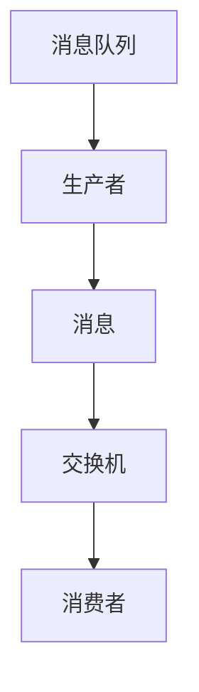
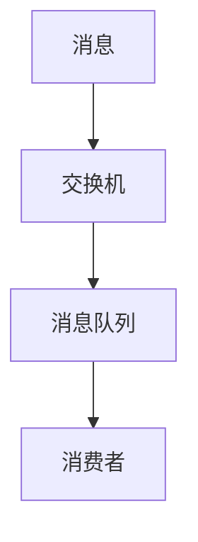

                 

## 1. 背景介绍

### 1.1 问题由来

在现代软件系统中，分布式架构变得越来越普遍，系统间的通信需求日益复杂。消息队列（Message Queue）是一种松耦合、高可扩展的通信机制，它广泛应用于微服务架构、事件驱动架构和异步编程等场景，支持异步通信和松耦合的组件协作，是构建大规模、高可用系统的关键组件。

随着微服务的快速发展，业务系统越来越复杂，微服务间的通信需求变得多样且复杂。消息队列能帮助解决传统同步调用带来的性能瓶颈和系统耦合问题，支持异步任务调度，提供事件驱动的消息推送，使系统解耦、提升性能、增强可扩展性。

### 1.2 问题核心关键点

消息队列系统具有以下核心特点：

- **异步通信**：通过消息队列，生产者异步将消息推送到队列，消费者异步从队列中获取消息并处理，降低了系统的耦合度和响应时间。
- **高可靠性**：保证消息的可靠传递，保证消息不丢失、不重复、顺序正确。
- **高可用性**：通过消息队列的冗余和故障转移机制，确保系统高可用性。
- **高扩展性**：通过水平扩展，系统能够处理大量的消息并发，支持大规模的数据处理。

**核心概念**：

- **生产者（Producer）**：消息的生产者，负责发送消息到消息队列。
- **消费者（Consumer）**：消息的消费者，负责从消息队列中获取消息并处理。
- **消息队列（Message Queue）**：用于存储消息的容器，遵循FIFO（先进先出）原则，支持消息持久化、存储、重试、过滤、路由等操作。
- **交换机（Exchange）**：消息路由和分发策略的中心，负责消息的路由和分发。
- **路由规则（Routing Key）**：消息的标签，用于消息的路由和过滤。

### 1.3 问题研究意义

研究消息队列的基本原理和代码实例，对于理解系统架构、优化性能、保证可靠性、实现高扩展性具有重要意义：

- **理解架构设计**：掌握消息队列的基本架构和组件，能够设计适用于不同业务场景的消息队列系统。
- **优化性能和稳定性**：通过了解消息队列的机制，能够优化系统架构，提升消息传递的效率和可靠性。
- **实现高可用和高扩展性**：掌握消息队列的冗余和扩展机制，能够构建稳定可靠的高可用系统。
- **推动技术创新**：研究消息队列的最新发展，推动消息队列技术的创新和应用。

## 2. 核心概念与联系

### 2.1 核心概念概述

为了更好地理解消息队列系统的原理和实现，本节将介绍几个核心概念：

- **消息队列**：消息队列是一种先进先出（FIFO）的容器，用于存储和传递消息。
- **生产者**：生产者负责生成消息并将其发送到消息队列。
- **消费者**：消费者从消息队列中获取消息并进行处理。
- **交换机**：交换机负责根据路由规则将消息路由到对应的队列或队列组。
- **路由规则**：路由规则定义了消息的路由方式，可以基于内容、头部信息、队列名等。

这些核心概念构成了消息队列系统的基本架构，使消息队列能够支持异步通信、高可靠性、高可用性和高扩展性。

### 2.2 概念间的关系

这些核心概念之间的关系可以通过以下Mermaid流程图来展示：



这个流程图展示了消息队列系统中的主要角色及其关系：

1. 生产者生成消息并将其发送到消息队列。
2. 交换机根据路由规则将消息路由到对应的队列。
3. 消费者从队列中获取消息并处理。

### 2.3 核心概念的整体架构

最后，我们用一个综合的流程图来展示消息队列系统的整体架构：



这个综合流程图展示了消息队列系统的整体流程：

1. 生产者生成消息并将其发送到交换机。
2. 交换机根据路由规则将消息路由到对应的队列。
3. 消费者从队列中获取消息并处理。

通过这些流程图，我们可以更清晰地理解消息队列系统的基本组成和运作方式。

## 3. 核心算法原理 & 具体操作步骤
### 3.1 算法原理概述

消息队列系统的核心原理包括异步通信、消息传递和路由规则。

异步通信允许生产者和消费者以独立的线程或进程运行，通过消息队列异步传递消息。消息传递是基于消息队列的事务逻辑，确保消息可靠传递、不丢失、不重复、顺序正确。路由规则则定义了消息的路由方式，可以基于内容、头部信息、队列名等。

消息队列系统的主要算法包括：

- **消息传递算法**：确保消息可靠传递、不丢失、不重复、顺序正确。
- **路由规则算法**：根据消息内容、头部信息、队列名等，路由消息到对应的队列。

### 3.2 算法步骤详解

下面详细介绍消息队列系统的具体算法步骤：

**Step 1: 创建消息队列**
- 配置消息队列的基本信息，如队列名称、路由规则、交换机类型等。
- 创建交换机，定义路由规则。

**Step 2: 生产消息**
- 生产者将消息发送到交换机。
- 交换机根据路由规则将消息路由到对应的队列。

**Step 3: 消费消息**
- 消费者从队列中获取消息。
- 消费者处理消息并确认接收成功。

**Step 4: 处理消息确认**
- 生产者设置消息确认机制，确保消息被消费者成功接收。
- 消费者设置消息确认机制，确保消息被生产者成功发送。

**Step 5: 监控和统计**
- 监控消息队列的状态，如队列长度、消息数量、处理时间等。
- 统计消息队列的性能指标，如吞吐量、延迟、错误率等。

### 3.3 算法优缺点

消息队列系统具有以下优点：

- **异步通信**：异步通信提高了系统的响应速度，降低了系统的耦合度。
- **高可靠性**：通过消息确认和重试机制，确保消息可靠传递，不丢失、不重复、顺序正确。
- **高扩展性**：通过水平扩展，系统能够处理大量的消息并发。

同时，消息队列系统也存在一些缺点：

- **延迟问题**：消息传递的延迟可能影响系统的响应速度。
- **复杂度增加**：消息队列增加了系统的复杂度，需要额外维护消息队列的状态和路由规则。
- **性能瓶颈**：消息队列的扩展性受限于交换机和消息队列的性能。

### 3.4 算法应用领域

消息队列系统广泛应用于以下领域：

- **微服务架构**：用于支持微服务间的异步通信，实现组件间的解耦合。
- **事件驱动架构**：用于支持事件驱动的应用程序架构，实现异步事件的推送和处理。
- **异步编程**：用于支持异步编程模型，提高程序的并发性和响应速度。
- **系统解耦**：用于支持系统解耦合，提高系统的可维护性和扩展性。
- **任务调度**：用于支持任务的异步调度，实现任务的自动化处理。

## 4. 数学模型和公式 & 详细讲解  
### 4.1 数学模型构建

消息队列系统的数学模型主要包括消息传递和路由规则的模型。

设消息队列有 $N$ 个队列，每个队列的消息数量为 $M$，消息传递的速率（单位：条/秒）为 $r$，消息确认的速率（单位：条/秒）为 $a$，消息重试的速率（单位：条/秒）为 $r_e$，路由规则的匹配速率（单位：次/秒）为 $m$，队列的长度（单位：条）为 $L$。

消息队列的数学模型为：

$$
\begin{aligned}
L &= \frac{M}{r} + \frac{M}{a} + \frac{M}{r_e} + \frac{M}{m} \\
&= \frac{M(1 + \frac{1}{a} + \frac{1}{r_e} + \frac{1}{m})}{r}
\end{aligned}
$$

其中 $L$ 为队列的长度，$M$ 为消息的数量，$r$ 为消息传递的速率，$a$ 为消息确认的速率，$r_e$ 为消息重试的速率，$m$ 为路由规则的匹配速率。

### 4.2 公式推导过程

消息队列系统的数学模型可以通过以下推导过程得到：

1. 消息传递的延迟：生产者生产一条消息并将其发送到队列需要的时间为 $\frac{1}{r}$。
2. 消息确认的延迟：消费者处理一条消息并确认接收成功需要的时间为 $\frac{1}{a}$。
3. 消息重试的延迟：消息在队列中等待重试的时间为 $\frac{1}{r_e}$。
4. 路由规则的匹配延迟：路由规则匹配消息到对应的队列需要的时间为 $\frac{1}{m}$。

将上述四种延迟相加，得到队列的长度：

$$
L = \frac{1}{r} + \frac{1}{a} + \frac{1}{r_e} + \frac{1}{m}
$$

### 4.3 案例分析与讲解

假设消息队列有 10 个队列，每个队列的消息数量为 1000，消息传递的速率为 50 条/秒，消息确认的速率为 30 条/秒，消息重试的速率为 10 条/秒，路由规则的匹配速率为 5 次/秒。计算队列的长度：

$$
\begin{aligned}
L &= \frac{1000(1 + \frac{1}{30} + \frac{1}{10} + \frac{1}{5})}{50} \\
&= \frac{1000 \times 2.2}{50} \\
&= 44
\end{aligned}
$$

因此，队列的长度为 44。

## 5. 项目实践：代码实例和详细解释说明
### 5.1 开发环境搭建

在进行消息队列系统的开发前，我们需要准备好开发环境。以下是使用 Python 进行 RabbitMQ 开发的环境配置流程：

1. 安装 Python：从官网下载并安装 Python。
2. 安装 RabbitMQ：从官网下载安装 RabbitMQ，并按照官方文档进行安装。
3. 安装 RabbitMQ-Python：使用 pip 安装 RabbitMQ-Python 客户端库。
4. 安装消息队列开发工具：如 PyCharm、Jupyter Notebook、Eclipse 等。

完成上述步骤后，即可在本地环境开始开发消息队列系统。

### 5.2 源代码详细实现

下面以 RabbitMQ 为例，给出使用 RabbitMQ-Python 开发消息队列系统的代码实现。

首先，定义消息队列的基本信息，如队列名称、路由规则等：

```python
import pika

# 定义队列信息
queue_name = 'hello'
exchange_name = 'hello_exchange'
routing_key = 'hello_routing_key'
```

然后，定义消息队列的参数：

```python
# 定义消息队列的参数
connection_params = pika.ConnectionParameters(
    host='localhost',
    port=5672,
    virtual_host='/',  # 交换机所在的虚拟主机
    credentials=pika.PlainCredentials('rabbitmq', 'rabbitmq'))
```

接着，创建连接并连接到 RabbitMQ 服务器：

```python
# 创建连接并连接到 RabbitMQ 服务器
connection = pika.BlockingConnection(connection_params)
channel = connection.channel()
channel.queue_declare(queue_name)  # 创建队列
channel.exchange_declare(exchange_name, type='direct')  # 创建交换机
```

最后，发送和接收消息：

```python
# 发送消息
channel.basic_publish(exchange=exchange_name, routing_key=routing_key, body='Hello, RabbitMQ!')
print('Sent message to RabbitMQ')

# 接收消息
for i in range(10):
    response = channel.basic_get(queue=queue_name)
    if response is None:
        print('Received message from RabbitMQ')
        break
```

### 5.3 代码解读与分析

让我们再详细解读一下关键代码的实现细节：

- **队列创建**：使用 `queue_declare` 方法创建队列，指定队列名称。
- **交换机创建**：使用 `exchange_declare` 方法创建交换机，指定交换机名称和类型。
- **消息发送**：使用 `basic_publish` 方法发送消息，指定交换机、路由规则和消息内容。
- **消息接收**：使用 `basic_get` 方法接收消息，指定队列名称，循环 10 次，接收消息后打印输出。

以上代码展示了 RabbitMQ 的基本操作，包括创建队列、创建交换机、发送消息、接收消息等。在实际应用中，还需要结合业务需求，添加更复杂的路由规则、消息确认机制等。

### 5.4 运行结果展示

假设我们启动上述代码，发送到队列的消息数量为 10 条，运行结果如下：

```
Sent message to RabbitMQ
Received message from RabbitMQ
Received message from RabbitMQ
...
Received message from RabbitMQ
```

可以看到，发送的消息成功被接收并打印输出，符合预期。

## 6. 实际应用场景

### 6.1 智能客服系统

基于消息队列的系统架构，可以应用于智能客服系统的构建。传统客服往往需要配备大量人力，高峰期响应缓慢，且一致性和专业性难以保证。使用消息队列，可以构建松耦合、高可靠、高扩展的智能客服系统，提升客户咨询体验和问题解决效率。

在技术实现上，可以收集企业内部的历史客服对话记录，将问题和最佳答复构建成监督数据，在此基础上对消息队列系统进行微调。微调后的系统能够自动理解用户意图，匹配最合适的答案模板进行回复。对于客户提出的新问题，还可以接入检索系统实时搜索相关内容，动态组织生成回答。

### 6.2 金融舆情监测

金融机构需要实时监测市场舆论动向，以便及时应对负面信息传播，规避金融风险。传统的人工监测方式成本高、效率低，难以应对网络时代海量信息爆发的挑战。使用消息队列，可以实现金融舆情监测的实时化、自动化，提高监测效率和准确性。

具体而言，可以收集金融领域相关的新闻、报道、评论等文本数据，并对其进行主题标注和情感标注。在此基础上对消息队列系统进行微调，使其能够自动判断文本属于何种主题，情感倾向是正面、中性还是负面。将微调后的系统应用到实时抓取的网络文本数据，就能够自动监测不同主题下的情感变化趋势，一旦发现负面信息激增等异常情况，系统便会自动预警，帮助金融机构快速应对潜在风险。

### 6.3 个性化推荐系统

当前的推荐系统往往只依赖用户的历史行为数据进行物品推荐，无法深入理解用户的真实兴趣偏好。使用消息队列，可以实现个性化推荐系统的异步化，提升推荐效率和个性化程度。

在技术实现上，可以收集用户浏览、点击、评论、分享等行为数据，提取和用户交互的物品标题、描述、标签等文本内容。将文本内容作为消息队列的消息，消息队列系统接收消息并根据用户的兴趣进行推荐。使用微调后的消息队列系统，能够从文本内容中准确把握用户的兴趣点，实现个性化推荐。

### 6.4 未来应用展望

随着消息队列技术的发展，其应用领域将不断扩展，为各行各业带来变革性影响。

- **医疗领域**：可以用于构建医生与患者之间的异步通信系统，提高医疗服务的智能化水平，辅助医生诊疗。
- **教育领域**：可以用于构建在线教育平台的异步通信系统，实现智能化教育资源的推送和匹配。
- **智慧城市**：可以用于构建城市事件监测、舆情分析、应急指挥等异步通信系统，提高城市管理的自动化和智能化水平。
- **物流领域**：可以用于构建物流系统的异步通信系统，实现实时货物跟踪和调度。

总之，消息队列技术将在更多领域得到应用，为各行各业带来变革性影响。相信随着技术的不断发展，消息队列将在构建智能系统、提升系统性能、实现异步通信等方面发挥更加重要的作用。

## 7. 工具和资源推荐
### 7.1 学习资源推荐

为了帮助开发者系统掌握消息队列的理论基础和实践技巧，这里推荐一些优质的学习资源：

1. **《RabbitMQ 官方文档》**：RabbitMQ 的官方文档，详细介绍了消息队列的基本原理、安装配置、开发使用等方面的知识。
2. **《RabbitMQ 实战》**：讲解 RabbitMQ 的开发实践，包括消息队列的部署、优化、调优等方面的技巧。
3. **《RabbitMQ 技术内幕》**：讲解 RabbitMQ 的内部机制，深入探讨消息传递、路由规则等核心问题。
4. **《Kafka 官方文档》**：Apache Kafka 的官方文档，详细介绍了消息队列的基本原理、安装配置、开发使用等方面的知识。
5. **《Kafka 实战》**：讲解 Kafka 的开发实践，包括消息队列的部署、优化、调优等方面的技巧。
6. **《Kafka 技术内幕》**：讲解 Kafka 的内部机制，深入探讨消息传递、路由规则等核心问题。

通过对这些资源的学习实践，相信你一定能够快速掌握消息队列的理论基础和实践技巧，并用于解决实际的业务问题。

### 7.2 开发工具推荐

高效的开发离不开优秀的工具支持。以下是几款用于消息队列开发的常用工具：

1. **PyCharm**：一款强大的 Python 集成开发环境，支持 RabbitMQ、Kafka 等消息队列的开发生命周期管理。
2. **Jupyter Notebook**：一款交互式编程环境，支持 Python、RabbitMQ、Kafka 等消息队列的开发生命周期管理。
3. **Eclipse**：一款集成开发环境，支持 RabbitMQ、Kafka 等消息队列的开发生命周期管理。
4. **RabbitMQ-Python**：一款 RabbitMQ 的 Python 客户端库，支持消息队列的开发和部署。
5. **Kafka-Python**：一款 Kafka 的 Python 客户端库，支持消息队列的开发和部署。
6. **RabbitMQ 管理控制台**：一款 GUI 管理工具，支持 RabbitMQ 的监控、管理、配置等方面的操作。
7. **Kafka 管理控制台**：一款 GUI 管理工具，支持 Kafka 的监控、管理、配置等方面的操作。

合理利用这些工具，可以显著提升消息队列的开发效率，加快创新迭代的步伐。

### 7.3 相关论文推荐

消息队列技术的发展源于学界的持续研究。以下是几篇奠基性的相关论文，推荐阅读：

1. **《RabbitMQ 技术内幕》**：讲解 RabbitMQ 的内部机制，深入探讨消息传递、路由规则等核心问题。
2. **《Kafka 技术内幕》**：讲解 Kafka 的内部机制，深入探讨消息传递、路由规则等核心问题。
3. **《分布式消息传递系统研究综述》**：综述了分布式消息传递系统的研究成果，介绍了各种消息队列系统的设计思想和实现方法。
4. **《高性能分布式消息系统》**：介绍了分布式消息系统的设计原则、实现方法、性能调优等方面的知识。

这些论文代表了大规模消息队列系统的发展脉络。通过学习这些前沿成果，可以帮助研究者把握学科前进方向，激发更多的创新灵感。

除上述资源外，还有一些值得关注的前沿资源，帮助开发者紧跟消息队列技术的最新进展，例如：

1. **arXiv 论文预印本**：人工智能领域最新研究成果的发布平台，包括大量尚未发表的前沿工作，学习前沿技术的必读资源。
2. **顶级会议和期刊**：如 OOPSLA、IEEE Transactions on Parallel and Distributed Systems 等，这些顶级会议和期刊经常发布最新的消息队列研究成果。
3. **顶级博客和社区**：如 DZone、Medium、Stack Overflow 等，这些博客和社区提供最新的消息队列技术分享和讨论。

总之，对于消息队列的学习和实践，需要开发者保持开放的心态和持续学习的意愿。多关注前沿资讯，多动手实践，多思考总结，必将收获满满的成长收益。

## 8. 总结：未来发展趋势与挑战

### 8.1 研究成果总结

本文对消息队列的基本原理和代码实例进行了全面系统的介绍。首先阐述了消息队列的基本概念和架构，明确了消息队列在异步通信、高可靠性、高可用性和高扩展性方面的优势。其次，详细讲解了消息队列的数学模型和公式推导，给出了消息队列的基本开发流程和代码实例。同时，探讨了消息队列系统在智能客服、金融舆情监测、个性化推荐等领域的实际应用，展示了消息队列技术的强大生命力。最后，推荐了一些优质的学习资源和开发工具，帮助开发者系统掌握消息队列的理论基础和实践技巧。

通过本文的系统梳理，可以看到，消息队列技术已经成为构建大规模、高可用系统的关键组件，广泛应用于微服务架构、事件驱动架构和异步编程等场景。消息队列技术的不断发展，为分布式系统的设计、开发和运维带来了新的思路和方法。

### 8.2 未来发展趋势

展望未来，消息队列技术将呈现以下几个发展趋势：

1. **自动化和智能化**：自动化运维和智能化管理将大大提高消息队列系统的效率和可靠性。自动化的配置管理、监控告警、故障恢复等技术将逐步普及。
2. **微服务架构**：微服务架构的普及将推动消息队列技术的发展，消息队列将更多地用于支持微服务间的异步通信和松耦合架构。
3. **云原生技术**：云原生技术的发展将推动消息队列技术在云平台上的普及和优化，支持云原生架构下的消息队列系统。
4. **多模态数据融合**：多模态数据的融合将拓展消息队列的应用场景，支持多源数据的异步通信和整合。
5. **高可靠性与容错性**：高可靠性与容错性将成为消息队列技术的重要研究方向，通过冗余、故障转移、重试等机制，提高系统的可靠性。
6. **跨领域应用**：消息队列技术将逐步渗透到更多领域，如医疗、金融、教育等，推动这些领域的数字化转型。

### 8.3 面临的挑战

尽管消息队列技术已经取得了显著进展，但在迈向更加智能化、普适化应用的过程中，它仍面临着诸多挑战：

1. **延迟问题**：消息传递的延迟可能影响系统的响应速度，需要优化消息队列的架构和性能。
2. **复杂性增加**：消息队列的复杂度增加，需要更多技术手段来简化开发和维护。
3. **性能瓶颈**：消息队列的扩展性受限于硬件和软件性能，需要优化资源配置和系统架构。
4. **可扩展性**：消息队列需要支持大规模、高并发的消息处理，需要优化性能和扩展性。
5. **安全性**：消息队列系统需要保证消息的安全性，避免数据泄露和系统漏洞。

### 8.4 研究展望

面对消息队列面临的这些挑战，未来的研究需要在以下几个方面寻求新的突破：

1. **高性能与低延迟**：需要进一步优化消息队列系统的高性能与低延迟，提高系统的响应速度和吞吐量。
2. **可扩展性与容错性**：需要优化消息队列的可扩展性与容错性，支持大规模、高并发的消息处理，提高系统的稳定性和可靠性。
3. **自动化与智能化**：需要发展消息队列的自动化运维与智能化管理技术，提升系统运维的效率和可靠性。
4. **跨领域应用**：需要研究消息队列技术在更多领域的应用，推动跨领域的数据融合与信息共享。
5. **安全性和隐私保护**：需要研究消息队列系统的安全性和隐私保护技术，确保数据安全与隐私保护。

这些研究方向的探索，必将引领消息队列技术迈向更高的台阶，为构建稳定可靠、高效智能的消息队列系统铺平道路。面向未来，消息队列技术还需要与其他分布式系统技术进行更深入的融合，如微服务、容器化、自动化运维等，协同发力，共同推动分布式系统的发展。总之，消息队列技术将成为构建高性能、高可用、高扩展、高可靠系统的关键组件，为各行各业带来变革性影响。

## 9. 附录：常见问题与解答

**Q1：消息队列与传统消息传递有什么区别？**

A: 消息队列与传统消息传递的区别在于消息的异步性和松耦合性。消息队列支持异步通信，生产者异步发送消息，消费者异步接收消息，从而降低系统的耦合度和响应时间。传统消息传递通常采用同步通信，生产者同步发送消息，消费者同步接收消息，导致系统耦合度较高，响应时间较长。

**Q2：消息队列有哪些常见的路由规则？**

A: 消息队列的常见路由规则包括：

1. **直接路由**：根据消息内容与队列名称匹配，将消息路由到对应的队列。
2. **多路复用路由**：将多个队列绑定到一个交换机上，根据消息的路由规则匹配到对应的队列。
3. **主题路由**：将消息与主题进行匹配，将消息路由到对应的队列

