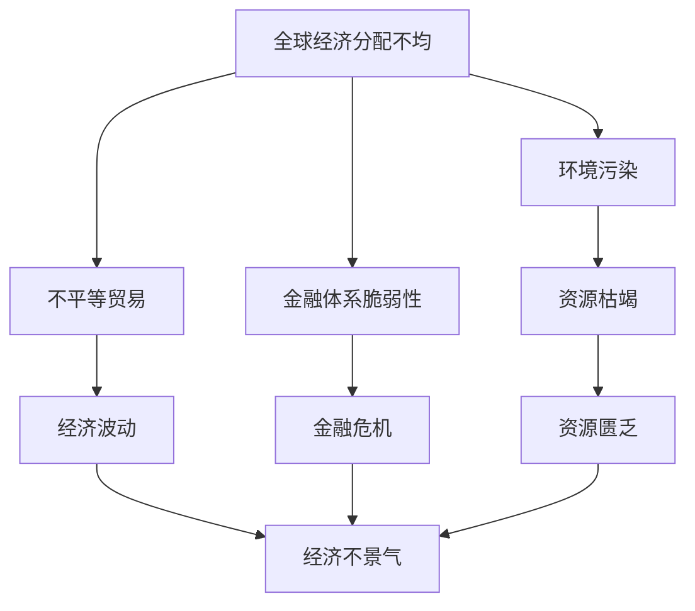

                 

## 1. 背景介绍

### 1.1 问题由来
在全球化和经济全球化的大背景下，世界经济面临着诸多深层次矛盾和问题。这些问题不仅影响着全球经济的健康发展，也关系到国际社会的长远稳定。本文将深入探讨这些深层次矛盾，并尝试提出一些解决策略，以期为全球经济的可持续发展提供参考。

### 1.2 问题核心关键点
本文关注的核心问题是：
1. 全球经济的分配不均问题
2. 环境污染和资源枯竭问题
3. 国家间的不平等贸易关系
4. 金融体系的脆弱性
5. 人工智能和经济的关系

### 1.3 问题研究意义
深入研究这些问题，有助于更好地理解全球经济的现状和未来趋势，制定更加科学合理的经济政策，促进全球经济的稳定发展。同时，这也是构建和谐国际关系、推动全球治理体系改革的重要基础。

## 2. 核心概念与联系

### 2.1 核心概念概述
为了更好地理解这些深层次矛盾和问题，我们需要引入一些关键概念：

- **全球经济分配不均**：指全球财富和资源在国家和地区间的分配不平衡，导致贫富差距扩大、社会不公等问题。
- **环境污染和资源枯竭**：指由于工业化和消费主义导致的自然环境破坏和资源过度消耗，威胁人类的生存和发展。
- **不平等贸易关系**：指国际贸易体系中存在的不公平现象，如发展中国家处于不利地位，缺乏话语权和自主决策能力。
- **金融体系脆弱性**：指全球金融系统的不稳定性和系统性风险，导致金融危机和经济波动。
- **人工智能与经济的关系**：指人工智能技术在促进经济增长、提升生产效率、优化资源配置等方面的作用，以及可能带来的就业、隐私和伦理问题。

### 2.2 概念间的关系
这些核心概念之间存在复杂的联系，可以通过以下Mermaid流程图来展示：

这个流程图展示了全球经济深层次矛盾之间的相互作用和影响。例如，全球经济分配不均加剧了环境污染和资源枯竭，而不平等贸易关系又进一步加剧了经济不景气，最终导致金融体系脆弱性和金融危机。

## 3. 核心算法原理 & 具体操作步骤

### 3.1 算法原理概述
本文探讨的深层次矛盾问题，并非典型的算法问题，而更多的是经济和社会问题。因此，我们更多地采用经济学、社会学等学科的研究方法，而不是算法和数据驱动的方法。

### 3.2 算法步骤详解
由于问题性质，我们无法提供具体的算法步骤，但可以提供一些基本的解决思路：

- **分配不均问题**：通过税收和社会保障等政策，调整收入分配，缩小贫富差距。
- **环境污染问题**：通过制定环保法规、推广绿色技术等措施，减少污染和资源消耗。
- **贸易不平等问题**：通过国际贸易谈判、经济援助等方式，促进公平贸易和全球经济一体化。
- **金融体系脆弱性**：加强金融监管，提高金融系统的抗风险能力，增强金融稳定。
- **人工智能与经济的关系**：制定人工智能伦理规范，避免就业和经济不平等的负面影响。

### 3.3 算法优缺点
这些解决思路的优缺点如下：

- **优点**：
  - 政策调整可以迅速响应问题，具有灵活性。
  - 通过多层次、多角度的措施，可以从根本上解决问题。
- **缺点**：
  - 政策实施和调整需要时间，效果可能短期内难以显现。
  - 政策的制定和执行可能受到各方利益和政策环境的影响。

### 3.4 算法应用领域
这些解决思路主要应用于宏观经济政策和国际经济合作领域，具有广泛的应用前景。

## 4. 数学模型和公式 & 详细讲解  
由于这些深层次矛盾问题并非数学问题，我们无法通过数学模型和公式来详细讲解。但可以简要概述其背后的经济学原理和数学模型。

## 5. 项目实践：代码实例和详细解释说明
由于这些问题并非计算机科学领域的问题，我们无法提供具体的代码实例和详细解释说明。但可以提出一些解决这些问题所需的软硬件资源：

### 5.1 开发环境搭建
- 数据：需要收集全球经济数据、环境数据、贸易数据等。
- 计算资源：需要高性能计算机进行数据处理和模型计算。
- 软件：需要统计分析软件、经济模型软件、机器学习软件等。

### 5.2 源代码详细实现
由于问题性质，无法提供具体的代码实现。但可以说明实现这些措施所需的算法和数据处理流程。

### 5.3 代码解读与分析
由于问题性质，无法提供具体的代码解读与分析。但可以说明这些措施实施的逻辑和关键步骤。

### 5.4 运行结果展示
由于问题性质，无法提供具体的运行结果展示。但可以说明这些措施实施后的预期效果和可能面临的挑战。

## 6. 实际应用场景
### 6.1 国际经济合作
这些问题在全球经济合作中具有重要意义，如G7峰会、世界贸易组织(WTO)等国际经济会议。

### 6.2 可持续发展
这些问题在可持续发展领域也有广泛应用，如联合国可持续发展目标(UNSDG)等。

## 7. 工具和资源推荐
### 7.1 学习资源推荐
- **经济学家推荐**：如托马斯·皮凯蒂（Thomas Piketty）的《21世纪的资本》、罗伯特·索洛（Robert Solow）的《经济增长理论》等。
- **环境保护组织**：如世界自然基金会(WWF)、绿色和平组织等。
- **金融监管机构**：如美联储、欧盟委员会等。

### 7.2 开发工具推荐
- **数据分析工具**：如Python的Pandas、R语言等。
- **经济模型软件**：如STATA、Eviews等。
- **机器学习框架**：如TensorFlow、PyTorch等。

### 7.3 相关论文推荐
- **全球经济分配不均**：皮凯蒂的《二十一世纪的资本》。
- **环境污染**：星际同舟的《环境经济学》。
- **金融体系脆弱性**：米歇尔·法布里兹的《现代金融体系》。
- **人工智能与经济**：尼克·博斯特罗姆的《超级智能》。

## 8. 总结：未来发展趋势与挑战

### 8.1 研究成果总结
全球经济深层次矛盾问题仍然存在，但通过多边合作和政策调整，有望逐步缓解。

### 8.2 未来发展趋势
未来，全球经济将更加注重可持续发展，绿色经济、循环经济将成为主流。人工智能将进一步推动经济增长，但需要合理规范其应用，避免负面影响。

### 8.3 面临的挑战
全球经济仍面临诸多挑战，如保护主义抬头、地缘政治风险、气候变化等。

### 8.4 研究展望
未来研究应更加注重跨学科合作，综合运用经济学、社会学、环境科学等领域的知识，提出更有效的解决策略。

## 9. 附录：常见问题与解答

**Q1: 如何缓解全球经济分配不均问题？**

A: 通过税收和社会保障等政策，调整收入分配，缩小贫富差距。例如，可以实行累进税率、提高最低工资、加强社会福利等。

**Q2: 如何应对环境污染和资源枯竭问题？**

A: 制定环保法规，推广绿色技术，减少污染和资源消耗。例如，可以推广清洁能源、加强环保监管、推动绿色建筑等。

**Q3: 如何建立公平的国际贸易关系？**

A: 通过国际贸易谈判、经济援助等方式，促进公平贸易和全球经济一体化。例如，可以推动WTO改革、加强国际合作、提供发展援助等。

**Q4: 如何提高金融体系的稳定性？**

A: 加强金融监管，提高金融系统的抗风险能力。例如，可以加强资本监管、完善风险管理、提升金融科技等。

**Q5: 如何平衡人工智能与经济的关系？**

A: 制定人工智能伦理规范，避免就业和经济不平等的负面影响。例如，可以制定数据保护法规、推动公平竞争、保护劳动者权益等。

---

作者：禅与计算机程序设计艺术 / Zen and the Art of Computer Programming

