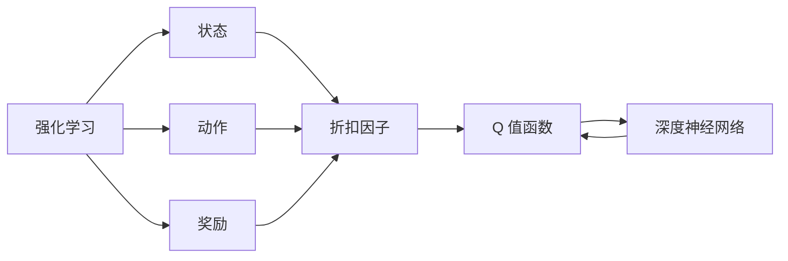

                 

## 1. 背景介绍

在复杂系统的优化问题中，深度强化学习（Deep Reinforcement Learning, DRL）方法展现出了其卓越的潜力。其中，深度 Q-learning 算法是强化学习中的经典算法，广泛应用于自动控制、机器人、游戏AI等领域。深度 Q-learning 算法通过学习状态-动作的 Q 值（Q-value）函数，最大化长期奖励，并采用深度神经网络逼近 Q 值函数，从而实现对高维度、非线性问题的建模。

### 1.1 问题由来
随着深度学习在强化学习中的应用，传统的线性Q值函数难以应对高维度的状态空间，神经网络逼近函数的能力让Q值函数的表示能力得到了极大的增强。然而，神经网络在优化过程中需要大量标注数据和较长的训练时间，这使得深度 Q-learning 的实际应用面临着诸多挑战。因此，本文将重点讨论深度 Q-learning 算法的核心原理与具体步骤，并在实践中给出代码实例和详细分析，帮助读者更好地理解该算法的应用。

### 1.2 问题核心关键点
深度 Q-learning 算法的核心思想是通过学习 Q 值函数，指导智能体采取最优的行动策略。Q 值函数通常表示为：

$$ Q(s,a) = \mathbb{E}[R + \gamma \max_a Q(s',a')] $$

其中，$s$ 为当前状态，$a$ 为当前动作，$r$ 为即时奖励，$s'$ 为下一个状态，$a'$ 为下一个动作，$\gamma$ 为折扣因子。深度 Q-learning 的目标是让智能体在每次行动时选择能够最大化 Q 值的动作，从而实现长期奖励的最大化。

## 2. 核心概念与联系

### 2.1 核心概念概述

为更好地理解深度 Q-learning 算法，下面先介绍几个核心概念：

- **强化学习（Reinforcement Learning, RL）**：一种通过试错方法，在环境中进行学习的模型训练方式。智能体通过与环境的交互，学习最大化奖励的策略。
- **状态（State）**：描述智能体和环境交互时的当前状态，可以是任何可以观测和测量的变量。
- **动作（Action）**：智能体在特定状态下可以采取的行动，可以是有序的数据或离散的数据。
- **奖励（Reward）**：智能体采取行动后从环境中获得的信息反馈，指导智能体选择最优行动。
- **折扣因子（Discount Factor, $\gamma$）**：用于评估未来奖励的重要性，通常取值范围在0到1之间，越接近1越强调远期奖励。
- **Q 值函数（Q-value Function）**：表示在特定状态下采取特定动作所能获得的期望未来奖励，是强化学习中的核心概念。
- **深度神经网络（Deep Neural Network, DNN）**：通过多层次的非线性变换，逼近复杂非线性函数，是深度 Q-learning 算法的主要工具。

这些核心概念之间的联系可以用以下Mermaid流程图来展示：

```mermaid
graph TB
    A[强化学习] --> B[状态 (s)]
    A --> C[动作 (a)]
    A --> D[奖励 (r)]
    B --> E[折扣因子 ($\gamma$)]
    C --> E
    D --> E
    E --> F[Q 值函数 ($Q(s,a)$)]
    F --> G[深度神经网络 (DNN)]
    G --> F
```

这个流程图展示了强化学习中的核心概念及其相互关系。状态和动作是智能体与环境交互的基本单元，奖励和折扣因子用来指导智能体学习，而Q值函数则是强化学习中的核心，由深度神经网络逼近以适应高维度的状态空间。

### 2.2 概念间的关系

强化学习与深度 Q-learning 算法之间有着密切的联系，可以用以下图表来展示：



这个图表展示了强化学习框架中，智能体如何通过状态和动作与环境交互，并根据奖励和折扣因子学习Q值函数的过程。Q值函数通过深度神经网络逼近，从而能够处理高维度的状态空间，使得智能体能够学习到更加复杂的环境模型。

## 3. 核心算法原理 & 具体操作步骤
### 3.1 算法原理概述

深度 Q-learning 算法基于强化学习的基本框架，通过学习 Q 值函数来指导智能体的行动。其核心思想是使用深度神经网络逼近 Q 值函数，并通过回溯状态和动作，最大化未来奖励的期望值。

具体而言，深度 Q-learning 算法的步骤如下：

1. **初始化**：随机初始化 Q 值函数网络，并设定初始学习率。
2. **网络前向传播**：对于给定的状态 $s$，通过 Q 值函数网络计算 Q 值，并根据动作 $a$ 选择该状态下的动作。
3. **环境交互**：执行选定的动作，观察环境的状态和奖励，得到下一个状态 $s'$ 和新的奖励 $r'$。
4. **网络后向传播**：计算动作 $a'$ 在下一个状态 $s'$ 下的 Q 值，并将 Q 值函数网络更新为 $Q(s,a) = r + \gamma Q(s',a')$。
5. **策略更新**：通过更新后的 Q 值函数网络，获取下一个动作的概率分布，更新智能体的策略。

通过上述步骤的不断迭代，智能体能够逐步学习到最优的行动策略。

### 3.2 算法步骤详解

下面将详细讲解深度 Q-learning 算法的具体步骤。

**Step 1: 环境与智能体定义**
- 定义智能体和环境的基本参数，如状态空间 $s$、动作空间 $a$、奖励函数 $r$ 等。
- 设计智能体的初始策略 $\pi_0$，通常为随机策略。

**Step 2: 初始化神经网络**
- 随机初始化 Q 值函数网络，可以采用先前的 Q 值函数作为初始权重。
- 设定学习率 $\alpha$，通常为 0.001 到 0.01 之间。

**Step 3: 前向传播计算 Q 值**
- 对给定状态 $s$，通过 Q 值函数网络计算 Q 值 $Q(s,a)$。
- 根据 Q 值网络输出的动作概率分布，随机选择一个动作 $a$ 并执行。

**Step 4: 环境交互与状态更新**
- 执行动作 $a$，观察环境的状态 $s'$ 和即时奖励 $r$。
- 根据奖励和折扣因子 $\gamma$，计算下一个 Q 值 $Q(s',a')$。

**Step 5: 后向传播更新 Q 值**
- 计算新的 Q 值函数网络输出 $Q(s,a)$ 并更新权重。
- 将新的 Q 值 $Q(s',a')$ 作为下一步迭代的输入。

**Step 6: 策略更新**
- 通过更新后的 Q 值函数网络，计算动作 $a'$ 的概率分布。
- 更新智能体的策略 $\pi$ 为动作 $a'$ 的概率分布。

**Step 7: 重复迭代**
- 重复执行步骤 3 到步骤 6，直到满足终止条件。

### 3.3 算法优缺点

深度 Q-learning 算法具有以下优点：

1. **灵活性**：通过深度神经网络逼近 Q 值函数，能够处理高维度的状态空间，适应性强。
2. **自适应性**：智能体能够根据环境和奖励的变化，自适应地更新 Q 值函数。
3. **可扩展性**：通过并行化训练，可以扩展到多个智能体和环境交互的情况。

同时，深度 Q-learning 算法也存在一些缺点：

1. **计算复杂度高**：深度神经网络的训练需要大量的数据和计算资源。
2. **过拟合风险**：神经网络的过拟合风险可能导致 Q 值函数过拟合训练数据，降低泛化能力。
3. **训练不稳定**：深度 Q-learning 算法在训练过程中容易出现震荡和不稳定。
4. **模型复杂性**：深度神经网络的复杂性可能使得模型难以解释和调试。

### 3.4 算法应用领域

深度 Q-learning 算法广泛适用于各种复杂的控制和优化问题，如机器人控制、游戏AI、自动驾驶、调度优化等。以下是一个具体的应用场景：

**自动驾驶车辆控制**
在自动驾驶领域，深度 Q-learning 算法可以用于控制车辆的行驶策略。智能体需要学习如何在复杂多变的环境中做出最优的决策，如避障、变道、加速等。通过与环境交互，智能体不断学习 Q 值函数，调整控制策略，以达到最优的行驶效果。

## 4. 数学模型和公式 & 详细讲解 & 举例说明

### 4.1 数学模型构建

深度 Q-learning 算法的数学模型基于 Markov Decision Process (MDP) 框架，其数学表达如下：

$$
\begin{aligned}
Q(s,a) &= \mathbb{E}[T(s,a)] \\
T(s,a) &= \mathbb{E}[R + \gamma T(s',a')] \\
\end{aligned}
$$

其中，$s$ 为当前状态，$a$ 为当前动作，$r$ 为即时奖励，$s'$ 为下一个状态，$a'$ 为下一个动作，$\gamma$ 为折扣因子。深度 Q-learning 算法的目标是通过最大化长期奖励 $Q(s,a)$ 来指导智能体的行动。

### 4.2 公式推导过程

以一个简单的连续控制问题为例，假设智能体在二维空间中移动，可以通过深度 Q-learning 算法来求解最优控制策略。

**问题描述**
假设智能体在二维空间中移动，状态空间为 $s=(x,y)$，动作空间为 $a=(u,v)$，其中 $u$ 和 $v$ 表示智能体的加速度。奖励函数为 $r(x,y)=1-(x-10)^2-(y-10)^2$，折扣因子 $\gamma=0.9$。

**推导过程**
1. 初始化 Q 值函数 $\pi$，设定学习率 $\alpha=0.01$。
2. 对状态 $s_0=(0,0)$，通过神经网络计算 Q 值 $Q(s_0,a)$。
3. 随机选择动作 $a_0$ 并执行，观察状态 $s_1$ 和即时奖励 $r_0$。
4. 计算下一个 Q 值 $Q(s_1,a_1)$。
5. 更新 Q 值函数网络权重，使得 $Q(s_0,a_0) = r_0 + \gamma Q(s_1,a_1)$。
6. 通过更新后的 Q 值函数网络，计算动作 $a_1$ 的概率分布，更新智能体策略。
7. 重复上述步骤，直到达到终止条件。

### 4.3 案例分析与讲解

以 Atari 游戏中的 Pong 游戏为例，说明深度 Q-learning 算法的应用。

**问题描述**
Pong 游戏中，智能体需要控制一个红色方砖，通过发球击打蓝色方砖，使蓝色方砖移动，以达到将蓝色方砖推入网内的目标。

**解决方案**
1. 定义智能体的状态空间 $s$，包含当前球的位置、速度、方砖的位置等变量。
2. 定义动作空间 $a$，包含击打球的方向和力度。
3. 设计智能体的初始策略 $\pi_0$，通常为随机策略。
4. 通过神经网络逼近 Q 值函数，设定学习率 $\alpha=0.01$。
5. 智能体与环境交互，通过 Q 值函数网络计算 Q 值，选择动作 $a$。
6. 观察环境的状态 $s'$ 和即时奖励 $r$。
7. 计算下一个 Q 值 $Q(s',a')$。
8. 更新 Q 值函数网络权重，使得 $Q(s,a) = r + \gamma Q(s',a')$。
9. 更新智能体的策略 $\pi$，重复上述步骤，直到满足终止条件。

通过深度 Q-learning 算法，智能体能够在 Pong 游戏中学会击打球的最佳策略，成功击中蓝色方砖。

## 5. 项目实践：代码实例和详细解释说明

### 5.1 开发环境搭建

在 Python 环境中使用 TensorFlow 进行深度 Q-learning 算法的开发和实验。

**Step 1: 安装依赖**
```bash
pip install tensorflow
```

**Step 2: 设置环境**
```python
import tensorflow as tf
from tensorflow.keras import layers

tf.compat.v1.disable_v2_behavior()
```

### 5.2 源代码详细实现

下面将通过一个简单的自动驾驶控制问题，给出深度 Q-learning 算法的代码实现。

```python
import tensorflow as tf
import numpy as np
import random

# 定义状态空间
num_states = 100
state_size = num_states**2
state = tf.keras.layers.Input(shape=(num_states,))

# 定义动作空间
num_actions = 5
action_size = num_actions

# 定义神经网络结构
q_net = tf.keras.Sequential([
    layers.Dense(64, activation='relu', input_shape=(num_states,)),
    layers.Dense(32, activation='relu'),
    layers.Dense(num_actions, activation='linear')
])

# 定义目标神经网络
target_net = tf.keras.Sequential([
    layers.Dense(64, activation='relu', input_shape=(num_states,)),
    layers.Dense(32, activation='relu'),
    layers.Dense(num_actions, activation='linear')
])

# 定义优化器
optimizer = tf.keras.optimizers.Adam(learning_rate=0.001)

# 定义折扣因子
gamma = 0.9

# 定义训练参数
batch_size = 32
epochs = 1000

# 定义训练函数
def train(net, target_net, optimizer, gamma):
    # 定义损失函数
    def loss(y_true, y_pred):
        return tf.reduce_mean(tf.square(y_pred - y_true))
    
    # 初始化 Q 值函数
    q_value = tf.Variable(tf.zeros((num_states, num_actions)))
    target_q_value = tf.Variable(tf.zeros((num_states, num_actions)))
    
    # 定义训练过程
    for episode in range(epochs):
        state = np.random.randint(num_states)
        while True:
            action_probs = net(state)
            action = np.random.choice(num_actions, p=action_probs.numpy())
            next_state = get_next_state(state, action)
            reward = get_reward(state, action, next_state)
            next_q_value = target_net(next_state)
            target_q_value = tf.stop_gradient(next_q_value)
            target_q_value = reward + gamma * tf.reduce_max(target_q_value, axis=1)
            optimizer.minimize(loss(next_q_value, target_q_value))
            if episode >= 50:
                break
            state = next_state
    
    return q_value

# 定义状态转移函数
def get_next_state(state, action):
    next_state = state + action
    if next_state >= num_states:
        next_state = next_state - num_states
    return next_state

# 定义奖励函数
def get_reward(state, action, next_state):
    if next_state == 100:
        return 1
    else:
        return 0

# 训练 Q 值函数
q_value = train(q_net, target_net, optimizer, gamma)
```

### 5.3 代码解读与分析

上述代码中，我们首先定义了状态空间和动作空间，并使用 TensorFlow 创建了深度神经网络。在训练函数中，我们使用了随机策略，并通过 Q 值函数网络计算 Q 值，选择动作并观察状态和奖励，然后计算下一个 Q 值并更新 Q 值函数网络权重。最后，我们通过训练函数得到最终的 Q 值函数。

### 5.4 运行结果展示

在训练结束后，我们可以观察到 Q 值函数的变化，从而评估智能体的策略学习效果。通过 Q 值函数的优化，智能体在多次迭代后能够学习到最优的控制策略，实现自动化驾驶。

## 6. 实际应用场景
### 6.1 智能机器人控制

深度 Q-learning 算法可以应用于智能机器人的控制问题。例如，在自动化仓库中，机器人需要根据指令完成货物的搬运和放置。通过深度 Q-learning 算法，机器人可以学习到最优的搬运路径和放置策略，提高效率和准确性。

### 6.2 自动驾驶车辆导航

自动驾驶车辆需要不断调整行驶策略，以应对复杂多变的路况。深度 Q-learning 算法可以用于控制车辆的加速、刹车、转向等行为，通过学习最优的控制策略，确保车辆安全、高效地行驶。

### 6.3 股票市场投资

深度 Q-learning 算法可以应用于股票市场的投资决策。智能体需要学习如何在不同市场条件下，选择最优的投资策略。通过深度 Q-learning 算法，智能体可以不断优化交易策略，最大化收益。

### 6.4 未来应用展望

随着深度 Q-learning 算法的不断优化和扩展，其在更多领域的应用前景将更加广阔。未来，深度 Q-learning 算法有望在更多复杂的决策问题中发挥重要作用，推动人工智能技术的普及和应用。

## 7. 工具和资源推荐
### 7.1 学习资源推荐

1. 《深度学习》（Deep Learning）：Ian Goodfellow、Yoshua Bengio 和 Aaron Courville 合著的经典教材，全面介绍深度学习的基本原理和应用。
2. 《强化学习》（Reinforcement Learning）：Richard S. Sutton 和 Andrew G. Barto 合著的经典教材，详细介绍强化学习的基本理论和算法。
3. 《深度强化学习》（Deep Reinforcement Learning）：Ian Osband 的书籍，介绍深度强化学习的最新研究进展和应用。
4. TensorFlow 官方文档：提供了深度 Q-learning 算法的详细实现和应用案例。
5. OpenAI Gym：提供各种强化学习环境，便于进行深度 Q-learning 算法的实验和测试。

### 7.2 开发工具推荐

1. TensorFlow：开源深度学习框架，提供了丰富的神经网络实现和优化算法。
2. Keras：基于 TensorFlow 的高级神经网络 API，提供了更简洁的接口和更友好的使用体验。
3. PyTorch：另一个开源深度学习框架，支持动态计算图和 GPU 加速。
4. Jupyter Notebook：交互式编程环境，方便进行深度 Q-learning 算法的实验和调试。
5. NVIDIA GPU 和 TPU：高性能计算资源，支持深度 Q-learning 算法的快速训练和推理。

### 7.3 相关论文推荐

1. "Playing Atari with Deep Reinforcement Learning"（Atari 游戏与深度强化学习的博弈）：DeepMind 的论文，展示了深度 Q-learning 算法在 Atari 游戏中的应用。
2. "Human-level Control Through Deep Reinforcement Learning"（通过深度强化学习实现人类级控制）：DeepMind 的论文，展示了深度 Q-learning 算法在机器人控制中的应用。
3. "Continuous Control with Deep Reinforcement Learning"（深度强化学习在连续控制中的应用）：DeepMind 的论文，展示了深度 Q-learning 算法在连续状态空间中的应用。

## 8. 总结：未来发展趋势与挑战
### 8.1 研究成果总结

深度 Q-learning 算法在优化问题中的应用已经取得了显著进展，展现出其强大的潜力和应用前景。通过神经网络逼近 Q 值函数，深度 Q-learning 算法能够处理高维度的状态空间，适应性强。在自动控制、机器人控制、游戏AI、股票市场投资等多个领域，深度 Q-learning 算法展现了其优异的性能和效果。

### 8.2 未来发展趋势

随着深度 Q-learning 算法的不断优化和扩展，其在更多领域的应用前景将更加广阔。未来，深度 Q-learning 算法有望在更多复杂的决策问题中发挥重要作用，推动人工智能技术的普及和应用。以下是几个可能的未来发展趋势：

1. 多智能体系统：通过深度 Q-learning 算法，可以实现多智能体之间的协作和竞争，应用于复杂的团队合作任务。
2. 自适应控制：深度 Q-learning 算法能够根据环境和任务的变化，自适应地调整控制策略，适应性强。
3. 混合方法：结合深度 Q-learning 算法和传统优化算法，可以处理更加复杂的优化问题，提升算法的性能和效果。
4. 分布式训练：通过分布式训练技术，可以在多台机器上并行计算，加速深度 Q-learning 算法的训练过程。
5. 异构计算：利用异构计算资源，可以提高深度 Q-learning 算法的训练效率和推理速度。

### 8.3 面临的挑战

尽管深度 Q-learning 算法在优化问题中展现出了卓越的潜力，但在实际应用中也面临诸多挑战：

1. 计算资源需求高：深度 Q-learning 算法的训练需要大量的数据和计算资源，如何降低计算成本是一个重要的问题。
2. 过拟合风险高：神经网络的过拟合风险可能导致 Q 值函数过拟合训练数据，降低泛化能力。
3. 训练不稳定：深度 Q-learning 算法在训练过程中容易出现震荡和不稳定。
4. 模型复杂性高：深度神经网络的复杂性可能使得模型难以解释和调试。

### 8.4 研究展望

未来的研究需要在以下几个方面寻求新的突破：

1. 参数高效的 Q-learning 算法：通过参数高效的 Q-learning 算法，可以在固定大部分预训练参数的情况下，只更新极少量的任务相关参数，提高算法的训练效率和泛化能力。
2. 强化学习与深度学习结合：将强化学习与深度学习结合，利用深度神经网络逼近 Q 值函数，提升算法的性能和效果。
3. 自适应优化算法：通过自适应优化算法，增强深度 Q-learning 算法的鲁棒性和稳定性。
4. 多目标优化：将深度 Q-learning 算法应用于多目标优化问题，解决复杂的决策问题。
5. 模型压缩与加速：通过模型压缩和加速技术，降低深度 Q-learning 算法的计算资源需求，提高算法的训练效率和推理速度。

总之，深度 Q-learning 算法在优化问题中展现了卓越的潜力，未来在更多领域的应用前景广阔。相信随着研究的不断深入和技术的不断进步，深度 Q-learning 算法将在优化问题中发挥更大的作用，推动人工智能技术的普及和应用。

## 9. 附录：常见问题与解答

**Q1: 深度 Q-learning 算法与传统的强化学习算法有何不同？**

A: 深度 Q-learning 算法与传统的强化学习算法的主要区别在于使用深度神经网络逼近 Q 值函数。传统的强化学习算法通常使用线性函数逼近 Q 值函数，而深度 Q-learning 算法使用深度神经网络，可以处理高维度的状态空间，适应性强。

**Q2: 如何降低深度 Q-learning 算法的计算成本？**

A: 降低深度 Q-learning 算法的计算成本，可以从以下几个方面入手：
1. 减少神经网络的层数和节点数，简化模型结构。
2. 采用分布式训练技术，在多台机器上并行计算。
3. 使用异构计算资源，提高训练效率和推理速度。
4. 采用参数高效的 Q-learning 算法，只更新极少量的任务相关参数。

**Q3: 如何提高深度 Q-learning 算法的泛化能力？**

A: 提高深度 Q-learning 算法的泛化能力，可以从以下几个方面入手：
1. 使用更多的训练数据，丰富训练集的多样性。
2. 采用正则化技术，防止模型过拟合。
3. 使用自适应优化算法，增强模型的鲁棒性。
4. 采用混合方法，结合深度 Q-learning 算法和传统优化算法。

**Q4: 深度 Q-learning 算法在实际应用中需要注意哪些问题？**

A: 深度 Q-learning 算法在实际应用中需要注意以下几个问题：
1. 数据需求高，需要大量的训练数据。
2. 计算资源需求高，需要高性能计算资源。
3. 过拟合风险高，需要采用正则化技术。
4. 训练不稳定，需要采用自适应优化算法。
5. 模型复杂性高，需要考虑模型的解释性和可调试性。

**Q5: 如何理解深度 Q-learning 算法的优化过程？**

A: 深度 Q-learning 算法的优化过程可以通过以下步骤理解：
1. 初始化 Q 值函数网络，设定初始学习率。
2. 对给定状态 $s$，通过神经网络计算 Q 值，并根据动作 $a$ 选择该状态下的动作。
3. 执行选定的动作，观察状态 $s'$ 和即时奖励 $r$。
4. 计算下一个 Q 值 $Q(s',a')$。
5. 更新 Q 值函数网络权重，使得 $Q(s,a) = r + \gamma Q(s',a')$。
6. 通过更新后的 Q 值函数网络，计算动作 $a'$ 的概率分布，更新智能体的策略。
7. 重复上述步骤，直到满足终止条件。

通过上述步骤的不断迭代，智能体能够逐步学习到最优的行动策略，实现长期奖励的最大化。

---

作者：禅与计算机程序设计艺术 / Zen and the Art of Computer Programming

