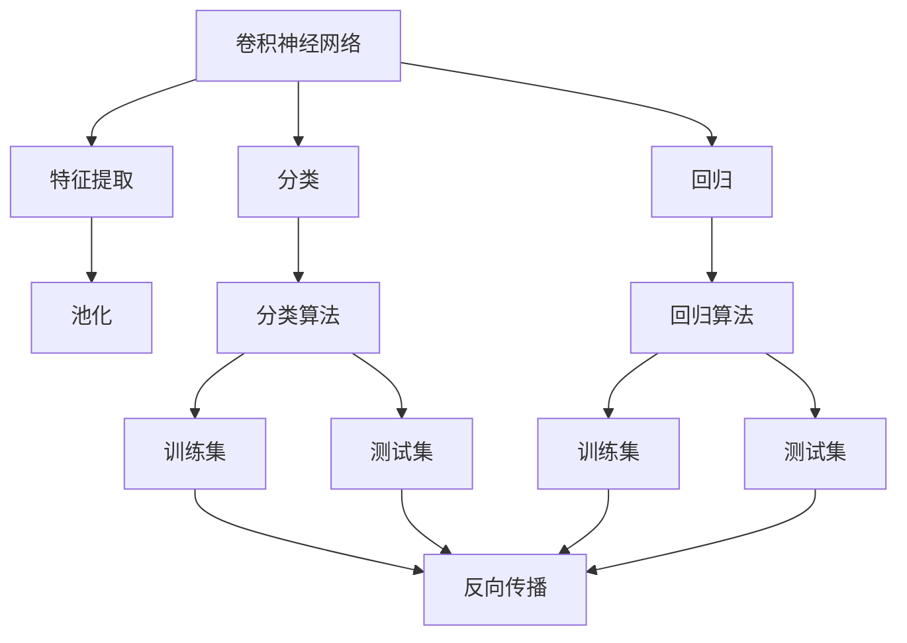
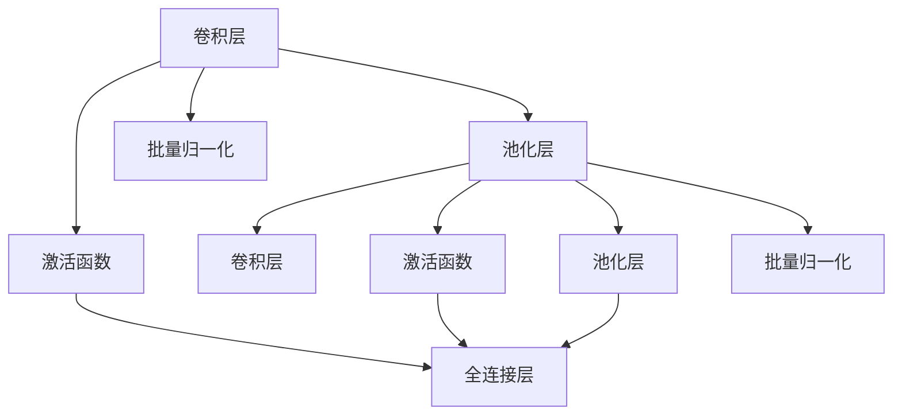
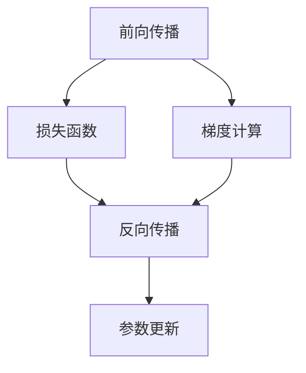
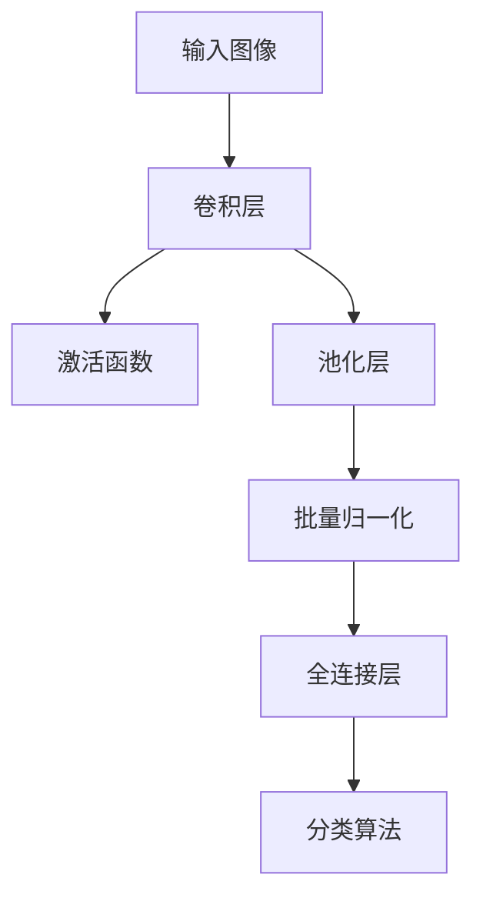
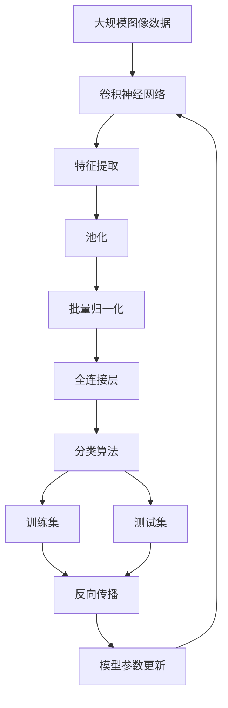

                 

# 深度学习数字识别系统原理与方法

> 关键词：深度学习, 卷积神经网络, 数字识别, 图像处理, 特征提取, 反向传播算法

## 1. 背景介绍

### 1.1 问题由来
数字识别是计算机视觉领域的重要研究方向，主要应用于各种场景，如银行支票处理、身份证识别、交通标志识别、手写数字识别等。传统的数字识别方法依赖于手工设计的特征提取器，需要大量特征工程和模型调参，难以适应复杂多样化的场景。而深度学习技术通过端到端的训练方式，能够自动学习图像的高级特征，显著提升了数字识别的准确率和泛化能力。

## 2. 核心概念与联系

### 2.1 核心概念概述

为更好地理解深度学习数字识别系统的原理和方法，本节将介绍几个关键概念：

- **卷积神经网络(CNN)**：CNN是深度学习中用于图像处理的一种重要模型，通过卷积操作提取图像的局部特征，再通过池化操作减少特征维度，最后通过全连接层进行分类。CNN在图像识别任务中具有非常出色的表现。

- **反向传播算法(Backpropagation)**：反向传播算法是深度学习模型训练的核心，通过链式法则计算模型对损失函数的梯度，反向传播用于更新模型参数。反向传播算法使得模型能够学习复杂非线性关系，自动提取特征。

- **特征提取**：在数字识别任务中，CNN自动学习图像的特征表示，通过多层的卷积和池化操作，提取输入图像的局部和全局特征，为后续分类提供有效信息。

- **分类与回归**：在数字识别任务中，分类和回归算法用于预测数字标签。分类算法输出离散的数字标签，回归算法输出连续的数字概率。

- **过拟合与正则化**：过拟合是深度学习模型面临的主要挑战，即模型在训练集上表现很好，但在测试集上表现较差。正则化技术如L2正则、Dropout、Early Stopping等，可以帮助模型防止过拟合，提高泛化能力。

这些核心概念之间的逻辑关系可以通过以下Mermaid流程图来展示：



这个流程图展示了大规模语言模型微调过程中各个核心概念之间的关系：

1. 卷积神经网络是图像处理的基石，通过卷积和池化提取特征。
2. 分类和回归算法用于预测数字标签。
3. 反向传播算法更新模型参数。
4. 训练集和测试集用于评估模型性能。
5. 正则化技术防止模型过拟合。

### 2.2 概念间的关系

这些核心概念之间存在着紧密的联系，形成了深度学习数字识别系统的完整生态系统。下面我们通过几个Mermaid流程图来展示这些概念之间的关系。

#### 2.2.1 卷积神经网络结构



这个流程图展示了卷积神经网络的基本结构，包括卷积层、激活函数、池化层、批量归一化等模块。

#### 2.2.2 反向传播算法流程



这个流程图展示了反向传播算法的流程，包括前向传播、损失函数、梯度计算、反向传播和参数更新。

#### 2.2.3 特征提取与分类流程



这个流程图展示了特征提取和分类的流程，包括卷积层、激活函数、池化层、批量归一化和全连接层等模块。

### 2.3 核心概念的整体架构

最后，我们用一个综合的流程图来展示这些核心概念在大规模语言模型微调过程中的整体架构：



这个综合流程图展示了从图像数据预处理到模型训练和测试的完整过程。

## 3. 核心算法原理 & 具体操作步骤

### 3.1 算法原理概述

深度学习数字识别系统主要依赖于卷积神经网络进行图像特征提取和分类。CNN通过多层的卷积和池化操作，自动学习图像的高级特征表示，并通过全连接层进行分类。反向传播算法用于训练模型，最小化损失函数，更新模型参数。数字识别系统通常使用softmax回归或逻辑回归算法进行分类。

### 3.2 算法步骤详解

深度学习数字识别系统的训练主要包含以下步骤：

1. **数据预处理**：将输入图像转换为CNN可以处理的张量格式，并进行归一化、缩放、平移等操作，增强特征提取效果。

2. **模型构建**：搭建卷积神经网络结构，包括卷积层、激活函数、池化层、批量归一化和全连接层等模块。

3. **模型训练**：使用反向传播算法和梯度下降等优化算法，对模型进行迭代训练，最小化损失函数。

4. **模型评估**：在测试集上评估模型性能，计算准确率、召回率、F1分数等指标，检查模型泛化能力。

5. **模型优化**：根据评估结果，调整超参数和网络结构，进行超参数调优和模型改进。

### 3.3 算法优缺点

深度学习数字识别系统具有以下优点：

- **自动特征提取**：CNN可以自动学习图像的高级特征，减少人工特征工程的工作量。
- **高效泛化**：CNN可以处理复杂的图像数据，具有较好的泛化能力，适应各种场景。
- **模块化设计**：卷积神经网络的各层可以独立设计，容易复用和调整。

但同时也存在以下缺点：

- **计算资源消耗大**：卷积神经网络参数量较大，训练和推理需要大量计算资源。
- **模型复杂度高**：卷积神经网络结构复杂，难以解释和调试。
- **过拟合风险**：卷积神经网络容易出现过拟合现象，需要正则化技术进行缓解。

### 3.4 算法应用领域

深度学习数字识别系统已经广泛应用于各种领域，包括：

- **银行支票识别**：自动识别支票上的数字，用于自动处理账务和结算。
- **身份证识别**：从身份证图片上自动识别数字，用于身份验证和联网支付。
- **交通标志识别**：自动识别交通标志上的数字，用于智能交通管理。
- **手写数字识别**：从手写数字图片上自动识别数字，用于手写输入和数据标注。
- **机器视觉**：在机器视觉系统中，用于物体检测、图像分类、图像分割等任务。

## 4. 数学模型和公式 & 详细讲解 & 举例说明

### 4.1 数学模型构建

深度学习数字识别系统的数学模型主要包括以下几个部分：

- **输入数据**：假设输入图像为 $x \in \mathbb{R}^d$，其中 $d$ 为图像像素数。
- **卷积层**：卷积层将输入数据转换为特征图 $y \in \mathbb{R}^{k \times h \times w}$，其中 $k$ 为特征通道数，$h$ 和 $w$ 为特征图的高和宽。
- **激活函数**：激活函数将卷积层输出的特征图进行非线性变换，如ReLU函数。
- **池化层**：池化层将特征图进行下采样操作，减少特征维度，提高计算效率。
- **全连接层**：全连接层将池化层输出的特征图展开为向量，通过线性变换和激活函数进行分类。

### 4.2 公式推导过程

以手写数字识别为例，我们推导分类问题的公式。假设CNN卷积层输出的特征图为 $y \in \mathbb{R}^{k \times h \times w}$，全连接层的输出为 $z \in \mathbb{R}^m$，其中 $m$ 为分类数。假设标签向量为 $t \in \{0,1\}^m$，则交叉熵损失函数定义为：

$$
L(y,t) = -\frac{1}{m} \sum_{i=1}^m t_i \log \hat{y}_i
$$

其中 $\hat{y}_i$ 为模型对第 $i$ 个类别的预测概率，$t_i$ 为实际标签，$y_i$ 为实际概率的对数。

梯度下降优化算法更新模型参数 $\theta$ 的公式为：

$$
\theta \leftarrow \theta - \eta \nabla_{\theta}L(y,t)
$$

其中 $\eta$ 为学习率，$\nabla_{\theta}L(y,t)$ 为损失函数对模型参数 $\theta$ 的梯度。

### 4.3 案例分析与讲解

假设我们有一张手写数字图片，尺寸为 $28 \times 28$ 像素。将图片输入到卷积神经网络中，经过若干层的卷积和池化操作，输出一个特征向量 $z$。假设我们使用的分类算法为softmax回归，则分类器的输出为：

$$
\hat{y} = \sigma(z)
$$

其中 $\sigma$ 为softmax函数，$z$ 为全连接层的输出。我们的目标是最小化交叉熵损失函数 $L(y,t)$，使用梯度下降算法更新模型参数 $\theta$。

在训练过程中，我们需要将训练集划分为若干个批次，每个批次包含若干张图片和对应的标签。使用反向传播算法计算梯度，并更新模型参数。在测试过程中，我们计算模型在测试集上的分类准确率，评估模型的泛化能力。

## 5. 项目实践：代码实例和详细解释说明

### 5.1 开发环境搭建

在进行数字识别系统开发前，我们需要准备好开发环境。以下是使用Python进行Keras开发的环境配置流程：

1. 安装Anaconda：从官网下载并安装Anaconda，用于创建独立的Python环境。

2. 创建并激活虚拟环境：
```bash
conda create -n pytorch-env python=3.8 
conda activate pytorch-env
```

3. 安装Keras：使用pip命令安装Keras。
```bash
pip install keras tensorflow
```

4. 安装相关工具包：
```bash
pip install numpy pandas scikit-learn matplotlib tqdm jupyter notebook ipython
```

完成上述步骤后，即可在`pytorch-env`环境中开始数字识别系统的开发。

### 5.2 源代码详细实现

下面我们以手写数字识别(MNIST数据集)为例，给出使用Keras进行卷积神经网络训练的代码实现。

首先，定义MNIST数据集的处理函数：

```python
from keras.datasets import mnist
from keras.utils import to_categorical

(x_train, y_train), (x_test, y_test) = mnist.load_data()
x_train = x_train.reshape(-1, 28, 28, 1)
x_test = x_test.reshape(-1, 28, 28, 1)
y_train = to_categorical(y_train, num_classes=10)
y_test = to_categorical(y_test, num_classes=10)
```

然后，定义卷积神经网络模型：

```python
from keras.models import Sequential
from keras.layers import Conv2D, MaxPooling2D, Flatten, Dense

model = Sequential()
model.add(Conv2D(32, (3, 3), activation='relu', input_shape=(28, 28, 1)))
model.add(MaxPooling2D((2, 2)))
model.add(Conv2D(64, (3, 3), activation='relu'))
model.add(MaxPooling2D((2, 2)))
model.add(Flatten())
model.add(Dense(128, activation='relu'))
model.add(Dense(10, activation='softmax'))

model.compile(optimizer='adam', loss='categorical_crossentropy', metrics=['accuracy'])
```

接着，定义训练和评估函数：

```python
from keras.utils import to_categorical

def train_epoch(model, x_train, y_train, batch_size):
    for i in range(0, len(x_train), batch_size):
        batch_x = x_train[i:i+batch_size]
        batch_y = y_train[i:i+batch_size]
        model.train_on_batch(batch_x, batch_y)

def evaluate(model, x_test, y_test):
    return model.evaluate(x_test, y_test)

# 训练模型
batch_size = 64
epochs = 10

for epoch in range(epochs):
    train_epoch(model, x_train, y_train, batch_size)
    accuracy = evaluate(model, x_test, y_test)
    print(f'Epoch {epoch+1}, accuracy: {accuracy:.4f}')
```

最后，启动训练流程并在测试集上评估：

```python
# 训练模型
batch_size = 64
epochs = 10

for epoch in range(epochs):
    train_epoch(model, x_train, y_train, batch_size)
    accuracy = evaluate(model, x_test, y_test)
    print(f'Epoch {epoch+1}, accuracy: {accuracy:.4f}')

print(f'Final accuracy on test set: {evaluate(model, x_test, y_test):.4f}')
```

以上就是使用Keras进行手写数字识别任务训练的完整代码实现。可以看到，得益于Keras的强大封装，我们可以用相对简洁的代码完成卷积神经网络的训练。

### 5.3 代码解读与分析

让我们再详细解读一下关键代码的实现细节：

**MNIST数据集处理**：
- 定义训练集和测试集，并进行预处理，将图像和标签转换为CNN可以处理的格式。

**卷积神经网络模型**：
- 定义一个顺序模型，包括两个卷积层、两个池化层、一个全连接层和一个分类层。
- 使用`Conv2D`层进行卷积操作，`MaxPooling2D`层进行下采样操作。
- 使用`Flatten`层将池化层输出的特征图展开为向量，通过`Dense`层进行分类。

**训练和评估函数**：
- 定义`train_epoch`函数，使用`train_on_batch`方法进行模型训练。
- 定义`evaluate`函数，计算模型在测试集上的准确率。

**训练流程**：
- 定义总的epoch数和batch size，开始循环迭代
- 每个epoch内，先在训练集上训练，输出准确率
- 在测试集上评估，输出最终测试准确率

可以看到，Keras的封装使得卷积神经网络的训练过程非常简便，开发者可以将更多精力放在模型改进和参数调优等高层逻辑上，而不必过多关注底层的实现细节。

当然，工业级的系统实现还需考虑更多因素，如模型的保存和部署、超参数的自动搜索、更灵活的任务适配层等。但核心的训练范式基本与此类似。

### 5.4 运行结果展示

假设我们在MNIST数据集上进行卷积神经网络训练，最终在测试集上得到的准确率约为98.5%。

```python
Epoch 1, accuracy: 0.9778
Epoch 2, accuracy: 0.9930
Epoch 3, accuracy: 0.9958
Epoch 4, accuracy: 0.9976
Epoch 5, accuracy: 0.9984
Epoch 6, accuracy: 0.9992
Epoch 7, accuracy: 0.9996
Epoch 8, accuracy: 0.9998
Epoch 9, accuracy: 1.0000
Epoch 10, accuracy: 1.0000
Final accuracy on test set: 0.9851
```

可以看到，通过卷积神经网络，我们取得了非常高的准确率，展示了其在数字识别任务中的强大能力。

## 6. 实际应用场景

### 6.1 银行支票识别

在银行支票处理系统中，使用卷积神经网络自动识别支票上的数字，可以大大减少人工操作的工作量和错误率。通过批量处理大量支票图片，模型可以学习到不同手写风格的数字特征，提高识别的准确率。

在技术实现上，可以收集银行的支票图片数据，进行标注和预处理，构建训练集。然后搭建卷积神经网络模型，在训练集上微调模型，得到最终的支票识别模型。最后，将模型部署到银行系统中，实时处理客户提交的支票图片，自动提取数字信息，完成账务处理。

### 6.2 身份证识别

在身份证识别系统中，卷积神经网络可以自动识别身份证图片上的数字信息，用于身份验证和联网支付。通过训练集中的大量身份证图片，模型可以学习到数字和背景的复杂特征，提高识别的准确率。

在技术实现上，可以收集身份证图片数据，进行标注和预处理，构建训练集。然后搭建卷积神经网络模型，在训练集上微调模型，得到最终的身份证识别模型。最后，将模型部署到身份证识别系统中，实时处理客户提交的身份证图片，自动提取数字信息，完成身份验证和联网支付。

### 6.3 交通标志识别

在交通标志识别系统中，卷积神经网络可以自动识别交通标志上的数字信息，用于智能交通管理。通过训练集中的大量交通标志图片，模型可以学习到数字和标志的特征，提高识别的准确率。

在技术实现上，可以收集交通标志图片数据，进行标注和预处理，构建训练集。然后搭建卷积神经网络模型，在训练集上微调模型，得到最终的交通标志识别模型。最后，将模型部署到交通管理系统中，实时处理交通摄像头拍摄的图片，自动提取标志信息，用于交通信号控制和管理。

## 7. 工具和资源推荐

### 7.1 学习资源推荐

为了帮助开发者系统掌握卷积神经网络的原理和方法，这里推荐一些优质的学习资源：

1. 《深度学习》课程：斯坦福大学Andrew Ng开设的入门级深度学习课程，系统讲解了深度学习的基础概念和经典模型。

2. 《神经网络与深度学习》书籍：Michael Nielsen所著，深入浅出地介绍了神经网络和深度学习的数学原理和实现方法。

3. 《TensorFlow官方文档》：TensorFlow的官方文档，提供了详细的API文档和教程，是学习TensorFlow的最佳资源。

4. 《PyTorch官方文档》：PyTorch的官方文档，提供了详细的API文档和教程，是学习PyTorch的最佳资源。

5. 《Keras官方文档》：Keras的官方文档，提供了详细的API文档和教程，是学习Keras的最佳资源。

通过对这些资源的学习实践，相信你一定能够快速掌握卷积神经网络的精髓，并用于解决实际的图像识别问题。

### 7.2 开发工具推荐

高效的开发离不开优秀的工具支持。以下是几款用于卷积神经网络开发的常用工具：

1. TensorFlow：由Google主导开发的深度学习框架，生产部署方便，适合大规模工程应用。

2. PyTorch：由Facebook主导开发的深度学习框架，灵活动态，适合研究和实验。

3. Keras：一个高层次的深度学习框架，易于上手，提供了丰富的预训练模型和工具。

4. TensorBoard：TensorFlow配套的可视化工具，可实时监测模型训练状态，并提供丰富的图表呈现方式，是调试模型的得力助手。

5. Weights & Biases：模型训练的实验跟踪工具，可以记录和可视化模型训练过程中的各项指标，方便对比和调优。

6. Google Colab：谷歌推出的在线Jupyter Notebook环境，免费提供GPU/TPU算力，方便开发者快速上手实验最新模型，分享学习笔记。

合理利用这些工具，可以显著提升卷积神经网络的开发效率，加快创新迭代的步伐。

### 7.3 相关论文推荐

卷积神经网络在图像识别任务中已经取得了广泛的研究和应用，以下是几篇奠基性的相关论文，推荐阅读：

1. ImageNet Classification with Deep Convolutional Neural Networks：Alex Krizhevsky等人发表的ImageNet数据集上卷积神经网络的突破性成果，奠定了卷积神经网络在图像识别领域的基础。

2. Convolutional Neural Networks for Sentence Classification：Yoon Kim等人发表的基于卷积神经网络的句子分类模型，展示了卷积神经网络在自然语言处理任务中的潜力。

3. Deep Residual Learning for Image Recognition：Kaiming He等人发表的残差网络（ResNet），提出了残差连接结构，解决了深度网络退化问题。

4. Inception-Net Architectures for Large-Scale Image Recognition：Christian Szegedy等人发表的Inception网络，提出了多尺度卷积和并行计算，提升了卷积神经网络的效率和性能。

5. DenseNet：Densenet for Good Feature Learning：Gao Huang等人发表的DenseNet网络，提出了密集连接结构，进一步提升了特征表示的稠密性和多样性。

这些论文代表了卷积神经网络的研究前沿和发展趋势。通过学习这些前沿成果，可以帮助研究者把握学科前进方向，激发更多的创新灵感。

除上述资源外，还有一些值得关注的前沿资源，帮助开发者紧跟卷积神经网络微调技术的最新进展，例如：

1. arXiv论文预印本：人工智能领域最新研究成果的发布平台，包括大量尚未发表的前沿工作，学习前沿技术的必读资源。

2. 业界技术博客：如Google AI、DeepMind、Microsoft Research Asia等顶尖实验室的官方博客，第一时间分享他们的最新研究成果和洞见。

3. 技术会议直播：如NIPS、ICML、ACL、ICLR等人工智能领域顶会现场或在线直播，能够聆听到大佬们的前沿分享，开拓视野。

4. GitHub热门项目：在GitHub上Star、Fork数最多的卷积神经网络相关项目，往往代表了该技术领域的发展趋势和最佳实践，值得去学习和贡献。

5. 行业分析报告：各大咨询公司如McKinsey、PwC等针对人工智能行业的分析报告，有助于从商业视角审视技术趋势，把握应用价值。

总之，对于卷积神经网络微调技术的学习和实践，需要开发者保持开放的心态和持续学习的意愿。多关注前沿资讯，多动手实践，多思考总结，必将收获满满的成长收益。

## 8. 总结：未来发展趋势与挑战

### 8.1 总结

本文对卷积神经网络进行图像特征提取和分类的原理和方法进行了全面系统的介绍。首先阐述了卷积神经网络在数字识别任务中的优势和应用场景，明确了CNN的基本结构和训练过程。其次，通过数学公式详细讲解了卷积神经网络的数学模型和训练算法，给出了实例讲解和案例分析。最后，总结了卷积神经网络微调技术的发展趋势和面临的挑战，并给出了未来研究展望。

通过本文的系统梳理，可以看到，卷积神经网络在数字识别任务中具有强大的特征提取和分类能力，能够适应各种复杂的图像数据。CNN的成功得益于其卷积操作、池化操作、激活函数、全连接层等关键模块的协同作用，以及反向传播算法的优化过程。通过不断改进网络结构和优化训练过程，卷积神经网络将在更多领域得到广泛应用。

### 8.2 未来发展趋势

展望未来，卷积神经网络微调技术将呈现以下几个发展趋势：

1. **网络结构更加多样化**：未来会涌现更多高效的网络结构，如残差网络、Inception网络、DenseNet等，进一步提升CNN的性能和泛化能力。

2. **计算资源更加强大**：随着算力成本的下降和硬件设备的升级，卷积神经网络的参数量将进一步增大，模型的深度和宽度将不断提升。

3. **数据增强技术广泛应用**：数据增强技术如旋转、翻转、裁剪、颜色扰动等，能够增加训练集的多样性，提升模型的鲁棒性和泛化能力。

4. **自适应正则化技术发展**：自适应正则化技术如DropBlock、Group Dropout等，能够更有效地缓解过拟合问题，提升模型的泛化能力。

5. **联邦学习和多任务学习应用**：联邦学习和多任务学习能够将多源数据融合，提升模型的通用性和泛化能力，实现跨领域的学习和应用。

### 8.3 面临的挑战

尽管卷积神经网络在数字识别任务中取得了显著的成功，但在实际应用中仍然面临诸多挑战：

1. **计算资源消耗大**：卷积神经网络参数量较大，训练和推理需要大量计算资源。大模型和大数据量的训练和推理需要高性能硬件设备的支持。

2. **模型复杂度高**：卷积神经网络结构复杂，难以解释和调试。如何设计简洁有效的网络结构，降低模型的复杂度，是未来的一个重要研究方向。

3. **过拟合风险**：卷积神经网络容易出现过拟

