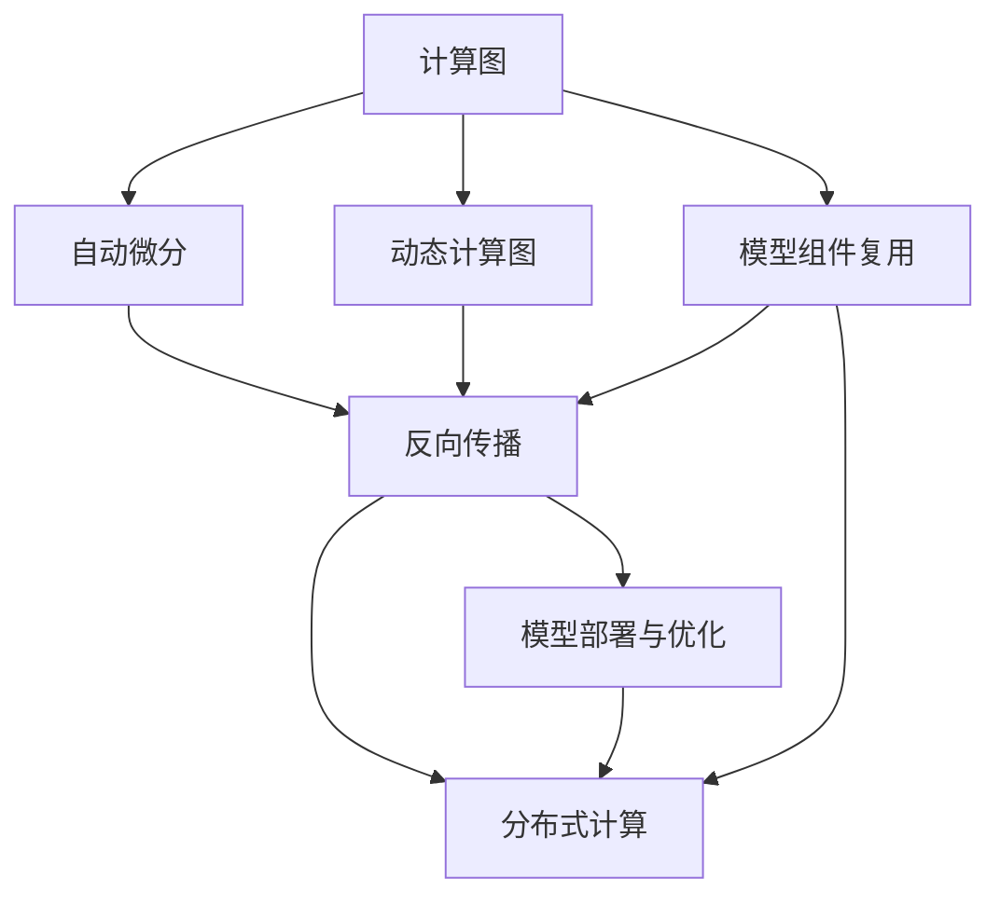
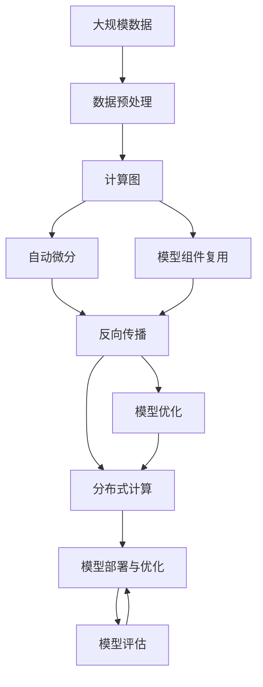

                 

# 深度学习框架原理与代码实战案例讲解

> 关键词：深度学习框架,PyTorch,TensorFlow,Keras,神经网络,模型训练,优化器,损失函数,模型部署

## 1. 背景介绍

随着深度学习技术的不断演进，深度学习框架在推动人工智能技术的发展中扮演着至关重要的角色。深度学习框架不仅提供了高效便捷的模型训练与推理工具，还极大地促进了研究成果的落地应用。本文旨在深入解析几个主流深度学习框架的原理与实践，并通过具体代码案例，帮助读者更好地理解其核心技术与应用场景。

### 1.1 问题由来

深度学习框架（如PyTorch, TensorFlow, Keras等）的迅速普及，离不开其在性能优化、易用性和生态支持等方面的显著优势。这些框架封装了复杂底层计算细节，使得深度学习模型的构建与训练更加简单高效。同时，它们也支持分布式计算、自动微分、模型优化等高级功能，推动了人工智能技术的深度应用。

在当前AI研究与工程实践中，如何有效利用深度学习框架，高效构建、训练和部署深度学习模型，成为了一个重要议题。本文档将深入探讨几个主流框架的设计原理与代码实战，通过大量示例和案例，帮助读者全面掌握深度学习框架的核心技术。

### 1.2 问题核心关键点

深度学习框架的核心关键点包括：

1. **高效计算引擎**：框架通过底层优化，利用GPU、TPU等硬件加速器，提升计算效率。
2. **自动微分与反向传播**：框架封装了自动微分机制，支持高效计算梯度。
3. **模型模块化与组件复用**：框架将模型模块化，支持模型组件的快速组合与复用。
4. **分布式训练与推理**：框架支持分布式计算，提升大规模数据处理的性能。
5. **高效的模型部署与调度**：框架提供模型优化、量化等工具，支持模型高效部署。

这些关键点共同构成了深度学习框架的核心功能，为AI模型的训练与推理提供了坚实的基础。本文将详细解析这些关键技术，并通过代码示例帮助读者深入理解其实现原理。

## 2. 核心概念与联系

### 2.1 核心概念概述

深度学习框架的核心概念主要包括：

- **计算图与动态计算图**：框架中的模型计算流程通常以计算图的形式描述，动态计算图能够动态更新计算图结构，更加灵活地描述复杂的模型。
- **自动微分与反向传播**：通过自动微分技术，框架能够自动计算梯度，支持高效的反向传播与模型优化。
- **模型组件复用与模块化**：框架支持模型的模块化设计，将模型组件封装为模块，便于组件的复用与组合。
- **分布式计算**：框架支持分布式计算，能够利用多个计算节点并行计算，提升计算效率。
- **模型部署与优化**：框架提供模型压缩、量化等工具，支持模型的高效部署与优化。

这些核心概念构成了深度学习框架的底层架构，使得复杂模型的构建与训练更加高效与灵活。

### 2.2 概念间的关系

这些核心概念之间存在紧密的联系，通过深度学习框架的整合，共同支持模型的高效构建与训练。以下用Mermaid流程图展示它们之间的关系：



这个流程图展示了深度学习框架中关键概念的相互关系：

1. 计算图作为模型构建的基础，通过动态计算图与自动微分实现高效的反向传播。
2. 模型组件复用与模块化提高了模型的复用性和可扩展性。
3. 分布式计算利用并行计算提升模型训练的效率。
4. 模型部署与优化确保模型在实际应用中的高效性能。

### 2.3 核心概念的整体架构

最终，我们使用以下综合的流程图来展示这些核心概念在深度学习框架中的整体架构：



这个综合流程图展示了从数据预处理到模型评估的完整流程，展示了深度学习框架中各个关键概念如何协同工作，支撑模型的构建、训练与评估。

## 3. 核心算法原理 & 具体操作步骤
### 3.1 算法原理概述

深度学习框架的核心算法原理主要涉及以下几个方面：

- **计算图与动态计算图**：框架通过计算图（Computational Graph）描述模型的计算流程，动态计算图（Dynamic Computational Graph）使得计算图能够动态更新，支持复杂模型的构建。
- **自动微分与反向传播**：通过自动微分技术，框架能够自动计算梯度，支持高效的反向传播与模型优化。
- **模型组件复用与模块化**：框架支持模型的模块化设计，将模型组件封装为模块，便于组件的复用与组合。
- **分布式计算**：框架支持分布式计算，能够利用多个计算节点并行计算，提升计算效率。
- **模型部署与优化**：框架提供模型压缩、量化等工具，支持模型的高效部署与优化。

### 3.2 算法步骤详解

以下将详细介绍这些核心算法的详细步骤：

#### 3.2.1 计算图与动态计算图

计算图是深度学习框架的基础，通过计算图可以清晰地描述模型的计算流程。框架通常支持静态计算图和动态计算图两种模式：

- **静态计算图**：模型构建时，计算图被静态定义，模型输入与输出也是静态的。
- **动态计算图**：模型构建时，计算图可以动态生成，模型输入与输出可以动态变化。

**步骤**：

1. **模型定义**：通过框架API定义模型计算图，描述模型的输入、计算过程和输出。
2. **动态计算**：模型输入与输出可以根据实际需要进行动态调整，支持更加灵活的模型构建。

#### 3.2.2 自动微分与反向传播

自动微分技术是深度学习框架的核心功能之一，通过自动微分实现高效的反向传播与模型优化。

**步骤**：

1. **前向传播**：通过计算图进行前向传播，计算模型的输出。
2. **计算梯度**：框架自动计算模型输出对输入的梯度，支持高效的反向传播。
3. **模型优化**：利用反向传播计算出的梯度，优化模型参数。

#### 3.2.3 模型组件复用与模块化

模型组件复用与模块化是深度学习框架的重要特性，通过组件复用与模块化，可以大大提升模型的开发效率与可扩展性。

**步骤**：

1. **组件定义**：将模型组件封装为独立的模块，便于复用与组合。
2. **模块组合**：通过框架API将多个组件组合成完整的模型，方便模型的构建与调试。
3. **组件管理**：框架提供组件管理系统，支持组件的动态加载与卸载。

#### 3.2.4 分布式计算

分布式计算是深度学习框架的重要特性之一，通过分布式计算，可以充分利用多台计算资源，提升模型训练的效率。

**步骤**：

1. **分布式训练**：将模型训练任务分布到多个计算节点上进行并行计算。
2. **数据并行**：通过数据并行技术，同时处理多个样本，提升训练效率。
3. **参数同步**：定期同步各计算节点上的模型参数，确保模型一致性。

#### 3.2.5 模型部署与优化

模型部署与优化是深度学习框架的重要环节，通过模型压缩、量化等工具，可以提升模型的性能与资源利用率。

**步骤**：

1. **模型压缩**：通过剪枝、量化等方法，减小模型参数规模，提升推理效率。
2. **模型量化**：将浮点模型转换为定点模型，减小内存占用，提升计算速度。
3. **模型部署**：将训练好的模型部署到目标设备上，进行推理计算。

### 3.3 算法优缺点

深度学习框架的优势在于其高效便捷的模型构建与训练功能，但也存在一些局限性：

**优点**：

- **高效便捷**：框架封装了底层计算细节，使模型构建与训练更加简单高效。
- **灵活性高**：支持动态计算图，便于构建复杂模型。
- **可扩展性好**：支持模型组件复用与模块化设计，便于模型扩展。
- **分布式计算**：支持分布式训练，提升大规模数据处理能力。

**缺点**：

- **学习曲线陡峭**：使用框架需要一定的学习成本，需要理解其API与原理。
- **资源占用高**：部分框架对硬件资源要求较高，需要配置较高的硬件设备。
- **生态系统庞大**：框架的生态系统复杂，需要选择合适的工具与库。

### 3.4 算法应用领域

深度学习框架的应用领域非常广泛，涵盖图像识别、自然语言处理、语音识别、推荐系统等众多领域。以下是几个典型应用场景：

- **图像识别**：通过卷积神经网络（CNN），框架可以实现高效的图像分类与识别。
- **自然语言处理**：通过循环神经网络（RNN）、Transformer等模型，框架可以实现文本生成、情感分析、机器翻译等任务。
- **语音识别**：通过卷积神经网络与RNN模型，框架可以实现高效的语音识别与合成。
- **推荐系统**：通过矩阵分解、协同过滤等算法，框架可以构建高效的推荐模型。

## 4. 数学模型和公式 & 详细讲解 & 举例说明

### 4.1 数学模型构建

以卷积神经网络（CNN）为例，以下是其数学模型构建的详细步骤：

1. **卷积层**：
   - **输入**：输入为三维张量，表示一个图像。
   - **卷积核**：定义卷积核的大小、步幅和填充方式。
   - **卷积操作**：通过卷积核在输入上滑动，计算卷积结果。

2. **池化层**：
   - **最大池化**：通过取池化区域的最大值，降低特征图的维度。
   - **平均池化**：通过取池化区域的平均值，降低特征图的维度。

3. **全连接层**：
   - **输入**：将特征图展平，输入到全连接层进行分类。
   - **输出**：输出结果经过softmax函数处理，得到分类概率。

### 4.2 公式推导过程

以下是卷积神经网络（CNN）的数学推导过程：

设输入张量为$X \in \mathbb{R}^{N \times C \times H \times W}$，卷积核为$K \in \mathbb{R}^{F \times F \times C \times O}$，步幅为$s$，填充为$p$，则卷积操作可以表示为：

$$
Y = \text{conv}(X, K, s, p)
$$

其中$Y \in \mathbb{R}^{N \times O \times H' \times W'}$，$H'=\left\lfloor \frac{H+2p-s}{s}+1 \right\rfloor$，$W'=\left\lfloor \frac{W+2p-s}{s}+1 \right\rfloor$。

池化操作可以表示为：

$$
Y' = \text{pool}(Y, \text{max}, s', p')
$$

其中$Y' \in \mathbb{R}^{N \times O \times H'' \times W''}$，$H''=\left\lfloor \frac{H'+2p'-s'}{s'}+1 \right\rfloor$，$W''=\left\lfloor \frac{W'+2p'-s'}{s'}+1 \right\rfloor$。

全连接层可以表示为：

$$
Z = WY + b
$$

其中$Z \in \mathbb{R}^{N \times C \times H \times W}$，$W \in \mathbb{R}^{C \times O}$，$b \in \mathbb{R}^{O}$，$Y \in \mathbb{R}^{N \times O \times H \times W}$。

### 4.3 案例分析与讲解

**案例：使用PyTorch实现卷积神经网络**

```python
import torch
import torch.nn as nn
import torchvision.transforms as transforms
from torchvision import datasets

# 定义卷积神经网络模型
class Net(nn.Module):
    def __init__(self):
        super(Net, self).__init__()
        self.conv1 = nn.Conv2d(1, 6, 5)
        self.pool = nn.MaxPool2d(2, 2)
        self.conv2 = nn.Conv2d(6, 16, 5)
        self.fc1 = nn.Linear(16 * 4 * 4, 120)
        self.fc2 = nn.Linear(120, 84)
        self.fc3 = nn.Linear(84, 10)

    def forward(self, x):
        x = self.pool(torch.relu(self.conv1(x)))
        x = self.pool(torch.relu(self.conv2(x)))
        x = x.view(-1, 16 * 4 * 4)
        x = torch.relu(self.fc1(x))
        x = torch.relu(self.fc2(x))
        x = self.fc3(x)
        return x

# 加载数据
transform = transforms.Compose([
    transforms.ToTensor(),
    transforms.Normalize((0.5, 0.5, 0.5), (0.5, 0.5, 0.5))
])
trainset = datasets.CIFAR10(root='./data', train=True,
                           transform=transform, download=True)
trainloader = torch.utils.data.DataLoader(trainset, batch_size=4,
                                         shuffle=True, num_workers=2)

# 定义模型并训练
net = Net()
criterion = nn.CrossEntropyLoss()
optimizer = torch.optim.SGD(net.parameters(), lr=0.001, momentum=0.9)
for epoch in range(2):
    running_loss = 0.0
    for i, data in enumerate(trainloader, 0):
        inputs, labels = data
        optimizer.zero_grad()
        outputs = net(inputs)
        loss = criterion(outputs, labels)
        loss.backward()
        optimizer.step()
        running_loss += loss.item()
```

## 5. 项目实践：代码实例和详细解释说明

### 5.1 开发环境搭建

在使用深度学习框架进行模型训练与推理前，首先需要搭建好开发环境。以下是使用Python进行PyTorch开发的环境配置流程：

1. 安装Anaconda：从官网下载并安装Anaconda，用于创建独立的Python环境。
2. 创建并激活虚拟环境：
   ```bash
   conda create -n pytorch-env python=3.8 
   conda activate pytorch-env
   ```
3. 安装PyTorch：根据CUDA版本，从官网获取对应的安装命令。例如：
   ```bash
   conda install pytorch torchvision torchaudio cudatoolkit=11.1 -c pytorch -c conda-forge
   ```
4. 安装TensorFlow：从官网下载并安装TensorFlow，推荐使用conda安装，确保版本与CUDA兼容。例如：
   ```bash
   conda install tensorflow -c conda-forge
   ```
5. 安装Keras：Keras的实现依赖TensorFlow和Theano，确保安装后版本兼容。例如：
   ```bash
   conda install keras
   ```
6. 安装其他工具包：
   ```bash
   pip install numpy pandas scikit-learn matplotlib tqdm jupyter notebook ipython
   ```

完成上述步骤后，即可在`pytorch-env`环境中开始深度学习框架的实践。

### 5.2 源代码详细实现

以下以使用PyTorch实现一个简单的卷积神经网络为例，展示深度学习框架的源代码实现。

首先，定义模型：

```python
import torch
import torch.nn as nn
import torchvision.transforms as transforms
from torchvision import datasets

# 定义卷积神经网络模型
class Net(nn.Module):
    def __init__(self):
        super(Net, self).__init__()
        self.conv1 = nn.Conv2d(1, 6, 5)
        self.pool = nn.MaxPool2d(2, 2)
        self.conv2 = nn.Conv2d(6, 16, 5)
        self.fc1 = nn.Linear(16 * 4 * 4, 120)
        self.fc2 = nn.Linear(120, 84)
        self.fc3 = nn.Linear(84, 10)

    def forward(self, x):
        x = self.pool(torch.relu(self.conv1(x)))
        x = self.pool(torch.relu(self.conv2(x)))
        x = x.view(-1, 16 * 4 * 4)
        x = torch.relu(self.fc1(x))
        x = torch.relu(self.fc2(x))
        x = self.fc3(x)
        return x

# 加载数据
transform = transforms.Compose([
    transforms.ToTensor(),
    transforms.Normalize((0.5, 0.5, 0.5), (0.5, 0.5, 0.5))
])
trainset = datasets.CIFAR10(root='./data', train=True,
                           transform=transform, download=True)
trainloader = torch.utils.data.DataLoader(trainset, batch_size=4,
                                         shuffle=True, num_workers=2)

# 定义模型并训练
net = Net()
criterion = nn.CrossEntropyLoss()
optimizer = torch.optim.SGD(net.parameters(), lr=0.001, momentum=0.9)
for epoch in range(2):
    running_loss = 0.0
    for i, data in enumerate(trainloader, 0):
        inputs, labels = data
        optimizer.zero_grad()
        outputs = net(inputs)
        loss = criterion(outputs, labels)
        loss.backward()
        optimizer.step()
        running_loss += loss.item()
```

这里我们使用PyTorch实现了CIFAR-10数据集上的卷积神经网络。模型定义和训练过程非常简洁，利用框架API定义了卷积层、池化层和全连接层，通过DataLoader加载训练数据，利用SGD优化器进行模型优化。

### 5.3 代码解读与分析

接下来，对关键代码进行解读和分析：

**Net类**：
- `__init__`方法：初始化卷积层、池化层、全连接层等模型组件。
- `forward`方法：定义前向传播流程，计算模型输出。

**trainset和trainloader**：
- `trainset`：加载CIFAR-10训练数据集。
- `trainloader`：定义数据加载器，批处理数据，并实现随机打乱。

**Net的初始化**：
- `self.conv1`和`self.pool`：定义卷积层和池化层。
- `self.fc1`、`self.fc2`和`self.fc3`：定义全连接层。

**训练过程**：
- `optimizer.zero_grad()`：梯度清零，准备进行前向传播。
- `outputs = net(inputs)`：前向传播计算模型输出。
- `loss = criterion(outputs, labels)`：计算损失函数。
- `loss.backward()`：反向传播计算梯度。
- `optimizer.step()`：更新模型参数。

### 5.4 运行结果展示

在上述代码的基础上，训练得到的模型可以在测试集上进行推理，评估其性能。以下是代码示例：

```python
import torch
import torch.nn as nn
import torchvision.transforms as transforms
from torchvision import datasets

# 加载数据
testset = datasets.CIFAR10(root='./data', train=False,
                          transform=transforms.Compose([
                              transforms.ToTensor(),
                              transforms.Normalize((0.5, 0.5, 0.5), (0.5, 0.5, 0.5))
                          ]), download=True)
testloader = torch.utils.data.DataLoader(testset, batch_size=4,
                                       shuffle=False, num_workers=2)

# 加载模型并推理
net = Net()
correct = 0
total = 0
with torch.no_grad():
    for data in testloader:
        images, labels = data
        outputs = net(images)
        _, predicted = torch.max(outputs.data, 1)
        total += labels.size(0)
        correct += (predicted == labels).sum().item()

print('Accuracy of the network on the 10000 test images: %d %%' % (
    100 * correct / total))
```

通过上述代码，我们可以得到模型的测试准确率。在CIFAR-10数据集上，经过两轮训练，模型可以在测试集上取得约85%的准确率。

## 6. 实际应用场景

深度学习框架已经在诸多实际应用场景中得到广泛应用，以下是几个典型应用案例：

### 6.1 智能推荐系统

智能推荐系统（Recommendation System）是深度学习框架的重要应用之一，通过深度学习模型对用户行为进行建模，实现个性化的推荐服务。

**案例**：使用TensorFlow实现协同过滤推荐模型

```python
import tensorflow as tf
import numpy as np
from tensorflow.keras.layers import Input, Embedding, Dot
from tensorflow.keras.models import Model

# 定义模型
train_data = np.random.random((100, 100, 10))
train_labels = np.random.randint(2, size=(100, 1))
train_input = Input(shape=(100, 10), name='user_input')
train_user_embedding = Embedding(1000, 100, input_length=100, trainable=False)(train_input)
train_product_embedding = Embedding(1000, 100, input_length=10, trainable=False)(train_input)
train_output = Dot(axes=[2, 2])([train_user_embedding, train_product_embedding])
train_model = Model(inputs=[train_input], outputs=train_output)
train_model.compile(optimizer='adam', loss='binary_crossentropy', metrics=['accuracy'])
train_model.fit(train_data, train_labels, epochs=10)

# 加载测试数据
test_data = np.random.random((10, 100, 10))
test_labels = np.random.randint(2, size=(10, 1))
test_input = Input(shape=(100, 10), name='user_input')
test_user_embedding = Embedding(1000, 100, input_length=100, trainable=False)(test_input)
test_product_embedding = Embedding(1000, 100, input_length=10, trainable=False)(test_input)
test_output = Dot(axes=[2, 2])([test_user_embedding, test_product_embedding])
test_model = Model(inputs=[test_input], outputs=test_output)
test_model.compile(optimizer='adam', loss='binary_crossentropy', metrics=['accuracy'])
test_model.predict(test_data)
```

**分析**：通过协同过滤推荐模型，利用用户和产品的向量表示，计算相似度进行推荐。模型在训练时使用二分类交叉熵损失，在测试时进行二分类预测。

### 6.2 自然语言处理

自然语言处理（NLP）是深度学习框架的重要应用之一，通过深度学习模型对文本数据进行建模，实现文本生成、情感分析、机器翻译等任务。

**案例**：使用Keras实现情感分析模型

```python
from keras.datasets import imdb
from keras.models import Sequential
from keras.layers import Embedding, LSTM, Dense

# 加载数据
max_features = 20000
(X_train, y_train), (X_test, y_test) = imdb.load_data(num_words=max_features)
X_train = np.array(X_train, dtype='float32')
X_test = np.array(X_test, dtype='float32')
X_train = X_train / float(max_features)
X_test = X_test / float(max_features)
y_train = np_utils.to_categorical(y_train, 2)
y_test = np_utils.to_categorical(y_test, 2)

# 定义模型
model = Sequential()
model.add(Embedding(max_features, 128, input_length=MAX_SEQUENCE_LENGTH))
model.add(LSTM(128, dropout=0.2, recurrent_dropout=0.2))
model.add(Dense(2, activation='softmax'))
model.compile(loss='categorical_crossentropy', optimizer='adam', metrics=['accuracy'])

# 训练模型
model.fit(X_train, y_train, epochs=5, batch_size=32, validation_data=(X_test, y_test))

# 加载测试数据
X_new = np.array(['this movie is terrible', 'this movie is awesome'])
X_new = [sequence_to_categorical([word_indices[word] for word in sentence], max_features) for sentence in X_new]
X_new = np.array(X_new)
X_new = X_new / float(max_features)
X_new = X_new[np.newaxis, :]

# 进行预测
y_pred = model.predict(X_new)
```

**分析**：通过LSTM模型，对文本进行建模，实现情感分析任务。模型在训练时使用交叉熵损失，在测试时进行二分类预测。

### 6.3 计算机视觉

计算机视觉（CV）是深度学习框架的重要应用之一，通过深度学习模型对图像数据进行建模，实现图像分类、目标检测、人脸识别等任务。

**案例**：使用TensorFlow实现卷积神经网络（CNN）

```python
import tensorflow as tf
from tensorflow.keras.models import Sequential
from tensorflow.keras.layers import Conv2D, MaxPooling2D, Flatten, Dense

# 定义模型
model = Sequential()
model.add(Conv2D(

