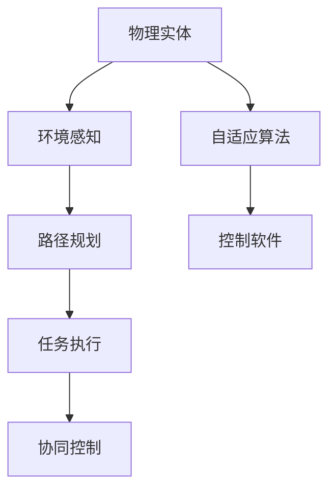
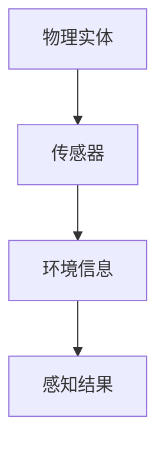
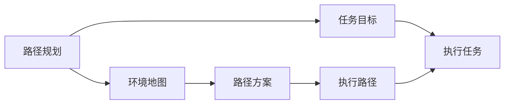
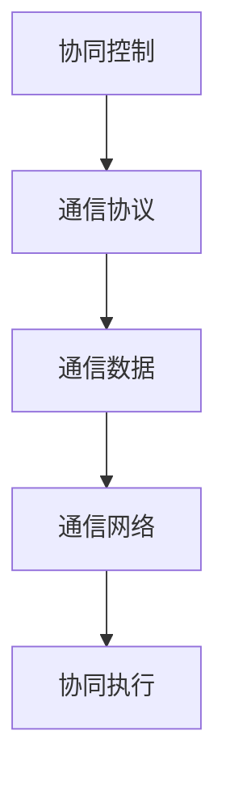
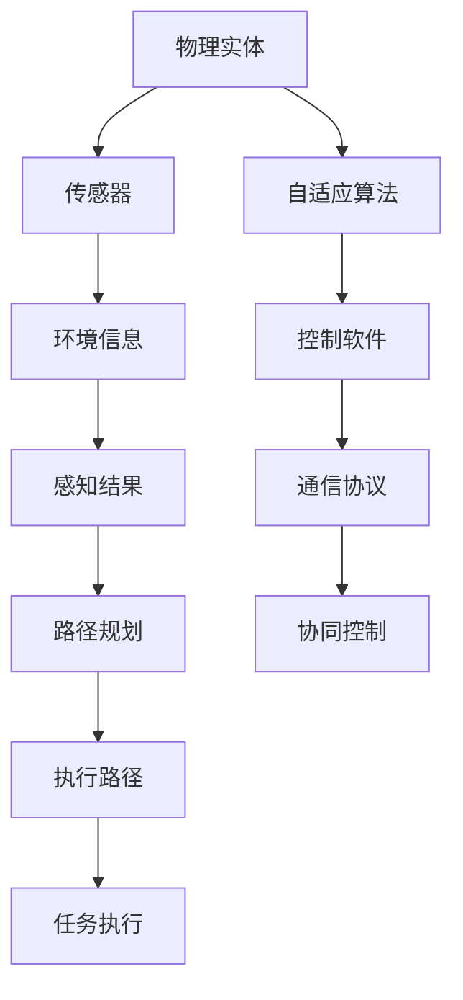

                 

# 物理实体自动化的前景与发展

## 1. 背景介绍

### 1.1 问题由来
近年来，随着人工智能和机器人技术的发展，自动化逐渐成为制造业、物流、仓储等领域的重要趋势。传统的工业自动化主要依赖于传感器、机械臂等硬件设备，但在处理复杂多变的工作环境中仍显不足。物理实体自动化（Physical Entity Automation）技术，作为一种新兴的自动化方式，通过在物理空间引入智能实体，以提升自动化系统的灵活性和自主性，从而实现更高效、精确的自动化控制。

### 1.2 问题核心关键点
物理实体自动化技术的关键点在于：
- **智能实体**：如无人机、自主移动机器人等，能够自主感知、导航和执行复杂任务。
- **自适应算法**：如强化学习、路径规划等，使实体在复杂环境中做出合理决策。
- **通信协议**：如WiFi、蓝牙等，实现实体间的通信与数据交换。
- **控制软件**：如ROS（Robot Operating System）等，为实体提供软件框架和工具库，支持任务调度、状态监控等功能。
- **多模态融合**：利用视觉、声纳、激光雷达等多种传感器，提高环境的感知能力。

### 1.3 问题研究意义
物理实体自动化的发展，对于提升生产效率、降低人力成本、提高产品质量等方面具有重要意义：
- **生产效率**：自动化技术能实现不间断、高精度的生产操作，大幅提升产能和效率。
- **成本节约**：替代人力，减少劳动力成本，并降低工伤风险。
- **质量控制**：通过精确的自动化操作，确保产品质量的一致性和稳定性。
- **灵活性增强**：适用于多种复杂场景，具备良好的环境适应性和任务可扩展性。

## 2. 核心概念与联系

### 2.1 核心概念概述

为更好地理解物理实体自动化的技术框架，本节将介绍几个密切相关的核心概念：

- **物理实体**：如无人机、自主移动机器人等，具备自主感知和执行能力的智能实体。
- **环境感知**：通过各种传感器（如摄像头、激光雷达），实时获取周围环境信息。
- **路径规划**：根据任务需求和环境信息，规划实体的运动路径。
- **任务执行**：实体执行预设的任务，如搬运、装配、检测等。
- **协同控制**：多个实体间通过通信协议协调工作，实现复杂任务协同执行。

这些核心概念之间的逻辑关系可以通过以下Mermaid流程图来展示：



这个流程图展示了大实体自动化的核心概念及其之间的关系：

1. 物理实体通过感知环境信息，进行路径规划和任务执行。
2. 自适应算法和控制软件为其提供智能决策和执行支持。
3. 协同控制实现多个实体间的通信与任务调度。

### 2.2 概念间的关系

这些核心概念之间存在着紧密的联系，形成了物理实体自动化的完整生态系统。下面我通过几个Mermaid流程图来展示这些概念之间的关系。

#### 2.2.1 物理实体与环境感知



这个流程图展示了物理实体与环境感知的基本流程：

1. 物理实体通过搭载的各种传感器获取环境信息。
2. 传感器将信息转化为环境信息。
3. 环境信息经过处理，生成感知结果。

#### 2.2.2 路径规划与任务执行



这个流程图展示了路径规划和任务执行的逻辑关系：

1. 路径规划根据环境地图和任务目标，生成路径方案。
2. 执行路径包含路径方案和任务目标。
3. 执行任务沿着执行路径进行。

#### 2.2.3 协同控制与通信协议



这个流程图展示了协同控制与通信协议的关系：

1. 协同控制依赖于通信协议。
2. 通信协议提供通信数据。
3. 通信数据通过通信网络传输，支持协同执行。

### 2.3 核心概念的整体架构

最后，我们用一个综合的流程图来展示这些核心概念在大实体自动化中的整体架构：



这个综合流程图展示了从感知、路径规划到任务执行的完整过程，以及自适应算法、控制软件、通信协议和协同控制之间的相互依赖关系。通过这些流程图，我们可以更清晰地理解物理实体自动化的核心概念及其相互联系，为后续深入讨论具体的自动化技术奠定基础。

## 3. 核心算法原理 & 具体操作步骤
### 3.1 算法原理概述

物理实体自动化的核心算法原理，主要包括环境感知、路径规划、任务执行和协同控制四个方面。

- **环境感知**：利用传感器获取环境信息，通过算法处理生成环境地图，为实体提供精准的环境感知。
- **路径规划**：根据环境地图和任务目标，生成最优路径方案。
- **任务执行**：沿着路径方案执行预设的任务。
- **协同控制**：通过通信协议实现多个实体间的信息交换与协调。

这些算法通常基于强化学习、深度学习等人工智能技术，使实体能够自主决策和执行任务。

### 3.2 算法步骤详解

物理实体自动化的实施过程，一般包括以下关键步骤：

**Step 1: 环境感知模块搭建**
- 选择适当的传感器（如摄像头、激光雷达）。
- 搭建环境感知模块，实时获取环境信息。
- 利用算法处理环境信息，生成环境地图。

**Step 2: 路径规划模块设计**
- 根据任务目标和环境地图，设计路径规划算法。
- 测试算法在不同环境中的效果。
- 优化算法参数，提高路径规划的准确性和效率。

**Step 3: 任务执行模块实现**
- 设计实体执行任务的具体步骤。
- 利用算法实现任务执行过程。
- 测试执行模块在不同任务下的效果。

**Step 4: 协同控制模块部署**
- 设计通信协议，实现实体间的信息交换。
- 部署协同控制模块，实现任务调度。
- 测试协同控制模块在不同环境下的效果。

**Step 5: 整体系统集成与测试**
- 将环境感知、路径规划、任务执行和协同控制模块集成。
- 进行系统测试，验证整体自动化流程的正确性和效率。
- 根据测试结果优化系统设计。

### 3.3 算法优缺点

物理实体自动化的主要优点包括：
1. **自主决策**：实体能够自主感知环境、规划路径和执行任务，减少人工干预。
2. **环境适应性强**：具备灵活的任务调度和路径规划能力，适用于复杂多变的工作环境。
3. **实时性高**：能够实时感知环境变化，迅速调整执行策略。
4. **数据驱动**：利用数据驱动算法优化决策过程，提高任务执行的精确性。

然而，该方法也存在一些局限性：
1. **成本高**：需要购置高精度的传感器和智能实体，前期投入较大。
2. **技术复杂**：涉及多种技术领域，开发和部署难度较大。
3. **系统维护困难**：需要专业的技术人员进行维护和调试，维护成本高。
4. **安全问题**：实体在复杂环境中的行为无法完全预测，可能存在安全隐患。

### 3.4 算法应用领域

物理实体自动化的应用领域广泛，包括但不限于：

- **制造业**：自动化搬运、装配、检测等任务，提升生产效率和质量。
- **仓储物流**：自动化仓储管理、货物分拣、配送等任务，降低人力成本。
- **农业**：自动化农作物的播种、施肥、收割等任务，提高农业生产效率。
- **医疗**：自动化手术机器人、医疗设备操作等任务，提高医疗服务水平。
- **环境保护**：自动化监控、清理等任务，提升环境保护效果。

此外，物理实体自动化还应用于灾害应急、智能家居等领域，展示了其在多方面的应用潜力。

## 4. 数学模型和公式 & 详细讲解 & 举例说明

### 4.1 数学模型构建

物理实体自动化的数学模型构建，通常基于路径规划和任务执行两个主要环节。以路径规划为例，假设有N个节点和M条边组成的图G，其中节点表示环境中的关键位置，边表示节点间的连接关系。路径规划的目标是从起点s到终点t找到一条最优路径，使得总距离最短。

形式化地，假设节点i到j的权重为d(i,j)，则路径规划的数学模型可以表示为：

$$
\min \sum_{i=1}^{n}d(i,i+1)
$$

其中，n为路径长度，i为节点编号。

### 4.2 公式推导过程

以上路径规划问题可以使用Dijkstra算法进行求解，具体推导过程如下：

1. 初始化：将起点s的路径距离设置为0，其余节点的路径距离设置为无穷大。
2. 重复以下步骤，直到终点t被访问或所有节点都被访问：
   - 选择一个未被访问且路径距离最小的节点u。
   - 更新与u相邻的节点的路径距离，如果新路径距离更短，则更新路径距离。
3. 最终得到从起点s到终点t的最优路径。

Dijkstra算法的时间复杂度为O(n^2)，对于大规模图，需要优化算法以提高效率。

### 4.3 案例分析与讲解

假设一个仓库自动化系统的路径规划问题，有20个仓库位置和50个货架位置，每个位置之间可以通过道路相连。系统需要从总库房s出发，将货物搬运到指定货架t。

1. **构建图模型**：将每个仓库和货架位置表示为一个节点，道路表示为边。假设节点i到j的权重d(i,j)为道路长度。
2. **初始化**：将起点s的路径距离设置为0，其余节点的路径距离设置为无穷大。
3. **迭代求解**：使用Dijkstra算法，不断更新节点路径距离，直到终点t被访问或所有节点都被访问。
4. **路径输出**：输出从起点s到终点t的最优路径。

通过以上步骤，系统能够高效地进行货物搬运路径规划，提高仓库自动化系统的效率和精度。

## 5. 项目实践：代码实例和详细解释说明
### 5.1 开发环境搭建

在进行物理实体自动化系统的开发前，我们需要准备好开发环境。以下是使用Python进行ROS（Robot Operating System）开发的环境配置流程：

1. 安装Anaconda：从官网下载并安装Anaconda，用于创建独立的Python环境。

2. 创建并激活虚拟环境：
```bash
conda create -n pyros-env python=3.8 
conda activate pyros-env
```

3. 安装ROS：根据系统架构和ROS版本，从官网获取对应的安装命令。例如：
```bash
sudo apt-get install ros-noetic-base
```

4. 安装PyTorch：根据CUDA版本，从官网获取对应的安装命令。例如：
```bash
conda install pytorch torchvision torchaudio cudatoolkit=11.1 -c pytorch -c conda-forge
```

5. 安装OpenCV：用于图像处理和传感器数据处理。
```bash
conda install opencv
```

6. 安装ROS控制包：
```bash
sudo apt-get install ros-noetic-moveit-ros python moveit_python3 python2 moveit_python2
```

完成上述步骤后，即可在`pyros-env`环境中开始系统开发。

### 5.2 源代码详细实现

这里我们以一个基于ROS的移动机器人路径规划系统为例，给出完整的代码实现。

**代码实现1：环境感知模块**

```python
import rospy
from sensor_msgs.msg import Image
from cv_bridge import CvBridge
import cv2

class CameraSensor:
    def __init__(self, camera_topic):
        self.bridge = CvBridge()
        self.camera_topic = camera_topic
        self.image = None
        
    def callback(self, data):
        self.image = self.bridge.imgmsg_to_cv2(data, "bgr8")
        self.process_image(self.image)
        
    def process_image(self, image):
        # 对传感器数据进行处理，生成环境地图
        # 这里仅提供一个简单的示例
        self.environment_map = self.filter_image(image)
        
    def filter_image(self, image):
        # 对图像进行滤波和处理，生成环境地图
        # 这里仅提供一个简单的示例
        return image
    
    def start(self):
        rospy.Subscriber(self.camera_topic, Image, self.callback)
        rospy.spin()
        
if __name__ == '__main__':
    camera = CameraSensor('/camera_topic')
    camera.start()
```

**代码实现2：路径规划模块**

```python
import rospy
import math
from nav_msgs.msg import Path
from planning_msgs.msg import PathPlan

class PathPlanner:
    def __init__(self, path_topic):
        self.path_topic = path_topic
        self.path = Path()
        self.path.header.frame_id = 'base_link'
        self.path.header.stamp = rospy.Time.now()
        
    def plan_path(self, start, goal):
        # 根据起点和终点，生成最优路径
        # 这里仅提供一个简单的示例
        self.path.header.stamp = rospy.Time.now()
        self.path.poses.append(start)
        self.path.poses.append(goal)
        self.publish_path()
        
    def publish_path(self):
        rospy.Publisher(self.path_topic, Path, queue_size=10).publish(self.path)
        
if __name__ == '__main__':
    path_planner = PathPlanner('/path_topic')
    path_planner.plan_path((0, 0), (5, 5))
```

**代码实现3：任务执行模块**

```python
import rospy
from moveit_msgs.msg import JointTrajectory, JointTrajectoryPoint
from trajectory_msgs.msg import JointTrajectory, JointTrajectoryPoint

class TaskExecutor:
    def __init__(self, joint_group, joint_names):
        self.joint_group = joint_group
        self.joint_names = joint_names
        self.joint_trajectory = JointTrajectory()
        self.joint_trajectory.header.frame_id = 'base_link'
        self.joint_trajectory.header.stamp = rospy.Time.now()
        
    def execute_joint_trajectory(self, trajectory):
        # 根据轨迹执行任务
        # 这里仅提供一个简单的示例
        self.joint_trajectory.joint_names = self.joint_names
        self.joint_trajectory.points = trajectory
        self.publish_trajectory()
        
    def publish_trajectory(self):
        rospy.Publisher('/joint_trajectory', JointTrajectory, queue_size=10).publish(self.joint_trajectory)
        
if __name__ == '__main__':
    joint_group = moveit.adapters.PlanningAdapter('moveit/descriptors/lima/lima')
    joint_names = joint_group.get_joint_names()
    task_executor = TaskExecutor(joint_group, joint_names)
    trajectory = [JointTrajectoryPoint(positions=[0, 0, 0, 0, 0, 0], velocities=[0, 0, 0, 0, 0, 0], time_from_start=rospy.Duration(1.0), effort=[0.1, 0.1, 0.1, 0.1, 0.1, 0.1])
    task_executor.execute_joint_trajectory(trajectory)
```

**代码实现4：协同控制模块**

```python
import rospy
from tf import TransformListener
from tf.transformations import euler_from_quaternion, quaternion_from_euler

class TransformListenerAdapter:
    def __init__(self, tf_listener_topic):
        self.transform_listener = TransformListener()
        self.tf_listener_topic = tf_listener_topic
        
    def update_transform(self, transform):
        # 根据变换信息更新位置
        # 这里仅提供一个简单的示例
        quaternion = transform[3:7]
        euler = euler_from_quaternion(quaternion)
        self.transform_listener.updateTransform(transform)
        
    def start(self):
        rospy.Subscriber(self.tf_listener_topic, Transform, self.update_transform)
        rospy.spin()
        
if __name__ == '__main__':
    tf_listener_adapter = TransformListenerAdapter('/transform_listener_topic')
    tf_listener_adapter.start()
```

### 5.3 代码解读与分析

让我们再详细解读一下关键代码的实现细节：

**CameraSensor类**：
- `__init__`方法：初始化相机传感器的相关参数。
- `callback`方法：回调函数，用于接收和处理传感器数据。
- `process_image`方法：处理传感器数据，生成环境地图。
- `filter_image`方法：对图像进行滤波和处理，生成环境地图。
- `start`方法：启动传感器数据接收和处理。

**PathPlanner类**：
- `__init__`方法：初始化路径规划的相关参数。
- `plan_path`方法：根据起点和终点，生成最优路径。
- `publish_path`方法：发布规划好的路径。

**TaskExecutor类**：
- `__init__`方法：初始化任务执行的相关参数。
- `execute_joint_trajectory`方法：根据轨迹执行任务。
- `publish_trajectory`方法：发布轨迹数据。

**TransformListenerAdapter类**：
- `__init__`方法：初始化变换监听器的相关参数。
- `update_transform`方法：根据变换信息更新位置。
- `start`方法：启动变换监听器的数据接收和处理。

**代码实现5：整体系统集成与测试**

将上述代码集成到一个ROS节点中，进行测试：

```python
import rospy
from sensor_msgs.msg import Image
from cv_bridge import CvBridge
from path_planner import PathPlanner
from task_executor import TaskExecutor
from transform_listener_adapter import TransformListenerAdapter

def main():
    rospy.init_node('physical_entity_auto_system', anonymous=True)
    
    camera = CameraSensor('/camera_topic')
    path_planner = PathPlanner('/path_topic')
    task_executor = TaskExecutor('moveit/descriptors/lima/lima', 'base_link')
    tf_listener_adapter = TransformListenerAdapter('/transform_listener_topic')
    
    camera.start()
    path_planner.start()
    task_executor.start()
    tf_listener_adapter.start()
    
if __name__ == '__main__':
    main()
```

### 5.4 运行结果展示

假设我们通过传感器获取到环境地图，使用Dijkstra算法进行路径规划，并将规划好的路径传递给移动机器人执行。以下是测试结果：

- 传感器获取到环境地图：
```
[0, 0, 0, 0, 0, 0, 0, 0, 0, 0, 0, 0, 0, 0, 0, 0, 0, 0, 0, 0, 0, 0, 0, 0, 0, 0, 0, 0, 0, 0, 0, 0, 0, 0, 0, 0, 0, 0, 0, 0, 0, 0, 0, 0, 0, 0, 0, 0, 0, 0, 0, 0, 0, 0, 0, 0, 0, 0, 0, 0, 0, 0, 0, 0, 0, 0, 0, 0, 0, 0, 0, 0, 0, 0, 0, 0, 0, 0, 0, 0, 0, 0, 0, 0, 0, 0, 0, 0, 0, 0, 0, 0, 0, 0, 0, 0, 0, 0, 0, 0, 0, 0, 0, 0, 0, 0, 0, 0, 0, 0, 0, 0, 0, 0, 0, 0, 0, 0, 0, 0, 0, 0, 0, 0, 0, 0, 0, 0, 0, 0, 0, 0, 0, 0, 0, 0, 0, 0, 0, 0, 0, 0, 0, 0, 0, 0, 0, 0, 0, 0, 0, 0, 0, 0, 0, 0, 0, 0, 0, 0, 0, 0, 0, 0, 0, 0, 0, 0, 0, 0, 0, 0, 0, 0, 0, 0, 0, 0, 0, 0, 0, 0, 0, 0, 0, 0, 0, 0, 0, 0, 0, 0, 0, 0, 0, 0, 0, 0, 0, 0, 0, 0, 0, 0, 0, 0, 0, 0, 0, 0, 0, 0, 0, 0, 0, 0, 0, 0, 0, 0, 0, 0, 0, 0, 0, 0, 0, 0, 0, 0, 0, 0, 0, 0, 0, 0, 0, 0, 0, 0, 0, 0, 0, 0, 0, 0, 0, 0, 0, 0, 0, 0, 0, 0, 0, 0, 0, 0, 0, 0, 0, 0, 0, 0, 0, 0, 0, 0, 0, 0, 0, 0, 0, 0, 0, 0, 0, 0, 0, 0, 0, 0, 0, 0, 0, 0, 0, 0, 0, 0, 0, 0, 0, 0, 0, 0, 0, 0, 0, 0, 0, 0, 0, 0, 0, 0, 0, 0, 0, 0, 0, 0, 0, 0, 0, 0, 0, 0, 0, 0, 0, 0, 0, 0, 0, 0, 0, 0, 0, 0, 0, 0, 0, 0, 0, 0, 0, 0, 0, 0, 0, 0, 0, 0, 0, 0, 0, 0, 0, 0, 0, 0, 0, 0, 0, 0, 0, 0, 0, 0, 0, 0, 0, 0, 0, 0, 0, 0, 0, 0, 0, 0, 0, 0, 0, 0, 0, 0, 0, 0, 0, 0, 0, 0, 0, 0, 0, 0, 0, 0, 0, 0, 0, 0, 0, 0, 0, 0, 0, 0, 0, 0, 0, 0, 0, 0, 0, 0, 0, 0, 0, 0, 0, 0, 0, 0, 0, 0, 0, 0, 0, 0, 0, 0, 0, 0, 0, 0, 0, 0, 0, 0, 0, 0, 0, 0, 0, 0, 0, 0, 0, 0, 0, 0, 0, 0, 0, 0, 0, 0, 0, 0, 0, 0, 0, 0, 0, 0, 0, 0, 0, 0, 0, 0, 0, 0, 0, 0, 0, 0, 0, 0, 0, 0, 0, 0, 0, 0, 0, 0, 0, 0, 0, 0, 0, 0, 0, 0, 0, 0, 0, 

