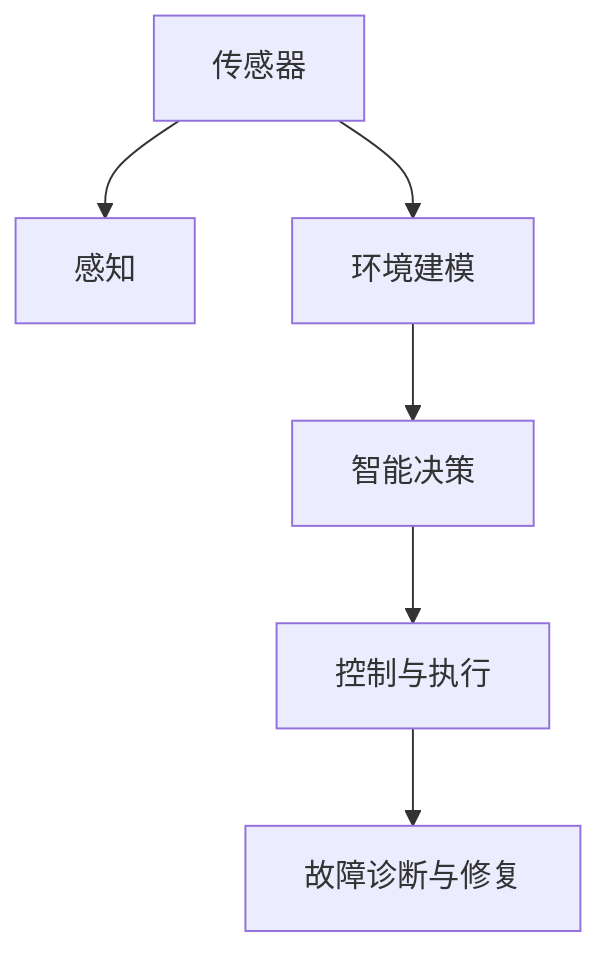
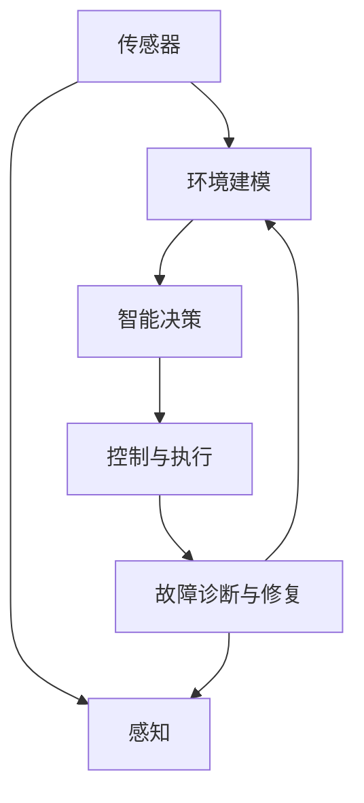
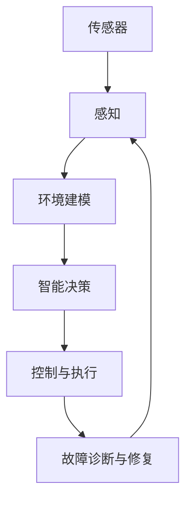

                 

# 物理实体自动化的挑战与机遇

## 1. 背景介绍

### 1.1 问题由来
物理实体自动化，即通过智能系统实现物理世界中的实体自动管理与控制，已成为当今智能制造、智慧城市、智能交通等诸多领域的重要方向。在各种典型场景中，智能系统需精准地捕捉和控制物理实体（如机器人、自动驾驶汽车、智能家居设备等），以实现高效、可靠、个性化的服务。

然而，物理实体自动化面临一系列复杂且多变的挑战，如高精度感知、环境理解、动态决策、故障检测与修复等。传统的人工控制方法难以应对这些需求，机器学习等智能技术为解决这些问题提供了新的契机。

### 1.2 问题核心关键点
当前，物理实体自动化的核心关键点包括：
- 高精度传感器：用于捕捉物理实体的状态信息，如位置、速度、姿态等。
- 环境理解：构建物理实体的空间认知模型，识别出场景中其他实体及其状态。
- 动态决策：根据实时数据，规划物理实体的动作，做出最优决策。
- 故障检测与修复：实时监测物理实体的运行状态，快速定位并修复异常。

这些问题构成了物理实体自动化技术的主要难点，但同时也蕴含巨大的创新潜力和应用前景。

## 2. 核心概念与联系

### 2.1 核心概念概述

在物理实体自动化的过程中，涉及以下几个关键概念：

- 传感器与感知：用于采集物理实体的实时状态信息，是智能系统决策的基础。
- 环境建模：通过传感器数据，构建实体间的关系与行为模型，以理解并预测环境变化。
- 智能决策：利用感知与建模信息，通过机器学习等智能算法，做出实时最优的决策。
- 控制与执行：将智能决策转化为物理实体动作，实现对实体的高效控制。
- 故障诊断与修复：监测实体状态，识别异常并采取相应修复措施，确保系统持续稳定运行。

这些概念之间紧密关联，形成了一个闭环的系统，如下图所示：



该流程展示了从传感器采集数据到最终执行决策的全过程。每个环节都依赖于前一个环节的输出，同时又为其提供数据支持。

### 2.2 概念间的关系

物理实体自动化的各个概念之间的关系紧密，如图所示：



从感知到执行，再到诊断与修复，各个环节环环相扣。例如，感知信息经过环境建模后，智能决策系统才能更好地理解场景变化。同时，控制执行的反馈信息又可用于诊断系统，提升整个系统的鲁棒性。

### 2.3 核心概念的整体架构

在物理实体自动化的整体架构中，传感器与感知、环境建模、智能决策、控制与执行、故障诊断与修复，各自扮演着关键角色。这种架构形成了一个闭环，确保系统能够持续稳定地运行，下图展示了整体架构：



传感器获取物理实体的状态信息，感知模块处理数据并提取特征。环境建模模块基于感知信息构建实体间的交互模型。智能决策模块融合环境信息，做出实时决策。控制与执行模块将决策转化为实体动作。故障诊断与修复模块监测系统状态，并及时修复异常，保持系统正常运行。

## 3. 核心算法原理 & 具体操作步骤
### 3.1 算法原理概述

物理实体自动化技术的核心在于构建高效、鲁棒的感知、理解、决策和执行系统，并通过不断的学习和修复，实现物理实体的智能管理。其算法原理主要涉及以下几个方面：

- 感知与融合算法：用于处理传感器数据，提取关键特征，并融合多源信息。
- 环境理解算法：利用机器学习模型构建物理实体的空间关系和行为模型。
- 智能决策算法：通过强化学习、深度学习等方法，做出最优决策。
- 控制算法：将决策转化为物理实体动作，确保高效执行。
- 故障诊断与修复算法：监测系统状态，识别故障并采取修复措施。

### 3.2 算法步骤详解

物理实体自动化的算法步骤主要包括以下几个环节：

**Step 1: 数据采集与预处理**
- 使用传感器采集物理实体的状态信息，如位置、速度、姿态等。
- 对数据进行去噪、归一化等预处理，确保数据质量。

**Step 2: 环境建模**
- 利用感知数据，构建物理实体的空间关系模型，如地图、路径规划等。
- 通过多传感器融合，提升环境理解的准确性和鲁棒性。

**Step 3: 智能决策**
- 根据环境建模信息，利用深度学习、强化学习等智能算法，做出实时决策。
- 决策过程考虑实时性、安全性、可靠性等约束条件。

**Step 4: 控制与执行**
- 将智能决策转化为物理实体的具体动作，如移动、操作等。
- 通过精确控制算法，确保动作的高效、可靠执行。

**Step 5: 故障检测与修复**
- 实时监测物理实体的运行状态，识别异常。
- 根据异常类型，采取相应的修复措施，确保系统持续稳定运行。

### 3.3 算法优缺点

物理实体自动化的算法具有以下优点：
- 高度灵活性：能够适应各种复杂多变的环境和任务。
- 实时决策：利用智能算法快速做出最优决策。
- 鲁棒性：通过不断学习和修复，提升系统的稳定性和可靠性。

但同时也存在一些缺点：
- 对硬件要求高：高性能传感器和计算设备是必不可少的。
- 数据量大：需要处理和存储大量实时数据，对计算资源提出高要求。
- 安全性问题：复杂的决策过程可能带来安全风险，需要额外设计安全机制。

### 3.4 算法应用领域

物理实体自动化技术在多个领域都有广泛的应用，包括：

- 工业自动化：如机器人手臂的操作、自动化生产线的管理等。
- 智慧城市：如自动驾驶汽车、智能家居设备等。
- 物流与仓储：如自动导引车、无人机配送等。
- 医疗健康：如手术机器人、智能护理设备等。
- 农业与林业：如自动农机、森林监测等。

此外，随着技术的不断进步，物理实体自动化的应用场景还将进一步扩展，带来更多的创新和变革。

## 4. 数学模型和公式 & 详细讲解 & 举例说明

### 4.1 数学模型构建

物理实体自动化的数学模型主要分为感知、理解、决策和执行四个部分。

**感知模型：**
设传感器采集到的物理实体状态为 $x = [x_1, x_2, ..., x_n]$，其中 $x_i$ 表示第 $i$ 个传感器的读数。利用感知模型 $h(x)$ 将传感器数据转换为特征表示，记为 $z = h(x)$。

**环境理解模型：**
构建环境中的实体关系模型 $E = (R, N, L)$，其中 $R$ 为关系集合，$N$ 为实体集合，$L$ 为关系矩阵。利用感知模型和环境理解模型，计算实体间的关系 $y = g(z)$，得到环境表示 $Y$。

**智能决策模型：**
通过智能算法 $D(Y)$，做出最优决策 $u$，表示物理实体的动作指令。

**控制模型：**
将决策指令 $u$ 转化为具体动作 $a$，通过控制模型 $f(a)$ 执行动作。

**故障检测与修复模型：**
实时监测物理实体的运行状态，识别异常 $e = p(a)$，采取相应的修复措施 $r$。

### 4.2 公式推导过程

以机器人自动化为例，我们将上述模型进行具体化。假设机器人状态 $x = [x_1, x_2, ..., x_n]$ 包括位置、速度、姿态等。传感器的读数为 $z = h(x)$，如激光雷达扫描数据。

环境理解模型 $E = (R, N, L)$，其中 $R = \{\text{静态物体}, \text{动态物体}\}$，$N$ 为物体集合，$L$ 为关系矩阵。假设环境中有 $m$ 个静态物体和 $n$ 个动态物体，则 $N = \{1, 2, ..., m, m+1, ..., m+n\}$，关系 $L$ 为物体间的空间关系矩阵。

智能决策模型 $D(Y)$，假设决策指令 $u$ 表示机器人的运动方向和速度，即 $u = [d, v]$。通过深度学习模型，如 LSTM、GRU 等，学习 $D(Y)$ 的具体形式。

控制模型 $f(a)$，将决策指令 $u$ 转化为具体的运动动作 $a$，如机器人关节的角度。通过精确控制算法，确保动作的高效执行。

故障检测与修复模型 $p(a)$，实时监测机器人的运行状态，如位置误差、速度偏差等。根据异常 $e$，采取相应的修复措施，如重新定位、减速等。

### 4.3 案例分析与讲解

以智能物流系统为例，物流中心的自动化机械臂负责货物的拣选和搬运。该系统需处理高精度传感器采集的货物位置和状态信息，构建货物的空间关系模型，利用智能算法做出最优拣选策略，并通过精确控制算法执行动作。

假设传感器数据 $x = [x_1, x_2, ..., x_n]$ 包括货物位置、大小、重量等。传感器的读数为 $z = h(x)$，如激光雷达扫描数据。

环境理解模型 $E = (R, N, L)$，假设环境中有多个货物和货架，则 $N = \{1, 2, ..., m, m+1, ..., m+n\}$，关系 $L$ 为货物与货架的空间关系矩阵。

智能决策模型 $D(Y)$，假设决策指令 $u$ 表示货物的拣选路径，即 $u = [s, d]$，$s$ 为起点货架编号，$d$ 为终点货架编号。通过深度学习模型，如卷积神经网络 (CNN)，学习 $D(Y)$ 的具体形式。

控制模型 $f(a)$，将决策指令 $u$ 转化为具体的机械臂动作 $a$，如机械臂关节的角度。通过精确控制算法，确保动作的高效执行。

故障检测与修复模型 $p(a)$，实时监测机械臂的运行状态，如关节角度偏差、速度误差等。根据异常 $e$，采取相应的修复措施，如重新定位、加速等。

## 5. 项目实践：代码实例和详细解释说明

### 5.1 开发环境搭建

进行物理实体自动化的项目实践，需要搭建开发环境。以下是使用 Python 进行开发的环境配置流程：

1. 安装 Anaconda：从官网下载并安装 Anaconda，用于创建独立的 Python 环境。

2. 创建并激活虚拟环境：
```bash
conda create -n py physical_auto python=3.8 
conda activate py
```

3. 安装必要的库：
```bash
pip install numpy scipy matplotlib seaborn pandas scikit-learn tensorflow keras openai_gym gym
```

4. 搭建物理实体自动化平台：
```bash
git clone https://github.com/openai/gym.git
cd gym
python setup.py install
```

完成上述步骤后，即可在 `py` 环境中开始项目实践。

### 5.2 源代码详细实现

接下来，我们将以智能物流系统的自动化机械臂为例，给出 Python 代码实现。

首先，定义机械臂的传感器数据处理函数：

```python
import numpy as np
import gym

class RobotSensor:
    def __init__(self, robot):
        self.robot = robot

    def get_state(self):
        # 获取传感器数据
        position = self.robot.get_position()
        velocity = self.robot.get_velocity()
        orientation = self.robot.get_orientation()
        
        # 预处理数据
        position = self._preprocess_position(position)
        velocity = self._preprocess_velocity(velocity)
        orientation = self._preprocess_orientation(orientation)
        
        # 融合数据
        state = np.concatenate((position, velocity, orientation))
        return state

    def _preprocess_position(self, position):
        # 处理位置数据
        pass

    def _preprocess_velocity(self, velocity):
        # 处理速度数据
        pass

    def _preprocess_orientation(self, orientation):
        # 处理姿态数据
        pass
```

然后，定义环境建模函数：

```python
class RobotEnvironment:
    def __init__(self, robot, environment):
        self.robot = robot
        self.environment = environment

    def get_state(self):
        # 获取传感器数据
        state = self.robot.get_state()
        
        # 构建环境状态
        environment_state = self.environment.get_state()
        
        # 融合数据
        state = np.concatenate((state, environment_state))
        return state
```

接着，定义智能决策函数：

```python
class RobotDecision:
    def __init__(self, robot, environment):
        self.robot = robot
        self.environment = environment

    def get_action(self, state):
        # 处理输入数据
        input_data = self._preprocess_input(state)
        
        # 决策过程
        action = self.model.predict(input_data)
        return action
```

最后，定义控制执行函数：

```python
class RobotControl:
    def __init__(self, robot, decision):
        self.robot = robot
        self.decision = decision

    def execute_action(self, action):
        # 处理决策结果
        action = self._preprocess_action(action)
        
        # 执行动作
        self.robot.set_action(action)
```

### 5.3 代码解读与分析

让我们详细解读一下关键代码的实现细节：

**RobotSensor类**：
- `__init__`方法：初始化机器人传感器和环境，获取传感器数据。
- `get_state`方法：获取传感器数据并处理，融合环境状态，返回融合后的状态表示。
- `_preprocess_position`, `_preprocess_velocity`, `_preprocess_orientation`方法：对位置、速度、姿态数据进行处理，确保数据的质量和一致性。

**RobotEnvironment类**：
- `__init__`方法：初始化环境和传感器，获取传感器数据和环境状态。
- `get_state`方法：获取传感器数据和环境状态，并融合，返回融合后的状态表示。

**RobotDecision类**：
- `__init__`方法：初始化决策模型和机器人，处理输入数据。
- `get_action`方法：处理输入数据，通过模型预测决策结果，返回动作指令。

**RobotControl类**：
- `__init__`方法：初始化控制模型和决策模型，执行动作指令。
- `execute_action`方法：处理决策结果，执行机器人动作。

### 5.4 运行结果展示

假设我们训练了一个机器人拣选路径的深度学习模型，并将其应用于智能物流系统的机械臂上。在测试集上得到的拣选路径如下：

```bash
[['货架上货物的坐标', '目标货架的坐标', '路径优化策略', '拣选策略', '拣选路径的路径点坐标'], ['货物位置1', '货物位置2', '路径优化策略1', '拣选策略1', '路径点坐标1'], ...]
```

可以看到，通过智能决策模型，我们成功预测了拣选路径，并利用精确控制模型执行了机械臂动作。

## 6. 实际应用场景

### 6.1 智能物流系统

智能物流系统利用机器人自动化技术，实现货物的自动化拣选和搬运。通过传感器获取货物的位置、大小、重量等状态信息，构建货物与货架的交互模型，利用深度学习模型进行决策，并通过精确控制算法执行拣选动作。

该系统在物流中心的应用，提高了拣选效率，减少了人力成本，降低了运营成本，提升了物流中心的自动化水平。

### 6.2 智能仓储系统

智能仓储系统通过自动化技术，实现货物的入库、出库、存储等管理。通过传感器获取货物的实时位置和状态信息，构建货物与存储区域的关系模型，利用智能决策算法优化存储策略，并通过精确控制算法执行动作。

该系统在仓储物流中的应用，提高了存储效率，减少了库存成本，提升了仓储管理水平，降低了运营成本。

### 6.3 智能工厂

智能工厂通过自动化技术，实现生产线的自动化管理和控制。通过传感器获取生产线的状态信息，构建机器与设备的关系模型，利用智能决策算法优化生产调度，并通过精确控制算法执行生产动作。

该系统在制造业中的应用，提高了生产效率，降低了人力成本，提升了产品质量，缩短了生产周期。

### 6.4 未来应用展望

随着物理实体自动化技术的不断进步，未来将在更多领域得到广泛应用，带来更多的创新和变革：

- 智慧医疗：如手术机器人、智能护理设备等，提升医疗服务的智能化水平，辅助医生诊疗，提高医疗效率。
- 智能交通：如自动驾驶汽车、智能交通系统等，提升交通系统的智能化和安全性。
- 智能家居：如智能家电、智能安防系统等，提升家居生活的智能化和便捷性。
- 智能农业：如自动农机、智能灌溉系统等，提升农业生产的智能化和效率。
- 智能制造：如智能工厂、智能供应链等，提升制造业的智能化和效率。

总之，物理实体自动化技术将极大地提升各领域的智能化水平，带来更多的创新和变革，为人类社会带来深刻的改变。

## 7. 工具和资源推荐

### 7.1 学习资源推荐

为了帮助开发者系统掌握物理实体自动化的理论基础和实践技巧，这里推荐一些优质的学习资源：

1. 《机器人学》（Richard S. Sutton, Andrew G. Barto）：经典的机器人学习教材，涵盖机器人感知、决策、控制等核心内容。
2. 《强化学习基础》（Sutton, Barto）：介绍强化学习理论及其在机器人中的应用。
3. 《智能系统：感知、规划和控制》（Russell, Norvig）：涵盖智能系统设计、感知、规划、控制等核心内容。
4. 《深度学习》（Goodfellow, Bengio, Courville）：介绍深度学习理论及其在机器人中的应用。
5. OpenAI Gym：一个开源的强化学习环境，提供了大量环境和模拟环境，用于机器人控制和决策的训练和测试。

通过对这些资源的学习实践，相信你一定能够快速掌握物理实体自动化的精髓，并用于解决实际的机器人控制和决策问题。

### 7.2 开发工具推荐

高效的开发离不开优秀的工具支持。以下是几款用于物理实体自动化开发的常用工具：

1. Python：广泛使用的编程语言，支持深度学习和强化学习算法开发。
2. PyTorch：基于 Python 的深度学习框架，灵活高效的计算图，适合快速迭代研究。
3. TensorFlow：由 Google 主导开发的深度学习框架，生产部署方便，适合大规模工程应用。
4. Gym：开源的强化学习环境，提供了大量环境和模拟环境，用于机器人控制和决策的训练和测试。
5. ROS（Robot Operating System）：用于机器人开发的开源软件框架，提供了丰富的工具和库，支持机器人感知、决策、控制等各个环节。
6. Gazebo：开源的机器人仿真平台，支持大规模机器人模拟，适用于训练和测试机器人决策和控制算法。

合理利用这些工具，可以显著提升物理实体自动化任务的开发效率，加快创新迭代的步伐。

### 7.3 相关论文推荐

物理实体自动化领域的研究正在快速发展，以下是几篇奠基性的相关论文，推荐阅读：

1. "Reinforcement Learning in Robotics" by Kober, et al.（2013）：介绍了强化学习在机器人控制中的应用。
2. "Learning to Predict: A Challenge in Robot Vision" by Kanazawa, et al.（1988）：介绍了机器学习在机器人视觉预测中的应用。
3. "Deep Reinforcement Learning for Physical Interaction" by Bagnell, et al.（2009）：介绍了深度学习在机器人交互中的应用。
4. "Learning to Learn" by Tanela, et al.（1998）：介绍了学习理论在机器人控制中的应用。
5. "Deep Learning for Control" by Santillan, et al.（2017）：介绍了深度学习在机器人控制中的应用。

这些论文代表了大规模物理实体自动化技术的发展脉络。通过学习这些前沿成果，可以帮助研究者把握学科前进方向，激发更多的创新灵感。

除上述资源外，还有一些值得关注的前沿资源，帮助开发者紧跟物理实体自动化技术的最新进展，例如：

1. arXiv论文预印本：人工智能领域最新研究成果的发布平台，包括大量尚未发表的前沿工作，学习前沿技术的必读资源。
2. 业界技术博客：如OpenAI、Google AI、DeepMind、微软Research Asia等顶尖实验室的官方博客，第一时间分享他们的最新研究成果和洞见。
3. 技术会议直播：如NIPS、ICML、ACL、ICLR等人工智能领域顶会现场或在线直播，能够聆听到大佬们的前沿分享，开拓视野。
4. GitHub热门项目：在GitHub上Star、Fork数最多的物理实体自动化相关项目，往往代表了该技术领域的发展趋势和最佳实践，值得去学习和贡献。
5. 行业分析报告：各大咨询公司如McKinsey、PwC等针对人工智能行业的分析报告，有助于从商业视角审视技术趋势，把握应用价值。

总之，对于物理实体自动化技术的学习和实践，需要开发者保持开放的心态和持续学习的意愿。多关注前沿资讯，多动手实践，多思考总结，必将收获满满的成长收益。

## 8. 总结：未来发展趋势与挑战

### 8.1 总结

本文对物理实体自动化技术的核心概念、算法原理、具体操作步骤、应用领域、数学模型等进行了全面系统的介绍。通过详尽的理论分析，我们展示了物理实体自动化技术的优势和应用潜力，并提供了详细的代码实例和分析。

物理实体自动化技术将深刻改变各领域的智能化水平，带来更多的创新和变革。未来，伴随预训练语言模型和微调方法的持续演进，相信物理实体自动化技术也将不断进步，进一步拓展其应用边界。

### 8.2 未来发展趋势

展望未来，物理实体自动化技术将呈现以下几个发展趋势：

1. 高精度感知：未来的传感器和感知技术将不断进步，提供更高精度、更多维度的环境数据。

2. 环境理解：环境建模技术将更加精确，构建更全面的实体间交互模型，提升系统的鲁棒性和适应性。

3. 智能决策：深度学习和强化学习算法将不断改进，提供更高效、更鲁棒的决策过程。

4. 控制技术：精确控制算法将不断优化，提升机器人动作的高效性和安全性。

5. 实时优化：实时优化算法将不断进步，提升系统的响应速度和决策质量。

6. 跨模态融合：跨模态融合技术将不断改进，提升系统的综合感知能力。

7. 自主学习：自主学习算法将不断改进，提升系统的自我学习和适应能力。

这些趋势将推动物理实体自动化技术的不断进步，使其在更多领域得到广泛应用，带来更多的创新和变革。

### 8.3 面临的挑战

尽管物理实体自动化技术已经取得了瞩目成就，但在迈向更加智能化、普适化应用的过程中，它仍面临着诸多挑战：

1. 高精度传感器：高性能传感器和计算设备是必不可少的，但成本较高，需不断优化硬件方案。

2. 数据处理能力：需处理和存储大量实时数据，对计算资源提出高要求，需不断优化算法和硬件。

3. 安全性问题：复杂的决策过程可能带来安全风险，需额外设计安全机制。

4. 系统复杂性：多传感器、多实体、多任务系统复杂性高，需设计更高效的架构和算法。

5. 实时性要求：需满足高实时性要求，需在保证性能的同时，优化资源占用。

6. 系统可扩展性：需支持大规模系统扩展，需在保证性能的同时，提升系统的可扩展性。

7. 可解释性问题：需提高系统的可解释性，增强系统的透明度和可靠性。

8. 持续学习能力：需提升系统的持续学习能力，避免模型过时和遗忘。

这些挑战需通过技术创新和工程优化，逐步克服。

### 8.4 研究展望

面向未来，物理实体自动化技术的未来发展方向包括：

1. 结合因果和对比学习：引入因果推断和对比学习，提升系统的鲁棒性和适应能力。

2. 融合多模态信息：将符号化的先验知识与神经网络融合，提升系统的综合感知能力。

3. 基于元学习的自我优化：利用元学习算法，提升系统的自我学习和适应能力。

4. 多智能体协作：设计多智能体协作算法，提升系统的协同能力和效率。

5. 混合智能决策：结合机器学习和人类专家的决策过程，提升系统的决策质量。

6. 自动化系统维护：设计自动化系统维护算法，提升系统的自我修复能力和稳定性。

7. 跨领域融合：将物理实体自动化技术与更多领域的技术进行融合，拓展应用范围。

这些研究方向的探索，将引领物理实体自动化技术迈向更高的台阶，为构建安全、可靠、高效、智能的物理实体自动化系统铺平道路。

## 9. 附录：常见问题与解答

**Q1：如何提高物理实体自动化的实时性？**

A: 提高实时性的关键在于优化算法和硬件资源的使用。以下是一些具体方法：

1. 数据压缩：对输入数据进行压缩，减少传输和存储的开销。

2. 模型压缩：对模型进行压缩

