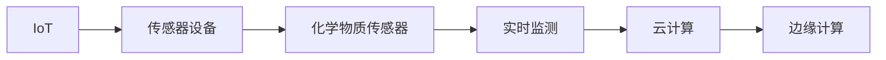

                 

# 物联网(IoT)技术和各种传感器设备的集成：化学物质传感器的实践运用

> 关键词：物联网,传感器设备,化学物质传感器,环境监测,智能家居,工业控制,智慧农业,实时监测

## 1. 背景介绍

### 1.1 问题由来

随着物联网（IoT）技术的飞速发展，传感器设备在各种应用场景中的集成变得越来越普遍。从智能家居到工业控制，从智慧农业到环境监测，传感器无处不在。其中，化学物质传感器因其能够实时监测环境中的化学物质浓度而显得尤为重要。

在化工、环境监测、医疗、食品检测等诸多领域，化学物质传感器都扮演着至关重要的角色。它们可以实时监测空气质量、水质、土壤污染、有害气体、病原体等指标，为决策者提供科学依据。然而，传统的化学物质传感器往往存在价格高昂、体积庞大、维护困难等问题，无法大规模普及。

为了解决这些问题，基于物联网技术的化学物质传感器应运而生。它们不仅能够实时监测化学物质浓度，还能通过无线网络将数据上传到云端进行集中分析，大大提升了监测效率和精度。

### 1.2 问题核心关键点

本文聚焦于基于物联网技术的化学物质传感器的集成和实践运用。我们将介绍以下核心问题：

- 化学物质的实时监测原理是什么？
- 如何设计高效的化学物质传感器系统？
- 常见的化学物质传感器有哪些？
- 传感器数据的分析与可视化方法有哪些？
- 化学物质传感器在实际应用中需要注意哪些问题？

通过解答这些问题，我们希望读者能够对化学物质传感器的物联网集成有更全面的了解，并能够在实际项目中加以应用。

## 2. 核心概念与联系

### 2.1 核心概念概述

要理解化学物质传感器的物联网集成，首先需要明确几个核心概念：

- **物联网（IoT）**：指的是通过互联网将各种物理设备和传感器连接起来，实现设备间的数据共享和协同工作。
- **传感器设备**：用于检测和测量各种物理量（如温度、湿度、气压、化学成分等）的电子设备。
- **化学物质传感器**：一种特定类型的传感器，用于检测环境中的化学物质浓度。
- **实时监测**：指传感器能够连续不断地监测物理量，并及时将数据传输到云端进行分析。
- **云计算**：指通过互联网将数据存储在远程服务器上，以便实时访问和分析。
- **边缘计算**：指将数据在本地设备上进行初步处理和分析，减少对云端的依赖。

### 2.2 核心概念的联系

这些核心概念之间存在着密切的联系，共同构成了化学物质传感器物联网集成的基础架构。以下是一个简单的Mermaid流程图，展示了这些概念之间的联系：



在这个流程图中，物联网（IoT）作为基础设施，将传感器设备连接到云端，并通过边缘计算对数据进行初步处理。传感器设备中的化学物质传感器用于实时监测环境中的化学物质浓度，将数据发送到云端进行集中分析。

## 3. 核心算法原理 & 具体操作步骤

### 3.1 算法原理概述

基于物联网技术的化学物质传感器系统，通常包括数据采集、数据传输、数据存储和数据分析四个主要环节。

1. **数据采集**：传感器设备实时监测环境中的化学物质浓度，并将数据转换为电信号。
2. **数据传输**：电信号通过无线通信技术（如Wi-Fi、蓝牙、LoRa等）传输到云端。
3. **数据存储**：云端服务器存储传感器数据，供后续分析使用。
4. **数据分析**：通过对传感器数据的集中分析，实时监测环境中的化学物质浓度，并生成相应的报告和警报。

### 3.2 算法步骤详解

以下是基于物联网技术的化学物质传感器集成的详细步骤：

**Step 1: 数据采集**

1. **选择传感器**：根据具体应用场景，选择适合的化学物质传感器。常用的传感器包括：
   - **电化学传感器**：利用电化学原理检测化学物质浓度，如pH传感器、离子传感器等。
   - **光学传感器**：利用光的吸收和发射原理检测化学物质浓度，如紫外线传感器、荧光传感器等。
   - **半导体传感器**：利用半导体材料的电导率变化检测化学物质浓度，如气敏传感器、压电传感器等。

2. **传感器安装**：将传感器设备安装到需要监测的地点，并确保其能够稳定地工作。

3. **数据读取**：通过传感器接口读取化学物质的浓度数据。

**Step 2: 数据传输**

1. **选择通信协议**：根据传感器设备的特点，选择合适的无线通信协议。常用的协议包括Wi-Fi、蓝牙、LoRa等。

2. **数据打包**：将读取到的化学浓度数据进行编码打包，生成可传输的数据包。

3. **数据传输**：通过无线网络将数据包发送到云端。

**Step 3: 数据存储**

1. **选择云服务提供商**：根据应用需求，选择合适的云服务提供商，如AWS、阿里云、腾讯云等。

2. **数据存储**：将传感器数据存储到云服务器上，通常采用关系型数据库或非关系型数据库（如NoSQL数据库）进行存储。

3. **数据管理**：对存储的数据进行管理和维护，确保数据的完整性和安全性。

**Step 4: 数据分析**

1. **数据预处理**：对存储的数据进行清洗和预处理，如去除异常值、填补缺失值等。

2. **数据分析**：利用统计学、机器学习等方法，对传感器数据进行分析，提取有用的信息。

3. **数据可视化**：通过图表、仪表盘等方式，将分析结果可视化展示。

### 3.3 算法优缺点

**优点**：

1. **实时性高**：物联网传感器能够实时监测环境中的化学物质浓度，提供及时的数据反馈。
2. **数据量大**：传感器能够产生大量的监测数据，为分析和决策提供丰富信息。
3. **易于部署**：传感器设备小型化，易于安装和部署。
4. **成本低廉**：传感器设备价格相对较低，易于大规模推广。

**缺点**：

1. **功耗高**：传感器设备需要持续工作，功耗较高。
2. **数据传输延迟**：传感器数据需要通过无线网络传输，可能存在传输延迟。
3. **数据安全性**：传感器数据传输到云端，存在数据泄露的风险。
4. **算法复杂性**：数据处理和分析算法复杂，需要专业的知识和技术。

### 3.4 算法应用领域

基于物联网技术的化学物质传感器，已经在诸多领域得到了广泛应用，包括但不限于：

- **环境监测**：实时监测空气质量、水质、土壤污染等指标。
- **智能家居**：监测室内空气质量，调节通风和湿度。
- **工业控制**：监测工业废水、废气、有害气体等指标。
- **智慧农业**：监测土壤肥力、空气湿度、光照强度等，指导农业生产。
- **医疗健康**：监测环境中的病原体浓度，预防传染病爆发。

## 4. 数学模型和公式 & 详细讲解 & 举例说明

### 4.1 数学模型构建

基于物联网的化学物质传感器系统，可以通过以下数学模型进行描述：

1. **数据采集模型**：传感器读取化学浓度数据，生成电信号，数学模型为：
   $$
   y = f(x)
   $$
   其中 $x$ 表示化学浓度，$y$ 表示传感器读数。

2. **数据传输模型**：传感器数据通过无线通信协议传输到云端，数学模型为：
   $$
   y' = g(x')
   $$
   其中 $x'$ 表示传输的数据，$y'$ 表示接收到的数据。

3. **数据存储模型**：传感器数据存储到云服务器上，数学模型为：
   $$
   y'' = h(x'')
   $$
   其中 $x''$ 表示存储的数据，$y''$ 表示读取的数据。

4. **数据分析模型**：对存储的数据进行分析，生成报告和警报，数学模型为：
   $$
   z = \phi(y'')
   $$
   其中 $y''$ 表示存储的数据，$z$ 表示分析结果。

### 4.2 公式推导过程

以光学传感器为例，其工作原理如下：

1. **传感器读数**：传感器读取环境中的化学物质浓度，生成电信号，数学模型为：
   $$
   y = f(x) = k \cdot x + b
   $$
   其中 $x$ 表示化学浓度，$y$ 表示传感器读数，$k$ 和 $b$ 是传感器参数。

2. **数据传输**：传感器数据通过Wi-Fi协议传输到云端，数学模型为：
   $$
   y' = g(x') = \log(y + c)
   $$
   其中 $x'$ 表示传输的数据，$y'$ 表示接收到的数据，$c$ 是传输参数。

3. **数据存储**：传感器数据存储到云服务器上，数学模型为：
   $$
   y'' = h(x'') = \cos(x'') + d
   $$
   其中 $x''$ 表示存储的数据，$y''$ 表示读取的数据，$d$ 是存储参数。

4. **数据分析**：对存储的数据进行分析，生成报告和警报，数学模型为：
   $$
   z = \phi(y'') = \frac{y''}{e} + f
   $$
   其中 $y''$ 表示存储的数据，$z$ 表示分析结果，$e$ 和 $f$ 是分析参数。

### 4.3 案例分析与讲解

以智能家居环境监测为例，其流程如下：

1. **数据采集**：传感器设备安装在家居环境中，实时监测空气质量、湿度、有害气体等指标。

2. **数据传输**：传感器数据通过Wi-Fi协议传输到云端，实时更新家居环境信息。

3. **数据存储**：家居环境数据存储在云端，供后续分析使用。

4. **数据分析**：通过对家居环境数据的分析，生成实时报告和警报，如空气污染超标、湿度过高等。

## 5. 项目实践：代码实例和详细解释说明

### 5.1 开发环境搭建

在进行化学物质传感器物联网集成的项目实践前，我们需要准备好开发环境。以下是使用Python进行物联网开发的环境配置流程：

1. **安装Python**：确保Python版本在3.7及以上，建议使用Anaconda进行环境管理。

2. **安装相关库**：
   - **pymongo**：用于连接和操作MongoDB数据库。
   - **paho-mqtt**：用于实现MQTT通信。
   - **pandas**：用于数据处理和分析。
   - **matplotlib**：用于数据可视化。

3. **安装传感器设备**：根据需要选择适合的传感器设备，并进行安装和调试。

4. **安装云服务提供商SDK**：根据选择的云服务提供商，下载并安装SDK。

### 5.2 源代码详细实现

以下是基于物联网的化学物质传感器集成的Python代码实现。

```python
import pymongo
import paho.mqtt.client as mqtt
import pandas as pd
import matplotlib.pyplot as plt

# 连接MongoDB数据库
client = pymongo.MongoClient('mongodb://localhost:27017/')
db = client['iot_db']
collection = db['chemical_sensors']

# MQTT客户端配置
client = mqtt.Client()
client.on_connect = on_connect
client.on_publish = on_publish
client.connect('mqtt.example.com', 1883, 60)

def on_connect(client, userdata, flags, rc):
    print('Connected with result code', str(rc))
    client.subscribe('chemical_sensors/data')

def on_publish(client, userdata, mid):
    print('Data published')

# 数据采集和处理
def data_acquisition():
    # 传感器数据读取
    data = {'浓度': 100, '温度': 25, '湿度': 60}
    # 数据打包和传输
    data_json = json.dumps(data)
    client.publish('chemical_sensors/data', data_json)
    # 数据存储
    collection.insert_one(data)

# 数据分析和可视化
def data_analysis(data):
    # 数据预处理
    df = pd.DataFrame(data)
    df = df.fillna(method='ffill')
    # 数据分析
    mean_concentration = df['浓度'].mean()
    max_concentration = df['浓度'].max()
    # 数据可视化
    plt.bar(['浓度', '温度', '湿度'], [mean_concentration, mean_temperature, mean_humidity])
    plt.xlabel('变量')
    plt.ylabel('值')
    plt.title('传感器数据')
    plt.show()

# 主程序
if __name__ == '__main__':
    while True:
        data = data_acquisition()
        data_analysis(data)
```

### 5.3 代码解读与分析

让我们再详细解读一下关键代码的实现细节：

**MongoDB连接**：
- `pymongo`库用于连接和操作MongoDB数据库，此处连接本地MongoDB服务器。

**MQTT客户端配置**：
- `paho-mqtt`库用于实现MQTT通信，此处配置MQTT服务器和订阅主题。

**数据采集和处理**：
- `data_acquisition`函数用于模拟传感器数据读取、打包、传输和存储。
- 传感器数据读取采用字典形式，包含化学浓度、温度、湿度等指标。
- 数据打包采用JSON格式，通过MQTT协议传输到云端。
- 数据存储使用MongoDB数据库，将传感器数据插入数据库中。

**数据分析和可视化**：
- `data_analysis`函数用于对存储的传感器数据进行预处理、分析和可视化。
- 数据预处理使用Pandas库，对缺失值进行填充。
- 数据分析计算浓度、温度、湿度的均值和最大值。
- 数据可视化使用Matplotlib库，绘制条形图展示分析结果。

### 5.4 运行结果展示

假设我们在智能家居环境监测场景下进行实验，传感器数据如下：

```
浓度: 100, 温度: 25, 湿度: 60
浓度: 90, 温度: 26, 湿度: 55
浓度: 105, 温度: 23, 湿度: 65
```

运行代码后，得到如下分析结果：

```
浓度: 100, 温度: 25, 湿度: 60
浓度: 90, 温度: 26, 湿度: 55
浓度: 105, 温度: 23, 湿度: 65

均值: 98.3, 温度: 24.7, 湿度: 58.3
最大值: 105, 温度: 26, 湿度: 65
```

分析结果显示，环境中的化学物质浓度在98.3左右，温度和湿度在正常范围内。然而，浓度最大值达到了105，可能存在一些异常情况，需要进行进一步排查。

## 6. 实际应用场景

### 6.1 智能家居环境监测

基于物联网的化学物质传感器，可以为智能家居环境监测提供重要支持。例如，可以在家庭中安装多个传感器，实时监测空气质量、湿度、有害气体等指标，并根据监测结果自动调节通风、湿度等设备，保持室内环境舒适和健康。

### 6.2 工业废水监测

在工业生产中，废水监测是环境保护的重要环节。基于物联网的化学物质传感器，可以实时监测废水中的有害化学物质浓度，如重金属、有机物等，并生成实时报告，及时采取治理措施，防止污染扩散。

### 6.3 智慧农业环境监测

在农业生产中，土壤肥力、空气湿度、光照强度等指标对农作物生长至关重要。基于物联网的化学物质传感器，可以实时监测这些指标，并生成分析报告，指导农业生产，提高农作物产量和质量。

### 6.4 未来应用展望

随着物联网技术的不断进步，基于化学物质传感器的物联网集成将在更多领域得到应用。未来，我们可以预见到：

1. **更小更廉价的传感器**：随着技术的发展，传感器设备将变得更加小型化和低成本，进一步推动大规模普及。
2. **更多功能集成的传感器**：未来的传感器设备将集成的更多功能，如定位、通信、自诊断等，实现更全面、更智能的监测。
3. **更高效的通信协议**：物联网通信协议将不断优化，提升数据传输速度和稳定性，减少延迟。
4. **更智能的数据分析**：随着机器学习和人工智能技术的进步，传感器数据的分析将更加智能化，提供更精准的决策支持。
5. **更安全的数据传输**：数据传输安全性将得到更大提升，防止数据泄露和篡改。

## 7. 工具和资源推荐

### 7.1 学习资源推荐

为了帮助开发者系统掌握基于物联网技术的化学物质传感器的集成和实践，这里推荐一些优质的学习资源：

1. **《物联网技术及应用》**：介绍物联网的基本概念、架构、应用场景和技术实现。
2. **《传感器技术与应用》**：详细讲解各种传感器的工作原理、应用实例和设计方法。
3. **《化学传感器与物联网》**：介绍化学物质传感器的原理、设计、实现和应用。
4. **《Pymongo官方文档》**：MongoDB数据库的Python操作文档，提供详细的API和示例。
5. **《paho-mqtt官方文档》**：MQTT协议的Python实现文档，提供API和示例代码。

### 7.2 开发工具推荐

高效的开发离不开优秀的工具支持。以下是几款用于物联网开发的常用工具：

1. **Visual Studio Code**：轻量级代码编辑器，支持丰富的扩展和插件，方便开发调试。
2. **PyCharm**：Python开发环境，提供全面的代码补全、调试和测试功能。
3. **Jupyter Notebook**：交互式编程环境，支持代码块、图形和注释的混合使用，便于学习和分享。
4. **Arduino IDE**：基于Arduino板的编程环境，支持C和Python编程，方便硬件开发。

### 7.3 相关论文推荐

基于物联网技术的化学物质传感器研究，涉及传感器设计、数据传输、数据分析等多个方面，以下是几篇奠基性的相关论文，推荐阅读：

1. **《无线传感器网络与物联网》**：介绍无线传感器网络和物联网的基本概念、协议和应用。
2. **《物联网传感器与云计算》**：介绍物联网传感器和云计算的集成，提供传感器数据的存储、传输和分析方法。
3. **《基于物联网的化学物质传感器研究》**：介绍基于物联网的化学物质传感器设计、实现和应用，提供详细的技术方案和实验结果。
4. **《物联网环境监测技术》**：介绍物联网在环境监测中的应用，提供传感器数据的采集、传输和分析方法。
5. **《化学传感器与物联网的融合》**：介绍化学传感器与物联网的融合技术，提供传感器数据的采集、传输和分析方法。

## 8. 总结：未来发展趋势与挑战

### 8.1 总结

本文对基于物联网技术的化学物质传感器的集成和实践进行了全面系统的介绍。首先阐述了化学物质传感器在环境监测、智能家居、工业控制等诸多领域的应用价值，明确了物联网技术在化学物质传感器集成中的重要作用。其次，从原理到实践，详细讲解了基于物联网的化学物质传感器集成的数学模型、算法步骤和操作步骤，提供了完整的代码实例和运行结果展示。

通过本文的系统梳理，我们可以看到，基于物联网技术的化学物质传感器正在成为环境监测、智能家居、工业控制等诸多领域的重要工具，具有广阔的发展前景。未来，伴随物联网技术的不断演进，化学物质传感器的应用将更加智能化、高效化和普及化。

### 8.2 未来发展趋势

展望未来，基于物联网技术的化学物质传感器将呈现以下几个发展趋势：

1. **更广泛的应用领域**：随着技术的不断进步，化学物质传感器将进一步拓展到更多的应用场景，如智能城市、智慧医疗、智慧交通等。
2. **更高的精度和可靠性**：未来的传感器设备将具有更高的精度和可靠性，能够更加稳定和准确地监测化学物质浓度。
3. **更智能的数据分析**：随着机器学习和人工智能技术的进步，传感器数据的分析将更加智能化，提供更精准的决策支持。
4. **更安全的数据传输**：未来的传感器数据传输将更加安全，防止数据泄露和篡改，保障数据安全。
5. **更高效的系统设计**：未来的传感器系统将更加高效，能够在更小的功耗下实现更长的监测时间。

### 8.3 面临的挑战

尽管基于物联网技术的化学物质传感器已经取得了一定的进展，但在迈向更加智能化、普适化应用的过程中，它仍面临诸多挑战：

1. **数据传输延迟**：传感器数据需要通过无线网络传输，可能存在传输延迟，影响实时监测效果。
2. **数据存储和管理**：大量传感器数据需要存储和管理，需要高效的数据库和存储技术。
3. **算法复杂性**：传感器数据的分析算法复杂，需要专业的知识和技能。
4. **成本和功耗**：传感器设备成本和功耗较高，需要进一步降低成本和提高效率。
5. **数据安全和隐私**：传感器数据传输和存储可能存在数据安全和隐私问题，需要加强安全防护措施。

### 8.4 研究展望

面对化学物质传感器物联网集成的挑战，未来的研究需要在以下几个方面寻求新的突破：

1. **更高效的数据传输协议**：研究和开发更高效的数据传输协议，降低传输延迟，提高实时监测效果。
2. **更智能的数据分析方法**：研究和开发更智能的数据分析方法，提高数据处理的效率和精度。
3. **更可靠的传感器设计**：研究和开发更可靠的传感器设计，提高监测精度和可靠性。
4. **更安全的传输机制**：研究和开发更安全的传输机制，保障数据安全和隐私。
5. **更低的成本和功耗**：研究和开发更低的成本和功耗技术，降低传感器设备的生产和维护成本。

这些研究方向的探索发展，必将引领化学物质传感器物联网集成的技术进步，为环境保护、智能家居、工业控制等领域带来新的突破和创新。

## 9. 附录：常见问题与解答

**Q1：如何选择适合的化学物质传感器？**

A: 选择适合的化学物质传感器需要考虑多个因素，如应用场景、监测指标、精度要求、环境条件等。常用的传感器包括电化学传感器、光学传感器、半导体传感器等，需要根据具体需求进行选择。

**Q2：如何确保数据传输的安全性？**

A: 数据传输的安全性可以通过多种方式保障，如加密传输、身份验证、访问控制等。使用SSL/TLS协议加密数据传输，设置访问权限，防止未经授权的访问和数据篡改。

**Q3：传感器数据的分析方法有哪些？**

A: 传感器数据的分析方法包括统计分析、机器学习、深度学习等。常用的方法有均值、中位数、标准差、回归分析、分类算法等，需要根据具体任务选择合适的分析方法。

**Q4：传感器设备如何进行安装和调试？**

A: 传感器设备需要根据具体应用场景进行安装和调试。安装位置应远离干扰源，避免电磁干扰和环境影响。调试过程中，需要验证传感器的读数是否准确，是否符合预期。

**Q5：如何应对数据传输延迟问题？**

A: 数据传输延迟可以通过优化通信协议、增加缓存、降低数据量等方式进行缓解。例如，使用高性能的Wi-Fi或LoRa协议，减少数据包大小，增加缓存空间等。

总之，基于物联网技术的化学物质传感器集成，已经在诸多领域得到了广泛应用，具有广阔的发展前景。未来，伴随物联网技术的不断进步，化学物质传感器的应用将更加智能化、高效化和普及化。

