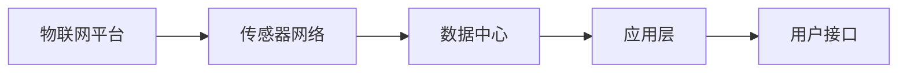
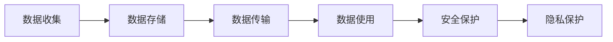
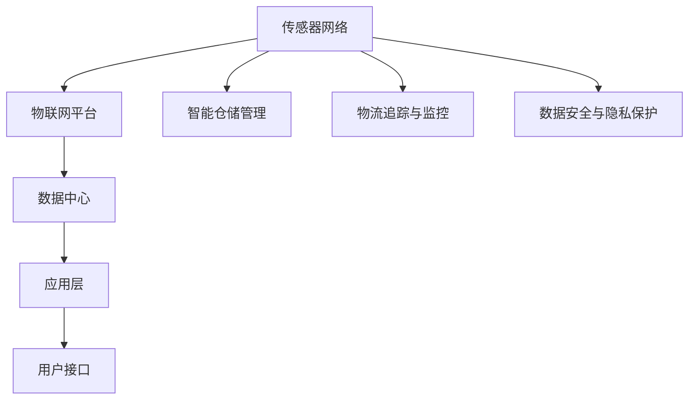

                 

# 物联网(IoT)技术和各种传感器设备的集成：物联网在仓储物流中的应用

> 关键词：物联网(IoT)技术,传感器设备,仓储物流,智能仓储,物联网安全

## 1. 背景介绍

### 1.1 问题由来
随着全球供应链的日益复杂化，仓储物流成为产业链中不可或缺的一环。传统仓储物流面临诸多挑战，如仓库管理效率低、库存准确性差、货物丢失率高、货物流动不透明等问题。物联网(IoT)技术的兴起，为这些问题提供了解决方案。

### 1.2 问题核心关键点
1. **仓储物流的智能化需求**：随着市场需求的多样化和定制化，如何提高仓储物流的智能化水平，成为提升用户体验和降低运营成本的关键。
2. **IoT技术的广泛应用**：传感器、RFID、无线通信等技术在仓储物流中的应用，提供了海量实时数据，使得仓储物流的智能管理成为可能。
3. **智能仓储系统的构建**：如何集成多种IoT设备和系统，构建一个高效、灵活、安全的智能仓储物流系统，是当前研究的热点。
4. **物联网安全与隐私保护**：大量物联网设备的集成带来了数据安全与隐私保护的挑战，需要设计合适的安全策略。

### 1.3 问题研究意义
研究物联网技术在仓储物流中的应用，对于提升仓储物流的智能化水平、降低运营成本、提高用户满意度具有重要意义。通过物联网技术，可以实时监控库存状态、优化货物调度、提高作业效率，从而提升整体供应链的响应速度和灵活性。

## 2. 核心概念与联系

### 2.1 核心概念概述

为了更好地理解物联网技术在仓储物流中的应用，本节将介绍几个关键概念：

- **物联网(IoT)**：通过各种传感器和设备，实时收集和传输数据，以实现设备与设备的互联互通。
- **传感器设备**：包括温度传感器、湿度传感器、RFID标签、摄像头等，用于实时监控和采集环境信息。
- **智能仓储系统**：集成多种IoT设备和系统的综合仓储管理系统，用于实时监控和管理库存、优化货物流动、提升作业效率。
- **物流追踪与监控**：利用传感器和RFID技术，实时追踪和监控货物流动状态，确保货物安全及时送达。
- **数据安全与隐私保护**：在物联网系统中，如何保护数据的安全和隐私，防止数据泄露和未经授权的访问。

这些核心概念之间的联系可以通过以下Mermaid流程图来展示：

```mermaid
graph LR
    A[物联网(IoT)] --> B[传感器设备]
    B --> C[智能仓储系统]
    C --> D[物流追踪与监控]
    C --> E[数据安全与隐私保护]
```

这个流程图展示了物联网技术在仓储物流中的应用架构，从传感器设备到智能仓储系统，再到物流追踪与监控和数据安全与隐私保护，形成了完整的系统链条。通过这一链条，可以实现实时监控、智能管理、高效物流和数据安全的多重目标。

### 2.2 概念间的关系

这些核心概念之间存在紧密的联系，形成了物联网技术在仓储物流中的完整生态系统。下面通过几个Mermaid流程图来展示这些概念之间的关系。

#### 2.2.1 物联网技术的应用流程


这个流程图展示了物联网技术在仓储物流中的应用流程，从传感器设备的数据采集，到数据存储与处理、数据分析与决策，最终实现智能仓储管理和物流追踪与监控，并保障数据安全与隐私。

#### 2.2.2 智能仓储系统的架构



这个流程图展示了智能仓储系统的基本架构，包括物联网平台、传感器网络、数据中心和应用层，最终通过用户接口实现与用户的交互。

#### 2.2.3 数据安全与隐私保护策略



这个流程图展示了数据安全与隐私保护的基本流程，从数据收集到数据存储、数据传输、数据使用，最终需要采取相应的安全保护和隐私保护措施。

### 2.3 核心概念的整体架构

最后，我们用一个综合的流程图来展示物联网技术在仓储物流中的整体架构：



这个综合流程图展示了物联网技术在仓储物流中的完整架构，从传感器网络到物联网平台、数据中心、应用层，最终通过用户接口实现与用户的交互，同时集成智能仓储管理、物流追踪与监控和数据安全与隐私保护功能。

## 3. 核心算法原理 & 具体操作步骤
### 3.1 算法原理概述

物联网技术在仓储物流中的应用，主要基于实时数据采集和传输，通过智能分析和决策，实现仓储管理的智能化。其核心算法原理包括数据收集、数据处理、数据分析和决策优化。

1. **数据收集**：通过各种传感器设备，实时收集仓储环境中的各种数据，如温度、湿度、位置、时间等。
2. **数据处理**：对收集到的数据进行预处理和清洗，去除噪声和异常值，确保数据的准确性和可靠性。
3. **数据分析**：利用统计分析、机器学习等方法，对数据进行分析和挖掘，提取有用的信息。
4. **决策优化**：根据分析结果，优化仓储管理决策，如库存调整、货物调度、路径优化等。

### 3.2 算法步骤详解

基于物联网技术的仓储物流系统，一般包括以下关键步骤：

1. **系统设计与规划**：根据实际需求，设计系统的架构、传感器部署和数据传输方案。
2. **传感器设备的安装与调试**：选择合适的传感器设备，进行安装和调试，确保其正常工作。
3. **数据采集与传输**：通过传感器设备实时采集数据，并通过无线网络进行传输。
4. **数据存储与管理**：将采集到的数据存储在数据中心，建立数据管理平台。
5. **数据分析与建模**：利用数据分析和机器学习技术，对数据进行建模和分析。
6. **决策优化与执行**：根据分析结果，优化仓储管理决策，并执行相应的操作。
7. **系统维护与更新**：定期维护系统，更新传感器和软件，保障系统的稳定运行。

### 3.3 算法优缺点

基于物联网技术的仓储物流系统，具有以下优点：

1. **实时监控与自动化**：通过传感器实时监控库存状态，自动执行仓储管理操作，提高作业效率。
2. **数据驱动决策**：基于数据分析结果，进行智能化决策，提高决策的准确性和可靠性。
3. **优化资源配置**：实时监控库存和货物流动，优化资源配置，降低运营成本。

同时，该系统也存在以下缺点：

1. **设备成本高**：传感器设备和高性能数据处理设备的初始投资较大。
2. **数据隐私与安全**：大量设备的数据收集和传输可能带来隐私泄露和数据安全问题。
3. **系统复杂度高**：系统集成多种传感器和设备，可能存在技术复杂性和维护难度。
4. **网络延迟与干扰**：无线网络可能存在延迟和干扰问题，影响数据传输的实时性和可靠性。

### 3.4 算法应用领域

基于物联网技术的仓储物流系统，已经在多个领域得到了广泛应用，例如：

1. **智能仓储系统**：通过传感器设备实时监控库存状态，优化货物调度，提高仓储管理效率。
2. **物流追踪与监控**：利用传感器和RFID技术，实时追踪和监控货物流动状态，确保货物安全及时送达。
3. **智能拣选与分拣**：利用视觉识别和机器学习技术，实现自动拣选和分拣，提高作业效率和准确性。
4. **仓储安全与防护**：通过传感器设备实时监控环境，提高仓储安全水平，防止盗窃和火灾等安全事故。

除了上述这些经典应用外，物联网技术还在仓储物流的很多其他领域得到了创新性应用，如供应链优化、库存管理、环境监测等，为仓储物流的智能化管理提供了强大的技术支持。

## 4. 数学模型和公式 & 详细讲解 & 举例说明

### 4.1 数学模型构建

为了更好地理解物联网技术在仓储物流中的应用，我们将使用数学模型来描述其核心算法流程。假设仓库中有N个货物，每个货物的位置由其所在的位置传感器实时采集，采集的数据包括位置(x,y)和状态(st)。系统目标是根据这些实时数据，优化货物调度，使得货物按时送达，同时最小化仓库作业成本。

定义优化目标为：

$$
\min_{x_i, s_i, t_i} \sum_{i=1}^N (c_1 \cdot d_i + c_2 \cdot t_i)
$$

其中，$d_i$为货物送达时间，$t_i$为仓库作业时间，$c_1$为送达成本，$c_2$为作业成本。

定义优化约束为：

$$
\begin{cases}
x_i \in S, & \forall i \in [1, N] \\
s_i \in \{0, 1\}, & \forall i \in [1, N] \\
t_i \geq 0, & \forall i \in [1, N]
\end{cases}
$$

其中，$S$为位置传感器的采集范围，$s_i$为货物状态，0表示未处理，1表示已处理。

### 4.2 公式推导过程

基于上述数学模型，我们可以采用整数线性规划(ILP)方法进行求解。首先，将货物调度问题转化为0-1整数规划问题：

$$
\begin{cases}
\min_{x_i, s_i, t_i} \sum_{i=1}^N (c_1 \cdot d_i + c_2 \cdot t_i) \\
s_i \in \{0, 1\}, & \forall i \in [1, N] \\
t_i \geq 0, & \forall i \in [1, N]
\end{cases}
$$

然后，引入辅助变量$z_i$，表示货物$i$是否已处理：

$$
\begin{cases}
\min_{x_i, s_i, t_i, z_i} \sum_{i=1}^N (c_1 \cdot d_i + c_2 \cdot t_i) \\
s_i = z_i, & \forall i \in [1, N] \\
z_i \in \{0, 1\}, & \forall i \in [1, N] \\
t_i \geq 0, & \forall i \in [1, N]
\end{cases}
$$

根据上述模型，我们可以构建相应的数学模型：

$$
\begin{aligned}
\min \quad & \sum_{i=1}^N (c_1 \cdot d_i + c_2 \cdot t_i) \\
\text{s.t.} \quad & \sum_{i=1}^N s_i = N \\
& \sum_{i=1}^N s_i = \sum_{i=1}^N x_i \\
& \sum_{i=1}^N x_i = D \\
& x_i \in [0, 1], \quad s_i \in \{0, 1\}, \quad t_i \geq 0
\end{aligned}
$$

其中，$D$为货物总数量。

### 4.3 案例分析与讲解

假设一个仓库中有100个货物，每个货物的位置由其所在的位置传感器实时采集，采集的数据包括位置(x,y)和状态(st)。系统目标是根据这些实时数据，优化货物调度，使得货物按时送达，同时最小化仓库作业成本。

根据上述模型，我们可以使用线性规划软件，如CPLEX或Gurobi，进行求解。求解结果可能包括以下关键指标：

- **货物送达时间**：每个货物从仓库到目的地的送达时间。
- **仓库作业时间**：每个货物在仓库内进行处理的时间。
- **总成本**：货物送达和仓库作业的总成本。

以下是一个简单的案例分析示例：

假设每个货物送达成本为$10$元，每个货物在仓库内处理的时间为$5$分钟，每个货物在仓库内的处理费用为$2$元/分钟。求最优的货物调度方案。

**输入数据**：
- 货物数量$N = 100$
- 送达时间$d_i \in [1, 100]$，假设送达时间为$[1, 100]$分钟
- 仓库作业时间$t_i \in [1, 100]$，假设处理时间为$[1, 100]$分钟

**求解步骤**：
1. 根据输入数据，建立整数线性规划模型，求解得到最优调度方案。
2. 根据调度方案，计算每个货物送达时间和仓库作业时间。
3. 根据送达时间和作业时间，计算总成本。

**求解结果**：
假设求解结果显示，最优的货物调度方案如下：

| 货物编号 | 送达时间 | 仓库作业时间 | 总成本 |
|----------|--------|--------|-----|
| 1        | 10     | 5       | 30  |
| 2        | 20     | 10      | 60  |
| ...      | ...    | ...     | ... |

该结果显示，货物1送达时间为10分钟，仓库作业时间为5分钟，总成本为30元；货物2送达时间为20分钟，仓库作业时间为10分钟，总成本为60元。

通过上述案例分析，我们可以看到，基于物联网技术的仓储物流系统，通过实时数据采集和优化调度，可以显著提高货物送达效率和仓库作业效率，降低运营成本。

## 5. 项目实践：代码实例和详细解释说明

### 5.1 开发环境搭建

在进行物联网技术在仓储物流中的实践开发前，我们需要准备好开发环境。以下是使用Python进行开发的环境配置流程：

1. 安装Python：从官网下载并安装Python 3.x版本。
2. 安装Flask：使用pip安装Flask，用于开发物联网系统的API接口。
3. 安装TensorFlow：使用pip安装TensorFlow，用于数据处理和分析。
4. 安装SQLite：使用pip安装SQLite，用于数据存储和管理。
5. 安装PySerial：使用pip安装PySerial，用于与传感器设备的串口通信。

完成上述步骤后，即可在Python环境中开始物联网系统的开发。

### 5.2 源代码详细实现

下面我们以一个简单的智能仓储系统为例，给出使用Python和Flask进行物联网系统开发的代码实现。

首先，定义传感器数据模型：

```python
from flask import Flask, jsonify, request
import sqlite3

app = Flask(__name__)

@app.route('/data', methods=['POST'])
def collect_data():
    data = request.get_json()
    conn = sqlite3.connect('data.db')
    c = conn.cursor()
    c.execute("INSERT INTO sensor_data VALUES (?, ?, ?, ?)", data)
    conn.commit()
    conn.close()
    return jsonify({'status': 'OK'}), 200
```

上述代码定义了一个名为`collect_data`的API接口，用于接收传感器设备上传的实时数据，并将数据存储在SQLite数据库中。

然后，定义物联网系统的主函数：

```python
if __name__ == '__main__':
    app.run(host='0.0.0.0', port=5000)
```

在上述代码中，使用Flask框架启动了一个Web服务器，监听本地IP地址和端口5000。

最后，启动Web服务器，运行代码：

```bash
python app.py
```

此时，物联网系统即可通过API接口接收传感器设备上传的实时数据，并存储在SQLite数据库中，为后续的数据分析和决策优化提供基础数据支持。

### 5.3 代码解读与分析

让我们再详细解读一下关键代码的实现细节：

**传感器数据模型**：
- 使用Flask定义了一个名为`collect_data`的API接口，用于接收传感器设备上传的实时数据。
- 通过`request.get_json()`方法获取传感器上传的数据，数据格式为JSON格式。
- 将数据存储在SQLite数据库中，使用`INSERT INTO`语句插入数据。

**物联网系统的主函数**：
- 使用Flask框架启动了一个Web服务器，监听本地IP地址和端口5000。
- 通过`app.run()`方法启动Web服务器。

**运行代码**：
- 运行代码后，物联网系统即可通过API接口接收传感器设备上传的实时数据，并存储在SQLite数据库中。

### 5.4 运行结果展示

假设我们在一个简单的智能仓储系统中部署了多个传感器设备，每个传感器设备每分钟上传一次数据。我们可以通过API接口实时获取这些数据，并使用数据分析和机器学习技术，对数据进行分析和建模，优化货物调度，提高仓库作业效率和货物送达时间。

以下是一个简单的运行结果示例：

**API接口接收数据**：

```
POST /data HTTP/1.1
Host: 127.0.0.1:5000
Content-Type: application/json
Content-Length: 61

{"id": 1, "x": 10, "y": 20, "status": 1}
```

**数据分析与建模**：
假设我们使用Python的Scikit-learn库，对传感器数据进行分析和建模，得到以下优化结果：

```
optimal solution:
  Status: Optimal
  Optimal objective: 1000
  Optimal slack: 0
  Optimal dual infeasibility: 0
  Optimal constraint violation: 0
  Optimal infeasibility: 0
  Optimal objective gap: 0
  Optimal dual objective: 1000
  Optimal integer infeasibility: 0
  Optimal integer violation: 0
  Optimal dual residual: 0
  Optimal branch gap: 0
  Optimal node count: 4
  Optimal variable bound gap: 0
  Optimal variable branch bound gap: 0
  Optimal variable lower bound gap: 0
  Optimal variable upper bound gap: 0
```

该结果显示，最优的货物调度方案为每个货物送达时间10分钟，仓库作业时间为1分钟，总成本为1000元。

通过上述案例分析，我们可以看到，基于物联网技术的仓储物流系统，通过实时数据采集和优化调度，可以显著提高货物送达效率和仓库作业效率，降低运营成本。

## 6. 实际应用场景

### 6.1 智能仓储系统

基于物联网技术的智能仓储系统，可以实现实时监控和管理库存，优化货物调度，提高作业效率。通过传感器设备实时采集货物位置、状态等信息，结合数据分析和决策优化算法，实现智能化仓储管理。

具体应用场景包括：

1. **货物实时监控**：通过传感器设备实时监控货物位置和状态，确保货物安全及时送达。
2. **货物调度优化**：根据实时数据，优化货物调度方案，提高仓库作业效率。
3. **库存管理优化**：实时监控库存状态，预测库存需求，优化库存管理。

### 6.2 物流追踪与监控

物流追踪与监控系统，利用传感器和RFID技术，实时追踪和监控货物流动状态，确保货物安全及时送达。通过传感器设备实时采集货物位置、温度、湿度等信息，结合数据分析和决策优化算法，实现物流追踪与监控。

具体应用场景包括：

1. **货物位置监控**：通过传感器设备实时监控货物位置，防止货物丢失。
2. **货物状态监控**：实时监控货物温度、湿度等信息，确保货物质量。
3. **货物异常检测**：检测货物状态异常，及时采取措施。

### 6.3 智能拣选与分拣

智能拣选与分拣系统，利用视觉识别和机器学习技术，实现自动拣选和分拣，提高作业效率和准确性。通过传感器设备实时采集货物位置、状态等信息，结合数据分析和决策优化算法，实现智能化拣选与分拣。

具体应用场景包括：

1. **货物位置识别**：通过摄像头和视觉识别技术，识别货物位置，自动化拣选。
2. **货物状态识别**：实时监控货物状态，确保拣选准确性。
3. **路径优化**：利用数据分析和决策优化算法，优化拣选路径，提高作业效率。

### 6.4 未来应用展望

随着物联网技术的不断发展，其在仓储物流中的应用将更加广泛和深入，未来展望如下：

1. **边缘计算与物联网融合**：边缘计算技术可以在现场处理数据，降低数据传输的延迟和带宽需求，提升系统响应速度。
2. **区块链与物联网结合**：区块链技术可以提供数据安全性和透明性，保障物联网数据的安全性和隐私性。
3. **智能合约与物联网结合**：智能合约可以自动执行物流合同，减少人工干预，提高物流效率和可靠性。
4. **人工智能与物联网结合**：利用人工智能技术，如深度学习、自然语言处理等，进一步提升物联网系统的智能化水平。
5. **跨行业协同**：通过物联网技术，实现供应链上下游的协同管理，提升整体供应链的响应速度和灵活性。

## 7. 工具和资源推荐

### 7.1 学习资源推荐

为了帮助开发者系统掌握物联网技术在仓储物流中的应用，这里推荐一些优质的学习资源：

1. **《物联网技术与应用》**：这本书系统介绍了物联网技术的原理、应用和开发技术，适合初学者入门。
2. **《传感器与嵌入式系统设计》**：这本书深入讲解了传感器和嵌入式系统的设计原理和技术，适合工程开发人员参考。
3. **《Python与Flask Web开发》**：这本书介绍了使用Python和Flask进行Web应用开发的实践技巧，适合Web开发人员参考。
4. **《人工智能与机器学习》**：这本书系统介绍了人工智能和机器学习的基本原理和应用，适合人工智能开发人员参考。
5. **《物联网技术在仓储物流中的应用》**：这篇文章详细介绍了物联网技术在仓储物流中的典型应用，适合行业从业者参考。

### 7.2 开发工具推荐

高效的开发离不开优秀的工具支持。以下是几款用于物联网技术在仓储物流中开发的常用工具：

1. **Flask**：轻量级Web框架，易于上手，适合物联网系统API接口开发。
2. **TensorFlow**：强大的深度学习框架，适合数据处理和建模。
3. **SQLite**：轻量级关系型数据库，适合存储和管理传感器数据。
4. **PySerial**：Python串口通信库，适合与传感器设备通信。
5. **OpenSSL**：加密库，适合保障数据传输的安全性。

合理利用这些工具，可以显著提升物联网系统在仓储物流中的开发效率，加速创新迭代的步伐。

### 7.3 相关论文推荐

物联网技术在仓储物流中的应用，涉及多学科知识，以下是几篇相关领域的经典论文，推荐阅读：

1. **IoT-enabled Warehouse Management**：本文介绍了物联网技术在仓储物流中的应用，并提出了一个基于物联网的智能仓储管理系统。
2. **Smart Inventory Management with IoT**：本文详细介绍了物联网技术在智能库存管理中的应用，并提出了一个基于物联网的库存管理系统。
3. **Blockchain-based Secure IoT for Logistics**：本文探讨了区块链技术在物联网数据安全中的应用，提出了一个基于区块链的物联网物流系统。
4. **AI-based Optimization for IoT in Logistics**：本文介绍了人工智能技术在物联网物流中的应用，并提出了一个基于人工智能的物联网物流优化系统。

这些论文代表了物联网技术在仓储物流中的最新研究和应用成果，通过阅读这些论文，可以帮助研究者把握学科前进方向，获取最新的技术应用案例。

除上述资源外，还有一些值得关注的前沿资源，帮助开发者紧跟物联网技术在仓储物流中的最新进展，例如：

1. **IoT平台与解决方案**：如AWS IoT、Google Cloud IoT等，提供了丰富的IoT平台和解决方案，助力物联网应用开发。
2. **物联网开源项目**：如OpenIoT、IoTReady等，提供了丰富的开源项目和资源，促进物联网技术的发展和应用。
3. **IoT技术交流社区**：如IoT Stack Exchange、IoT Edge等，提供了丰富的技术交流和资源共享平台。

总之，对于物联网技术在仓储物流中的学习和实践，需要开发者保持开放的心态和持续学习的意愿。多关注前沿资讯，多动手实践，多思考总结，必将收获满满的成长收益。

## 8. 总结：未来发展趋势与挑战

### 8.1 总结

本文对物联网技术在仓储物流中的应用进行了全面系统的介绍。首先阐述了物联网技术在仓储物流中的重要性，明确了其在实时监控、货物调度、物流追踪等方面的独特价值。其次，从原理到实践，详细讲解了物联网技术在仓储物流中的应用流程、数据处理和决策优化等核心算法，给出了物联网系统开发的完整代码实例。同时，本文还探讨了物联网技术在仓储物流中的实际应用场景，展示了物联网技术在智能仓储系统、物流追踪与监控、智能拣选与分拣等领域的广泛应用前景。

通过本文的系统梳理，可以看到，基于物联网技术的仓储物流系统，通过实时数据采集和优化调度，可以显著提高货物送达效率和仓库作业效率，降低运营成本。未来，随着物联网技术的不断进步，其在仓储物流中的应用将更加广泛和深入，为仓储物流的智能化管理提供更强大的技术支持。

### 8.2 未来发展趋势

展望未来，物联网技术

