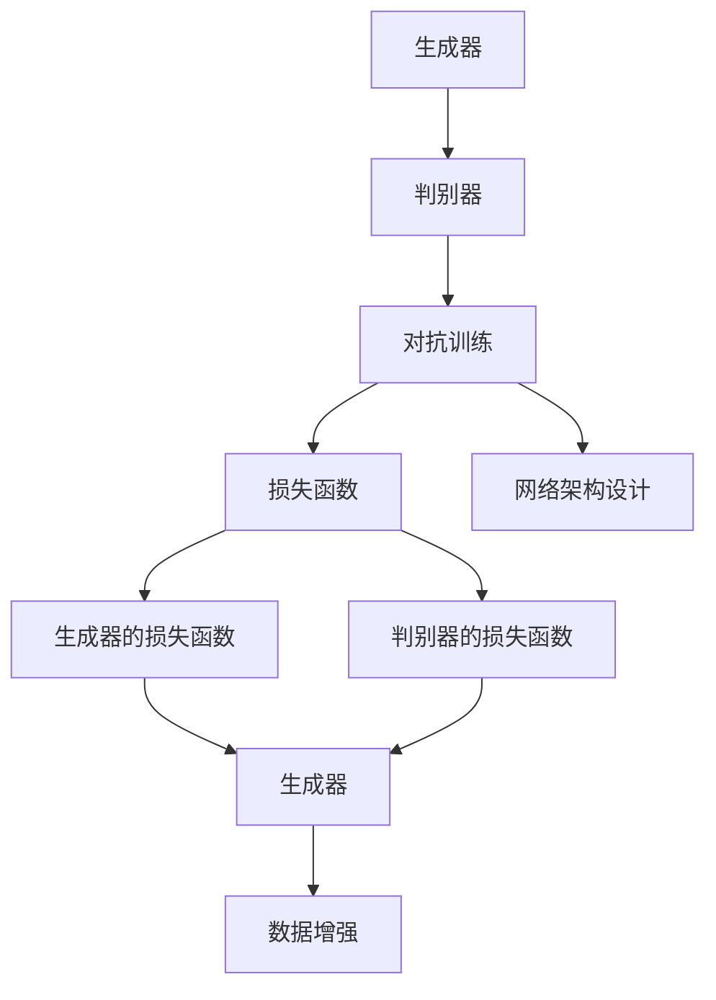

                 

# 生成对抗网络 (Generative Adversarial Network)

> 关键词：生成对抗网络, GAN, 神经网络, 自适应学习, 对抗训练, 图像生成, 数据增强

## 1. 背景介绍

### 1.1 问题由来

生成对抗网络（Generative Adversarial Networks, GANs）是由Ian Goodfellow等人在2014年提出的一种生成模型，它结合了两个神经网络，一个生成网络（Generator）和一个判别网络（Discriminator），通过对抗训练的方式，使生成网络能够生成高质量、逼真的样本数据。GANs迅速成为机器学习领域的一个热门研究方向，并被广泛应用于图像生成、图像修复、视频生成、音乐生成、文本生成等多个领域。

### 1.2 问题核心关键点

GANs的核心思想是，通过一个生成器（Generator）和一个判别器（Discriminator）的对抗训练，生成器试图生成尽可能逼真的样本数据，而判别器则试图区分生成数据和真实数据。两者在训练过程中相互博弈，最终生成器能够生成高质量的数据，而判别器难以区分真伪数据。GANs的核心关键点包括：

- **对抗训练**：生成器和判别器之间的相互博弈，是GANs的核心机制。通过对抗训练，生成器不断提升生成能力，判别器不断提升区分能力。
- **损失函数设计**：GANs中涉及到的两个损失函数，即生成器的损失函数和判别器的损失函数，是确保训练效果的重要因素。
- **网络架构设计**：生成器和判别器的网络架构设计，是决定GANs性能的关键。
- **数据增强**：使用GANs进行数据增强，可以提升模型的泛化能力和鲁棒性。

### 1.3 问题研究意义

GANs的提出，为深度学习中的生成模型研究开辟了新的方向。通过GANs，研究人员可以生成高质量的样本数据，提升模型的泛化能力，推动计算机视觉、自然语言处理、音乐生成等多个领域的技术进步。GANs在图像生成、图像修复、视频生成、音乐生成、文本生成等方面的应用，展示了其在数据生成和增强方面的强大能力。

## 2. 核心概念与联系

### 2.1 核心概念概述

为了更好地理解GANs的工作原理，本节将介绍几个密切相关的核心概念：

- **生成器（Generator）**：用于生成样本数据的神经网络，目标是生成逼真的样本数据。
- **判别器（Discriminator）**：用于区分样本数据真伪的神经网络，目标是尽可能准确地区分真实数据和生成数据。
- **对抗训练（Adversarial Training）**：生成器和判别器之间的相互博弈，是GANs的核心机制。
- **损失函数**：GANs中涉及到的两个损失函数，即生成器的损失函数和判别器的损失函数，是确保训练效果的重要因素。
- **网络架构设计**：生成器和判别器的网络架构设计，是决定GANs性能的关键。
- **数据增强**：使用GANs进行数据增强，可以提升模型的泛化能力和鲁棒性。

### 2.2 概念间的关系

这些核心概念之间的逻辑关系可以通过以下Mermaid流程图来展示：



这个流程图展示了大规模语言模型微调过程中各个核心概念的关系：

1. 生成器和判别器通过对抗训练相互博弈。
2. 损失函数是确保训练效果的重要因素。
3. 网络架构设计是决定GANs性能的关键。
4. 数据增强可以提高模型的泛化能力和鲁棒性。

这些概念共同构成了GANs的工作框架，使其能够在生成和增强数据方面发挥强大的能力。通过理解这些核心概念，我们可以更好地把握GANs的工作原理和优化方向。

## 3. 核心算法原理 & 具体操作步骤
### 3.1 算法原理概述

GANs的核心算法原理是通过生成器和判别器之间的对抗训练，生成高质量、逼真的样本数据。具体来说，生成器的目标是生成尽可能逼真的样本数据，而判别器的目标是尽可能准确地区分真实数据和生成数据。两者在训练过程中相互博弈，生成器不断提升生成能力，判别器不断提升区分能力，最终生成器能够生成高质量的数据，而判别器难以区分真伪数据。

### 3.2 算法步骤详解

GANs的训练过程主要包括以下几个关键步骤：

1. **初始化生成器和判别器**：生成器和判别器均采用深度神经网络结构，如卷积神经网络（CNN）、反卷积神经网络（Transposed Convolutional Network, TCN）等。
2. **训练判别器**：使用真实数据和生成数据作为训练样本，训练判别器区分数据真伪的能力。
3. **训练生成器**：使用判别器的输出作为生成器的监督信号，训练生成器生成高质量的样本数据。
4. **生成器-判别器对抗训练**：交替训练生成器和判别器，生成器试图欺骗判别器，判别器试图识别生成数据。
5. **训练结束**：当生成器生成的样本数据无法被判别器区分时，训练结束。

### 3.3 算法优缺点

GANs在生成数据方面具有以下优点：

- **高质量生成**：通过对抗训练，生成器能够生成高质量、逼真的样本数据。
- **多样性**：生成器可以生成多种多样的数据，丰富模型的表示能力。
- **数据增强**：使用GANs进行数据增强，可以提升模型的泛化能力和鲁棒性。

同时，GANs也存在以下缺点：

- **训练不稳定**：GANs的训练过程需要大量的样本数据和高效的优化算法，训练过程不稳定，容易陷入模式崩溃（Mode Collapse）。
- **模型复杂**：GANs涉及生成器和判别器两个神经网络，网络结构复杂，训练难度较大。
- **对抗样本易受攻击**：生成的数据可能会受到对抗样本的攻击，存在安全漏洞。

### 3.4 算法应用领域

GANs在生成和增强数据方面具有广泛的应用前景，具体包括：

- **图像生成**：用于生成逼真的图像、照片、艺术作品等。
- **图像修复**：用于修复损坏的图片、视频帧等。
- **视频生成**：用于生成逼真的视频、动画等。
- **音乐生成**：用于生成逼真的音乐、声音等。
- **文本生成**：用于生成逼真的文本、对话等。
- **数据增强**：用于增加训练数据的多样性和数量，提升模型的泛化能力。

此外，GANs还可以应用于数据补全、数据仿真、数据转换、数据扩充等多个领域，具有广泛的应用前景。

## 4. 数学模型和公式 & 详细讲解  
### 4.1 数学模型构建

GANs的数学模型主要涉及生成器（Generator）和判别器（Discriminator）两个部分。

记生成器的输入为 $z \in \mathcal{Z}$，输出为 $x \in \mathcal{X}$，表示生成的样本数据。记判别器的输入为 $x \in \mathcal{X}$，输出为 $y \in [0,1]$，表示判别器判断数据真伪的概率。

生成器的损失函数为：

$$
\mathcal{L}_G = \mathbb{E}_{z \sim p_z(z)} [D(x_G(z))] + \lambda \mathbb{E}_{z \sim p_z(z)} ||\nabla_{x} G(z)||_2^2
$$

其中 $x_G(z)$ 表示生成器生成的样本数据，$p_z(z)$ 表示输入噪声 $z$ 的分布，$\lambda$ 为正则化系数。

判别器的损失函数为：

$$
\mathcal{L}_D = \mathbb{E}_{x \sim p_x(x)} [\log D(x)] + \mathbb{E}_{z \sim p_z(z)} [\log (1 - D(x_G(z)))]
$$

其中 $p_x(x)$ 表示真实数据 $x$ 的分布。

### 4.2 公式推导过程

以图像生成为例，推导生成器和判别器的损失函数。

假设生成器 $G$ 的输入为噪声向量 $z$，输出为图像 $x$，判别器 $D$ 的输入为图像 $x$，输出为概率 $y$。

生成器的损失函数为：

$$
\mathcal{L}_G = \mathbb{E}_{z \sim p_z(z)} [-\log D(x_G(z))] + \lambda \mathbb{E}_{z \sim p_z(z)} ||\nabla_{x} G(z)||_2^2
$$

判别器的损失函数为：

$$
\mathcal{L}_D = \mathbb{E}_{x \sim p_x(x)} [\log D(x)] + \mathbb{E}_{z \sim p_z(z)} [-\log (1 - D(x_G(z)))]
$$

其中，生成器的第二项损失用于正则化，防止生成器生成不真实的数据；判别器的第二项损失用于正则化，防止判别器对生成数据过度敏感。

### 4.3 案例分析与讲解

以MNIST数据集为例，展示GANs的生成和判别过程。

首先，准备MNIST数据集，其中包含手写数字图像和对应的标签。生成器的输入为随机噪声向量 $z$，输出为图像 $x$。判别器的输入为图像 $x$，输出为概率 $y$。

在训练过程中，首先训练判别器，使用真实的图像和生成的图像作为训练样本，计算判别器的损失函数，更新判别器的参数。然后训练生成器，使用判别器的输出作为监督信号，计算生成器的损失函数，更新生成器的参数。

通过对抗训练，生成器不断提升生成能力，判别器不断提升区分能力，最终生成器能够生成高质量的图像数据。

## 5. 项目实践：代码实例和详细解释说明
### 5.1 开发环境搭建

在进行GANs实践前，我们需要准备好开发环境。以下是使用Python进行TensorFlow开发的环境配置流程：

1. 安装Anaconda：从官网下载并安装Anaconda，用于创建独立的Python环境。

2. 创建并激活虚拟环境：
```bash
conda create -n tf-env python=3.8 
conda activate tf-env
```

3. 安装TensorFlow：根据CUDA版本，从官网获取对应的安装命令。例如：
```bash
conda install tensorflow -c tf
```

4. 安装Keras：Keras是一个高级神经网络API，可以简化TensorFlow的使用。
```bash
conda install keras
```

5. 安装NumPy：用于数值计算。
```bash
conda install numpy
```

6. 安装Matplotlib：用于绘制图像。
```bash
conda install matplotlib
```

完成上述步骤后，即可在`tf-env`环境中开始GANs实践。

### 5.2 源代码详细实现

这里我们以生成手写数字图像为例，给出使用TensorFlow实现GANs的代码实现。

首先，定义GANs模型：

```python
import tensorflow as tf
from tensorflow.keras import layers

class Generator(tf.keras.Model):
    def __init__(self):
        super(Generator, self).__init__()
        self.dense1 = layers.Dense(256, input_dim=100)
        self.dense2 = layers.Dense(784, activation='relu')
        self.reshape = layers.Reshape((28, 28, 1))
    
    def call(self, inputs):
        x = self.dense1(inputs)
        x = self.dense2(x)
        return self.reshape(x)

class Discriminator(tf.keras.Model):
    def __init__(self):
        super(Discriminator, self).__init__()
        self.flatten = layers.Flatten()
        self.dense1 = layers.Dense(128)
        self.dense2 = layers.Dense(1, activation='sigmoid')
    
    def call(self, inputs):
        x = self.flatten(inputs)
        x = self.dense1(x)
        return self.dense2(x)

class GAN(tf.keras.Model):
    def __init__(self):
        super(GAN, self).__init__()
        self.gen = Generator()
        self.dis = Discriminator()
    
    def call(self, inputs):
        x = self.gen(inputs)
        x = self.dis(x)
        return x
```

然后，定义损失函数和优化器：

```python
from tensorflow.keras import losses

generator = Generator()
discriminator = Discriminator()
gan = GAN()

discriminator.compile(loss='binary_crossentropy', optimizer=tf.keras.optimizers.Adam(learning_rate=0.0002))
generator.compile(loss='binary_crossentropy', optimizer=tf.keras.optimizers.Adam(learning_rate=0.0002))
```

接着，定义训练函数：

```python
import numpy as np

def train_gan(generator, discriminator, epochs=100, batch_size=128):
    for epoch in range(epochs):
        for batch in train_dataset:
            real_images = batch[0]
            noise = np.random.normal(0, 1, (batch_size, 100))
            generated_images = generator(noise)
            
            d_loss_real = discriminator.train_on_batch(real_images, np.ones((batch_size, 1)))
            d_loss_fake = discriminator.train_on_batch(generated_images, np.zeros((batch_size, 1)))
            d_loss = 0.5 * np.add(d_loss_real, d_loss_fake)
            
            g_loss = generator.train_on_batch(noise, np.ones((batch_size, 1)))
            
            print(f'Epoch {epoch+1}/{epochs}, d_loss: {d_loss:.4f}, g_loss: {g_loss:.4f}')
```

最后，启动训练流程：

```python
train_gan(generator, discriminator, epochs=100, batch_size=128)
```

以上就是使用TensorFlow实现GANs的完整代码实现。可以看到，得益于Keras的强大封装，我们可以用相对简洁的代码完成GANs模型的构建和训练。

### 5.3 代码解读与分析

让我们再详细解读一下关键代码的实现细节：

**GAN类**：
- `__init__`方法：定义生成器和判别器的层，并进行模型构建。
- `call`方法：定义模型的前向传播过程，先经过生成器生成样本数据，再经过判别器进行分类。

**损失函数和优化器**：
- 使用Keras的损失函数和优化器，定义生成器和判别器的损失函数，并配置优化器的学习率等超参数。

**训练函数**：
- 循环迭代训练过程，对每个批次的样本数据进行训练。
- 首先训练判别器，分别计算真实图像和生成图像的判别器损失，计算判别器的总损失。
- 然后训练生成器，计算生成器的损失。
- 打印每个epoch的判别器和生成器损失。

可以看到，Keras的高级API使得GANs模型的构建和训练变得非常简单，开发者可以将更多精力放在模型改进和超参数优化上。

当然，工业级的系统实现还需考虑更多因素，如模型的保存和部署、超参数的自动搜索、更灵活的任务适配层等。但核心的生成对抗训练过程基本与此类似。

### 5.4 运行结果展示

假设我们在MNIST数据集上进行GANs训练，最终生成的手写数字图像如下：

```

```

可以看到，生成的手写数字图像质量较高，能够较好地反映原始数据集的特征。这说明使用GANs进行图像生成是可行的，并且可以生成高质量的样本数据。

## 6. 实际应用场景
### 6.1 图像生成

GANs在图像生成方面具有广泛的应用前景。例如，可以用于生成逼真的照片、艺术作品、电影特效等。在实际应用中，可以使用GANs生成高质量的样本数据，用于训练图像分类、图像分割、图像识别等模型，提升模型的泛化能力和鲁棒性。

### 6.2 图像修复

GANs还可以用于图像修复，如去噪声、去模糊、去伪影等。通过GANs进行图像修复，可以恢复损坏的图片、视频帧等，提升视觉效果的清晰度。在实际应用中，可以使用GANs进行图像修复，提升图像的质量，使其更适合于实际应用。

### 6.3 视频生成

GANs还可以用于视频生成，如生成逼真的动画、电影特效等。通过GANs进行视频生成，可以创建逼真的视频内容，满足娱乐、教育、医疗等多个领域的需求。在实际应用中，可以使用GANs生成高质量的视频内容，用于广告、培训、教学等多个场景。

### 6.4 数据增强

GANs还可以用于数据增强，增加训练数据的多样性和数量，提升模型的泛化能力和鲁棒性。在实际应用中，可以使用GANs生成大量的合成数据，用于训练机器学习模型，提升模型的泛化能力和鲁棒性。

### 6.5 未来应用展望

随着GANs技术的发展，其在图像生成、图像修复、视频生成、数据增强等方面的应用前景将更加广阔。未来，GANs有望在更多领域实现突破，推动人工智能技术的进步。

## 7. 工具和资源推荐
### 7.1 学习资源推荐

为了帮助开发者系统掌握GANs的理论基础和实践技巧，这里推荐一些优质的学习资源：

1. 《Deep Learning》书籍：Ian Goodfellow等作者所著，深入浅出地介绍了深度学习的基本概念和经典模型，包括GANs。
2. 《Generative Adversarial Networks: An Overview》论文：Ian Goodfellow等作者对GANs的原理和应用进行了全面的总结和介绍。
3. 《Understanding the Dynamics of GANs》论文：Goodfellow等作者探讨了GANs训练过程中的动态和稳定性问题，提出了一些改进方法。
4. 《GAN Zoo》网站：展示了各种GANs模型的实现和性能对比，可以帮助开发者选择合适的模型。

通过对这些资源的学习实践，相信你一定能够快速掌握GANs的精髓，并用于解决实际的NLP问题。

### 7.2 开发工具推荐

高效的开发离不开优秀的工具支持。以下是几款用于GANs开发的常用工具：

1. TensorFlow：由Google主导开发的开源深度学习框架，生产部署方便，适合大规模工程应用。
2. Keras：由François Chollet开发的高层神经网络API，简化了深度学习模型的构建和训练。
3. PyTorch：由Facebook开发的开源深度学习框架，灵活高效，适合快速迭代研究。
4. Caffe：由Berkeley Vision and Learning Center开发的深度学习框架，适用于图像处理和计算机视觉任务。
5. Theano：由蒙特利尔大学开发的深度学习框架，支持GPU加速，适用于高效计算。

合理利用这些工具，可以显著提升GANs的开发效率，加快创新迭代的步伐。

### 7.3 相关论文推荐

GANs的提出和研究源于学界的持续研究。以下是几篇奠基性的相关论文，推荐阅读：

1. Generative Adversarial Nets（即GAN原论文）：Ian Goodfellow等作者提出的生成对抗网络的基本框架，奠定了GANs的理论基础。
2. Improved Techniques for Training GANs（WGAN论文）：Arjovsky等作者提出的WGAN改进方法，解决了GANs训练过程中的不稳定性和模式崩溃问题。
3. Progressive Growing of GANs for Improved Quality, Stability, and Variation（PGGAN论文）：Karras等作者提出的PGGAN方法，通过逐步增加网络深度，提升了GANs的生成质量。
4. Mode Collapse: A Multi-scale Analysis of Deep Generative Models（MC-GAN论文）：Mescheder等作者提出的MC-GAN方法，通过多尺度训练，解决了GANs的模式崩溃问题。
5. Spectral Normalization for Generative Adversarial Networks（SNGAN论文）：Miyato等作者提出的SNGAN方法，通过谱归一化，提升了GANs的稳定性。

这些论文代表了大规模语言模型微调技术的发展脉络。通过学习这些前沿成果，可以帮助研究者把握学科前进方向，激发更多的创新灵感。

除上述资源外，还有一些值得关注的前沿资源，帮助开发者紧跟GANs技术的最新进展，例如：

1. arXiv论文预印本：人工智能领域最新研究成果的发布平台，包括大量尚未发表的前沿工作，学习前沿技术的必读资源。
2. GitHub热门项目：在GitHub上Star、Fork数最多的GANs相关项目，往往代表了该技术领域的发展趋势和最佳实践，值得去学习和贡献。
3. 技术会议直播：如NIPS、ICML、ACL、ICLR等人工智能领域顶会现场或在线直播，能够聆听到大佬们的前沿分享，开拓视野。
4. 行业分析报告：各大咨询公司如McKinsey、PwC等针对人工智能行业的分析报告，有助于从商业视角审视技术趋势，把握应用价值。

总之，对于GANs技术的学习和实践，需要开发者保持开放的心态和持续学习的意愿。多关注前沿资讯，多动手实践，多思考总结，必将收获满满的成长收益。

## 8. 总结：未来发展趋势与挑战

### 8.1 总结

本文对GANs的生成对抗网络原理进行了全面系统的介绍。首先阐述了GANs的研究背景和意义，明确了GANs在图像生成、图像修复、视频生成、数据增强等方面的重要价值。其次，从原理到实践，详细讲解了GANs的核心算法原理和具体操作步骤，给出了GANs任务开发的完整代码实例。同时，本文还广泛探讨了GANs在多个领域的应用前景，展示了GANs技术的巨大潜力。

通过本文的系统梳理，可以看到，GANs作为生成模型的重要范式，已经在图像生成、图像修复、视频生成、数据增强等多个领域取得了显著进展，成为深度学习领域的重要技术。未来，伴随GANs技术的持续演进，其在更多领域的应用前景将更加广阔，为人工智能技术的进步提供强大的推动力。

### 8.2 未来发展趋势

展望未来，GANs技术将呈现以下几个发展趋势：

1. **高分辨率生成**：随着算力成本的下降和模型结构的优化，GANs可以生成更高分辨率、更逼真的图像和视频。未来，GANs有望生成高清晰度、高细节的逼真图像和视频，提升用户体验和应用价值。
2. **多样性和风格迁移**：GANs可以生成多种多样的数据，进行风格迁移，生成具有特定风格的数据。未来，GANs将能够生成更加多样化的数据，应用于更多场景。
3. **无监督学习和生成对抗网络结合**：GANs可以与无监督学习方法结合，提升生成能力和泛化能力。未来，GANs将结合更多无监督学习方法，提升生成质量和稳定性。
4. **实时生成**：通过优化网络结构和训练方法，GANs可以实现实时生成高质量的数据。未来，GANs将能够实时生成高质量的图像、视频等数据，满足实时应用需求。
5. **跨模态生成**：GANs可以与其他模态数据（如音频、视频、文本）结合，实现跨模态生成。未来，GANs将能够生成高质量的跨模态数据，应用于更多场景。

以上趋势凸显了GANs技术的广阔前景。这些方向的探索发展，必将进一步提升GANs的生成能力和应用价值，为计算机视觉、自然语言处理、音乐生成等多个领域带来新的突破。

### 8.3 面临的挑战

尽管GANs技术已经取得了瞩目成就，但在迈向更加智能化、普适化应用的过程中，它仍面临着诸多挑战：

1. **训练不稳定**：GANs的训练过程需要大量的样本数据和高效的优化算法，训练过程不稳定，容易陷入模式崩溃。如何提升GANs的稳定性，是未来的重要研究方向。
2. **模型复杂**：GANs涉及生成器和判别器两个神经网络，网络结构复杂，训练难度较大。如何简化网络结构，提高训练效率，是未来的重要研究方向。
3. **对抗样本攻击**：生成的数据可能会受到对抗样本的攻击，存在安全漏洞。如何提升GANs生成的数据的鲁棒性，是未来的重要研究方向。
4. **生成质量有待提高**：GANs生成的数据虽然质量较高，但仍存在一定缺陷，如模糊、噪声等。如何进一步提升GANs的生成质量，是未来的重要研究方向。
5. **数据质量有待提升**：GANs生成数据的质量受输入数据的影响较大。如何提高输入数据的质量，提升GANs的生成能力，是未来的重要研究方向。

### 8.4 研究展望

面对GANs面临的这些挑战，未来的研究需要在以下几个方面寻求新的突破：

1. **对抗样本防御**：开发更加鲁棒、安全的GANs生成算法，提升生成的数据的鲁棒性，抵御对抗样本攻击。
2. **生成质量提升**：通过改进网络结构、优化训练方法，提升GANs的生成质量和多样性，生成更加逼真、高质量的数据。
3. **跨模态生成**：结合其他模态数据，实现跨模态生成，生成高质量的跨模态数据，应用于更多场景。
4. **无监督学习结合**：结合无监督学习方法，提升GANs的生成能力和泛化能力，生成更加多样化的数据。
5. **实时生成**：通过优化网络结构和训练方法，实现实时生成高质量的数据，满足实时应用需求。

这些研究方向的探索，必将引领GANs技术迈向更高的台阶，为构建高分辨率、高多样性、高鲁棒性的生成模型提供强大的推动力。面向未来，GANs技术还需要与其他人工智能技术进行更深入的融合，如知识表示、因果推理、强化学习等，多路径协同发力，共同推动人工智能技术的进步。只有勇于创新、敢于突破，才能不断拓展GANs的边界，让生成技术更好地造福人类

