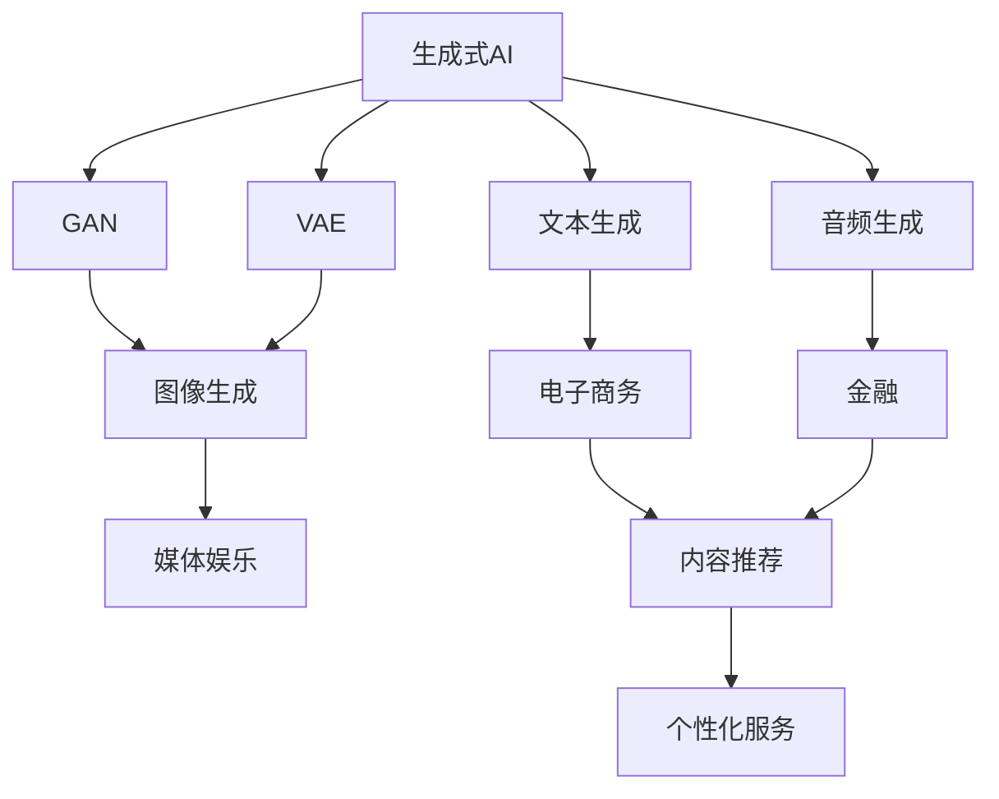
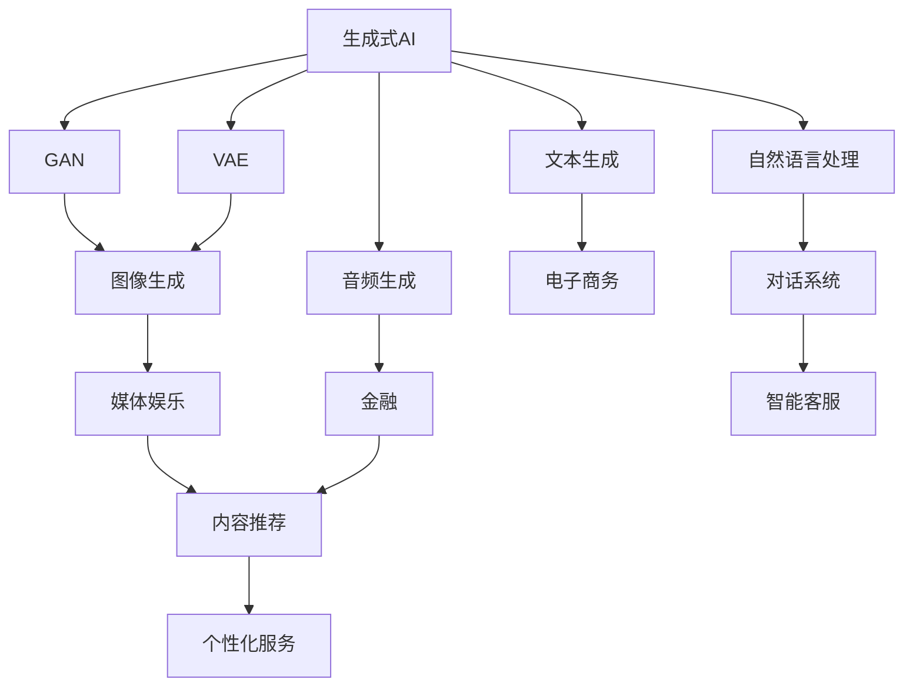
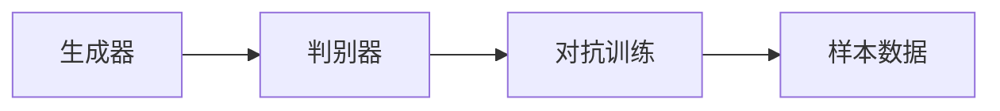
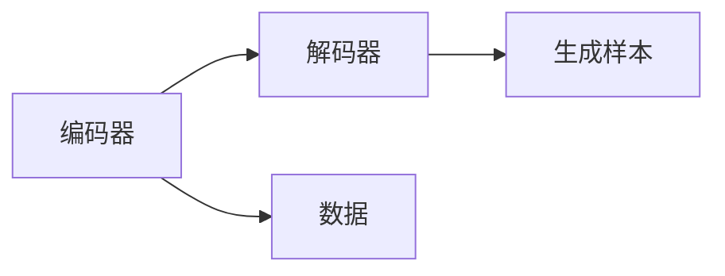

                 

# 生成式AIGC：AI技术的商业应用

> 关键词：生成式AIGC, AI商业应用, AI技术, 自动化, 内容生成, 自然语言处理(NLP), 机器学习, 深度学习, 图像生成, 语音生成, 文本生成, 应用场景

## 1. 背景介绍

### 1.1 问题由来
近年来，随着人工智能(AI)技术的迅猛发展，生成式人工智能(Generative AI, GAI)逐渐成为推动AI技术商业化应用的重要引擎。生成式AI主要基于深度学习模型，特别是生成对抗网络(GAN)和变分自编码器(VAE)，能够生成高度逼真的图像、文本和音频等内容。其商业应用广泛，涵盖媒体娱乐、电子商务、金融、教育等多个领域，为各行各业带来了新的商业价值和应用潜力。

生成式AI的核心技术是生成式模型，它通过学习大量真实数据，生成符合分布的新数据，广泛应用于内容生成、图像生成、文本生成等多个方面。相比于传统的基于规则的生成方式，生成式AI能够产生更加多样、自然、逼真的内容，极大提升了生成效率和质量。

### 1.2 问题核心关键点
生成式AI的核心在于通过深度学习模型，如GAN和VAE，生成高质量的图像、文本和音频等内容。其中，GAN模型通过两个神经网络，生成器和判别器，进行对抗性训练，生成逼真的样本数据；VAE模型通过将数据编码到低维空间，再解码回高维空间，生成具有一定分布的样本数据。生成式AI的技术进展不仅包括模型架构的创新，还有训练策略的优化，以及数据生成性能的提升。

当前生成式AI在媒体娱乐、电子商务、金融、教育等多个领域已实现了初步的商业化应用，如自动视频编辑、智能客服、个性化推荐等。这些应用的实现，使得AI技术真正走入人们的生活和工作，极大地提升了效率和用户体验。

### 1.3 问题研究意义
研究生成式AI的商业应用，有助于探索AI技术的广泛应用场景，提升各行业的自动化水平和商业价值，加速AI技术的产业化进程。具体意义包括：

1. **降低生产成本**：生成式AI可以自动生成内容，替代部分人力，降低生产成本。
2. **提升用户体验**：通过生成逼真的内容，增强用户体验，提高用户满意度。
3. **加速产品迭代**：生成式AI可以快速生成多样化的原型和方案，加速产品开发和迭代。
4. **推动业务创新**：通过AI技术在多个领域的深度应用，催生新的商业模式和增长点。
5. **优化资源配置**：生成式AI能够高效利用资源，优化资源配置，提升运营效率。

## 2. 核心概念与联系

### 2.1 核心概念概述

为了更好地理解生成式AI的商业应用，本节将介绍几个关键概念：

- **生成式AI (Generative AI, GAI)**：基于深度学习模型，特别是生成对抗网络(GAN)和变分自编码器(VAE)，能够生成高质量的图像、文本和音频等内容。
- **生成对抗网络 (Generative Adversarial Networks, GAN)**：由生成器和判别器两个神经网络进行对抗性训练，生成逼真的样本数据。
- **变分自编码器 (Variational Autoencoders, VAE)**：通过将数据编码到低维空间，再解码回高维空间，生成具有一定分布的样本数据。
- **内容生成 (Content Generation)**：生成逼真的文本、图像、音频等内容，广泛应用于媒体娱乐、电子商务、金融、教育等领域。
- **深度学习 (Deep Learning)**：一种基于多层神经网络的技术，用于处理高维数据，生成复杂模型，广泛应用于生成式AI中。

这些概念之间的逻辑关系可以通过以下Mermaid流程图来展示：



这个流程图展示了几类核心概念之间的关系：

1. 生成式AI主要基于GAN和VAE进行内容生成。
2. GAN和VAE能够生成图像、文本和音频等不同类型的内容。
3. 这些生成内容广泛应用于媒体娱乐、电子商务、金融、教育等多个领域。

### 2.2 概念间的关系

这些核心概念之间存在着紧密的联系，形成了生成式AI的完整生态系统。下面我通过几个Mermaid流程图来展示这些概念之间的关系。

#### 2.2.1 生成式AI的学习范式



这个流程图展示了大语言模型在生成式AI中的应用。生成式AI需要结合自然语言处理技术，通过模型生成自然语言，进一步应用于对话系统、智能客服等场景。

#### 2.2.2 GAN模型的结构



这个流程图展示了GAN模型的基本结构。生成器和判别器通过对抗训练，生成逼真的样本数据。

#### 2.2.3 VAE模型的结构



这个流程图展示了VAE模型的基本结构。VAE模型将数据编码到低维空间，再解码回高维空间，生成具有一定分布的样本数据。

### 2.3 核心概念的整体架构

最后，我们用一个综合的流程图来展示这些核心概念在大语言模型微调过程中的整体架构：

```mermaid
graph TB
    A[大规模文本数据] --> B[预训练]
    B --> C[生成式AI]
    C --> D[微调]
    C --> E[内容生成]
    D --> F[图像生成]
    D --> G[文本生成]
    D --> H[音频生成]
    F --> I[媒体娱乐]
    G --> J[电子商务]
    H --> K[金融]
    I --> J
    J --> L[个性化服务]
    L --> M[对话系统]
    M --> N[智能客服]
    N --> O[推荐系统]
    O --> P[广告]
    P --> Q[营销]
    Q --> R[品牌建设]
    R --> S[市场分析]
    S --> T[销售预测]
    T --> U[供应链优化]
    U --> V[运营管理]
    V --> W[客户服务]
    W --> X[业务发展]
    X --> Y[企业治理]
    Y --> Z[风险管理]
    Z --> AA[合规审计]
    AA --> AB[数据治理]
    AB --> AC[信息安全]
    AC --> AD[隐私保护]
    AD --> AE[内容合规]
    AE --> AF[内容审核]
    AF --> AG[内容发布]
    AG --> AH[内容监控]
    AH --> AI[内容运营]
    AI --> AJ[内容推荐]
    AJ --> AK[用户画像]
    AK --> AL[用户行为分析]
    AL --> AM[用户预测]
    AM --> AN[用户满意度]
    AN --> AO[用户忠诚度]
    AO --> AP[用户生命周期]
    AP --> AQ[用户细分]
    AQ --> AR[用户画像优化]
    AR --> AS[用户洞察]
    AS --> AT[用户行为预测]
    AT --> AU[用户生命周期优化]
    AU --> AV[用户细分优化]
    AV --> AW[用户画像优化]
    AW --> AX[用户洞察提升]
    AX --> AY[用户行为预测提升]
    AY --> AZ[用户生命周期优化]
    AZ --> BA[业务优化]
    BA --> BB[营销策略优化]
    BB --> BC[广告投放优化]
    BC --> BD[品牌建设优化]
    BD --> BE[市场分析优化]
    BE --> BF[销售预测优化]
    BF --> BG[供应链优化]
    BG --> BH[运营管理优化]
    BH --> BI[客户服务优化]
    BI --> BJ[业务发展优化]
    BJ --> BK[企业治理优化]
    BK --> BL[风险管理优化]
    BL --> BM[合规审计优化]
    BM --> BN[数据治理优化]
    BN --> BO[信息安全优化]
    BO --> BP[隐私保护优化]
    BP --> BQ[内容合规优化]
    BQ --> BR[内容审核优化]
    BR --> BS[内容发布优化]
    BS --> BT[内容监控优化]
    BT --> BU[内容运营优化]
    BU --> BV[内容推荐优化]
    BV --> BW[用户画像优化]
    BW --> BX[用户行为分析优化]
    BX --> BY[用户预测优化]
    BY --> BZ[用户满意度优化]
    BZ --> CA[用户忠诚度优化]
    CA --> CB[用户生命周期优化]
    CB --> CC[用户细分优化]
    CC --> CD[用户画像优化]
    CD --> CE[用户洞察优化]
    CE --> CF[用户行为预测优化]
    CF --> CG[用户生命周期优化]
    CG --> CH[用户细分优化]
    CH --> CI[用户画像优化]
    CI --> CJ[用户洞察提升]
    CJ --> CK[用户行为预测提升]
    CK --> CL[用户生命周期优化]
    CL --> CM[业务优化]
    CM --> CN[营销策略优化]
    CN --> CO[广告投放优化]
    CO --> CP[品牌建设优化]
    CP --> CQ[市场分析优化]
    CQ --> CR[销售预测优化]
    CR --> CS[供应链优化]
    CS --> CT[运营管理优化]
    CT --> CU[客户服务优化]
    CU --> CV[业务发展优化]
    CV --> CW[企业治理优化]
    CW --> CX[风险管理优化]
    CX --> CY[合规审计优化]
    CY --> CZ[数据治理优化]
    CZ --> DA[信息安全优化]
    DA --> DB[隐私保护优化]
    DB --> DC[内容合规优化]
    DC --> DD[内容审核优化]
    DD --> DE[内容发布优化]
    DE --> DF[内容监控优化]
    DF --> DG[内容运营优化]
    DG --> DH[内容推荐优化]
    DH --> DI[用户画像优化]
    DI --> DJ[用户行为分析优化]
    DJ --> DK[用户预测优化]
    DK --> DL[用户满意度优化]
    DL --> DM[用户忠诚度优化]
    DM --> DN[用户生命周期优化]
    DN --> DO[用户细分优化]
    DO --> DP[用户画像优化]
    DP --> DQ[用户洞察优化]
    DQ --> DR[用户行为预测优化]
    DR --> DS[用户生命周期优化]
    DS --> DT[用户细分优化]
    DT --> DU[用户画像优化]
    DU --> DV[用户洞察提升]
    DV --> DW[用户行为预测提升]
    DW --> DX[用户生命周期优化]
    DX --> DY[业务优化]
    DY --> DZ[营销策略优化]
    DZ --> EA[广告投放优化]
    EA --> EB[品牌建设优化]
    EB --> EC[市场分析优化]
    EC --> ED[销售预测优化]
    ED --> EE[供应链优化]
    EE --> EF[运营管理优化]
    EF --> EG[客户服务优化]
    EG --> EH[业务发展优化]
    EH --> EI[企业治理优化]
    EI --> EJ[风险管理优化]
    EJ --> EL[合规审计优化]
    EL --> EM[数据治理优化]
    EM --> EN[信息安全优化]
    EN -->EO[隐私保护优化]
    EO --> EP[内容合规优化]
    EP --> EQ[内容审核优化]
    EQ --> ER[内容发布优化]
    ER --> ES[内容监控优化]
    ES --> ET[内容运营优化]
    ET --> EU[内容推荐优化]
    EU --> EV[用户画像优化]
    EV --> EX[用户行为分析优化]
    EX --> EY[用户预测优化]
    EY --> EZ[用户满意度优化]
    EZ --> FA[用户忠诚度优化]
    FA --> FB[用户生命周期优化]
    FB --> FC[用户细分优化]
    FC --> FD[用户画像优化]
    FD --> FE[用户洞察优化]
    FE --> FF[用户行为预测优化]
    FF --> FG[用户生命周期优化]
    FG --> FH[用户细分优化]
    FH --> FI[用户画像优化]
    FI --> FJ[用户洞察提升]
    FJ --> FK[用户行为预测提升]
    FK --> FL[用户生命周期优化]
    FL --> FM[业务优化]
    FM --> FN[营销策略优化]
    FN --> FO[广告投放优化]
    FO --> FP[品牌建设优化]
    FP --> FQ[市场分析优化]
    FQ --> FR[销售预测优化]
    FR --> FS[供应链优化]
    FS --> FT[运营管理优化]
    FT --> FU[客户服务优化]
    FU --> FV[业务发展优化]
    FV --> FW[企业治理优化]
    FW --> FX[风险管理优化]
    FX --> FY[合规审计优化]
    FY --> FZ[数据治理优化]
    FZ --> GA[信息安全优化]
    GA --> GB[隐私保护优化]
    GB --> GC[内容合规优化]
    GC --> GD[内容审核优化]
    GD --> GE[内容发布优化]
    GE --> GF[内容监控优化]
    GF --> GG[内容运营优化]
    GG --> GH[内容推荐优化]
    GH --> GI[用户画像优化]
    GI --> GJ[用户行为分析优化]
    GJ --> GK[用户预测优化]
    GK --> GL[用户满意度优化]
    GL --> GM[用户忠诚度优化]
    GM --> GN[用户生命周期优化]
    GN --> GO[用户细分优化]
    GO --> GP[用户画像优化]
    GP --> GQ[用户洞察优化]
    GQ --> GR[用户行为预测优化]
    GR --> GS[用户生命周期优化]
    GS --> GT[用户细分优化]
    GT --> GU[用户画像优化]
    GU --> GV[用户洞察提升]
    GV --> GW[用户行为预测提升]
    GW --> GX[用户生命周期优化]
    GX --> Gy[业务优化]
    Gy --> Gz[营销策略优化]
    Gz --> Ha[广告投放优化]
    Ha --> Hb[品牌建设优化]
    Hb --> Hc[市场分析优化]
    Hc --> Hd[销售预测优化]
    Hd --> He[供应链优化]
    He --> Hf[运营管理优化]
    Hf --> Hg[客户服务优化]
    Hg --> Hh[业务发展优化]
    Hh --> Hi[企业治理优化]
    Hi --> Hj[风险管理优化]
    Hj --> Hk[合规审计优化]
    Hk --> Hl[数据治理优化]
    Hl --> Hm[信息安全优化]
    Hm --> Hn[隐私保护优化]
    Hn --> Ho[内容合规优化]
    Ho -->Hp[内容审核优化]
    Hp --> Hq[内容发布优化]
    Hq --> Hr[内容监控优化]
    Hr --> Hs[内容运营优化]
    Hs --> Ht[内容推荐优化]
    Ht --> Hu[用户画像优化]
    Hu --> Hv[用户行为分析优化]
    Hv --> Hw[用户预测优化]
    Hw --> Hx[用户满意度优化]
    Hx --> Hy[用户忠诚度优化]
    Hy --> Hz[用户生命周期优化]
    Hz --> Ia[用户细分优化]
    Ia --> Ib[用户画像优化]
    Ib --> Ic[用户洞察优化]
    Ic --> Id[用户行为预测优化]
    Id --> Ie[用户生命周期优化]
    Ie --> If[用户细分优化]
    If --> Ig[用户画像优化]
    Ig --> Ih[用户洞察提升]
    Ih --> Ii[用户行为预测提升]
    Ii --> Ij[用户生命周期优化]
    Ij --> Ia[业务优化]
    Ia --> Ib[营销策略优化]
    Ib --> Ic[广告投放优化]
    Ic --> Ic[品牌建设优化]
    Ic --> Id[市场分析优化]
    Id --> Ie[销售预测优化]
    Ie --> If[供应链优化]
    If --> Ig[运营管理优化]
    Ig --> Ih[客户服务优化]
    Ih --> Ii[业务发展优化]
    Ii --> Ij[企业治理优化]
    Ij --> Ik[风险管理优化]
    Ik --> Il[合规审计优化]
    Il --> Im[数据治理优化]
    Im --> Io[信息安全优化]
    Io --> Ip[隐私保护优化]
    Ip --> Iq[内容合规优化]
    Iq --> Ir[内容审核优化]
    Ir --> Is[内容发布优化]
    Is --> It[内容监控优化]
    It --> Iu[内容运营优化]
    Iu --> Iv[内容推荐优化]
    Iv --> Iw[用户画像优化]
    Iw --> Ix[用户行为分析优化]
    Ix --> Iy[用户预测优化]
    Iy --> Iz[用户满意度优化]
    Iz --> Ja[用户忠诚度优化]
    Ja --> Jb[用户生命周期优化]
    Jb --> Jc[用户细分优化]
    Jc --> Jd[用户画像优化]
    Jd --> Je[用户洞察优化]
    Je --> Jf[用户行为预测优化]
    Jf --> Jg[用户生命周期优化]
    Jg --> Jh[用户细分优化]
    Jh --> Ji[用户画像优化]
    Ji --> Jj[用户洞察提升]
    Jj --> Jk[用户行为预测提升]
    Jk --> Jl[用户生命周期优化]
    Jl --> Jm[业务优化]
    Jm --> Jn[营销策略优化]
    Jn --> Jo[广告投放优化]
    Jo --> Jp[品牌建设优化]
    Jp --> Jq[市场分析优化]
    Jq --> Jr[销售预测优化]
    Jr --> Js[供应链优化]
    Js --> Jt[运营管理优化]
    Jt --> Ju[客户服务优化]
    Ju --> Jv[业务发展优化]
    Jv --> Jw[企业治理优化]
    Jw --> Jx[风险管理优化]
    Jx --> Jy[合规审计优化]
    Jy --> Jz[数据治理优化]
    Jz --> Ka[信息安全优化]
    Ka --> Kb[隐私保护优化]
    Kb --> Kc[内容合规优化]
    Kc --> Kd[内容审核优化]
    Kd --> Ke[内容发布优化]
    Ke --> Kf[内容监控优化]
    Kf --> Kg[内容运营优化]
    Kg --> Kh[内容推荐优化]
    Kh --> Ki[用户画像优化]
    Ki --> Kj[用户行为分析优化]
    Kj --> Kk[用户预测优化]
    Kk --> Kl[用户满意度优化]
    Kl --> Km[用户忠诚度优化]
    Km --> Kn[用户生命周期优化]
    Kn --> Ko[用户细分优化]
    Ko --> Kp[用户画像优化]
    Kp --> Kq[用户洞察优化]
    Kq --> Kr[用户行为预测优化]
    Kr --> Ks[用户生命周期优化]
    Ks --> Kt[用户细分优化]
    Kt --> Ku[用户画像优化]
    Ku --> Kv[用户洞察提升]
    Kv --> Kw[用户行为预测提升]
    Kw --> Kx[用户生命周期优化]
    Kx --> Ky[业务优化]
    Ky --> Kz[营销策略优化]
    Kz --> La[广告投放优化]
    La --> Lb[品牌建设优化]
    Lb --> Lc[市场分析优化]
    Lc --> Ld[销售预测优化]
    Ld --> Le[供应链优化]
    Le --> Lf[运营管理优化]
    Lf --> Lg[客户服务优化]
    Lg --> Lh[业务发展优化]
    Lh --> Li[企业治理优化]
    Li --> Lj[风险管理优化]
    Lj --> Lk[合规审计优化]
    Lk --> Ll[数据治理优化]
    Ll --> Lm[信息安全优化]
    Lm --> Ln[隐私保护优化]
    Ln --> Lo[内容合规优化]
    Lo --> Lp[内容审核优化]
    Lp --> Lq[内容发布优化]
    Lq --> Lr[内容监控优化]
    Lr --> Ls[内容运营优化]
    Ls --> Lt[内容推荐优化]
    Lt --> Lu[用户画像优化]
    Lu --> Lv[用户行为分析优化]
    Lv --> Lw[用户预测优化]
    Lw --> Lx[用户满意度优化]
    Lx --> Ly[用户忠诚度优化]
    Ly --> Lz[用户生命周期优化]
    Lz --> Ma[用户细分优化]
    Ma --> Mb[用户画像优化]
    Mb --> Mc[用户洞察优化]
    Mc --> Md[用户行为预测优化]
    Md --> Me[用户生命周期优化]
    Me --> Mf[用户细分优化]
    Mf --> Mg[用户画像优化]
    Mg --> Mh[用户洞察提升]
    Mh --> Mi[用户行为预测提升]
    Mi --> Mj[用户生命周期优化]
    Mj --> Ma[业务优化]
    Ma --> Mb[营销策略优化]
    Mb --> Mc[广告投放优化]
    Mc --> Md[品牌建设优化]
    Md --> Me[市场分析优化]
    Me --> Mf[销售预测优化]
    Mf --> Mg[供应链优化]
    Mg --> Mh[运营管理优化]
    Mh --> Mi[客户服务优化]
    Mi --> Mj[业务发展优化]
    Mj --> Mk[企业治理优化]
    Mk --> Ml[风险管理优化]
    Ml --> Mm[合规审计优化]
    Mm --> Mn[数据治理优化]
    Mn --> Mo[信息安全优化]
    Mo --> Mp[隐私保护优化]
    Mp --> Mr[内容合规优化]
    Mr --> Ms[内容审核优化]
    Ms --> Mt[内容发布优化]
    Mt --> Mu[内容监控优化]
    Mu --> Mv[内容运营优化]
    Mv --> Mw[内容推荐优化]
    Mw --> Mx[用户画像优化]
    Mx --> My[用户行为分析优化]
    My --> Mz[用户预测优化]
    Mz --> Na[用户满意度优化]
    Na --> Nb[用户忠诚度优化]
    Nb --> Nc[用户生命周期优化]
    Nc --> Nd[用户细分优化]
    Nd --> Ne[用户画像优化]
    Ne --> Nf[用户洞察优化]
    Nf --> Ng[用户行为预测优化]
    Ng --> Nh[用户生命周期优化]
    Nh --> Ni[用户细分优化]
    Ni --> Nj[用户画像优化]
    Nj --> Nk[用户洞察提升]
    Nk --> Nl[用户行为预测提升]
    Nl --> Nm[用户生命周期优化]
    Nm --> Nn[业务优化]
    Nn --> No[营销策略优化]
    No --> Np[广告投放优化]
    Np --> Nq[品牌建设优化]
    Nq --> Nr[市场分析优化]
    Nr --> Ns[销售预测优化]
    Ns --> Nt[供应链优化]
    Nt --> Nu[运营管理优化]
    Nu --> Nv[客户服务优化]
    Nv --> Nw[业务发展优化]
    Nw --> Nx[企业治理优化]
    Nx --> Ny[风险管理优化]
    Ny --> Nz[合规审计优化]
    Nz --> Oa[数据治理优化]
    Oa --> Ob[信息安全优化]
    Ob --> Oc[隐私保护优化]
    Oc --> Od[内容合规优化]
    Od --> Oe[内容审核优化]
    Oe --> Of[内容发布优化]
    Of --> Og[内容监控优化]
    Og --> Oh[内容运营优化]
    Oh --> Oi[内容推荐优化]
    Oi --> Oj[用户画像优化]
    Oj --> Ok[用户行为分析优化]
    Ok --> Ol[用户预测优化]
    Ol --> Om[用户满意度优化]
    Om --> On[用户忠诚度优化]
    On --> Oo[用户生命周期优化]
    Oo --> Op[用户细分优化]
    Op --> Oq[用户画像优化]
    Oq --> Or[用户洞察优化]
    Or --> Os[用户行为预测优化]
    Os --> Ot[用户生命周期优化]
    Ot --> Ou[用户细分优化]
    Ou --> Ov[用户画像优化]
    Ov --> Ow[用户洞察提升]
    Ow --> Ox[用户行为预测提升]
    Ox --> Oy[用户生命周期优化]
    Oy --> Oz[业务优化]
    Oz --> Qa[营销策略优化]
    Qa --> Qb[广告投放优化]
    Qb --> Qc[品牌建设优化]
    Qc --> Qd[市场分析优化]
    Qd --> Qe[销售预测优化]
    Qe --> Qf[供应链优化]
    Qf --> Qg[运营管理优化]
    Qg --> Qh[客户服务优化]
    Qh --> Qi[业务发展优化]
    Qi --> Qj[企业治理优化]
    Qj --> Qk[风险管理优化]
    Qk --> Ql[合规审计优化]
    Ql --> Qm[数据治理优化]
    Qm --> Qn[信息安全优化]
    Qn --> Qo

