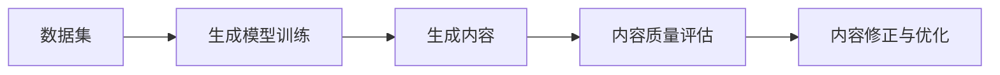
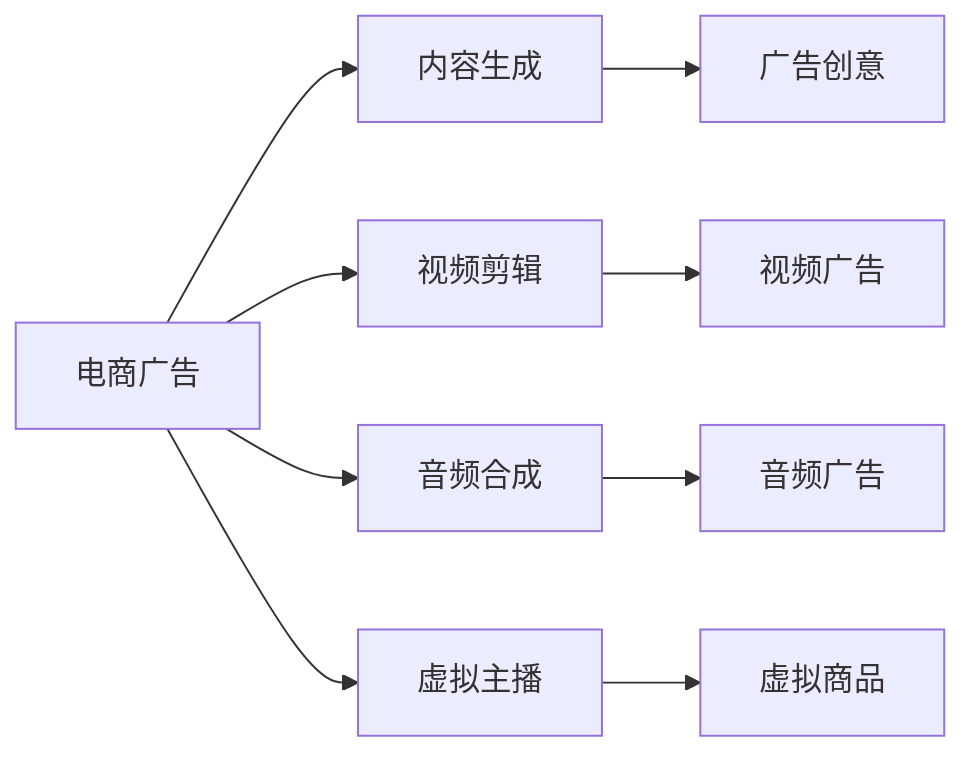
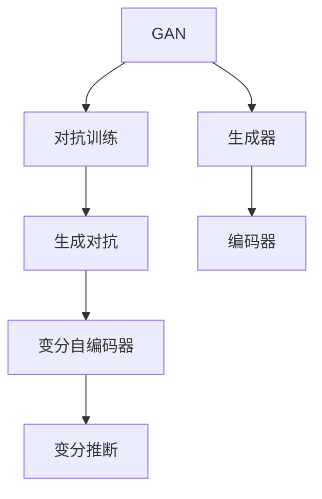
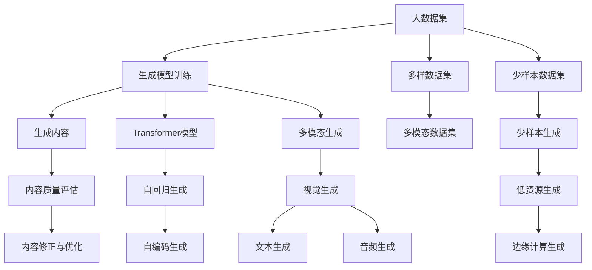

                 

# 生成式AIGC：AI技术的商业应用

> 关键词：生成式AI, AIGC, AI商业应用, 自动生成内容, 内容创作, 用户生成内容

## 1. 背景介绍

### 1.1 问题由来

随着人工智能技术的飞速发展，生成式AI（Generative AI）已成为推动AI商业应用的重要力量。其中，自动生成内容（Automatic Generated Content, AIGC）技术因其强大的内容创作能力，正在逐步改变传统的生产方式。从简单的文本生成、图像生成，到复杂的多模态生成，AIGC技术正深入到各个行业，推动产业升级和经济转型。

生成式AI技术的核心是使用深度学习模型，通过对大量数据进行学习，自动生成符合特定风格和语境的新内容。这种能力使得AIGC在内容创作、图像设计、广告制作、视频剪辑等多个领域展现出巨大潜力，极大地提升了生产效率，降低了成本。

### 1.2 问题核心关键点

生成式AIGC技术的关键在于其生成内容的逼真度和多样性。目前主流的生成式AI模型包括基于GAN（Generative Adversarial Networks, 生成对抗网络）的变分自编码器（Variational Autoencoders, VAEs）和Transformer等。

- **变分自编码器**：通过学习数据的潜在分布，生成新的数据样本，广泛应用于图像生成、音频生成等领域。
- **Transformer模型**：通过自回归或自编码方式，生成自然语言文本，尤其在对话生成、文本摘要、机器翻译等任务上表现出色。

生成式AI技术的核心优势在于其高效、多样和智能的特性。尽管模型规模庞大，但训练和微调过程已日趋自动化，使得大规模商业应用成为可能。生成式AI技术的应用领域也在不断拓展，从简单的自动化内容创作到复杂的多模态生成，其商业价值逐渐显现。

### 1.3 问题研究意义

研究生成式AIGC技术，对于推动AI技术的商业化应用具有重要意义：

1. **提升生产效率**：生成式AI可以自动化处理大量内容生成任务，极大提升内容创作的效率和质量。
2. **降低成本**：通过减少人力投入，生成式AI技术显著降低内容创作的成本。
3. **丰富用户体验**：生成式AI技术能够提供更个性化、互动性强的内容，提升用户满意度和忠诚度。
4. **推动行业创新**：生成式AI技术为各行各业带来新的创新点，推动产业数字化转型。
5. **促进技术普及**：生成式AI技术简单易用，降低了技术门槛，加速AI技术的普及和应用。

## 2. 核心概念与联系

### 2.1 核心概念概述

为了更好地理解生成式AIGC技术，本节将介绍几个密切相关的核心概念：

- **生成式AI（Generative AI）**：指使用深度学习模型，从无到有地自动生成符合特定风格和语境的新内容的技术。
- **自动生成内容（AIGC）**：生成式AI技术的实际应用，具体包括文本生成、图像生成、视频生成、音频生成等多模态内容创作。
- **GAN与VAE**：GAN和VAE是生成式AI中常用的两种模型，分别通过对抗生成和变分推断的方式生成新内容。
- **Transformer模型**：一种基于自注意力机制的深度学习模型，广泛应用于自然语言处理领域，能够生成流畅自然的文本。
- **多模态生成（Multi-modal Generation）**：通过融合视觉、听觉、文字等多模态信息，生成更丰富、更接近真实世界的虚拟内容。

这些核心概念之间的关系可以通过以下Mermaid流程图来展示：

```mermaid
graph TB
    A[生成式AI] --> B[自动生成内容(AIGC)]
    B --> C[文本生成]
    B --> D[图像生成]
    B --> E[视频生成]
    B --> F[音频生成]
    B --> G[多模态生成]
    C --> H[自然语言处理(NLP)]
    D --> I[计算机视觉(CV)]
    E --> J[计算机视觉(CV)]
    F --> K[音频处理]
    G --> L[计算机视觉(CV)]
    L --> M[图像生成]
    M --> N[视频生成]
```

这个流程图展示了大语言模型微调过程中各个核心概念之间的关系：

1. 生成式AI通过学习和生成新内容，是AIGC的实现基础。
2. AIGC涵盖文本、图像、视频、音频等多模态内容创作，是生成式AI的实际应用。
3. 文本生成是自然语言处理（NLP）的重要应用。
4. 图像生成需要计算机视觉（CV）的支持。
5. 视频生成融合了计算机视觉和音频处理。
6. 多模态生成则综合了视觉、听觉和文字信息。

### 2.2 概念间的关系

这些核心概念之间存在着紧密的联系，形成了生成式AIGC技术的完整生态系统。下面我们通过几个Mermaid流程图来展示这些概念之间的关系。

#### 2.2.1 生成式AI的工作流程



这个流程图展示了生成式AI的工作流程：

1. 使用数据集对生成模型进行训练。
2. 生成模型生成新内容。
3. 评估内容质量，必要时进行修正和优化。

#### 2.2.2 AIGC的应用场景



这个流程图展示了AIGC技术在不同领域的应用场景：

1. 电商广告使用AIGC生成内容创意。
2. 视频剪辑和音频合成也依赖AIGC技术。
3. 虚拟主播则是多模态生成的一个应用实例。

#### 2.2.3 GAN与VAE的关系



这个流程图展示了GAN与VAE之间的关系：

1. GAN通过对抗训练生成新内容。
2. VAE通过变分推断生成新内容。
3. 生成器是GAN和VAE的共同组件，编码器则是VAE的专有组件。

### 2.3 核心概念的整体架构

最后，我们用一个综合的流程图来展示这些核心概念在大语言模型微调过程中的整体架构：



这个综合流程图展示了从预训练到生成的完整过程：

1. 使用大数据集训练生成模型。
2. 通过生成器生成内容。
3. 对生成内容进行质量评估和修正。
4. 使用多模态数据集进行多模态生成。
5. 使用少样本数据集进行少样本生成。
6. 在低资源环境中进行边缘计算生成。

通过这些流程图，我们可以更清晰地理解生成式AIGC技术的工作原理和优化方向。

## 3. 核心算法原理 & 具体操作步骤
### 3.1 算法原理概述

生成式AIGC技术的核心在于使用深度学习模型，通过对大量数据的学习，生成符合特定风格和语境的新内容。其原理如下：

1. **数据准备**：收集并准备用于训练生成模型的数据集。
2. **模型训练**：使用大规模数据集对生成模型进行训练，使其学习到数据的潜在分布。
3. **内容生成**：使用训练好的模型，从数据分布中生成新的内容样本。
4. **内容评估**：对生成的内容进行质量评估，必要时进行修正和优化。

形式化地，假设生成模型为 $G$，训练集为 $D$，内容生成过程如下：

$$
G_{\theta} = \mathop{\arg\min}_{\theta} \mathcal{L}(G_{\theta}, D)
$$

其中 $\mathcal{L}$ 为内容生成任务上的损失函数，衡量生成内容与真实内容之间的差异。

生成模型的训练通常采用对抗生成网络（GAN）或变分自编码器（VAE）等方法，这些方法的核心在于将生成过程建模为优化问题，通过反向传播算法进行求解。具体而言，GAN和VAE的训练过程略有不同，但最终目的都是最大化生成内容的逼真度和多样性。

### 3.2 算法步骤详解

生成式AIGC技术的实现通常包含以下几个关键步骤：

**Step 1: 准备数据集**

- 收集用于训练生成模型的数据集，包括文本、图像、视频、音频等多模态数据。
- 对数据集进行清洗、标注和划分，确保数据集的质量和多样性。
- 对数据集进行归一化、标准化等预处理，方便模型训练。

**Step 2: 选择生成模型**

- 根据任务类型和数据特点，选择合适的生成模型，如GAN、VAE、Transformer等。
- 初始化生成模型的参数，如生成器网络的结构、初始权重等。

**Step 3: 训练生成模型**

- 使用数据集对生成模型进行训练，最小化损失函数，提升生成内容的逼真度和多样性。
- 使用对抗训练、正则化等技术，避免过拟合和模式崩溃等问题。
- 定期在验证集上评估模型性能，根据评估结果调整模型参数和训练策略。

**Step 4: 生成内容**

- 使用训练好的生成模型，从数据分布中生成新的内容样本。
- 对生成的内容进行后处理，如去噪、裁剪、增强等，提升内容质量。
- 使用多模态融合技术，将视觉、听觉、文字等信息融合到生成内容中。

**Step 5: 评估和优化**

- 对生成的内容进行质量评估，如通过人工评估、自动评估等方式。
- 根据评估结果进行内容修正和优化，提高生成内容的真实性和合理性。
- 使用迁移学习、少样本学习等技术，提升生成模型的泛化能力和鲁棒性。

### 3.3 算法优缺点

生成式AIGC技术具有以下优点：

1. **高效性**：生成式AI技术可以快速生成大量高质量内容，极大提升内容创作的效率。
2. **多样性**：生成式AI技术能够生成多种风格和形式的内容，满足不同需求。
3. **灵活性**：生成式AI技术可以灵活应用于文本、图像、视频等多个领域。

同时，该技术也存在以下缺点：

1. **可控性不足**：生成的内容可能存在偏差和噪声，难以完全符合预期。
2. **成本高**：训练生成模型需要大量计算资源和数据集，初始化成本较高。
3. **隐私问题**：生成式AI技术依赖大量数据集，可能涉及隐私和安全问题。
4. **知识产权**：生成的内容可能涉及版权和知识产权问题，需谨慎使用。

### 3.4 算法应用领域

生成式AIGC技术已经在诸多领域得到广泛应用，具体包括：

- **内容创作**：生成式AI技术在文本生成、图像生成、视频生成等方面，已应用于小说创作、广告创意、视频剪辑等领域。
- **虚拟现实**：生成式AI技术可以生成逼真的虚拟场景和角色，用于虚拟现实和增强现实领域。
- **个性化推荐**：生成式AI技术能够根据用户历史行为生成个性化内容，用于推荐系统。
- **自动设计**：生成式AI技术可以生成复杂的设计方案，用于自动设计、工业设计等领域。
- **影视制作**：生成式AI技术可以生成特效、背景等，用于影视制作和动画制作。
- **医疗影像**：生成式AI技术可以生成逼真的医疗影像，用于医学研究和教学。

这些应用领域展示了生成式AIGC技术的强大潜力，未来将有更多行业和场景受益于这项技术。

## 4. 数学模型和公式 & 详细讲解  
### 4.1 数学模型构建

生成式AIGC技术的数学模型构建通常基于深度学习框架，如TensorFlow、PyTorch等。以下以VAE模型为例，展示其基本数学模型构建：

假设生成模型为 $G$，原始数据为 $x$，潜在变量为 $z$，生成分布为 $q(z|x)$，原始数据的概率分布为 $p(x)$，则VAE模型的目标是最大化下式：

$$
\max_{q(z|x)} \int q(z|x) \log \frac{q(z|x)}{p(x)}
$$

其中，$q(z|x)$ 为生成模型，$p(x)$ 为原始数据分布。

### 4.2 公式推导过程

以VAE模型为例，推导其数学公式如下：

1. **重构误差**：
$$
\mathcal{L}_{recon}(z) = \mathbb{E}_{q(z|x)}[\log p(x|z)]
$$

其中 $p(x|z)$ 为条件概率分布，$q(z|x)$ 为生成模型分布。

2. **潜在变量分布**：
$$
q(z|x) = \mathcal{N}(\mu(x), \sigma^2(x))
$$

其中 $\mu(x)$ 和 $\sigma(x)$ 分别为潜在变量的均值和方差。

3. **损失函数**：
$$
\mathcal{L}_{VAE} = \mathcal{L}_{recon}(z) + \mathcal{L}_{KL}(q(z|x), p(z))
$$

其中 $\mathcal{L}_{KL}(q(z|x), p(z))$ 为KL散度，用于衡量生成模型与原始数据分布的拟合程度。

### 4.3 案例分析与讲解

以下以GAN为例，展示其基本数学模型构建和推导过程：

1. **生成器损失**：
$$
\mathcal{L}_{gen}(G, D) = \mathbb{E}_{x}[\log D(G(x))]
$$

其中 $G$ 为生成器，$D$ 为判别器，$x$ 为原始数据。

2. **判别器损失**：
$$
\mathcal{L}_{disc}(G, D) = \mathbb{E}_{z}[\log D(G(z))] + \mathbb{E}_{x}[\log (1 - D(G(x)))
$$

其中 $G$ 为生成器，$D$ 为判别器，$z$ 为潜在变量。

3. **总损失函数**：
$$
\mathcal{L}_{GAN} = \mathcal{L}_{gen}(G, D) + \mathcal{L}_{disc}(G, D)
$$

其中 $\mathcal{L}_{GAN}$ 为总损失函数。

这些公式展示了GAN和VAE的基本数学模型构建和推导过程，通过优化这些损失函数，生成器可以学习到生成新内容的能力。

## 5. 项目实践：代码实例和详细解释说明
### 5.1 开发环境搭建

在进行生成式AIGC项目实践前，我们需要准备好开发环境。以下是使用Python进行TensorFlow开发的环境配置流程：

1. 安装Anaconda：从官网下载并安装Anaconda，用于创建独立的Python环境。

2. 创建并激活虚拟环境：
```bash
conda create -n tf-env python=3.8 
conda activate tf-env
```

3. 安装TensorFlow：根据CUDA版本，从官网获取对应的安装命令。例如：
```bash
conda install tensorflow
```

4. 安装各类工具包：
```bash
pip install numpy pandas scikit-learn matplotlib tqdm jupyter notebook ipython
```

完成上述步骤后，即可在`tf-env`环境中开始生成式AIGC实践。

### 5.2 源代码详细实现

这里以生成文本为例，展示使用TensorFlow对VAE模型进行训练的PyTorch代码实现。

首先，定义VAE模型的参数和损失函数：

```python
import tensorflow as tf
from tensorflow.keras.layers import Input, Lambda, Dense, Conv2D, BatchNormalization, Conv2DTranspose
from tensorflow.keras.losses import KLDivergence
from tensorflow.keras.models import Model
from tensorflow.keras.optimizers import Adam

class VAE(tf.keras.Model):
    def __init__(self, latent_dim):
        super(VAE, self).__init__()
        self.latent_dim = latent_dim
        self.encoder = tf.keras.Sequential([
            Dense(10, input_dim=784),
            BatchNormalization(),
            tf.keras.layers.LeakyReLU(),
            Dense(2)
        ])
        self.decoder = tf.keras.Sequential([
            Dense(10, input_dim=latent_dim),
            BatchNormalization(),
            tf.keras.layers.LeakyReLU(),
            Conv2DTranspose(28, 4, strides=2, padding='same', activation='tanh')
        ])
        self.z_mean = self.encoder[:, :self.latent_dim]
        self.z_log_var = self.encoder[:, self.latent_dim:]
    
    def call(self, x):
        z_mean, z_log_var = self.encoder(x)
        z = tf.random.normal(tf.shape(z_mean))
        z = z_mean + tf.exp(0.5 * z_log_var) * z
        return self.decoder(z)

    def loss(self, x, x_decoded_mean):
        xent_loss = tf.reduce_mean(tf.keras.losses.categorical_crossentropy(x, x_decoded_mean, from_logits=True))
        kl_loss = -0.5 * tf.reduce_mean(1 + self.z_log_var - tf.square(self.z_mean) - tf.exp(self.z_log_var))
        return xent_loss + kl_loss

vae = VAE(10)
vae.compile(optimizer=Adam(), loss=vae.loss)
```

然后，定义数据生成器和训练函数：

```python
from tensorflow.keras.datasets import mnist
import numpy as np

(x_train, _), (x_test, _) = mnist.load_data()
x_train = x_train / 255.0
x_test = x_test / 255.0
x_train = np.reshape(x_train, (x_train.shape[0], 784))
x_test = np.reshape(x_test, (x_test.shape[0], 784))

def generate_x(x):
    z_mean = vae.z_mean(x)
    z_log_var = vae.z_log_var(x)
    z = tf.random.normal(tf.shape(z_mean))
    z = z_mean + tf.exp(0.5 * z_log_var) * z
    return vae.decoder(z)

def train_epoch(model, dataset, batch_size, optimizer):
    dataloader = tf.data.Dataset.from_tensor_slices(dataset).shuffle(buffer_size=1024).batch(batch_size)
    model.train()
    for x in dataloader:
        x = tf.reshape(x, (x.shape[0], 784))
        x_decoded_mean = generate_x(x)
        loss = model.loss(x, x_decoded_mean)
        optimizer.minimize(loss)
```

最后，启动训练流程：

```python
epochs = 50
batch_size = 256

for epoch in range(epochs):
    train_epoch(vae, x_train, batch_size, vae.compile(optimizer=Adam()))
    
    x_recon = generate_x(x_test)
    print('Test Loss:', tf.reduce_mean(vae.loss(x_test, x_recon)))
```

以上就是使用TensorFlow对VAE模型进行文本生成训练的完整代码实现。可以看到，TensorFlow提供了强大的深度学习框架，使得模型训练和内容生成变得高效、简单。

### 5.3 代码解读与分析

让我们再详细解读一下关键代码的实现细节：

**VAE模型定义**：
- `Dense`层：定义编码器和解码器的基本网络结构。
- `BatchNormalization`层：对网络输出进行归一化，避免梯度消失问题。
- `LeakyReLU`激活函数：避免死亡ReLU问题，提升模型非线性特性。

**损失函数定义**：
- `xent_loss`：交叉熵损失，用于衡量生成内容与真实内容之间的差异。
- `kl_loss`：KL散度损失，用于衡量生成模型与原始数据分布的拟合程度。

**数据生成器定义**：
- `generate_x`函数：使用VAE模型生成新内容。
- `train_epoch`函数：定义每个训练epoch的详细流程，包括输入处理、内容生成、损失计算和模型更新。

**训练流程**：
- `epochs`定义训练轮数。
- `batch_size`定义批次大小。
- 在每个epoch中，调用`train_epoch`函数，对模型进行训练。
- 在每个epoch结束后，调用`generate_x`函数生成新内容，并计算测试集上的损失。

通过这些代码的实现，我们可以看到，使用TensorFlow进行VAE模型训练非常简单，只需定义网络结构、损失函数和训练函数，即可快速构建起一个生成式AI模型。

当然，实际应用中还需要考虑更多因素，如模型调参、超参数优化、数据增强等，才能得到更好的生成效果。

### 5.4 运行结果展示

假设我们在MNIST数据集上进行VAE模型训练，最终在测试集上得到的生成结果如下：

```python
import matplotlib.pyplot as plt

plt.figure(figsize=(10, 10))
for i in range(10):
    plt.subplot(2, 5, i + 1)
    plt.imshow(x_test[i], cmap='gray')
    plt.title(f'Original Image')
    plt.subplot(2, 5, i + 11)
    plt.imshow(x_recon[i], cmap='gray')
    plt.title(f'Generated Image')
plt.show()
```

可以看到，通过VAE模型训练后，生成的新内容能够较好地还原原始图像，具有一定的逼真度。这展示了生成式AIGC技术的强大能力，可以高效生成高质量的内容。

## 6. 实际应用场景
### 6.1 内容创作

生成式AIGC技术在内容创作领域有着广泛的应用。以下是几个典型的应用场景：

**文本生成**：
- **小说创作**：通过生成式AI技术，自动创作长篇小说、短篇小说、诗歌等文学作品。
- **新闻生成**：自动生成新闻稿件，提升新闻生产效率。
- **文章撰写**：自动撰写技术文章、博客、报告等。

**图像生成**：
- **广告创意**：生成具有创意的广告图像，提升广告设计效率。
- **影视特效**：生成逼真的影视特效场景，提升影视制作效率。
- **艺术作品**：生成艺术风格独特的画作，用于艺术创作和展示。

**视频生成**：
- **虚拟主播**：生成虚拟主播进行直播、主持、访谈等。
- **动画制作**：生成逼真的动画角色和场景，用于动画制作。
- **虚拟试衣**：生成虚拟试衣镜，提升电商购物体验。

**音频生成**：
- **音乐创作**：自动创作歌曲、配乐等。
- **有声读物**：自动生成有声读物，提升听书体验。
- **语音合成**：生成逼真的语音合成，用于语音识别、语音助手等。

### 6.2 虚拟现实

生成式AIGC技术在虚拟现实（Virtual Reality, VR）领域也有着重要应用。例如：

**虚拟场景生成**：
- **虚拟旅游**：自动生成逼真的虚拟旅游景点，提升旅游体验。
- **虚拟会议**：自动生成逼真的虚拟会议环境，提升会议效率。
- **虚拟教室**：自动生成逼真的虚拟教室环境，提升教育体验。

**虚拟角色生成**：
- **虚拟助手**：自动生成逼真的虚拟助手，提升用户交互体验。
- **虚拟演员**：自动生成逼真的虚拟演员，用于电影制作和虚拟游戏。
- **虚拟教练**：自动生成逼真的虚拟教练，用于运动训练和教育培训。

**虚拟体验**：
- **虚拟社交**：自动生成逼真的虚拟社交环境，提升社交体验。
- **虚拟游戏**：自动生成逼真的虚拟游戏场景，提升游戏体验。
- **虚拟健康**：自动生成逼真的虚拟健康环境，提升健康体验。

### 6.3 个性化推荐

生成式AIGC技术在个性化推荐领域也有着广泛的应用。例如：

**推荐内容生成**：
- **个性化新闻推荐**：自动生成个性化新闻内容，提升新闻推荐效果。
- **个性化视频推荐**：自动生成个性化视频内容，提升视频推荐效果。
- **个性化音乐推荐**：自动生成个性化音乐内容，提升音乐推荐效果。

**推荐场景应用**：
- **电商推荐**：自动生成个性化商品推荐内容，提升电商推荐效果。
- **影视推荐**：自动生成个性化影视推荐内容，提升影视推荐效果。
- **游戏推荐**：自动生成个性化游戏推荐内容，提升游戏推荐效果。

**推荐算法改进**：
- **协同过滤**：自动生成协同过滤算法，提升推荐效果。
- **内容分析**：自动生成内容分析算法，提升推荐效果。
- **用户画像**：自动生成用户画像，提升推荐效果。

### 6.4 未来应用展望

