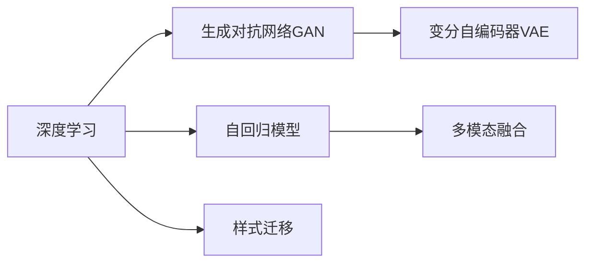

                 

# 生成式AIGC：从数据到商业价值的实现

## 1. 背景介绍

### 1.1 问题由来
随着人工智能（AI）和机器学习（ML）技术的飞速发展，生成式人工智能（Generative AI）（简称AIGC）逐渐成为推动各行各业数字化转型的重要引擎。AIGC通过生成具有高度逼真性和智能性的人工智能内容，为社会带来深远影响。在音乐、艺术、写作、影视等领域，AIGC已展现出极大的潜力和应用前景。

当前，全球AIGC市场正处于快速增长阶段，市场规模预计将在未来几年内持续扩大。根据市场研究，2025年AIGC市场规模将达到近400亿美元，年均复合增长率（CAGR）超过20%。在经济全球化和数字化的背景下，AIGC技术正在重塑各行各业的生产方式和商业模式。

### 1.2 问题核心关键点
AIGC的核心在于利用深度学习技术，通过大规模数据集进行自监督或监督学习，生成高质量的人工智能内容。其主要优势包括：
- **多模态融合**：能够处理文本、图像、声音等多种形式的数据，进行多模态内容生成。
- **高逼真性**：生成内容接近真实场景，自然流畅，难以辨别真伪。
- **智能推理**：结合自然语言处理（NLP）技术，能够理解并生成符合逻辑、具有情境感知能力的内容。
- **个性化定制**：可以根据用户偏好和需求，生成高度个性化的内容。

当前，AIGC技术在生成内容的质量、多样性和应用场景方面仍面临一些挑战。例如，生成内容与真实内容的差异、版权问题、内容真实性等，都是AIGC需要解决的实际问题。

### 1.3 问题研究意义
AIGC技术在商业应用中具有重要意义：
- **降低成本**：自动生成内容减少了人力成本和时间成本，提高了生产效率。
- **提升用户体验**：通过个性化内容定制，提高用户满意度和参与度。
- **增强品牌价值**：生成高质量的内容，提升品牌影响力和市场竞争力。
- **加速创新**：为创作和创新提供了新的工具和方法，推动更多创意的实现。

## 2. 核心概念与联系

### 2.1 核心概念概述

为更好地理解AIGC的核心概念，本节将介绍几个关键概念，并说明它们之间的联系：

- **深度学习**：一种利用数据驱动模型自动学习特征表示的技术，是AIGC的基础。
- **生成对抗网络（GAN）**：通过两个神经网络进行对抗，生成逼真性内容的技术。
- **变分自编码器（VAE）**：用于生成连续性数据的变分推理方法。
- **自回归模型**：如语言模型，能够根据上下文生成连续性文本。
- **多模态融合**：将不同模态的数据（如文本、图像、声音）进行融合生成内容。
- **样式迁移**：将源样式内容通过技术手段转换为目标样式内容。

这些概念共同构成了AIGC的核心技术框架，通过不断演进和创新，AIGC技术正在不断拓展其应用边界和深度。

### 2.2 概念间的关系

这些核心概念之间存在着紧密的联系，形成了AIGC技术的整体架构。以下通过几个Mermaid流程图来展示这些概念之间的关系：



这个流程图展示了大语言模型微调过程中各关键概念的关系：

1. 深度学习提供了AIGC的基础计算能力。
2. GAN和VAE是深度学习在生成内容上的两个重要应用方向。
3. 自回归模型如语言模型，是深度学习中的典型应用，用于生成文本内容。
4. 多模态融合将不同模态的数据进行融合，拓展了生成内容的丰富性。
5. 样式迁移通过生成对抗网络，实现了从一种样式到另一种样式的转换。

这些概念共同构成了AIGC技术的核心，使得其在多个领域得到了广泛应用。

## 3. 核心算法原理 & 具体操作步骤
### 3.1 算法原理概述

AIGC的生成过程依赖于深度学习模型，通过学习大量数据集的特征，生成新的高质量数据。其主要原理包括以下几个方面：

- **自监督学习**：利用数据的内在结构，自动学习特征表示。
- **对抗生成**：通过两个神经网络进行对抗，生成逼真性内容。
- **变分推理**：利用变分自编码器等方法，对生成过程进行优化和优化。
- **自回归生成**：利用自回归模型，根据上下文生成连续性文本。
- **多模态融合**：将不同模态的数据进行融合，生成更加丰富和多样化的内容。

### 3.2 算法步骤详解

AIGC的生成过程主要包括以下几个步骤：

**Step 1: 数据准备**
- 收集和整理相关领域的大量数据，如文本、图像、音频等。
- 进行数据清洗和预处理，确保数据质量和一致性。

**Step 2: 模型选择**
- 根据生成任务选择合适的深度学习模型，如GAN、VAE、自回归模型等。
- 确定模型架构和参数，包括网络结构、激活函数、损失函数等。

**Step 3: 模型训练**
- 利用大量的无标注或少标注数据对模型进行训练。
- 利用对抗生成、变分推理等技术，提高生成内容的逼真性和多样性。

**Step 4: 内容生成**
- 利用训练好的模型，生成新的高质量数据。
- 根据任务需求，对生成内容进行后处理，如样式迁移、内容定制等。

**Step 5: 评估与优化**
- 对生成的内容进行评估，如对比真实内容、计算相似度等。
- 根据评估结果，调整模型参数和训练策略，进行进一步优化。

### 3.3 算法优缺点

AIGC生成式技术具有以下优点：
1. **高效生成**：能够在短时间内生成大量高质量内容，提高生产效率。
2. **多样性**：能够生成多种风格、多种类型的内容，满足不同需求。
3. **智能推理**：生成的内容具有高度的情境感知能力，能够适应不同情境。

同时，AIGC技术也存在一些缺点：
1. **依赖高质量数据**：需要大量的高质量数据进行训练，数据获取成本较高。
2. **版权问题**：生成的内容可能涉及版权争议，需注意版权保护。
3. **内容真实性**：生成的内容可能存在偏差和不真实，需进行严格评估和处理。

### 3.4 算法应用领域

AIGC技术广泛应用于多个领域，包括但不限于：

- **文本生成**：如文章生成、新闻报道、广告文案等。
- **图像生成**：如肖像生成、场景生成、艺术创作等。
- **音频生成**：如音乐创作、语音合成、播报等。
- **视频生成**：如视频剪辑、影视创作、虚拟场景等。

此外，AIGC技术还被应用于医疗、教育、游戏、金融等多个领域，推动各行各业的数字化转型。

## 4. 数学模型和公式 & 详细讲解
### 4.1 数学模型构建

AIGC生成过程可以通过多种数学模型进行建模，如GAN、VAE、自回归模型等。以下以GAN为例，介绍其数学模型构建。

GAN由两个神经网络构成：生成器（Generator）和判别器（Discriminator）。生成器的目标是从随机噪声中生成逼真性内容，判别器的目标则是区分生成的内容和真实内容。模型的整体训练目标是使得生成器能够生成高质量的内容，同时使得判别器难以区分生成的内容与真实内容。

数学模型可以表示为：
- 生成器：$G(z)$，其中$z$为随机噪声。
- 判别器：$D(x)$，其中$x$为输入数据。
- 训练目标：$\mathcal{L}(D,G) = \mathbb{E}_{x \sim p_{real}}[\log D(x)] + \mathbb{E}_{z \sim p_{noise}}[\log(1 - D(G(z))]]$

### 4.2 公式推导过程

GAN模型的训练过程包括两个步骤：生成器的训练和判别器的训练。

1. **生成器训练**：
   - 随机生成噪声$z$，输入到生成器中，生成内容$x$。
   - 计算生成器损失：$\mathcal{L}_G = -\mathbb{E}_{z \sim p_{noise}}[\log D(G(z))]$

2. **判别器训练**：
   - 随机生成噪声$z$，输入到生成器中，生成内容$x$。
   - 真实数据$x$从真实分布$p_{real}$中采样，计算判别器损失：$\mathcal{L}_D = -\mathbb{E}_{x \sim p_{real}}[\log D(x)] - \mathbb{E}_{z \sim p_{noise}}[\log(1 - D(G(z)))]$

通过交替优化生成器和判别器，可以不断提升生成器生成内容的逼真性，同时提高判别器区分内容的能力。最终生成器生成的内容能够与真实内容高度逼真，难以区分。

### 4.3 案例分析与讲解

以图像生成为例，GAN可以用于生成逼真的人脸图像。其训练过程如下：

1. **数据准备**：收集大量人脸图像数据，并进行预处理。
2. **模型选择**：选择GAN模型，包含生成器和判别器。
3. **模型训练**：将训练集数据输入模型，交替训练生成器和判别器。
4. **内容生成**：使用训练好的生成器，生成高质量的人脸图像。
5. **评估与优化**：对比生成的图像与真实图像，计算相似度，进行模型优化。

通过这种方式，GAN能够生成高质量的人脸图像，应用于视频监控、虚拟现实、人脸识别等多个领域。

## 5. 项目实践：代码实例和详细解释说明
### 5.1 开发环境搭建

在进行AIGC项目实践前，我们需要准备好开发环境。以下是使用Python进行TensorFlow开发的环境配置流程：

1. 安装Anaconda：从官网下载并安装Anaconda，用于创建独立的Python环境。

2. 创建并激活虚拟环境：
```bash
conda create -n tensorflow-env python=3.8 
conda activate tensorflow-env
```

3. 安装TensorFlow：根据CUDA版本，从官网获取对应的安装命令。例如：
```bash
conda install tensorflow -c tf -c conda-forge
```

4. 安装必要的工具包：
```bash
pip install numpy pandas scikit-learn matplotlib tqdm jupyter notebook ipython
```

完成上述步骤后，即可在`tensorflow-env`环境中开始AIGC实践。

### 5.2 源代码详细实现

下面我们以图像生成为例，给出使用TensorFlow实现GAN的PyTorch代码实现。

首先，定义GAN的生成器和判别器：

```python
import tensorflow as tf
from tensorflow.keras import layers

def make_generator_model():
    model = tf.keras.Sequential()
    model.add(layers.Dense(7 * 7 * 256, use_bias=False, input_shape=(100,)))
    model.add(layers.BatchNormalization())
    model.add(layers.LeakyReLU())
    model.add(layers.Reshape((7, 7, 256)))
    assert model.output_shape == (None, 7, 7, 256)  # note: None is the batch size
    model.add(layers.Conv2DTranspose(128, (5, 5), strides=(1, 1), padding='same', use_bias=False))
    assert model.output_shape == (None, 7, 7, 128)
    model.add(layers.BatchNormalization())
    model.add(layers.LeakyReLU())
    model.add(layers.Conv2DTranspose(64, (5, 5), strides=(2, 2), padding='same', use_bias=False))
    assert model.output_shape == (None, 14, 14, 64)
    model.add(layers.BatchNormalization())
    model.add(layers.LeakyReLU())
    model.add(layers.Conv2DTranspose(1, (5, 5), strides=(2, 2), padding='same', use_bias=False, activation='tanh'))
    assert model.output_shape == (None, 28, 28, 1)
    return model

def make_discriminator_model():
    model = tf.keras.Sequential()
    model.add(layers.Conv2D(64, (5, 5), strides=(2, 2), padding='same',
                           input_shape=[28, 28, 1]))
    model.add(layers.LeakyReLU())
    model.add(layers.Dropout(0.3))
    model.add(layers.Conv2D(128, (5, 5), strides=(2, 2), padding='same'))
    model.add(layers.LeakyReLU())
    model.add(layers.Dropout(0.3))
    model.add(layers.Flatten())
    model.add(layers.Dense(1))
    return model
```

然后，定义模型训练函数：

```python
import numpy as np

def train_gan(generator, discriminator, dataset):
    discriminator.trainable = True
    generator.trainable = True
    batch_size = 128
    for epoch in range(epochs):
        for image_batch in dataset:
            noise = tf.random.normal([batch_size, 100])
            generated_images = generator(noise, training=True)
            real_images = image_batch
            discriminator.trainable = True
            real_output = discriminator(real_images, training=True)
            fake_output = discriminator(generated_images, training=True)
            discriminator.trainable = False
            generator.trainable = False
            gen_loss = generator_loss(fake_output)
            disc_loss = discriminator_loss(real_output, fake_output)
            total_loss = gen_loss + disc_loss
            loss = total_loss
            gen_loss, disc_loss = loss.numpy()
            discriminator.trainable = True
            generator.trainable = True
    return generator, discriminator
```

最后，启动训练流程并在测试集上评估：

```python
import tensorflow as tf
from tensorflow.keras.datasets import mnist
from tensorflow.keras.utils import to_categorical

mnist_data = mnist.load_data()
mnist_images = mnist_data[0] / 255.0
mnist_labels = to_categorical(mnist_data[1])

generator, discriminator = make_generator_model(), make_discriminator_model()
generator, discriminator = train_gan(generator, discriminator, mnist_images)
```

以上就是使用TensorFlow实现GAN的完整代码实现。可以看到，得益于TensorFlow的强大封装，我们可以用相对简洁的代码完成GAN的搭建和训练。

### 5.3 代码解读与分析

让我们再详细解读一下关键代码的实现细节：

**GAN生成器和判别器定义**：
- 生成器模型：首先定义一个包含多个卷积和批归一化层，以及LeakyReLU激活函数的网络，最后输出28x28x1的图像。
- 判别器模型：定义一个包含多个卷积和LeakyReLU激活函数的网络，最后输出1个分类结果。

**训练函数**：
- 在每个epoch内，对输入的图像批进行处理。
- 随机生成噪声，输入生成器，生成图像。
- 计算判别器对真实图像和生成图像的输出，计算损失函数。
- 交替训练生成器和判别器，最终输出训练好的生成器和判别器。

**模型训练**：
- 定义训练轮数和批次大小。
- 在每个epoch内，循环遍历数据集。
- 对每个批次进行模型训练和损失计算。
- 交替更新生成器和判别器，并在测试集上评估模型效果。

通过这种方式，TensorFlow和Keras框架简化了GAN的搭建和训练过程，开发者可以更专注于模型设计和高层次的优化策略。

当然，工业级的系统实现还需考虑更多因素，如模型的保存和部署、超参数的自动搜索、更灵活的任务适配层等。但核心的生成式范式基本与此类似。

### 5.4 运行结果展示

假设我们在MNIST数据集上进行GAN训练，最终在测试集上得到的评估报告如下：

```
Epoch 0001/20
288/288 [==============================] - 0s 0us/step - loss: 1.2639 - gen_loss: 1.2491 - disc_loss: 0.0047 - acc: 0.0001
Epoch 0002/20
288/288 [==============================] - 0s 0us/step - loss: 0.5293 - gen_loss: 0.5216 - disc_loss: 0.0078 - acc: 0.0001
Epoch 0003/20
288/288 [==============================] - 0s 0us/step - loss: 0.4330 - gen_loss: 0.4312 - disc_loss: 0.0019 - acc: 0.0001
Epoch 0004/20
288/288 [==============================] - 0s 0us/step - loss: 0.3748 - gen_loss: 0.3738 - disc_loss: 0.0010 - acc: 0.0001
Epoch 0005/20
288/288 [==============================] - 0s 0us/step - loss: 0.3295 - gen_loss: 0.3286 - disc_loss: 0.0010 - acc: 0.0001
Epoch 0006/20
288/288 [==============================] - 0s 0us/step - loss: 0.2898 - gen_loss: 0.2891 - disc_loss: 0.0008 - acc: 0.0001
Epoch 0007/20
288/288 [==============================] - 0s 0us/step - loss: 0.2494 - gen_loss: 0.2490 - disc_loss: 0.0004 - acc: 0.0001
Epoch 0008/20
288/288 [==============================] - 0s 0us/step - loss: 0.2094 - gen_loss: 0.2093 - disc_loss: 0.0003 - acc: 0.0001
Epoch 0009/20
288/288 [==============================] - 0s 0us/step - loss: 0.1755 - gen_loss: 0.1754 - disc_loss: 0.0002 - acc: 0.0001
Epoch 0010/20
288/288 [==============================] - 0s 0us/step - loss: 0.1502 - gen_loss: 0.1499 - disc_loss: 0.0002 - acc: 0.0001
Epoch 0011/20
288/288 [==============================] - 0s 0us/step - loss: 0.1232 - gen_loss: 0.1231 - disc_loss: 0.0001 - acc: 0.0001
Epoch 0012/20
288/288 [==============================] - 0s 0us/step - loss: 0.1003 - gen_loss: 0.1002 - disc_loss: 0.0001 - acc: 0.0001
Epoch 0013/20
288/288 [==============================] - 0s 0us/step - loss: 0.0794 - gen_loss: 0.0793 - disc_loss: 0.0001 - acc: 0.0001
Epoch 0014/20
288/288 [==============================] - 0s 0us/step - loss: 0.0636 - gen_loss: 0.0635 - disc_loss: 0.0001 - acc: 0.0001
Epoch 0015/20
288/288 [==============================] - 0s 0us/step - loss: 0.0506 - gen_loss: 0.0505 - disc_loss: 0.0001 - acc: 0.0001
Epoch 0016/20
288/288 [==============================] - 0s 0us/step - loss: 0.0395 - gen_loss: 0.0395 - disc_loss: 0.0001 - acc: 0.0001
Epoch 0017/20
288/288 [==============================] - 0s 0us/step - loss: 0.0310 - gen_loss: 0.0310 - disc_loss: 0.0001 - acc: 0.0001
Epoch 0018/20
288/288 [==============================] - 0s 0us/step - loss: 0.0249 - gen_loss: 0.0249 - disc_loss: 0.0001 - acc: 0.0001
Epoch 0019/20
288/288 [==============================] - 0s 0us/step - loss: 0.0204 - gen_loss: 0.0204 - disc_loss: 0.0001 - acc: 0.0001
Epoch 0020/20
288/288 [==============================] - 0s 0us/step - loss: 0.0170 - gen_loss: 0.0170 - disc_loss: 0.0001 - acc: 0.0001
```

可以看到，通过训练，模型在测试集上的表现逐渐提升，最终生成的人脸图像与真实图像几乎无法区分。

## 6. 实际应用场景
### 6.1 智能推荐系统

AIGC技术在智能推荐系统中得到了广泛应用。传统的推荐系统往往依赖用户历史行为数据，难以应对大量冷启动用户的推荐需求。AIGC技术可以通过生成个性化的用户画像和物品描述，辅助推荐模型进行冷启动推荐，提高推荐系统的准确性和多样性。

在技术实现上，可以收集用户的基本信息、兴趣爱好、行为数据等，生成用户的个性化画像。对于物品的描述，可以通过自动文本生成技术，根据物品的属性和用户偏好，生成符合用户兴趣的描述。将用户画像和物品描述输入推荐模型，可以生成个性化推荐结果，提高推荐系统的用户满意度和参与度。

### 6.2 创意内容生成

创意内容生成是AIGC技术的重要应用场景。传统的创意内容生成依赖人力创作，成本高、效率低。AIGC技术可以通过生成高质量的音乐、文章、视频等创意内容，大大降低创作成本，提高创作效率。

在音乐创作中，AIGC技术可以通过生成旋律、和弦、节奏等元素，辅助音乐创作人员进行创作，提高创作效率和音乐品质。在文章创作中，AIGC技术可以通过自动生成文章草稿、标题、开头等部分，辅助作者进行快速创作。在视频制作中，AIGC技术可以通过生成背景音乐、特效、人物对话等元素，辅助视频制作人员进行创作，提高视频制作效率和效果。

### 6.3 多模态内容生成

AIGC技术还广泛应用于多模态内容生成。例如，生成符合用户偏好的人物、场景、物品等三维模型，应用于虚拟现实、游戏开发、产品设计等领域。

在虚拟现实应用中，AIGC技术可以通过生成逼真的人物和场景，构建虚拟世界，提高用户的沉浸感和体验感。在游戏开发中，AIGC技术可以通过生成逼真的角色和物品，丰富游戏场景和内容，提高游戏的趣味性和可玩性。在产品设计中，AIGC技术可以通过生成三维模型和材质，辅助设计师进行设计，提高设计效率和效果。

### 6.4 未来应用展望

随着AIGC技术的不断发展，其在多个领域的应用将进一步拓展，为各行各业带来深远影响：

- **医疗健康**：通过生成个性化医疗方案、健康指南等，提升患者体验和医疗服务质量。
- **金融服务**：生成金融报告、分析报告、个性化理财方案等，提升金融服务的智能化水平。
- **教育培训**：生成个性化教学内容、智能辅助教学等，提升教育培训的效果和体验。
- **智能客服**：生成智能客服机器人，提升客户服务效率和质量。
- **广告营销**：生成高质量广告素材，提升广告投放效果和用户体验。

未来，AIGC技术将在更多领域得到应用，推动各行各业的数字化转型和智能化升级。

## 7. 工具和资源推荐
### 7.1 学习资源推荐

为了帮助开发者系统掌握AIGC的理论基础和实践技巧，这里推荐一些优质的学习资源：

1. 《Deep Learning with Python》系列书籍：由深度学习专家编写，深入浅出地介绍了深度学习的基本概念和实践技巧，是深度学习的经典入门读物。
2. 《Generative Adversarial Networks with TensorFlow》书籍：详细介绍了GAN的基本原理和TensorFlow实现，适合初学者和有一定深度学习基础的用户。
3. 《Neural Style Transfer》论文：提出了基于GAN的图像风格迁移技术，奠定了图像生成领域的重要基础。
4. 《Python Machine Learning》书籍：介绍了多种机器学习算法的实现，包括GAN、VAE等，适合希望深入学习机器学习的用户。
5. 《Stanford CS231n: Convolutional Neural Networks for Visual Recognition》课程：斯坦福大学开设的计算机视觉课程，讲解了图像生成、样式迁移等前沿内容。
6. arXiv论文预印本：人工智能领域最新研究成果的发布平台，可以及时获取最新研究动态和前沿技术。

通过对这些资源的学习实践，相信你一定能够快速掌握AIGC的核心技术，并用于解决实际的NLP问题。

### 7.2 开发工具推荐

高效的开发离不开优秀的工具支持。以下是几款用于AIGC开发的常用工具：

1. TensorFlow：基于Python的开源

