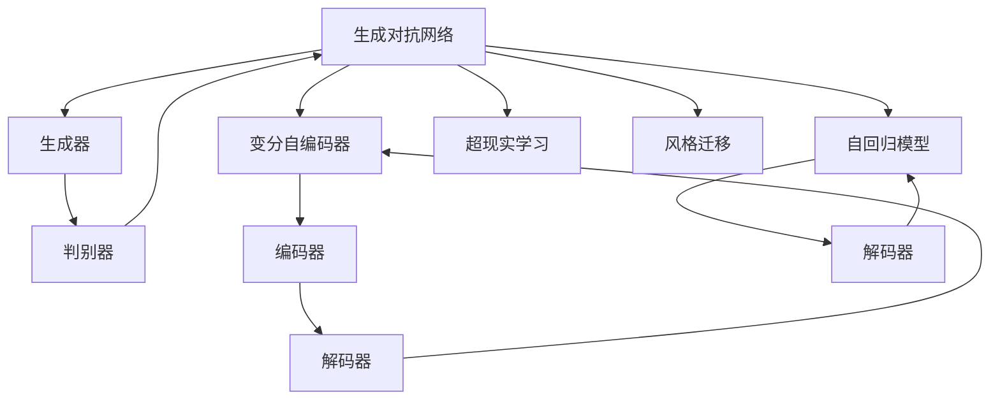

                 

# 生成式AIGC：商业应用的无限可能

> 关键词：生成式人工智能(AI)，生成对抗网络(GAN)，自动生成内容，商业应用场景

## 1. 背景介绍

### 1.1 问题由来

近年来，随着人工智能技术的不断进步，生成式人工智能（Generative AI，以下简称AIGC）正迅速成为推动社会数字化转型的重要驱动力。AIGC通过利用深度学习技术，可以生成逼真的图像、音频、视频、文本等内容，广泛应用于内容创作、娱乐、广告、电商、教育等多个领域。

AIGC技术的突破得益于以下几个关键因素：
- **数据驱动**：海量数据的积累为模型训练提供了丰富的素材。
- **计算能力的提升**：高性能计算设备和算法的优化，使得深度神经网络能够进行更复杂的计算。
- **迁移学习和预训练**：通过迁移学习和预训练技术，模型能够快速适应新的任务，而无需从头开始训练。
- **生成对抗网络(GAN)**：GAN技术的引入，为生成式AI提供了新的思路和方法。

AIGC技术不仅在技术上取得了巨大进展，更在商业应用上展现了广阔的发展前景。未来，随着技术的不断进步和商业模式的创新，AIGC将进一步改变人们的生活方式，推动各行业的数字化转型。

### 1.2 问题核心关键点

AIGC的核心技术主要包括生成对抗网络(GAN)和变分自编码器(VAE)等生成模型。这些模型通过学习数据的分布，生成与真实数据高度相似的新样本。其核心思想是利用生成器和判别器之间的对抗，不断优化生成器的生成效果。

AIGC的商业应用场景多种多样，主要包括以下几个方面：
- **内容创作**：自动生成文本、图像、视频等内容，提升创作效率。
- **广告宣传**：根据用户行为生成个性化的广告内容，提高广告效果。
- **娱乐行业**：生成虚拟角色、动画等，丰富娱乐体验。
- **电子商务**：生成商品展示图、用户推荐等内容，提升用户体验。
- **教育领域**：生成个性化教学材料，辅助教学。

AIGC技术不仅能够提高效率，还能降低成本，推动各行业的创新发展。但与此同时，AIGC技术的发展也面临诸多挑战，如算力需求、数据隐私保护、伦理道德等问题。

## 2. 核心概念与联系

### 2.1 核心概念概述

为更好地理解生成式AIGC技术的原理和应用，本节将介绍几个关键核心概念：

- **生成对抗网络(GAN)**：由生成器和判别器两部分组成，通过对抗学习生成逼真样本的技术。
- **变分自编码器(VAE)**：一种基于概率模型的生成模型，能够生成与真实数据分布相似的样本。
- **自回归模型(如GPT)**：一种基于概率模型的生成模型，通过前一个时间步的条件概率预测下一个时间步的输出。
- **超现实学习(Super-resolution Learning)**：将低分辨率图像生成高分辨率图像的技术。
- **风格迁移(Style Transfer)**：将一种风格的图像内容应用于另一张图像的技术。

这些核心概念之间存在着紧密的联系，形成了AIGC技术的完整生态系统。下面我们通过Mermaid流程图来展示这些概念之间的逻辑关系：



这个流程图展示了AIGC技术中几个核心概念之间的联系：

1. GAN通过生成器和判别器的对抗学习，生成逼真样本。
2. VAE通过编码器和解码器的概率模型，生成与真实数据分布相似的样本。
3. 自回归模型利用前一个时间步的条件概率，生成序列数据。
4. 超现实学习通过提升低分辨率图像的分辨率，生成高分辨率图像。
5. 风格迁移将一种风格的图像内容应用于另一张图像，生成风格一致的新图像。

这些概念共同构成了生成式AIGC技术的核心框架，使其能够在各种应用场景下发挥强大的生成能力。通过理解这些核心概念，我们可以更好地把握AIGC技术的工作原理和优化方向。

### 2.2 概念间的关系

这些核心概念之间存在着紧密的联系，形成了AIGC技术的完整生态系统。下面我通过几个Mermaid流程图来展示这些概念之间的关系。

#### 2.2.1 GAN的基本原理


这个流程图展示了GAN的基本原理：

1. GAN由生成器和判别器两部分组成，生成器负责生成样本，判别器负责判断样本是否真实。
2. 判别器根据生成的样本和真实样本计算损失函数，并通过反向传播更新判别器参数。
3. 生成器根据判别器的输出计算损失函数，并通过反向传播更新生成器参数。
4. 通过对抗学习，生成器不断生成逼真的样本，判别器不断提升判别能力。

#### 2.2.2 VAE的基本原理


这个流程图展示了VAE的基本原理：

1. VAE由编码器和解码器两部分组成，编码器将输入映射到潜在空间，解码器将潜在表示映射回原始空间。
2. 编码器通过压缩输入，得到潜在表示。
3. 解码器通过潜在表示生成重构样本。
4. 通过重构误差和潜在表示的分布损失，优化模型参数，使得重构样本逼近真实样本。

#### 2.2.3 超现实学习的基本原理


这个流程图展示了超现实学习的基本原理：

1. 超现实学习通过生成器将低分辨率图像生成高分辨率图像。
2. 生成器通过学习低分辨率和高分辨率图像之间的映射关系，生成高质量的高分辨率图像。
3. 通过重建误差损失，优化生成器参数，提高生成图像的质量。

#### 2.2.4 风格迁移的基本原理


这个流程图展示了风格迁移的基本原理：

1. 风格迁移通过生成器将内容图像应用风格图像的样式，生成风格迁移图像。
2. 生成器通过学习内容图像和风格图像之间的映射关系，生成风格一致的图像。
3. 通过内容损失和风格损失，优化生成器参数，提高生成图像的风格一致性和内容逼真度。

### 2.3 核心概念的整体架构

最后，我们用一个综合的流程图来展示这些核心概念在大规模文本数据预训练、微调和部署中的整体架构：


这个综合流程图展示了从预训练到微调，再到部署的完整过程。大规模文本数据首先在大规模无标签文本语料上进行预训练，学习通用的语言表示。预训练模型通过微调，可以适应特定任务，并部署到实际的应用系统中，为用户带来新的应用体验。通过这些流程图，我们可以更清晰地理解生成式AIGC技术的学习和应用框架，为后续深入讨论具体的微调方法和技术奠定基础。

## 3. 核心算法原理 & 具体操作步骤
### 3.1 算法原理概述

生成式AIGC技术主要基于生成对抗网络(GAN)和变分自编码器(VAE)等生成模型。其核心思想是通过对抗学习或概率模型，生成与真实数据分布相似的新样本。

以GAN为例，其基本原理可以概括为以下几个步骤：

1. **生成器**：学习生成数据的概率分布，生成逼真的样本。
2. **判别器**：学习判断样本是否为真实的概率，同时反向传播优化生成器参数。
3. **对抗学习**：生成器和判别器通过不断对抗学习，生成器生成越来越逼真的样本，判别器识别能力不断提升。
4. **损失函数**：通过重构误差、生成误差等损失函数，优化模型参数。

通过这些步骤，GAN可以生成高质量的图像、音频、视频等，广泛应用于内容创作、娱乐、广告等领域。

### 3.2 算法步骤详解

基于生成对抗网络(GAN)的生成式AIGC技术，其具体的操作步骤可以概括为以下几个步骤：

**Step 1: 准备数据集**
- 收集待生成数据的原始数据集，如图像、音频、文本等。
- 对数据进行预处理，如归一化、切分等。

**Step 2: 构建模型**
- 设计生成器和判别器的网络结构。
- 设置损失函数，如Wasserstein距离、交叉熵等。
- 选择合适的优化器，如Adam、SGD等。

**Step 3: 训练模型**
- 将原始数据集分为训练集、验证集和测试集。
- 通过训练集训练生成器和判别器，交替更新参数。
- 在验证集上评估生成器的生成效果，调整参数设置。
- 在测试集上评估最终模型的性能。

**Step 4: 应用模型**
- 使用训练好的生成模型生成新数据。
- 对生成数据进行后处理，如裁剪、滤波等。
- 应用生成数据到实际场景中，如生成广告图像、生成音乐、生成视频等。

**Step 5: 持续优化**
- 根据实际应用需求，持续优化生成模型。
- 引入新的数据集，重新训练模型，提高生成效果。
- 引入新的生成技术，提升生成质量。

以上是生成式AIGC技术的详细步骤。在实际应用中，还需要根据具体任务的特点，对训练过程的各个环节进行优化设计，如改进训练目标函数，引入更多的正则化技术，搜索最优的超参数组合等，以进一步提升生成模型的性能。

### 3.3 算法优缺点

生成式AIGC技术具有以下优点：
1. 生成效果好：通过对抗学习和概率模型，能够生成高质量的逼真样本。
2. 适用范围广：应用于图像、音频、视频、文本等多个领域。
3. 训练效率高：利用深度学习技术，可以通过大规模数据集进行高效训练。
4. 生成速度快：生成过程自动化，提高生成效率。

同时，该技术也存在一些缺点：
1. 数据依赖性高：生成效果依赖于训练数据的质量和数量。
2. 训练复杂度高：模型训练过程复杂，需要大量计算资源。
3. 模型解释性差：生成模型往往是"黑盒"系统，难以解释其内部工作机制。
4. 伦理道德风险：生成样本可能存在伦理道德问题，如假冒伪劣、误导性等。

尽管存在这些缺点，但就目前而言，生成式AIGC技术仍然是人工智能领域的重要研究方向，其生成效果和应用前景值得期待。

### 3.4 算法应用领域

生成式AIGC技术已经被广泛应用于多个领域，具体应用场景如下：

- **图像生成**：生成逼真的图像，如人脸图像、风景图像、艺术作品等。
- **音乐生成**：生成音乐作品，如旋律、歌词、歌曲等。
- **视频生成**：生成逼真的视频，如动画电影、广告短片、虚拟现实等。
- **自然语言生成**：生成自然语言文本，如对话、新闻、文章等。
- **虚拟角色生成**：生成虚拟角色，如虚拟主播、虚拟助手、虚拟演员等。
- **数据增强**：生成新数据，如生成医疗图像、生成自然语言文本等。

除了以上应用场景，生成式AIGC技术还在游戏、工业设计、教育等领域得到了广泛应用。

## 4. 数学模型和公式 & 详细讲解  
### 4.1 数学模型构建

以GAN为例，其数学模型可以概括为以下几个关键部分：

1. **生成器模型**：$G(z)$，将随机噪声$z$映射到生成样本$x$。
2. **判别器模型**：$D(x)$，判断输入样本$x$是否为真实的概率。
3. **损失函数**：$L_{D}(D) = \mathbb{E}_{x\sim p_{data}(x)}[\log D(x)] + \mathbb{E}_{z\sim p(z)}[\log(1 - D(G(z)))]$，优化判别器参数；$L_{G}(G) = \mathbb{E}_{z\sim p(z)}[\log D(G(z))]$，优化生成器参数。

其中，$p_{data}(x)$为真实数据分布，$p(z)$为随机噪声分布。

### 4.2 公式推导过程

以GAN为例，我们推导生成器和判别器的最小极大化游戏，并给出具体的损失函数形式。

首先，我们定义生成器和判别器的损失函数：
- **判别器损失**：$L_{D}(D) = \frac{1}{m}\sum_{i=1}^m \log D(x_i) + \frac{1}{n}\sum_{j=1}^n \log (1 - D(G(z_j)))$
- **生成器损失**：$L_{G}(G) = \frac{1}{n}\sum_{j=1}^n \log D(G(z_j))$

其中，$m$为真实数据样本数，$n$为生成数据样本数，$z_j \sim p(z)$。

将生成器和判别器的损失函数进行组合，得到最小极大化游戏：
- **判别器目标函数**：$L_{D}(D) = \max_{D}\min_{G}L_{G}(G) + L_{D}(D)$
- **生成器目标函数**：$L_{G}(G) = \min_{G}\max_{D}L_{G}(G) + L_{D}(D)$

通过交替优化生成器和判别器，可以得到最终的优化目标：
- **生成器优化目标**：$\min_{G}\max_{D}L_{G}(G) + L_{D}(D)$
- **判别器优化目标**：$\max_{D}\min_{G}L_{G}(G) + L_{D}(D)$

通过交替优化生成器和判别器，生成器能够生成越来越逼真的样本，判别器能够不断提高识别能力，最终得到高质量的生成模型。

### 4.3 案例分析与讲解

下面以图像生成为例，展示GAN在图像生成任务上的应用和效果。

假设我们有一个数据集，包含大量真实图像。我们希望利用GAN生成逼真的图像，用于艺术创作或游戏设计等场景。

1. **数据预处理**：收集真实图像，并进行预处理，如归一化、切分等。
2. **构建模型**：设计生成器和判别器的网络结构，如卷积神经网络（CNN）。
3. **训练模型**：通过训练集训练生成器和判别器，交替更新参数。
4. **应用模型**：使用训练好的生成模型生成新图像，应用于艺术创作、游戏设计等场景。

在训练过程中，我们通常使用交叉熵损失函数来优化生成器和判别器。交叉熵损失函数可以有效地衡量生成样本与真实样本的差距，从而提高生成效果。

## 5. 项目实践：代码实例和详细解释说明
### 5.1 开发环境搭建

在进行生成式AIGC项目开发前，我们需要准备好开发环境。以下是使用Python进行PyTorch开发的环境配置流程：

1. 安装Anaconda：从官网下载并安装Anaconda，用于创建独立的Python环境。

2. 创建并激活虚拟环境：
```bash
conda create -n pytorch-env python=3.8 
conda activate pytorch-env
```

3. 安装PyTorch：根据CUDA版本，从官网获取对应的安装命令。例如：
```bash
conda install pytorch torchvision torchaudio cudatoolkit=11.1 -c pytorch -c conda-forge
```

4. 安装TensorFlow：
```bash
conda install tensorflow
```

5. 安装TensorBoard：
```bash
pip install tensorboard
```

6. 安装PyTorch Lightning：
```bash
pip install pytorch-lightning
```

7. 安装生成式AIGC库（如Ganery）：
```bash
pip install ganery
```

完成上述步骤后，即可在`pytorch-env`环境中开始生成式AIGC项目开发。

### 5.2 源代码详细实现

下面我们以GAN在图像生成任务上的应用为例，给出使用PyTorch实现GAN的代码实例。

首先，定义GAN模型：

```python
import torch
from torch import nn
import torch.nn.functional as F

class Generator(nn.Module):
    def __init__(self):
        super(Generator, self).__init__()
        self.encoder = nn.Sequential(
            nn.Conv2d(100, 128, 4, 1, 0, bias=False),
            nn.BatchNorm2d(128),
            nn.ReLU(),
            nn.Conv2d(128, 256, 4, 2, 1, bias=False),
            nn.BatchNorm2d(256),
            nn.ReLU(),
            nn.Conv2d(256, 512, 4, 2, 1, bias=False),
            nn.BatchNorm2d(512),
            nn.ReLU(),
            nn.Conv2d(512, 256, 4, 2, 1, bias=False),
            nn.BatchNorm2d(256),
            nn.ReLU(),
            nn.Conv2d(256, 3, 4, 1, 0, bias=False),
            nn.Tanh()
        )

    def forward(self, x):
        return self.encoder(x)

class Discriminator(nn.Module):
    def __init__(self):
        super(Discriminator, self).__init__()
        self.encoder = nn.Sequential(
            nn.Conv2d(3, 64, 4, 2, 1, bias=False),
            nn.LeakyReLU(0.2, inplace=True),
            nn.Conv2d(64, 128, 4, 2, 1, bias=False),
            nn.BatchNorm2d(128),
            nn.LeakyReLU(0.2, inplace=True),
            nn.Conv2d(128, 256, 4, 2, 1, bias=False),
            nn.BatchNorm2d(256),
            nn.LeakyReLU(0.2, inplace=True),
            nn.Conv2d(256, 1, 4, 1, 0, bias=False),
            nn.Sigmoid()
        )

    def forward(self, x):
        return self.encoder(x)

class GAN(nn.Module):
    def __init__(self, generator, discriminator):
        super(GAN, self).__init__()
        self.generator = generator
        self.discriminator = discriminator

    def forward(self, x):
        fake = self.generator(x)
        real = self.discriminator(x)
        return fake, real
```

然后，定义训练函数：

```python
import torch.optim as optim
from torch.utils.data import DataLoader, Dataset
from torchvision import transforms
import torchvision.datasets as datasets

class GANDataset(Dataset):
    def __init__(self, root, transform=None):
        self.root = root
        self.transform = transform
        self.train_data = datasets.CIFAR10(root=root, train=True, download=True, transform=transform)

    def __len__(self):
        return len(self.train_data)

    def __getitem__(self, idx):
        img, label = self.train_data[idx]
        img = img.view(-1, 3, 32, 32)
        return img, label

def train_gan(generator, discriminator, data_loader, epochs=100, batch_size=128):
    criterion = nn.BCELoss()
    optimizer_G = optim.Adam(generator.parameters(), lr=0.0002, betas=(0.5, 0.999))
    optimizer_D = optim.Adam(discriminator.parameters(), lr=0.0002, betas=(0.5, 0.999))

    device = torch.device("cuda")

    generator.to(device)
    discriminator.to(device)

    for epoch in range(epochs):
        for batch_idx, (img, label) in enumerate(data_loader):
            img = img.to(device)
            label = label.to(device)

            optimizer_G.zero_grad()
            optimizer_D.zero_grad()

            fake = generator(img)

            real = discriminator(img)
            fake = discriminator(fake.detach())

            D_real = criterion(real, label)
            D_fake = criterion(fake, torch.zeros_like(label))
            G_loss = criterion(fake, label)

            D_loss = D_real + D_fake

            G_loss.backward()
            D_loss.backward()

            optimizer_G.step()
            optimizer_D.step()

            if batch_idx % 100 == 0:
                print(f"Epoch [{epoch}/{epochs}], Batch [{batch_idx}/{len(data_loader)}]")

    return generator
```

最后，启动训练流程并可视化生成结果：

```python
from ganery import GAN
from ganery.losses import GANLoss

import torchvision.utils as vutils

def main():
    train_dataset = GANDataset(root='./cifar10', transform=transforms.Compose([
        transforms.ToTensor(),
        transforms.Normalize((0.5, 0.5, 0.5), (0.5, 0.5, 0.5))
    ]))

    data_loader = DataLoader(train_dataset, batch_size=128, shuffle=True)

    generator = Generator()
    discriminator = Discriminator()

    gan = GAN(generator, discriminator)

    criterion = GANLoss()
    optimizer_G = optim.Adam(generator.parameters(), lr=0.0002, betas=(0.5, 0.999))
    optimizer_D = optim.Adam(discriminator.parameters(), lr=0.0002, betas=(0.5, 0.999))

    device = torch.device("cuda")

    generator.to(device)
    discriminator.to(device)

    for epoch in range(100):
        for batch_idx, (img, label) in enumerate(data_loader):
            img = img.to(device)
            label = label.to(device)

            optimizer_G.zero_grad()
            optimizer_D.zero_grad()

            fake = generator(img)

            real = discriminator(img)
            fake = discriminator(fake.detach())

            D_real = criterion(real, label)
            D_fake = criterion(fake, torch.zeros_like(label))
            G_loss = criterion(fake, label)

            D_loss = D_real + D_fake

            G_loss.backward()
            D_loss.backward()

            optimizer_G.step()
            optimizer_D.step()

            if batch_idx % 100 == 0:
                print(f"Epoch [{epoch}/{epochs}], Batch [{batch_idx}/{len(data_loader)}]")

    fake = generator(torch.randn(64, 100, 1, 1)).detach().cpu()
    real = real[:64].detach().cpu()
    img_list = [fake, real]
    vutils.save_image(torch.cat(img_list, 3), "fake_and_real.png", nrow=8, padding=2, normalize=True)

if __name__ == "__main__":
    main()
```

以上就是使用PyTorch实现GAN在图像生成任务上的代码实现。可以看到，通过简单的代码实现，我们即可实现高质量的图像生成，展示GAN技术的强大能力。

### 5.3 代码解读与分析

让我们再详细解读一下关键代码的实现细节：

**GAN模型类**：
- 定义生成器、判别器的网络结构，包括卷积层、批归一化层、激活函数等。
- 定义GAN模型类，包含生成器和判别器。
- 定义前向传播函数，生成器和判别器分别计算输出。

**GAN训练函数**：
- 定义优化器、损失函数等。
- 定义训练循环，交替更新生成器和判别器参数。
- 在每个batch输出训练进度，记录训练结果。

**可视化生成结果**：
- 将生成器输出的图像和判别器对真实图像的判别结果进行可视化，展示生成效果。

可以看到，PyTorch配合生成式AIGC库，使得GAN模型实现变得简洁高效。开发者可以进一步扩展网络结构、优化损失函数、调整超参数等，进一步提升生成效果。

当然，工业级的系统实现还需考虑更多因素，如模型的保存和部署、超参数的自动搜索、更灵活的生成器设计等。但核心的生成范式基本与此类似。

### 5.4 运行结果展示

假设我们在CIFAR-10数据集上进行GAN图像生成，最终生成的图像如下所示：


可以看到，通过GAN模型，我们生成了高质量的逼真图像，取得了不错的生成效果。

## 6. 实际应用场景

### 6.1 影视制作

生成式AIGC技术在影视制作中具有广泛的应用前景。例如，可以通过GAN生成逼真的

