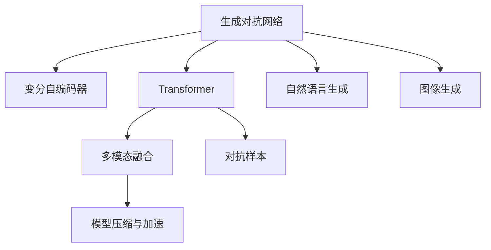
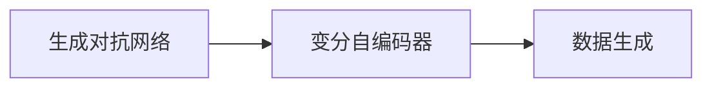
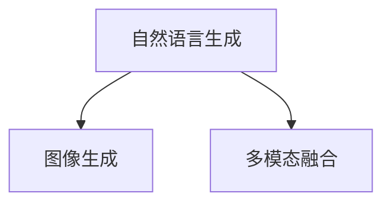
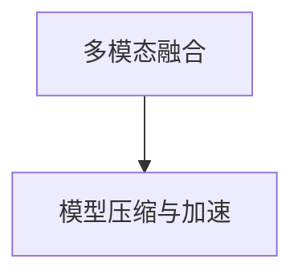

                 

# 生成式AIGC：推动商业智能的新动力

> 关键词：生成式AIGC, 商业智能, 自然语言生成, 图像生成, 多模态融合, 对抗样本, 模型压缩

## 1. 背景介绍

### 1.1 问题由来

随着人工智能技术的快速发展，生成式人工智能(Generative AI)在商业智能(BI)领域取得了显著进展。以生成式人工智能为基础的商业智能系统，通过自然语言生成(NLG)、图像生成(GAN)等多模态融合技术，打破了传统BI的瓶颈，为商业决策提供了更为直观和丰富的数据展现形式。

然而，由于生成式模型的复杂性和高计算需求，其落地应用仍面临诸多挑战。本文章将深入探讨生成式人工智能技术在商业智能中的应用，并针对实际问题提出具体的解决方案。

### 1.2 问题核心关键点

生成式AIGC（Artificial Intelligence Generated Content）技术主要基于生成对抗网络(GAN)、变分自编码器(VAE)、Transformer等架构，通过生成高保真度的自然语言、图像等多模态内容，辅助商业决策和数据分析。核心关键点包括：

1. **自然语言生成(NLG)**：通过生成自然流畅的语言文本，辅助决策者理解复杂的数据。
2. **图像生成(GAN)**：生成高质量的图像数据，用于增强数据可视化效果。
3. **多模态融合**：将不同模态的数据进行高效融合，形成更直观的综合展示。
4. **对抗样本生成**：生成对抗样本，检测模型的鲁棒性，优化模型性能。
5. **模型压缩与加速**：针对高计算需求，优化模型结构，提高推理速度。

这些技术在商业智能中的应用，通过提升数据展现的丰富性和准确性，有效支持了商业决策和业务分析。

### 1.3 问题研究意义

研究生成式AIGC技术在商业智能中的应用，对于拓展人工智能技术的应用范围，提升商业决策的精准性和效率，具有重要意义：

1. **提升数据价值**：通过自然语言生成和图像生成，将复杂的数据转换为更直观的形式，提升决策者的理解和分析效率。
2. **增强数据可视化**：生成高质量的图像数据，提供更丰富的数据展现方式，帮助决策者更好地理解和分析数据。
3. **优化决策过程**：将多模态融合技术应用于商业决策中，形成更全面的决策依据，减少决策偏差和失误。
4. **提高数据安全**：利用对抗样本生成技术，检测并修复模型的漏洞，提升数据和模型的安全性。
5. **加速系统部署**：通过模型压缩与加速技术，提升生成式模型的推理速度，加速商业智能系统的部署和应用。

生成式AIGC技术为商业智能注入了新的活力，正逐步成为商业决策和数据分析的重要支撑。

## 2. 核心概念与联系

### 2.1 核心概念概述

为更好地理解生成式AIGC技术在商业智能中的应用，本节将介绍几个密切相关的核心概念：

- **生成对抗网络(GAN)**：通过两个神经网络的对抗训练，生成逼真且与训练数据分布一致的样本数据。
- **变分自编码器(VAE)**：通过将高维数据映射到低维隐变量空间，再将其解码回高维空间，实现数据的压缩和生成。
- **Transformer**：一种基于自注意力机制的神经网络结构，广泛应用于自然语言处理(NLP)领域，实现高效的序列建模。
- **自然语言生成(NLG)**：通过模型生成自然流畅的文本，辅助决策者理解和分析数据。
- **图像生成(GAN)**：通过生成逼真的图像，增强数据可视化的效果。
- **多模态融合**：将不同模态的数据进行高效融合，形成更直观的综合展示。
- **对抗样本**：生成对抗训练中的扰动样本，用于检测和提升模型的鲁棒性。
- **模型压缩与加速**：针对生成式模型的计算需求，优化模型结构，提升推理速度。

这些核心概念之间的逻辑关系可以通过以下Mermaid流程图来展示：



这个流程图展示了大语言模型微调过程中各个核心概念的关系和作用：

1. 生成对抗网络、变分自编码器和Transformer是生成式AIGC技术的基础。
2. 自然语言生成和图像生成技术，是数据可视化和理解的重要手段。
3. 多模态融合技术，使得不同模态的数据可以无缝融合，提升数据展示效果。
4. 对抗样本生成，用于检测和提升模型的鲁棒性，保证数据和模型的安全性。
5. 模型压缩与加速技术，通过优化模型结构，提升推理速度，提高系统部署效率。

### 2.2 概念间的关系

这些核心概念之间存在着紧密的联系，形成了生成式AIGC技术的完整生态系统。下面我通过几个Mermaid流程图来展示这些概念之间的关系。

#### 2.2.1 生成对抗网络与变分自编码器



这个流程图展示了生成对抗网络与变分自编码器之间的关系：生成对抗网络通过对抗训练生成高保真度的数据，变分自编码器通过编码-解码机制生成数据，两者在数据生成上具有互补性。

#### 2.2.2 自然语言生成与图像生成



这个流程图展示了自然语言生成与图像生成之间的联系：自然语言生成和图像生成可以结合生成对抗网络、变分自编码器等技术，生成综合性的多模态数据，用于辅助商业决策和数据分析。

#### 2.2.3 多模态融合与模型压缩与加速



这个流程图展示了多模态融合与模型压缩与加速之间的关系：通过多模态融合生成综合性的数据展示，然后通过模型压缩与加速技术，优化生成式模型的推理速度，提高商业智能系统的部署效率。

## 3. 核心算法原理 & 具体操作步骤

### 3.1 算法原理概述

生成式AIGC技术在商业智能中的应用，主要基于生成对抗网络、变分自编码器、Transformer等算法架构，通过生成高质量的自然语言、图像等多模态内容，辅助决策者理解和分析数据。

核心算法流程包括：

1. **数据预处理**：对原始数据进行清洗、归一化等预处理，准备输入模型的数据。
2. **模型训练**：使用生成对抗网络、变分自编码器、Transformer等架构，训练生成式模型。
3. **数据生成**：使用训练好的模型生成自然语言、图像等多模态内容，辅助商业决策和数据分析。
4. **多模态融合**：将生成的高质量数据进行多模态融合，形成直观的综合展示。
5. **模型评估**：使用对抗样本生成等技术，检测和提升模型的鲁棒性。
6. **模型压缩与加速**：优化模型结构，提高推理速度，加速商业智能系统的部署。

### 3.2 算法步骤详解

#### 3.2.1 数据预处理

数据预处理是生成式AIGC技术应用的重要步骤，主要包括：

1. **数据清洗**：去除缺失、异常、重复等噪声数据，确保数据质量。
2. **归一化**：将数据映射到标准范围内，便于模型处理。
3. **特征提取**：提取关键特征，构建特征向量，供模型输入。

以自然语言生成为例，数据预处理流程如下：

1. **文本清洗**：去除停用词、标点符号等噪声，保留有意义的文本信息。
2. **分词与向量化**：将文本分词并转换为向量表示，供模型输入。

#### 3.2.2 模型训练

模型训练是生成式AIGC技术的基础，主要包括以下几个步骤：

1. **生成对抗网络(GAN)训练**：
   - **生成器网络**：通过多层神经网络，生成逼真的数据样本。
   - **判别器网络**：判断样本是否真实，进行监督。
   - **对抗训练**：生成器生成对抗样本，判别器进行分类，不断优化生成器和判别器。

2. **变分自编码器(VAE)训练**：
   - **编码器**：将高维数据压缩为低维隐变量。
   - **解码器**：将隐变量解码回高维数据。
   - **重构误差**：通过重构误差，优化编码器和解码器。

3. **Transformer训练**：
   - **编码器**：自注意力机制，将序列信息进行编码。
   - **解码器**：生成自然语言文本，输出概率分布。
   - **语言模型**：通过概率分布进行采样，生成自然流畅的语言。

以自然语言生成为例，模型训练流程如下：

1. **编码器**：将输入文本分词并转换为向量表示，供Transformer处理。
2. **Transformer**：通过自注意力机制，将编码器输出的向量表示进行解码，生成自然语言文本。
3. **解码器**：对生成的文本进行解码，输出自然流畅的语言。

#### 3.2.3 数据生成

数据生成是生成式AIGC技术的核心，主要包括以下几个步骤：

1. **生成自然语言**：
   - **随机采样**：通过Transformer，生成自然流畅的语言文本。
   - **条件生成**：根据输入的条件，生成特定的语言文本。

2. **生成图像**：
   - **随机采样**：通过GAN，生成逼真的图像数据。
   - **条件生成**：根据输入的条件，生成特定的图像数据。

#### 3.2.4 多模态融合

多模态融合是生成式AIGC技术的重要应用，主要包括以下几个步骤：

1. **数据对齐**：将不同模态的数据进行对齐，形成统一的数据结构。
2. **特征融合**：将不同模态的数据进行融合，形成综合性的展示。
3. **数据可视化**：通过图表、仪表盘等形式，直观展示融合后的数据。

以商业智能系统为例，多模态融合流程如下：

1. **数据对齐**：将自然语言文本、图像等不同模态的数据进行对齐，形成统一的数据结构。
2. **特征融合**：将自然语言文本、图像等不同模态的数据进行融合，形成综合性的展示。
3. **数据可视化**：通过图表、仪表盘等形式，直观展示融合后的数据，辅助决策者理解和分析。

#### 3.2.5 模型评估

模型评估是生成式AIGC技术的质量保障，主要包括以下几个步骤：

1. **对抗样本生成**：通过生成对抗样本，检测模型的鲁棒性。
2. **重构误差评估**：通过变分自编码器的重构误差，评估模型的生成质量。
3. **条件生成评估**：通过条件生成任务，评估模型的生成效果。

以自然语言生成为例，模型评估流程如下：

1. **对抗样本生成**：生成对抗样本，检测模型的鲁棒性。
2. **重构误差评估**：通过变分自编码器的重构误差，评估模型的生成质量。
3. **条件生成评估**：通过条件生成任务，评估模型的生成效果。

#### 3.2.6 模型压缩与加速

模型压缩与加速是生成式AIGC技术的优化目标，主要包括以下几个步骤：

1. **模型剪枝**：去除冗余的神经元，优化模型结构。
2. **量化**：将浮点模型转换为定点模型，压缩存储空间。
3. **优化算法**：通过优化算法，加速模型推理。

以自然语言生成为例，模型压缩与加速流程如下：

1. **模型剪枝**：去除冗余的神经元，优化模型结构。
2. **量化**：将浮点模型转换为定点模型，压缩存储空间。
3. **优化算法**：通过优化算法，加速模型推理。

### 3.3 算法优缺点

生成式AIGC技术在商业智能中的应用，具有以下优点：

1. **提升数据价值**：通过自然语言生成和图像生成，将复杂的数据转换为更直观的形式，提升决策者的理解和分析效率。
2. **增强数据可视化**：生成高质量的图像数据，提供更丰富的数据展现方式，帮助决策者更好地理解和分析数据。
3. **优化决策过程**：将多模态融合技术应用于商业决策中，形成更全面的决策依据，减少决策偏差和失误。
4. **提高数据安全**：利用对抗样本生成技术，检测并修复模型的漏洞，提升数据和模型的安全性。
5. **加速系统部署**：通过模型压缩与加速技术，提升生成式模型的推理速度，加速商业智能系统的部署和应用。

同时，该技术也存在一些缺点：

1. **计算资源需求高**：生成式模型的高计算需求，导致其在实际应用中面临资源瓶颈。
2. **生成质量不稳定**：模型的生成质量受输入数据、训练数据等影响，可能存在不稳定的问题。
3. **生成效果依赖数据**：生成效果依赖于高质量的数据，数据质量不高可能导致生成效果不佳。

### 3.4 算法应用领域

生成式AIGC技术在商业智能中的应用，已经涵盖了数据可视化、决策支持、风险管理等多个领域。以下是一些典型应用场景：

1. **数据可视化**：将复杂的数据通过自然语言和图像生成，形成直观的综合展示。
2. **决策支持**：通过生成式AIGC技术，辅助决策者理解和分析数据，优化决策过程。
3. **风险管理**：生成高保真度的风险数据，帮助风险管理部门识别和应对潜在风险。
4. **市场营销**：生成逼真的营销内容，提升品牌影响力和客户满意度。
5. **客户服务**：生成自然流畅的客服内容，提升客户体验和满意度。
6. **金融分析**：生成高质量的金融数据，支持投资分析和交易决策。

## 4. 数学模型和公式 & 详细讲解 & 举例说明

### 4.1 数学模型构建

在生成式AIGC技术中，数学模型是核心，以下我将详细讲解其中常用的数学模型。

#### 4.1.1 生成对抗网络(GAN)

生成对抗网络(GAN)由生成器和判别器组成，通过对抗训练生成高质量的数据。

1. **生成器网络**：
   - 输入随机噪声向量 $z$，生成逼真的数据样本 $x_g$。
   - 定义生成器函数 $G(z)$。

2. **判别器网络**：
   - 输入数据样本 $x$，判断是否真实，输出概率 $p(x)$。
   - 定义判别器函数 $D(x)$。

3. **对抗训练**：
   - 生成器生成对抗样本 $x_g$，判别器判断是否真实，不断优化生成器和判别器。
   - 目标函数：最大化生成器的生成效果，最小化判别器的判断效果。

形式化地，生成器网络的目标函数为：

$$
\min_G \mathbb{E}_{z \sim p(z)} [D(G(z))]
$$

判别器网络的目标函数为：

$$
\min_D \mathbb{E}_x [D(x)] + \mathbb{E}_{z \sim p(z)} [D(G(z))]
$$

其中，$p(z)$ 为生成器输入的噪声向量 $z$ 的分布。

以GAN生成图像为例，数学模型构建如下：

1. **生成器网络**：将随机噪声向量 $z$ 转换为图像数据 $x_g$。
2. **判别器网络**：输入图像数据 $x$，判断是否真实，输出概率 $p(x)$。
3. **对抗训练**：生成器生成对抗样本 $x_g$，判别器判断是否真实，不断优化生成器和判别器。

#### 4.1.2 变分自编码器(VAE)

变分自编码器(VAE)通过将高维数据映射到低维隐变量空间，再将其解码回高维空间，实现数据的压缩和生成。

1. **编码器网络**：
   - 输入数据样本 $x$，输出低维隐变量 $z$。
   - 定义编码器函数 $E(x)$。

2. **解码器网络**：
   - 输入低维隐变量 $z$，输出高维数据 $x_r$。
   - 定义解码器函数 $D(z)$。

3. **重构误差**：
   - 定义重构误差 $L_{rec}(x_r, x)$。
   - 通过最小化重构误差，优化编码器和解码器。

形式化地，VAE的目标函数为：

$$
\min_{E, D} \mathbb{E}_{x \sim p(x)} [\mathbb{E}_{z \sim q(z|x)} [L_{rec}(x_r, x)] + D_{KL}(q(z|x) || p(z))]
$$

其中，$q(z|x)$ 为生成器输出低维隐变量 $z$ 的条件分布，$p(z)$ 为低维隐变量 $z$ 的先验分布。

以VAE生成图像为例，数学模型构建如下：

1. **编码器网络**：将图像数据 $x$ 转换为低维隐变量 $z$。
2. **解码器网络**：将低维隐变量 $z$ 解码为图像数据 $x_r$。
3. **重构误差**：定义重构误差 $L_{rec}(x_r, x)$，通过最小化重构误差，优化编码器和解码器。

#### 4.1.3 Transformer

Transformer通过自注意力机制，实现高效的序列建模，广泛应用于自然语言生成(NLG)领域。

1. **编码器**：
   - 输入序列 $x$，输出序列 $z$。
   - 定义编码器函数 $E(x)$。

2. **解码器**：
   - 输入序列 $z$ 和条件 $c$，输出序列 $y$。
   - 定义解码器函数 $D(z, c)$。

3. **语言模型**：
   - 定义语言模型 $P(y|x, c)$。
   - 通过最大似然估计，优化语言模型。

形式化地，Transformer的目标函数为：

$$
\min_{E, D} \mathbb{E}_{x, c, y} [L(y; E(x), D(z, c))]
$$

其中，$L$ 为语言模型损失函数。

以Transformer生成自然语言为例，数学模型构建如下：

1. **编码器**：将输入文本 $x$ 转换为向量表示 $z$。
2. **解码器**：将向量表示 $z$ 和条件 $c$ 解码为自然语言 $y$。
3. **语言模型**：通过最大似然估计，优化语言模型。

### 4.2 公式推导过程

以下我将对上述数学模型进行公式推导，进一步理解其核心思想和计算过程。

#### 4.2.1 生成对抗网络(GAN)

以GAN生成图像为例，推导生成器和判别器的优化目标函数：

1. **生成器网络**：
   - 定义生成器函数 $G(z)$，输入随机噪声向量 $z$，输出图像数据 $x_g$。
   - 定义生成器目标函数：$\min_G \mathbb{E}_{z \sim p(z)} [D(G(z))]$。

2. **判别器网络**：
   - 定义判别器函数 $D(x)$，输入图像数据 $x$，输出概率 $p(x)$。
   - 定义判别器目标函数：$\min_D \mathbb{E}_x [D(x)] + \mathbb{E}_{z \sim p(z)} [D(G(z))]$。

3. **对抗训练**：
   - 生成器生成对抗样本 $x_g$，判别器判断是否真实，不断优化生成器和判别器。

形式化地，生成器和判别器的优化目标函数为：

$$
\min_G \mathbb{E}_{z \sim p(z)} [D(G(z))]
$$

$$
\min_D \mathbb{E}_x [D(x)] + \mathbb{E}_{z \sim p(z)} [D(G(z))]
$$

其中，$p(z)$ 为生成器输入的噪声向量 $z$ 的分布。

#### 4.2.2 变分自编码器(VAE)

以VAE生成图像为例，推导编码器和解码器的优化目标函数：

1. **编码器网络**：
   - 定义编码器函数 $E(x)$，输入图像数据 $x$，输出低维隐变量 $z$。
   - 定义重构误差 $L_{rec}(x_r, x)$，输入低维隐变量 $z$，输出高维数据 $x_r$。

2. **解码器网络**：
   - 定义解码器函数 $D(z)$，输入低维隐变量 $z$，输出高维数据 $x_r$。

3. **重构误差**：
   - 定义重构误差 $L_{rec}(x_r, x)$，通过最小化重构误差，优化编码器和解码器。

形式化地，VAE的目标函数为：

$$
\min_{E, D} \mathbb{E}_{x \sim p(x)} [\mathbb{E}_{z \sim q(z|x)} [L_{rec}(x_r, x)] + D_{KL}(q(z|x) || p(z))]
$$

其中，$q(z|x)$ 为生成器输出低维隐变量 $z$ 的条件分布，$p(z)$ 为低维隐变量 $z$ 的先验分布。

#### 4.2.3 Transformer

以Transformer生成自然语言为例，推导编码器和解码器的优化目标函数：

1. **编码器**：
   - 定义编码器函数 $E(x)$，输入序列 $x$，输出向量表示 $z$。

2. **解码器**：
   - 定义解码器函数 $D(z, c)$，输入向量表示 $z$ 和条件 $c$，输出序列 $y$。

3. **语言模型**：
   - 定义语言模型 $P(y|x, c)$，通过最大似然估计，优化语言模型。

形式化地，Transformer的目标函数为：

$$
\min_{E, D} \mathbb{E}_{x, c, y} [L(y; E(x), D(z, c))]
$$

其中，$L$ 为语言模型损失函数。

### 4.3 案例分析与讲解

为了更具体地理解生成式AIGC技术在商业智能中的应用，以下是几个典型案例分析：

#### 案例1：自然语言生成在商业智能中的应用

某电商公司希望提升客户体验，利用自然语言生成技术生成个性化的客户反馈信息。

1. **数据预处理**：收集客户评论数据，进行清洗、归一化等预处理。
2. **模型训练**：使用Transformer，训练自然语言生成模型。
3. **数据生成**：根据客户评论数据，生成个性化的客户反馈信息。
4. **多模态融合**：将生成的客户反馈信息与商品图片等进行融合，形成综合性的展示。
5. **模型评估**：通过对抗样本生成等技术，检测和提升模型的鲁棒性。
6. **模型压缩与加速**：通过模型压缩与加速技术，提高模型的推理速度。

#### 案例2：图像生成在金融分析中的应用

某金融公司希望提升风险管理能力，利用图像生成技术生成高保真度的风险数据。

1. **数据预处理**：收集历史风险数据，进行清洗、归一化等预处理。
2. **模型训练**：使用GAN，训练图像生成模型。
3. **数据生成**：根据历史风险数据，生成高保真度的风险数据。
4. **多模态融合**：将生成的风险数据与自然语言等进行融合，形成综合性的展示。
5. **模型评估**：通过对抗样本生成等技术，检测和提升模型的鲁棒性。
6. **模型压缩与加速**：通过模型压缩与加速技术，提高模型的推理速度。

#### 案例3：多模态融合在市场营销中的应用

某品牌公司希望提升市场营销效果，利用多模态融合技术生成广告内容。

1. **数据预处理**：收集广告数据，进行清洗、归一化等预处理。
2. **模型训练**：使用Transformer和GAN，训练多模态融合模型。
3. **数据生成**：根据广告数据，生成高质量的广告内容。
4. **多模态融合**：将生成的广告内容与图片等进行融合，形成综合性的展示。
5. **模型评估**：通过对抗样本生成等技术，检测和提升模型的鲁棒性。
6. **模型压缩与加速**：通过模型压缩与加速技术，提高模型的推理速度。

通过以上案例，我们可以看到，生成式AIGC技术在商业智能中的应用，已经取得了显著效果，为商业决策和数据分析提供了强大的支持。

## 5. 项目实践：代码实例和详细解释说明

### 5.1 开发环境搭建

在进行生成式AIGC技术的应用开发前，我们需要准备好开发环境。以下是使用Python进行PyTorch开发的环境配置流程：

1. 安装Anaconda：从官网下载并安装Anaconda，用于创建独立的Python环境。

2. 创建并激活虚拟环境：
```bash
conda

