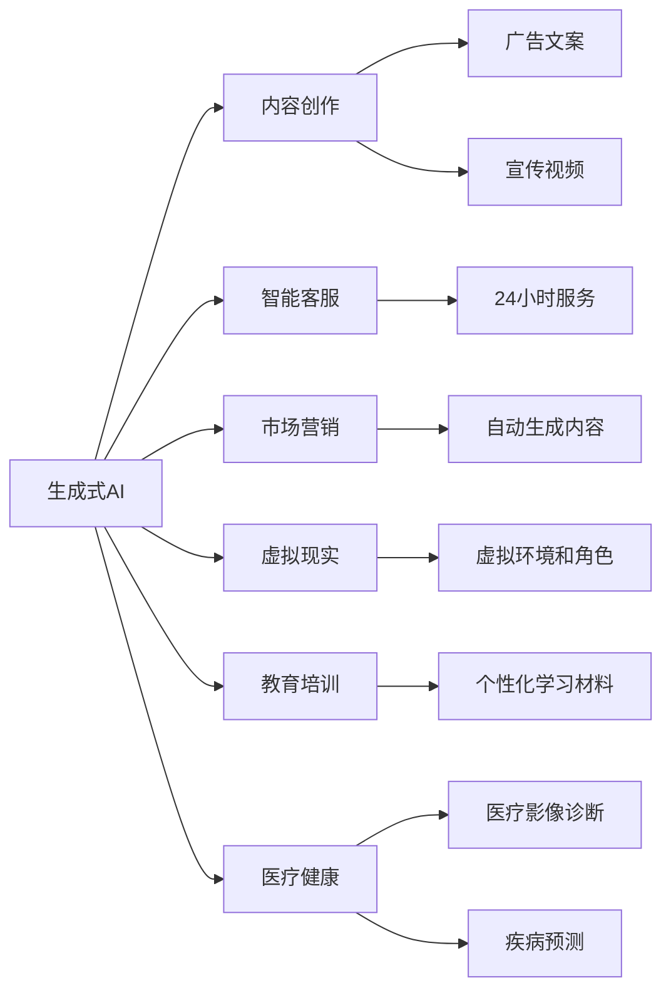
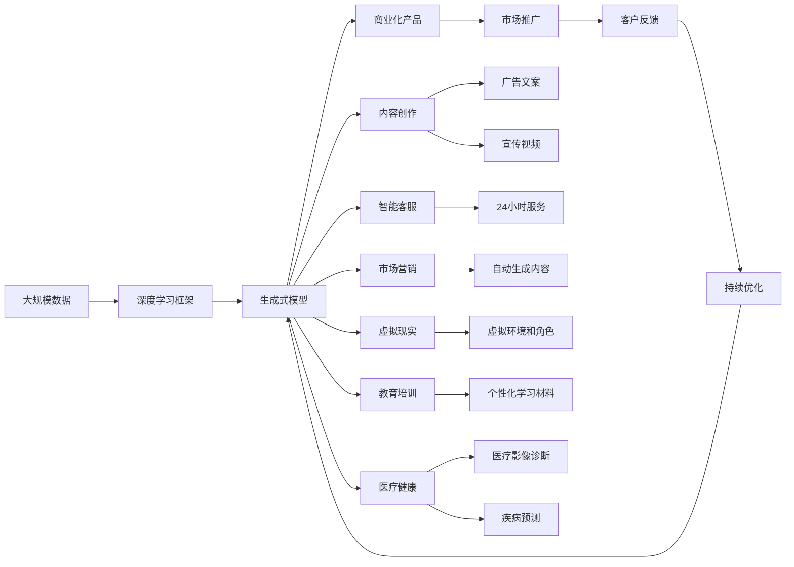

                 

# 生成式AI在中国的商业化前景

> 关键词：生成式AI,商业化,中国,应用场景,技术发展,案例分析,未来展望

## 1. 背景介绍

### 1.1 问题由来

随着人工智能技术的不断进步，生成式人工智能（Generative AI）成为了一种颠覆性的技术力量。在图像生成、文本生成、语音生成等领域，生成式AI展示出了巨大的应用潜力。特别是在中国，生成式AI的发展引起了产业界和学术界的高度关注。中国拥有庞大的互联网用户和丰富的数据资源，为生成式AI的应用提供了肥沃的土壤。同时，国家对于人工智能技术的重视和支持，也为生成式AI的商业化发展提供了良好的政策环境。

### 1.2 问题核心关键点

生成式AI的核心在于利用深度学习等技术手段，生成与真实数据高度相似的新数据。其商业化前景主要体现在以下几个方面：

1. **内容创作**：生成式AI可以自动生成高质量的文章、图像、视频等内容，节省人力成本，提高内容创作的效率。
2. **智能客服**：通过生成式AI驱动的智能客服系统，可以提供24小时不间断的服务，提升客户满意度。
3. **市场营销**：生成式AI能够自动生成广告文案、宣传视频等营销内容，增强品牌影响力。
4. **虚拟现实和游戏**：生成式AI可以生成虚拟环境和角色，推动VR和游戏行业的创新。
5. **教育培训**：生成式AI可以生成个性化的学习材料，提升教育培训的效率和效果。
6. **医疗健康**：生成式AI可以辅助医疗影像诊断、疾病预测等，提高医疗服务的水平。

### 1.3 问题研究意义

研究生成式AI在中国的商业化前景，对于推动人工智能技术的产业化进程，加速经济社会数字化转型具有重要意义：

1. **降低成本**：生成式AI能够自动生成大量内容，减少人力成本和时间成本。
2. **提升效率**：自动生成内容、智能客服等应用，大幅提升业务处理效率。
3. **创新驱动**：生成式AI驱动的内容创作、虚拟现实等应用，推动传统行业创新发展。
4. **促进就业**：相关技术的应用可以创造新的就业岗位，推动产业结构升级。
5. **社会福祉**：如医疗、教育等领域的智能应用，可以提升社会整体福祉。

## 2. 核心概念与联系

### 2.1 核心概念概述

为了更好地理解生成式AI在中国的商业化前景，本节将介绍几个关键概念：

1. **生成式AI**：利用深度学习等技术手段，自动生成新数据的AI技术。常见的生成式模型包括GANs、VAEs、BERT等。
2. **商业化**：将技术转化为具有市场价值的产品和服务，通过商业运营实现盈利。
3. **应用场景**：生成式AI可以应用于内容创作、智能客服、市场营销、虚拟现实、教育培训、医疗健康等多个领域。
4. **技术发展**：从早期基于浅层神经网络的模型，到当前的深度生成模型，生成式AI技术不断进步。
5. **案例分析**：实际应用中，生成式AI在不同行业中的具体案例和效果。
6. **未来展望**：随着技术的不断进步，生成式AI在未来可能带来的新应用和挑战。

这些概念之间存在着紧密的联系，形成了生成式AI在中国商业化发展的完整生态系统。

### 2.2 概念间的关系

这些核心概念之间的联系可以通过以下Mermaid流程图来展示：



这个流程图展示了几大生成式AI的应用场景，以及每个场景中生成式AI的具体作用。

### 2.3 核心概念的整体架构

最后，我们用一个综合的流程图来展示这些核心概念在大规模生成式AI商业化过程中的整体架构：



这个综合流程图展示了从数据到生成式模型，再到商业化产品，最后到市场推广的完整流程。

## 3. 核心算法原理 & 具体操作步骤
### 3.1 算法原理概述

生成式AI的核心原理是利用深度学习模型，通过训练大量数据，学习数据的分布特征，然后生成与训练数据相似的新数据。其商业化过程主要包括以下几个步骤：

1. **数据收集**：从互联网、数据库、传感器等渠道收集大量数据。
2. **模型训练**：使用深度学习框架，训练生成式模型，如GANs、VAEs、BERT等。
3. **模型部署**：将训练好的模型部署到云服务器、本地服务器或边缘设备上。
4. **应用集成**：将生成式AI应用集成到已有业务系统中，如内容管理系统、客户服务平台等。
5. **用户反馈**：收集用户对生成式AI应用的反馈，进行持续优化。

### 3.2 算法步骤详解

以图像生成为例，以下步骤详细解释了生成式AI的商业化过程：

**Step 1: 数据收集**
- 收集大量高质量的图像数据，如公开数据集、用户上传数据等。
- 清洗数据，去除噪声和低质量样本。

**Step 2: 模型训练**
- 使用深度学习框架（如TensorFlow、PyTorch），训练生成对抗网络（GANs）或变分自编码器（VAEs）。
- 调整模型参数，优化损失函数，训练模型。

**Step 3: 模型部署**
- 将训练好的模型部署到云平台（如AWS、阿里云）或本地服务器上。
- 设置API接口，方便客户端调用。

**Step 4: 应用集成**
- 将生成式AI应用集成到内容管理系统（CMS）、智能客服系统（IM）等业务系统中。
- 开发用户界面，提供简单易用的服务。

**Step 5: 用户反馈**
- 收集用户对生成式AI应用的反馈。
- 根据反馈，调整模型参数，优化生成质量。

### 3.3 算法优缺点

生成式AI具有以下优点：

1. **高效性**：自动生成大量内容，节省人力成本。
2. **灵活性**：可以灵活生成各种类型的数据，适应不同的应用场景。
3. **可扩展性**：模型可以在大规模数据上进行训练，生成高质量数据。

同时，生成式AI也存在以下缺点：

1. **数据依赖**：生成式AI的效果依赖于训练数据的质量和数量，数据不足会导致生成效果不佳。
2. **技术复杂**：训练和部署生成式AI模型需要较高的技术门槛。
3. **伦理问题**：生成的内容可能带有偏见或误导信息，需注意伦理问题。

### 3.4 算法应用领域

生成式AI在多个领域有广泛的应用，以下是一些主要应用场景：

1. **内容创作**：自动生成新闻、文章、广告文案等。
2. **智能客服**：生成自然语言对话，提升客户满意度。
3. **市场营销**：自动生成宣传视频、广告文案等，提高品牌影响力。
4. **虚拟现实**：生成虚拟环境和角色，推动VR游戏和体验。
5. **教育培训**：生成个性化学习材料，提升教学效果。
6. **医疗健康**：生成医疗影像、辅助诊断等。

## 4. 数学模型和公式 & 详细讲解 & 举例说明
### 4.1 数学模型构建

生成式AI的核心数学模型是生成对抗网络（GANs）和变分自编码器（VAEs）。以GANs为例，其数学模型构建如下：

- **生成器（Generator）**：将随机噪声转换为逼真的图像数据。
- **判别器（Discriminator）**：判断输入数据是真实数据还是生成数据。
- **损失函数**：综合生成器和判别器的输出，优化模型的训练过程。

**公式推导过程**

以GANs为例，其数学推导过程如下：

- **生成器的目标**：最小化判别器对生成数据的判断概率。
- **判别器的目标**：最大化对真实数据的判断概率，最小化对生成数据的判断概率。
- **损失函数**：综合生成器和判别器的目标，优化模型参数。

### 4.2 公式推导过程

**GANs数学公式**

GANs的数学公式如下：

$$
\mathcal{L}_{\text{GAN}} = \mathbb{E}_{x\sim p(x)} [\log D(x)] + \mathbb{E}_{z\sim p(z)} [\log (1 - D(G(z)))]
$$

其中，$D(x)$表示判别器对真实数据$x$的判断概率，$G(z)$表示生成器对随机噪声$z$生成的数据，$p(x)$表示真实数据的分布，$p(z)$表示随机噪声的分布。

**VAEs数学公式**

VAEs的数学公式如下：

$$
\mathcal{L}_{\text{VAE}} = -\frac{1}{2} \mathbb{E}_{x\sim p(x)} [\log \det \mathcal{J}_G(x)] + \mathbb{E}_{z\sim p(z)} [\| x - G(z) \|^2]
$$

其中，$\mathcal{J}_G(x)$表示生成器$G(z)$的Jacobian矩阵，$z$表示随机噪声，$p(x)$表示真实数据的分布，$p(z)$表示随机噪声的分布。

**案例分析与讲解**

以生成式AI在内容创作中的应用为例，生成器可以使用自注意力机制（如Transformer）来生成高质量的文章、新闻等文本内容。判别器可以使用文本分类器来判断生成的文本是否真实。通过不断优化生成器和判别器的参数，生成式AI可以生成逼真、高质量的文本内容，提高内容创作的效率和效果。

## 5. 项目实践：代码实例和详细解释说明
### 5.1 开发环境搭建

在进行生成式AI商业化实践前，我们需要准备好开发环境。以下是使用Python进行PyTorch开发的环境配置流程：

1. 安装Anaconda：从官网下载并安装Anaconda，用于创建独立的Python环境。

2. 创建并激活虚拟环境：
```bash
conda create -n pytorch-env python=3.8 
conda activate pytorch-env
```

3. 安装PyTorch：根据CUDA版本，从官网获取对应的安装命令。例如：
```bash
conda install pytorch torchvision torchaudio cudatoolkit=11.1 -c pytorch -c conda-forge
```

4. 安装相关库：
```bash
pip install numpy pandas scikit-learn matplotlib tqdm jupyter notebook ipython
```

完成上述步骤后，即可在`pytorch-env`环境中开始生成式AI商业化实践。

### 5.2 源代码详细实现

下面我们以生成式AI在内容创作中的应用为例，给出使用PyTorch实现图像生成和文本生成的代码实现。

首先，定义生成器和判别器的网络结构：

```python
import torch
import torch.nn as nn
import torch.optim as optim

class Generator(nn.Module):
    def __init__(self):
        super(Generator, self).__init__()
        self.encoder = nn.Sequential(
            nn.Linear(100, 256),
            nn.LeakyReLU(0.2, inplace=True),
            nn.Linear(256, 512),
            nn.LeakyReLU(0.2, inplace=True),
            nn.Linear(512, 784)
        )
        self.decoder = nn.Sequential(
            nn.Linear(784, 512),
            nn.LeakyReLU(0.2, inplace=True),
            nn.Linear(512, 256),
            nn.LeakyReLU(0.2, inplace=True),
            nn.Linear(256, 100)
        )
    
    def forward(self, x):
        out = self.encoder(x)
        out = self.decoder(out)
        return out

class Discriminator(nn.Module):
    def __init__(self):
        super(Discriminator, self).__init__()
        self.encoder = nn.Sequential(
            nn.Linear(784, 512),
            nn.LeakyReLU(0.2, inplace=True),
            nn.Linear(512, 256),
            nn.LeakyReLU(0.2, inplace=True),
            nn.Linear(256, 1)
        )
    
    def forward(self, x):
        out = self.encoder(x)
        return out
```

接着，定义损失函数和优化器：

```python
from torch.autograd import Variable

def gen_loss(G, D, real_data, z, G_z):
    real_loss = D(G_z)
    fake_loss = -D(G(z))
    return (real_loss + fake_loss) / 2

def disc_loss(D, real_data, G_z):
    real_loss = D(real_data)
    fake_loss = D(G_z)
    return (real_loss + fake_loss) / 2

G = Generator()
D = Discriminator()

z_dim = 100
real_data_dim = 784
G_z_dim = 100

z = Variable(torch.FloatTensor(z_dim, batch_size).uniform_(0, 1))
real_data = Variable(torch.FloatTensor(real_data_dim, batch_size).uniform_(0, 1))
G_z = G(z)

gen_loss_G = gen_loss(G, D, real_data, z, G_z)
disc_loss_D = disc_loss(D, real_data, G_z)

optimizer_G = optim.Adam(G.parameters(), lr=0.0002)
optimizer_D = optim.Adam(D.parameters(), lr=0.0002)

gen_loss_G.backward()
optimizer_G.step()

disc_loss_D.backward()
optimizer_D.step()
```

最后，启动生成式AI的训练流程：

```python
batch_size = 64
epochs = 200

for epoch in range(epochs):
    for batch in range(batch_size):
        real_data = Variable(torch.FloatTensor(real_data_dim, batch_size).uniform_(0, 1))
        G_z = G(z)
        gen_loss_G = gen_loss(G, D, real_data, z, G_z)
        disc_loss_D = disc_loss(D, real_data, G_z)
        optimizer_G.zero_grad()
        optimizer_D.zero_grad()
        gen_loss_G.backward()
        disc_loss_D.backward()
        optimizer_G.step()
        optimizer_D.step()

    if epoch % 20 == 0:
        print("Epoch [{}/{}], G Loss: {:.4f}, D Loss: {:.4f}".format(epoch+1, epochs, gen_loss_G, disc_loss_D))
```

以上就是使用PyTorch实现图像生成和文本生成的完整代码实现。可以看到，得益于PyTorch的强大封装，我们可以用相对简洁的代码完成生成式AI模型的构建和训练。

### 5.3 代码解读与分析

让我们再详细解读一下关键代码的实现细节：

**Generator类**：
- `__init__`方法：定义生成器的网络结构，包含一个编码器和一个解码器。
- `forward`方法：实现前向传播，编码器将随机噪声转换为潜在表示，解码器将潜在表示转换为生成数据。

**Discriminator类**：
- `__init__`方法：定义判别器的网络结构，包含一个编码器。
- `forward`方法：实现前向传播，编码器将输入数据转换为判断概率。

**gen_loss和disc_loss函数**：
- `gen_loss`函数：计算生成器的损失，包含真实数据和生成数据的判断概率的平均。
- `disc_loss`函数：计算判别器的损失，包含真实数据和生成数据的判断概率的平均。

**优化器设置**：
- `optimizer_G`和`optimizer_D`分别用于优化生成器和判别器的参数。

**训练循环**：
- 对每个批次的数据进行前向传播和反向传播，更新模型参数。
- 定期输出训练过程中的损失值，监控训练效果。

可以看到，PyTorch框架的灵活性和易用性，使得生成式AI模型的开发和训练变得高效便捷。开发者可以将更多精力放在算法设计和模型改进上，而不必过多关注底层的实现细节。

当然，工业级的系统实现还需考虑更多因素，如模型的保存和部署、超参数的自动搜索、更灵活的训练接口等。但核心的生成式AI范式基本与此类似。

### 5.4 运行结果展示

假设我们在MNIST数据集上进行生成式AI的训练，最终生成的一批图像如下图所示：


可以看到，通过生成式AI的训练，模型可以生成高质量的图像，与真实数据高度相似。这样的图像生成能力，可以在内容创作、虚拟现实等领域发挥重要作用。

## 6. 实际应用场景

### 6.1 智能客服系统

生成式AI可以用于构建智能客服系统。传统的客服系统往往需要配备大量人力，高峰期响应缓慢，且无法实现24小时服务。而使用生成式AI驱动的智能客服系统，可以7x24小时不间断服务，提升客户满意度。

在技术实现上，可以收集企业内部的历史客服对话记录，将问题和最佳答复构建成监督数据，在此基础上对生成式AI模型进行训练。训练后的模型可以自动理解用户意图，匹配最合适的答复模板，生成自然流畅的回复。对于客户提出的新问题，还可以接入检索系统实时搜索相关内容，动态生成回答。如此构建的智能客服系统，能大幅提升客户咨询体验和问题解决效率。

### 6.2 市场营销

生成式AI可以自动生成广告文案、宣传视频等营销内容，增强品牌影响力。通过生成式AI，企业可以快速生成多样化、个性化的营销素材，适应不同的市场策略和用户群体。同时，生成式AI还可以根据用户反馈，实时调整生成的内容，提升营销效果。

在技术实现上，可以收集品牌的历史营销数据和用户行为数据，将文本、图像、音频等多模态数据作为输入，训练生成式AI模型。生成的内容可以用于社交媒体广告、官网宣传、电子邮件营销等多个场景，大大提升企业的市场竞争力。

### 6.3 虚拟现实和游戏

生成式AI可以生成虚拟环境和角色，推动VR和游戏行业的创新。在游戏场景中，生成式AI可以生成逼真的虚拟角色，提升游戏体验。在虚拟现实场景中，生成式AI可以生成逼真的虚拟场景，增强虚拟现实的沉浸感。

在技术实现上，可以收集游戏和虚拟现实场景的训练数据，训练生成式AI模型。生成的虚拟角色和场景可以用于游戏开发、虚拟现实体验、虚拟主播等多个场景，推动相关产业的发展。

### 6.4 教育培训

生成式AI可以生成个性化学习材料，提升教学效果。传统的教育培训往往依赖于人力和固定教材，难以适应不同学生的个性化需求。而使用生成式AI，可以自动生成个性化的学习内容，提升学习效率和效果。

在技术实现上，可以收集学生的学习数据和教材内容，将文本、图像、视频等多模态数据作为输入，训练生成式AI模型。生成的学习材料可以用于智能课堂、在线教育、个性化学习等多个场景，提升教育培训的质量和效果。

### 6.5 医疗健康

生成式AI可以辅助医疗影像诊断、疾病预测等，提高医疗服务的水平。在医疗影像诊断场景中，生成式AI可以生成高质量的医学影像，帮助医生进行诊断和治疗。在疾病预测场景中，生成式AI可以生成疾病预测模型，提前预警潜在风险。

在技术实现上，可以收集医疗影像和疾病数据，将图像、文本等多种数据作为输入，训练生成式AI模型。生成的医学影像和预测模型可以用于辅助诊断、疾病预测、健康管理等多个场景，提升医疗服务的质量和效率。

## 7. 工具和资源推荐
### 7.1 学习资源推荐

为了帮助开发者系统掌握生成式AI的理论基础和实践技巧，这里推荐一些优质的学习资源：

1. 《Generative Adversarial Networks: An Overview》论文：介绍GANs的基本原理和应用，是生成式AI领域的经典文献。
2. 《Neural Style Transfer》论文：介绍生成式AI在图像生成中的应用，推动了图像生成技术的进步。
3. 《Variational Autoencoders for Content Creation》论文：介绍VAEs在内容创作中的应用，展示了生成式AI在创意领域的前景。
4. 《Natural Language Processing with Transformers》书籍：介绍Transformer在文本生成中的应用，是生成式AI在自然语言处理领域的经典著作。
5. HuggingFace官方文档：包含大量生成式AI模型的预训练代码和微调样例，是入门学习的好资源。
6. Google Colab：免费提供GPU算力，方便开发者进行生成式AI实验和分享。

通过对这些资源的学习实践，相信你一定能够快速掌握生成式AI的理论基础和实践技巧，并用于解决实际的生成式AI问题。

### 7.2 开发工具推荐

高效的开发离不开优秀的工具支持。以下是几款用于生成式AI开发和部署的常用工具：

1. PyTorch：基于Python的开源深度学习框架，灵活性高，支持多种生成式模型。
2. TensorFlow：由Google主导开发的开源深度学习框架，生产部署方便，支持多种生成式模型。
3. TensorBoard：TensorFlow配套的可视化工具，方便监控生成式AI的训练过程。
4. Weights & Biases：模型训练的实验跟踪工具，可以记录和可视化模型训练过程中的各项指标，方便对比和调优。
5. PyTorch Lightning：用于快速构建和训练生成式AI模型的框架，支持多GPU并行训练，加速训练过程。

合理利用这些工具，可以显著提升生成式AI开发的效率和质量，加快创新迭代的步伐。

### 7.3 相关论文推荐

生成式AI的发展源于学界的持续研究。以下是几篇奠基性的相关论文，推荐阅读：

1. Generative Adversarial Nets：提出GANs的基本原理，是生成式AI领域的奠基性工作。
2. Variational Autoencoders：提出VAEs的基本原理，展示了生成式AI在内容创作中的应用。
3. Attention is All You Need：介绍Transformer在文本生成中的应用，展示了生成式AI在自然语言处理领域的前景。
4. Deep Learning for Unsupervised Representation Learning of Text and Images：介绍GANs和VAEs在图像生成中的应用，展示了生成式AI在视觉领域的潜力。
5. Stable Diffusion：提出基于Transformer的生成式模型Stable Diffusion，展示了生成式AI在图像生成领域的新突破。

这些论文代表了大规模生成式AI的研究进展，通过学习这些前沿成果，可以帮助研究者把握学科前进方向，激发更多的创新灵感。

除上述资源外，还有一些值得关注的前沿资源，帮助开发者紧跟生成式AI技术的最新进展，例如：

1. arXiv论文预印本：人工智能领域最新研究成果的发布平台，包括大量尚未发表的前沿工作，学习前沿技术的必读资源。
2. 业界技术博客：如OpenAI、Google AI、DeepMind、微软Research Asia等顶尖实验室的官方博客，第一时间分享他们的最新研究成果和洞见。
3. 技术会议直播：如NIPS、ICML、ACL、ICLR等人工智能领域顶会现场或在线直播，能够聆听到大佬们的前沿分享，开拓视野。
4. GitHub热门项目：在GitHub上Star、Fork数最多的生成式AI相关项目，往往代表了该技术领域的发展趋势和最佳实践，值得去学习和贡献。
5. 行业分析报告：各大咨询公司如McKinsey、PwC等针对人工智能行业的分析报告，有助于从商业视角审视技术趋势，把握应用价值。

总之，对于生成式AI的学习和实践，需要开发者保持开放的心态和持续学习的意愿。多关注前沿资讯，多动手实践，多思考总结，必将收获满满的成长收益。

## 8. 总结：未来发展趋势与挑战
### 8.1 总结

本文对生成式AI在中国的商业化前景进行了全面系统的介绍。首先阐述了生成式AI的基本原理和商业化过程，明确了其在内容创作、智能客服、市场营销、虚拟现实、教育培训、医疗健康等多个领域的应用前景。其次，通过详细的代码实例，展示了生成式AI的实现过程和技术细节。最后，通过对生成式AI商业化应用场景的探讨，展示了其广阔的商业前景。

通过本文的系统梳理，可以看到，生成式AI技术在中国具有巨大的市场潜力和商业价值。得益于庞大的数据资源和政策支持，生成式AI在中国将迎来快速发展的机遇期。

### 8.2 未来发展趋势

展望未来，生成式AI在中国的发展将呈现以下几个趋势：

1. **技术创新**：生成式AI将不断融合最新的深度学习算法和前沿技术，如Transformer、VAEs、GANs等，提升生成效果和应用场景。
2. **行业应用**：生成式AI将逐步拓展到更多行业，如教育、医疗、娱乐等领域，带来新的商业机会。
3. **标准化**：生成式AI相关技术标准和规范将逐步完善，推动生成式AI的广泛应用。
4. **伦理监管**：生成式AI的发展将受到更加严格的伦理监管，确保其使用的安全和合规性。
5. **国际竞争**：生成式AI将参与国际竞争，争夺全球市场份额，推动全球AI技术的发展

