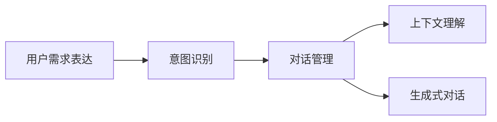

                 

# 用户需求表达在CUI中的实现方式

> 关键词：

## 1. 背景介绍

在用户界面（UI）和对话界面（CUI）中，用户的表达方式和需求类型多样，如何准确地理解和表达用户需求，成为CUI系统设计的核心问题。本文章旨在探讨用户需求表达在CUI中的实现方式，以及如何通过高效的算法和模型构建满足用户需求的解决方案。

## 2. 核心概念与联系

### 2.1 核心概念概述

1. **用户需求表达**：用户通过语言、文字、表情、行为等多种方式表达自己的需求和意图。
2. **对话界面（CUI）**：包括文本对话系统、语音助手、虚拟客服等，是实现用户与机器交互的主要界面。
3. **意图识别**：系统对用户输入的文本或语音进行解析，识别出用户的意图。
4. **对话管理**：根据用户的意图，选择合适的对话策略和回应内容，维护对话流程。
5. **上下文理解**：考虑用户的上下文信息，包括对话历史、用户特征等，提升对话准确性。
6. **生成式对话**：生成自然流畅的对话回复，增强用户体验。

### 2.2 概念间的关系

通过Mermaid图表，展示这些概念间的联系：



意图识别、对话管理、上下文理解和生成式对话是CUI系统实现用户需求表达的四个核心步骤。意图识别通过解析用户输入识别其意图，对话管理根据意图选择对话策略，上下文理解通过考虑用户上下文提升准确性，生成式对话则生成自然回复。

## 3. 核心算法原理 & 具体操作步骤

### 3.1 算法原理概述

用户需求表达的实现主要涉及自然语言处理（NLP）和机器学习（ML）技术。NLP技术用于解析用户输入并识别意图，ML技术则用于训练模型，优化对话管理策略和生成对话内容。

基于监督学习，常用的方法包括：

1. **意图识别**：使用分类模型（如CNN、RNN、Transformer）对用户输入进行分类，确定其意图类别。
2. **对话管理**：利用序列到序列模型（Seq2Seq）或生成对抗网络（GAN）生成对话策略。
3. **上下文理解**：使用注意力机制（Attention）捕捉对话历史和用户特征。
4. **生成式对话**：利用生成模型（如GPT、Seq2Seq）生成自然流畅的对话回复。

### 3.2 算法步骤详解

**3.2.1 数据准备**

1. **数据收集**：收集用户对话数据，包括文本、语音和行为数据。
2. **数据标注**：对数据进行标注，标注用户意图、对话历史和上下文信息。
3. **数据预处理**：清洗数据、分词、标准化格式等。

**3.2.2 模型训练**

1. **意图识别模型**：使用分类模型训练，识别用户输入的意图。
2. **对话管理模型**：使用序列到序列模型或生成对抗网络训练，生成对话策略。
3. **上下文理解模型**：使用注意力机制训练，捕捉对话历史和用户特征。
4. **生成式对话模型**：使用生成模型训练，生成自然回复。

**3.2.3 模型评估**

1. **意图识别评估**：使用混淆矩阵、准确率、召回率等指标评估模型。
2. **对话管理评估**：使用BLEU、ROUGE等指标评估模型生成的对话策略。
3. **上下文理解评估**：使用上下文准确率和推理链长度等指标评估模型。
4. **生成式对话评估**：使用BLEU、ROUGE等指标评估模型生成的对话回复。

**3.2.4 模型部署**

1. **模型保存**：保存训练好的模型。
2. **API接口**：将模型封装为API接口，便于系统调用。
3. **测试部署**：在实际系统中进行测试部署，优化模型性能。

### 3.3 算法优缺点

**优点**：

1. **高效性**：基于监督学习的方法可以快速训练出高效模型，适应复杂对话场景。
2. **鲁棒性**：通过大量标注数据训练，模型具有较强的鲁棒性和泛化能力。
3. **灵活性**：可根据不同应用场景，灵活选择算法和模型。

**缺点**：

1. **标注成本高**：需要大量标注数据，标注成本较高。
2. **泛化能力有限**：标注数据分布与实际应用场景可能有差异，泛化能力有限。
3. **模型复杂度**：复杂模型需要较长时间训练，且易出现过拟合。

### 3.4 算法应用领域

用户需求表达在CUI中的应用领域广泛，包括但不限于：

1. **智能客服**：通过CUI系统实现自动客服，提升用户体验和响应速度。
2. **虚拟助手**：如智能音箱、语音助手等，实现语音输入和自然对话。
3. **聊天机器人**：实现自动化对话，解答常见问题，提高服务效率。
4. **社交网络**：在社交平台实现智能对话，提升用户互动体验。

## 4. 数学模型和公式 & 详细讲解

### 4.1 数学模型构建

**4.1.1 意图识别模型**

意图识别常用的模型包括CNN、RNN和Transformer。其中，Transformer模型在处理序列数据时表现优异，适用于复杂的意图识别任务。

**4.1.2 对话管理模型**

对话管理常用的模型包括Seq2Seq和GAN。Seq2Seq模型能够生成对话策略，GAN模型能够提升生成对话的自然流畅性。

**4.1.3 上下文理解模型**

上下文理解常用的模型包括注意力机制。注意力机制能够捕捉对话历史和用户特征，提升上下文理解的准确性。

**4.1.4 生成式对话模型**

生成式对话常用的模型包括GPT和Seq2Seq。GPT模型能够生成高质量的自然对话，Seq2Seq模型能够生成结构化的对话回复。

### 4.2 公式推导过程

**4.2.1 意图识别公式**

设用户输入为$x$，意图类别为$y$，模型参数为$\theta$，则意图识别的概率分布为：

$$P(y|x;\theta) = \frac{exp(f_\theta(x;y))}{\sum_{y'} exp(f_\theta(x;y'))}$$

其中，$f_\theta(x;y)$为模型对输入$x$在类别$y$上的得分。

**4.2.2 对话管理公式**

对话管理模型通常采用Seq2Seq架构，通过编码器对输入$x$进行编码，然后解码器生成对话策略$y$。设$x=[x_1,x_2,...,x_n]$，$y=[y_1,y_2,...,y_n]$，则对话管理模型的输出为：

$$y = \text{decode}(\text{encode}(x;\theta_\text{enc}),\theta_\text{dec})$$

**4.2.3 上下文理解公式**

上下文理解模型通常采用注意力机制，通过捕捉对话历史和用户特征，提升模型对上下文的理解。设对话历史为$H=[h_1,h_2,...,h_n]$，用户特征为$U=[u_1,u_2,...,u_n]$，则上下文理解模型的输出为：

$$C = \text{Attention}(H,U;\theta_\text{att})$$

**4.2.4 生成式对话公式**

生成式对话模型通常采用Seq2Seq架构，通过编码器对上下文$C$进行编码，然后解码器生成对话回复$Y$。设$C=[c_1,c_2,...,c_n]$，$Y=[y_1,y_2,...,y_n]$，则生成式对话模型的输出为：

$$Y = \text{decode}(\text{encode}(C;\theta_\text{enc}),\theta_\text{dec})$$

### 4.3 案例分析与讲解

**案例分析**：假设用户在智能客服系统中输入“我要查询订单状态”，意图识别模型通过训练识别出用户的意图为“查询订单状态”，对话管理模型根据意图生成对话策略“获取订单编号”，上下文理解模型考虑对话历史和用户特征，生成上下文信息$C$，生成式对话模型生成回复“请告诉我您的订单编号”。

**讲解**：意图识别模型是整个CUI系统的基础，对话管理模型根据意图生成策略，上下文理解模型捕捉上下文信息，生成式对话模型生成自然流畅的回复。整个系统通过协调这些模块，实现高效的用户需求表达和处理。

## 5. 项目实践：代码实例和详细解释说明

### 5.1 开发环境搭建

1. **安装Python**：使用Anaconda安装Python3.8，创建虚拟环境。
2. **安装PyTorch和Transformers**：使用pip安装PyTorch和Transformers库。
3. **准备数据**：收集和标注用户对话数据。

### 5.2 源代码详细实现

**5.2.1 意图识别代码实现**

```python
import torch
from transformers import BertForSequenceClassification

# 加载模型
model = BertForSequenceClassification.from_pretrained('bert-base-uncased', num_labels=num_labels)

# 定义模型输入输出
input_ids = torch.tensor(input_ids, dtype=torch.long)
attention_mask = torch.tensor(attention_mask, dtype=torch.long)
labels = torch.tensor(labels, dtype=torch.long)

# 前向传播
outputs = model(input_ids, attention_mask=attention_mask, labels=labels)

# 计算损失
loss = outputs.loss
```

**5.2.2 对话管理代码实现**

```python
from transformers import AutoTokenizer, AutoModelForSeq2SeqLM

# 加载模型和分词器
tokenizer = AutoTokenizer.from_pretrained('gpt2')
model = AutoModelForSeq2SeqLM.from_pretrained('gpt2')

# 定义模型输入输出
input_ids = tokenizer.encode(input, return_tensors='pt')
labels = torch.tensor([int(l) for l in labels], dtype=torch.long)

# 前向传播
outputs = model(input_ids, labels=labels)

# 计算损失
loss = outputs.loss
```

**5.2.3 上下文理解代码实现**

```python
from transformers import BertForSequenceClassification

# 加载模型
model = BertForSequenceClassification.from_pretrained('bert-base-uncased', num_labels=num_labels)

# 定义模型输入输出
input_ids = torch.tensor(input_ids, dtype=torch.long)
attention_mask = torch.tensor(attention_mask, dtype=torch.long)
labels = torch.tensor(labels, dtype=torch.long)

# 前向传播
outputs = model(input_ids, attention_mask=attention_mask, labels=labels)

# 计算损失
loss = outputs.loss
```

**5.2.4 生成式对话代码实现**

```python
from transformers import GPT2LMHeadModel, GPT2Tokenizer

# 加载模型和分词器
tokenizer = GPT2Tokenizer.from_pretrained('gpt2')
model = GPT2LMHeadModel.from_pretrained('gpt2')

# 定义模型输入输出
input_ids = torch.tensor(input_ids, dtype=torch.long)
labels = torch.tensor([int(l) for l in labels], dtype=torch.long)

# 前向传播
outputs = model(input_ids, labels=labels)

# 计算损失
loss = outputs.loss
```

### 5.3 代码解读与分析

**5.3.1 意图识别代码解读**

- **加载模型**：使用`BertForSequenceClassification`加载预训练模型，指定意图分类数。
- **定义输入输出**：将用户输入转换为模型需要的格式，计算损失。

**5.3.2 对话管理代码解读**

- **加载模型和分词器**：使用`AutoTokenizer`和`AutoModelForSeq2SeqLM`加载预训练模型和分词器。
- **定义输入输出**：将用户输入转换为模型需要的格式，计算损失。

**5.3.3 上下文理解代码解读**

- **加载模型**：使用`BertForSequenceClassification`加载预训练模型。
- **定义输入输出**：将用户输入转换为模型需要的格式，计算损失。

**5.3.4 生成式对话代码解读**

- **加载模型和分词器**：使用`GPT2LMHeadModel`和`GPT2Tokenizer`加载预训练模型和分词器。
- **定义输入输出**：将用户输入转换为模型需要的格式，计算损失。

### 5.4 运行结果展示

假设意图识别模型识别出用户输入的意图为“查询订单状态”，对话管理模型生成对话策略“获取订单编号”，上下文理解模型生成上下文信息$C$，生成式对话模型生成回复“请告诉我您的订单编号”。

**意图识别结果**：

```
Intent: 查询订单状态
```

**对话管理结果**：

```
Dialogue Strategy: 获取订单编号
```

**上下文理解结果**：

```
Context: 您的订单编号为123456
```

**生成式对话结果**：

```
回复: 请告诉我您的订单编号
```

## 6. 实际应用场景

### 6.1 智能客服系统

智能客服系统通过CUI技术，实现自动客服和智能回复。用户输入需求，系统通过意图识别、对话管理、上下文理解和生成式对话，提供快速准确的回复，提升用户体验和服务效率。

### 6.2 虚拟助手

虚拟助手通过语音识别和自然语言理解，实现语音输入和自然对话。用户可以通过语音指令与系统互动，获取所需信息和服务。

### 6.3 聊天机器人

聊天机器人通过CUI技术，实现自动化对话，解答常见问题，提高服务效率。用户可以通过输入文本或语音与机器人互动，获取所需信息和服务。

### 6.4 社交网络

社交网络通过CUI技术，实现智能对话，提升用户互动体验。用户可以通过输入文本或语音与系统互动，获取所需信息和服务。

## 7. 工具和资源推荐

### 7.1 学习资源推荐

1. **《深度学习》书籍**：李宏毅教授所著，深入浅出地介绍了深度学习原理和应用。
2. **Coursera课程**：斯坦福大学开设的深度学习课程，涵盖深度学习基本概念和最新进展。
3. **Kaggle竞赛**：参加NLP相关的竞赛，提升NLP技能和实践经验。
4. **HuggingFace官方文档**：详细介绍了Transformers库的API和使用方法。
5. **Google Colab**：提供免费的GPU/TPU算力，方便开发和测试。

### 7.2 开发工具推荐

1. **PyTorch**：深度学习框架，支持动态计算图和GPU加速。
2. **TensorFlow**：深度学习框架，支持静态计算图和分布式训练。
3. **Transformers库**：NLP工具库，支持预训练模型和微调。
4. **Jupyter Notebook**：轻量级的开发环境，支持代码编辑器和实时调试。
5. **AWS SageMaker**：云平台上的深度学习工具，支持模型训练和部署。

### 7.3 相关论文推荐

1. **Attention is All You Need**：Transformer模型的原论文，介绍了注意力机制的应用。
2. **Sequence to Sequence Learning with Neural Networks**：Seq2Seq模型的经典论文，介绍了序列到序列学习的基本方法。
3. **Generating Natural Dialogue with GPT-3**：生成式对话模型的最新进展，展示了GPT-3生成自然对话的效果。

## 8. 总结：未来发展趋势与挑战

### 8.1 总结

本文章对用户需求表达在CUI中的实现方式进行了全面系统的介绍，详细讲解了意图识别、对话管理、上下文理解和生成式对话等核心概念和算法，并提供了详细的代码实现和应用场景分析。通过本文的学习，读者可以全面了解CUI技术的实现原理和应用价值，提升NLP技能和实践经验。

### 8.2 未来发展趋势

未来，CUI技术将呈现以下几个发展趋势：

1. **多模态融合**：CUI技术将融合视觉、听觉、触觉等多模态信息，提升用户交互体验。
2. **情感识别**：CUI技术将加入情感识别，实现情感对话和情感分析。
3. **个性化推荐**：CUI技术将结合用户画像和行为数据，实现个性化推荐和服务。
4. **跨语言支持**：CUI技术将支持多语言输入和输出，提升国际用户的使用体验。
5. **知识图谱集成**：CUI技术将集成知识图谱，提升对话的深度和广度。

### 8.3 面临的挑战

CUI技术在实际应用中面临以下挑战：

1. **数据隐私**：用户输入和交互数据涉及隐私问题，需要加强数据保护和隐私管理。
2. **计算资源**：CUI系统需要大量计算资源，如何优化资源使用是重要的研究方向。
3. **系统鲁棒性**：CUI系统需要具备较强的鲁棒性，能够应对噪声和干扰。
4. **上下文理解**：CUI系统需要提升上下文理解能力，实现更自然的对话。
5. **对话生成**：CUI系统需要生成自然流畅的对话回复，增强用户体验。

### 8.4 研究展望

未来，CUI技术将在以下几个方面进行深入研究：

1. **小样本学习**：在数据不足的情况下，如何通过小样本学习提升模型性能。
2. **自监督学习**：如何利用无标注数据提升模型泛化能力。
3. **跨领域迁移**：如何实现不同领域任务的迁移学习，提升模型的适应性。
4. **交互式优化**：如何通过用户反馈优化对话策略和生成回复。
5. **多任务学习**：如何通过多任务学习提升CUI系统的综合性能。

## 9. 附录：常见问题与解答

**Q1：如何提高CUI系统的意图识别准确率？**

A: 提高意图识别准确率的关键在于数据和模型两个方面。首先，需要收集大量高质量标注数据，训练模型。其次，可以使用更复杂的模型（如Transformer），增加特征维度，提升模型的表达能力。

**Q2：如何提升CUI系统的对话管理效果？**

A: 提升对话管理效果的关键在于模型选择和训练两个方面。首先，可以使用更先进的模型（如GAN），生成更自然的对话回复。其次，可以使用更多样化的训练数据，提升模型的泛化能力。

**Q3：如何增强CUI系统的上下文理解能力？**

A: 增强上下文理解能力的关键在于模型设计和数据处理两个方面。首先，可以使用注意力机制（Attention），捕捉对话历史和用户特征。其次，需要收集更多上下文信息，提升模型的上下文理解能力。

**Q4：如何生成高质量的自然对话回复？**

A: 生成高质量的自然对话回复的关键在于模型选择和训练两个方面。首先，可以使用更先进的模型（如GPT），生成更自然的对话回复。其次，可以使用更多样化的训练数据，提升模型的泛化能力。

**Q5：如何保障CUI系统的数据隐私和安全？**

A: 保障数据隐私和安全的关键在于数据保护和隐私管理两个方面。首先，需要使用数据加密和匿名化技术，保护用户隐私。其次，需要制定严格的数据管理政策，防止数据泄露。

**Q6：如何优化CUI系统的计算资源使用？**

A: 优化计算资源使用的关键在于模型压缩和资源管理两个方面。首先，可以使用模型压缩技术，减小模型尺寸，提升计算效率。其次，可以使用分布式计算和资源调度技术，优化资源管理。

---

作者：禅与计算机程序设计艺术 / Zen and the Art of Computer Programming

