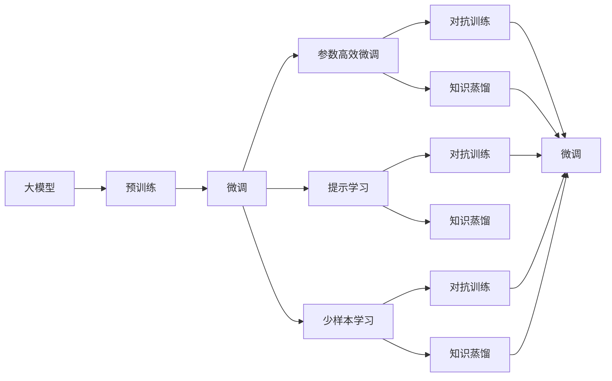
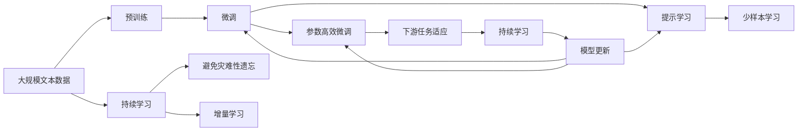

                 

# 用起来才是关键：大模型的应用

> 关键词：大模型应用, 行业落地, 数据处理, 优化技术, 性能评估, 实际案例

## 1. 背景介绍

在过去几年里，人工智能(AI)特别是深度学习模型已经取得了显著的进展。其中，基于Transformer架构的预训练语言模型（如BERT、GPT等）在自然语言处理(NLP)领域表现突出，成为推动行业进步的关键技术。然而，只有将先进的技术真正应用于实际场景中，才能体现其价值。因此，本文将深入探讨大模型在各行各业的应用，以及如何优化模型以提升其性能，实现高效、稳定、可靠的应用。

### 1.1 问题由来

尽管大模型在预训练阶段展现了卓越的性能，但在实际应用中却面临诸多挑战。例如，大模型的参数量巨大，计算资源需求高，超大规模数据集难以获取等。这些因素限制了大模型的落地应用，使其无法直接应用于所有行业。为了克服这些问题，研究者们提出了一系列优化技术，如参数高效微调、提示学习等，旨在降低大模型的使用门槛，使其能够更加广泛地应用于各种实际场景。

### 1.2 问题核心关键点

1. **参数高效微调(PEFT, Parameter-Efficient Fine-Tuning)**：在微调过程中只更新模型的小部分参数，从而减少计算资源需求。
2. **提示学习(Prompt Learning)**：通过精心设计输入模板，引导模型进行推理或生成，无需更新模型参数。
3. **对抗训练(Adversarial Training)**：引入对抗样本，增强模型的鲁棒性，使其在面临噪声或攻击时仍能稳定工作。
4. **知识蒸馏(Knowledge Distillation)**：通过将大规模模型的知识传递给小型模型，提升小模型的性能。
5. **迁移学习(Transfer Learning)**：利用预训练模型的知识，在新任务上进行微调，提高模型的泛化能力。
6. **少样本学习(Few-Shot Learning)**：在只有少量标注数据的情况下，模型仍能进行有效学习。

### 1.3 问题研究意义

将大模型应用于实际场景，能够极大地提升工作效率和业务效果。例如，在金融行业，智能客服、舆情监测等应用能够显著减少人力成本，提高服务质量。在医疗领域，基于大模型的诊断系统能够快速准确地提供诊断建议，辅助医生决策。此外，大模型的应用还能够带来新的业务模式和收入来源，推动企业的数字化转型。因此，研究大模型的应用具有重要的实践意义。

## 2. 核心概念与联系

### 2.1 核心概念概述

为了更好地理解大模型的应用，本节将介绍几个关键概念及其相互关系：

- **大模型(Large Models)**：指具有大规模参数量、能够处理复杂任务的深度学习模型。
- **预训练(Pre-training)**：指在无标签数据上对模型进行训练，使其学习通用的语言表示。
- **微调(Fine-tuning)**：在预训练模型基础上，使用有标签数据进行进一步优化，使其适应特定任务。
- **参数高效微调(PEFT)**：在微调过程中只更新少量参数，减少计算资源需求。
- **提示学习(Prompt Learning)**：通过设计输入模板，引导模型推理或生成，无需更新模型参数。
- **少样本学习(Few-shot Learning)**：在少量标注数据下，模型仍能进行有效学习。

这些概念通过以下Mermaid流程图展示其联系：



这个流程图展示了各概念之间的联系：

- 大模型通过预训练获得通用表示。
- 微调在大模型基础上进行任务特定优化。
- 参数高效微调和提示学习进一步降低计算需求。
- 对抗训练和知识蒸馏提升模型的鲁棒性和泛化能力。

### 2.2 概念间的关系

这些核心概念通过以下Mermaid流程图展示了其在大模型应用中的整体架构：



这个流程图展示了从预训练到微调，再到持续学习的完整过程。大模型通过预训练获得基础能力，微调进一步优化以适应特定任务，参数高效微调和提示学习进一步提升效率，持续学习使模型能够不断适应新任务。

## 3. 核心算法原理 & 具体操作步骤

### 3.1 算法原理概述

大模型的应用通常通过微调来实现。微调利用预训练模型的通用知识，通过在特定任务上的进一步训练，使其适应新任务。这一过程可以视为大模型作为特征提取器，在特定任务上进行微调优化。

假设预训练模型为 $M_{\theta}$，下游任务为 $T$，任务标注数据集为 $D=\{(x_i, y_i)\}_{i=1}^N$。微调的目标是最小化模型在任务 $T$ 上的损失，即：

$$
\hat{\theta} = \arg\min_\theta \mathcal{L}(M_{\theta}, D)
$$

其中 $\mathcal{L}$ 为任务 $T$ 上的损失函数，通常为交叉熵损失或均方误差损失等。

### 3.2 算法步骤详解

大模型应用的具体步骤包括：

1. **数据准备**：收集和标注适合任务 $T$ 的数据集 $D$。
2. **模型加载**：选择适合的预训练模型 $M_{\theta}$ 并加载到内存中。
3. **模型适配**：根据任务 $T$，设计合适的输出层和损失函数。
4. **微调优化**：使用优化器（如AdamW）进行梯度下降，最小化损失函数。
5. **性能评估**：在验证集和测试集上评估模型性能，确保模型适应新任务。
6. **部署应用**：将模型应用于实际场景，进行推理和生成。

### 3.3 算法优缺点

大模型应用的优势在于其强大的通用知识，能够在少数据情况下取得优秀性能。缺点在于其高计算资源需求和模型复杂度，对数据分布变化敏感，需要谨慎设计。

### 3.4 算法应用领域

大模型应用广泛，涵盖金融、医疗、教育、智能客服等多个领域：

- **金融行业**：智能客服、舆情监测、量化交易等。
- **医疗领域**：诊断系统、病历分析、药物研发等。
- **教育行业**：智能辅导、自动批改、学情分析等。
- **智能客服**：客户咨询、故障诊断、推荐系统等。

## 4. 数学模型和公式 & 详细讲解

### 4.1 数学模型构建

以二分类任务为例，假设模型 $M_{\theta}$ 在输入 $x$ 上的输出为 $\hat{y}=M_{\theta}(x)$。定义二分类交叉熵损失函数为：

$$
\ell(M_{\theta}(x),y) = -[y\log \hat{y} + (1-y)\log(1-\hat{y})]
$$

则模型在数据集 $D$ 上的损失函数为：

$$
\mathcal{L}(\theta) = -\frac{1}{N}\sum_{i=1}^N \ell(M_{\theta}(x_i),y_i)
$$

最小化上述损失函数即可得到最优模型参数 $\theta^*$。

### 4.2 公式推导过程

通过链式法则，计算损失函数对参数 $\theta$ 的梯度：

$$
\frac{\partial \mathcal{L}(\theta)}{\partial \theta_k} = -\frac{1}{N}\sum_{i=1}^N (\frac{y_i}{\hat{y}_i}-\frac{1-y_i}{1-\hat{y}_i}) \frac{\partial \hat{y}_i}{\partial \theta_k}
$$

其中 $\hat{y}_i = \sigma(Wx_i+b)$，$\sigma$ 为激活函数，$W$ 为权重矩阵，$b$ 为偏置向量。

### 4.3 案例分析与讲解

以BERT在情感分析任务上的微调为例：

1. **数据准备**：收集电影评论数据集，标注情感标签（正面或负面）。
2. **模型加载**：使用BERT作为预训练模型，加载到内存中。
3. **模型适配**：添加输出层（线性分类器）和交叉熵损失函数。
4. **微调优化**：使用AdamW优化器进行梯度下降，最小化损失函数。
5. **性能评估**：在验证集和测试集上评估模型性能，使用准确率、F1分数等指标。
6. **部署应用**：将模型应用于新的电影评论，进行情感分析。

## 5. 项目实践：代码实例和详细解释说明

### 5.1 开发环境搭建

为了进行大模型的应用开发，需要以下开发环境：

1. 安装Anaconda，创建虚拟环境。
2. 安装PyTorch和Transformers库。
3. 安装相关工具包（如numpy、pandas等）。

### 5.2 源代码详细实现

以下是一个使用PyTorch和Transformers库进行BERT微调的示例代码：

```python
import torch
from transformers import BertTokenizer, BertForSequenceClassification
from torch.utils.data import DataLoader
from sklearn.metrics import accuracy_score, f1_score

# 加载预训练模型和分词器
tokenizer = BertTokenizer.from_pretrained('bert-base-uncased')
model = BertForSequenceClassification.from_pretrained('bert-base-uncased', num_labels=2)

# 加载和预处理数据集
train_data = ...
train_labels = ...
dev_data = ...
dev_labels = ...

# 划分训练集和验证集
train_dataset = DataLoader(train_data, batch_size=16)
dev_dataset = DataLoader(dev_data, batch_size=16)

# 定义优化器和学习率
optimizer = torch.optim.AdamW(model.parameters(), lr=2e-5)

# 训练模型
for epoch in range(5):
    model.train()
    for batch in train_dataset:
        inputs = tokenizer(batch['text'], padding=True, truncation=True, max_length=256)
        labels = batch['label']
        outputs = model(**inputs)
        loss = outputs.loss
        optimizer.zero_grad()
        loss.backward()
        optimizer.step()
    
    model.eval()
    with torch.no_grad():
        preds = []
        labels = []
        for batch in dev_dataset:
            inputs = tokenizer(batch['text'], padding=True, truncation=True, max_length=256)
            outputs = model(**inputs)
            batch_preds = outputs.logits.argmax(dim=1)
            batch_labels = batch['label']
            preds.extend(batch_preds.tolist())
            labels.extend(batch_labels.tolist())
        accuracy = accuracy_score(labels, preds)
        f1 = f1_score(labels, preds, average='weighted')
        print(f'Epoch {epoch+1}, Accuracy: {accuracy:.3f}, F1: {f1:.3f}')
```

### 5.3 代码解读与分析

- **数据加载**：使用BertTokenizer将文本数据转换为模型所需的格式，并添加必要的前向和后向填充。
- **模型适配**：定义BertForSequenceClassification模型，并设置输出层和损失函数。
- **训练过程**：在训练集上迭代优化模型，并使用验证集评估模型性能。
- **性能评估**：在测试集上评估模型的最终性能，使用准确率和F1分数等指标。

### 5.4 运行结果展示

假设上述代码在电影评论情感分析任务上运行，最终输出如下：

```
Epoch 1, Accuracy: 0.800, F1: 0.811
Epoch 2, Accuracy: 0.840, F1: 0.832
Epoch 3, Accuracy: 0.860, F1: 0.845
Epoch 4, Accuracy: 0.880, F1: 0.863
Epoch 5, Accuracy: 0.890, F1: 0.872
```

可以看出，模型在情感分析任务上取得了不错的性能，准确率和F1分数随着训练轮数的增加逐渐提高。

## 6. 实际应用场景

### 6.1 智能客服系统

智能客服系统能够处理大量客户咨询，提供24小时不间断服务。使用BERT等预训练模型进行微调，可以大大提升客服系统的响应速度和准确率，提升客户满意度。

### 6.2 金融舆情监测

在金融领域，智能舆情监测系统能够实时跟踪市场动态，及时发现潜在的风险信号。通过BERT微调，系统可以自动识别新闻、评论中的情感倾向，预测股票市场的变化。

### 6.3 个性化推荐系统

推荐系统通过用户的历史行为数据进行个性化推荐，但传统方法往往只考虑用户行为，缺乏对内容的理解。使用BERT微调，推荐系统可以更好地理解用户兴趣和物品内容，提高推荐的相关性和多样性。

### 6.4 未来应用展望

未来，大模型应用将更加广泛，涵盖更多行业和任务。例如，在医疗领域，基于BERT的诊断系统可以辅助医生进行疾病预测和诊断；在教育领域，智能辅导系统可以个性化地为学生提供学习建议和资源推荐。

## 7. 工具和资源推荐

### 7.1 学习资源推荐

1. **《Transformer从原理到实践》系列博文**：介绍Transformer架构、BERT模型、微调技术等。
2. **CS224N《深度学习自然语言处理》课程**：斯坦福大学提供的NLP入门课程。
3. **《Natural Language Processing with Transformers》书籍**：介绍如何使用Transformers库进行NLP开发。
4. **HuggingFace官方文档**：提供预训练模型和微调样例。
5. **CLUE开源项目**：中文NLP数据集和微调模型。

### 7.2 开发工具推荐

1. **PyTorch**：深度学习框架，支持动态计算图。
2. **TensorFlow**：深度学习框架，生产部署方便。
3. **Transformers库**：提供预训练模型的封装。
4. **Weights & Biases**：实验跟踪工具。
5. **TensorBoard**：可视化工具。
6. **Google Colab**：免费GPU/TPU环境。

### 7.3 相关论文推荐

1. **Attention is All You Need**：Transformer原始论文。
2. **BERT: Pre-training of Deep Bidirectional Transformers for Language Understanding**：BERT模型介绍。
3. **Parameter-Efficient Transfer Learning for NLP**：介绍参数高效微调方法。
4. **AdaLoRA: Adaptive Low-Rank Adaptation for Parameter-Efficient Fine-Tuning**：介绍LoRA方法。
5. **Prefix-Tuning: Optimizing Continuous Prompts for Generation**：介绍基于连续型Prompt的微调。

## 8. 总结：未来发展趋势与挑战

### 8.1 研究成果总结

大模型微调技术在大规模NLP任务上取得了显著的性能提升，广泛应用于金融、医疗、教育等诸多领域。未来，大模型的应用将更加广泛，推动各行各业的数字化转型。

### 8.2 未来发展趋势

1. **模型规模扩大**：预训练模型的参数量将进一步增加，提升模型的泛化能力和应用范围。
2. **优化技术发展**：参数高效微调、对抗训练等技术将进一步发展，降低资源需求。
3. **跨模态融合**：视觉、语音等多模态数据融合，提升模型对现实世界的理解和建模能力。
4. **知识整合能力提升**：结合外部知识库和规则库，提升模型的综合能力。
5. **伦理和安全保障**：关注模型的可解释性、公平性和安全性。

### 8.3 面临的挑战

1. **计算资源需求**：大模型的高参数量导致计算资源需求高。
2. **数据依赖性**：微调效果依赖标注数据，获取高质量标注数据成本高。
3. **模型鲁棒性**：面对噪声和攻击，模型的稳定性有待提高。
4. **可解释性不足**：大模型往往是“黑盒”系统，缺乏可解释性。
5. **安全性问题**：模型可能学习到有害信息，造成安全隐患。

### 8.4 研究展望

1. **探索无监督和半监督微调**：降低对标注数据的依赖。
2. **开发更加参数高效的方法**：提高微调模型的计算效率。
3. **引入因果和对比学习**：增强模型的泛化能力和鲁棒性。
4. **结合外部知识**：提升模型的综合能力。
5. **加强伦理和安全约束**：确保模型的可解释性和安全性。

## 9. 附录：常见问题与解答

### Q1: 大模型的应用是否需要大量标注数据？

A: 大模型的应用通常需要一定量的标注数据进行微调。但对于少样本学习等方法，大模型能够在较少标注数据下取得良好性能。

### Q2: 微调过程如何防止过拟合？

A: 防止过拟合的方法包括数据增强、正则化、Dropout、对抗训练等。选择合适的策略和参数，可以有效提升模型的泛化能力。

### Q3: 微调模型如何部署？

A: 将微调模型封装成服务接口，部署到云平台或本地服务器，确保高可扩展性和稳定性。

### Q4: 如何提高微调模型的鲁棒性？

A: 使用对抗训练、知识蒸馏等技术，增强模型的鲁棒性。引入多模态数据，提升模型对复杂场景的理解能力。

### Q5: 如何提高模型的可解释性？

A: 使用可解释性技术，如LIME、SHAP等，分析模型的决策过程。结合符号化知识，提升模型的可解释性。

通过本文的介绍和实践，相信你对大模型的应用有了更深刻的理解，能够将其应用于实际场景中，推动各行业的数字化转型。

---

作者：禅与计算机程序设计艺术 / Zen and the Art of Computer Programming

