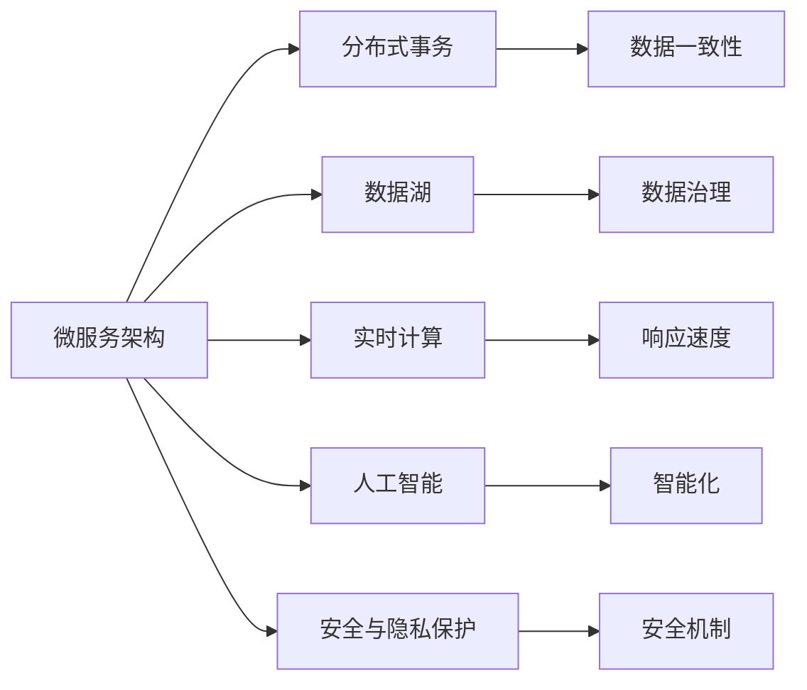

                 

# 电商业务和多元化业务模式

## 1. 背景介绍

随着互联网技术的快速发展和电子商务市场的不断成熟，各大电商企业纷纷加大技术创新，以争夺更多的市场份额。与此同时，电商业务也从传统的单一模式逐步发展为多元化的商业模式，包括C2C、B2B、B2C、B2G等。在多元化的业务模式下，如何构建一个高效、灵活、安全的电商系统，成为一个亟待解决的问题。

### 1.1 问题由来

传统的电商系统往往采用单一的业务模式，如B2C或B2G模式，通过简单的页面布局和交互，实现商品展示、订单管理、支付结算等基本功能。然而，这种单一的模式难以满足复杂多变的电商业务需求，尤其当涉及C2C交易、跨境电商、社交电商等多元化的业务场景时，系统的灵活性、可扩展性和安全性都面临严峻挑战。

随着电商市场的不断拓展，新型的电商业务模式应运而生，如社交电商、直播电商、内容电商等。这些新模式不仅需要传统电商系统具备的商品展示、订单管理等基本功能，还要求系统能够支持社区互动、直播带货、内容创作等新型功能。因此，构建一个高效、灵活、安全的电商系统，需要充分考虑多场景下的业务需求，并进行针对性的技术创新。

### 1.2 问题核心关键点

面对多元化电商业务需求，构建高效、灵活、安全的电商系统需要解决以下几个核心问题：

1. **系统架构设计**：构建一个能够适应多种电商业务模式，支持高并发、高扩展、高可靠的系统架构。
2. **数据治理**：确保系统对数据的采集、存储、处理、分析具备良好的规范性和一致性。
3. **用户管理**：实现用户身份验证、权限管理、行为追踪等安全措施，保障用户隐私和交易安全。
4. **交易流程设计**：设计一个高效、可靠、安全的交易流程，涵盖订单管理、支付结算、物流跟踪等环节。
5. **支付结算机制**：提供多种支付方式，支持跨境支付、第三方支付等复杂支付场景。
6. **多模态融合**：将文本、语音、图像等多种模态数据进行融合，提升系统的智能互动能力。
7. **用户行为分析**：通过数据分析技术，对用户行为进行精准预测和优化，提升用户体验。
8. **市场营销策略**：利用推荐算法和机器学习技术，实现精准广告投放和营销策略优化。

### 1.3 问题研究意义

构建一个能够支持多元化电商业务模式的系统，具有重要意义：

1. **提升用户体验**：通过多模态融合和用户行为分析，提升用户购物体验，增加用户粘性。
2. **优化业务流程**：通过智能化的交易流程设计，提升交易效率，降低操作风险。
3. **提升营销效果**：通过精准的营销策略和数据分析，提升广告投放效果，提高营销ROI。
4. **保障数据安全**：通过严格的数据治理和用户管理，保障用户隐私和交易安全。
5. **支持技术创新**：通过构建高效、灵活的系统架构，支持新型的电商业务模式和技术创新。

## 2. 核心概念与联系

### 2.1 核心概念概述

在构建多元化电商业务模式时，需要考虑多个核心概念及其相互关系：

- **微服务架构**：将电商系统拆分为多个独立的服务单元，每个服务单元独立部署和扩展，提升系统的灵活性和可维护性。
- **分布式事务**：在微服务架构下，实现全局事务的协调和控制，保证数据的一致性和完整性。
- **数据湖**：构建统一的数据存储和治理平台，支持数据的采集、存储、处理、分析，提升数据的规范性和一致性。
- **实时计算**：利用流式计算和大数据技术，实现数据的实时处理和分析，提升系统的响应速度和决策能力。
- **人工智能**：利用机器学习、深度学习等技术，提升系统的智能化水平，如智能推荐、行为预测等。
- **安全与隐私保护**：通过数据加密、访问控制、审计等技术，保障系统的安全性和用户隐私。

这些概念相互关联，共同构成了电商系统的技术架构，使得系统能够支持多场景下的业务需求，具备高并发、高扩展、高可靠的特点。

### 2.2 概念间的关系

这些核心概念之间的关系可以通过以下Mermaid流程图来展示：



这个流程图展示了大电商系统各个核心概念之间的相互关系：

1. **微服务架构**是系统的核心基础，通过拆分服务实现高并发、高扩展、高可靠。
2. **分布式事务**保证微服务之间的事务协调，保障数据一致性。
3. **数据湖**提供统一的数据存储和治理，支持数据的采集、存储、处理、分析。
4. **实时计算**利用流式计算和大数据技术，实现数据的实时处理和分析。
5. **人工智能**提升系统的智能化水平，如智能推荐、行为预测等。
6. **安全与隐私保护**通过数据加密、访问控制、审计等技术，保障系统的安全性和用户隐私。

通过这些概念的相互配合，构建一个高效、灵活、安全的电商系统。

## 3. 核心算法原理 & 具体操作步骤
### 3.1 算法原理概述

构建多元化电商业务模式的核心算法原理主要包括以下几个方面：

1. **微服务拆分算法**：将电商系统拆分为多个独立的服务单元，每个服务单元独立部署和扩展。
2. **分布式事务处理算法**：实现全局事务的协调和控制，保证数据的一致性和完整性。
3. **数据治理算法**：构建统一的数据存储和治理平台，支持数据的采集、存储、处理、分析。
4. **实时计算算法**：利用流式计算和大数据技术，实现数据的实时处理和分析。
5. **人工智能算法**：利用机器学习、深度学习等技术，提升系统的智能化水平。
6. **安全与隐私保护算法**：通过数据加密、访问控制、审计等技术，保障系统的安全性和用户隐私。

### 3.2 算法步骤详解

#### 3.2.1 微服务拆分算法

1. **识别业务模块**：通过分析电商业务需求，识别出系统中的关键业务模块，如商品管理、订单管理、支付结算、物流跟踪等。
2. **拆分服务单元**：将每个业务模块拆分为多个独立的服务单元，每个服务单元负责特定的功能模块，如订单服务、支付服务、物流服务等。
3. **设计服务接口**：为每个服务单元设计标准化的API接口，支持服务之间的数据交互和调用。
4. **服务注册与发现**：构建服务注册和发现中心，支持服务的自动注册和动态发现，提升系统的灵活性和可维护性。

#### 3.2.2 分布式事务处理算法

1. **事务统一管理**：设计统一的分布式事务管理框架，实现全局事务的协调和控制。
2. **事务状态监控**：实时监控分布式事务的状态，及时处理事务失败和超时等问题。
3. **事务数据一致性**：通过分布式事务处理算法，保证多个服务单元之间的事务数据一致性。

#### 3.2.3 数据治理算法

1. **数据采集和存储**：构建统一的数据采集和存储平台，支持数据的自动收集和存储。
2. **数据质量管理**：通过数据清洗和校验技术，保证数据的质量和一致性。
3. **数据湖构建**：构建统一的数据湖，支持数据的存储、处理、分析和应用。

#### 3.2.4 实时计算算法

1. **实时数据流处理**：利用流式计算框架，实现数据的实时处理和分析。
2. **实时数据存储**：通过实时数据存储技术，实现数据的快速访问和查询。
3. **实时数据可视化**：利用数据可视化工具，实现数据的实时展示和分析。

#### 3.2.5 人工智能算法

1. **智能推荐算法**：利用协同过滤、深度学习等技术，实现商品的智能推荐。
2. **行为预测算法**：通过数据分析技术，预测用户的行为和需求，提升用户体验。
3. **风险控制算法**：利用机器学习算法，实现交易风险控制和安全防护。

#### 3.2.6 安全与隐私保护算法

1. **数据加密技术**：通过数据加密技术，保障数据传输和存储的安全性。
2. **访问控制技术**：利用访问控制技术，实现系统的权限管理和用户认证。
3. **审计和监控技术**：通过审计和监控技术，保障系统的行为透明和安全可靠。

### 3.3 算法优缺点

#### 3.3.1 微服务拆分算法的优缺点

**优点**：
1. **高并发处理能力**：微服务架构支持高并发处理能力，能够适应电商系统的访问高峰期。
2. **系统扩展性**：通过微服务拆分，系统的扩展性和灵活性得到提升，能够快速适应业务需求的变化。
3. **故障隔离**：每个服务单元独立部署和扩展，提升系统的可靠性和容错能力。

**缺点**：
1. **通信复杂度增加**：微服务架构增加了服务之间的通信复杂度，需要设计标准化的API接口和数据交互机制。
2. **系统维护难度增加**：每个服务单元需要独立维护和部署，系统维护难度和成本增加。

#### 3.3.2 分布式事务处理算法的优缺点

**优点**：
1. **数据一致性保证**：通过分布式事务处理算法，保证多个服务单元之间的事务数据一致性。
2. **高可靠性**：利用分布式事务管理框架，提升系统的可靠性和容错能力。

**缺点**：
1. **实现复杂度增加**：分布式事务处理算法实现复杂度较高，需要考虑事务状态监控、事务回滚等问题。
2. **系统性能损耗**：分布式事务处理算法会增加系统性能损耗，需要优化算法设计和系统架构。

#### 3.3.3 数据治理算法的优缺点

**优点**：
1. **数据规范性提升**：通过数据治理算法，提升数据的规范性和一致性。
2. **数据应用灵活性**：统一的数据湖支持数据的存储、处理、分析和应用，提升数据的应用灵活性。

**缺点**：
1. **数据治理复杂度增加**：数据治理算法实现复杂度较高，需要考虑数据清洗、校验、存储等问题。
2. **数据访问延迟**：统一的数据湖增加了数据访问延迟，需要优化数据存储和查询技术。

#### 3.3.4 实时计算算法的优缺点

**优点**：
1. **数据实时处理能力**：通过实时计算算法，实现数据的实时处理和分析，提升系统的响应速度和决策能力。
2. **数据可视化效果提升**：利用数据可视化工具，实现数据的实时展示和分析，提升数据应用效果。

**缺点**：
1. **系统资源消耗增加**：实时计算算法需要消耗大量的计算资源，系统资源消耗增加。
2. **数据存储成本增加**：实时数据存储技术需要占用更多的存储空间，增加数据存储成本。

#### 3.3.5 人工智能算法的优缺点

**优点**：
1. **智能化水平提升**：通过人工智能算法，提升系统的智能化水平，如智能推荐、行为预测等。
2. **用户体验提升**：利用智能推荐和行为预测算法，提升用户体验，增加用户粘性。

**缺点**：
1. **算法实现复杂度增加**：人工智能算法实现复杂度较高，需要考虑算法模型选择、训练和优化等问题。
2. **数据质量要求高**：人工智能算法对数据质量要求较高，需要保证数据的质量和一致性。

#### 3.3.6 安全与隐私保护算法的优缺点

**优点**：
1. **系统安全性提升**：通过数据加密、访问控制、审计等技术，保障系统的安全性和用户隐私。
2. **行为透明性提升**：利用审计和监控技术，保障系统的行为透明和可靠。

**缺点**：
1. **系统复杂度增加**：安全与隐私保护算法实现复杂度较高，需要考虑数据加密、访问控制等问题。
2. **性能消耗增加**：安全与隐私保护算法需要消耗额外的系统资源，系统性能消耗增加。

### 3.4 算法应用领域

基于以上核心算法原理和具体操作步骤，多元化电商业务模式主要应用于以下几个领域：

- **商品推荐系统**：利用机器学习算法，实现商品的智能推荐，提升用户体验和销售效果。
- **订单管理系统**：设计高效、可靠的订单管理系统，支持复杂的订单流程和处理需求。
- **支付结算系统**：提供多种支付方式，支持跨境支付、第三方支付等复杂支付场景。
- **物流跟踪系统**：利用物联网和大数据技术，实现物流跟踪和数据可视化，提升物流管理效率。
- **智能客服系统**：通过自然语言处理和机器学习技术，实现智能客服功能，提升客户体验。

## 4. 数学模型和公式 & 详细讲解  
### 4.1 数学模型构建

构建多元化电商业务模式时，需要构建多个数学模型，以支持不同业务场景下的计算和分析。以下是几个关键模型的构建方法：

#### 4.1.1 微服务拆分模型

1. **服务单元定义**：将电商业务划分为多个独立的模块，每个模块负责特定的功能。
2. **服务依赖关系**：定义各个服务单元之间的依赖关系，构建服务调用图。
3. **API接口设计**：为每个服务单元设计标准化的API接口，支持服务之间的数据交互和调用。

#### 4.1.2 分布式事务模型

1. **全局事务划分**：将复杂的电商业务流程划分为多个子事务，每个子事务独立处理。
2. **事务状态监控**：实时监控各个子事务的状态，及时处理事务失败和超时等问题。
3. **事务数据一致性**：通过分布式事务处理算法，保证多个子事务之间的事务数据一致性。

#### 4.1.3 数据治理模型

1. **数据采集和存储模型**：设计数据采集和存储策略，确保数据的完整性和一致性。
2. **数据质量管理模型**：通过数据清洗和校验技术，提升数据质量。
3. **数据湖构建模型**：构建统一的数据湖，支持数据的存储、处理、分析和应用。

#### 4.1.4 实时计算模型

1. **实时数据流处理模型**：利用流式计算框架，实现数据的实时处理和分析。
2. **实时数据存储模型**：通过实时数据存储技术，实现数据的快速访问和查询。
3. **实时数据可视化模型**：利用数据可视化工具，实现数据的实时展示和分析。

#### 4.1.5 人工智能模型

1. **智能推荐模型**：利用协同过滤、深度学习等技术，实现商品的智能推荐。
2. **行为预测模型**：通过数据分析技术，预测用户的行为和需求，提升用户体验。
3. **风险控制模型**：利用机器学习算法，实现交易风险控制和安全防护。

#### 4.1.6 安全与隐私保护模型

1. **数据加密模型**：通过数据加密技术，保障数据传输和存储的安全性。
2. **访问控制模型**：利用访问控制技术，实现系统的权限管理和用户认证。
3. **审计和监控模型**：通过审计和监控技术，保障系统的行为透明和安全可靠。

### 4.2 公式推导过程

#### 4.2.1 微服务拆分模型的公式推导

1. **服务单元定义**：
   $$
   S = \{S_i\}_{i=1}^n
   $$
   其中 $S$ 为服务集合，$S_i$ 为第 $i$ 个服务单元。

2. **服务依赖关系**：
   $$
   D = \{(D_{ij})\}_{i,j=1}^n
   $$
   其中 $D_{ij}$ 表示 $S_i$ 依赖 $S_j$，即 $S_j$ 是 $S_i$ 的前置服务单元。

3. **API接口设计**：
   $$
   I = \{I_{ij}\}_{i,j=1}^n
   $$
   其中 $I_{ij}$ 表示 $S_i$ 和 $S_j$ 之间的API接口，支持数据交互和调用。

#### 4.2.2 分布式事务模型的公式推导

1. **全局事务划分**：
   $$
   T = \{T_k\}_{k=1}^m
   $$
   其中 $T$ 为事务集合，$T_k$ 为第 $k$ 个全局事务。

2. **事务状态监控**：
   $$
   S = \{S_{kj}\}_{k,j=1}^m
   $$
   其中 $S_{kj}$ 表示事务 $T_k$ 的状态，$j$ 表示事务 $T_k$ 的子事务序号。

3. **事务数据一致性**：
   $$
   C = \{C_{kj}\}_{k,j=1}^m
   $$
   其中 $C_{kj}$ 表示事务 $T_k$ 的子事务之间的事务数据一致性。

#### 4.2.3 数据治理模型的公式推导

1. **数据采集和存储模型**：
   $$
   D_A = \{D_{Aj}\}_{j=1}^N
   $$
   其中 $D_A$ 为数据采集模型，$D_{Aj}$ 表示第 $j$ 个数据源。

2. **数据质量管理模型**：
   $$
   D_Q = \{D_{Qj}\}_{j=1}^N
   $$
   其中 $D_Q$ 为数据质量管理模型，$D_{Qj}$ 表示第 $j$ 个数据源的质量管理流程。

3. **数据湖构建模型**：
   $$
   D_L = \{D_{Lj}\}_{j=1}^N
   $$
   其中 $D_L$ 为数据湖构建模型，$D_{Lj}$ 表示第 $j$ 个数据湖的存储和处理流程。

#### 4.2.4 实时计算模型的公式推导

1. **实时数据流处理模型**：
   $$
   R_F = \{R_{Fj}\}_{j=1}^M
   $$
   其中 $R_F$ 为实时数据流处理模型，$R_{Fj}$ 表示第 $j$ 个数据流处理任务。

2. **实时数据存储模型**：
   $$
   R_S = \{R_{Sj}\}_{j=1}^M
   $$
   其中 $R_S$ 为实时数据存储模型，$R_{Sj}$ 表示第 $j$ 个数据存储任务。

3. **实时数据可视化模型**：
   $$
   R_V = \{R_{Vj}\}_{j=1}^M
   $$
   其中 $R_V$ 为实时数据可视化模型，$R_{Vj}$ 表示第 $j$ 个数据可视化任务。

#### 4.2.5 人工智能模型的公式推导

1. **智能推荐模型**：
   $$
   R_I = \{R_{Ij}\}_{j=1}^K
   $$
   其中 $R_I$ 为智能推荐模型，$R_{Ij}$ 表示第 $j$ 个推荐算法模型。

2. **行为预测模型**：
   $$
   R_P = \{R_{Pj}\}_{j=1}^K
   $$
   其中 $R_P$ 为行为预测模型，$R_{Pj}$ 表示第 $j$ 个行为预测算法模型。

3. **风险控制模型**：
   $$
   R_R = \{R_{Rj}\}_{j=1}^K
   $$
   其中 $R_R$ 为风险控制模型，$R_{Rj}$ 表示第 $j$ 个风险控制算法模型。

#### 4.2.6 安全与隐私保护模型的公式推导

1. **数据加密模型**：
   $$
   E = \{E_k\}_{k=1}^C
   $$
   其中 $E$ 为数据加密模型，$E_k$ 表示第 $k$ 个加密算法模型。

2. **访问控制模型**：
   $$
   A = \{A_j\}_{j=1}^N
   $$
   其中 $A$ 为访问控制模型，$A_j$ 表示第 $j$ 个访问控制策略。

3. **审计和监控模型**：
   $$
   M = \{M_j\}_{j=1}^N
   $$
   其中 $M$ 为审计和监控模型，$M_j$ 表示第 $j$ 个审计和监控策略。

### 4.3 案例分析与讲解

#### 4.3.1 商品推荐系统案例

1. **数据采集和预处理**：从电商系统中的用户行为数据、商品数据、用户画像数据等采集数据，并进行数据清洗和预处理。
2. **特征提取和模型训练**：利用协同过滤、深度学习等技术，提取用户和商品的特征向量，训练智能推荐模型。
3. **模型评估和优化**：利用A/B测试、交叉验证等方法，评估智能推荐模型的效果，并进行模型优化。
4. **推荐系统部署**：将训练好的推荐模型部署到电商系统中的推荐引擎中，实现商品的智能推荐。

#### 4.3.2 订单管理系统案例

1. **订单流程设计**：设计复杂的订单流程，涵盖下单、支付、发货、物流等环节。
2. **分布式事务处理**：利用分布式事务管理框架，实现订单流程中的事务协调和控制，保证数据的一致性和完整性。
3. **订单状态监控**：实时监控订单状态，及时处理订单失败和超时等问题，提升用户体验。
4. **订单管理界面设计**：设计高效的订单管理界面，支持订单的查看、修改、查询等功能，提升订单管理的便捷性。

#### 4.3.3 支付结算系统案例

1. **支付方式设计**：支持多种支付方式，如支付宝、微信支付、银联支付等。
2. **跨境支付处理**：支持跨境支付场景，实现货币转换、汇率计算等复杂功能。
3. **第三方支付集成**：集成第三方支付平台，实现支付接口的统一调用和管理。
4. **支付安全控制**：利用安全与隐私保护算法，保障支付结算的安全性和用户隐私。

#### 4.3.4 物流跟踪系统案例

1. **物流信息采集**：从物流公司获取物流信息，并存储到数据湖中。
2. **实时数据处理**：利用流式计算框架，实时处理物流信息，实现数据的实时展示和分析。
3. **数据可视化**：利用数据可视化工具，实现物流信息的实时展示和分析，提升物流管理效率。
4. **物流异常检测**：通过数据分析技术，实时检测物流异常，及时采取措施。

#### 4.3.5 智能客服系统案例

1. **自然语言处理**：利用自然语言处理技术，解析用户输入的文本信息，提取关键信息。
2. **智能客服模型训练**：利用深度学习技术，训练智能客服模型，实现自动回答用户问题。
3. **用户行为分析**：通过数据分析技术，分析用户行为，提供个性化的服务。
4. **客服系统部署**：将训练好的智能客服模型部署到电商系统中的客服界面中，提升客户体验。

## 5. 项目实践：代码实例和详细解释说明
### 5.1 开发环境搭建

在进行项目实践前，需要先搭建好开发环境。以下是使用Python进行Django开发的环境配置流程：

1. 安装Python：从官网下载并安装Python 3.x版本，保证系统环境中安装有Python环境。
2. 安装Django：在终端中执行 `pip install django` 命令，安装Django框架。
3. 创建项目和应用：在终端中执行 `django-admin startproject myproject` 和 `python manage.py startapp myapp` 命令，创建项目和应用。
4. 配置数据库：在 `settings.py` 文件中配置数据库连接信息。
5. 安装第三方库：安装常用的Django第三方库，如 `Django REST framework` 用于API开发，`django-axes` 用于登录限制，`django-redis` 用于缓存等。

完成上述步骤后，即可在项目中开始开发实践。

### 5.2 源代码详细实现

以下是使用Django框架实现电商系统用户注册、登录、商品展示、订单管理等功能的代码实现。

```python
# models.py
from django.db import models

class User(models.Model):
    username = models.CharField(max_length=50, unique=True)
    password = models.CharField(max_length=50)
    email = models.EmailField(unique=True)

class Category(models.Model):
    name = models.CharField(max_length=50)
    description = models.TextField()

class Product(models.Model):
    name = models.CharField(max_length=100)
    category = models.ForeignKey(Category, on_delete=models.CASCADE)
    price = models.DecimalField(max_digits=10, decimal_places=2)
    image = models.ImageField(upload_to='products/')

# views.py
from django.shortcuts import render, redirect
from django.contrib.auth.decorators import login_required
from django.contrib.auth import login, authenticate
from .models import User, Category, Product

def login_view(request):
    if request.method == 'POST':
        username = request.POST['username']
        password = request.POST['password']
        user = authenticate(request, username=username, password=password)
        if

