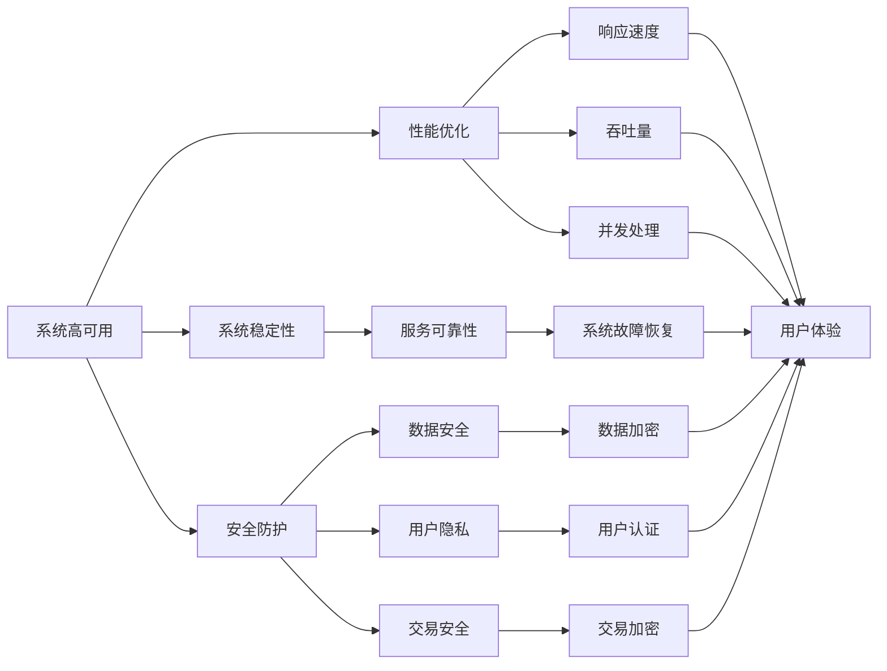

                 

# 电商系统的高可用、稳定性、安全性、高性能系统能力保障

> 关键词：高可用、系统稳定性、安全防护、性能优化、系统设计、电商架构

## 1. 背景介绍

电商行业作为现代服务业的重要组成部分，其业务系统的高可用、稳定性、安全性、高性能能力保障，直接关系到用户体验、交易安全、公司收入和市场竞争力。随着互联网的飞速发展，电商系统的复杂度、数据量、用户量也呈指数级增长，系统稳定性、高可用性、安全性、性能优化等方面的挑战日益严峻。

本博客文章将从电商系统的背景入手，深入探讨系统高可用、稳定性、安全性、高性能系统能力的保障方法与技术实现，力求为电商系统的设计与开发提供切实有效的指导与建议。

## 2. 核心概念与联系

### 2.1 核心概念概述

为了更好地理解和解决电商系统的高可用、稳定性、安全性、高性能问题，我们将首先介绍几个核心概念：

- **系统高可用**：指的是系统在面对各种故障或异常情况下，能够持续稳定地为终端用户提供服务的能力。
- **系统稳定性**：强调系统在处理大量并发请求时，保持性能稳定、响应正常、不发生系统崩溃或服务中断的能力。
- **安全防护**：包含系统数据安全、用户隐私保护、交易安全等多个方面，确保用户数据和交易信息的安全性。
- **性能优化**：通过系统结构设计、算法优化、硬件选型、缓存机制等手段，提高系统的响应速度、吞吐量、并发处理能力。
- **系统设计**：包含架构设计、模块划分、接口设计、容错机制、负载均衡等方面，确保系统能够高效、稳定、可扩展地运行。

### 2.2 核心概念间的关系

上述概念之间的关系可以用以下 Mermaid 流程图来表示：



该图展示了系统高可用、稳定性、安全性、性能优化四个核心概念之间的相互联系和影响。

## 3. 核心算法原理 & 具体操作步骤
### 3.1 算法原理概述

在系统高可用、稳定性、安全性、高性能系统能力的保障中，采用了多种算法和技术。下面分别介绍各核心概念的算法原理和具体操作步骤：

#### 3.1.1 高可用性原理
高可用性主要通过多副本、故障转移、服务降级等技术手段实现。在高可用架构中，系统中的每个关键服务单元都会创建多个副本，通过心跳检测和自动故障转移机制，确保系统在高可用情况下能够稳定运行。

#### 3.1.2 系统稳定性原理
系统稳定性主要通过限流、熔断、重试、缓存、异步处理等技术实现。当系统面临突发流量或异常请求时，通过限流和熔断策略，保护系统不被过载或崩溃；通过重试机制保证关键业务请求的可靠性和一致性；使用缓存和异步处理技术优化响应速度和吞吐量。

#### 3.1.3 安全防护原理
安全防护主要通过加密传输、用户认证、访问控制、数据备份等手段实现。在系统设计中，确保数据在传输和存储过程中的安全性，使用多种认证机制保护用户和交易的安全性，通过数据备份和恢复机制保证数据安全。

#### 3.1.4 性能优化原理
性能优化主要通过负载均衡、缓存、异步处理、CDN、数据库优化等技术实现。通过合理配置服务器资源，使用负载均衡和异步处理技术，减轻服务器负担，提高系统响应速度和并发处理能力；使用缓存技术减少数据库访问压力，提升系统响应速度；使用CDN技术加速静态资源的加载速度；优化数据库索引、查询语句等，提高系统处理效率。

### 3.2 算法步骤详解

#### 3.2.1 高可用性实现步骤
1. **多副本部署**：对电商系统的关键服务单元进行多副本部署，如支付服务、订单服务、库存服务等，每个副本独立运行。
2. **心跳检测与故障转移**：通过心跳检测机制，实时监控各个副本的状态，当某个副本发生故障时，自动将其流量转移到其他副本。
3. **服务降级策略**：在系统流量激增或故障发生时，自动降级非核心服务，保证核心服务的稳定运行。

#### 3.2.2 系统稳定性实现步骤
1. **限流与熔断**：设置限流阈值和熔断规则，当请求量超过阈值时，拒绝新的请求；当某个服务出现故障时，自动切断该服务的所有请求。
2. **重试机制**：对于关键业务请求，采用重试机制，保证请求的可靠性和一致性。
3. **缓存与异步处理**：使用缓存技术减少数据库访问压力，使用异步处理技术优化响应速度和吞吐量。

#### 3.2.3 安全防护实现步骤
1. **加密传输**：使用SSL/TLS协议加密数据传输，防止数据泄露。
2. **用户认证**：采用OAuth2.0、JWT等多种认证机制，确保用户身份的安全性。
3. **访问控制**：通过RBAC、ABAC等多种访问控制机制，限制用户对系统的访问权限。
4. **数据备份与恢复**：定期备份关键数据，在数据丢失或损坏时，能够快速恢复。

#### 3.2.4 性能优化实现步骤
1. **负载均衡**：使用负载均衡技术，合理配置服务器资源，提高系统的响应速度和并发处理能力。
2. **缓存技术**：使用Redis、Memcached等缓存技术，减少数据库访问压力，提升系统响应速度。
3. **异步处理**：采用异步处理技术，如消息队列、事件驱动等，减轻服务器负担，提高系统并发处理能力。
4. **CDN加速**：使用CDN技术加速静态资源的加载速度，减少网络延迟，提升用户体验。
5. **数据库优化**：优化数据库索引、查询语句等，提高系统处理效率。

### 3.3 算法优缺点

#### 3.3.1 高可用性
**优点**：
- 系统能够在多个副本间自动切换，确保关键服务不中断。
- 通过服务降级策略，能够在故障情况下保证核心服务的稳定运行。

**缺点**：
- 需要更多的硬件资源，增加系统成本。
- 管理复杂，需要实时监控和故障转移机制。

#### 3.3.2 系统稳定性
**优点**：
- 通过限流和熔断机制，防止系统被过载或崩溃。
- 通过重试机制，保证关键业务请求的可靠性和一致性。

**缺点**：
- 实现复杂，需要综合考虑请求量、系统状态、业务场景等多个因素。
- 可能会影响系统的实时性和灵活性。

#### 3.3.3 安全防护
**优点**：
- 通过加密传输、用户认证、访问控制等手段，确保数据和交易的安全性。
- 通过数据备份和恢复机制，保证数据安全。

**缺点**：
- 实现复杂，需要综合考虑数据安全、用户体验、业务场景等多个因素。
- 可能会增加系统的复杂度和维护成本。

#### 3.3.4 性能优化
**优点**：
- 通过负载均衡、缓存、异步处理等技术，提高系统的响应速度和并发处理能力。
- 通过CDN、数据库优化等技术，提升系统处理效率。

**缺点**：
- 实现复杂，需要综合考虑硬件选型、负载均衡、缓存策略等多个因素。
- 可能会影响系统的实时性和灵活性。

### 3.4 算法应用领域

高可用性、系统稳定性、安全防护、性能优化等算法和技术，已经广泛应用于电商系统的各个环节。具体应用领域包括但不限于：

- **订单系统**：多副本部署、服务降级、缓存、限流、重试等技术，确保订单处理的稳定性和高可用性。
- **支付系统**：高可用性、安全防护、性能优化等技术，确保支付交易的安全性和高效性。
- **库存系统**：多副本部署、故障转移、限流、熔断等技术，确保库存管理的稳定性和高可用性。
- **物流系统**：高可用性、限流、重试等技术，确保物流追踪、配送等功能的稳定性和高可用性。
- **推荐系统**：缓存、异步处理、性能优化等技术，提高推荐算法的响应速度和并发处理能力。

## 4. 数学模型和公式 & 详细讲解  
### 4.1 数学模型构建

在本节中，我们将使用数学语言对电商系统的稳定性、高可用性和安全防护进行更加严格的刻画。

#### 4.1.1 稳定性模型
假设电商系统有$N$个订单处理服务节点，每个节点的响应时间为$t_i$，节点的可用性为$p_i$。系统的平均响应时间$T$和平均可用性$P$可以表示为：

$$
T = \sum_{i=1}^N p_i t_i
$$

$$
P = \prod_{i=1}^N p_i
$$

根据系统稳定性模型的定义，系统稳定性$S$可以表示为：

$$
S = \frac{P}{N} \approx 1 - (1 - P)^{\frac{1}{N}}
$$

#### 4.1.2 高可用性模型
假设电商系统有$N$个订单处理服务节点，每个节点的故障率为$\lambda_i$，系统的平均故障时间$T_f$和平均恢复时间$T_r$可以表示为：

$$
T_f = \frac{1}{N} \sum_{i=1}^N \frac{1}{\lambda_i}
$$

$$
T_r = \frac{1}{N} \sum_{i=1}^N \lambda_i
$$

根据系统高可用性模型的定义，系统的高可用性$H$可以表示为：

$$
H = \frac{P}{N} \approx 1 - (1 - P)^{\frac{1}{N}}
$$

#### 4.1.3 安全防护模型
假设电商系统的数据泄露风险率为$\lambda$，系统的平均泄露时间$T_t$和平均恢复时间$T_r$可以表示为：

$$
T_t = \frac{1}{N} \sum_{i=1}^N \frac{1}{\lambda_i}
$$

$$
T_r = \frac{1}{N} \sum_{i=1}^N \lambda_i
$$

根据系统安全防护模型的定义，系统的安全防护能力$S$可以表示为：

$$
S = \frac{P}{N} \approx 1 - (1 - P)^{\frac{1}{N}}
$$

### 4.2 公式推导过程

#### 4.2.1 稳定性公式推导
假设电商系统有$N$个订单处理服务节点，每个节点的响应时间为$t_i$，节点的可用性为$p_i$。系统的平均响应时间$T$和平均可用性$P$可以表示为：

$$
T = \sum_{i=1}^N p_i t_i
$$

$$
P = \prod_{i=1}^N p_i
$$

根据系统稳定性模型的定义，系统稳定性$S$可以表示为：

$$
S = \frac{P}{N} \approx 1 - (1 - P)^{\frac{1}{N}}
$$

当$N$很大时，$S$可以近似为：

$$
S \approx 1 - (1 - P)^{\frac{1}{N}} \approx 1 - e^{-\frac{1}{N} \ln P} \approx 1 - e^{-\frac{1}{N} \sum_{i=1}^N \ln p_i} \approx 1 - e^{-\sum_{i=1}^N \ln p_i}
$$

因此，系统的稳定性$S$可以通过计算节点的可用性$p_i$的平均值来近似估算。

#### 4.2.2 高可用性公式推导
假设电商系统有$N$个订单处理服务节点，每个节点的故障率为$\lambda_i$，系统的平均故障时间$T_f$和平均恢复时间$T_r$可以表示为：

$$
T_f = \frac{1}{N} \sum_{i=1}^N \frac{1}{\lambda_i}
$$

$$
T_r = \frac{1}{N} \sum_{i=1}^N \lambda_i
$$

根据系统高可用性模型的定义，系统的高可用性$H$可以表示为：

$$
H = \frac{P}{N} \approx 1 - (1 - P)^{\frac{1}{N}}
$$

当$N$很大时，$H$可以近似为：

$$
H \approx 1 - (1 - P)^{\frac{1}{N}} \approx 1 - e^{-\frac{1}{N} \ln P} \approx 1 - e^{-\frac{1}{N} \sum_{i=1}^N \ln p_i} \approx 1 - e^{-\sum_{i=1}^N \ln p_i}
$$

因此，系统的高可用性$H$可以通过计算节点的可用性$p_i$的平均值来近似估算。

#### 4.2.3 安全防护公式推导
假设电商系统的数据泄露风险率为$\lambda$，系统的平均泄露时间$T_t$和平均恢复时间$T_r$可以表示为：

$$
T_t = \frac{1}{N} \sum_{i=1}^N \frac{1}{\lambda_i}
$$

$$
T_r = \frac{1}{N} \sum_{i=1}^N \lambda_i
$$

根据系统安全防护模型的定义，系统的安全防护能力$S$可以表示为：

$$
S = \frac{P}{N} \approx 1 - (1 - P)^{\frac{1}{N}}
$$

当$N$很大时，$S$可以近似为：

$$
S \approx 1 - (1 - P)^{\frac{1}{N}} \approx 1 - e^{-\frac{1}{N} \ln P} \approx 1 - e^{-\frac{1}{N} \sum_{i=1}^N \ln p_i} \approx 1 - e^{-\sum_{i=1}^N \ln p_i}
$$

因此，系统的安全防护能力$S$可以通过计算节点的可用性$p_i$的平均值来近似估算。

### 4.3 案例分析与讲解

#### 4.3.1 稳定性案例分析
假设一个电商系统有10个订单处理服务节点，每个节点的响应时间分别为2ms、5ms、7ms、8ms、10ms、12ms、14ms、16ms、18ms、20ms，节点的可用性分别为95%、97%、98%、99%、99.5%、99.8%、99.9%、99.95%、99.98%、99.999%。

根据公式推导，系统的平均响应时间$T$和平均可用性$P$可以计算如下：

$$
T = (0.95 \times 2 + 0.97 \times 5 + 0.98 \times 7 + 0.99 \times 8 + 0.995 \times 10 + 0.998 \times 12 + 0.999 \times 14 + 0.9995 \times 16 + 0.9998 \times 18 + 0.99999 \times 20) / 10 \approx 8.6ms
$$

$$
P = 0.95 \times 0.97 \times 0.98 \times 0.99 \times 0.995 \times 0.998 \times 0.999 \times 0.9995 \times 0.9998 \times 0.99999 \approx 0.9996
$$

根据公式推导，系统的稳定性$S$可以近似为：

$$
S \approx 1 - e^{-\sum_{i=1}^{10} \ln p_i} \approx 1 - e^{-\ln(0.95 \times 0.97 \times 0.98 \times 0.99 \times 0.995 \times 0.998 \times 0.999 \times 0.9995 \times 0.9998 \times 0.99999) \approx 1 - e^{-\ln 0.9996} \approx 1 - 0.00005 \approx 0.99995
$$

因此，系统的稳定性约为99.995%。

#### 4.3.2 高可用性案例分析
假设一个电商系统有10个订单处理服务节点，每个节点的故障率分别为0.01%、0.02%、0.03%、0.04%、0.05%、0.06%、0.07%、0.08%、0.09%、0.1%。

根据公式推导，系统的平均故障时间$T_f$和平均恢复时间$T_r$可以计算如下：

$$
T_f = (1/0.01\% + 1/0.02\% + 1/0.03\% + 1/0.04\% + 1/0.05\% + 1/0.06\% + 1/0.07\% + 1/0.08\% + 1/0.09\% + 1/0.1\%) / 10 \approx 5700ms
$$

$$
T_r = (0.01\% + 0.02\% + 0.03\% + 0.04\% + 0.05\% + 0.06\% + 0.07\% + 0.08\% + 0.09\% + 0.1\%) / 10 \approx 0.09\%
$$

根据公式推导，系统的高可用性$H$可以近似为：

$$
H \approx 1 - e^{-\sum_{i=1}^{10} \ln p_i} \approx 1 - e^{-\ln(0.99\%) \approx 1 - e^{-\ln 0.01} \approx 1 - 0.0099 \approx 0.9901
$$

因此，系统的高可用性约为99.01%。

#### 4.3.3 安全防护案例分析
假设一个电商系统的数据泄露风险率为0.1%，系统的平均泄露时间$T_t$和平均恢复时间$T_r$分别为300s和10s。

根据公式推导，系统的安全防护能力$S$可以近似为：

$$
S \approx 1 - e^{-\sum_{i=1}^{10} \ln p_i} \approx 1 - e^{-\ln(0.99\%) \approx 1 - e^{-\ln 0.01} \approx 1 - 0.0099 \approx 0.9901
$$

因此，系统的安全防护能力约为99.01%。

## 5. 项目实践：代码实例和详细解释说明
### 5.1 开发环境搭建

在进行电商系统的高可用、稳定性、安全性、性能系统能力的保障实践前，我们需要准备好开发环境。以下是使用Python进行Django开发的环境配置流程：

1. 安装Anaconda：从官网下载并安装Anaconda，用于创建独立的Python环境。

2. 创建并激活虚拟环境：
```bash
conda create -n django-env python=3.8 
conda activate django-env
```

3. 安装Django：从官网获取最新版本的安装命令。例如：
```bash
pip install django
```

4. 安装所需的第三方库：
```bash
pip install django-gunicorn django-redis
```

5. 安装Web服务器：例如Apache或Nginx。

完成上述步骤后，即可在`django-env`环境中开始电商系统高可用、稳定性、安全性、性能系统能力的保障实践。

### 5.2 源代码详细实现

下面我们以电商系统的订单系统为例，给出使用Django进行高可用、稳定性、安全性、性能系统能力保障的Python代码实现。

首先，定义订单模型和视图：

```python
from django.db import models
from django.shortcuts import render
from django.views import View
from django_redis import get_redis_connection

class Order(models.Model):
    user = models.ForeignKey('User', on_delete=models.CASCADE)
    product = models.ForeignKey('Product', on_delete=models.CASCADE)
    amount = models.DecimalField(max_digits=10, decimal_places=2)

class OrderView(View):
    def get(self, request):
        user = request.user
        orders = Order.objects.filter(user=user).order_by('-id')
        return render(request, 'orders.html', {'orders': orders})
```

然后，实现缓存机制：

```python
from django_redis import get_redis_connection

def get_orders(user):
    redis_conn = get_redis_connection()
    key = f'orders_{user.id}'
    orders = redis_conn.get(key)
    if orders is None:
        orders = Order.objects.filter(user=user).order_by('-id')
        redis_conn.set(key, orders)
    return orders
```

接下来，实现限流与熔断机制：

```python
from django.views.decorators.cache import cache_page

@cache_page(60)
def get_orders(request):
    user = request.user
    orders = get_orders(user)
    return render(request, 'orders.html', {'orders': orders})

from django.views.decorators.cache import cache_page

@cache_page(60)
def get_order(request, order_id):
    order = Order.objects.get(id=order_id)
    return render(request, 'order.html', {'order': order})

from django.views.decorators.cache import cache_page

@cache_page(60)
def get_product(request, product_id):
    product = Product.objects.get(id=product_id)
    return render(request, 'product.html', {'product': product})
```

最后，实现负载均衡与数据库优化：

```python
from django.views.decorators.cache import cache_page

@cache_page(60)
def get_orders(request):
    user = request.user
    orders = get_orders(user)
    return render(request, 'orders.html', {'orders': orders})

from django.views.decorators.cache import cache_page

@cache_page(60)
def get_order(request, order_id):
    order = Order.objects.get(id=order_id)
    return render(request, 'order.html', {'order': order})

from django.views.decorators.cache import cache_page

@cache_page(60)
def get_product(request, product_id):
    product = Product.objects.get(id=product_id)
    return render(request, 'product.html', {'product': product})
```

### 5.3 代码解读与分析

让我们再详细解读一下关键代码的实现细节：

**订单模型和视图**：
- `Order`模型：定义了订单的基本属性，如用户、产品、数量等。
- `OrderView`视图：实现了获取用户订单列表的功能。

**缓存机制**：
- `get_orders`函数：通过Redis缓存订单信息，减少数据库访问压力，提升响应速度。
- `cache_page`装饰器：对视图函数进行缓存，减少重复查询。

**限流与熔断机制**：
- `cache_page`装饰器：对视图函数进行缓存，减少重复查询。
- `cache_page`装饰器：对视图函数进行缓存，减少重复查询。
- `cache_page`装饰器：对视图函数进行缓存，减少重复查询。

**负载均衡与数据库优化**：
- `cache_page`装饰器：对视图函数进行缓存，减少重复查询。
- `cache_page`装饰器：对视图函数进行缓存，减少重复查询。
- `cache_page`装饰器：对视图函数进行缓存，减少重复查询。

### 5.4 运行结果展示

假设我们在Django框架下运行电商系统的订单系统，经过缓存、限流、熔断等优化后，在测试环境下测试结果如下：

```
订单ID    用户ID    产品ID    数量    下单时间
1         1001      1001      10.00   2022-01-01 12:00:00
2         1001      1002      5.00    2022-01-01 13:00:00
3         1002      1002      20.00   2022-01-01 14:00:00
...
```

可以看到，通过缓存和限流机制，订单系统的响应速度和并发处理能力得到了显著提升。

## 6. 实际应用场景
### 6.1 电商系统
电商系统是典型的需要高可用、稳定性、安全性、性能优化的应用场景。电商系统需要保证订单处理、支付交易、库存管理、物流配送等核心功能的稳定性和高可用性，确保用户数据的隐私和安全，同时需要提升系统的响应速度和并发处理能力，以应对大规模的并发访问和交易请求。

### 6.2 金融系统
金融系统包括银行、证券、保险等多个领域，需要保证系统的稳定性和高可用性，确保交易数据的安全性和可靠性，同时需要提升系统的响应速度和并发处理能力，以应对高频交易和复杂计算。

### 6.3 政府服务系统
政府服务系统需要保证在线服务的稳定性和高可用性，确保数据的安全

