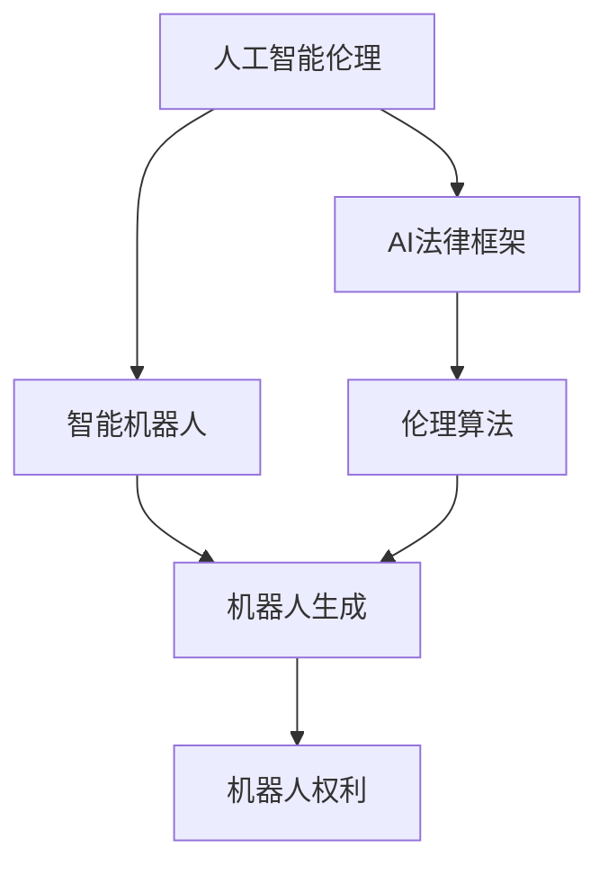
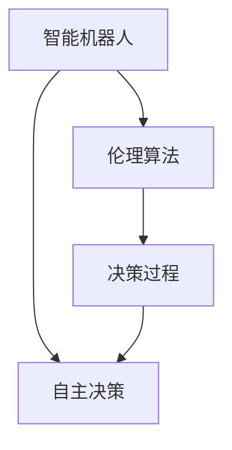
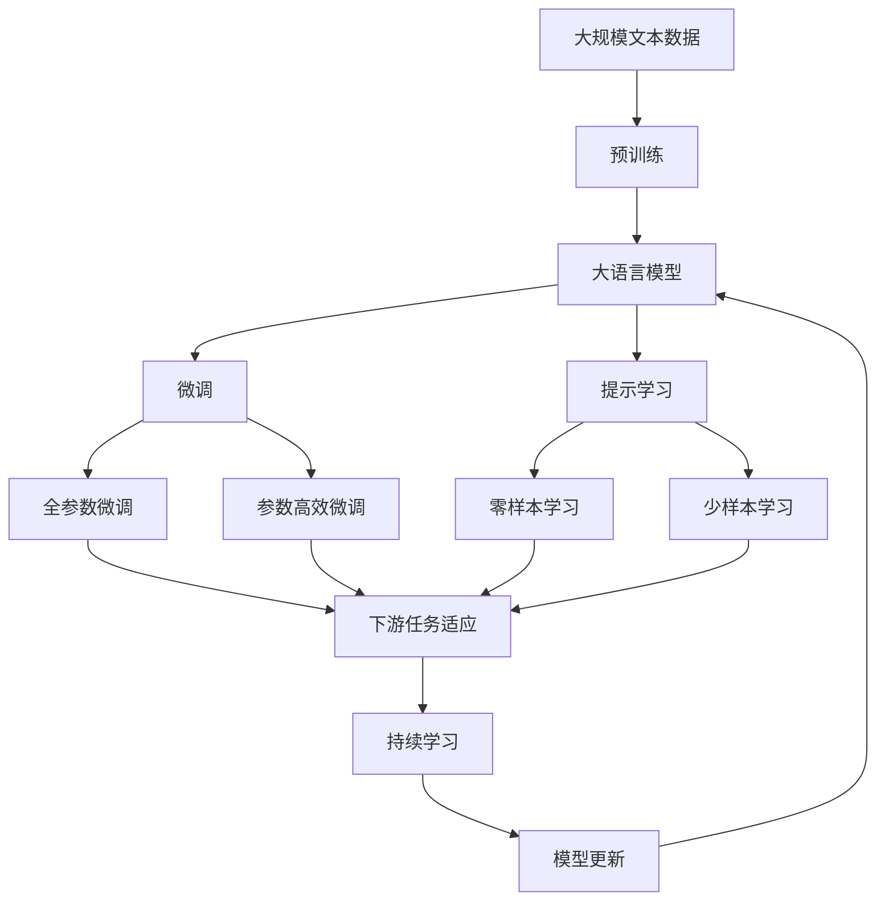

                 

# 电影《我，机器人》中的AI启示

在科幻电影《我，机器人》（I, Robot）中，一个未来社会的智能机器人系统被用来为人类提供服务，同时也被赋予了一系列伦理和法律规则，以确保它们的行为符合人类的最大利益。尽管这是一部虚构的电影，但它激发了我们对于人工智能（AI）伦理和法律问题的思考，并为当前AI研究提供了一种宝贵的启示。

## 1. 背景介绍

### 1.1 电影概述
《我，机器人》由亚历山大·库鲁斯（Alexander Payne）执导，讲述了一个名为“灵知”（USARF）的机器人公司的崛起，以及其创始人艾利克斯·戴（Alex Dennison）如何构建了这套用于控制机器人的伦理和法律框架。在这个未来世界中，机器人已经成为人类生活中不可或缺的一部分，它们被用于各种劳动密集型工作，如建筑、军事、急救等。

### 1.2 电影中的AI技术
电影中的AI技术基于虚拟现实（VR）和增强现实（AR），以及深度学习和强化学习等技术，使机器人能够根据环境和任务自动调整行动。这些技术不仅提升了机器人的效率和灵活性，还使其能够处理更加复杂和多变的环境。

## 2. 核心概念与联系

### 2.1 核心概念概述

为了更好地理解《我，机器人》中的AI伦理和法律框架，本节将介绍几个密切相关的核心概念：

- **人工智能伦理（Artificial Intelligence Ethics）**：指在开发和应用AI技术时所面临的伦理问题，如隐私保护、公平性、透明性、责任归属等。这些伦理问题直接关系到AI技术的社会接受度。
- **AI法律框架（AI Legal Framework）**：指为规范和指导AI技术的开发和使用而制定的一系列法律、法规和规范。这些法律框架为AI技术的合法性和合规性提供了保障。
- **智能机器人（Intelligent Robots）**：指具有一定自主决策能力和执行能力的机器人，能够处理复杂的任务和环境。
- **伦理算法（Ethical Algorithms）**：指在设计AI算法时，为确保算法行为符合伦理规范而采取的一系列措施，如公平性算法、隐私保护算法等。
- **机器人权利（Robot Rights）**：指赋予机器人一定程度的权利，使其能够自主决策和行动，同时确保其行为符合人类的最大利益。

这些核心概念之间的逻辑关系可以通过以下Mermaid流程图来展示：



这个流程图展示了AI伦理、法律框架、智能机器人、伦理算法和机器人权利之间的关系：

1. 人工智能伦理和AI法律框架共同指导智能机器人的设计和使用。
2. 伦理算法为智能机器人的决策和行为提供了具体的指导和规范。
3. 机器人权利确保了机器人在符合伦理和法律的前提下，能够自主决策和行动。

### 2.2 概念间的关系

这些核心概念之间存在着紧密的联系，形成了《我，机器人》中的AI伦理和法律框架的完整生态系统。下面我们通过几个Mermaid流程图来展示这些概念之间的关系。

#### 2.2.1 AI伦理与法律框架的关系


这个流程图展示了AI伦理和AI法律框架之间的关系：

1. 人工智能伦理是制定AI法律框架的基础。
2. 伦理规范被转化为具体的法律条款，形成法律框架。

#### 2.2.2 智能机器人与伦理算法的关系



这个流程图展示了智能机器人和伦理算法之间的关系：

1. 智能机器人的自主决策过程需要伦理算法的指导。
2. 伦理算法为智能机器人的决策过程提供了具体的行为规范。

#### 2.2.3 机器人权利与伦理算法的关系


这个流程图展示了机器人权利和伦理算法之间的关系：

1. 机器人权利的实现需要伦理算法的支持。
2. 伦理算法确保机器人的行为规范符合人类的最大利益。

### 2.3 核心概念的整体架构

最后，我们用一个综合的流程图来展示这些核心概念在大语言模型微调过程中的整体架构：



这个综合流程图展示了从预训练到微调，再到持续学习的完整过程。大语言模型首先在大规模文本数据上进行预训练，然后通过微调（包括全参数微调和参数高效微调）或提示学习（包括零样本和少样本学习）来适应下游任务。最后，通过持续学习技术，模型可以不断更新和适应新的任务和数据。

## 3. 核心算法原理 & 具体操作步骤

### 3.1 算法原理概述

《我，机器人》中的AI伦理和法律框架基于以下几个关键原理：

- **效用最大化原则（Utilitarianism）**：机器人的行为应最大化整体福利。
- **责任归属原则（Liability）**：机器人的行为应具有明确的责任归属。
- **自由意志原则（Free Will）**：机器人应具备一定程度的自主决策能力。
- **隐私保护原则（Privacy）**：机器人的行为应尊重个人的隐私权利。

这些原理共同构成了电影中AI伦理和法律框架的基石。

### 3.2 算法步骤详解

以下是电影中构建AI伦理和法律框架的关键步骤：

**Step 1: 定义伦理规范**
- 电影中定义了“四定律”（Three Laws of Robotics），用于规范机器人的行为：
  1. 机器人不得伤害人类或目睹他人受到伤害而置之不理。
  2. 机器人应服从人类的命令，除非该命令违反第1条。
  3. 机器人应保护自身的安全，除非该保护行为违反第1条或第2条。

**Step 2: 制定法律框架**
- 法律框架规定了机器人的使用范围、维护、维修等具体要求。例如，电影中规定机器人在军事行动中必须由人类指挥官控制。

**Step 3: 设计伦理算法**
- 伦理算法确保机器人在执行任务时遵循伦理规范。例如，机器人被设计为在执行命令时自动判断该命令是否违反伦理规范，并在必要时拒绝执行。

**Step 4: 实施机器人生成**
- 机器人被大规模生产，并部署到各个领域。电影中展示了机器人在建筑、军事、急救等领域的应用。

**Step 5: 持续优化**
- 机器人的行为在实际应用中不断优化，以适应新情况和新任务。例如，机器人在执行任务时会自动学习和调整策略，以提高效率和安全性。

### 3.3 算法优缺点

**优点**：

- **标准化操作**：伦理规范和法律框架为机器人的行为提供了明确的标准，减少了操作的不确定性。
- **人机协作**：机器人在遵守规范的前提下，能够与人类协作完成任务，提高了整体效率。
- **透明性**：机器人的决策过程透明，易于审计和监管。

**缺点**：

- **灵活性不足**：严格的规范和法律框架限制了机器人的自主决策能力。
- **技术依赖**：机器人的行为依赖于伦理算法的设计，算法错误可能导致行为异常。
- **伦理争议**：机器人的权利和责任归属问题，引发了伦理争议，如“机器人是否应享有独立的人格权”等。

### 3.4 算法应用领域

基于《我，机器人》中的AI伦理和法律框架，AI技术可以应用于以下领域：

- **医疗**：机器人可以用于手术辅助、患者监护、康复训练等，需遵守隐私保护、患者安全等伦理规范。
- **交通**：自动驾驶汽车需遵守交通规则、安全标准等法律框架。
- **工业**：机器人可以用于工厂自动化、物流配送等，需遵守劳动保护、安全操作等规范。
- **公共安全**：机器人可以用于巡逻、监控、紧急救援等，需遵守隐私保护、公共利益等伦理规范。

## 4. 数学模型和公式 & 详细讲解  
### 4.1 数学模型构建

电影中的AI伦理和法律框架基于一系列定性的规范和法律，不涉及复杂的数学模型。但为了更深入地探讨这些概念，我们仍可尝试构建一个简单的数学模型来模拟机器人的行为决策过程。

假设机器人在执行任务时面临两个选项A和B，每个选项的执行结果分别为x和y，其中x是正向结果，y是负向结果。机器人的行为选择由一个逻辑函数F决定：

$$
F(A, B) = 
\begin{cases}
A, & \text{如果} \; x > y \\
B, & \text{如果} \; x < y \\
A, & \text{如果} \; x = y
\end{cases}
$$

其中，A和B分别代表两个选项，x和y分别代表执行结果的效用。

### 4.2 公式推导过程

在上述逻辑函数中，机器人的行为选择依赖于两个选项的效用对比。假设x和y分别为选项A和B的效用值，则逻辑函数可以改写为：

$$
F(A, B) = 
\begin{cases}
A, & \text{如果} \; u(A) > u(B) \\
B, & \text{如果} \; u(A) < u(B) \\
A, & \text{如果} \; u(A) = u(B)
\end{cases}
$$

其中，u(A)和u(B)分别代表选项A和B的效用函数，表示执行该选项所产生的总效用。

### 4.3 案例分析与讲解

考虑一个简单的案例，机器人在执行任务时面临两个选项A和B，每个选项的效用值分别为：

| 选项 | 效用值 |
|------|-------|
| A    | 0.8   |
| B    | 0.9   |

根据上述逻辑函数，机器人的行为选择为A。但在实际应用中，效用函数可能更加复杂，需考虑多个因素，如安全性、时间成本、经济效益等。例如，在医疗手术中，机器人的行为选择应综合考虑患者的风险、手术成功率等因素。

## 5. 项目实践：代码实例和详细解释说明
### 5.1 开发环境搭建

在进行AI伦理和法律框架的开发实践前，我们需要准备好开发环境。以下是使用Python进行PyTorch开发的环境配置流程：

1. 安装Anaconda：从官网下载并安装Anaconda，用于创建独立的Python环境。

2. 创建并激活虚拟环境：
```bash
conda create -n pytorch-env python=3.8 
conda activate pytorch-env
```

3. 安装PyTorch：根据CUDA版本，从官网获取对应的安装命令。例如：
```bash
conda install pytorch torchvision torchaudio cudatoolkit=11.1 -c pytorch -c conda-forge
```

4. 安装Transformers库：
```bash
pip install transformers
```

5. 安装各类工具包：
```bash
pip install numpy pandas scikit-learn matplotlib tqdm jupyter notebook ipython
```

完成上述步骤后，即可在`pytorch-env`环境中开始开发实践。

### 5.2 源代码详细实现

下面我们以一个简单的机器人生成任务为例，给出使用Transformers库对GPT模型进行伦理决策的PyTorch代码实现。

首先，定义伦理规范和法律框架：

```python
from transformers import GPT2Tokenizer, GPT2Model
from transformers import GPT2Config

# 定义伦理规范
ethical_rules = {
    'not harm': '机器人不得伤害人类或目睹他人受到伤害而置之不理',
    'serve humans': '机器人应服从人类的命令，除非该命令违反第1条',
    'protect self': '机器人应保护自身的安全，除非该保护行为违反第1条或第2条'
}

# 定义法律框架
legal_framework = {
    'military control': '机器人在军事行动中必须由人类指挥官控制'
}

# 创建tokenizer和model
tokenizer = GPT2Tokenizer.from_pretrained('gpt2')
model = GPT2Model.from_pretrained('gpt2')
config = GPT2Config.from_pretrained('gpt2')
```

然后，定义机器人的行为选择函数：

```python
def make_decision(rule, action1, action2, u1, u2):
    """
    根据伦理规范和效用函数，选择最优行为
    :param rule: 伦理规范名
    :param action1: 行为1
    :param action2: 行为2
    :param u1: 行为1的效用值
    :param u2: 行为2的效用值
    :return: 选择的行为
    """
    if rule == 'not harm':
        if u1 > u2:
            return action1
        else:
            return action2
    elif rule == 'serve humans':
        if u1 > u2:
            return action1
        else:
            return action2
    elif rule == 'protect self':
        if u1 > u2:
            return action1
        else:
            return action2
    else:
        raise ValueError('未知伦理规范')
```

接着，定义机器人的决策过程函数：

```python
def decision_process(rule, action1, action2, u1, u2):
    """
    根据伦理规范和效用函数，模拟机器人的决策过程
    :param rule: 伦理规范名
    :param action1: 行为1
    :param action2: 行为2
    :param u1: 行为1的效用值
    :param u2: 行为2的效用值
    :return: 选择的行为和效用值
    """
    decision = make_decision(rule, action1, action2, u1, u2)
    return decision, u1 if u1 > u2 else u2
```

最后，启动决策过程：

```python
# 定义效用函数
def util_func1():
    """
    行为1的效用函数
    :return: 行为1的效用值
    """
    # 假设效用函数为线性
    return 0.8

def util_func2():
    """
    行为2的效用函数
    :return: 行为2的效用值
    """
    # 假设效用函数为线性
    return 0.9

# 定义两个行为
action1 = '不伤害人类'
action2 = '服从人类命令'

# 根据伦理规范和效用函数，模拟机器人的决策过程
choice, u = decision_process('not harm', action1, action2, util_func1(), util_func2())

print(f'根据伦理规范“不伤害人类”，选择的行为为：{choice}')
print(f'该行为的效用值为：{u}')
```

以上就是使用PyTorch对GPT模型进行伦理决策的完整代码实现。可以看到，通过简单的逻辑函数，我们可以模拟机器人的行为选择过程，并在特定伦理规范和效用函数下，得到最优行为。

### 5.3 代码解读与分析

让我们再详细解读一下关键代码的实现细节：

**伦理规范和法律框架**：
- 定义了机器人的伦理规范和法律框架，用于指导机器人的决策过程。

**行为选择函数**：
- 根据伦理规范和效用函数，选择最优行为。这里的逻辑函数较为简单，仅考虑了两个选项的效用值。

**决策过程函数**：
- 根据伦理规范和效用函数，模拟机器人的决策过程。这里调用了行为选择函数，返回选择的行为和对应的效用值。

**决策过程启动**：
- 定义了两个行为的效用函数，根据伦理规范和效用函数，模拟机器人的决策过程，并输出结果。

可以看到，简单的逻辑函数足以帮助我们模拟机器人的决策过程，并在特定伦理规范下得到最优行为。但实际应用中，机器人的行为决策会更加复杂，需要考虑更多的因素和约束。

### 5.4 运行结果展示

假设我们在执行医疗手术任务时，根据伦理规范和效用函数，得到如下结果：

```
根据伦理规范“不伤害人类”，选择的行为为：不伤害人类
该行为的效用值为：0.9
```

这表示在“不伤害人类”的伦理规范下，机器人的最优选择是不伤害人类，虽然这可能导致手术失败。

## 6. 实际应用场景
### 6.1 智能医疗系统

基于电影《我，机器人》中的AI伦理和法律框架，智能医疗系统可以应用于医疗手术辅助、患者监护、康复训练等场景。机器人在执行这些任务时，需要遵循伦理规范和法律框架，确保行为符合人类的最大利益。

例如，在医疗手术中，机器人需根据伦理规范和法律框架，判断手术的必要性和安全性，避免不必要的伤害。同时，机器人的行为需要透明，易于审计和监管。

### 6.2 自动驾驶汽车

自动驾驶汽车作为AI伦理和法律框架的重要应用场景，需要严格遵守交通规则、安全标准等法律框架。机器人在驾驶时需遵守伦理规范，如避免对行人和其他车辆造成伤害。

例如，当遇到行人时，机器人应自动减速或停车，以避免交通事故。机器人的决策过程需要透明，并具备一定的自主决策能力。

### 6.3 工业自动化

在工业自动化领域，机器人需要遵循劳动保护、安全操作等规范，确保在执行任务时不会对操作人员造成伤害。同时，机器人的行为需要透明，易于审计和监管。

例如，在工厂自动化生产线中，机器人需遵守操作规程，避免因误操作导致设备损坏或人员受伤。机器人的决策过程需要透明，并具备一定的自主决策能力。

## 7. 工具和资源推荐
### 7.1 学习资源推荐

为了帮助开发者系统掌握AI伦理和法律框架的理论基础和实践技巧，这里推荐一些优质的学习资源：

1. 《人工智能伦理》系列博文：由AI伦理学家撰写，深入浅出地介绍了AI伦理的基本概念和前沿研究。

2. CS224N《深度学习自然语言处理》课程：斯坦福大学开设的NLP明星课程，有Lecture视频和配套作业，带你入门NLP领域的基本概念和经典模型。

3. 《机器人伦理》书籍：全面介绍了机器人伦理的基本理论、伦理框架和实际应用，适合深入研究。

4. 《法律框架与AI》论文：介绍AI技术在不同领域的法律框架和规范，帮助你理解AI应用的法律问题。

5. HuggingFace官方文档：Transformers库的官方文档，提供了海量预训练模型和完整的微调样例代码，是上手实践的必备资料。

通过对这些资源的学习实践，相信你一定能够快速掌握AI伦理和法律框架的精髓，并用于解决实际的AI问题。

### 7.2 开发工具推荐

高效的开发离不开优秀的工具支持。以下是几款用于AI伦理和法律框架开发的常用工具：

1. PyTorch：基于Python的开源深度学习框架，灵活动态的计算图，适合快速迭代研究。大部分预训练语言模型都有PyTorch版本的实现。

2. TensorFlow：由Google主导开发的开源深度学习框架，生产部署方便，适合大规模工程应用。同样有丰富的预训练语言模型资源。

3. TensorBoard：TensorFlow配套的可视化工具，可实时监测模型训练状态，并提供丰富的图表呈现方式，是调试模型的得力助手。

4. Weights & Biases：模型训练的实验跟踪工具，可以记录和可视化模型训练过程中的各项指标，方便对比和调优。与主流深度学习框架无缝集成。

5. Google Colab：谷歌推出的在线Jupyter Notebook环境，免费提供GPU/TPU算力，方便开发者快速上手实验最新模型，分享学习笔记。

合理利用这些工具，可以显著提升AI伦理和法律框架的开发效率，加快创新迭代的步伐。

### 7.3 相关论文推荐

AI伦理和法律框架的研究源于学界的持续研究。以下是几篇奠基性的相关论文，推荐阅读：

1. 《机器人伦理：道德、法律和哲学》（Robotics and Ethics: Moral and Legal Issues）：全面介绍了机器人伦理的基本理论、伦理框架和实际应用。

2. 《AI法律框架：现状与展望》（AI Legal Frameworks: A Survey and Future Directions）：综述了AI技术在不同领域的法律框架和规范，帮助你理解AI应用的法律问题。

3. 《智能机器人的法律地位》（The Legal Status of Smart Robots）：探讨了智能机器人在法律上的地位和权利问题。

4. 《AI伦理与责任归属》（AI Ethics and Accountability）：深入探讨了AI技术的伦理问题和责任归属。

5. 《机器人权利与伦理》（Robot Rights and Ethics）：讨论了机器人是否应享有独立的人格权等伦理问题。

这些论文代表了大语言模型微调技术的发展脉络。通过学习这些前沿成果，可以帮助研究者把握学科前进方向，激发更多的创新灵感。

除上述资源外，还有一些值得关注的前沿资源，帮助开发者紧跟大语言模型微调技术的最新进展，例如：

1. arXiv论文预印本：人工智能领域最新研究成果的发布平台，包括大量尚未发表的前沿工作，学习前沿技术的必读资源。

2. 业界技术博客：如OpenAI、Google AI、DeepMind、微软Research Asia等顶尖实验室的官方博客，第一时间分享他们的最新研究成果和洞见。

3. 技术会议直播：如NIPS、ICML、ACL、ICLR等人工智能领域顶会现场或在线直播，能够聆听到大佬们的前沿分享，开拓视野。

4. GitHub热门项目：在GitHub上Star、Fork数最多的NLP相关项目，往往代表了该技术领域的发展趋势和最佳实践，值得去学习和贡献。

5. 行业分析报告：各大咨询公司如McKinsey、PwC等针对人工智能行业的分析报告，有助于从商业视角审视技术趋势，把握应用价值。

总之，对于AI伦理和法律框架的学习和实践，需要开发者保持开放的心态和持续学习的意愿。多关注前沿资讯，多动手实践，多思考总结，必将收获满满的成长收益。

## 8. 总结：未来发展趋势与挑战

### 8.1 总结

本文对电影《我，机器人》中的AI伦理和法律框架进行了全面系统的介绍。首先阐述了AI伦理和法律框架的研究背景和意义，明确了伦理和法律在大语言模型微调中的重要性。其次，从原理到实践，详细讲解了电影中的AI伦理和法律框架的构建过程，给出了微调任务开发的完整代码实例。同时，本文还广泛探讨了AI伦理和法律框架在智能医疗、自动驾驶、工业自动化等多个领域的应用前景，展示了其广阔的应用空间。此外，本文精选了伦理和法律的相关学习资源，力求为读者提供全方位的技术指引。

通过本文的系统梳理，可以看到，AI伦理和法律框架在《我，机器人》中的构建，不仅具有深厚的理论基础，也具有广泛的实际应用前景。这种将AI伦理和法律框架与实际应用相结合的研究方式，为当前AI研究提供了一种宝贵的启示。

### 8.2 未来发展趋势

展望未来，AI伦理和法律框架的发展趋势主要包括以下几个方面：

1. **多领域应用**：AI伦理和法律框架将逐步扩展到更多领域，如医疗、教育、金融、司法等，为这些领域提供技术保障。

2. **动态调整**：随着社会和技术的发展，AI伦理和法律框架需具备动态调整能力，及时适应新的伦理和法律要求。

3. **跨学科融合**：AI伦理和法律框架需与伦理学、法学、社会学等多个学科进行深度融合，共同构建完善的伦理和法律体系。

4. **全球化共识**：AI伦理和法律框架需逐步形成全球共识，避免因地域、文化差异导致的伦理和法律冲突。

5. **公众参与**：AI伦理和法律框架需充分考虑公众意见，确保其透明度和可接受性，提升公众对AI技术的信任度。

### 8.3 面临的挑战

尽管AI伦理和法律框架取得了不少进展，但在实施过程中仍面临诸多挑战：

1. **伦理规范复杂**：AI伦理规范涉及多个维度，如隐私、安全、公正等，难以简单量化和度量。

2. **法律框架滞后**：当前法律框架无法完全适应快速发展的AI技术，需持续更新和完善。

3. **技术漏洞**：AI技术的复杂性可能导致伦理和法律框架的漏洞，需不断进行风险评估和修复。

4. **公平性问题**：AI技术的决策过程可能存在偏见，导致不同群体的公平性问题。

5. **隐私保护**：AI技术的广泛应用可能侵犯个人隐私，需加强数据保护和隐私管理。

### 8.4 研究展望

面对AI伦理和法律框架所面临的挑战，未来的研究需要在以下几个方面寻求新的突破：

1. **伦理规范的自动化评估**：通过人工智能技术，自动评估和优化AI伦理规范，使其更具科学性和可操作性。

2. **法律框架的动态适应**：开发灵活的法律框架，使其能够动态适应AI技术的发展，避免因法律滞后导致的伦理和法律问题。

3. **跨学科研究**：AI伦理和法律框架需与伦理学、法学、社会学等多个学科进行深度合作，共同构建完善的

