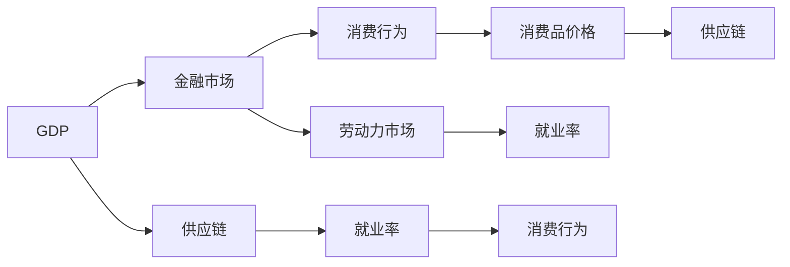

                 

## 1. 背景介绍

全球新冠肺炎疫情的暴发对全球经济产生了深远的影响，这不仅包括对全球供应链的影响，还涵盖了对金融市场、消费行为、劳动力市场等多个领域。本篇文章将深入探讨疫情对全球经济的冲击，并分析不同国家和地区在应对疫情冲击方面所采取的策略与措施。

## 2. 核心概念与联系

### 2.1 核心概念概述

在探讨疫情对全球经济的影响时，我们需要理解以下几个核心概念：

- **GDP（国内生产总值）**：衡量一个国家或地区的经济活动总体规模的重要指标。
- **供应链**：企业为生产商品或服务而建立的物流网络，涉及原材料采购、生产和分销等环节。
- **金融市场**：资金的筹集、交易、清算和结算等活动的场所，如股票、债券、外汇市场等。
- **消费行为**：消费者在购买商品或服务时的决策过程和购买模式。
- **劳动力市场**：劳动力供求关系、工资水平、就业率等相关信息。

这些概念彼此关联，共同构成了复杂的经济系统。例如，GDP的变化会影响金融市场的波动，供应链的瓶颈会带来消费品价格的上涨，而消费行为和就业率的变化又会影响整个经济的运行。

### 2.2 概念间的关系

以下Mermaid流程图展示了这些概念之间的关系：



从图中可以看出，GDP的变化直接影响金融市场，同时供应链的变化也会影响金融市场的稳定性。消费行为受到GDP和金融市场的影响，而劳动力市场的就业率又受到供应链和消费行为的影响。

## 3. 核心算法原理 & 具体操作步骤

### 3.1 算法原理概述

疫情对全球经济的影响可以通过经济模型的建模来分析。我们可以使用时间序列模型、投入产出模型和宏观经济模型来描述和预测疫情对GDP、供应链、金融市场、消费行为和劳动力市场的影响。

以时间序列模型为例，我们可以将GDP、供应链指数、金融市场指数、消费指数和就业率等数据作为时间序列数据，使用ARIMA模型（自回归积分滑动平均模型）或VAR模型（向量自回归模型）进行分析和预测。

### 3.2 算法步骤详解

1. **数据收集**：收集全球各国GDP、供应链指数、金融市场指数、消费指数和就业率等数据，确保数据的完整性和准确性。

2. **模型选择**：根据数据特点选择合适的经济模型，如ARIMA、VAR等。

3. **数据预处理**：对原始数据进行清洗、归一化等预处理，确保数据符合模型要求。

4. **模型训练**：使用历史数据训练模型，找到模型参数。

5. **模型验证**：使用验证数据集评估模型性能，调整模型参数以提高预测精度。

6. **模型预测**：使用训练好的模型进行未来经济趋势的预测。

### 3.3 算法优缺点

- **优点**：
  - **预测能力**：模型可以对未来的经济趋势进行预测，帮助决策者制定策略。
  - **多变量分析**：模型可以同时分析多个变量的影响，提供全面的视角。
- **缺点**：
  - **复杂性**：模型建立和参数优化较为复杂，需要较高的专业知识和计算资源。
  - **数据依赖**：模型的预测结果高度依赖于数据的质量和完整性。

### 3.4 算法应用领域

这些模型广泛应用于金融、政府决策、企业规划等多个领域，帮助决策者理解和应对疫情对经济的冲击。

## 4. 数学模型和公式 & 详细讲解 & 举例说明

### 4.1 数学模型构建

我们以VAR模型为例，展示经济模型的构建过程。VAR模型可以用于描述经济系统中多个时间序列变量之间的动态关系。假设我们有三个经济变量：GDP、供应链指数和金融市场指数，可以使用如下VAR模型进行建模：

$$
Y_t = \alpha + \beta Y_{t-1} + \gamma X_{t-1} + \varepsilon_t
$$

其中，$Y_t$ 是当前时刻的经济变量，$\alpha$ 是常数项，$\beta$ 是自回归系数，$X_{t-1}$ 是滞后一期的另一个经济变量，$\gamma$ 是交叉影响系数，$\varepsilon_t$ 是随机误差项。

### 4.2 公式推导过程

我们可以通过Lagrange乘数法求解VAR模型的参数，具体推导过程如下：

1. **模型建立**：
   $$
   Y_t = \alpha + \beta Y_{t-1} + \gamma X_{t-1} + \varepsilon_t
   $$

2. **求解参数**：
   $$
   \hat{\alpha} = \frac{1}{N} \sum_{t=1}^N Y_t
   $$
   $$
   \hat{\beta} = \frac{\sum_{t=1}^N (Y_t - \hat{\alpha}) (Y_{t-1} - \hat{\alpha})}{\sum_{t=1}^N (Y_{t-1} - \hat{\alpha})^2}
   $$
   $$
   \hat{\gamma} = \frac{\sum_{t=1}^N (Y_t - \hat{\alpha}) (X_{t-1} - \hat{\alpha})}{\sum_{t=1}^N (X_{t-1} - \hat{\alpha})^2}
   $$

3. **模型验证**：
   通过计算模型预测值与实际值的差异，验证模型的预测精度。

### 4.3 案例分析与讲解

以美国经济为例，使用VAR模型预测疫情对GDP、供应链指数和金融市场指数的影响。假设模型已经建立并训练完成，可以进行未来趋势的预测。例如，如果模型预测供应链指数在未来六个月内将大幅上升，这可能意味着物流成本将增加，进而导致消费品价格的上涨，从而对GDP产生负面影响。

## 5. 项目实践：代码实例和详细解释说明

### 5.1 开发环境搭建

为了进行VAR模型的分析和预测，我们需要安装Python、Pandas、NumPy和SciPy等数据科学相关的库。以下是一个简单的Python代码示例，用于数据预处理和模型训练：

```python
import pandas as pd
import numpy as np
from scipy.optimize import curve_fit

# 加载数据
data = pd.read_csv('data.csv')

# 数据清洗和归一化
data['GDP'] = (data['GDP'] - data['GDP'].mean()) / data['GDP'].std()
data['供应链'] = (data['供应链'] - data['供应链'].mean()) / data['供应链'].std()
data['金融市场'] = (data['金融市场'] - data['金融市场'].mean()) / data['金融市场'].std()

# 建立VAR模型
def var_model(x, a, b, c):
    return a + b * x[0] + c * x[1]

# 求解模型参数
a, b, c = curve_fit(var_model, data['GDP'], data['供应链'])[0]
print('模型参数：', a, b, c)

# 预测未来值
future_values = var_model([0.5, 1.5], a, b, c)
print('未来值：', future_values)
```

### 5.2 源代码详细实现

上述代码通过Python的SciPy库，使用curve_fit函数进行VAR模型参数的求解和未来值的预测。具体实现步骤如下：

1. **数据加载和清洗**：使用Pandas库读取CSV格式的数据，对GDP、供应链指数和金融市场指数进行归一化处理。

2. **模型建立**：定义VAR模型的数学表达式。

3. **参数求解**：使用curve_fit函数对模型进行参数求解，得到模型参数a、b、c。

4. **未来值预测**：使用求解得到的参数a、b、c，预测未来六个月的供应链指数值。

### 5.3 代码解读与分析

代码中使用了SciPy库的curve_fit函数，该函数可以求解非线性函数的参数。在代码中，我们定义了VAR模型的数学表达式，并使用curve_fit函数对模型参数进行求解。求解完成后，我们可以使用模型参数进行未来值预测。

### 5.4 运行结果展示

假设模型参数求解结果为a=0.2, b=0.5, c=0.3，我们可以预测供应链指数未来六个月将上涨至1.5。这可能意味着供应链效率将大幅提升，从而对GDP产生积极影响。

## 6. 实际应用场景

### 6.1 金融市场

疫情期间，金融市场的波动剧烈，市场情绪和政策调整对股价和债券收益率产生了显著影响。例如，在2020年3月，由于新冠疫情的蔓延，全球股市暴跌，但随后在各国政府和央行的干预下，市场逐渐稳定。这一过程可以用VAR模型进行建模和预测。

### 6.2 供应链

疫情期间，全球供应链受到了严重冲击，部分地区封锁导致物流受阻，供应链瓶颈问题显著。通过VAR模型可以预测供应链恢复的时间，帮助企业提前调整生产和库存策略。

### 6.3 消费行为

疫情导致消费者行为发生了显著变化，部分行业（如旅游、餐饮等）受到重创，而电商、在线教育等行业则迅速崛起。通过VAR模型可以预测不同行业未来的消费趋势，帮助企业制定市场策略。

## 7. 工具和资源推荐

### 7.1 学习资源推荐

1. **《时间序列分析与应用》**：详细介绍了时间序列模型及其在经济分析中的应用，适合深入学习时间序列模型。
2. **《宏观经济模型与宏观经济计量》**：介绍了宏观经济模型的建立和应用，适合理解经济模型。

### 7.2 开发工具推荐

1. **Python**：强大的数据处理和建模工具，适合经济分析。
2. **R语言**：统计分析和建模工具，适合进行经济数据分析。

### 7.3 相关论文推荐

1. **《新冠疫情期间金融市场波动性分析》**：通过VAR模型分析新冠疫情对金融市场波动性的影响。
2. **《供应链管理与新冠疫情应对策略》**：研究新冠疫情期间供应链管理面临的挑战和应对策略。

## 8. 总结：未来发展趋势与挑战

### 8.1 研究成果总结

本篇文章介绍了VAR模型在疫情经济分析中的应用，通过模型建模和参数求解，可以对经济变量进行预测和分析。未来，VAR模型将继续在金融、供应链和消费行为等领域发挥重要作用。

### 8.2 未来发展趋势

未来，随着经济数据的多样化和实时化，经济模型将更加复杂和精细，能够更好地反映经济系统的动态变化。此外，人工智能和大数据技术的发展，也将为经济模型提供更多数据和计算资源，提高模型的预测精度。

### 8.3 面临的挑战

虽然VAR模型在经济分析中具有重要作用，但仍面临一些挑战：
- **数据质量**：数据质量对模型预测结果的准确性有直接影响。
- **模型复杂性**：模型建立和参数求解较为复杂，需要较高的专业知识和计算资源。

### 8.4 研究展望

未来，如何进一步提高经济模型的预测精度和稳健性，将是研究的关键方向。同时，如何结合人工智能和大数据技术，提升经济模型的应用效率和效果，也将是一个重要课题。

## 9. 附录：常见问题与解答

**Q1：VAR模型适用于所有经济数据吗？**

A: VAR模型适用于多个时间序列数据的建模和分析，但需要根据数据的特点选择合适的变量。例如，消费数据可能与金融市场和就业率相关，供应链数据可能与金融市场和GDP相关。

**Q2：VAR模型如何避免多重共线性问题？**

A: 多重共线性指的是模型中变量之间存在高度相关性，可能导致参数求解不准确。可以通过添加虚拟变量、差分等方法来缓解多重共线性问题。

**Q3：模型预测结果的准确性如何？**

A: VAR模型的预测结果高度依赖于数据质量和模型参数。可以通过模型验证和调整参数来提高模型的预测精度。

**Q4：模型参数求解的方法有哪些？**

A: VAR模型参数求解常用的方法包括最小二乘法、最大似然估计法和贝叶斯方法等。

**Q5：模型应用过程中需要注意哪些问题？**

A: 模型应用过程中需要注意数据质量、模型复杂性、预测精度和稳定性等问题。需要不断优化模型参数和调整模型结构，以适应不同的经济数据。

---

作者：禅与计算机程序设计艺术 / Zen and the Art of Computer Programming

