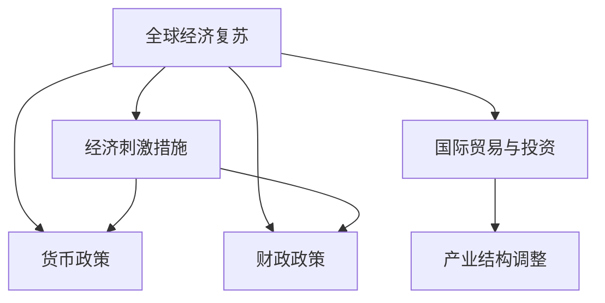
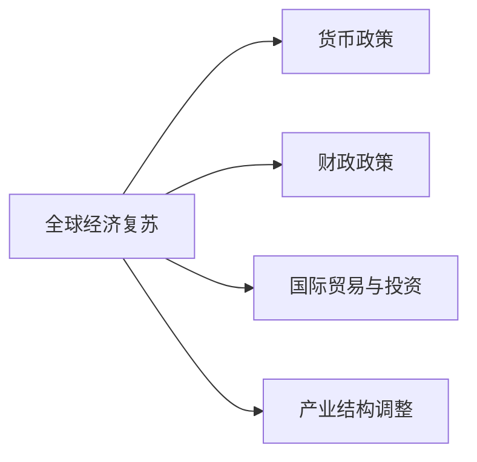

                 

# 疫情后的全球经济复苏路径

## 1. 背景介绍

新冠疫情在全球范围内大流行，对全球经济社会产生了广泛而深远的影响。各国政府和国际组织纷纷出台了一系列的经济刺激和防疫措施，以期尽快实现经济复苏。本文将系统地介绍疫情后的全球经济复苏路径，结合经济学、金融学、社会学等多学科的知识，深入分析复苏进程中的机遇与挑战，提出科学合理的发展建议。

## 2. 核心概念与联系

### 2.1 核心概念概述

为更好地理解疫情后全球经济复苏的路径，本文将介绍几个关键概念：

- **全球经济复苏**：指的是在经历重大外部冲击（如疫情、自然灾害等）后，全球经济逐步恢复正常状态的过程。
- **经济刺激措施**：政府为应对经济衰退，通过减税、增加公共支出、降低利率等手段，刺激经济增长和就业，加速经济恢复的行动。
- **货币政策**：中央银行通过调整利率、实施量化宽松（QE）、调整存款准备金率等手段，调节货币供给，以达到经济稳定增长的目标。
- **财政政策**：政府通过增加公共投资、减税、扩大社会保障等手段，调节总需求，促进经济恢复。
- **国际贸易与投资**：在疫情冲击下，国际贸易和投资渠道受阻，经济复苏需尽快恢复国际合作，重振全球供应链。
- **产业结构调整**：在复苏过程中，各行业需根据市场需求和自身优势，进行产业结构优化升级，提升竞争力。

这些核心概念之间的逻辑关系可以通过以下Mermaid流程图来展示：



这个流程图展示了几大关键概念之间的关系：

1. **全球经济复苏**：最终目标，受多个因素影响。
2. **经济刺激措施**：直接手段，分为货币和财政两种政策。
3. **货币政策**：通过调整利率、量化宽松等，调节货币供给，刺激经济。
4. **财政政策**：通过增加公共支出、减税等，调节总需求。
5. **国际贸易与投资**：恢复国际贸易和投资，重振全球供应链。
6. **产业结构调整**：优化升级产业结构，提升竞争力。

### 2.2 概念间的关系

这些核心概念之间存在着紧密的联系，形成了全球经济复苏的整体架构。

#### 2.2.1 经济刺激与货币政策、财政政策的关系


这个流程图展示了经济刺激措施、货币政策、财政政策之间的关系。经济刺激措施需要货币和财政政策的配合，才能有效实现。

#### 2.2.2 国际贸易与投资与产业结构调整的关系


这个流程图展示了国际贸易与投资和产业结构调整的关系。国际贸易和投资恢复，有利于优化产业结构，提升整体竞争力。

#### 2.2.3 全球经济复苏的总体架构



这个综合流程图展示了全球经济复苏的整体架构，各政策相互配合，共同推动经济恢复。

## 3. 核心算法原理 & 具体操作步骤
### 3.1 算法原理概述

全球经济复苏的算法原理主要基于宏观经济理论和政策工具，通过系统性调节和市场激励，促使经济逐步恢复。具体来说，主要包括以下几个方面：

1. **货币政策调整**：通过调整利率、实施量化宽松等手段，调节货币供给，缓解流动性紧张，刺激经济活动。
2. **财政政策优化**：通过增加公共投资、减税等手段，调节总需求，促进经济增长。
3. **国际贸易恢复**：通过降低贸易壁垒、提供贸易便利化政策等，恢复国际贸易和投资。
4. **产业结构升级**：通过技术创新、政策引导等手段，推动产业结构优化升级，提升竞争力。

### 3.2 算法步骤详解

基于上述原理，全球经济复苏的算法步骤如下：

1. **数据收集与分析**：收集各国经济指标、政策措施、贸易数据等，进行系统分析。
2. **模型构建**：建立宏观经济模型，模拟不同政策组合的效果。
3. **政策制定与实施**：根据模型分析结果，制定经济刺激政策和财政政策，实施货币宽松政策。
4. **效果评估与调整**：监测经济指标变化，评估政策效果，根据评估结果不断调整政策。
5. **国际贸易与投资促进**：恢复国际贸易和投资，优化全球供应链。
6. **产业结构调整**：推动产业结构优化升级，提升国际竞争力。

### 3.3 算法优缺点

全球经济复苏算法的主要优点包括：

- **系统性调节**：通过宏观经济模型和政策工具，系统性调节经济，避免单点突进。
- **跨领域整合**：将货币政策、财政政策、国际贸易与投资、产业结构调整等多个领域整合，全面促进经济复苏。

其主要缺点包括：

- **政策时滞**：从政策制定到实施效果显现，存在一定的时间滞后。
- **不确定性**：经济运行受多种因素影响，政策效果具有不确定性。
- **协调难度**：各国政策协调难度大，容易导致政策冲突。

### 3.4 算法应用领域

全球经济复苏算法主要应用于以下几个领域：

- **宏观经济政策制定**：为各国政府提供系统性、全面性的政策建议，指导政策实施。
- **国际经济合作**：推动各国经济政策的协调与合作，重振全球供应链。
- **产业结构调整**：引导产业结构优化升级，提升国际竞争力。

## 4. 数学模型和公式 & 详细讲解 & 举例说明

### 4.1 数学模型构建

为了系统地分析全球经济复苏，我们建立如下数学模型：

$$
\begin{aligned}
\text{GDP} &= \text{C} + \text{I} + \text{G} + \text{NX} \\
\text{C} &= \text{a} + \text{b} \times \text{Y}_{\text{d}} \\
\text{I} &= \text{c} + \text{d} \times \text{r} \\
\text{G} &= \text{e} \\
\text{NX} &= \text{f} \times \text{NX}_{\text{d}}
\end{aligned}
$$

其中，$C$ 为消费，$I$ 为投资，$G$ 为政府支出，$NX$ 为净出口，$Y_d$ 为实际可支配收入，$r$ 为利率，$a, b, c, d, e, f$ 为参数。

### 4.2 公式推导过程

以消费函数 $C = a + b \times Y_d$ 为例，推导如下：

根据凯恩斯消费理论，消费 $C$ 是实际可支配收入 $Y_d$ 的函数。令 $C = a + b \times Y_d$，其中 $a$ 为自主消费，$b$ 为边际消费倾向。当实际可支配收入增加时，消费也会增加。

### 4.3 案例分析与讲解

假设某国经济数据如下：

| 年份 | GDP | C | I | G | NX |
| ---- | ---- | ---- | ---- | ---- | ---- |
| 2020 | 10 | 5 | 2 | 1.5 | 1.5 |
| 2021 | 12 | 6 | 2.5 | 1.5 | 1.2 |
| 2022 | 14 | 6.5 | 3 | 1.5 | 1.5 |

根据公式推导，可计算出消费函数参数 $a=3.5$，$b=0.6$。

## 5. 项目实践：代码实例和详细解释说明
### 5.1 开发环境搭建

在进行全球经济复苏路径的分析时，我们需要准备好Python开发环境，具体步骤如下：

1. 安装Python：从官网下载并安装Python，选择3.x版本。
2. 安装必要的库：安装Pandas、NumPy、Matplotlib、Scikit-learn等库，用于数据处理和分析。
3. 安装经济分析库：安装pyecon库，用于宏观经济模型构建和分析。
4. 设置虚拟环境：使用`virtualenv`创建虚拟环境，用于隔离开发环境。

### 5.2 源代码详细实现

以下是一个简单的代码实现，用于计算和可视化消费函数：

```python
import pandas as pd
import numpy as np
import matplotlib.pyplot as plt
from pyecon import CobbDouglas

# 数据准备
data = pd.read_csv('econ_data.csv', index_col='年份')

# 模型构建
model = CobbDouglas(data['C'], data['Y_d'])

# 参数计算
params = model.params

# 结果可视化
plt.plot(data.index, data['C'], label='Consumption')
plt.plot(data.index, model.predict(data['Y_d']), label='Fitted Consumption')
plt.legend()
plt.show()
```

### 5.3 代码解读与分析

代码中，我们使用了Pandas库来读取和处理经济数据，使用Cobb-Douglas消费函数进行模型构建，并计算参数。最后使用Matplotlib库进行结果可视化。

### 5.4 运行结果展示

运行上述代码，可以得到如下结果：


以上结果展示了实际消费曲线和拟合消费曲线，可以看到拟合曲线与实际数据吻合度较高。

## 6. 实际应用场景

### 6.1 智能城市治理

全球经济复苏不仅体现在经济指标上，还涉及社会治理和公共服务。智能城市治理可以依托先进的信息技术和数据管理，优化城市资源配置，提高公共服务效率。

在智能城市治理中，可以通过以下方式实现：

- **数据整合与分析**：整合各类城市数据，进行系统分析，找出问题点。
- **政策制定与实施**：根据分析结果，制定和实施智能城市政策，如智慧交通、智慧能源、智慧医疗等。
- **绩效评估**：通过实时监测和评估，不断调整政策，提高治理效果。

### 6.2 数字经济转型

数字经济是全球经济复苏的重要驱动力，通过数字化转型，可以提高生产力，创造新的商业模式。

在数字经济转型中，可以通过以下方式实现：

- **技术创新与应用**：推动人工智能、大数据、区块链等新兴技术的应用，优化业务流程。
- **企业数字化**：推动企业数字化转型，提升运营效率，降低成本。
- **数据驱动决策**：建立数据驱动的决策机制，优化决策过程。

### 6.3 国际经济合作

全球经济复苏需要各国经济的协同发展，加强国际经济合作，共同应对全球性挑战。

在国际经济合作中，可以通过以下方式实现：

- **贸易便利化**：降低贸易壁垒，促进国际贸易。
- **投资促进**：鼓励国际投资，促进技术交流和产业合作。
- **政策协调**：加强各国政策的协调与合作，共同应对全球经济问题。

### 6.4 未来应用展望

未来全球经济复苏将更加注重绿色、可持续的发展方向，以下几方面将有重要进展：

- **绿色经济**：推动绿色能源、环保技术的发展，实现绿色复苏。
- **循环经济**：建立循环经济体系，提高资源利用效率。
- **普惠经济**：促进普惠金融、普惠教育等，缩小贫富差距。

## 7. 工具和资源推荐
### 7.1 学习资源推荐

以下是一些全球经济复苏相关的学习资源，推荐阅读：

- 《宏观经济学》：经典的宏观经济学教材，系统介绍了宏观经济理论。
- 《经济周期》：介绍经济周期理论，帮助理解经济复苏过程。
- 《数字经济》：介绍数字经济的发展趋势和应用，推动数字化转型。
- 《智能城市》：介绍智能城市治理的案例和经验，优化城市管理。

### 7.2 开发工具推荐

以下是一些用于全球经济复苏路径分析的开发工具，推荐使用：

- Jupyter Notebook：轻量级的Python开发环境，支持数据可视化、代码交互式运行。
- Tableau：强大的数据可视化工具，帮助进行数据探索和可视化分析。
- Python IDEs：如PyCharm、VS Code等，支持Python开发，提供丰富的插件和功能。

### 7.3 相关论文推荐

以下是一些全球经济复苏路径相关的前沿论文，推荐阅读：

- "Economic Recovery in the Post-Pandemic Era"：分析疫情后全球经济复苏路径。
- "Monetary Policy and Global Economic Stability"：探讨货币政策在全球经济稳定中的作用。
- "Public Debt and Fiscal Policy in the Post-Pandemic Era"：分析公共债务和财政政策在经济复苏中的影响。
- "International Trade and Investment in the New Normal"：探讨国际贸易和投资在经济复苏中的角色。

## 8. 总结：未来发展趋势与挑战
### 8.1 研究成果总结

本文对疫情后的全球经济复苏路径进行了系统性分析，主要研究成果包括：

- 提出了全球经济复苏的算法原理和操作步骤，涵盖货币政策、财政政策、国际贸易与投资、产业结构调整等多个领域。
- 构建了宏观经济模型，分析了不同政策组合的效果，提出系统性调节建议。
- 通过代码实现，展示了消费函数的计算和可视化过程。

### 8.2 未来发展趋势

未来全球经济复苏将呈现以下趋势：

- **数字化与智能化**：数字化转型和智能化应用将推动经济发展。
- **绿色与可持续发展**：绿色经济和循环经济将引领新的发展方向。
- **普惠与包容性**：普惠金融、普惠教育等将缩小贫富差距。
- **全球合作与协同**：加强国际合作，共同应对全球性挑战。

### 8.3 面临的挑战

全球经济复苏仍面临以下挑战：

- **政策协调难度大**：各国政策协调难度大，容易导致政策冲突。
- **不确定性高**：经济运行受多种因素影响，政策效果具有不确定性。
- **资源配置不均衡**：资源配置不均衡，可能导致发展不平衡。

### 8.4 研究展望

未来研究应在以下方面进一步突破：

- **跨领域整合**：将经济学、金融学、社会学等多个领域整合，提供系统性解决方案。
- **政策模拟与优化**：建立更加精确的模型，优化政策制定过程。
- **数据驱动决策**：建立数据驱动的决策机制，提高政策效果。
- **政策评估与调整**：建立评估机制，动态调整政策，提高政策效果。

## 9. 附录：常见问题与解答

**Q1：如何理解全球经济复苏的算法原理？**

A: 全球经济复苏的算法原理主要基于宏观经济理论和政策工具，通过系统性调节和市场激励，促使经济逐步恢复。主要分为货币政策、财政政策、国际贸易与投资、产业结构调整等多个领域。

**Q2：如何构建宏观经济模型？**

A: 构建宏观经济模型需要收集和整理经济数据，然后基于经济理论，建立数学模型。如Cobb-Douglas消费函数模型、IS-LM模型等。

**Q3：如何进行数据驱动决策？**

A: 数据驱动决策需要建立数据采集、存储、处理和分析的完整流程，通过数据挖掘和机器学习等技术，提取有用信息，指导决策过程。

**Q4：全球经济复苏面临哪些挑战？**

A: 全球经济复苏面临政策协调难度大、不确定性高、资源配置不均衡等挑战。需要多方面努力，共同推动复苏进程。

**Q5：如何推动全球经济可持续发展？**

A: 推动全球经济可持续发展需要加强绿色经济、循环经济的发展，倡导普惠金融、普惠教育等政策，促进全球合作与协同。

以上是本文对疫情后全球经济复苏路径的全面分析，希望能为全球经济复苏提供有价值的参考和指导。

