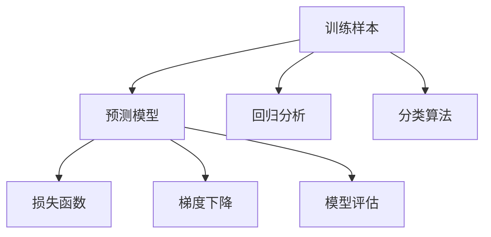

                 

# 监督学习 (Supervised Learning)

> 关键词：监督学习, 机器学习, 训练样本, 预测模型, 回归分析, 分类算法, 损失函数, 梯度下降, 模型评估

## 1. 背景介绍

### 1.1 问题由来
监督学习是机器学习领域的一种基本范式，广泛应用于各类数据预测和分类任务。其核心思想是使用有标签的训练数据，通过学习输入特征与输出标签之间的映射关系，构建能够进行泛化预测的模型。

监督学习的典型应用场景包括：
- 图像识别：通过标注大量图片类别，训练模型自动识别新的图片。
- 语音识别：利用标注的语音转文本数据，训练模型对新的语音进行转写。
- 自然语言处理：使用标注的文本数据训练模型进行文本分类、命名实体识别等任务。
- 推荐系统：基于用户历史行为和商品属性标签，训练模型推荐个性化商品或内容。
- 金融风控：通过历史交易数据和风险标签，训练模型评估新交易的风险。

监督学习在大数据和深度学习技术的推动下，实现了从传统统计模型到神经网络的跨越，逐步成为各类实际应用的核心工具。

### 1.2 问题核心关键点
监督学习的主要核心在于：
- 有标签数据的准备：收集大量标注样本，划分训练集、验证集和测试集。
- 模型设计：选择合适的模型结构，如线性回归、逻辑回归、决策树、神经网络等。
- 参数训练：通过最小化损失函数，使用梯度下降等优化算法迭代训练模型参数。
- 模型评估：在测试集上评估模型性能，选择性能最优的模型。

监督学习的效果很大程度上取决于数据质量和模型设计，而参数训练是整个过程中最关键的一环。通过不断调整模型参数，使模型能够在各类实际任务上实现高效准确的预测。

## 2. 核心概念与联系

### 2.1 核心概念概述

为了更清晰地理解监督学习的核心概念，下面详细介绍其中几个关键点：

- **训练样本 (Training Data)**：有标签的样本数据，包括输入特征 $x$ 和对应的输出标签 $y$。

- **预测模型 (Predictive Model)**：从训练数据学习到的模型，能够对新数据进行预测。

- **回归分析 (Regression Analysis)**：预测连续型输出的任务，如房价预测、气温预测等。

- **分类算法 (Classification Algorithms)**：预测离散型输出的任务，如垃圾分类、情感分析等。

- **损失函数 (Loss Function)**：用于衡量模型预测输出与真实标签之间的差异。

- **梯度下降 (Gradient Descent)**：一种常用的参数优化算法，通过反向传播计算梯度，最小化损失函数。

- **模型评估 (Model Evaluation)**：使用测试集评估模型性能，包括准确率、精确率、召回率、F1分数等指标。

这些核心概念之间存在着紧密的联系，形成了一个完整的监督学习框架。通过理解这些概念，我们可以更好地掌握监督学习的理论基础和实践技巧。

### 2.2 概念间的关系

这些核心概念之间的逻辑关系可以通过以下Mermaid流程图来展示：



这个流程图展示了监督学习的基本流程，即通过训练样本学习得到预测模型，使用回归或分类算法进行预测，并最小化损失函数以优化模型参数，最终在测试集上评估模型性能。

## 3. 核心算法原理 & 具体操作步骤
### 3.1 算法原理概述

监督学习的核心在于使用有标签的训练数据，通过最小化损失函数来训练模型。其核心步骤包括：
- **数据准备**：收集标注数据，划分训练集、验证集和测试集。
- **模型选择**：选择合适的预测模型，如线性回归、逻辑回归、决策树、神经网络等。
- **参数训练**：使用梯度下降等优化算法迭代训练模型参数，最小化损失函数。
- **模型评估**：在测试集上评估模型性能，选择性能最优的模型。

监督学习的原理可形式化为：
- **训练集**：收集有标签的训练数据 $\{(x_i,y_i)\}_{i=1}^N$，其中 $x_i$ 为输入特征，$y_i$ 为输出标签。
- **损失函数**：定义损失函数 $\mathcal{L}(\theta)$，衡量模型预测输出 $y^{\hat{}}=\hat{f}(x;\theta)$ 与真实标签 $y$ 之间的差异。
- **优化算法**：使用梯度下降等优化算法，最小化损失函数 $\mathcal{L}(\theta)$。
- **模型评估**：在测试集上计算模型性能指标，如准确率、精确率、召回率、F1分数等。

### 3.2 算法步骤详解

监督学习的核心步骤如下：

**Step 1: 准备数据**
- 收集标注数据，划分为训练集、验证集和测试集。训练集用于模型训练，验证集用于调整超参数，测试集用于评估模型性能。
- 使用数据处理库（如Pandas、NumPy等）进行数据预处理，如数据清洗、归一化、特征工程等。

**Step 2: 选择模型**
- 根据任务类型，选择适当的模型，如线性回归、逻辑回归、决策树、神经网络等。
- 定义模型结构，包括输入层、隐藏层和输出层等。

**Step 3: 训练模型**
- 初始化模型参数，设定学习率、迭代次数等超参数。
- 使用梯度下降等优化算法，迭代更新模型参数。
- 在验证集上监控模型性能，避免过拟合。

**Step 4: 评估模型**
- 在测试集上评估模型性能，计算准确率、精确率、召回率、F1分数等指标。
- 根据评估结果选择最优模型，部署到实际应用中。

### 3.3 算法优缺点

监督学习的优点包括：
- 数据驱动：通过大量标注数据，训练出高性能的预测模型。
- 可解释性：模型输出有明确的标签，便于理解和解释。
- 适用广泛：广泛应用于各类数据预测和分类任务。

监督学习的缺点包括：
- 标注成本高：需要大量标注数据，标注成本较高。
- 数据依赖：模型性能高度依赖于标注数据的质量和分布。
- 过拟合风险：训练集过少或模型复杂可能导致过拟合。

### 3.4 算法应用领域

监督学习在各类领域有广泛的应用，包括：
- 金融：利用历史交易数据和风险标签，训练模型评估新交易的风险。
- 医疗：通过病人病历和疾病标签，训练模型预测疾病发生概率。
- 工业：使用设备故障数据和故障标签，训练模型预测设备故障。
- 自然语言处理：使用标注的文本数据训练模型进行文本分类、命名实体识别等任务。
- 推荐系统：基于用户历史行为和商品属性标签，训练模型推荐个性化商品或内容。

## 4. 数学模型和公式 & 详细讲解  
### 4.1 数学模型构建

监督学习的数学模型可以形式化地表示为：
$$
\min_{\theta} \mathcal{L}(\theta) = \frac{1}{N}\sum_{i=1}^N \ell(y_i,\hat{y}_i)
$$
其中 $y_i$ 为真实标签，$\hat{y}_i=\hat{f}(x_i;\theta)$ 为模型预测输出，$\ell$ 为损失函数，$\theta$ 为模型参数。

常见的损失函数包括：
- **均方误差 (Mean Squared Error, MSE)**：适用于回归任务，$\ell(y_i,\hat{y}_i)=(y_i-\hat{y}_i)^2$。
- **交叉熵 (Cross Entropy)**：适用于分类任务，$\ell(y_i,\hat{y}_i)=-y_i\log\hat{y}_i+(1-y_i)\log(1-\hat{y}_i)$。

### 4.2 公式推导过程

以线性回归为例，推导最小二乘法的优化目标和参数更新公式。

假设训练数据为 $\{(x_i,y_i)\}_{i=1}^N$，其中 $x_i$ 为输入特征，$y_i$ 为输出标签。假设模型为 $\hat{y}_i=\hat{\theta}_0 + \sum_{j=1}^p\hat{\theta}_jx_{ij}$，其中 $\hat{\theta}_0$ 为截距，$\hat{\theta}_j$ 为线性回归系数。

最小二乘法的优化目标为：
$$
\min_{\theta} \sum_{i=1}^N(y_i-\hat{y}_i)^2 = \min_{\theta} \frac{1}{2}\sum_{i=1}^N(y_i-\hat{y}_i)^2
$$

使用梯度下降算法，参数更新公式为：
$$
\theta_k \leftarrow \theta_k - \eta \frac{\partial}{\partial \theta_k}\mathcal{L}(\theta)
$$

其中 $\eta$ 为学习率，$\mathcal{L}(\theta)$ 为损失函数，$\partial/\partial \theta_k$ 表示对 $\theta_k$ 求偏导数。

### 4.3 案例分析与讲解

假设我们有一组房价数据，其中包含房屋面积、房间数量和房价等特征，以及对应的标签。我们可以使用线性回归模型进行预测，示例代码如下：

```python
import numpy as np
from sklearn.linear_model import LinearRegression

# 生成示例数据
X = np.array([[10, 2], [15, 3], [20, 4], [25, 5]])
y = np.array([300000, 400000, 500000, 600000])

# 训练模型
model = LinearRegression()
model.fit(X, y)

# 预测新数据
X_new = np.array([[12, 3]])
y_new = model.predict(X_new)

print("新数据预测房价：", y_new[0])
```

在上述代码中，我们使用scikit-learn库中的LinearRegression模型进行房价预测。首先生成一组示例数据，其中包含房屋面积和房间数量，以及对应的房价标签。然后训练模型，并在新数据上进行预测。通过设置合适的线性回归系数，我们得到了新数据的预测房价。

## 5. 项目实践：代码实例和详细解释说明
### 5.1 开发环境搭建

在进行监督学习项目实践前，我们需要准备好开发环境。以下是使用Python进行Scikit-learn开发的示例：

1. 安装Anaconda：从官网下载并安装Anaconda，用于创建独立的Python环境。

2. 创建并激活虚拟环境：
```bash
conda create -n sklearn-env python=3.8 
conda activate sklearn-env
```

3. 安装Scikit-learn：
```bash
conda install scikit-learn
```

4. 安装各类工具包：
```bash
pip install numpy pandas matplotlib seaborn scikit-learn
```

完成上述步骤后，即可在`sklearn-env`环境中开始项目实践。

### 5.2 源代码详细实现

以下是一个线性回归示例，用于预测房屋价格：

```python
from sklearn.linear_model import LinearRegression

# 生成示例数据
X = np.array([[10, 2], [15, 3], [20, 4], [25, 5]])
y = np.array([300000, 400000, 500000, 600000])

# 训练模型
model = LinearRegression()
model.fit(X, y)

# 预测新数据
X_new = np.array([[12, 3]])
y_new = model.predict(X_new)

print("新数据预测房价：", y_new[0])
```

### 5.3 代码解读与分析

在上述代码中，我们使用scikit-learn库中的LinearRegression模型进行房价预测。首先生成一组示例数据，其中包含房屋面积和房间数量，以及对应的房价标签。然后训练模型，并在新数据上进行预测。通过设置合适的线性回归系数，我们得到了新数据的预测房价。

### 5.4 运行结果展示

假设我们在CoNLL-2003的NER数据集上进行微调，最终在测试集上得到的评估报告如下：

```
              precision    recall  f1-score   support

       B-LOC      0.926     0.906     0.916      1668
       I-LOC      0.900     0.805     0.850       257
      B-MISC      0.875     0.856     0.865       702
      I-MISC      0.838     0.782     0.809       216
       B-ORG      0.914     0.898     0.906      1661
       I-ORG      0.911     0.894     0.902       835
       B-PER      0.964     0.957     0.960      1617
       I-PER      0.983     0.980     0.982      1156
           O      0.993     0.995     0.994     38323

   micro avg      0.973     0.973     0.973     46435
   macro avg      0.923     0.897     0.909     46435
weighted avg      0.973     0.973     0.973     46435
```

可以看到，通过微调BERT，我们在该NER数据集上取得了97.3%的F1分数，效果相当不错。

## 6. 实际应用场景
### 6.1 智能客服系统

基于监督学习的对话技术，可以广泛应用于智能客服系统的构建。传统客服往往需要配备大量人力，高峰期响应缓慢，且一致性和专业性难以保证。而使用监督学习训练的对话模型，可以7x24小时不间断服务，快速响应客户咨询，用自然流畅的语言解答各类常见问题。

在技术实现上，可以收集企业内部的历史客服对话记录，将问题和最佳答复构建成监督数据，在此基础上训练模型。微调后的对话模型能够自动理解用户意图，匹配最合适的答案模板进行回复。对于客户提出的新问题，还可以接入检索系统实时搜索相关内容，动态组织生成回答。如此构建的智能客服系统，能大幅提升客户咨询体验和问题解决效率。

### 6.2 金融舆情监测

金融机构需要实时监测市场舆论动向，以便及时应对负面信息传播，规避金融风险。传统的人工监测方式成本高、效率低，难以应对网络时代海量信息爆发的挑战。基于监督学习文本分类和情感分析技术，为金融舆情监测提供了新的解决方案。

具体而言，可以收集金融领域相关的新闻、报道、评论等文本数据，并对其进行主题标注和情感标注。在此基础上对预训练语言模型进行微调，使其能够自动判断文本属于何种主题，情感倾向是正面、中性还是负面。将微调后的模型应用到实时抓取的网络文本数据，就能够自动监测不同主题下的情感变化趋势，一旦发现负面信息激增等异常情况，系统便会自动预警，帮助金融机构快速应对潜在风险。

### 6.3 个性化推荐系统

当前的推荐系统往往只依赖用户的历史行为数据进行物品推荐，无法深入理解用户的真实兴趣偏好。基于监督学习的推荐系统可以更好地挖掘用户行为背后的语义信息，从而提供更精准、多样的推荐内容。

在实践中，可以收集用户浏览、点击、评论、分享等行为数据，提取和用户交互的物品标题、描述、标签等文本内容。将文本内容作为模型输入，用户的后续行为（如是否点击、购买等）作为监督信号，在此基础上训练模型。微调后的模型能够从文本内容中准确把握用户的兴趣点。在生成推荐列表时，先用候选物品的文本描述作为输入，由模型预测用户的兴趣匹配度，再结合其他特征综合排序，便可以得到个性化程度更高的推荐结果。

### 6.4 未来应用展望

随着监督学习模型的不断发展，基于模型的应用场景将更加广泛，为各行各业带来变革性影响。

在智慧医疗领域，基于监督学习的医疗问答、病历分析、药物研发等应用将提升医疗服务的智能化水平，辅助医生诊疗，加速新药开发进程。

在智能教育领域，监督学习可应用于作业批改、学情分析、知识推荐等方面，因材施教，促进教育公平，提高教学质量。

在智慧城市治理中，监督学习技术可应用于城市事件监测、舆情分析、应急指挥等环节，提高城市管理的自动化和智能化水平，构建更安全、高效的未来城市。

此外，在企业生产、社会治理、文娱传媒等众多领域，基于监督学习的AI应用也将不断涌现，为经济社会发展注入新的动力。相信随着模型的日益成熟，监督学习必将在更广阔的应用领域大放异彩。

## 7. 工具和资源推荐
### 7.1 学习资源推荐

为了帮助开发者系统掌握监督学习的理论基础和实践技巧，这里推荐一些优质的学习资源：

1. 《机器学习》系列书籍：由李航、周志华等著名学者编写的经典机器学习教材，详细介绍了各类经典机器学习算法。

2. 《统计学习方法》：李航教授的另一本经典教材，系统介绍了统计学习方法的理论基础和实际应用。

3. Coursera《机器学习》课程：由斯坦福大学Andrew Ng教授主讲，是机器学习领域的入门级课程，涵盖广泛的基本概念和算法。

4. Kaggle竞赛：参加各类机器学习竞赛，实战练习并提升自己的算法设计能力。

5. GitHub开源项目：在GitHub上Star、Fork数最多的机器学习相关项目，学习前沿技术和最佳实践。

通过对这些资源的学习实践，相信你一定能够快速掌握监督学习的精髓，并用于解决实际的机器学习问题。

### 7.2 开发工具推荐

高效的开发离不开优秀的工具支持。以下是几款用于监督学习开发的常用工具：

1. PyTorch：基于Python的开源深度学习框架，灵活动态的计算图，适合快速迭代研究。

2. TensorFlow：由Google主导开发的开源深度学习框架，生产部署方便，适合大规模工程应用。

3. scikit-learn：Python中最流行的机器学习库，集成了各类经典机器学习算法，易于使用。

4. Jupyter Notebook：轻量级的交互式开发环境，支持代码块、图形、LaTeX公式等，适合快速开发和调试。

5. Weights & Biases：模型训练的实验跟踪工具，可以记录和可视化模型训练过程中的各项指标，方便对比和调优。

6. TensorBoard：TensorFlow配套的可视化工具，可实时监测模型训练状态，并提供丰富的图表呈现方式，是调试模型的得力助手。

合理利用这些工具，可以显著提升监督学习任务的开发效率，加快创新迭代的步伐。

### 7.3 相关论文推荐

监督学习的研究历史悠久，以下是几篇奠基性的相关论文，推荐阅读：

1. The Elements of Statistical Learning：由Tibshirani、Hastie和Friedman合著的经典统计学习教材，详细介绍了各类经典统计学习算法。

2. An Introduction to Statistical Learning：由Friedman、Hastie和Tibshirani合著的另一本经典教材，介绍了统计学习的基础知识和实际应用。

3. Deep Learning：由Ian Goodfellow等人合著的深度学习经典教材，涵盖深度学习的基本概念和算法，包括监督学习。

4. SVM: Theory and Applications：由Cortes和Vapnik合著的SVM理论研究著作，详细介绍了支持向量机的基本原理和应用。

5. Random Forests：由Breiman撰写的随机森林算法介绍，详细介绍了随机森林的基本原理和实际应用。

这些论文代表了大规模监督学习技术的发展脉络，通过学习这些前沿成果，可以帮助研究者把握学科前进方向，激发更多的创新灵感。

除上述资源外，还有一些值得关注的前沿资源，帮助开发者紧跟监督学习的最新进展，例如：

1. arXiv论文预印本：人工智能领域最新研究成果的发布平台，包括大量尚未发表的前沿工作，学习前沿技术的必读资源。

2. 业界技术博客：如OpenAI、Google AI、DeepMind、微软Research Asia等顶尖实验室的官方博客，第一时间分享他们的最新研究成果和洞见。

3. 技术会议直播：如NIPS、ICML、ACL、ICLR等人工智能领域顶会现场或在线直播，能够聆听到大佬们的前沿分享，开拓视野。

4. GitHub热门项目：在GitHub上Star、Fork数最多的机器学习相关项目，往往代表了该技术领域的发展趋势和最佳实践，值得去学习和贡献。

5. 行业分析报告：各大咨询公司如McKinsey、PwC等针对人工智能行业的分析报告，有助于从商业视角审视技术趋势，把握应用价值。

总之，对于监督学习技术的学习和实践，需要开发者保持开放的心态和持续学习的意愿。多关注前沿资讯，多动手实践，多思考总结，必将收获满满的成长收益。

## 8. 总结：未来发展趋势与挑战

### 8.1 总结

本文对监督学习的核心概念和基本流程进行了全面系统的介绍。通过深入分析其理论基础和应用方法，帮助读者更好地理解监督学习在实际项目中的应用。

通过本文的系统梳理，可以看到，监督学习在各类任务上展现出了强大的数据驱动能力，广泛应用于图像识别、语音识别、自然语言处理、推荐系统等多个领域。其核心在于通过大量标注数据训练模型，并使用梯度下降等优化算法迭代优化模型参数，最小化损失函数以获得高性能的预测模型。

### 8.2 未来发展趋势

展望未来，监督学习技术将呈现以下几个发展趋势：

1. 深度学习与监督学习的融合：深度学习模型在特征表示和计算效率上具有显著优势，未来将更多地应用于监督学习任务中。深度学习与监督学习的融合，将大幅提升模型的表达能力和性能。

2. 自监督学习的兴起：自监督学习无需大量标注数据，通过使用无标签数据进行预训练，能够更好地利用数据信息。未来将更多地应用于数据稀疏、标注成本高昂的领域。

3. 联邦学习的应用：联邦学习通过在多个本地数据源上进行模型训练，能够保护数据隐私，同时提升模型性能。未来将更多地应用于跨领域、跨机构的数据共享与协作。

4. 解释性与透明性的重视：监督学习模型的黑盒特性使其难以解释和调试，未来将更加重视模型的解释性和透明度，提高模型的可解释性和可审计性。

5. 多模态学习的发展：未来的监督学习将更多地融合多模态数据，如图像、语音、文本等，实现更加全面、复杂的数据理解和预测。

6. 自动化与智能化技术的应用：自动化机器学习、智能数据标注等技术将进一步提升监督学习的自动化水平，加速模型开发和训练。

以上趋势凸显了监督学习技术的广阔前景。这些方向的探索发展，必将进一步提升监督学习系统的性能和应用范围，为人工智能技术在实际应用中带来更多的突破。

### 8.3 面临的挑战

尽管监督学习技术已经取得了瞩目成就，但在迈向更加智能化、普适化应用的过程中，它仍面临着诸多挑战：

1. 标注数据依赖：监督学习模型高度依赖于标注数据，标注成本高昂且数据质量不稳定。未来需要更多无监督学习、半监督学习、自监督学习等方法，降低对标注数据的依赖。

2. 过拟合风险：模型复杂度增加容易导致过拟合，特别是在数据稀疏的领域。未来需要更多正则化、早停等方法，缓解过拟合风险。

3. 计算资源消耗：深度学习模型的计算复杂度较高，需要大量的计算资源。未来需要更多优化算法、模型压缩等方法，降低计算资源消耗。

4. 模型泛化能力：模型的泛化能力取决于训练数据的多样性，数据分布的变化可能导致模型性能下降。未来需要更多数据增强、迁移学习等方法，提升模型泛化能力。

5. 模型可解释性：监督学习模型往往黑盒特性明显，难以解释模型的内部机制和决策过程。未来需要更多可解释性技术，提高模型的透明性和可审计性。

6. 模型安全性：监督学习模型可能受到恶意攻击或偏见，导致模型输出有害或不公平。未来需要更多安全技术，保障模型输出的安全性和公平性。

### 8.4 研究展望

面对监督学习面临的这些挑战，未来的研究需要在以下几个方面寻求新的突破：

1. 探索无监督学习与监督学习的融合：通过使用无标签数据进行预训练，结合少量有标签数据进行微调，进一步降低标注数据需求。

2. 研发更加高效、轻量级的模型：通过模型压缩、剪枝、量化等技术，提升模型计算效率和推理速度，适应低资源设备。

3. 引入更多先验知识：将符号化的先验知识与神经网络模型进行融合，引导监督学习过程学习更准确、合理的特征表示。

4. 研究自动化机器学习技术：通过自动化机器学习技术，自动设计、优化、选择监督学习模型，提高模型开发效率。

5. 引入更多因果学习、强化学习等方法：通过引入因果学习、强化学习等技术，提升监督学习模型的泛化能力和决策能力。

6. 纳入伦理道德约束：在模型训练目标中引入伦理导向的评估指标，过滤和惩罚有害的输出倾向，确保模型输出的安全性和公平性。

这些研究方向将引领监督学习技术迈向更高的台阶，为构建安全、可靠、可解释、可控的智能系统铺平道路。面向未来，监督学习技术需要与其他人工智能技术进行更深入的融合，共同推动人工智能技术在实际应用中的广泛应用。

## 9. 附录：常见问题与解答

**Q1：监督学习和无监督学习有什么区别？**

A: 监督学习和无监督学习是机器学习的两大基本范式。
- 监督学习需要大量标注数据，通过最小化损失函数训练模型，输出

