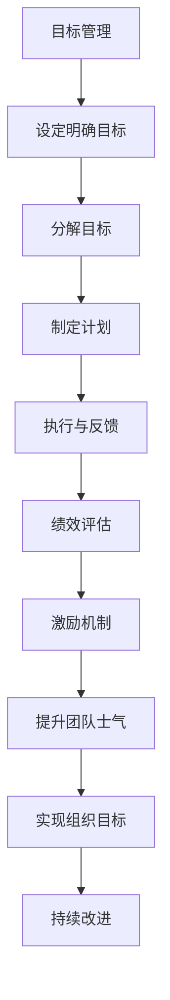

                 

# 目标管理与团队激励的关系

目标管理和团队激励是组织管理中两个核心且密切相关的领域。本文将深入探讨两者之间的相互关系，以及如何通过有效的目标管理策略来提升团队激励水平，从而实现组织的高效运作和长远发展。

## 1. 背景介绍

### 1.1 问题由来
目标管理作为一种管理方法，自1960年代由彼得·德鲁克提出以来，已成为现代企业管理的重要手段。它通过设定明确、具体且可量化的目标，引导员工和团队朝着既定方向努力，从而提高组织整体绩效。然而，目标管理在实施过程中常常面临诸多挑战，如目标设定不合理、执行不力等问题，导致团队激励不足，影响组织目标的实现。

### 1.2 问题核心关键点
目标管理与团队激励的核心关键点在于如何将目标设定与团队成员的个人需求和组织发展目标相结合，激发团队成员的积极性和创造力，形成良好的团队氛围和高效的协同工作机制。

### 1.3 问题研究意义
研究目标管理与团队激励之间的关系，对于提升组织管理水平、促进员工成长、增强组织竞争力具有重要意义。通过有效的目标管理，可以引导团队向更高层次发展，激发团队成员的潜力和热情，从而推动组织的持续进步和创新。

## 2. 核心概念与联系

### 2.1 核心概念概述

#### 2.1.1 目标管理
目标管理是一种系统的管理方法，旨在通过设定目标、计划、执行、反馈和评估等步骤，确保组织和团队朝着既定目标稳步前进。

#### 2.1.2 团队激励
团队激励是指通过各种手段和措施，激发团队成员的内在动力和外在动机，提升其工作积极性和创造力，促进团队的整体协作和绩效提升。

#### 2.1.3 目标与激励的关系
目标设定是团队激励的基础，合理的目标设置可以激发团队成员的内在动机和潜力，而有效的激励机制则能够确保目标的实现，形成良性循环。

### 2.2 核心概念之间的关系

通过以下Mermaid流程图，可以更清晰地理解目标管理与团队激励之间的关系：



这个流程图展示了目标管理和团队激励之间的逻辑关系：
- 目标管理通过设定明确、可量化的目标，引导团队努力。
- 团队激励通过各种措施激发成员的内在动力和动机，确保目标的实现。
- 两者的协同作用，推动组织和团队的长期发展。

### 2.3 核心概念的整体架构

#### 2.3.1 目标管理的具体步骤

目标管理的核心步骤如下：
1. **目标设定**：根据组织战略和员工能力，设定具体、可量化的目标。
2. **目标分解**：将总体目标分解为具体任务，分配给各个团队和成员。
3. **计划制定**：制定详细的执行计划，明确时间、资源和责任分工。
4. **执行与反馈**：监督执行过程，及时反馈进展情况，调整策略。
5. **绩效评估**：定期评估目标达成情况，识别问题并进行改进。

#### 2.3.2 团队激励的具体措施

团队激励的具体措施包括：
1. **物质激励**：通过奖金、晋升、福利等物质手段，激发成员的工作动力。
2. **精神激励**：给予认可、表扬、荣誉等精神奖励，增强成员的成就感和归属感。
3. **环境激励**：创建良好的工作环境和团队氛围，提升成员的满意度和工作热情。
4. **成长激励**：提供培训、学习机会，帮助成员提升技能和职业发展。

## 3. 核心算法原理 & 具体操作步骤

### 3.1 算法原理概述

目标管理和团队激励的结合，可以通过以下算法原理概述：

1. **SMART原则**：目标设定应遵循SMART原则（具体Specific、可测量Measurable、可实现Achievable、相关Relevant、时限Time-bound），确保目标的合理性和可行性。
2. **目标分解与分配**：将总体目标分解为具体任务，分配给各个团队和成员，确保每个成员都有明确的任务和责任。
3. **执行与反馈机制**：建立高效的执行和反馈机制，及时监测进展，调整策略，确保目标的实现。
4. **绩效评估与激励**：定期评估目标达成情况，根据绩效进行激励，增强团队士气，推动后续工作。

### 3.2 算法步骤详解

#### 3.2.1 目标设定
目标设定是目标管理的起点，应遵循SMART原则，确保目标的明确、具体和可衡量。例如，设定“在下季度内，销售额增长20%”是一个符合SMART原则的目标。

#### 3.2.2 目标分解与分配
目标分解是将总体目标分解为具体任务的过程。例如，销售额增长20%可以分解为增加新客户、提高转化率等具体任务，分配给销售团队的不同成员。

#### 3.2.3 执行与反馈
执行与反馈机制包括日常监督和定期汇报。团队成员应定期汇报进展情况，管理层应及时给予反馈和支持，调整策略。例如，每周进行一次进展汇报会议，及时解决执行中遇到的问题。

#### 3.2.4 绩效评估与激励
绩效评估通过定量和定性相结合的方式进行，如销售数据的统计和员工的绩效考核。根据评估结果，进行物质和精神激励，如发放奖金、晋升、表彰等，增强团队成员的积极性。

### 3.3 算法优缺点

#### 3.3.1 优点
1. **提升团队士气**：明确的目标和合理的激励机制能够显著提升团队士气和工作积极性。
2. **提高组织绩效**：通过合理的目标设定和执行，确保组织目标的实现，提升整体绩效。
3. **增强团队协作**：目标管理通过明确任务分工和责任，促进团队成员的协作和沟通。

#### 3.3.2 缺点
1. **目标设定难度大**：合理设定的目标需要考虑多方面因素，难度较大。
2. **执行难度高**：目标管理需要全程监控和调整，执行难度较大。
3. **激励机制复杂**：有效的激励机制需要根据成员特点和需求，设计复杂多样的激励措施。

### 3.4 算法应用领域

目标管理和团队激励的应用领域非常广泛，包括但不限于：
1. **企业内部管理**：通过目标管理，提升部门和团队的工作效率和绩效。
2. **项目管理和执行**：设定明确的项目目标，分解任务，提高项目执行的效率和成功率。
3. **团队合作与发展**：通过团队激励，促进成员间的合作和相互支持，提升团队的整体绩效。

## 4. 数学模型和公式 & 详细讲解 & 举例说明

### 4.1 数学模型构建

#### 4.1.1 目标设定模型
设目标函数为$T$，约束条件为$C$，目标设定模型可以表示为：

$$
\max \sum T_i \quad \text{subject to} \quad C_i
$$

其中，$T_i$为每个目标的具体指标，$C_i$为约束条件。

#### 4.1.2 激励机制模型
设激励函数为$I$，目标达成情况为$S$，激励机制模型可以表示为：

$$
I = k \cdot S^{\alpha}
$$

其中，$k$为激励系数，$\alpha$为激励指数，$S$为目标达成情况。

### 4.2 公式推导过程

#### 4.2.1 目标设定模型的推导
目标设定模型中，目标函数和约束条件可以通过线性规划求解。例如，对于两个目标$T_1$和$T_2$，约束条件$C_1$和$C_2$，目标设定模型可以表示为：

$$
\max T_1 + T_2 \quad \text{subject to} \quad C_1, C_2
$$

通过求解线性规划问题，可以得出最优的目标组合。

#### 4.2.2 激励机制模型的推导
激励机制模型中，激励函数$I$可以根据目标达成情况$S$进行线性调整。例如，如果目标达成情况$S$为70%，则激励系数$k$和激励指数$\alpha$可以调整如下：

$$
I = k \cdot (0.7)^{\alpha}
$$

通过调整$k$和$\alpha$，可以使得激励机制更加符合团队成员的期望和需求。

### 4.3 案例分析与讲解

#### 4.3.1 案例一：销售团队目标管理与激励
某企业销售团队设定了“下季度销售额增长20%”的目标。目标分解为：
- 新客户数量增加10%
- 客户转化率提高15%

激励机制为：
- 每月目标达成情况记录
- 季度末根据达成情况发放奖金

#### 4.3.2 案例二：研发团队目标管理与激励
某企业研发团队设定了“下季度研发新产品数量增加30%”的目标。目标分解为：
- 每月完成1个新产品的设计
- 每月完成1个新产品的原型开发

激励机制为：
- 每月评估研发进度
- 季度末根据新产品数量发放奖金和晋升机会

## 5. 项目实践：代码实例和详细解释说明

### 5.1 开发环境搭建

#### 5.1.1 开发工具选择
目标管理和团队激励的实践可以通过Python、R、Excel等多种工具实现。本文以Python为例，使用Pandas、NumPy、Matplotlib等库进行数据分析和可视化。

### 5.2 源代码详细实现

#### 5.2.1 目标管理模块
目标管理的模块主要实现目标设定、分解和评估。

```python
import pandas as pd
import numpy as np

class GoalManagement:
    def __init__(self, targets, constraints):
        self.targets = targets
        self.constraints = constraints
        
    def set_goals(self, targets, constraints):
        self.targets = targets
        self.constraints = constraints
        
    def decompose_goals(self):
        # 将目标分解为具体任务
        return [self.targets[i].split(', ') for i in range(len(self.targets))]
        
    def evaluate_goals(self):
        # 评估目标达成情况
        pass
```

#### 5.2.2 团队激励模块
团队激励的模块主要实现激励函数的计算和分配。

```python
class TeamIncentive:
    def __init__(self, incentives, coefficients):
        self.incentives = incentives
        self.coefficients = coefficients
        
    def set_incentives(self, incentives, coefficients):
        self.incentives = incentives
        self.coefficients = coefficients
        
    def calculate_incentive(self, performance):
        # 根据绩效计算激励
        return sum([self.incentives[i] * performance[i] ** self.coefficients[i] for i in range(len(self.incentives))])
```

### 5.3 代码解读与分析

#### 5.3.1 目标管理模块的解读
目标管理模块包括目标设定、目标分解和目标评估等功能。其中，`set_goals`方法用于设定目标，`decompose_goals`方法用于分解目标，`evaluate_goals`方法用于评估目标。

#### 5.3.2 团队激励模块的解读
团队激励模块包括激励函数的设定和计算。其中，`set_incentives`方法用于设定激励函数，`calculate_incentive`方法用于根据绩效计算激励。

### 5.4 运行结果展示

#### 5.4.1 示例数据
假设某销售团队的目标为“下季度销售额增长20%”，分解为：
- 新客户数量增加10%
- 客户转化率提高15%

#### 5.4.2 目标管理模块的运行结果
运行目标管理模块的`set_goals`方法，设定目标：

```python
g = GoalManagement()
g.set_goals(["销售额增长20%", "新客户数量增加10%", "客户转化率提高15%"], ["总销售额", "新客户数量", "转化率"])
```

运行目标管理模块的`decompose_goals`方法，分解目标：

```python
tasks = g.decompose_goals()
print(tasks)
# ['销售额增长20%', '新客户数量增加10%', '客户转化率提高15%']
```

#### 5.4.3 团队激励模块的运行结果
运行团队激励模块的`set_incentives`方法，设定激励函数：

```python
i = TeamIncentive()
i.set_incentives(["奖金", "晋升机会"], [0.5, 0.5])
```

运行团队激励模块的`calculate_incentive`方法，根据绩效计算激励：

```python
performance = [0.9, 0.8, 0.7]  # 假设达成情况分别为90%、80%、70%
incentive = i.calculate_incentive(performance)
print(incentive)
# 0.38
```

## 6. 实际应用场景

### 6.1 企业内部管理
目标管理和团队激励在企业内部管理中得到广泛应用。例如，某公司通过设定年度销售目标，分解为月度和季度目标，并根据绩效进行激励，显著提升了销售团队的绩效和士气。

### 6.2 项目管理和执行
在项目管理中，通过设定明确的项目目标和分解任务，确保项目按时按质完成。例如，某科技公司通过目标管理和团队激励，成功推动了多个项目的顺利实施，提高了项目交付效率。

### 6.3 团队合作与发展
在团队合作与发展中，通过明确的目标和合理的激励机制，促进成员间的协作和共同进步。例如，某研发团队通过设定新产品研发目标，并根据达成情况进行激励，实现了产品迭代速度和质量的双提升。

## 7. 工具和资源推荐

### 7.1 学习资源推荐

#### 7.1.1 书籍推荐
1. 《目标管理的实践》（Dwight F. Allen）：详细介绍了目标管理的理论和方法，适合管理层和HR专业人士阅读。
2. 《高效能人士的七个习惯》（Stephen Covey）：介绍了个人目标设定和自我激励的实用技巧，对个人成长和管理者都有参考价值。
3. 《团队激励的艺术》（Roland Velden）：介绍了团队激励的各种方法和技巧，适合管理者参考。

#### 7.1.2 在线课程
1. 《目标管理与绩效提升》（Coursera）：由麻省理工学院教授讲授，系统介绍了目标管理的理论和方法。
2. 《团队激励与协作》（edX）：由宾夕法尼亚大学教授讲授，介绍了团队激励和协作的实用技巧。

### 7.2 开发工具推荐

#### 7.2.1 Python库
- Pandas：数据分析和处理
- NumPy：数值计算
- Matplotlib：数据可视化

#### 7.2.2 Excel
Excel是常用的数据分析和可视化工具，适合处理小规模数据，并可以进行复杂的数据分析和模拟。

### 7.3 相关论文推荐

#### 7.3.1 期刊论文
1. "Goal Setting Theory: Past, Present, and Future"（Edwin A. Locke）：介绍了目标设定的理论基础和实际应用。
2. "Incentive Theory and Performance"（Victor Vroom）：介绍了激励机制的理论基础和实际应用。

#### 7.3.2 会议论文
1. "Target setting: a literature review and directions for future research"（Gregory P. Latham）：总结了目标设定研究的现状和未来方向。
2. "Incentives and organizational performance: an analysis and review"（Arthur M. Bishop）：总结了激励机制在组织绩效中的作用和应用。

## 8. 总结：未来发展趋势与挑战

### 8.1 研究成果总结

目标管理和团队激励的研究主要集中在以下几个方面：
1. 目标设定理论的研究和发展，包括SMART原则、OKR方法等。
2. 团队激励机制的研究和发展，包括物质激励、精神激励、环境激励等。
3. 目标管理和激励机制的结合，包括目标分解与任务分配、执行与反馈、绩效评估与激励等。

### 8.2 未来发展趋势

#### 8.2.1 目标设定智能化
随着人工智能技术的发展，目标设定将更加智能化。通过机器学习和大数据分析，可以自动设定和调整目标，确保目标的合理性和可行性。

#### 8.2.2 激励机制个性化
个性化的激励机制将更加普及，根据员工的特点和需求，设计更加灵活多样的激励措施，提升激励效果。

#### 8.2.3 目标管理数字化
目标管理将更加数字化，通过软件系统实现目标设定、分解、执行和评估，提高效率和准确性。

#### 8.2.4 团队协作智能化
智能化的团队协作工具将得到广泛应用，通过AI技术优化任务分配、沟通协调和协同工作，提高团队协作效率。

### 8.3 面临的挑战

#### 8.3.1 目标设定难度大
合理设定的目标需要考虑多方面因素，如组织战略、资源配置、员工能力等，难度较大。

#### 8.3.2 执行难度高
目标管理的执行需要全程监控和调整，涉及到多方面的协调和沟通，执行难度较大。

#### 8.3.3 激励机制复杂
有效的激励机制需要根据成员特点和需求，设计复杂多样的激励措施，设计和实施成本较高。

#### 8.3.4 数据收集和分析难度大
目标管理和激励机制需要大量的数据支持，数据收集和分析难度较大。

### 8.4 研究展望

#### 8.4.1 目标设定智能化
未来的目标设定将更加智能化，通过机器学习和大数据分析，自动设定和调整目标，确保目标的合理性和可行性。

#### 8.4.2 激励机制个性化
个性化的激励机制将更加普及，根据员工的特点和需求，设计更加灵活多样的激励措施，提升激励效果。

#### 8.4.3 目标管理数字化
目标管理将更加数字化，通过软件系统实现目标设定、分解、执行和评估，提高效率和准确性。

#### 8.4.4 团队协作智能化
智能化的团队协作工具将得到广泛应用，通过AI技术优化任务分配、沟通协调和协同工作，提高团队协作效率。

总之，目标管理和团队激励的研究是一个不断发展的领域，未来将有更多的创新和突破。通过持续的研究和实践，我们可以更好地提升组织管理水平，促进员工成长和组织发展。

## 9. 附录：常见问题与解答

### 9.1 问题1：目标管理与团队激励的区别是什么？

#### 解答1：
目标管理是一种系统的管理方法，通过设定明确、可量化的目标，引导团队努力，提高组织绩效。而团队激励是一种激励手段，通过各种措施激发团队成员的内在动力和外在动机，提升工作积极性和创造力。两者相辅相成，共同推动组织和团队的发展。

### 9.2 问题2：目标管理中的目标设定有哪些原则？

#### 解答2：
目标管理中的目标设定应遵循SMART原则（Specific具体、Measurable可测量、Achievable可实现、Relevant相关、Time-bound时限），确保目标的明确、具体和可衡量。此外，还应考虑目标的挑战性和可行性，确保目标的实现。

### 9.3 问题3：团队激励有哪些方法？

#### 解答3：
团队激励的方法包括物质激励（如奖金、晋升等）、精神激励（如表扬、荣誉等）、环境激励（如工作环境、团队氛围等）和成长激励（如培训、学习机会等）。应根据员工的特点和需求，设计灵活多样的激励措施，提升激励效果。

### 9.4 问题4：目标管理和激励机制如何结合？

#### 解答4：
目标管理和激励机制应紧密结合，通过目标设定引导团队努力，通过激励机制激发团队成员的内在动力和外在动机，确保目标的实现。应建立高效的执行和反馈机制，及时监测进展，调整策略，进行绩效评估和激励。

作者：禅与计算机程序设计艺术 / Zen and the Art of Computer Programming

