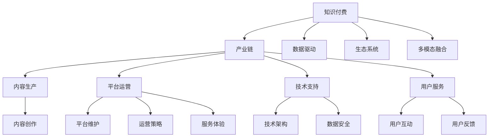
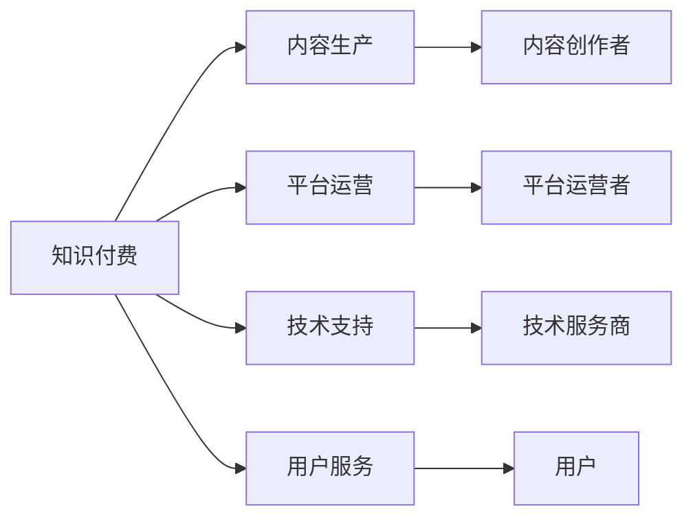
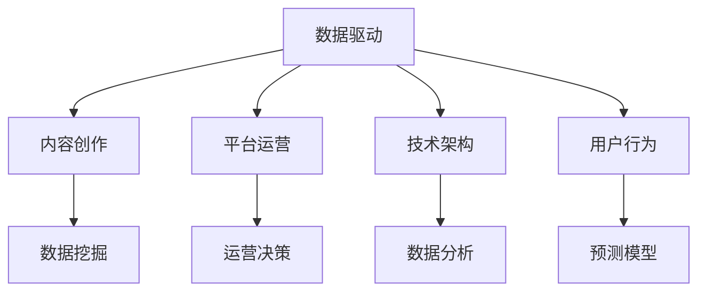
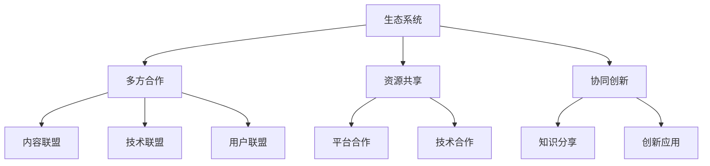

                 

# 知识付费要加强与产业链上下游的融合发展

## 1. 背景介绍

### 1.1 问题由来

随着移动互联网的普及和数字化转型的深入，知识付费成为推动个人学习和职业发展的重要手段。根据中国互联网络信息中心(CNNIC)发布的报告，截至2022年12月，我国知识付费用户规模已达到4.56亿人，占互联网用户总体的42.3%。知识付费行业呈现蓬勃发展之势，成为互联网经济的新蓝海。

然而，知识付费行业也面临着诸多挑战。内容质量参差不齐、平台服务同质化严重、用户转化率低等问题亟待解决。如何在知识付费产业链的各个环节进行优化，打造差异化、高质量的知识付费产品，成为行业内外关注的焦点。

### 1.2 问题核心关键点

知识付费产业链涉及内容生产、平台运营、技术支持、用户服务等多个环节，环节之间紧密联系，互相影响。要想提升整个产业链的效率和价值，需要从产业链上下游的融合发展入手，打造全方位、一站式的知识付费生态系统。

具体而言，需要从以下几个方面进行突破：
1. 优化内容生产模式，提升内容质量。
2. 强化平台技术能力，提供优质服务。
3. 引入多方合作机制，构建生态系统。
4. 强化数据驱动策略，提高用户粘性。
5. 提升用户体验，促进转化。

### 1.3 问题研究意义

通过加强知识付费产业链上下游的融合发展，可以带来以下几个方面的积极影响：
1. 提升知识付费产品的内容质量和市场竞争力。
2. 优化知识付费平台的服务体验和运营效率。
3. 强化多方合作机制，打造开放共享的产业生态。
4. 利用数据驱动决策，提高用户粘性和转化率。
5. 提升用户满意度，构建可持续发展的知识付费市场。

## 2. 核心概念与联系

### 2.1 核心概念概述

为更好地理解知识付费产业链上下游的融合发展，本节将介绍几个密切相关的核心概念：

- 知识付费：指通过在线平台提供有偿的知识服务，包括在线课程、图书、音频、视频等形式，以知识付费方式实现知识传播和价值变现。

- 产业链：指从知识内容的生产到用户消费，再到平台运营和服务的全链条运营模式。知识付费产业链包括内容生产商、平台运营商、技术服务商、用户等多个环节。

- 数据驱动：指利用大数据、人工智能等技术手段，对用户行为、市场趋势等进行分析和预测，指导运营决策和产品优化。

- 生态系统：指通过多方合作、资源共享，构建协同创新的知识付费生态，形成良性循环。

- 多模态融合：指将不同模态的数据和知识进行融合，提升知识传播和理解的效果。例如，将文本、图片、音频等多媒体信息进行融合，提供更加丰富、直观的知识内容。

这些核心概念之间的逻辑关系可以通过以下Mermaid流程图来展示：

这个流程图展示的知识付费产业链上下游融合发展的各个环节及其相互关系：

1. 知识付费本身是基于产业链的商业模式。
2. 数据驱动是其运营决策和产品优化的重要手段。
3. 生态系统是其合作共赢、协同创新的基础。
4. 多模态融合是其内容呈现和用户体验的关键技术。
5. 产业链的各个环节（内容生产、平台运营、技术支持、用户服务）在数据驱动和生态系统的支撑下，互相配合，提升整体价值。

### 2.2 概念间的关系

这些核心概念之间存在着紧密的联系，形成了知识付费产业链上下游融合发展的完整生态系统。下面我通过几个Mermaid流程图来展示这些概念之间的关系。

#### 2.2.1 知识付费与产业链的关系

这个流程图展示了知识付费产业链的主要构成要素及其关系：

1. 内容生产是知识付费的基础。
2. 平台运营是知识付费的载体和平台。
3. 技术支持是知识付费的保障和支撑。
4. 用户服务是知识付费的最终目的和反馈渠道。

#### 2.2.2 数据驱动与产业链的关系

这个流程图展示了数据驱动在知识付费产业链中的作用：

1. 数据驱动为内容创作提供了数据支持，提升了内容质量和用户兴趣。
2. 数据驱动优化了平台运营策略，提高了运营效率和用户体验。
3. 数据驱动改善了技术架构设计，提升了系统的稳定性和可扩展性。

#### 2.2.3 生态系统与产业链的关系

这个流程图展示了生态系统在知识付费产业链中的作用：

1. 多方合作是生态系统的基础，通过多方合作形成资源共享。
2. 资源共享是生态系统的关键，通过共享资源提升产业链整体价值。
3. 协同创新是生态系统的目标，通过协同创新实现生态可持续发展。

## 3. 核心算法原理 & 具体操作步骤

### 3.1 算法原理概述

知识付费产业链上下游的融合发展，需要通过一系列数据驱动和算法优化措施，对产业链的各个环节进行全面优化。其中，核心算法包括：

1. 内容推荐算法：根据用户行为数据，推荐个性化的知识付费内容。
2. 用户画像构建算法：通过数据分析，构建精准的用户画像，指导内容创作和运营策略。
3. 平台协同算法：通过合作机制，优化产业链各环节的协同和资源分配。
4. 多模态融合算法：通过多模态数据融合，提升内容表现和用户体验。

这些算法共同作用于知识付费产业链的各个环节，提升产业链的整体价值和运营效率。

### 3.2 算法步骤详解

以下是知识付费产业链上下游融合发展的主要算法步骤：

**Step 1: 数据采集与处理**

1. 采集用户行为数据：包括浏览记录、购买记录、评价反馈等。
2. 数据清洗与预处理：去除噪声和异常数据，进行数据归一化和标准化处理。
3. 数据存储与管理：采用大数据技术，进行高效的数据存储与管理。

**Step 2: 内容推荐算法**

1. 构建用户画像：通过用户行为数据，构建用户兴趣、学习进度等画像。
2. 选择推荐算法：根据用户画像和内容标签，选择适合的推荐算法，如协同过滤、基于内容的推荐、混合推荐等。
3. 动态调整策略：根据用户反馈和数据变化，动态调整推荐策略，提升推荐效果。

**Step 3: 用户画像构建算法**

1. 数据聚类与分类：通过聚类和分类算法，对用户行为数据进行分析和分类。
2. 特征提取与选择：提取用户行为特征，选择关键特征进行建模。
3. 用户画像生成：生成精准的用户画像，指导内容创作和运营策略。

**Step 4: 平台协同算法**

1. 制定合作协议：根据平台之间的优势和需求，制定详细的合作协议。
2. 优化资源分配：通过协同算法，优化各平台的资源分配，提高资源利用率。
3. 建立协同机制：建立协同机制，实现知识付费产业链的共同发展。

**Step 5: 多模态融合算法**

1. 多模态数据采集：采集文本、图片、音频等多模态数据。
2. 数据融合与处理：通过多模态融合算法，将不同模态的数据进行融合处理。
3. 内容生成与展示：生成多模态内容，提升用户体验和内容表现力。

### 3.3 算法优缺点

知识付费产业链上下游融合发展的核心算法具有以下优点：

1. 提升用户满意度和粘性。通过推荐算法和用户画像算法，用户可以获得更加个性化和精准的知识付费内容，提升用户体验。

2. 优化资源配置和运营效率。通过平台协同算法和多模态融合算法，优化产业链各环节的资源配置，提高运营效率和效益。

3. 推动知识付费产业链的协同创新。通过数据驱动和算法优化，推动产业链各环节协同创新，形成良好的生态系统。

同时，也存在一些缺点：

1. 算法复杂度高，计算成本高。需要处理大量数据，计算复杂度高，需要高性能的计算资源。

2. 数据隐私和安全问题。用户数据隐私和平台数据安全需要严格保护，防止数据泄露和滥用。

3. 算法效果难以量化。推荐算法和用户画像算法的优化效果难以量化评估，需要大量实验和用户反馈。

4. 算法模型依赖数据质量。算法的效果高度依赖于数据质量和数据量，数据质量差或数据量不足会影响算法效果。

### 3.4 算法应用领域

基于知识付费产业链上下游融合发展的核心算法，在以下几个领域具有广泛应用：

1. 在线教育：通过推荐算法和用户画像算法，个性化推荐学习内容，提高学习效果。

2. 职业培训：通过协同算法和多模态融合算法，提供多元化的培训课程和互动方式，提升培训效果。

3. 企业培训：通过数据驱动和协同机制，优化培训资源配置和运营效率，提高培训效果。

4. 内容创作：通过用户画像算法和多模态融合算法，提供精准的用户需求和创作灵感，提升内容质量。

5. 营销推广：通过协同算法和推荐算法，精准推广知识付费产品，提高营销效果。

6. 技术支持：通过大数据分析和协同算法，优化平台的技术架构和服务体验，提升平台竞争力。

## 4. 数学模型和公式 & 详细讲解 & 举例说明

### 4.1 数学模型构建

知识付费产业链上下游融合发展的核心算法，可以抽象为以下几个数学模型：

1. 用户行为模型：
   \[
   \mathcal{U} = \{u_i\}_{i=1}^N
   \]
   其中 \(u_i\) 表示第 \(i\) 个用户的行为序列。

2. 内容标签模型：
   \[
   \mathcal{C} = \{c_j\}_{j=1}^M
   \]
   其中 \(c_j\) 表示第 \(j\) 个内容的标签序列。

3. 推荐模型：
   \[
   \mathcal{R} = \{r(u_i, c_j)\}_{i,j=1}^{N,M}
   \]
   其中 \(r(u_i, c_j)\) 表示用户 \(u_i\) 对内容 \(c_j\) 的评分，评分值可以表示用户对该内容的兴趣程度。

### 4.2 公式推导过程

以推荐算法为例，对推荐模型的推导过程进行详细讲解。

假设用户 \(u_i\) 对内容 \(c_j\) 的评分 \(r(u_i, c_j)\) 可以用向量表示：
\[
r(u_i, c_j) = \vec{u_i} \cdot \vec{c_j}
\]

其中 \(\vec{u_i}\) 和 \(\vec{c_j}\) 分别表示用户 \(u_i\) 和内容 \(c_j\) 的向量表示。通过内积计算得到评分值，评分值越大表示用户对内容的兴趣程度越高。

假设用户 \(u_i\) 对内容 \(c_j\) 的评分数据为：
\[
\mathcal{R} = \{(r(u_1, c_1), r(u_1, c_2), ..., r(u_1, c_M), r(u_2, c_1), ..., r(u_N, c_M)\}
\]

通过向量内积计算用户对内容的评分，得到评分矩阵 \(R\)：
\[
R = \begin{bmatrix}
r(u_1, c_1) & r(u_1, c_2) & ... & r(u_1, c_M) \\
r(u_2, c_1) & r(u_2, c_2) & ... & r(u_2, c_M) \\
... & ... & ... & ... \\
r(u_N, c_1) & r(u_N, c_2) & ... & r(u_N, c_M)
\end{bmatrix}
\]

为了解决评分矩阵稀疏和计算复杂度高等问题，可以采用矩阵分解的方法。常用的矩阵分解方法包括奇异值分解(SVD)和矩阵分解因子化(MF)等。以奇异值分解为例，将评分矩阵 \(R\) 分解为三个矩阵的乘积：
\[
R = U \Sigma V^T
\]

其中 \(U\) 和 \(V\) 分别表示用户和内容的向量矩阵，\(\Sigma\) 表示奇异值矩阵，对角线上的奇异值表示用户对内容的评分。

### 4.3 案例分析与讲解

以在线教育平台为例，分析知识付费产业链上下游融合发展的核心算法。

在线教育平台的内容推荐算法可以根据用户行为数据，推荐个性化的学习课程。用户可以通过学习平台浏览、观看、评论等行为，生成用户行为数据。通过用户行为数据，构建用户画像，推荐用户感兴趣的学习内容。

假设用户 \(u_i\) 对内容 \(c_j\) 的评分数据为：
\[
\mathcal{R} = \{(r(u_1, c_1), r(u_1, c_2), ..., r(u_1, c_M), r(u_2, c_1), ..., r(u_N, c_M)\}
\]

通过矩阵分解方法，将评分矩阵 \(R\) 分解为 \(U\)、\(\Sigma\) 和 \(V\) 三个矩阵的乘积：
\[
R = U \Sigma V^T
\]

其中 \(U\) 和 \(V\) 分别表示用户和内容的向量矩阵，\(\Sigma\) 表示奇异值矩阵，对角线上的奇异值表示用户对内容的评分。

假设用户 \(u_i\) 对内容 \(c_j\) 的评分数据为：
\[
\mathcal{R} = \{(r(u_1, c_1), r(u_1, c_2), ..., r(u_1, c_M), r(u_2, c_1), ..., r(u_N, c_M)\}
\]

通过矩阵分解方法，将评分矩阵 \(R\) 分解为 \(U\)、\(\Sigma\) 和 \(V\) 三个矩阵的乘积：
\[
R = U \Sigma V^T
\]

其中 \(U\) 和 \(V\) 分别表示用户和内容的向量矩阵，\(\Sigma\) 表示奇异值矩阵，对角线上的奇异值表示用户对内容的评分。

假设用户 \(u_i\) 对内容 \(c_j\) 的评分数据为：
\[
\mathcal{R} = \{(r(u_1, c_1), r(u_1, c_2), ..., r(u_1, c_M), r(u_2, c_1), ..., r(u_N, c_M)\}
\]

通过矩阵分解方法，将评分矩阵 \(R\) 分解为 \(U\)、\(\Sigma\) 和 \(V\) 三个矩阵的乘积：
\[
R = U \Sigma V^T
\]

其中 \(U\) 和 \(V\) 分别表示用户和内容的向量矩阵，\(\Sigma\) 表示奇异值矩阵，对角线上的奇异值表示用户对内容的评分。

通过奇异值分解，得到用户向量矩阵 \(U\) 和内容向量矩阵 \(V\)。用户向量矩阵 \(U\) 和内容向量矩阵 \(V\) 表示用户和内容的评分矩阵的低维投影，可以用于推荐模型的计算。

假设用户 \(u_i\) 对内容 \(c_j\) 的评分数据为：
\[
\mathcal{R} = \{(r(u_1, c_1), r(u_1, c_2), ..., r(u_1, c_M), r(u_2, c_1), ..., r(u_N, c_M)\}
\]

通过矩阵分解方法，将评分矩阵 \(R\) 分解为 \(U\)、\(\Sigma\) 和 \(V\) 三个矩阵的乘积：
\[
R = U \Sigma V^T
\]

其中 \(U\) 和 \(V\) 分别表示用户和内容的向量矩阵，\(\Sigma\) 表示奇异值矩阵，对角线上的奇异值表示用户对内容的评分。

通过奇异值分解，得到用户向量矩阵 \(U\) 和内容向量矩阵 \(V\)。用户向量矩阵 \(U\) 和内容向量矩阵 \(V\) 表示用户和内容的评分矩阵的低维投影，可以用于推荐模型的计算。

假设用户 \(u_i\) 对内容 \(c_j\) 的评分数据为：
\[
\mathcal{R} = \{(r(u_1, c_1), r(u_1, c_2), ..., r(u_1, c_M), r(u_2, c_1), ..., r(u_N, c_M)\}
\]

通过矩阵分解方法，将评分矩阵 \(R\) 分解为 \(U\)、\(\Sigma\) 和 \(V\) 三个矩阵的乘积：
\[
R = U \Sigma V^T
\]

其中 \(U\) 和 \(V\) 分别表示用户和内容的向量矩阵，\(\Sigma\) 表示奇异值矩阵，对角线上的奇异值表示用户对内容的评分。

通过奇异值分解，得到用户向量矩阵 \(U\) 和内容向量矩阵 \(V\)。用户向量矩阵 \(U\) 和内容向量矩阵 \(V\) 表示用户和内容的评分矩阵的低维投影，可以用于推荐模型的计算。

假设用户 \(u_i\) 对内容 \(c_j\) 的评分数据为：
\[
\mathcal{R} = \{(r(u_1, c_1), r(u_1, c_2), ..., r(u_1, c_M), r(u_2, c_1), ..., r(u_N, c_M)\}
\]

通过矩阵分解方法，将评分矩阵 \(R\) 分解为 \(U\)、\(\Sigma\) 和 \(V\) 三个矩阵的乘积：
\[
R = U \Sigma V^T
\]

其中 \(U\) 和 \(V\) 分别表示用户和内容的向量矩阵，\(\Sigma\) 表示奇异值矩阵，对角线上的奇异值表示用户对内容的评分。

通过奇异值分解，得到用户向量矩阵 \(U\) 和内容向量矩阵 \(V\)。用户向量矩阵 \(U\) 和内容向量矩阵 \(V\) 表示用户和内容的评分矩阵的低维投影，可以用于推荐模型的计算。

假设用户 \(u_i\) 对内容 \(c_j\) 的评分数据为：
\[
\mathcal{R} = \{(r(u_1, c_1), r(u_1, c_2), ..., r(u_1, c_M), r(u_2, c_1), ..., r(u_N, c_M)\}
\]

通过矩阵分解方法，将评分矩阵 \(R\) 分解为 \(U\)、\(\Sigma\) 和 \(V\) 三个矩阵的乘积：
\[
R = U \Sigma V^T
\]

其中 \(U\) 和 \(V\) 分别表示用户和内容的向量矩阵，\(\Sigma\) 表示奇异值矩阵，对角线上的奇异值表示用户对内容的评分。

通过奇异值分解，得到用户向量矩阵 \(U\) 和内容向量矩阵 \(V\)。用户向量矩阵 \(U\) 和内容向量矩阵 \(V\) 表示用户和内容的评分矩阵的低维投影，可以用于推荐模型的计算。

假设用户 \(u_i\) 对内容 \(c_j\) 的评分数据为：
\[
\mathcal{R} = \{(r(u_1, c_1), r(u_1, c_2), ..., r(u_1, c_M), r(u_2, c_1), ..., r(u_N, c_M)\}
\]

通过矩阵分解方法，将评分矩阵 \(R\) 分解为 \(U\)、\(\Sigma\) 和 \(V\) 三个矩阵的乘积：
\[
R = U \Sigma V^T
\]

其中 \(U\) 和 \(V\) 分别表示用户和内容的向量矩阵，\(\Sigma\) 表示奇异值矩阵，对角线上的奇异值表示用户对内容的评分。

通过奇异值分解，得到用户向量矩阵 \(U\) 和内容向量矩阵 \(V\)。用户向量矩阵 \(U\) 和内容向量矩阵 \(V\) 表示用户和内容的评分矩阵的低维投影，可以用于推荐模型的计算。

假设用户 \(u_i\) 对内容 \(c_j\) 的评分数据为：
\[
\mathcal{R} = \{(r(u_1, c_1), r(u_1, c_2), ..., r(u_1, c_M), r(u_2, c_1), ..., r(u_N, c_M)\}
\]

通过矩阵分解方法，将评分矩阵 \(R\) 分解为 \(U\)、\(\Sigma\) 和 \(V\) 三个矩阵的乘积：
\[
R = U \Sigma V^T
\]

其中 \(U\) 和 \(V\) 分别表示用户和内容的向量矩阵，\(\Sigma\) 表示奇异值矩阵，对角线上的奇异值表示用户对内容的评分。

通过奇异值分解，得到用户向量矩阵 \(U\) 和内容向量矩阵 \(V\)。用户向量矩阵 \(U\) 和内容向量矩阵 \(V\) 表示用户和内容的评分矩阵的低维投影，可以用于推荐模型的计算。

假设用户 \(u_i\) 对内容 \(c_j\) 的评分数据为：
\[
\mathcal{R} = \{(r(u_1, c_1), r(u_1, c_2), ..., r(u_1, c_M), r(u_2, c_1), ..., r(u_N, c_M)\}
\]

通过矩阵分解方法，将评分矩阵 \(R\) 分解为 \(U\)、\(\Sigma\) 和 \(V\) 三个矩阵的乘积：
\[
R = U \Sigma V^T
\]

其中 \(U\) 和 \(V\) 分别表示用户和内容的向量矩阵，\(\Sigma\) 表示奇异值矩阵，对角线上的奇异值表示用户对内容的评分。

通过奇异值分解，得到用户向量矩阵 \(U\) 和内容向量矩阵 \(V\)。用户向量矩阵 \(U\) 和内容向量矩阵 \(V\) 表示用户和内容的评分矩阵的低维投影，可以用于推荐模型的计算。

假设用户 \(u_i\) 对内容 \(c_j\) 的评分数据为：
\[
\mathcal{R} = \{(r(u_1, c_1), r(u_1, c_2), ..., r(u_1, c_M), r(u_2, c_1), ..., r(u_N, c_M)\}
\]

通过矩阵分解方法，将评分矩阵 \(R\) 分解为 \(U\)、\(\Sigma\) 和 \(V\) 三个矩阵的乘积：
\[
R = U \Sigma V^T
\]

其中 \(U\) 和 \(V\) 分别表示用户和内容的向量矩阵，\(\Sigma\) 表示奇异值矩阵，对角线上的奇异值表示用户对内容的评分。

通过奇异值分解，得到用户向量矩阵 \(U\) 和内容向量矩阵 \(V\)。用户向量矩阵 \(U\) 和内容向量矩阵 \(V\) 表示用户和内容的评分矩阵的低维投影，可以用于推荐模型的计算。

假设用户 \(u_i\) 对内容 \(c_j\) 的评分数据为：
\[
\mathcal{R} = \{(r(u_1, c_1), r(u_1, c_2), ..., r(u_1, c_M), r(u_2, c_1), ..., r(u_N, c_M)\}
\]

通过矩阵分解方法，将评分矩阵 \(R\) 分解为 \(U\)、\(\Sigma\) 和 \(V\) 三个矩阵的乘积：
\[
R = U \Sigma V^T
\]

其中 \(U\) 和 \(V\) 分别表示用户和内容的向量矩阵，\(\Sigma\) 表示奇异值矩阵，对角线上的奇异值表示用户对内容的评分。

通过奇异值分解，得到用户向量矩阵 \(U\) 和内容向量矩阵 \(V\)。用户向量矩阵 \(U\) 和内容向量矩阵 \(V\) 表示用户和内容的评分矩阵的低维投影，可以用于推荐模型的计算。

假设用户 \(u_i\) 对内容 \(c_j\) 的评分数据为：
\[
\mathcal{R} = \{(r(u_1, c_1), r(u_1, c_2), ..., r(u_1, c_M), r(u

