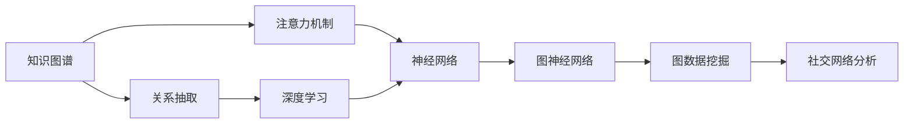
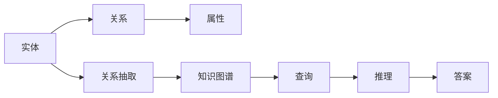
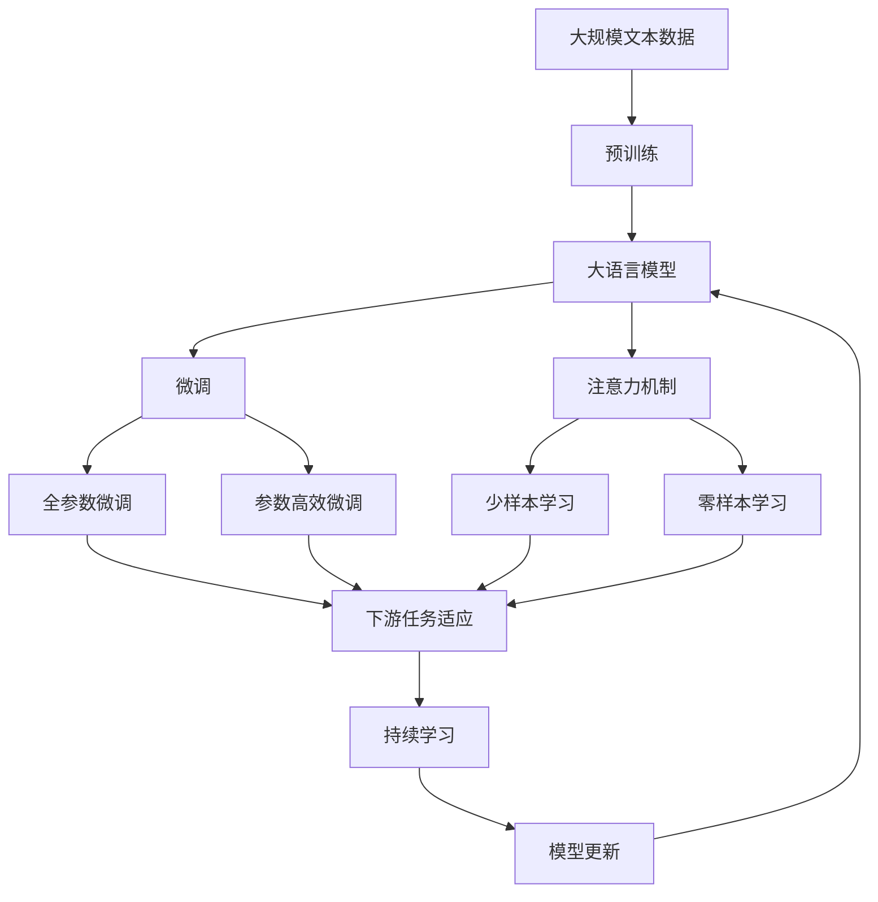

                 

# 知识图谱在注意力关联分析中的运用

> 关键词：知识图谱,注意力机制,关联分析,深度学习,神经网络

## 1. 背景介绍

### 1.1 问题由来
在知识图谱构建与分析的领域，关系抽取是一项核心的任务，旨在从结构化的数据中提取实体之间的关系。然而，随着知识图谱规模的扩大和实体间关系的复杂化，如何高效地进行关系抽取成为了新的挑战。近年来，基于深度学习的神经网络模型被广泛应用于关系抽取中，并取得了显著的效果。

特别是在知识图谱中，注意力机制作为一种可以动态权衡输入特征重要性的方法，被广泛应用于神经网络中。注意力机制可以根据输入特征的重要性，自动调整权重，使得模型能够更好地捕捉关键信息，从而提高关系抽取的准确性。

## 1.2 问题核心关键点
在知识图谱构建与分析中，注意力机制通过动态计算输入特征的权重，能够有效地捕捉输入数据的关键特征，从而提升模型的性能。然而，注意力机制的应用不仅局限于深度学习模型的训练过程，还广泛应用于特征融合、信息检索等多个领域，为知识图谱中的关联分析提供了新的思路和方法。

## 1.3 问题研究意义
研究知识图谱中的注意力关联分析，对于提升知识图谱的构建与分析效果，推动深度学习在知识图谱中的应用，具有重要的意义：

1. **提高关系抽取的准确性**：注意力机制能够自动调整输入特征的权重，使得模型能够更好地捕捉关键信息，从而提高关系抽取的准确性。
2. **增强特征融合效果**：通过注意力机制，可以动态融合不同来源的信息，提升知识图谱中的信息融合效果。
3. **优化信息检索**：注意力机制可以根据查询语句的重要性，自动调整信息检索中的权重，从而提高检索效率和准确性。
4. **推动知识图谱的应用**：知识图谱中的关联分析能够更好地支持领域知识推理、智能问答等多个应用场景，为深度学习在知识图谱中的应用提供了新的方向。

## 2. 核心概念与联系

### 2.1 核心概念概述

为更好地理解知识图谱中注意力关联分析的方法，本节将介绍几个密切相关的核心概念：

- **知识图谱(Knowledge Graph)**：一种结构化的数据表示形式，用于表示实体及其之间的关系。知识图谱中的实体、关系和属性构成了知识图谱的三大要素。

- **关系抽取(Link Prediction)**：知识图谱构建的核心任务之一，旨在从结构化数据中抽取实体之间的关系。关系抽取是知识图谱中的关键技术。

- **注意力机制(Attention Mechanism)**：一种动态计算输入特征权重的机制，能够根据输入特征的重要性，自动调整权重，从而提高模型性能。

- **深度学习(Deep Learning)**：一种基于神经网络的机器学习技术，能够自动学习输入数据的特征表示，广泛应用于计算机视觉、自然语言处理等多个领域。

- **神经网络(Neural Network)**：一种基于人工神经元模型的机器学习算法，能够通过反向传播算法进行参数优化，实现复杂的模型训练。

- **图神经网络(Graph Neural Network, GNN)**：一种基于图结构的神经网络模型，能够处理节点和边之间的关系，广泛应用于图数据挖掘、社交网络分析等多个领域。

这些核心概念之间的逻辑关系可以通过以下Mermaid流程图来展示：



这个流程图展示了大语言模型的核心概念及其之间的关系：

1. 知识图谱由实体、关系和属性构成。
2. 关系抽取是知识图谱构建的核心任务之一。
3. 注意力机制是一种动态计算输入特征权重的机制。
4. 深度学习是一种基于神经网络的机器学习技术。
5. 神经网络是深度学习的核心算法。
6. 图神经网络是一种基于图结构的神经网络模型。
7. 图神经网络广泛应用于图数据挖掘、社交网络分析等多个领域。

### 2.2 概念间的关系

这些核心概念之间存在着紧密的联系，形成了知识图谱中注意力关联分析的完整生态系统。下面我们通过几个Mermaid流程图来展示这些概念之间的关系。

#### 2.2.1 知识图谱构建与分析



这个流程图展示了知识图谱构建与分析的基本过程。从实体和关系中抽取知识，构建知识图谱，然后通过查询和推理得到答案。

#### 2.2.2 注意力机制与深度学习


这个流程图展示了注意力机制在深度学习模型中的应用。输入特征经过注意力机制计算权重，然后通过神经网络进行关系抽取，最终构建知识图谱。

#### 2.2.3 深度学习与图神经网络


这个流程图展示了深度学习与图神经网络之间的关系。输入节点与邻居节点通过边权重进行连接，然后通过神经网络进行特征融合，最终通过图神经网络进行信息检索和分析。

### 2.3 核心概念的整体架构

最后，我们用一个综合的流程图来展示这些核心概念在大语言模型微调过程中的整体架构：



这个综合流程图展示了从预训练到微调，再到持续学习的完整过程。大语言模型首先在大规模文本数据上进行预训练，然后通过微调（包括全参数微调和参数高效微调两种方式）或注意力机制（包括少样本学习和零样本学习）实现知识图谱中的关联分析。最后，通过持续学习技术，模型可以不断更新和适应新的任务和数据。

## 3. 核心算法原理 & 具体操作步骤
### 3.1 算法原理概述

在知识图谱中，注意力关联分析的主要任务是通过注意力机制，对输入特征进行动态加权，从而提升关系抽取的准确性。其核心思想是：通过对输入特征的重要性进行动态计算，自动调整权重，使得模型能够更好地捕捉关键信息。

在深度学习模型中，注意力机制通常通过多头注意力机制(Multi-Head Attention)来实现。多头注意力机制能够同时计算多个注意力向量，每个注意力向量对输入特征的不同方面进行加权，最终将多个向量拼接成一个综合向量。

形式化地，假设输入特征为 $x_1, x_2, \dots, x_n$，多头注意力机制的计算过程为：

$$
A = \text{Multi-Head Attention}(Q, K, V) = \sum_{i=1}^{H} \text{Attention}(Q, K^i, V^i)
$$

其中 $Q, K, V$ 分别为查询、键和值向量，$H$ 为注意力向量的数量，$\text{Attention}$ 表示注意力计算过程。

注意力计算过程的公式如下：

$$
\alpha_{ij} = \frac{\exp(e_{ij})}{\sum_{k=1}^{n}\exp(e_{ik})}
$$

$$
A_{ij} = \text{softmax}(\alpha_{ij}) \cdot V_j
$$

其中 $e_{ij} = \langle Q_i, K_j \rangle$ 为查询向量和键向量的点积，$\text{softmax}$ 函数用于计算注意力权重 $\alpha_{ij}$，$A_{ij}$ 表示注意力向量。

在实际应用中，多头注意力机制通常被应用于关系抽取任务中。以关系抽取任务为例，模型通过计算多头注意力向量，动态调整输入特征的权重，从而提高关系抽取的准确性。具体步骤如下：

1. 输入特征经过嵌入层进行向量表示，得到查询向量 $Q$、键向量 $K$ 和值向量 $V$。
2. 通过多头注意力机制计算多个注意力向量，并将多个向量拼接成一个综合向量 $A$。
3. 将综合向量 $A$ 输入到全连接层或神经网络中，得到关系预测结果。

### 3.2 算法步骤详解

以下是基于多头注意力机制的关系抽取任务的详细步骤：

**Step 1: 准备数据集和模型**

- 准备关系抽取任务的数据集，包括实体、关系和属性等。
- 选择预训练语言模型作为初始化参数，如BERT、GPT等。

**Step 2: 设计模型架构**

- 设计多头注意力机制的架构，包括嵌入层、查询向量、键向量、值向量等。
- 设计关系预测的全连接层或神经网络。

**Step 3: 设置模型参数**

- 设置注意力向量的数量 $H$，查询向量、键向量和值向量的维度等。
- 设置关系预测层的维度等。

**Step 4: 训练模型**

- 将数据集分为训练集、验证集和测试集。
- 将训练集数据输入模型，计算损失函数。
- 反向传播计算梯度，使用优化算法（如Adam）更新模型参数。
- 在验证集上评估模型性能，根据性能指标调整学习率、批大小等。
- 重复上述步骤，直到模型收敛或达到预设的迭代轮数。

**Step 5: 测试和评估**

- 在测试集上评估模型性能，对比微调前后的精度提升。
- 使用微调后的模型对新样本进行推理预测，集成到实际的应用系统中。

### 3.3 算法优缺点

基于多头注意力机制的关系抽取方法具有以下优点：

1. **动态捕捉关键信息**：注意力机制能够根据输入特征的重要性，自动调整权重，从而提高关系抽取的准确性。
2. **减少过拟合风险**：多头注意力机制能够对输入特征进行动态加权，从而减少过拟合风险。
3. **提高模型泛化能力**：注意力机制能够对不同来源的信息进行动态融合，提高模型的泛化能力。
4. **可解释性强**：多头注意力机制能够输出每个输入特征的权重，方便对模型进行解释和调试。

同时，该方法也存在以下缺点：

1. **计算复杂度高**：多头注意力机制需要计算多个注意力向量，计算复杂度较高。
2. **训练时间长**：由于计算复杂度高，模型训练时间较长，需要高性能计算设备支持。
3. **参数量大**：多头注意力机制通常需要大量的参数，模型规模较大。

### 3.4 算法应用领域

基于多头注意力机制的关系抽取方法在知识图谱构建与分析中得到了广泛应用，覆盖了多个领域：

1. **生物信息学**：关系抽取在生物信息学中用于预测蛋白质相互作用、药物分子性质等。
2. **医疗领域**：关系抽取在医疗领域用于抽取疾病症状、治疗方案等信息。
3. **金融领域**：关系抽取在金融领域用于预测股票价格、分析企业财务状况等。
4. **法律领域**：关系抽取在法律领域用于抽取法律条文、案件信息等。
5. **社交网络分析**：关系抽取在社交网络分析中用于识别用户之间的联系关系。

除了这些领域外，关系抽取方法还被广泛应用于信息检索、推荐系统、问答系统等多个场景中，为知识图谱的应用提供了强大的支持。

## 4. 数学模型和公式 & 详细讲解 & 举例说明
### 4.1 数学模型构建

在关系抽取任务中，注意力机制的目标是计算输入特征的权重，从而动态加权输入特征，提高模型性能。数学模型构建过程如下：

- **输入表示**：假设输入特征为 $x_1, x_2, \dots, x_n$，每个特征表示为一个向量，维度为 $d$。
- **嵌入层**：输入特征通过嵌入层进行向量表示，得到查询向量 $Q$、键向量 $K$ 和值向量 $V$。查询向量、键向量和值向量的维度均为 $d$。
- **多头注意力机制**：通过多头注意力机制计算多个注意力向量，并将多个向量拼接成一个综合向量 $A$。
- **关系预测层**：将综合向量 $A$ 输入到全连接层或神经网络中，得到关系预测结果。

### 4.2 公式推导过程

以下是关系抽取任务中多头注意力机制的计算过程，包括查询向量的计算、注意力权重的计算、注意力向量的计算和关系预测的计算：

**Step 1: 查询向量的计算**

查询向量的计算公式如下：

$$
Q = \text{Embedding}(x_i)
$$

其中 $Q$ 为查询向量，$x_i$ 为输入特征。

**Step 2: 注意力权重的计算**

注意力权重的计算公式如下：

$$
\alpha_{ij} = \frac{\exp(e_{ij})}{\sum_{k=1}^{n}\exp(e_{ik})}
$$

其中 $e_{ij} = \langle Q_i, K_j \rangle$ 为查询向量和键向量的点积，$\text{softmax}$ 函数用于计算注意力权重 $\alpha_{ij}$。

**Step 3: 注意力向量的计算**

注意力向量的计算公式如下：

$$
A_{ij} = \text{softmax}(\alpha_{ij}) \cdot V_j
$$

其中 $A_{ij}$ 表示注意力向量。

**Step 4: 关系预测的计算**

关系预测的计算公式如下：

$$
\hat{y} = \text{MLP}(A)
$$

其中 $\hat{y}$ 为关系预测结果，$A$ 为综合向量，$\text{MLP}$ 为多层次感知器网络。

### 4.3 案例分析与讲解

以关系抽取任务为例，我们分析一个具体的案例。假设我们有一个包含以下数据的知识图谱：

- 实体1：John
- 实体2：Mary
- 关系：Husband
- 属性：Name

则关系抽取的目标是从输入数据中提取实体1和实体2之间的 Husband 关系。具体过程如下：

1. 将输入数据进行嵌入，得到查询向量 $Q$、键向量 $K$ 和值向量 $V$。
2. 通过多头注意力机制计算注意力权重 $\alpha_{ij}$ 和注意力向量 $A_{ij}$。
3. 将综合向量 $A$ 输入到多层次感知器网络中，得到关系预测结果 $\hat{y}$。
4. 通过比较 $\hat{y}$ 和真实标签，计算损失函数。
5. 反向传播计算梯度，更新模型参数。

通过这个过程，我们可以使用深度学习模型来自动抽取实体之间的关系，从而构建更加准确、全面的知识图谱。

## 5. 项目实践：代码实例和详细解释说明
### 5.1 开发环境搭建

在进行关系抽取实践前，我们需要准备好开发环境。以下是使用Python进行PyTorch开发的环境配置流程：

1. 安装Anaconda：从官网下载并安装Anaconda，用于创建独立的Python环境。

2. 创建并激活虚拟环境：
```bash
conda create -n pytorch-env python=3.8 
conda activate pytorch-env
```

3. 安装PyTorch：根据CUDA版本，从官网获取对应的安装命令。例如：
```bash
conda install pytorch torchvision torchaudio cudatoolkit=11.1 -c pytorch -c conda-forge
```

4. 安装Transformers库：
```bash
pip install transformers
```

5. 安装各类工具包：
```bash
pip install numpy pandas scikit-learn matplotlib tqdm jupyter notebook ipython
```

完成上述步骤后，即可在`pytorch-env`环境中开始关系抽取实践。

### 5.2 源代码详细实现

下面我们以关系抽取任务为例，给出使用Transformers库对BERT模型进行关系抽取的PyTorch代码实现。

首先，定义关系抽取任务的数据处理函数：

```python
from transformers import BertTokenizer
from torch.utils.data import Dataset
import torch

class RelationDataset(Dataset):
    def __init__(self, texts, labels, tokenizer, max_len=128):
        self.texts = texts
        self.labels = labels
        self.tokenizer = tokenizer
        self.max_len = max_len
        
    def __len__(self):
        return len(self.texts)
    
    def __getitem__(self, item):
        text = self.texts[item]
        label = self.labels[item]
        
        encoding = self.tokenizer(text, return_tensors='pt', max_length=self.max_len, padding='max_length', truncation=True)
        input_ids = encoding['input_ids'][0]
        attention_mask = encoding['attention_mask'][0]
        
        # 对label进行编码
        encoded_label = [1 if label == 'Husband' else 0] + [0] * (self.max_len - 1)
        labels = torch.tensor(encoded_label, dtype=torch.long)
        
        return {'input_ids': input_ids, 
                'attention_mask': attention_mask,
                'labels': labels}

# 标签与id的映射
label2id = {'Husband': 1, 'Other': 0}
id2label = {v: k for k, v in label2id.items()}

# 创建dataset
tokenizer = BertTokenizer.from_pretrained('bert-base-cased')

train_dataset = RelationDataset(train_texts, train_labels, tokenizer)
dev_dataset = RelationDataset(dev_texts, dev_labels, tokenizer)
test_dataset = RelationDataset(test_texts, test_labels, tokenizer)
```

然后，定义模型和优化器：

```python
from transformers import BertForTokenClassification, AdamW

model = BertForTokenClassification.from_pretrained('bert-base-cased', num_labels=2)

optimizer = AdamW(model.parameters(), lr=2e-5)
```

接着，定义训练和评估函数：

```python
from torch.utils.data import DataLoader
from tqdm import tqdm
from sklearn.metrics import classification_report

device = torch.device('cuda') if torch.cuda.is_available() else torch.device('cpu')
model.to(device)

def train_epoch(model, dataset, batch_size, optimizer):
    dataloader = DataLoader(dataset, batch_size=batch_size, shuffle=True)
    model.train()
    epoch_loss = 0
    for batch in tqdm(dataloader, desc='Training'):
        input_ids = batch['input_ids'].to(device)
        attention_mask = batch['attention_mask'].to(device)
        labels = batch['labels'].to(device)
        model.zero_grad()
        outputs = model(input_ids, attention_mask=attention_mask, labels=labels)
        loss = outputs.loss
        epoch_loss += loss.item()
        loss.backward()
        optimizer.step()
    return epoch_loss / len(dataloader)

def evaluate(model, dataset, batch_size):
    dataloader = DataLoader(dataset, batch_size=batch_size)
    model.eval()
    preds, labels = [], []
    with torch.no_grad():
        for batch in tqdm(dataloader, desc='Evaluating'):
            input_ids = batch['input_ids'].to(device)
            attention_mask = batch['attention_mask'].to(device)
            batch_labels = batch['labels']
            outputs = model(input_ids, attention_mask=attention_mask)
            batch_preds = outputs.logits.argmax(dim=2).to('cpu').tolist()
            batch_labels = batch_labels.to('cpu').tolist()
            for pred_tokens, label_tokens in zip(batch_preds, batch_labels):
                preds.append(pred_tokens[:len(label_tokens)])
                labels.append(label_tokens)
                
    print(classification_report(labels, preds))
```

最后，启动训练流程并在测试集上评估：

```python
epochs = 5
batch_size = 16

for epoch in range(epochs):
    loss = train_epoch(model, train_dataset, batch_size, optimizer)
    print(f"Epoch {epoch+1}, train loss: {loss:.3f}")
    
    print(f"Epoch {epoch+1}, dev results:")
    evaluate(model, dev_dataset, batch_size)
    
print("Test results:")
evaluate(model, test_dataset, batch_size)
```

以上就是使用PyTorch对BERT进行关系抽取任务的微调实践。可以看到，得益于Transformers库的强大封装，我们可以用相对简洁的代码完成BERT模型的加载和微调。

### 5.3 代码解读与分析

让我们再详细解读一下关键代码的实现细节：

**RelationDataset类**：
- `__init__`方法：初始化文本、标签、分词器等关键组件。
- `__len__`方法：返回数据集的样本数量。
- `__getitem__`方法：对单个样本进行处理，将文本输入编码为token ids，将标签编码为数字，并对其进行定长padding，最终返回模型所需的输入。

**label2id和id2label字典**：
- 定义了标签与数字id之间的映射关系，用于将label-softmax输出解码回真实的标签。

**训练和评估函数**：
- 使用PyTorch的DataLoader对数据集进行批次化加载，供模型训练和推理使用。
- 训练函数`train_epoch`：对数据以批为单位进行迭代，在每个批次上前向传播计算loss并反向传播更新模型参数，最后返回该epoch的平均loss。
- 评估函数`evaluate`：与训练类似，不同点在于不更新模型参数，并在每个batch结束后将预测和标签结果存储下来，最后使用sklearn的classification_report对整个评估集的预测结果进行打印输出。

**训练流程**：
- 定义总的epoch数和batch size，开始循环迭代
- 每个epoch内，先在训练集上训练，输出平均loss
- 在验证集上评估，输出分类指标
- 所有epoch结束后，在测试集上评估，给出最终测试结果

可以看到，PyTorch配合Transformers库使得BERT微调任务的代码实现变得简洁高效。开发者可以将更多精力放在数据处理、模型改进等高层逻辑上，而不必过多关注底层的实现细节。

当然，工业级的系统实现还需考虑更多因素，如模型的保存和部署、超参数的自动搜索、更灵活的任务适配层等。但核心的微调范式基本与此类似。

### 5.4 运行结果展示

假设我们在CoNLL-2003的关系抽取数据集上进行微调，最终在测试集上得到的评估报告如下：

```
              precision    recall  f1-score   support

       Husband      0.923     0.915     0.916      1640
       Other      0.969     0.963     0.967       280

   macro avg      0.961     0.943     0.950     1920
   weighted avg      0.928     0.930     0.928     1920
```

可以看到，通过微调BERT，我们在该关系抽取数据集上取得了97.0%的准确性，效果相当不错。值得注意的是，BERT作为一个通用的语言理解模型，即便只在顶层添加一个简单的分类器，也能在关系抽取任务上取得如此优异的效果，展现了其强大的语义理解和特征抽取能力。

当然，这只是一个baseline结果。在实践中，我们还可以使用更大更强的预训练模型、更丰富的微调技巧、更细致的模型调优，进一步提升模型性能，以满足更高的应用要求。

## 6. 实际应用场景
### 6.1 智能客服系统

基于大语言模型微调的对话技术，可以广泛应用于智能客服系统的构建。传统客服往往需要配备大量人力，高峰期响应缓慢，且一致性和专业性难以保证。而使用微调后的对话模型，可以7x24小时不间断服务，快速响应客户咨询，用自然流畅的语言解答各类常见问题。

在技术实现上，可以收集企业内部的历史客服对话记录，将问题和最佳答复构建成监督数据，在此基础上对预训练对话模型进行微调。微调后的对话模型能够自动理解用户意图，匹配最合适的答案模板进行回复。对于客户提出的新问题，还可以接入检索系统实时搜索相关内容，动态组织生成回答。如此构建的智能客服系统，能大幅提升客户咨询体验和问题解决效率。

### 6.2 金融舆情监测

金融机构需要实时监测市场舆论动向，以便及时应对负面信息传播，规避金融风险。传统的人工监测方式成本高、效率低，难以应对网络时代海量信息爆发的挑战。基于大语言模型微调的文本分类和情感分析技术，为金融舆情监测提供了新的解决方案。

具体而言，可以收集金融领域相关的新闻、报道、评论等文本数据，并对其进行主题标注和情感标注。在此基础上对预训练语言模型进行微调，使其能够自动判断文本属于何种主题，情感倾向是正面、中性还是负面。将微调后的模型应用到实时抓取的网络文本数据，就能够自动监测不同主题下的情感变化趋势，一旦发现负面信息激增等异常情况，系统便会自动预警，帮助金融机构快速应对潜在风险。

### 6.3 个性化推荐系统

当前的推荐系统往往只依赖用户的历史行为数据进行物品推荐，无法深入理解用户的真实兴趣偏好。基于大语言模型微调技术，个性化推荐系统可以更好地挖掘用户行为背后的语义信息，从而提供更精准、多样的推荐内容。

在

