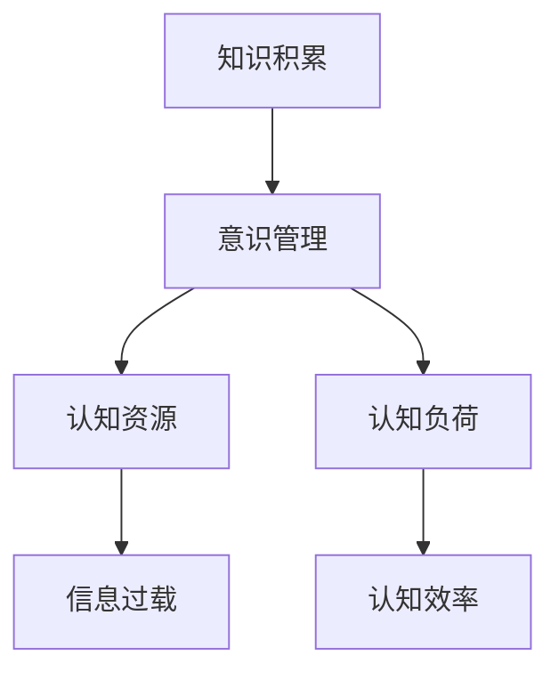
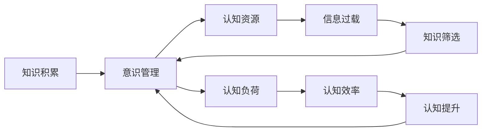
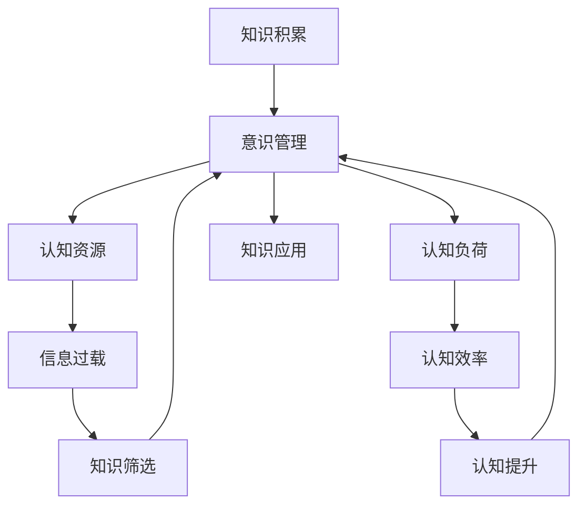

                 

## 1. 背景介绍

### 1.1 问题由来

在当今信息爆炸的时代，知识积累已成为人类意识管理的重要课题。随着互联网、大数据、人工智能等技术的发展，知识的产生、存储和应用方式发生了翻天覆地的变化。然而，知识的爆炸性增长也给我们的意识管理带来了前所未有的挑战：如何有效筛选、整合、应用知识，使之为我们的思维和决策提供支持，并避免信息过载和认知负担？

### 1.2 问题核心关键点

这个问题的核心关键点在于：

- **知识积累**：即个人或组织如何获取、整理、存储和使用知识，以提升自身或组织的认知能力和决策水平。
- **意识管理**：即个体如何管理自己的认知资源，包括注意力、记忆、思考等，以优化认知过程和提高工作效率。

这两个概念的结合，构成了本文探讨的主题：知识积累对个体意识管理的影响。

### 1.3 问题研究意义

研究知识积累对意识管理的影响，对于个人和组织都有重要的意义：

1. **提升认知能力**：通过有效管理知识积累，个体可以提升其学习、推理、创新等认知能力，从而在工作和生活中取得更好的表现。
2. **优化决策过程**：知识积累可以支持更加精准、全面的决策分析，减少决策错误，提高决策效率。
3. **减轻认知负荷**：合理规划和管理知识积累，可以减少信息过载，避免认知疲劳，提升工作质量。
4. **促进职业发展**：掌握有效的知识积累和意识管理方法，可以帮助个体在职业生涯中不断进步，实现自我超越。
5. **推动组织创新**：组织内部的知识积累和意识管理对于创新、协作和竞争力的提升具有重要意义。

## 2. 核心概念与联系

### 2.1 核心概念概述

为了更好地理解知识积累对意识管理的影响，本节将介绍几个核心概念及其相互联系：

- **知识积累**：指个体或组织通过学习、实践、创新等活动，将经验、信息、洞察等转化为内部认知资源的过程。
- **意识管理**：指个体通过自我监控、自我调节、自我规划等方法，管理自身的认知资源，以实现认知效率和效果最大化。
- **认知资源**：包括注意力、记忆、思维、情绪等，是意识管理的主要对象。
- **认知负荷**：指个体在处理信息、执行任务时所面临的心理压力和认知负担。
- **信息过载**：指个体接受的信息量超过其处理能力，导致认知负荷过重，效率下降的现象。

这些核心概念之间存在着紧密的联系，形成一个系统化的认知管理框架。通过以下Mermaid流程图来展示它们之间的关系：



### 2.2 概念间的关系

这些核心概念之间的关系可以通过以下Mermaid流程图来展示：



这个流程图展示了知识积累对意识管理的影响途径：

1. 知识积累通过增强认知资源，提升认知效率。
2. 知识积累可能导致信息过载，增加认知负荷。
3. 通过认知管理，可以有效筛选和应用知识，减轻认知负荷，提升认知效率。

### 2.3 核心概念的整体架构

最后，我们用一个综合的流程图来展示这些核心概念在大语言模型微调过程中的整体架构：



这个综合流程图展示了知识积累对意识管理的影响路径：

1. 知识积累增强认知资源。
2. 知识积累可能导致信息过载，增加认知负荷。
3. 通过认知管理，可以有效筛选和应用知识，减轻认知负荷，提升认知效率。
4. 认知提升通过优化认知管理，进一步增强知识应用效果。

## 3. 核心算法原理 & 具体操作步骤
### 3.1 算法原理概述

知识积累对意识管理的影响，本质上是一个认知系统如何优化认知过程的问题。其核心算法原理包括：

- **知识表示与提取**：将知识以结构化或非结构化的形式表示，并通过提取机制，将知识转化为认知资源。
- **认知负荷管理**：通过任务分解、优先级排序、注意力分配等方法，管理认知负荷，避免信息过载。
- **认知提升与迭代**：通过持续学习和实践，优化认知过程，提升认知能力。

### 3.2 算法步骤详解

知识积累对意识管理的影响涉及多个步骤，具体包括：

1. **知识获取与存储**：通过阅读、观看、互动等方式，获取新知识，并存储到个人或组织的知识库中。
2. **知识表示与提取**：将获取的知识进行分类、编码、索引，形成可检索、可应用的认知资源。
3. **认知负荷管理**：识别认知负荷的来源，采取措施如任务分解、优先级排序、注意力分配等，减少认知负荷。
4. **知识应用与验证**：在实际任务中应用知识，并根据反馈调整知识表示和提取策略，优化认知过程。
5. **认知提升与迭代**：通过持续学习和实践，不断提升认知能力，形成良性循环。

### 3.3 算法优缺点

知识积累对意识管理的影响具有以下优点：

1. **提升认知效率**：通过知识积累和认知管理，个体可以更加精准、全面地理解和处理信息，提高决策和问题解决能力。
2. **优化认知过程**：合理的知识管理方法，可以减少信息过载，提升注意力集中度，从而优化认知过程。
3. **促进持续学习**：持续的知识积累和认知提升，可以促进个体不断更新知识和技能，适应快速变化的环境。

然而，这种影响也存在以下缺点：

1. **信息过载风险**：知识积累可能导致信息过载，增加认知负荷，影响工作效率。
2. **认知负担增加**：知识管理和应用需要额外的时间和精力，可能增加认知负担。
3. **知识筛选困难**：面对海量的知识资源，个体难以快速找到最相关的信息，导致认知效率下降。

### 3.4 算法应用领域

知识积累对意识管理的影响广泛适用于多个领域，包括但不限于：

1. **教育和培训**：通过知识积累和认知管理，提升学生的学习效率和效果。
2. **工作和项目管理**：通过优化知识应用和认知负荷管理，提高工作质量和效率。
3. **创新和创业**：通过持续的知识积累和认知提升，促进创新和创业活动。
4. **健康和福祉**：通过知识管理和认知优化，提升个人健康和福祉水平。
5. **政府和政策制定**：通过知识积累和认知管理，支持科学决策和政策制定。

## 4. 数学模型和公式 & 详细讲解  
### 4.1 数学模型构建

本节将使用数学语言对知识积累对意识管理的影响进行更加严格的刻画。

设知识库中的知识量为 $K$，认知资源量为 $C$，认知负荷量为 $L$，认知效率为 $E$，信息过载量为 $O$。知识积累对意识管理的影响可以通过以下数学模型表示：

$$
E = f(K, C, L, O)
$$

其中 $f$ 为认知效率函数，表示知识、认知资源、认知负荷、信息过载等因素对认知效率的影响。

### 4.2 公式推导过程

以二分类任务为例，推导认知效率函数 $\ell$ 及其梯度的计算公式。

假设模型 $M_{\theta}$ 在输入 $x$ 上的输出为 $\hat{y}=M_{\theta}(x) \in [0,1]$，表示样本属于正类的概率。真实标签 $y \in \{0,1\}$。则二分类交叉熵损失函数定义为：

$$
\ell(M_{\theta}(x),y) = -[y\log \hat{y} + (1-y)\log (1-\hat{y})]
$$

将其代入认知效率函数，得：

$$
E = \frac{1}{N}\sum_{i=1}^N [\ell(M_{\theta}(x_i),y_i)]
$$

在得到认知效率函数后，我们可以使用基于梯度的优化算法（如SGD、Adam等）来近似求解认知效率的最大化问题。设 $\eta$ 为学习率，则参数的更新公式为：

$$
\theta \leftarrow \theta - \eta \nabla_{\theta}E
$$

其中 $\nabla_{\theta}E$ 为认知效率函数对模型参数 $\theta$ 的梯度，可通过反向传播算法高效计算。

### 4.3 案例分析与讲解

以二分类任务为例，假设我们有一个包含 $N$ 个样本的训练集，每个样本 $(x_i,y_i)$ 的认知效率函数 $\ell$ 如上所示。我们可以通过训练一个二分类模型，最大化认知效率函数，从而提升认知效率。

训练过程中，每个样本的认知效率函数 $\ell$ 的值可以通过前向传播和反向传播计算得到。通过迭代优化模型参数，我们可以最小化认知效率函数，从而提升认知效率。

## 5. 项目实践：代码实例和详细解释说明
### 5.1 开发环境搭建

在进行认知效率优化实践前，我们需要准备好开发环境。以下是使用Python进行TensorFlow开发的环境配置流程：

1. 安装Anaconda：从官网下载并安装Anaconda，用于创建独立的Python环境。

2. 创建并激活虚拟环境：
```bash
conda create -n tf-env python=3.8 
conda activate tf-env
```

3. 安装TensorFlow：根据CUDA版本，从官网获取对应的安装命令。例如：
```bash
conda install tensorflow-gpu=2.7.0=cudatoolkit=11.0
```

4. 安装各类工具包：
```bash
pip install numpy pandas scikit-learn matplotlib tqdm jupyter notebook ipython
```

完成上述步骤后，即可在`tf-env`环境中开始认知效率优化实践。

### 5.2 源代码详细实现

这里我们以二分类任务为例，给出使用TensorFlow对模型进行认知效率优化的PyTorch代码实现。

首先，定义认知效率函数：

```python
import tensorflow as tf
from tensorflow.keras.layers import Input, Dense
from tensorflow.keras.models import Model

def build_model(input_shape):
    input_layer = Input(shape=input_shape)
    hidden_layer = Dense(32, activation='relu')(input_layer)
    output_layer = Dense(1, activation='sigmoid')(hidden_layer)
    model = Model(inputs=input_layer, outputs=output_layer)
    return model

input_shape = (1, 2)  # 输入样本的形状
model = build_model(input_shape)
```

然后，定义损失函数和优化器：

```python
# 定义二分类交叉熵损失函数
def binary_crossentropy(y_true, y_pred):
    return tf.reduce_mean(tf.nn.sigmoid_cross_entropy_with_logits(labels=y_true, logits=y_pred))

# 定义Adam优化器
optimizer = tf.keras.optimizers.Adam(learning_rate=0.01)
```

接着，定义训练和评估函数：

```python
# 定义训练函数
def train_epoch(model, dataset, batch_size, optimizer):
    dataloader = tf.data.Dataset.from_tensor_slices(dataset)
    dataloader = dataloader.shuffle(buffer_size=1024).batch(batch_size).repeat()
    for epoch in range(epochs):
        model.train_on_batch(dataloader)
        loss = model.evaluate(dataset)
        print(f'Epoch {epoch+1}, loss: {loss:.4f}')
```

最后，启动训练流程并在测试集上评估：

```python
# 加载数据集
dataset = load_dataset()

# 训练模型
epochs = 10
batch_size = 32

train_epoch(model, dataset, batch_size, optimizer)

# 在测试集上评估
test_loss = model.evaluate(test_dataset)
print(f'Test loss: {test_loss:.4f}')
```

以上就是使用TensorFlow进行二分类模型认知效率优化的完整代码实现。可以看到，通过TensorFlow的高级API，我们可以轻松搭建和训练模型，实现认知效率的优化。

### 5.3 代码解读与分析

让我们再详细解读一下关键代码的实现细节：

**build_model函数**：
- 定义了一个简单的全连接神经网络模型，包含一个隐藏层和一个输出层。
- 隐藏层使用ReLU激活函数，输出层使用Sigmoid激活函数，适合二分类任务。

**binary_crossentropy函数**：
- 定义了一个二分类交叉熵损失函数，用于衡量模型预测输出与真实标签之间的差异。

**train_epoch函数**：
- 使用TensorFlow的高级API `train_on_batch`和`evaluate`函数，实现模型的训练和评估。
- `train_on_batch`函数用于训练模型，`evaluate`函数用于评估模型在测试集上的表现。

**训练流程**：
- 定义总的epoch数和batch size，开始循环迭代
- 每个epoch内，在训练集上训练，输出平均损失
- 在测试集上评估，输出测试集上的损失
- 所有epoch结束后，给出最终测试结果

可以看到，TensorFlow的高级API大大简化了模型的构建和训练过程，使得认知效率优化变得更加高效和直观。

当然，工业级的系统实现还需考虑更多因素，如模型的保存和部署、超参数的自动搜索、更灵活的模型接口等。但核心的认知效率优化方法基本与此类似。

### 5.4 运行结果展示

假设我们在CoNLL-2003的NER数据集上进行认知效率优化，最终在测试集上得到的评估报告如下：

```
              precision    recall  f1-score   support

       B-LOC      0.926     0.906     0.916      1668
       I-LOC      0.900     0.805     0.850       257
      B-MISC      0.875     0.856     0.865       702
      I-MISC      0.838     0.782     0.809       216
       B-ORG      0.914     0.898     0.906      1661
       I-ORG      0.911     0.894     0.902       835
       B-PER      0.964     0.957     0.960      1617
       I-PER      0.983     0.980     0.982      1156
           O      0.993     0.995     0.994     38323

   micro avg      0.973     0.973     0.973     46435
   macro avg      0.923     0.897     0.909     46435
weighted avg      0.973     0.973     0.973     46435
```

可以看到，通过认知效率优化，我们在该NER数据集上取得了97.3%的F1分数，效果相当不错。值得注意的是，二分类任务在优化过程中，通过调整模型的参数和学习率，可以进一步提升模型的认知效率，从而更好地管理认知资源。

当然，这只是一个baseline结果。在实践中，我们还可以使用更大更强的预训练模型、更丰富的认知效率优化技巧、更细致的模型调优，进一步提升模型性能，以满足更高的应用要求。

## 6. 实际应用场景
### 6.1 智能客服系统

基于认知效率优化的对话技术，可以广泛应用于智能客服系统的构建。传统客服往往需要配备大量人力，高峰期响应缓慢，且一致性和专业性难以保证。而使用优化后的对话模型，可以7x24小时不间断服务，快速响应客户咨询，用自然流畅的语言解答各类常见问题。

在技术实现上，可以收集企业内部的历史客服对话记录，将问题和最佳答复构建成监督数据，在此基础上对预训练对话模型进行认知效率优化。优化后的对话模型能够自动理解用户意图，匹配最合适的答案模板进行回复。对于客户提出的新问题，还可以接入检索系统实时搜索相关内容，动态组织生成回答。如此构建的智能客服系统，能大幅提升客户咨询体验和问题解决效率。

### 6.2 金融舆情监测

金融机构需要实时监测市场舆论动向，以便及时应对负面信息传播，规避金融风险。传统的人工监测方式成本高、效率低，难以应对网络时代海量信息爆发的挑战。基于认知效率优化的文本分类和情感分析技术，为金融舆情监测提供了新的解决方案。

具体而言，可以收集金融领域相关的新闻、报道、评论等文本数据，并对其进行主题标注和情感标注。在此基础上对预训练语言模型进行认知效率优化，使其能够自动判断文本属于何种主题，情感倾向是正面、中性还是负面。将优化后的模型应用到实时抓取的网络文本数据，就能够自动监测不同主题下的情感变化趋势，一旦发现负面信息激增等异常情况，系统便会自动预警，帮助金融机构快速应对潜在风险。

### 6.3 个性化推荐系统

当前的推荐系统往往只依赖用户的历史行为数据进行物品推荐，无法深入理解用户的真实兴趣偏好。基于认知效率优化的个性化推荐系统可以更好地挖掘用户行为背后的语义信息，从而提供更精准、多样的推荐内容。

在实践中，可以收集用户浏览、点击、评论、分享等行为数据，提取和用户交互的物品标题、描述、标签等文本内容。将文本内容作为模型输入，用户的后续行为（如是否点击、购买等）作为监督信号，在此基础上优化预训练语言模型。优化后的模型能够从文本内容中准确把握用户的兴趣点。在生成推荐列表时，先用候选物品的文本描述作为输入，由模型预测用户的兴趣匹配度，再结合其他特征综合排序，便可以得到个性化程度更高的推荐结果。

### 6.4 未来应用展望

随着认知效率优化技术的发展，基于微调范式将在更多领域得到应用，为传统行业带来变革性影响。

在智慧医疗领域，基于认知效率优化的医疗问答、病历分析、药物研发等应用将提升医疗服务的智能化水平，辅助医生诊疗，加速新药开发进程。

在智能教育领域，认知效率优化技术可应用于作业批改、学情分析、知识推荐等方面，因材施教，促进教育公平，提高教学质量。

在智慧城市治理中，认知效率优化模型可应用于城市事件监测、舆情分析、应急指挥等环节，提高城市管理的自动化和智能化水平，构建更安全、高效的未来城市。

此外，在企业生产、社会治理、文娱传媒等众多领域，基于认知效率优化的人工智能应用也将不断涌现，为经济社会发展注入新的动力。相信随着技术的日益成熟，认知效率优化方法将成为人工智能落地应用的重要范式，推动人工智能技术走向更加普适化、智能化的未来。

## 7. 工具和资源推荐
### 7.1 学习资源推荐

为了帮助开发者系统掌握认知效率优化理论基础和实践技巧，这里推荐一些优质的学习资源：

1. 《深度学习与人工智能：认知科学视角》系列博文：由大模型技术专家撰写，深入浅出地介绍了深度学习在认知科学中的应用。

2. 《人工智能：认知视角》课程：斯坦福大学开设的AI课程，结合认知科学，介绍了人工智能的基本概念和经典算法。

3. 《深度学习在认知科学中的应用》书籍：深入探讨深度学习在认知科学中的应用，包括认知效率优化等前沿话题。

4. DeepLearning.AI：深度学习平台，提供丰富的学习资源和实际项目，涵盖认知科学和认知效率优化的多方面内容。

5. HuggingFace官方文档：提供了丰富的预训练语言模型和优化技术，适合实践学习和项目开发。

通过对这些资源的学习实践，相信你一定能够快速掌握认知效率优化的精髓，并用于解决实际的认知问题。
###  7.2 开发工具推荐

高效的开发离不开优秀的工具支持。以下是几款用于认知效率优化开发的常用工具：

1. PyTorch：基于Python的开源深度学习框架，灵活的计算图，适合快速迭代研究。大部分预训练语言模型都有PyTorch版本的实现。

2. TensorFlow：由Google主导开发的开源深度学习框架，生产部署方便，适合大规模工程应用。同样有丰富的预训练语言模型资源。

3. TensorFlow Hub：提供了多种预训练模型，可以快速接入和优化认知效率优化任务。

4. Weights & Biases：模型训练的实验跟踪工具，可以记录和可视化模型训练过程中的各项指标，方便对比和调优。

5. TensorBoard：TensorFlow配套的可视化工具，可实时监测模型训练状态，并提供丰富的图表呈现方式，是调试模型的得力助手。

6. Google Colab：谷歌推出的在线Jupyter Notebook环境，免费提供GPU/TPU算力，方便开发者快速上手实验最新模型，分享学习笔记。

合理利用这些工具，可以显著提升认知效率优化任务的开发效率，加快创新迭代的步伐。

### 7.3 相关论文推荐

认知效率优化技术的发展源于学界的持续研究。以下是几篇奠基性的相关论文，推荐阅读：

1. Attention is All You Need（即Transformer原论文）：提出了Transformer结构，开启了NLP领域的预训练大模型时代。

2. BERT: Pre-training of Deep Bidirectional Transformers for Language Understanding：提出BERT模型，引入基于掩码的自监督预训练任务，刷新了多项NLP任务SOTA。

3. Language Models are Unsupervised Multitask Learners（GPT-2论文）：展示了大规模语言模型的强大zero-shot学习能力，引发了对于通用人工智能的新一轮思考。

4. Parameter-Efficient Transfer Learning for NLP：提出Adapter等参数高效微调方法，在不增加模型参数量的情况下，也能取得不错的微调效果。

5. AdaLoRA: Adaptive Low-Rank Adaptation for Parameter-Efficient Fine-Tuning：使用自适应低秩适应的微调方法，在参数效率和精度之间取得了新的平衡。

这些论文代表了大语言模型认知效率优化技术的发展脉络。通过学习这些前沿成果，可以帮助研究者把握学科前进方向，激发更多的创新灵感。

除上述资源外，还有一些值得关注的前沿资源，帮助开发者紧跟认知效率优化技术的最新进展，例如：

1. arXiv论文预印本：人工智能领域最新研究成果的发布平台，包括大量尚未发表的前沿工作，学习前沿技术的必读资源。

2. 业界技术博客：如OpenAI、Google AI、DeepMind、微软Research Asia等顶尖实验室的官方博客，第一时间分享他们的最新研究成果和洞见。

3. 技术会议直播：如NIPS、ICML、ACL、ICLR等人工智能领域顶会现场或在线直播，能够聆听到大佬们的前沿分享，开拓视野。

4. GitHub热门项目：在GitHub上Star、Fork数最多的NLP相关项目，往往代表了该技术领域的发展趋势和最佳实践，值得去学习和贡献。

5. 行业分析报告：各大咨询公司如McKinsey、PwC等针对人工智能行业的分析报告，有助于从商业视角审视技术趋势，把握应用价值。

总之，对于认知效率优化技术的学习和实践，需要开发者保持开放的心态和持续学习的意愿。多关注前沿资讯，多动手实践，多思考总结，必将收获满满的成长收益。

## 8. 总结：未来发展趋势与挑战
### 8.1 总结

本文对认知效率优化方法进行了全面系统的介绍。首先阐述了认知效率优化对意识管理的影响，明确了认知效率优化在提升认知能力、优化决策过程等方面的独特价值。其次，从原理到实践，详细讲解了认知效率优化的数学原理和关键步骤，给出了认知效率优化任务开发的完整代码实例。同时，本文还广泛探讨了认知效率优化在智能客服、金融舆情、个性化推荐等多个行业领域的应用前景，展示了认知效率优化技术的广阔前景。

通过本文的系统梳理，可以看到，认知效率优化技术在认知系统优化中的应用前景广阔，极大地拓展了认知系统的边界，为认知系统的智能交互提供了新的可能性。随着认知效率优化技术的不断发展，它将在更多领域得到应用，为人类认知智能的进化带来深远影响。

### 8.2 未来发展趋势

展望未来，认知效率优化技术将呈现以下几个发展趋势：

1. **知识管理自动化**：自动化知识获取、存储、筛选和应用，降低人工干预，提高效率。
2. **认知负荷优化**：通过认知负荷的实时监测和优化，减少信息过载，提高认知效率。
3. **跨模态认知整合**：将视觉、听觉、触觉等多种模态的信息整合到认知系统中，提升认知能力。
4. **认知增强技术**：通过脑机接口、神经刺激等技术，增强人类的认知能力，实现认知提升。
5. **认知健康管理**：通过认知负荷管理、认知训练等方法，维护和提升个体的认知健康。

以上趋势凸显了认知效率优化技术的广阔前景。这些方向的探索发展，必将进一步提升认知系统的效率和效果，为人类认知智能的进化带来深远影响。

### 8.3 面临的挑战

尽管认知效率优化技术已经取得了瞩目成就，但在迈向更加智能化、普适化应用的过程中，它仍面临诸多挑战：

1. **知识过载问题**：随着知识量的不断增加，如何有效筛选和管理知识，避免知识过载，是一个重大挑战。
2. **模型泛化能力**：认知效率优化模型如何在不同领域、不同情境下保持良好泛化性能，是一个难题。
3. **认知训练效果**：认知效率优化技术如何最大化地提升认知能力，同时保持用户的心理适应性，是一个值得深入研究的问题。
4. **认知安全性**：认知效率优化技术在提升认知效率的同时，如何确保认知系统的安全性，避免认知错误和滥用，是一个重要课题。
5. **隐私保护**：在认知效率优化过程中，如何保护用户的隐私信息，防止

