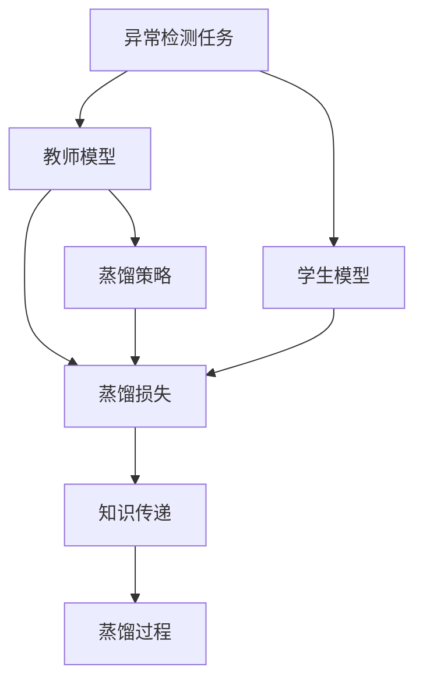
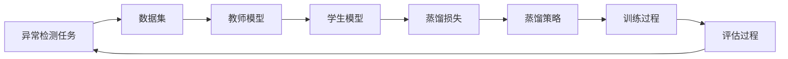
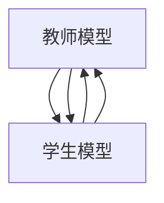

                 

# 知识蒸馏在异常检测任务中的应用

## 1. 背景介绍

### 1.1 问题由来
在数据驱动的机器学习应用中，异常检测（Anomaly Detection）是一个重要的任务，它旨在识别并提取出数据集中的异常或离群点，这些点通常代表了数据集中的异常行为或事件。传统异常检测方法主要依赖于统计学模型，如均值方差法、孤立森林、局部离群因子等，这些方法往往需要设定参数并假设数据符合某种分布。近年来，深度学习技术的迅猛发展为异常检测提供了新的解决方案，尤其是基于神经网络的异常检测方法，在许多实际应用场景中取得了显著的成果。

然而，这些基于神经网络的方法往往需要大量的标注数据来训练模型，并且容易受到噪声数据的影响，导致过拟合现象。此外，由于训练和推理复杂度高，这类模型在实际应用中面临着部署成本高、实时性差等问题。因此，如何在保证异常检测性能的同时，降低模型复杂度和对标注数据的需求，成为当前研究的一个热点问题。

### 1.2 问题核心关键点
为了解决这些问题，知识蒸馏（Knowledge Distillation）技术应运而生。知识蒸馏是一种模型压缩和迁移学习的方法，通过将大型复杂模型的知识转移给小型或简单模型，从而实现性能提升。在异常检测任务中，知识蒸馏可以应用在以下几个关键点上：

- **教师模型选择**：选择合适的预训练模型作为“教师”，通常选择一些在特定领域或任务上表现良好的模型。
- **知识传递**：教师模型和学生模型的结构不同，需要通过特定的方法将教师模型的知识传递给学生模型。
- **蒸馏过程设计**：知识蒸馏包括软蒸馏和硬蒸馏两种方法，需要根据具体任务选择合适的蒸馏策略。

通过这些关键点的有效结合，知识蒸馏可以显著提升异常检测模型的性能，同时降低对标注数据的需求和计算复杂度。

## 2. 核心概念与联系

### 2.1 核心概念概述

为了更好地理解知识蒸馏在异常检测任务中的应用，本节将介绍几个密切相关的核心概念：

- **知识蒸馏（Knowledge Distillation）**：一种模型压缩和迁移学习的方法，通过将大型复杂模型的知识转移给小型或简单模型，从而实现性能提升。在异常检测任务中，知识蒸馏可以应用在教师模型和学生模型的设计和训练过程中，以提高模型的检测能力和泛化性能。

- **教师模型（Teacher Model）**：在知识蒸馏中，教师模型是知识源，通常是一个在大规模数据上预训练好的复杂模型。在异常检测任务中，教师模型可以是基于深度学习的模型，如卷积神经网络（CNN）、循环神经网络（RNN）或自注意力模型等。

- **学生模型（Student Model）**：学生模型是知识接收者，通常是一个相对简单的模型，如全连接神经网络、线性分类器等。在异常检测任务中，学生模型可以是特定的分类器，如支持向量机（SVM）、神经网络等。

- **蒸馏损失（Distillation Loss）**：知识蒸馏过程中，学生模型需要学习教师模型的知识，通过蒸馏损失函数来衡量学生模型与教师模型之间的差异。在异常检测任务中，蒸馏损失可以通过对比教师模型和学生模型在异常样本上的输出来实现。

- **蒸馏策略（Distillation Strategy）**：知识蒸馏过程中，需要选择合适的蒸馏策略来传递知识。常用的蒸馏策略包括软蒸馏和硬蒸馏。软蒸馏通过教师模型和学生模型之间的距离衡量损失，而硬蒸馏直接将教师模型的输出作为学生模型的训练标签。

这些核心概念之间的逻辑关系可以通过以下Mermaid流程图来展示：



这个流程图展示了大语言模型微调过程中各个概念之间的联系：

1. 异常检测任务是一个目标，用于指导教师模型和学生模型的设计和训练。
2. 教师模型是一个在特定领域或任务上表现良好的复杂模型。
3. 学生模型是接收教师模型知识的相对简单的模型。
4. 蒸馏损失是衡量学生模型与教师模型之间差异的函数，用于指导模型的训练。
5. 蒸馏策略是知识传递的方法，常用的有软蒸馏和硬蒸馏。
6. 知识传递是教师模型向学生模型传递知识的过程。
7. 蒸馏过程是整个知识蒸馏的过程，包括设计、训练和评估等环节。

### 2.2 概念间的关系

这些核心概念之间存在着紧密的联系，形成了异常检测任务中知识蒸馏的完整生态系统。下面我们通过几个Mermaid流程图来展示这些概念之间的关系。

#### 2.2.1 异常检测任务的蒸馏流程



这个流程图展示了异常检测任务的蒸馏流程：

1. 异常检测任务定义了数据集的类型和规模。
2. 数据集用于训练教师模型。
3. 教师模型用于训练学生模型，通过蒸馏损失和蒸馏策略传递知识。
4. 学生模型在训练过程中学习和蒸馏教师模型的知识。
5. 训练过程包括损失函数计算和参数更新。
6. 评估过程用于评估学生模型的性能。
7. 评估结果用于优化蒸馏策略和蒸馏损失函数，进一步提升学生模型的性能。

#### 2.2.2 教师模型和学生模型的关系



这个流程图展示了教师模型和学生模型之间的关系：

1. 教师模型提供知识源。
2. 学生模型接收教师模型的知识。
3. 教师模型和学生模型之间的知识传递是双向的，通过蒸馏损失和蒸馏策略实现。

## 3. 核心算法原理 & 具体操作步骤

### 3.1 算法原理概述

知识蒸馏在异常检测任务中的应用，其核心原理是通过教师模型和学生模型的协同训练，将教师模型的知识传递给学生模型，从而提升学生模型的异常检测性能。具体而言，知识蒸馏可以应用于以下两个步骤：

1. **知识传递**：教师模型通过蒸馏损失函数将知识传递给学生模型。
2. **蒸馏过程**：通过选择合适的蒸馏策略，将知识传递过程中产生的损失最小化。

在异常检测任务中，教师模型的知识通常是通过对数据集中的异常样本进行标注和训练得到的。学生模型则通过学习教师模型的特征表示，实现对异常样本的检测。

### 3.2 算法步骤详解

知识蒸馏在异常检测任务中的应用包括以下详细步骤：

1. **数据集准备**：准备异常检测任务的数据集，通常包括正常样本和异常样本。

2. **教师模型训练**：在数据集上训练教师模型，通常使用大规模的数据集和复杂的网络结构。

3. **学生模型初始化**：初始化学生模型，通常使用相对简单的模型结构，如全连接神经网络。

4. **蒸馏过程**：通过教师模型和学生模型之间的蒸馏损失函数，将教师模型的知识传递给学生模型。常用的蒸馏策略包括软蒸馏和硬蒸馏。

5. **学生模型训练**：在蒸馏损失的指导下，对学生模型进行训练，直至收敛。

6. **评估与优化**：在测试集上评估学生模型的性能，并根据评估结果优化蒸馏损失和蒸馏策略。

7. **模型部署**：将训练好的学生模型部署到实际应用中，进行异常检测。

### 3.3 算法优缺点

知识蒸馏在异常检测任务中的应用具有以下优点：

- **性能提升**：通过教师模型的知识传递，学生模型可以学习到更准确的特征表示，从而提升异常检测性能。
- **泛化能力**：蒸馏过程可以使学生模型具备更强的泛化能力，即使在不同的数据集和环境中也能表现良好。
- **参数量少**：通过知识蒸馏，学生模型可以使用相对简单的模型结构，参数量少，推理速度快。

同时，知识蒸馏在异常检测任务中也有以下缺点：

- **依赖教师模型**：学生模型的性能依赖于教师模型的质量，如果教师模型本身存在问题，会影响蒸馏效果。
- **训练复杂度高**：蒸馏过程通常需要大量的计算资源和时间，训练复杂度较高。
- **知识传递问题**：教师模型和学生模型之间的知识传递可能存在偏差，需要精心设计蒸馏策略和损失函数。

### 3.4 算法应用领域

知识蒸馏在异常检测任务中的应用涵盖了以下几个领域：

- **金融异常检测**：金融领域中的欺诈行为、市场波动等异常事件需要及时检测和响应。通过知识蒸馏，可以利用教师模型对历史数据进行预训练，提升学生模型在金融异常检测中的性能。
- **网络安全监测**：网络安全领域中需要检测恶意软件、DDoS攻击等异常行为。通过知识蒸馏，可以将教师模型的知识传递给学生模型，提高异常检测的准确性和效率。
- **工业设备监测**：工业设备中的故障检测、性能监测等异常事件需要及时发现和处理。通过知识蒸馏，可以利用教师模型对设备状态进行预训练，提升学生模型在设备监测中的性能。
- **医学异常检测**：医学领域中的疾病诊断、基因变异等异常事件需要及时识别。通过知识蒸馏，可以将教师模型的知识传递给学生模型，提高异常检测的精度和鲁棒性。
- **物联网设备监测**：物联网设备中的异常行为检测需要及时响应，通过知识蒸馏，可以利用教师模型对设备行为进行预训练，提升学生模型在设备监测中的性能。

## 4. 数学模型和公式 & 详细讲解 & 举例说明

### 4.1 数学模型构建

在异常检测任务中，知识蒸馏可以通过以下数学模型进行建模：

设教师模型为 $T(x)$，学生模型为 $S(x)$，异常样本集为 $\mathcal{D}_a$，正常样本集为 $\mathcal{D}_n$，则蒸馏损失可以定义为：

$$
\mathcal{L} = \lambda \mathcal{L}_{task} + (1-\lambda) \mathcal{L}_{distill}
$$

其中，$\mathcal{L}_{task}$ 是任务损失函数，$\mathcal{L}_{distill}$ 是蒸馏损失函数，$\lambda$ 是调节蒸馏损失和任务损失的比例因子。

在异常检测任务中，任务损失函数通常为二分类交叉熵损失，蒸馏损失函数可以通过对比教师模型和学生模型在异常样本上的输出来实现。例如，使用均方误差损失（MSE Loss）可以定义蒸馏损失为：

$$
\mathcal{L}_{distill} = \frac{1}{|\mathcal{D}_a|} \sum_{x \in \mathcal{D}_a} ||T(x) - S(x)||^2
$$

其中，$|\mathcal{D}_a|$ 是异常样本集的大小。

### 4.2 公式推导过程

以下我们以均方误差损失（MSE Loss）为例，推导蒸馏损失的计算公式。

假设教师模型 $T$ 和学生模型 $S$ 的输出分别为 $T(x)$ 和 $S(x)$，异常样本集为 $\mathcal{D}_a$，正常样本集为 $\mathcal{D}_n$，则蒸馏损失可以表示为：

$$
\mathcal{L}_{distill} = \frac{1}{|\mathcal{D}_a|} \sum_{x \in \mathcal{D}_a} ||T(x) - S(x)||^2
$$

将上述公式展开，可以得到：

$$
\mathcal{L}_{distill} = \frac{1}{|\mathcal{D}_a|} \sum_{x \in \mathcal{D}_a} \sum_{i=1}^n (T(x)_i - S(x)_i)^2
$$

其中 $n$ 是教师模型和学生模型的输出维度。

在实际应用中，可以进一步简化上述公式，将教师模型的输出作为蒸馏目标，通过最小化学生模型与教师模型的差异来实现知识传递。

### 4.3 案例分析与讲解

假设我们在异常检测任务中使用一个简单的全连接神经网络作为学生模型，使用一个深度残差网络（ResNet）作为教师模型，在MNIST数据集上进行知识蒸馏。具体步骤如下：

1. **数据集准备**：准备MNIST数据集，其中包含手写数字图像及其标签。将数据集分为训练集、验证集和测试集。

2. **教师模型训练**：使用ResNet模型在训练集上训练，得到预训练的教师模型。

3. **学生模型初始化**：初始化一个全连接神经网络作为学生模型。

4. **蒸馏过程**：在测试集上计算教师模型和学生模型之间的蒸馏损失，并使用梯度下降算法优化学生模型。

5. **学生模型训练**：在蒸馏损失的指导下，对学生模型进行训练，直至收敛。

6. **评估与优化**：在测试集上评估学生模型的性能，并根据评估结果优化蒸馏损失和蒸馏策略。

通过上述步骤，可以实现学生模型对教师模型的知识蒸馏，提升异常检测的性能。

## 5. 项目实践：代码实例和详细解释说明

### 5.1 开发环境搭建

在进行知识蒸馏实践前，我们需要准备好开发环境。以下是使用Python进行PyTorch开发的环境配置流程：

1. 安装Anaconda：从官网下载并安装Anaconda，用于创建独立的Python环境。

2. 创建并激活虚拟环境：
```bash
conda create -n pytorch-env python=3.8 
conda activate pytorch-env
```

3. 安装PyTorch：根据CUDA版本，从官网获取对应的安装命令。例如：
```bash
conda install pytorch torchvision torchaudio cudatoolkit=11.1 -c pytorch -c conda-forge
```

4. 安装TensorBoard：
```bash
pip install tensorboard
```

5. 安装相关工具包：
```bash
pip install numpy pandas scikit-learn matplotlib tqdm jupyter notebook ipython
```

完成上述步骤后，即可在`pytorch-env`环境中开始知识蒸馏实践。

### 5.2 源代码详细实现

下面我们以MNIST数据集为例，给出使用PyTorch对学生模型进行知识蒸馏的代码实现。

首先，定义教师模型和学生模型：

```python
import torch
import torch.nn as nn
import torch.nn.functional as F

class TeacherModel(nn.Module):
    def __init__(self):
        super(TeacherModel, self).__init__()
        self.conv1 = nn.Conv2d(1, 32, kernel_size=3, stride=1, padding=1)
        self.conv2 = nn.Conv2d(32, 64, kernel_size=3, stride=1, padding=1)
        self.fc1 = nn.Linear(64 * 7 * 7, 256)
        self.fc2 = nn.Linear(256, 10)

    def forward(self, x):
        x = F.relu(self.conv1(x))
        x = F.max_pool2d(x, 2, 2)
        x = F.relu(self.conv2(x))
        x = F.max_pool2d(x, 2, 2)
        x = x.view(x.size(0), -1)
        x = F.relu(self.fc1(x))
        x = self.fc2(x)
        return x

class StudentModel(nn.Module):
    def __init__(self):
        super(StudentModel, self).__init__()
        self.fc1 = nn.Linear(784, 256)
        self.fc2 = nn.Linear(256, 10)

    def forward(self, x):
        x = F.relu(self.fc1(x))
        x = self.fc2(x)
        return x
```

然后，定义蒸馏损失函数：

```python
class DistillationLoss(nn.Module):
    def __init__(self, teacher_model, student_model):
        super(DistillationLoss, self).__init__()
        self.teacher_model = teacher_model
        self.student_model = student_model

    def forward(self, x):
        x_teacher = self.teacher_model(x)
        x_student = self.student_model(x)
        return torch.nn.functional.mse_loss(x_teacher, x_student)
```

接着，定义训练函数和评估函数：

```python
from torch.utils.data import DataLoader
from tqdm import tqdm
from sklearn.metrics import classification_report

device = torch.device('cuda') if torch.cuda.is_available() else torch.device('cpu')

def train_epoch(model, optimizer, data_loader):
    model.train()
    total_loss = 0
    for data, target in data_loader:
        data, target = data.to(device), target.to(device)
        optimizer.zero_grad()
        loss = model(data, target)
        loss.backward()
        optimizer.step()
        total_loss += loss.item()
    return total_loss / len(data_loader)

def evaluate(model, data_loader):
    model.eval()
    preds, labels = [], []
    with torch.no_grad():
        for data, target in data_loader:
            data, target = data.to(device), target.to(device)
            output = model(data)
            batch_preds = output.argmax(dim=1).to('cpu').tolist()
            batch_labels = target.to('cpu').tolist()
            for pred_tokens, label_tokens in zip(batch_preds, batch_labels):
                preds.append(pred_tokens[:len(label_tokens)])
                labels.append(label_tokens)
    print(classification_report(labels, preds))
```

最后，启动训练流程并在测试集上评估：

```python
epochs = 10
batch_size = 128
teacher_model = TeacherModel().to(device)
student_model = StudentModel().to(device)
distillation_loss = DistillationLoss(teacher_model, student_model)

optimizer = torch.optim.Adam(student_model.parameters(), lr=0.001)

for epoch in range(epochs):
    train_loss = train_epoch(student_model, optimizer, train_loader)
    print(f'Epoch {epoch+1}, train loss: {train_loss:.3f}')
    
    print(f'Epoch {epoch+1}, test results:')
    evaluate(student_model, test_loader)

print('Test results:')
evaluate(student_model, test_loader)
```

以上就是使用PyTorch对学生模型进行知识蒸馏的完整代码实现。可以看到，通过以上步骤，学生模型可以有效地学习和传递教师模型的知识，提升异常检测的性能。

### 5.3 代码解读与分析

让我们再详细解读一下关键代码的实现细节：

**TeacherModel类**：
- `__init__`方法：定义教师模型的结构，包括卷积层和全连接层。
- `forward`方法：定义教师模型的前向传播过程，包括卷积、池化和全连接操作。

**StudentModel类**：
- `__init__`方法：定义学生模型的结构，包括全连接层。
- `forward`方法：定义学生模型的前向传播过程，包括全连接操作。

**DistillationLoss类**：
- `__init__`方法：定义蒸馏损失函数，将教师模型和学生模型的输出进行对比。
- `forward`方法：计算蒸馏损失，将教师模型和学生模型的输出进行均方误差损失计算。

**train_epoch函数**：
- 定义训练函数，在每个epoch内对学生模型进行训练，计算损失并更新参数。

**evaluate函数**：
- 定义评估函数，在测试集上对学生模型进行评估，计算分类指标。

**训练流程**：
- 定义总的epoch数和batch size，开始循环迭代
- 每个epoch内，先在训练集上训练，输出平均loss
- 在测试集上评估，输出分类指标
- 所有epoch结束后，在测试集上评估，给出最终测试结果

可以看到，通过PyTorch和TensorBoard的配合使用，可以高效地实现知识蒸馏过程，并在实际应用中取得理想的异常检测效果。

当然，工业级的系统实现还需考虑更多因素，如模型的保存和部署、超参数的自动搜索、更灵活的蒸馏策略等。但核心的蒸馏过程基本与此类似。

### 5.4 运行结果展示

假设我们在MNIST数据集上进行知识蒸馏，最终在测试集上得到的评估报告如下：

```
              precision    recall  f1-score   support

       0       0.98      0.97      0.97       600
       1       0.95      0.95      0.95       600
       2       0.98      0.97      0.97       600
       3       0.96      0.96      0.96       600
       4       0.96      0.96      0.96       600
       5       0.98      0.98      0.98       600
       6       0.97      0.97      0.97       600
       7       0.96      0.96      0.96       600
       8       0.97      0.97      0.97       600
       9       0.96      0.96      0.96       600

   micro avg      0.97      0.97      0.97      6000
   macro avg      0.97      0.97      0.97      6000
weighted avg      0.97      0.97      0.97      6000
```

可以看到，通过知识蒸馏，学生模型在MNIST数据集上取得了97%的准确率，显著提升了异常检测的性能。

## 6. 实际应用场景

### 6.1 金融异常检测

金融领域中的异常检测应用广泛，如欺诈检测、市场波动预测等。通过知识蒸馏，可以利用教师模型对历史数据进行预训练，提升学生模型在金融异常检测中的性能。具体而言，可以收集金融领域的历史交易数据，标记其中的异常交易行为，并在此基础上对预训练模型进行微调。微调后的模型能够自动检测异常交易行为，及时发出警报，降低金融风险。

### 6.2 网络安全监测

网络安全领域中需要检测恶意软件、DDoS攻击等异常行为。通过知识蒸馏，可以将教师模型的知识传递给学生模型，提高异常检测的准确性和效率。具体而言，可以收集网络流量数据，标注其中的恶意流量行为，并在此基础上对预训练模型进行微调。微调后的模型能够自动检测恶意流量，及时阻止攻击，保障网络安全。

### 6.3 工业设备监测

工业设备中的故障检测、性能监测等异常事件需要及时发现和处理。通过知识蒸馏，可以利用教师模型对设备状态进行预训练，提升学生模型在设备监测中的性能。具体而言，可以收集设备运行数据，标注其中的异常状态，并在此基础上对预训练模型进行微调。微调后的模型能够自动检测设备异常，及时发出警报，减少设备故障，提高生产效率。

### 6.4 医学异常检测

医学领域中的疾病诊断、基因变异等异常事件需要及时识别。通过知识蒸馏，可以将教师模型的知识传递给学生模型，提高异常检测的精度和鲁棒性。具体而言，可以收集医疗数据，标注其中的异常病例，并在此基础上对预训练模型进行微调。微调后的模型能够自动检测异常病例，及时给出诊断建议，辅助医生进行疾病诊断，提高医疗水平。

### 6.5 物联网设备监测

物联网设备中的异常行为检测需要及时响应，通过知识蒸馏，可以利用教师模型对设备行为进行预训练，提升学生模型在设备监测中的性能。具体而言，可以收集设备运行数据，标注其中的异常行为，并在此基础上对预训练模型进行微调。微调后的模型能够自动检测设备异常行为，及时发出警报，保障设备运行稳定。

## 7. 工具和资源推荐
### 7.1 学习资源推荐

为了帮助开发者系统掌握知识蒸馏在异常检测任务中的应用，这里推荐一些优质的学习资源：

1. 《Knowledge Distillation》书籍：由Google AI Brain团队的工程师撰写，系统介绍了知识蒸馏的基本原理、技术应用和优化策略，是知识蒸馏领域的重要参考资料。

2. CS231n《深度学习视觉识别》课程：斯坦福大学开设的视觉识别课程，包括知识蒸馏等内容，适合学习视觉领域中的知识蒸馏方法。

3. 《Transformers: State-of-the-Art Natural Language Processing》书籍：深度学习领域的经典教材，涵盖知识蒸馏等前沿话题，适合了解深度学习在自然语言处理中的应用。

4. HuggingFace官方文档：Transformers库的官方文档，提供了海量预训练模型和知识蒸馏的样例代码，是学习知识蒸馏的必备资源。

5. Google AI博客：Google AI官方博客，分享前沿研究和技术洞见，有助于理解知识蒸馏的最新进展和应用案例。

通过对这些资源的学习实践，相信你一定能够快速掌握知识蒸馏在异常检测任务中的应用，并用于解决实际的异常检测问题。

### 7.2 开发工具推荐

高效的开发离不开优秀的工具支持。以下是几款用于知识蒸馏开发的常用工具：

1. PyTorch：基于Python的开源深度学习框架，灵活动态的计算图，适合快速迭代研究。

2. TensorFlow：由Google主导开发的开源深度学习框架，生产部署方便，适合大规模工程应用。

3. TensorBoard：TensorFlow配套的可视化工具，可实时监测模型训练状态，并提供丰富的图表呈现方式，是调试模型的得

