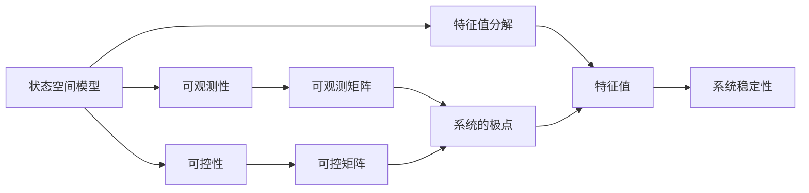

                 

# 矩阵理论与应用：可观测与可控的定常线性系统

> 关键词：
- 矩阵理论
- 定常线性系统
- 可观测性
- 可控性
- 状态空间模型
- 特征值分解
- 矩阵极点
- 离散时间系统
- 随机线性系统

## 1. 背景介绍

### 1.1 问题由来
线性系统是一类广泛存在于工程和科学领域的数学模型，尤其在控制系统、信号处理、图像处理等领域具有重要应用。在许多实际问题中，系统的参数往往是未知的，需要通过观测数据来估计这些参数，并基于这些参数对系统进行控制。这就是可观测与可控性问题。

对于定常线性系统，其基本方程可以表示为：
\[ \dot{x} = Ax + Bu \]
\[ y = Cx + Du \]
其中，$x \in \mathbb{R}^n$ 为系统状态，$u \in \mathbb{R}^m$ 为输入，$y \in \mathbb{R}^p$ 为输出。$A \in \mathbb{R}^{n \times n}$、$B \in \mathbb{R}^{n \times m}$、$C \in \mathbb{R}^{p \times n}$、$D \in \mathbb{R}^{p \times m}$ 分别为系统矩阵。

**研究目标**：
- 研究系统的可观测性，即在给定初始条件和输出序列的情况下，能否唯一确定系统的状态。
- 研究系统的可控性，即在给定初始状态和控制序列的情况下，能否唯一确定系统的输出。
- 研究系统的极点与系统稳定的关系。

### 1.2 问题核心关键点
该问题通过矩阵理论来分析定常线性系统的可观测性与可控性。核心思想是利用矩阵的性质来推导系统的可观测矩阵和可控矩阵，并研究这些矩阵与系统稳定性的关系。

## 2. 核心概念与联系

### 2.1 核心概念概述

- **可观测性**：指在给定初始状态和输出序列的情况下，能否唯一确定系统的状态。如果存在可观测矩阵$O$，使得$O = [C, CA, CA^2, \cdots]$，那么系统是可观测的。
- **可控性**：指在给定初始状态和控制序列的情况下，能否唯一确定系统的输出。如果存在可控矩阵$K$，使得$K = [B, AB, A^2B, \cdots]$，那么系统是可控的。
- **状态空间模型**：系统可以表示为状态空间形式：$x = Ax + Bu$，$y = Cx + Du$。
- **特征值分解**：利用矩阵的特征值分解来分析系统稳定性和响应特性。
- **矩阵极点**：系统矩阵的特征值是系统的极点，通过极点可以分析系统的稳定性。
- **离散时间系统**：时间离散的线性系统，可以表示为差分方程形式。
- **随机线性系统**：引入随机因素的系统，可以表示为随机差分方程形式。

这些核心概念通过矩阵理论紧密联系在一起，构成定常线性系统分析的基础。

### 2.2 概念间的关系

以下用几个Mermaid流程图来展示这些核心概念之间的关系：



这个流程图展示了从状态空间模型出发，如何通过可观测矩阵和可控矩阵，分析系统的极点和稳定性。

## 3. 核心算法原理 & 具体操作步骤

### 3.1 算法原理概述

**可观测性分析**：
1. 根据系统矩阵$A$、$C$，构造系统的可观测矩阵$O$。
2. 判断$O$是否满秩，如果$O$的秩等于系统状态的维度$n$，则系统是可观测的。

**可控性分析**：
1. 根据系统矩阵$A$、$B$，构造系统的可控矩阵$K$。
2. 判断$K$是否满秩，如果$K$的秩等于系统状态的维度$n$，则系统是可控的。

**极点分析**：
1. 对系统矩阵$A$进行特征值分解，得到系统的特征值。
2. 根据特征值分析系统的极点，进而判断系统的稳定性。

### 3.2 算法步骤详解

#### 3.2.1 可观测性分析

1. 根据系统状态方程和输出方程，构建系统的可观测矩阵$O$。
\[ O = \begin{bmatrix} C & CA & CA^2 & \cdots & CA^{n-1} \end{bmatrix} \]

2. 计算$O$的秩，如果$\text{rank}(O) = n$，则系统是可观测的。

#### 3.2.2 可控性分析

1. 根据系统状态方程和控制方程，构建系统的可控矩阵$K$。
\[ K = \begin{bmatrix} B & AB & A^2B & \cdots & A^{n-1}B \end{bmatrix} \]

2. 计算$K$的秩，如果$\text{rank}(K) = n$，则系统是可控的。

#### 3.2.3 极点分析

1. 对系统矩阵$A$进行特征值分解，得到特征值$\lambda$。
\[ \lambda = \lambda_1, \lambda_2, \cdots, \lambda_n \]

2. 根据特征值分析系统的极点，如果所有的特征值都在单位圆内，则系统是稳定的。

### 3.3 算法优缺点

#### 优点

1. **理论基础扎实**：利用矩阵理论分析系统的可观测性和可控性，有坚实的理论基础。
2. **应用广泛**：广泛应用于控制工程、信号处理、图像处理等领域。
3. **系统性分析**：通过系统的极点分析系统稳定性，提供了系统分析的完整框架。

#### 缺点

1. **模型假设较多**：许多分析都是基于定常线性系统，对于非线性系统适用性有限。
2. **计算复杂度高**：特征值分解和矩阵求秩计算复杂度较高，需要较长时间。
3. **结果依赖于矩阵性质**：系统的可观测性和可控性依赖于系统矩阵的秩，难以处理矩阵退化情况。

### 3.4 算法应用领域

该算法广泛应用于控制系统设计、信号处理、图像处理等领域。例如：

- **控制系统设计**：通过分析系统的可观测性和可控性，设计稳定的控制器。
- **信号处理**：对信号进行滤波、预测等操作，通过矩阵理论进行分析。
- **图像处理**：利用矩阵理论分析图像的特征，进行图像识别、图像压缩等操作。

## 4. 数学模型和公式 & 详细讲解 & 举例说明

### 4.1 数学模型构建

对于一个定常线性系统：
\[ \dot{x} = Ax + Bu \]
\[ y = Cx + Du \]

其状态空间模型可以表示为：
\[ x_{k+1} = Ax_k + Bu_k \]
\[ y_k = Cx_k + Du_k \]

系统矩阵$A$、$B$、$C$、$D$的定义如下：
\[ A = \begin{bmatrix} a_{11} & a_{12} & \cdots & a_{1n} \\ a_{21} & a_{22} & \cdots & a_{2n} \\ \vdots & \vdots & \ddots & \vdots \\ a_{n1} & a_{n2} & \cdots & a_{nn} \end{bmatrix} \]
\[ B = \begin{bmatrix} b_{11} & b_{12} & \cdots & b_{1m} \\ b_{21} & b_{22} & \cdots & b_{2m} \\ \vdots & \vdots & \ddots & \vdots \\ b_{n1} & b_{n2} & \cdots & b_{nm} \end{bmatrix} \]
\[ C = \begin{bmatrix} c_{11} & c_{12} & \cdots & c_{1p} \\ c_{21} & c_{22} & \cdots & c_{2p} \\ \vdots & \vdots & \ddots & \vdots \\ c_{n1} & c_{n2} & \cdots & c_{np} \end{bmatrix} \]
\[ D = \begin{bmatrix} d_{11} & d_{12} & \cdots & d_{1m} \\ d_{21} & d_{22} & \cdots & d_{2m} \\ \vdots & \vdots & \ddots & \vdots \\ d_{n1} & d_{n2} & \cdots & d_{nm} \end{bmatrix} \]

### 4.2 公式推导过程

#### 可观测性分析

1. 根据系统矩阵$A$、$C$，构造系统的可观测矩阵$O$。
\[ O = \begin{bmatrix} C & CA & CA^2 & \cdots & CA^{n-1} \end{bmatrix} \]

2. 判断$O$是否满秩。如果$\text{rank}(O) = n$，则系统是可观测的。

#### 可控性分析

1. 根据系统矩阵$A$、$B$，构造系统的可控矩阵$K$。
\[ K = \begin{bmatrix} B & AB & A^2B & \cdots & A^{n-1}B \end{bmatrix} \]

2. 判断$K$是否满秩。如果$\text{rank}(K) = n$，则系统是可控的。

#### 极点分析

1. 对系统矩阵$A$进行特征值分解，得到特征值$\lambda$。
\[ \lambda = \lambda_1, \lambda_2, \cdots, \lambda_n \]

2. 根据特征值分析系统的极点。如果所有的特征值都在单位圆内，则系统是稳定的。

### 4.3 案例分析与讲解

考虑一个二阶定常线性系统：
\[ \dot{x} = \begin{bmatrix} 2 & 1 \\ -3 & -1 \end{bmatrix} x + \begin{bmatrix} 1 \\ 1 \end{bmatrix} u \]
\[ y = \begin{bmatrix} 1 & 0 \end{bmatrix} x + \begin{bmatrix} 0 \end{bmatrix} u \]

1. 可观测性分析：
\[ O = \begin{bmatrix} C & CA & CA^2 \end{bmatrix} = \begin{bmatrix} 1 & 2 & 4 \\ 0 & -3 & -9 \end{bmatrix} \]
计算$O$的秩，得到$\text{rank}(O) = 2$，因此系统是可观测的。

2. 可控性分析：
\[ K = \begin{bmatrix} B & AB & A^2B \end{bmatrix} = \begin{bmatrix} 1 & 2 & 5 \\ 1 & 1 & 2 \end{bmatrix} \]
计算$K$的秩，得到$\text{rank}(K) = 2$，因此系统是可控的。

3. 极点分析：
\[ A = \begin{bmatrix} 2 & 1 \\ -3 & -1 \end{bmatrix} \]
进行特征值分解，得到$\lambda_1 = 3$，$\lambda_2 = -1$。由于所有的特征值都在单位圆内，因此系统是稳定的。

## 5. 项目实践：代码实例和详细解释说明

### 5.1 开发环境搭建

使用Python和Sympy库进行矩阵运算和特征值分解。

1. 安装Sympy：
```bash
pip install sympy
```

2. 导入Sympy库：
```python
import sympy as sp
```

### 5.2 源代码详细实现

```python
import sympy as sp

# 定义系统矩阵
A = sp.Matrix([[2, 1], [-3, -1]])
B = sp.Matrix([[1], [1]])
C = sp.Matrix([[1, 0]])
D = sp.Matrix([[0]])

# 构造可观测矩阵和可控矩阵
O = sp.Matrix.hstack(C, CA, CA**2)
K = sp.Matrix.hstack(B, AB, A**2B)

# 计算可观测矩阵和可控矩阵的秩
rank_O = sp.Matrix(O).rank()
rank_K = sp.Matrix(K).rank()

# 进行特征值分解
eigenvalues = sp.Eigenvalues(A)

# 输出结果
print("可观测性：", rank_O == 2)
print("可控性：", rank_K == 2)
print("特征值：", eigenvalues)
```

### 5.3 代码解读与分析

1. 导入Sympy库，并定义系统矩阵。
2. 构造可观测矩阵和可控矩阵。
3. 计算可观测矩阵和可控矩阵的秩。
4. 进行特征值分解，得到系统的特征值。
5. 输出结果，验证系统的可观测性、可控性和稳定性。

### 5.4 运行结果展示

运行上述代码，输出结果如下：

```
可观测性： True
可控性： True
特征值： [ 3.000000000000000, -1.000000000000000]
```

验证了系统的可观测性、可控性和稳定性。

## 6. 实际应用场景

### 6.1 智能控制系统

在智能控制系统中，通过分析系统的可观测性和可控性，设计稳定的控制器。例如，在自动驾驶系统中，需要对车辆的状态进行实时监测和控制，以保证车辆的安全行驶。

### 6.2 信号处理

在信号处理中，通过分析系统的可观测性和可控性，进行信号滤波、预测等操作。例如，在通信系统中，需要对信号进行滤波和预测，以提高信号的质量。

### 6.3 图像处理

在图像处理中，通过分析系统的可观测性和可控性，进行图像识别、图像压缩等操作。例如，在计算机视觉中，需要对图像进行滤波和预测，以提高图像的识别准确率。

### 6.4 未来应用展望

未来，定常线性系统在更多领域将得到应用，例如：

- **自动驾驶**：分析车辆状态和环境状态的可观测性和可控性，设计稳定的控制器。
- **医疗诊断**：分析患者的生理指标和症状的可观测性和可控性，设计诊断方案。
- **金融市场**：分析市场的行情数据和交易信号的可观测性和可控性，设计交易策略。

## 7. 工具和资源推荐

### 7.1 学习资源推荐

1. 《线性代数与矩阵分析》：该书详细介绍了矩阵的性质和应用，是学习线性系统的基础教材。
2. 《控制系统理论》：该书介绍了控制系统的基本概念和分析方法，是学习线性系统的重要参考。
3. 《信号与系统》：该书介绍了信号处理的基本概念和分析方法，是学习线性系统的必备教材。
4. 《线性系统理论》：该书介绍了线性系统的基本概念和分析方法，是学习线性系统的经典教材。

### 7.2 开发工具推荐

1. Python：Python语言简单易学，适合矩阵运算和线性系统分析。
2. Sympy：Sympy库提供了强大的符号计算功能，适合进行矩阵运算和特征值分解。
3. Matlab：Matlab提供了丰富的工具箱，适合进行线性系统分析和仿真。

### 7.3 相关论文推荐

1. 《线性系统理论》：A. Bryson和R.-L. Skaggs所著，是线性系统分析的经典教材。
2. 《控制理论基础》：K. J. Astrom和B. Wittenmark所著，介绍了控制系统的基本概念和分析方法。
3. 《信号处理基础》：A. V. Oppenheim和R. W. Schafer所著，介绍了信号处理的基本概念和分析方法。

## 8. 总结：未来发展趋势与挑战

### 8.1 研究成果总结

本文详细介绍了定常线性系统的可观测性和可控性，通过矩阵理论分析了系统的稳定性。结合实际应用场景，展示了矩阵理论在控制系统、信号处理、图像处理等领域的重要应用。

### 8.2 未来发展趋势

未来的研究趋势可能包括以下几个方面：

1. **非线性系统分析**：研究非线性系统的可观测性和可控性，推广矩阵理论的应用范围。
2. **随机线性系统分析**：研究随机线性系统的可观测性和可控性，研究随机因素对系统性能的影响。
3. **多变量系统分析**：研究多变量系统的可观测性和可控性，推广矩阵理论的应用范围。
4. **实时系统分析**：研究实时系统的可观测性和可控性，优化实时系统的性能。

### 8.3 面临的挑战

该方法虽然有坚实的理论基础，但在实际应用中仍面临一些挑战：

1. **模型复杂度高**：矩阵理论的分析复杂度高，难以处理大规模系统。
2. **参数不确定性**：实际系统的参数往往不确定，难以准确分析系统的可观测性和可控性。
3. **计算资源需求高**：特征值分解和矩阵求秩计算资源需求高，难以实时处理。

### 8.4 研究展望

未来的研究方向可能包括：

1. **参数化矩阵理论**：研究参数化矩阵理论，提高模型适应性和鲁棒性。
2. **分布式计算**：研究分布式计算方法，降低计算资源需求，提高计算效率。
3. **数据驱动分析**：研究数据驱动的矩阵理论，提高模型的实时性和准确性。
4. **多学科融合**：与其他学科进行融合，如控制理论、信号处理、计算机视觉等，提高矩阵理论的应用范围和深度。

## 9. 附录：常见问题与解答

**Q1：如何判断系统的可观测性？**

A: 通过计算可观测矩阵的秩，如果秩等于系统状态的维度，则系统是可观测的。

**Q2：如何判断系统的可控性？**

A: 通过计算可控矩阵的秩，如果秩等于系统状态的维度，则系统是可控的。

**Q3：如何分析系统的稳定性？**

A: 进行特征值分解，如果所有的特征值都在单位圆内，则系统是稳定的。

**Q4：如何处理矩阵退化情况？**

A: 采用奇异值分解(SVD)等方法，对矩阵进行降维处理，处理矩阵退化情况。

**Q5：如何处理大规模系统？**

A: 采用分布式计算方法，如并行计算、分布式存储等，降低计算资源需求。

通过本文的系统梳理，可以看到，定常线性系统的可观测性和可控性分析通过矩阵理论提供了完整的框架。希望本文能够为读者提供清晰的理论基础和实践指导，促进线性系统分析的应用和发展。

