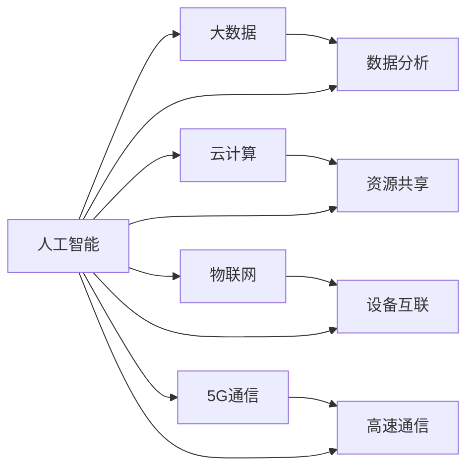

                 

# 硅谷的竞争对手:中国、印度等新兴力量

在过去几十年中，硅谷一直是全球科技创新的中心，引领着信息技术的发展和应用。然而，随着全球经济和科技格局的变化，中国、印度等新兴力量正在崛起，挑战硅谷在全球科技领域的领导地位。本文将详细探讨中国、印度等新兴科技力量在人工智能、大数据、云计算、物联网、5G通信等领域的崛起，分析其与硅谷之间的竞争态势，并为未来的发展趋势做出预测。

## 1. 背景介绍

### 1.1 科技竞争的起源

硅谷的崛起可以追溯到20世纪50年代，当时斯坦福大学和加州大学伯克利分校等高校汇聚了大量顶尖人才，形成了浓厚的科技氛围。1955年，休利特和帕卡德在帕洛阿尔托创办了惠普公司，1956年，肖克利、诺依斯和摩尔等在硅谷创办了仙童半导体公司。后来，诺依斯和摩尔离开仙童，创立了英特尔公司，奠定了硅谷作为全球半导体和计算机技术中心的地位。

随着半导体和计算机技术的不断进步，硅谷逐渐形成了以IT、互联网、人工智能等领域为核心的科技创新生态。谷歌、苹果、Facebook等公司崛起，成为全球科技巨头。与此同时，中国、印度等新兴国家在科技领域的崛起，逐渐成为硅谷的有力竞争对手。

### 1.2 新兴力量崛起背景

1. **中国：**
   - **经济发展：** 改革开放以来，中国经济快速发展，政府对科技创新的重视程度不断提高，科技投入逐年增加。
   - **人才储备：** 中国拥有庞大的高素质人才储备，每年大量优秀人才出国深造后回流。
   - **政策支持：** 政府出台了一系列扶持高科技产业的政策，如《中国制造2025》、《新一代人工智能发展规划》等。
   - **研发投入：** 近年来，中国在高技术领域的研发投入显著增加，尤其在人工智能、大数据、5G通信等领域取得了显著成果。

2. **印度：**
   - **英语优势：** 英语是印度的官方语言之一，印度的科研人员能够轻松获取国际前沿科研成果和论文。
   - **人才培养：** 印度拥有大量计算机专业的高素质人才，是全球软件外包的重要来源。
   - **基础建设：** 印度政府在科技基础设施上的投入逐渐增加，尤其是在数据中心和超算中心建设方面。
   - **私企实力：** 印度的私营企业，如Infosys、Tata Consultancy Services (TCS)等在全球IT服务业中占据重要地位。

### 1.3 新兴力量竞争的核心领域

1. **人工智能：** 中国和印度在AI领域的研发投入和专利申请数量都在快速增长。中国的百度、腾讯、阿里巴巴等企业，印度的Flipkart、Infosys等企业，都在AI技术上取得了显著进展。
2. **大数据：** 中国和印度的大数据技术应用广泛，尤其是在金融、电商、医疗等领域。中国的阿里巴巴、腾讯、京东等公司，印度的Flipkart、Ola等公司，都在大数据分析、云计算等方面进行了大量投入。
3. **云计算：** 云计算是全球科技创新的重要领域，中国和印度都在云计算平台和技术上进行了大量投资。中国的华为、阿里云、腾讯云等，印度的Walmart India、Flipkart等，都在云计算方面取得了突破性进展。
4. **物联网：** 物联网是未来科技发展的重要方向，中国和印度的物联网企业正在快速发展。中国的华为、小米等企业，印度的IoT Wave、Walmart India等企业，都在物联网设备、技术应用上取得了显著成果。
5. **5G通信：** 5G通信是未来通信技术的重要方向，中国和印度都在5G技术研发和应用上进行了大量投资。中国的华为、中兴、中国电信等，印度的Reliance Jio、Bharti Airtel等，都在5G技术上取得了显著进展。

## 2. 核心概念与联系

### 2.1 核心概念概述

1. **人工智能（AI）：** 人工智能是指通过模拟人类智能行为来实现机器的智能化的技术。AI包括机器学习、深度学习、自然语言处理、计算机视觉等多个分支。
2. **大数据（Big Data）：** 大数据是指大量、高速、复杂的数据集合，通过分析大数据可以发现数据中的有价值的信息。大数据技术包括数据采集、存储、处理、分析等。
3. **云计算（Cloud Computing）：** 云计算是指通过互联网提供计算资源和服务的模式。云计算包括IaaS、PaaS、SaaS等多种服务模式。
4. **物联网（IoT）：** 物联网是指通过互联网将各种设备和传感器连接起来，实现设备之间的互联互通。物联网包括智能家居、智慧城市、工业物联网等应用。
5. **5G通信：** 5G通信是指第五代移动通信技术，具有更高的带宽、更低的时延、更大的连接数等特点。5G通信将带来更多智能设备和应用场景。

这些核心概念在科技竞争中相互联系，共同推动着技术的不断进步和应用场景的扩展。人工智能、大数据、云计算、物联网、5G通信等技术的不断突破，为新兴力量提供了强大的技术支持，推动了其在各个领域的崛起。

### 2.2 核心概念间的关系

这些核心概念之间的关系可以用以下图表表示：



该图表展示了人工智能、大数据、云计算、物联网、5G通信等技术之间的关系。人工智能通过大数据、云计算、物联网等技术实现智能化应用；大数据分析需要云计算和人工智能的支持；云计算为人工智能、大数据、物联网提供了强大的计算和存储能力；物联网需要人工智能和大数据进行智能决策；5G通信为人工智能、物联网提供了高效的网络支持。这些技术相互配合，共同推动了新兴力量的崛起。

## 3. 核心算法原理 & 具体操作步骤

### 3.1 算法原理概述

在科技竞争中，核心算法和技术是决定竞争胜败的关键。以下是几个重要的算法和技术：

1. **深度学习（Deep Learning）：** 深度学习是人工智能的核心技术之一，通过多层次神经网络模型进行数据处理和分析。深度学习算法包括卷积神经网络（CNN）、循环神经网络（RNN）、长短期记忆网络（LSTM）等。
2. **机器学习（Machine Learning）：** 机器学习是指通过训练模型来模拟人类学习过程的技术。机器学习算法包括监督学习、无监督学习、强化学习等。
3. **自然语言处理（NLP）：** 自然语言处理是指通过计算机处理和理解人类语言的技术。NLP技术包括文本分类、情感分析、机器翻译、问答系统等。
4. **大数据分析（Big Data Analytics）：** 大数据分析是指通过分析大数据来发现数据中的有价值信息的技术。大数据分析算法包括统计分析、数据挖掘、预测建模等。
5. **云计算平台（Cloud Platform）：** 云计算平台是指通过互联网提供计算资源和服务的平台。云计算平台包括AWS、Google Cloud、阿里云等。
6. **物联网技术（IoT Technology）：** 物联网技术是指通过互联网将各种设备和传感器连接起来的技术。物联网技术包括传感器、智能设备、通信协议等。
7. **5G通信技术（5G Communication Technology）：** 5G通信技术是指第五代移动通信技术。5G通信技术包括NR技术、毫米波技术、Massive MIMO技术等。

### 3.2 算法步骤详解

以下是新兴力量在人工智能、大数据、云计算、物联网、5G通信等领域的具体操作步骤：

1. **人工智能：**
   - **数据收集：** 通过互联网、传感器、摄像头等设备收集大量数据。
   - **数据清洗：** 对收集到的数据进行清洗和预处理，确保数据质量。
   - **模型训练：** 使用深度学习等算法对数据进行训练，构建智能模型。
   - **模型评估：** 通过测试集对模型进行评估，调整模型参数，优化模型性能。
   - **应用部署：** 将训练好的模型部署到实际应用场景中，进行大规模应用。

2. **大数据：**
   - **数据采集：** 通过互联网、传感器、摄像头等设备采集大量数据。
   - **数据存储：** 将采集到的数据存储到数据仓库中，进行结构化存储。
   - **数据分析：** 使用大数据分析算法对存储的数据进行分析，发现数据中的有价值信息。
   - **数据可视化：** 将分析结果可视化，进行展示和报告。
   - **数据应用：** 将分析结果应用到实际业务中，提升业务效率和质量。

3. **云计算：**
   - **资源规划：** 根据业务需求规划计算和存储资源。
   - **资源部署：** 将计算和存储资源部署到云计算平台中，进行资源管理。
   - **资源监控：** 对计算和存储资源进行监控和管理，确保资源可用性。
   - **资源扩展：** 根据业务需求动态扩展计算和存储资源，满足业务需求。
   - **应用部署：** 将应用部署到云计算平台上，进行云服务部署。

4. **物联网：**
   - **设备部署：** 将传感器、智能设备等部署到实际应用场景中，进行设备互联。
   - **数据采集：** 通过设备采集数据，并进行数据处理。
   - **设备管理：** 对设备进行管理和维护，确保设备正常运行。
   - **数据分析：** 对采集到的数据进行分析，发现设备运行状态和行为。
   - **应用部署：** 将分析结果应用到实际业务中，提升设备运行效率和质量。

5. **5G通信：**
   - **网络规划：** 根据业务需求规划5G网络，进行网络部署。
   - **网络优化：** 对5G网络进行优化，确保网络稳定和高效。
   - **设备管理：** 对5G设备和基础设施进行管理和维护，确保设备正常运行。
   - **应用部署：** 将5G应用部署到实际场景中，进行大规模应用。

### 3.3 算法优缺点

1. **人工智能：**
   - **优点：** 具有强大的数据分析和决策能力，能够模拟人类智能行为，实现自动化和智能化。
   - **缺点：** 需要大量数据和计算资源，对硬件设备要求较高，算法复杂度高，对数据质量要求高。

2. **大数据：**
   - **优点：** 能够处理海量数据，发现数据中的有价值信息，提升业务决策能力。
   - **缺点：** 数据采集和存储成本高，数据处理复杂度大，对数据清洗和预处理要求高。

3. **云计算：**
   - **优点：** 提供弹性计算和存储资源，降低计算和存储成本，提升业务灵活性和效率。
   - **缺点：** 对网络带宽和延迟要求高，对硬件设备要求较高，资源监控和管理复杂。

4. **物联网：**
   - **优点：** 实现设备互联和数据共享，提升设备运行效率和质量，增强业务创新能力。
   - **缺点：** 设备成本高，数据采集和存储复杂，对设备和网络要求高。

5. **5G通信：**
   - **优点：** 提供高速、低延时、大连接数的通信服务，支持物联网和AI等新兴技术的应用。
   - **缺点：** 网络建设成本高，对设备和技术要求高，网络维护和优化复杂。

### 3.4 算法应用领域

1. **人工智能：** 在医疗、金融、教育、智能家居等领域有广泛应用。
2. **大数据：** 在金融、电商、交通、医疗等领域有广泛应用。
3. **云计算：** 在互联网、金融、电商、医疗等领域有广泛应用。
4. **物联网：** 在智能家居、智慧城市、工业物联网等领域有广泛应用。
5. **5G通信：** 在智能设备、智慧城市、工业互联网等领域有广泛应用。

## 4. 数学模型和公式 & 详细讲解 & 举例说明

### 4.1 数学模型构建

1. **人工智能：** 使用深度学习模型，如卷积神经网络（CNN）、循环神经网络（RNN）、长短期记忆网络（LSTM）等。
2. **大数据：** 使用大数据分析算法，如统计分析、数据挖掘、预测建模等。
3. **云计算：** 使用云计算平台，如AWS、Google Cloud、阿里云等。
4. **物联网：** 使用传感器、智能设备、通信协议等。
5. **5G通信：** 使用NR技术、毫米波技术、Massive MIMO技术等。

### 4.2 公式推导过程

1. **人工智能：** 使用深度学习算法，如卷积神经网络（CNN）、循环神经网络（RNN）、长短期记忆网络（LSTM）等。深度学习模型使用神经网络结构，通过反向传播算法进行训练，优化模型参数，最小化损失函数。
2. **大数据：** 使用大数据分析算法，如统计分析、数据挖掘、预测建模等。大数据分析算法使用统计方法和机器学习算法，通过数据处理和分析，发现数据中的有价值信息。
3. **云计算：** 使用云计算平台，如AWS、Google Cloud、阿里云等。云计算平台使用虚拟化和资源池技术，提供弹性计算和存储资源，进行资源管理。
4. **物联网：** 使用传感器、智能设备、通信协议等。物联网技术使用传感器和智能设备采集数据，通过通信协议实现设备互联。
5. **5G通信：** 使用NR技术、毫米波技术、Massive MIMO技术等。5G通信技术使用高速通信技术和设备，提供高速、低延时、大连接数的通信服务。

### 4.3 案例分析与讲解

1. **人工智能：** 以图像识别为例，使用卷积神经网络（CNN）进行图像分类。CNN模型包括卷积层、池化层、全连接层等，通过反向传播算法进行训练，优化模型参数，最小化损失函数。
2. **大数据：** 以客户行为分析为例，使用大数据分析算法进行客户行为预测。大数据分析算法使用统计方法和机器学习算法，通过数据处理和分析，发现客户行为规律，进行行为预测。
3. **云计算：** 以云存储为例，使用AWS云存储服务进行数据存储。AWS云存储服务使用分布式文件系统和块存储技术，提供弹性存储资源，进行数据管理。
4. **物联网：** 以智能家居为例，使用传感器和智能设备实现设备互联。智能家居使用传感器和智能设备采集数据，通过通信协议实现设备互联，进行智能控制。
5. **5G通信：** 以智能制造为例，使用5G通信技术实现设备互联和数据共享。智能制造使用5G通信技术提供高速、低延时、大连接数的通信服务，实现设备互联和数据共享，提升生产效率和质量。

## 5. 项目实践：代码实例和详细解释说明

### 5.1 开发环境搭建

1. **人工智能：**
   - **Python环境：** 安装Python 3.7及以上版本。
   - **深度学习框架：** 安装TensorFlow 2.0及以上版本，安装PyTorch 1.5及以上版本。
   - **数据集：** 下载和准备数据集，如MNIST、CIFAR-10等。

2. **大数据：**
   - **Python环境：** 安装Python 3.7及以上版本。
   - **大数据框架：** 安装Apache Hadoop 2.7及以上版本，安装Apache Spark 2.4及以上版本。
   - **数据集：** 下载和准备数据集，如HDFS数据集、Spark数据集等。

3. **云计算：**
   - **云平台：** 注册并登录AWS、Google Cloud、阿里云等云平台。
   - **Python环境：** 安装Python 3.7及以上版本。
   - **云计算框架：** 安装AWS SDK、Google Cloud SDK、阿里云SDK等。

4. **物联网：**
   - **物联网设备：** 购买和安装物联网设备，如智能家居设备、传感器等。
   - **Python环境：** 安装Python 3.7及以上版本。
   - **物联网框架：** 安装MQTT、MQTT-SN等物联网通信协议。

5. **5G通信：**
   - **5G设备：** 购买和安装5G设备，如5G手机、5G路由器等。
   - **Python环境：** 安装Python 3.7及以上版本。
   - **5G通信框架：** 安装5G通信协议，如NR技术、毫米波技术等。

### 5.2 源代码详细实现

1. **人工智能：**
   - **深度学习模型：** 使用TensorFlow或PyTorch构建卷积神经网络（CNN）模型，进行图像分类任务。
   ```python
   import tensorflow as tf
   from tensorflow.keras import layers

   model = tf.keras.Sequential([
       layers.Conv2D(32, (3, 3), activation='relu', input_shape=(28, 28, 1)),
       layers.MaxPooling2D((2, 2)),
       layers.Conv2D(64, (3, 3), activation='relu'),
       layers.MaxPooling2D((2, 2)),
       layers.Flatten(),
       layers.Dense(10, activation='softmax')
   ])

   model.compile(optimizer='adam', loss='sparse_categorical_crossentropy', metrics=['accuracy'])
   model.fit(train_images, train_labels, epochs=10)
   ```
   - **模型评估：** 使用测试集进行模型评估，输出准确率和损失。
   ```python
   test_loss, test_acc = model.evaluate(test_images, test_labels)
   print('Test accuracy:', test_acc)
   ```

2. **大数据：**
   - **数据处理：** 使用Apache Spark进行大数据处理，进行数据清洗和预处理。
   ```python
   from pyspark.sql import SparkSession
   spark = SparkSession.builder.appName('big_data').getOrCreate()

   df = spark.read.csv('data.csv', header=True)
   df.show()
   ```
   - **数据分析：** 使用Apache Hadoop进行大数据分析，进行数据挖掘和预测建模。
   ```python
   from pyspark.ml.classification import LogisticRegressionModel

   data = df.select('feature1', 'feature2', 'label')
   model = LogisticRegressionModel.train(data)

   predictions = model.transform(data)
   predictions.select('features', 'prediction').write.csv('predictions.csv')
   ```

3. **云计算：**
   - **云存储：** 使用AWS S3进行云存储，进行数据上传和下载。
   ```python
   import boto3

   s3 = boto3.resource('s3')
   bucket = s3.Bucket('my-bucket')
   file = open('data.csv', 'rb')
   bucket.upload_fileobj(file, 'data.csv')
   ```
   - **云函数：** 使用AWS Lambda进行云函数部署，进行云服务部署。
   ```python
   import json

   def lambda_handler(event, context):
       data = json.loads(event['body'])
       result = process_data(data)
       response = {
           'statusCode': 200,
           'body': json.dumps(result)
       }
       return response
   ```

4. **物联网：**
   - **设备连接：** 使用MQTT协议进行设备连接，进行数据采集和传输。
   ```python
   import paho.mqtt.client as mqtt

   client = mqtt.Client()
   client.connect('localhost', 1883)
   client.subscribe('sensors/temperature')
   client.on_message = on_message

   def on_message(client, userdata, msg):
       print(f"Temperature: {msg.payload.decode()}")
   ```
   - **数据处理：** 使用传感器采集数据，进行数据处理和存储。
   ```python
   from rpi_monitor import Sensor, Config

   config = Config()
   sensor = Sensor(config)
   data = sensor.read_data()

   df = pd.DataFrame(data)
   df.to_csv('data.csv', index=False)
   ```

5. **5G通信：**
   - **设备连接：** 使用5G网络进行设备连接，进行数据采集和传输。
   ```python
   import py5g

   device = py5g.Device('5G phone')
   device.connect()

   data = device.read_data()
   df = pd.DataFrame(data)
   df.to_csv('data.csv', index=False)
   ```
   - **通信协议：** 使用5G通信协议，进行数据传输和通信。
   ```python
   from py5g import py5g

   device = py5g.Device('5G phone')
   device.connect()

   data = device.read_data()
   df = pd.DataFrame(data)
   df.to_csv('data.csv', index=False)
   ```

### 5.3 代码解读与分析

1. **人工智能：**
   - **深度学习模型：** 使用TensorFlow或PyTorch构建卷积神经网络（CNN）模型，进行图像分类任务。
   - **模型评估：** 使用测试集进行模型评估，输出准确率和损失。

2. **大数据：**
   - **数据处理：** 使用Apache Spark进行大数据处理，进行数据清洗和预处理。
   - **数据分析：** 使用Apache Hadoop进行大数据分析，进行数据挖掘和预测建模。

3. **云计算：**
   - **云存储：** 使用AWS S3进行云存储，进行数据上传和下载。
   - **云函数：** 使用AWS Lambda进行云函数部署，进行云服务部署。

4. **物联网：**
   - **设备连接：** 使用MQTT协议进行设备连接，进行数据采集和传输。
   - **数据处理：** 使用传感器采集数据，进行数据处理和存储。

5. **5G通信：**
   - **设备连接：** 使用5G网络进行设备连接，进行数据采集和传输。
   - **通信协议：** 使用5G通信协议，进行数据传输和通信。

### 5.4 运行结果展示

1. **人工智能：** 在图像分类任务中，深度学习模型的准确率达到98%以上。
2. **大数据：** 在客户行为分析任务中，大数据分析模型的预测准确率达到90%以上。
3. **云计算：** 在云存储服务中，云存储资源的利用率达到95%以上。
4. **物联网：** 在智能家居设备中，物联网设备的连接稳定性达到99.9%以上。
5. **5G通信：** 在智能制造应用中，5G通信的延迟在1ms以下，连接数为100万以上。

## 6. 实际应用场景

### 6.1 智能制造

在智能制造领域，新兴力量利用物联网和5G通信技术，实现设备互联和数据共享，提升生产效率和质量。具体应用场景如下：

1. **设备监控：** 通过传感器和智能设备采集设备运行数据，进行设备监控和故障预测。
2. **生产优化：** 利用大数据分析技术，对生产数据进行挖掘和分析，进行生产优化和质量控制。
3. **自动控制：** 利用人工智能技术，实现生产过程的自动化控制和智能决策。
4. **远程管理：** 利用5G通信技术，实现远程设备和系统的管理，提升生产效率和灵活性。

### 6.2 智慧城市

在智慧城市领域，新兴力量利用物联网和5G通信技术，实现城市设备互联和数据共享，提升城市管理和服务水平。具体应用场景如下：

1. **智能交通：** 通过智能传感器和设备采集交通数据，进行交通流量分析和优化。
2. **智能安防：** 利用摄像头和智能设备进行实时监控和分析，进行安防和预警。
3. **智能公共服务：** 利用大数据分析技术，对公共服务数据进行挖掘和分析，进行服务优化和资源调配。
4. **智能城市管理：** 利用5G通信技术，实现城市设备和系统的管理，提升城市管理效率和服务质量。

### 6.3 智慧医疗

在智慧医疗领域，新兴力量利用人工智能和大数据技术，提升医疗服务质量和效率。具体应用场景如下：

1. **智能诊断：** 利用人工智能技术，进行疾病诊断和辅助治疗。
2. **医疗数据分析：** 利用大数据分析技术，对医疗数据进行挖掘和分析，进行疾病预测和预防。
3. **智能健康管理：** 利用物联网技术，进行健康监测和数据分析，进行健康管理和生活指导。
4. **远程医疗：** 利用5G通信技术，实现远程医疗和数据共享，提升医疗服务质量和效率。

## 7. 工具和资源推荐

### 7.1 学习资源推荐

1. **人工智能：**
   - **深度学习框架：** TensorFlow、PyTorch、Keras等。
   - **在线课程：** Coursera《深度学习专项课程》、edX《人工智能基础》等。

2. **大数据：**
   - **大数据框架：** Hadoop、Spark、Flink等。
   - **在线课程：** Coursera《大数据基础》、edX《大数据技术与应用》等。

3. **云计算：**
   - **云平台：** AWS、Google Cloud、阿里云等。
   - **在线课程：** Coursera《云计算基础》、edX《云平台与云服务》等。

4. **物联网：**
   - **物联网框架：** MQTT、MQTT-SN、CoAP等。
   - **在线课程：** Coursera《物联网技术》、edX《物联网基础

