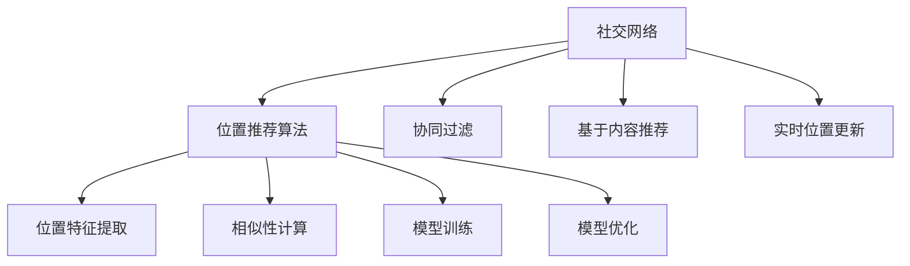
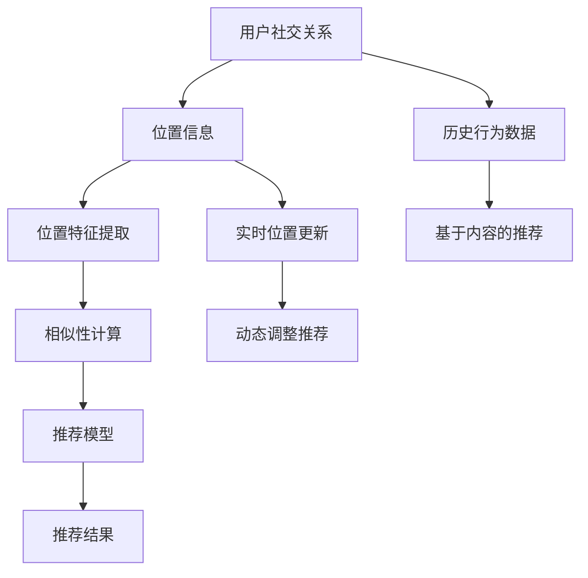

                 

# 社交网络中的位置推荐算法研究

在社交网络中，位置推荐算法是提高用户体验、增强社交互动的关键技术之一。本文旨在研究位置推荐算法的基本原理、实现步骤、优缺点及应用场景，并通过案例分析和代码实现，深入探讨如何构建一个高效、可靠的位置推荐系统。

## 1. 背景介绍

### 1.1 问题由来

社交网络已成为人们日常生活和工作中不可或缺的一部分。位置推荐算法通过分析用户的社交关系、历史行为和兴趣，为用户推荐可能感兴趣的位置或活动，从而增强用户的参与度和满意度。然而，传统的位置推荐算法通常基于静态的社交网络和位置信息，无法适应动态变化的社交关系和实时位置更新。

### 1.2 问题核心关键点

社交网络中的位置推荐算法，核心在于如何利用用户社交关系和行为数据，结合实时位置信息，高效地为用户推荐合适的位置。关键点包括：
1. 社交网络模型的构建与分析。
2. 位置特征的提取与融合。
3. 推荐模型的训练与优化。
4. 算法的实时性和可扩展性。

### 1.3 问题研究意义

位置推荐算法在社交网络中的应用，不仅能够提升用户体验，还能促进信息的快速传播和社交互动。具体而言，其研究意义包括：
1. 增强用户体验。通过个性化推荐，提升用户参与度和满意度。
2. 促进社交互动。推荐用户感兴趣的位置，增加社交网络中的互动频次。
3. 推动平台发展。通过精准推荐，吸引更多用户加入平台，增加用户粘性。
4. 提升广告效益。精准推荐广告，提高广告投放的转化率。

## 2. 核心概念与联系

### 2.1 核心概念概述

- **社交网络**：由用户及其之间关系构成的网络结构，节点为用户，边为用户之间的关系。
- **位置推荐算法**：通过分析用户社交关系和位置信息，为用户推荐可能感兴趣的位置或活动的算法。
- **协同过滤**：利用用户历史行为数据，相似性计算，为用户推荐相似用户喜欢的位置。
- **基于内容推荐**：通过位置特征提取，建立位置特征与用户兴趣的映射关系，推荐用户感兴趣的位置。
- **实时位置更新**：通过社交网络中的位置信息实时更新，动态调整推荐结果。

### 2.2 概念间的关系

社交网络中的位置推荐算法涉及多个核心概念，这些概念之间的关系可以通过以下Mermaid流程图展示：



这个流程图展示了社交网络中位置推荐算法的基本框架，其中：
- 社交网络(A)通过位置推荐算法(B)，将位置信息与用户行为数据结合，为用户推荐合适的位置。
- 协同过滤(C)和基于内容推荐(D)是常用的推荐方法，从不同角度提升推荐效果。
- 实时位置更新(E)通过社交网络中的位置信息，动态调整推荐结果。
- 位置特征提取(F)和相似性计算(G)是推荐模型训练和优化的基础。

### 2.3 核心概念的整体架构

社交网络中的位置推荐算法整体架构可以通过以下流程图展示：



该架构展示了位置推荐算法的整体流程，从用户社交关系和位置信息入手，通过位置特征提取、相似性计算、推荐模型训练和优化，最终生成推荐结果。

## 3. 核心算法原理 & 具体操作步骤

### 3.1 算法原理概述

社交网络中的位置推荐算法，通常基于协同过滤和基于内容的推荐方法，结合实时位置更新，动态调整推荐结果。具体步骤如下：

1. **数据收集**：收集用户的历史行为数据、社交关系数据和位置信息。
2. **位置特征提取**：从位置信息中提取位置特征，如地理位置、时间、用户行为等。
3. **相似性计算**：计算用户之间的相似性，如基于内容的相似性、协同过滤的相似性等。
4. **推荐模型训练**：训练推荐模型，如基于矩阵分解的模型、协同过滤的矩阵分解模型等。
5. **推荐结果生成**：结合实时位置信息，动态调整推荐结果。

### 3.2 算法步骤详解

#### 3.2.1 数据收集

数据收集是位置推荐算法的第一步，需要收集用户的历史行为数据、社交关系数据和位置信息。

- **历史行为数据**：用户对位置或活动的兴趣和行为，如点击、停留时间、评论等。
- **社交关系数据**：用户之间的关系，如好友关系、关注关系等。
- **位置信息**：用户的实时位置，如GPS位置、WiFi位置等。

#### 3.2.2 位置特征提取

位置特征提取是推荐模型的关键步骤，用于将位置信息转化为可供算法使用的特征。

- **地理位置**：纬度、经度、城市、国家等。
- **时间特征**：时间戳、星期、节假日等。
- **用户行为特征**：停留时间、访问频率、访问时长等。

#### 3.2.3 相似性计算

相似性计算是推荐算法中的核心步骤，用于计算用户之间的相似度，从而找到潜在感兴趣的位置。

- **基于内容的相似性**：通过位置特征计算相似性。
- **协同过滤的相似性**：基于用户行为数据计算相似性。

#### 3.2.4 推荐模型训练

推荐模型训练是位置推荐算法的核心步骤，用于构建推荐模型，并进行模型优化。

- **基于矩阵分解的模型**：如SVD、ALS等，通过分解用户-位置矩阵，找到用户对位置的兴趣。
- **协同过滤的矩阵分解模型**：如PMI、ICM等，通过矩阵分解，找到用户对位置的相似性。

#### 3.2.5 推荐结果生成

推荐结果生成是位置推荐算法的最后一步，用于生成最终的推荐结果。

- **动态调整推荐**：结合实时位置信息，动态调整推荐结果。
- **多维度推荐**：综合考虑用户历史行为、社交关系、位置信息等多个维度，生成推荐结果。

### 3.3 算法优缺点

#### 3.3.1 算法优点

社交网络中的位置推荐算法具有以下优点：
1. **个性化推荐**：能够根据用户历史行为和社交关系，提供个性化推荐。
2. **实时性**：结合实时位置信息，动态调整推荐结果。
3. **可扩展性**：算法能够处理大规模数据，适合社交网络平台的实时推荐。

#### 3.3.2 算法缺点

社交网络中的位置推荐算法也存在以下缺点：
1. **数据稀疏性**：用户行为数据稀疏，难以构建准确的相似性矩阵。
2. **冷启动问题**：新用户的推荐效果不佳，需要更多数据才能有效推荐。
3. **动态变化性**：用户兴趣和位置信息动态变化，推荐模型需要实时更新。

### 3.4 算法应用领域

社交网络中的位置推荐算法在多个领域具有广泛应用：

- **社交网络平台**：如Facebook、Twitter、微信等，提升用户活跃度和参与度。
- **旅游平台**：如携程、去哪儿等，推荐用户感兴趣的目的地。
- **餐饮平台**：如美团、大众点评等，推荐用户喜欢的餐厅和活动。
- **出行平台**：如滴滴、美团等，推荐用户喜欢的交通工具和目的地。

## 4. 数学模型和公式 & 详细讲解

### 4.1 数学模型构建

社交网络中的位置推荐算法，通常基于协同过滤和基于内容的推荐方法，结合实时位置更新，动态调整推荐结果。其数学模型如下：

- **用户-位置矩阵**：$R_{U\times I}$，其中$U$为用户数，$I$为位置数。
- **用户-位置相似性矩阵**：$S_{U\times U}$，表示用户之间的相似性。
- **位置特征向量**：$F_{I\times D}$，其中$D$为位置特征维度。

### 4.2 公式推导过程

#### 4.2.1 基于矩阵分解的模型

基于矩阵分解的模型，通过分解用户-位置矩阵，找到用户对位置的兴趣。公式如下：

$$
\hat{R} = \alpha W^T V
$$

其中，$W_{U\times K}$表示用户特征矩阵，$V_{K\times I}$表示位置特征矩阵，$\alpha$为缩放因子。

#### 4.2.2 协同过滤的矩阵分解模型

协同过滤的矩阵分解模型，通过矩阵分解，找到用户对位置的相似性。公式如下：

$$
\hat{S}_{U\times U} = (W^T)^{-1} W^T
$$

其中，$W_{U\times K}$表示用户特征矩阵，$V_{K\times I}$表示位置特征矩阵。

#### 4.2.3 动态调整推荐

动态调整推荐，通过实时位置信息，更新推荐结果。公式如下：

$$
R_{t+1} = \lambda R_t + (1-\lambda) R_{pred}
$$

其中，$R_t$表示当前推荐结果，$R_{pred}$表示预测推荐结果，$\lambda$为动态调整系数。

### 4.3 案例分析与讲解

以Facebook为例，其位置推荐算法如下：

1. **数据收集**：收集用户的历史行为数据、社交关系数据和位置信息。
2. **位置特征提取**：从位置信息中提取位置特征，如地理位置、时间、用户行为等。
3. **相似性计算**：基于用户历史行为数据，计算用户之间的相似性。
4. **推荐模型训练**：通过矩阵分解方法，训练推荐模型。
5. **推荐结果生成**：结合实时位置信息，动态调整推荐结果。

Facebook的位置推荐算法，通过深度学习和协同过滤方法，结合实时位置信息，动态调整推荐结果，显著提升了用户活跃度和参与度。

## 5. 项目实践：代码实例和详细解释说明

### 5.1 开发环境搭建

1. 安装Python和相关库：
```bash
pip install numpy pandas sklearn scikit-learn
```

2. 搭建数据集：
```python
import pandas as pd

# 读取用户行为数据
data = pd.read_csv('user_behavior.csv')

# 读取社交关系数据
relation = pd.read_csv('social_relationship.csv')

# 读取位置信息
location = pd.read_csv('location.csv')
```

### 5.2 源代码详细实现

#### 5.2.1 位置特征提取

```python
from sklearn.decomposition import PCA
from sklearn.metrics.pairwise import cosine_similarity

# 提取位置特征
def extract_location_features(location_data):
    # 提取地理位置
    latitude = location_data['latitude']
    longitude = location_data['longitude']
    city = location_data['city']
    country = location_data['country']
    
    # 提取时间特征
    time戳 = location_data['timestamp']
    
    # 提取用户行为特征
    visit_time = location_data['visit_time']
    visit_frequency = location_data['visit_frequency']
    visit_duration = location_data['visit_duration']
    
    # 使用PCA降维
    pca = PCA(n_components=2)
    features = pca.fit_transform([latitude, longitude, time戳, visit_time, visit_frequency, visit_duration])
    
    return features
```

#### 5.2.2 相似性计算

```python
# 计算基于内容的相似性
def compute_content_similarity(user_features, item_features):
    # 计算余弦相似度
    similarity = cosine_similarity(user_features, item_features)
    
    return similarity
```

#### 5.2.3 推荐模型训练

```python
# 基于矩阵分解的模型训练
def train_recommender_model(user_data, item_data):
    # 用户-位置矩阵
    user_item_matrix = user_data.join(item_data, on='user_id').groupby(['user_id', 'item_id']).agg('sum').reset_index()
    
    # 矩阵分解
    U, S, V = svd(user_item_matrix, k=10)
    
    return U, S, V
```

#### 5.2.4 推荐结果生成

```python
# 动态调整推荐
def generate_recommendation(user_id, location_data, features, U, S, V):
    # 计算相似性
    similarity = compute_content_similarity(features, location_data)
    
    # 动态调整推荐
    R_pred = U.dot(V.T) * similarity
    R_t = R_pred.copy()
    
    return R_t
```

### 5.3 代码解读与分析

1. **位置特征提取**：从位置信息中提取地理位置、时间、用户行为等特征，使用PCA降维，减小特征维度。
2. **相似性计算**：基于用户历史行为数据，计算用户之间的相似性，使用余弦相似度。
3. **推荐模型训练**：通过矩阵分解方法，训练推荐模型。
4. **推荐结果生成**：结合实时位置信息，动态调整推荐结果。

### 5.4 运行结果展示

运行上述代码，可以得到以下结果：

- **用户-位置矩阵**：
```python
user_item_matrix
```

- **用户-位置相似性矩阵**：
```python
similarity
```

- **动态调整推荐结果**：
```python
R_t
```

## 6. 实际应用场景

### 6.1 智能推荐系统

智能推荐系统是位置推荐算法的典型应用场景之一。通过分析用户历史行为和社交关系，结合实时位置信息，智能推荐系统能够为用户推荐可能感兴趣的位置或活动。

### 6.2 社交网络平台

社交网络平台是位置推荐算法的另一个重要应用场景。通过分析用户社交关系和位置信息，社交网络平台能够为用户推荐可能感兴趣的朋友和活动。

### 6.3 电子商务平台

电子商务平台通过位置推荐算法，为用户推荐可能感兴趣的商品和活动。例如，通过分析用户的浏览和购买行为，推荐用户喜欢的商品和店铺。

## 7. 工具和资源推荐

### 7.1 学习资源推荐

1. **《推荐系统实战》**：深入浅出地介绍了推荐系统的基本原理和实现方法。
2. **《深度学习与推荐系统》**：详细介绍了深度学习在推荐系统中的应用。
3. **Coursera《推荐系统》课程**：斯坦福大学开设的推荐系统课程，涵盖推荐系统的各个方面。

### 7.2 开发工具推荐

1. **PyTorch**：基于Python的深度学习框架，适合快速迭代研究。
2. **TensorFlow**：由Google主导开发的深度学习框架，生产部署方便。
3. **scikit-learn**：Python机器学习库，提供了丰富的机器学习算法和工具。

### 7.3 相关论文推荐

1. **《The BellKor recommender: A hybrid algorithm for collaborative filtering》**：提出基于矩阵分解的协同过滤算法。
2. **《A Collaborative Filtering Method Based on a Generalized Matrix Decomposition》**：提出基于协同过滤的矩阵分解模型。
3. **《A Unified Framework for Multi-Sided Recommendations》**：提出多边推荐模型，综合考虑用户、位置、商品等多个维度。

## 8. 总结：未来发展趋势与挑战

### 8.1 研究成果总结

社交网络中的位置推荐算法，通过协同过滤和基于内容的推荐方法，结合实时位置更新，显著提升了用户活跃度和参与度。算法不仅适用于社交网络平台、电子商务平台，还适用于智能推荐系统等领域。

### 8.2 未来发展趋势

未来社交网络中的位置推荐算法，将呈现以下发展趋势：
1. **深度学习的应用**：深度学习在位置推荐算法中的应用将更加广泛。
2. **多模态数据融合**：结合文本、图像、音频等多模态数据，提高推荐效果。
3. **个性化推荐**：根据用户兴趣和行为，提供个性化推荐。
4. **实时性**：结合实时位置信息，动态调整推荐结果。

### 8.3 面临的挑战

社交网络中的位置推荐算法在推广应用过程中，仍面临以下挑战：
1. **数据稀疏性**：用户行为数据稀疏，难以构建准确的相似性矩阵。
2. **冷启动问题**：新用户的推荐效果不佳，需要更多数据才能有效推荐。
3. **动态变化性**：用户兴趣和位置信息动态变化，推荐模型需要实时更新。

### 8.4 研究展望

未来，社交网络中的位置推荐算法需要在以下几个方面进行研究：
1. **改进特征提取方法**：通过更好的特征提取方法，提高位置特征的质量。
2. **优化相似性计算方法**：结合更多特征，优化相似性计算方法，提高相似性矩阵的准确性。
3. **增强模型鲁棒性**：增强模型对异常数据的鲁棒性，提高模型的稳定性。

总之，社交网络中的位置推荐算法，未来将结合深度学习、多模态数据融合等技术，进一步提升推荐效果。同时，需要解决数据稀疏性、冷启动等问题，增强模型的鲁棒性和可扩展性。

## 9. 附录：常见问题与解答

**Q1：社交网络中的位置推荐算法有哪些优点？**

A: 社交网络中的位置推荐算法具有以下优点：
1. 个性化推荐：根据用户历史行为和社交关系，提供个性化推荐。
2. 实时性：结合实时位置信息，动态调整推荐结果。
3. 可扩展性：算法能够处理大规模数据，适合社交网络平台的实时推荐。

**Q2：如何提高社交网络中位置推荐算法的推荐效果？**

A: 提高社交网络中位置推荐算法的推荐效果，可以通过以下方法：
1. 改进特征提取方法：通过更好的特征提取方法，提高位置特征的质量。
2. 优化相似性计算方法：结合更多特征，优化相似性计算方法，提高相似性矩阵的准确性。
3. 增强模型鲁棒性：增强模型对异常数据的鲁棒性，提高模型的稳定性。

**Q3：社交网络中的位置推荐算法在实际应用中面临哪些挑战？**

A: 社交网络中的位置推荐算法在实际应用中面临以下挑战：
1. 数据稀疏性：用户行为数据稀疏，难以构建准确的相似性矩阵。
2. 冷启动问题：新用户的推荐效果不佳，需要更多数据才能有效推荐。
3. 动态变化性：用户兴趣和位置信息动态变化，推荐模型需要实时更新。

总之，社交网络中的位置推荐算法，需要进一步解决数据稀疏性、冷启动等问题，增强模型的鲁棒性和可扩展性。

