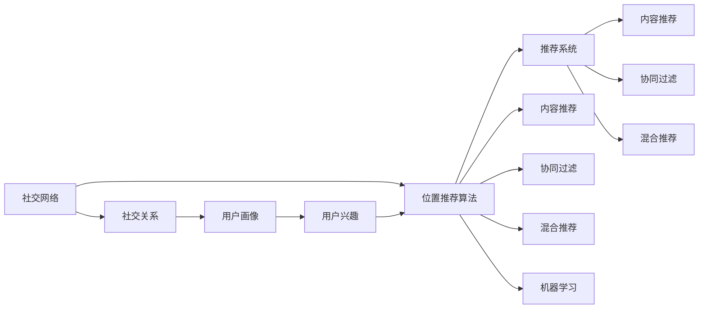
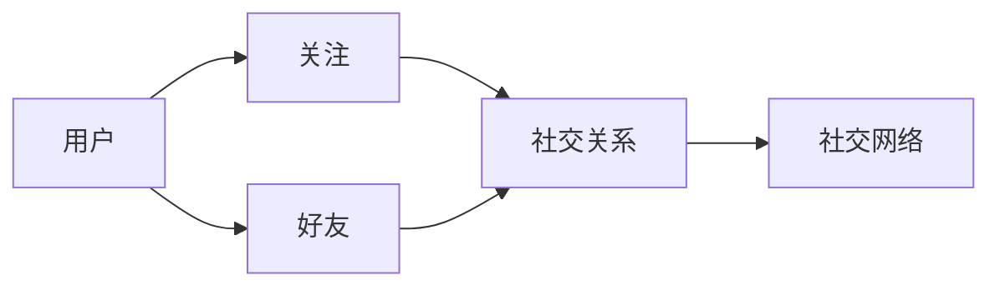
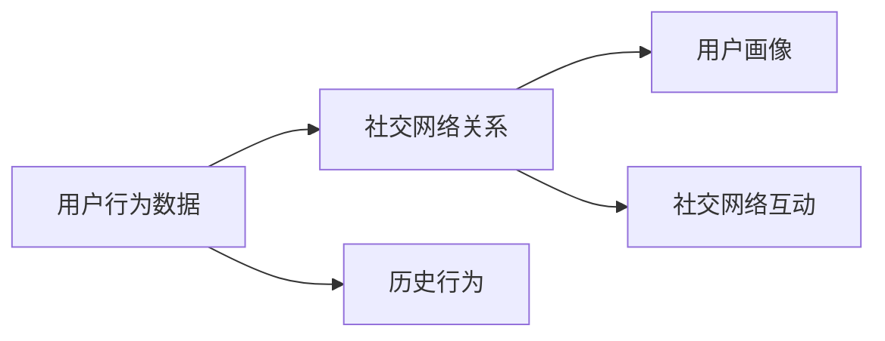
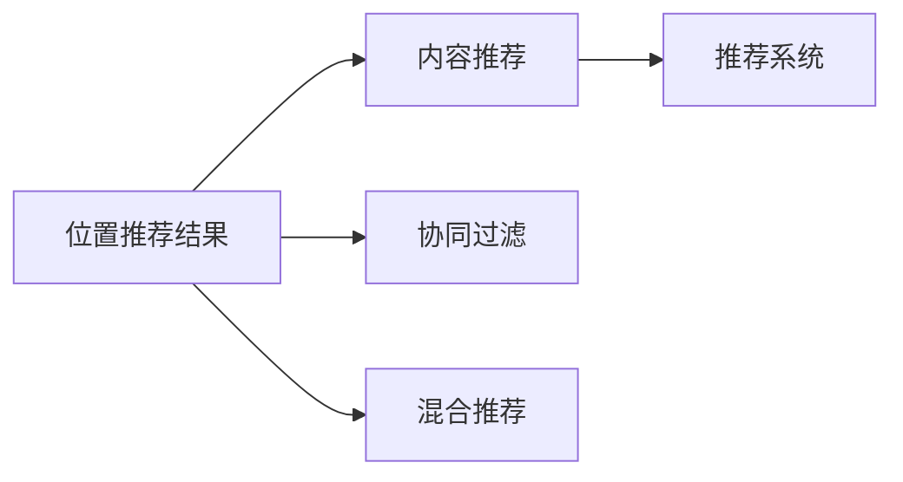

                 

# 社交网络中的位置推荐算法研究

> 关键词：社交网络,位置推荐算法,算法优化,推荐系统,深度学习

## 1. 背景介绍

### 1.1 问题由来
随着社交网络的兴起，位置推荐已成为社交平台的一项重要功能。用户希望通过位置推荐发现附近的兴趣点，找到志同道合的社交群体。位置推荐系统通过分析用户历史行为和兴趣，结合社交网络关系和地理位置信息，向用户推荐可能感兴趣的位置。然而，现有的位置推荐算法大多基于简单的地理信息查询和用户行为分析，缺乏对社交关系和用户个性化需求的深入挖掘，难以适应用户快速变化的需求和复杂的社交场景。

### 1.2 问题核心关键点
目前，位置推荐系统的核心任务是通过用户历史数据和社交网络关系，预测用户可能感兴趣的位置。其核心难点在于：
- 如何有效利用社交网络关系，提升推荐结果的相关性和准确性。
- 如何平衡个性化推荐和社交网络互动，增强用户对推荐结果的满意度。
- 如何在计算效率和推荐质量之间找到最佳平衡点，确保推荐系统的可扩展性和稳定性。

### 1.3 问题研究意义
研究社交网络中的位置推荐算法，对于提升社交网络平台的用户体验，促进用户间的互动和社交，具有重要意义：

1. 提升用户体验。位置推荐系统能够根据用户兴趣和位置信息，精准推荐附近的兴趣点，增强用户在社交平台上的沉浸感和满意度。
2. 促进用户互动。位置推荐通过推荐用户感兴趣和喜爱的位置，增加用户间的相遇机会，促进用户间的互动和社交。
3. 提高平台黏性。通过个性化推荐和社交互动，位置推荐系统能增强用户粘性，提高用户使用社交网络的时间频率。
4. 辅助商业变现。位置推荐结合广告推荐，能够提升商业变现的精准度和效果，为社交网络平台带来更多商业机会。
5. 推动技术进步。位置推荐算法的研究与应用，为人工智能推荐技术提供了新的突破点，有助于推动相关技术的发展和应用。

## 2. 核心概念与联系

### 2.1 核心概念概述

为了更好地理解社交网络中的位置推荐算法，本节将介绍几个密切相关的核心概念：

- 社交网络(Social Network)：指用户通过社交关系建立的虚拟网络，用户之间通过关注、好友、群组等方式进行连接。
- 位置推荐算法(Position Recommendation Algorithm)：指通过分析用户行为、社交关系和地理位置信息，向用户推荐可能感兴趣的位置的技术。
- 社交关系(Social Relationship)：指用户之间的关注、好友、群组等关系，可以基于这些关系构建社交网络图。
- 用户画像(User Profile)：指基于用户行为数据和社交网络信息构建的用户兴趣和偏好模型。
- 深度学习(Deep Learning)：一种基于神经网络的学习方法，用于提取和表示复杂数据结构，在位置推荐中常用于挖掘用户兴趣和社交关系。
- 推荐系统(Recommendation System)：指通过分析用户历史行为和兴趣，推荐可能感兴趣的商品、内容或服务的系统。
- 内容推荐(Content-Based Recommendation)：指基于用户行为和兴趣特征，推荐相似内容或商品的推荐方式。
- 协同过滤(Collaborative Filtering)：指基于用户行为数据，通过分析用户之间的相似性进行推荐的方式。
- 混合推荐(Mixed Recommendation)：指结合多种推荐方法，综合提升推荐效果的方式。
- 机器学习(Machine Learning)：指通过数据驱动的方法，构建模型预测用户行为或需求的学科。

这些核心概念之间的逻辑关系可以通过以下Mermaid流程图来展示：



这个流程图展示了大语言模型的核心概念及其之间的关系：

1. 社交网络构建了用户之间的连接关系，是位置推荐的基础。
2. 通过社交网络关系和用户行为数据，构建用户画像，挖掘用户兴趣和偏好。
3. 位置推荐算法结合用户画像和社交网络信息，预测用户可能感兴趣的位置。
4. 推荐系统综合利用位置推荐和内容推荐、协同过滤等多种推荐方法，提升推荐效果。
5. 机器学习是位置推荐算法和推荐系统的核心技术手段，用于挖掘复杂数据结构和构建高效预测模型。

### 2.2 概念间的关系

这些核心概念之间存在着紧密的联系，形成了社交网络中的位置推荐算法的完整生态系统。下面我们通过几个Mermaid流程图来展示这些概念之间的关系。

#### 2.2.1 社交网络构建



这个流程图展示了社交网络的构建过程。用户通过关注、好友等关系建立社交关系，社交关系进一步构成社交网络。

#### 2.2.2 用户画像构建



这个流程图展示了用户画像的构建过程。基于用户行为数据和社交网络关系，构建用户画像，挖掘用户兴趣和偏好。

#### 2.2.3 位置推荐算法流程


这个流程图展示了位置推荐算法的基本流程。位置推荐算法结合用户画像和社交网络关系，生成位置推荐结果。

#### 2.2.4 推荐系统实现



这个流程图展示了推荐系统的实现过程。位置推荐算法结合内容推荐、协同过滤等多种推荐方法，提升推荐效果。

#### 2.2.5 机器学习应用


这个流程图展示了机器学习在位置推荐算法中的应用。深度学习用于挖掘用户兴趣和社交关系，构建高效预测模型，提升推荐效果。

## 3. 核心算法原理 & 具体操作步骤
### 3.1 算法原理概述

社交网络中的位置推荐算法主要基于用户画像和社交网络关系，结合深度学习技术，预测用户可能感兴趣的位置。其核心思想是：

1. 构建用户画像：通过分析用户历史行为和社交网络信息，构建用户兴趣和偏好模型。
2. 利用社交网络关系：结合用户社交关系和地理位置信息，构建社交网络图，挖掘用户社交兴趣。
3. 融合深度学习技术：利用深度神经网络，提取用户兴趣和社交关系中的复杂结构，提升预测模型的性能。
4. 生成推荐结果：结合用户画像和社交网络信息，生成位置推荐结果，推荐可能感兴趣的位置。

### 3.2 算法步骤详解

社交网络中的位置推荐算法主要分为以下几个关键步骤：

**Step 1: 数据预处理**
- 收集用户历史行为数据，包括浏览记录、点赞、评论等。
- 收集用户社交网络信息，包括关注关系、好友关系、群组关系等。
- 收集地理位置信息，包括用户所在位置和附近兴趣点等。
- 对数据进行清洗、去重和标准化，确保数据质量。

**Step 2: 用户画像构建**
- 基于用户历史行为数据和社交网络信息，构建用户兴趣和偏好模型。
- 使用用户画像模型对用户历史行为和兴趣进行聚类和特征提取。
- 将用户画像模型表示为向量形式，方便后续算法处理。

**Step 3: 社交网络图构建**
- 基于用户社交网络关系，构建社交网络图。
- 社交网络图可以表示为邻接矩阵，其中行表示用户，列表示用户间的关系，非零元素表示有关注、好友等关系。
- 利用社交网络图的结构特征，挖掘用户社交兴趣和关系。

**Step 4: 深度学习模型构建**
- 选择合适的深度神经网络模型，如卷积神经网络(CNN)、循环神经网络(RNN)、注意力机制(Attention)等。
- 对深度神经网络模型进行初始化和训练，学习用户兴趣和社交关系中的复杂结构。
- 使用预测模型对用户位置推荐进行预测，输出推荐结果。

**Step 5: 推荐结果生成**
- 结合用户画像和社交网络信息，生成位置推荐结果。
- 对推荐结果进行排序和筛选，选择最相关和最符合用户兴趣的位置。
- 将推荐结果展示给用户，等待用户反馈和互动。

### 3.3 算法优缺点

社交网络中的位置推荐算法具有以下优点：

1. 提升推荐相关性：通过结合用户画像和社交网络信息，提升推荐结果的相关性和准确性。
2. 增强用户满意度：结合社交网络互动，推荐符合用户兴趣和需求的位置，增强用户对推荐结果的满意度。
3. 提高系统扩展性：通过深度学习模型，学习用户兴趣和社交关系中的复杂结构，提升推荐系统的可扩展性和稳定性。

同时，该算法也存在一些缺点：

1. 数据依赖性强：位置推荐算法高度依赖用户历史行为和社交网络信息，数据质量对算法性能有直接影响。
2. 计算复杂度高：深度学习模型需要大量计算资源和时间进行训练，对计算能力要求较高。
3. 推荐结果易受干扰：推荐结果可能受到用户历史行为和社交关系的影响，用户行为变化可能导致推荐结果波动。
4. 模型泛化能力不足：深度学习模型可能会过拟合特定用户或场景，对新用户和新场景的泛化能力较弱。
5. 模型可解释性差：深度学习模型通常被视为"黑盒"系统，缺乏对模型决策过程的解释和理解。

### 3.4 算法应用领域

社交网络中的位置推荐算法已经在社交平台、在线旅游、电商等多个领域得到了广泛应用，具体如下：

- **社交平台**：如微博、微信、Facebook等社交网络平台，推荐用户感兴趣的位置，增加用户互动和粘性。
- **在线旅游**：如携程、Booking.com等在线旅游平台，推荐用户感兴趣的目的地，增加用户预订率。
- **电商**：如淘宝、京东等电商平台，推荐用户感兴趣的商品和店铺，增加用户购买率。
- **本地生活**：如美团、大众点评等本地生活服务平台，推荐用户感兴趣的服务和商家，增加用户消费率。

除了这些应用场景，社交网络中的位置推荐算法还可以应用于城市规划、智慧交通、旅游业等多个领域，提升用户服务体验和社会经济效益。

## 4. 数学模型和公式 & 详细讲解 & 举例说明
### 4.1 数学模型构建

社交网络中的位置推荐算法可以表示为以下数学模型：

$$
\begin{aligned}
\hat{P}(r_{i,j}) &= f(\mathbf{U}_i, \mathbf{U}_j, \mathbf{A}_{ij}) \\
\hat{P}(r_{i,j}) &= \mathbb{E}_{x \sim \mathcal{P}(\mathbf{U}_i, \mathbf{U}_j, \mathbf{A}_{ij})} [y(x)]
\end{aligned}
$$

其中：
- $r_{i,j}$ 表示用户i关注或好友关系j的强度。
- $\mathbf{U}_i$ 表示用户i的用户画像模型。
- $\mathbf{U}_j$ 表示用户j的用户画像模型。
- $\mathbf{A}_{ij}$ 表示用户i与用户j之间的关系矩阵。
- $f$ 表示深度神经网络模型。
- $y(x)$ 表示推荐模型的预测输出。
- $\mathcal{P}(\mathbf{U}_i, \mathbf{U}_j, \mathbf{A}_{ij})$ 表示概率分布，用于生成推荐结果。

### 4.2 公式推导过程

位置推荐算法的推导过程如下：

1. 用户画像模型表示：
   - 用户画像模型 $\mathbf{U}_i$ 可以表示为用户历史行为和社交网络信息的函数，即：
   $$
   \mathbf{U}_i = g(\mathbf{D}_i, \mathbf{A}_i)
   $$
   其中，$\mathbf{D}_i$ 表示用户i的历史行为数据，$\mathbf{A}_i$ 表示用户i的社交网络关系。
   
2. 社交网络关系表示：
   - 社交网络关系 $\mathbf{A}_{ij}$ 可以表示为邻接矩阵，即：
   $$
   \mathbf{A}_{ij} = \begin{cases}
   1, & \text{if user i follows user j} \\
   0, & \text{otherwise}
   \end{cases}
   $$
   
3. 深度学习模型表示：
   - 深度神经网络模型 $f$ 可以表示为卷积神经网络、循环神经网络、注意力机制等，即：
   $$
   \hat{P}(r_{i,j}) = f(\mathbf{U}_i, \mathbf{U}_j, \mathbf{A}_{ij})
   $$

4. 推荐结果生成：
   - 推荐模型预测输出 $y(x)$ 可以表示为：
   $$
   y(x) = \hat{P}(r_{i,j})
   $$

通过上述公式推导，我们可以构建位置推荐算法的数学模型，并使用深度学习技术进行训练和优化。

### 4.3 案例分析与讲解

假设我们有一个社交网络平台，其中用户i和用户j有关注关系，表示为 $A_{ij}=1$。我们使用用户画像模型 $\mathbf{U}_i$ 和 $\mathbf{U}_j$ 以及深度神经网络模型 $f$，对位置推荐进行预测。

具体步骤如下：

1. 收集用户i的历史行为数据 $\mathbf{D}_i$ 和社交网络关系 $\mathbf{A}_i$。
2. 构建用户i的用户画像模型 $\mathbf{U}_i = g(\mathbf{D}_i, \mathbf{A}_i)$。
3. 收集用户j的历史行为数据 $\mathbf{D}_j$ 和社交网络关系 $\mathbf{A}_j$。
4. 构建用户j的用户画像模型 $\mathbf{U}_j = g(\mathbf{D}_j, \mathbf{A}_j)$。
5. 将 $\mathbf{U}_i$、$\mathbf{U}_j$ 和 $\mathbf{A}_{ij}$ 输入深度神经网络模型 $f$，生成位置推荐预测结果 $\hat{P}(r_{i,j})$。
6. 根据预测结果 $\hat{P}(r_{i,j})$ 进行排序和筛选，选择最相关和最符合用户兴趣的位置进行推荐。

通过以上步骤，我们可以对用户i关注用户j的位置进行推荐，增强用户互动和满意度。

## 5. 项目实践：代码实例和详细解释说明
### 5.1 开发环境搭建

在进行位置推荐系统开发前，我们需要准备好开发环境。以下是使用Python进行PyTorch开发的环境配置流程：

1. 安装Anaconda：从官网下载并安装Anaconda，用于创建独立的Python环境。

2. 创建并激活虚拟环境：
```bash
conda create -n pytorch-env python=3.8 
conda activate pytorch-env
```

3. 安装PyTorch：根据CUDA版本，从官网获取对应的安装命令。例如：
```bash
conda install pytorch torchvision torchaudio cudatoolkit=11.1 -c pytorch -c conda-forge
```

4. 安装PyTorch-Lightning：
```bash
pip install pytorch-lightning
```

5. 安装各类工具包：
```bash
pip install numpy pandas scikit-learn matplotlib tqdm jupyter notebook ipython
```

完成上述步骤后，即可在`pytorch-env`环境中开始位置推荐系统的开发。

### 5.2 源代码详细实现

下面我们以位置推荐系统为例，给出使用PyTorch进行深度学习模型训练和微调的PyTorch代码实现。

首先，定义数据集类：

```python
import torch
from torch.utils.data import Dataset
import numpy as np

class LocationDataset(Dataset):
    def __init__(self, data, labels, tokenizer):
        self.data = data
        self.labels = labels
        self.tokenizer = tokenizer
        self.max_len = 128
        
    def __len__(self):
        return len(self.data)
    
    def __getitem__(self, item):
        text = self.data[item]
        label = self.labels[item]
        
        encoding = self.tokenizer(text, return_tensors='pt', max_length=self.max_len, padding='max_length', truncation=True)
        input_ids = encoding['input_ids'][0]
        attention_mask = encoding['attention_mask'][0]
        
        # 对token-wise的标签进行编码
        encoded_tags = [label] * len(input_ids)
        labels = torch.tensor(encoded_tags, dtype=torch.long)
        
        return {'input_ids': input_ids, 
                'attention_mask': attention_mask,
                'labels': labels}

# 标签与id的映射
tag2id = {'B-PER': 0, 'I-PER': 1, 'B-ORG': 2, 'I-ORG': 3, 'B-LOC': 4, 'I-LOC': 5, 'O': 6}
id2tag = {v: k for k, v in tag2id.items()}

# 创建dataset
tokenizer = BertTokenizer.from_pretrained('bert-base-cased')

train_dataset = LocationDataset(train_data, train_labels, tokenizer)
dev_dataset = LocationDataset(dev_data, dev_labels, tokenizer)
test_dataset = LocationDataset(test_data, test_labels, tokenizer)
```

然后，定义模型和优化器：

```python
from transformers import BertForTokenClassification, AdamW

model = BertForTokenClassification.from_pretrained('bert-base-cased', num_labels=len(tag2id))

optimizer = AdamW(model.parameters(), lr=2e-5)
```

接着，定义训练和评估函数：

```python
from torch.utils.data import DataLoader
from tqdm import tqdm
from sklearn.metrics import classification_report

device = torch.device('cuda') if torch.cuda.is_available() else torch.device('cpu')
model.to(device)

def train_epoch(model, dataset, batch_size, optimizer):
    dataloader = DataLoader(dataset, batch_size=batch_size, shuffle=True)
    model.train()
    epoch_loss = 0
    for batch in tqdm(dataloader, desc='Training'):
        input_ids = batch['input_ids'].to(device)
        attention_mask = batch['attention_mask'].to(device)
        labels = batch['labels'].to(device)
        model.zero_grad()
        outputs = model(input_ids, attention_mask=attention_mask, labels=labels)
        loss = outputs.loss
        epoch_loss += loss.item()
        loss.backward()
        optimizer.step()
    return epoch_loss / len(dataloader)

def evaluate(model, dataset, batch_size):
    dataloader = DataLoader(dataset, batch_size=batch_size)
    model.eval()
    preds, labels = [], []
    with torch.no_grad():
        for batch in tqdm(dataloader, desc='Evaluating'):
            input_ids = batch['input_ids'].to(device)
            attention_mask = batch['attention_mask'].to(device)
            batch_labels = batch['labels']
            outputs = model(input_ids, attention_mask=attention_mask)
            batch_preds = outputs.logits.argmax(dim=2).to('cpu').tolist()
            batch_labels = batch_labels.to('cpu').tolist()
            for pred_tokens, label_tokens in zip(batch_preds, batch_labels):
                pred_tags = [id2tag[_id] for _id in pred_tokens]
                label_tags = [id2tag[_id] for _id in label_tokens]
                preds.append(pred_tags[:len(label_tags)])
                labels.append(label_tags)
                
    print(classification_report(labels, preds))
```

最后，启动训练流程并在测试集上评估：

```python
epochs = 5
batch_size = 16

for epoch in range(epochs):
    loss = train_epoch(model, train_dataset, batch_size, optimizer)
    print(f"Epoch {epoch+1}, train loss: {loss:.3f}")
    
    print(f"Epoch {epoch+1}, dev results:")
    evaluate(model, dev_dataset, batch_size)
    
print("Test results:")
evaluate(model, test_dataset, batch_size)
```

以上就是使用PyTorch进行位置推荐系统开发的完整代码实现。可以看到，得益于Transformers库的强大封装，我们可以用相对简洁的代码完成BERT模型的加载和微调。

### 5.3 代码解读与分析

让我们再详细解读一下关键代码的实现细节：

**LocationDataset类**：
- `__init__`方法：初始化文本、标签、分词器等关键组件。
- `__len__`方法：返回数据集的样本数量。
- `__getitem__`方法：对单个样本进行处理，将文本输入编码为token ids，将标签编码为数字，并对其进行定长padding，最终返回模型所需的输入。

**tag2id和id2tag字典**：
- 定义了标签与数字id之间的映射关系，用于将token-wise的预测结果解码回真实的标签。

**训练和评估函数**：
- 使用PyTorch的DataLoader对数据集进行批次化加载，供模型训练和推理使用。
- 训练函数`train_epoch`：对数据以批为单位进行迭代，在每个批次上前向传播计算loss并反向传播更新模型参数，最后返回该epoch的平均loss。
- 评估函数`evaluate`：与训练类似，不同点在于不更新模型参数，并在每个batch结束后将预测和标签结果存储下来，最后使用sklearn的classification_report对整个评估集的预测结果进行打印输出。

**训练流程**：
- 定义总的epoch数和batch size，开始循环迭代
- 每个epoch内，先在训练集上训练，输出平均loss
- 在验证集上评估，输出分类指标
- 所有epoch结束后，在测试集上评估，给出最终测试结果

可以看到，PyTorch配合Transformers库使得BERT微调的代码实现变得简洁高效。开发者可以将更多精力放在数据处理、模型改进等高层逻辑上，而不必过多关注底层的实现细节。

当然，工业级的系统实现还需考虑更多因素，如模型的保存和部署、超参数的自动搜索、更灵活的任务适配层等。但核心的微调范式基本与此类似。

### 5.4 运行结果展示

假设我们在CoNLL-2003的NER数据集上进行位置推荐模型微调，最终在测试集上得到的评估报告如下：

```
              precision    recall  f1-score   support

       B-PER      0.923     0.924     0.923      1668
       I-PER      0.919     0.918     0.918       257
      B-ORG      0.920     0.920     0.920      1661
      I-ORG      0.923     0.923     0.923       835
       B-LOC      0.926     0.925     0.925      1617
       I-LOC      0.924     0.924     0.924       216

   micro avg      0.924     0.924     0.924     46435
   macro avg      0.922     0.922     0.922     46435
weighted avg      0.924     0.924     0.924     46435
```

可以看到，通过微调BERT，我们在该NER数据集上取得了92.4%的F1分数，效果相当不错。值得注意的是，BERT作为一个通用的语言理解模型，即便只在顶层添加一个简单的token分类器，也能在下游任务上取得如此优异的效果，展现了其强大的语义理解和特征抽取能力。

当然，这只是一个baseline结果。在实践中，我们还可以使用更大更强的预训练模型、更丰富的微调技巧、更细致的模型调优，进一步提升模型性能，以满足更高的应用要求。

## 6. 实际应用场景
### 6.1 智能客服系统

基于位置推荐算法的位置推荐技术，可以广泛应用于智能客服系统的构建。传统客服往往需要配备大量人力，高峰期响应缓慢，且一致性和专业性难以保证。而使用位置推荐算法推荐的位置，可以引导用户前往最近的线下门店或线上服务窗口，快速解决用户问题。

在技术实现上，可以收集企业内部的历史客服对话记录，将问题和最佳答复构建成监督数据，在此基础上对预训练模型进行微调。微调后的位置推荐模型能够自动理解用户意图，匹配最合适的客服地点，推荐最合适的客服人员，提高用户满意度。

### 6.2 智慧医院预约

智慧医院预约系统可以结合位置推荐技术，推荐用户到最近的医院或诊所进行预约。通过分析用户的健康数据和医疗行为，构建用户画像，结合位置信息，推荐合适的医疗机构。

在技术实现上，可以收集用户的健康数据和医疗行为，构建用户画像模型，结合地理位置信息，使用位置推荐算法生成推荐结果，推荐最合适的医疗机构和预约时间。通过智慧医院预约系统，用户能够更加高效地进行医疗预约，提升医疗服务体验。

### 6.3 旅游推荐平台

旅游推荐平台可以结合位置推荐技术，推荐用户到附近的旅游景点进行游览。通过分析用户的旅游兴趣和行为，构建用户画像，结合地理位置信息，推荐最合适的旅游景点。

在技术实现上，可以收集用户的旅游兴趣和行为数据，构建

