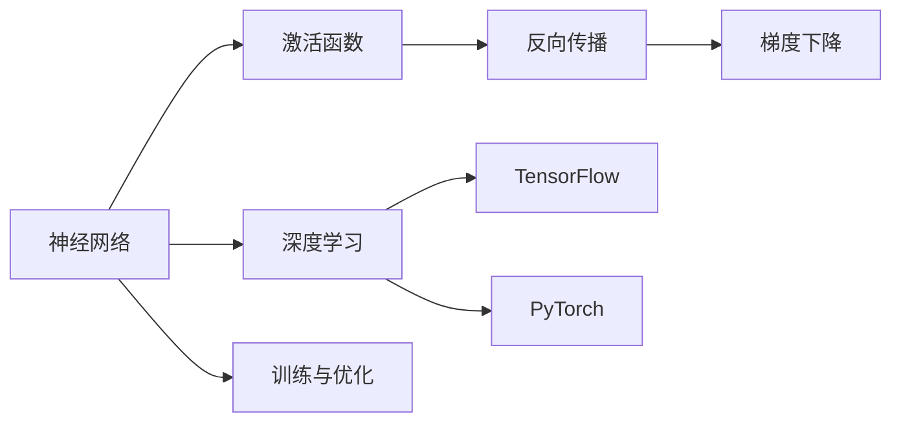
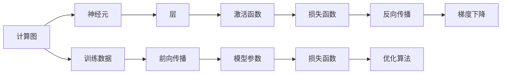
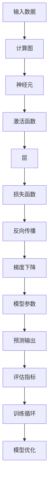
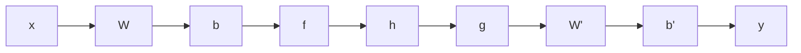
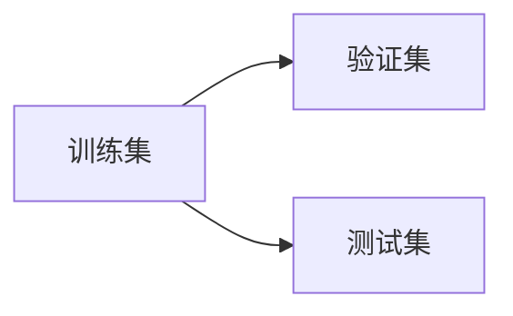
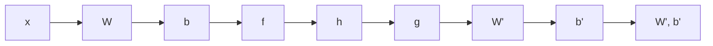

                 

# 神经网络 原理与代码实例讲解

> 关键词：神经网络,激活函数,反向传播,梯度下降,深度学习,TensorFlow,PyTorch

## 1. 背景介绍

### 1.1 问题由来
随着人工智能技术的不断发展，深度学习(DL)已经成为处理各种复杂任务的核心技术。其中，神经网络(Neural Network)以其强大的表达能力和自适应学习能力，在图像识别、自然语言处理、语音识别等领域取得了显著的成果。因此，神经网络的原理与实现成为深度学习初学者必须掌握的基础知识。

### 1.2 问题核心关键点
神经网络的原理涉及计算图、激活函数、反向传播、梯度下降等核心概念。在具体实现时，我们通常使用深度学习框架（如TensorFlow、PyTorch等）进行模型搭建、训练和部署。本文将从原理到实践，深入探讨神经网络的核心概念和代码实现，为深度学习的进阶学习奠定坚实基础。

### 1.3 问题研究意义
掌握神经网络的原理与实现，对于从事深度学习研究和开发的专业人士来说，具有重要意义。它能帮助开发者更好地理解深度学习算法的本质，优化模型设计，提升算法效率，加速技术落地应用。

## 2. 核心概念与联系

### 2.1 核心概念概述

为更好地理解神经网络的工作原理，本节将介绍几个关键概念：

- 神经网络(Neural Network)：由多个神经元（或称节点）构成的网络结构，用于处理输入数据，输出预测结果。神经网络通过层与层之间的连接和变换，完成数据的逐步处理。

- 激活函数(Activation Function)：神经元在计算时使用的非线性变换函数。常见的激活函数有Sigmoid、ReLU、Tanh等，主要用于引入非线性特性，使神经网络可以逼近更复杂的函数。

- 反向传播(Backpropagation)：神经网络训练中的核心算法，用于计算损失函数对每个参数的梯度，并基于梯度进行参数更新。反向传播算法通过链式法则计算梯度，高效便捷。

- 梯度下降(Gradient Descent)：一种基于梯度信息的优化算法，用于更新神经网络的参数，使损失函数最小化。常见的梯度下降算法包括随机梯度下降(SGD)、批量梯度下降(BGD)、动量梯度下降等。

- 深度学习(Deep Learning)：一种使用多层次神经网络进行复杂数据建模的技术，通过逐层特征提取，实现对输入数据的深度表示和复杂映射。

- TensorFlow：由Google开发的深度学习框架，支持动态图和静态图两种计算模型，适用于大规模分布式计算。

- PyTorch：由Facebook开发的深度学习框架，支持动态计算图，易于调试和优化，广泛应用于学术研究和工业应用。

这些核心概念之间存在紧密的联系，构成了神经网络学习和应用的基础。下面通过Mermaid流程图展示这些概念之间的联系：



该流程图展示了神经网络构建、训练和优化的主要过程，以及与深度学习框架的紧密关系。

### 2.2 概念间的关系

这些核心概念之间的逻辑关系可以通过以下Mermaid流程图来展示：



该流程图展示了神经网络从输入到输出，通过计算图、层、激活函数、反向传播、梯度下降等步骤的计算过程。其中，前向传播用于计算模型的预测输出，后向传播用于计算损失函数对参数的梯度，优化算法则基于梯度信息更新参数。

### 2.3 核心概念的整体架构

最后，我们将这些核心概念综合起来，形成一个神经网络的整体架构。



该流程图展示了神经网络的基本架构，从输入数据开始，通过计算图、层、激活函数、损失函数、反向传播、梯度下降等步骤，最终输出预测结果和评估指标。通过不断的训练循环和模型优化，神经网络可以逐步提升预测性能。

## 3. 核心算法原理 & 具体操作步骤

### 3.1 算法原理概述

神经网络的核心算法包括前向传播、反向传播、梯度下降等。下面将详细介绍这些算法的工作原理。

#### 3.1.1 前向传播

前向传播(Forward Propagation)是指将输入数据通过神经网络计算图，一层层传递，最终得到预测结果的过程。具体来说，前向传播包含以下步骤：

1. **输入层**：接收原始输入数据 $x$，将数据转换成网络可以处理的向量形式。
2. **隐层**：计算各个神经元的输出，公式为 $h = f(Wx + b)$，其中 $f$ 为激活函数，$W$ 和 $b$ 为权重和偏置。
3. **输出层**：对隐层输出进行线性变换和激活函数处理，得到最终预测结果 $y$，公式为 $y = g(W'h + b')$。

前向传播过程可以表示为计算图的形式，如图：



其中，$A$ 和 $B$ 表示输入层和权重矩阵，$C$ 和 $D$ 表示偏置和激活函数，$E$ 和 $F$ 表示隐层和输出层，$G$ 和 $H$ 表示新的权重矩阵和偏置，$I$ 表示最终的预测结果。

#### 3.1.2 反向传播

反向传播(Backpropagation)是神经网络训练中的核心算法，用于计算损失函数对每个参数的梯度，并基于梯度进行参数更新。反向传播包含以下步骤：

1. **计算梯度**：首先计算输出层预测结果与真实标签之间的误差，即损失函数 $L$。然后通过链式法则计算每个参数对损失函数的导数，即梯度 $\nabla_L$。
2. **参数更新**：使用梯度下降等优化算法，更新模型参数，使损失函数最小化。
3. **更新权重和偏置**：根据梯度信息，使用公式 $W' = W - \eta \nabla_L$ 和 $b' = b - \eta \nabla_L$，更新权重矩阵和偏置。

反向传播过程可以表示为计算图的形式，如图：

```mermaid
graph LR
    A[L] --> B[\nabla_L]
    B --> C[W]
    C --> D[b]
    D --> E[h]
    E --> F[g]
    F --> G[W']
    G --> H[b']
    H --> I[W', b']
```

其中，$A$ 表示损失函数，$B$ 表示梯度，$C$ 和 $D$ 表示权重和偏置，$E$ 和 $F$ 表示隐层和输出层，$G$ 和 $H$ 表示新的权重矩阵和偏置，$I$ 表示更新的参数。

#### 3.1.3 梯度下降

梯度下降(Gradient Descent)是神经网络训练中常用的优化算法，用于更新模型参数，使损失函数最小化。常见的梯度下降算法包括随机梯度下降(SGD)、批量梯度下降(BGD)、动量梯度下降等。以随机梯度下降为例，其计算公式为：

$$
\theta_{new} = \theta_{old} - \eta \nabla_L
$$

其中 $\eta$ 为学习率，$\nabla_L$ 为梯度。

### 3.2 算法步骤详解

接下来，我们将详细讲解神经网络的训练过程，包括数据准备、模型搭建、训练优化等步骤。

#### 3.2.1 数据准备

神经网络训练前，需要先准备训练数据和验证数据。通常采用交叉验证的方式，将数据集划分为训练集和验证集，如图：



其中，$A$ 表示训练集，$B$ 表示验证集，$C$ 表示测试集。

#### 3.2.2 模型搭建

在准备好数据后，下一步是搭建神经网络模型。以简单的全连接神经网络为例，模型搭建过程如下：

1. **定义模型**：使用深度学习框架（如TensorFlow、PyTorch等）定义神经网络模型。
2. **初始化参数**：随机初始化模型的权重和偏置。
3. **定义损失函数**：选择适当的损失函数，如交叉熵损失等。
4. **定义优化器**：选择合适的优化器，如SGD、Adam等。

以PyTorch为例，搭建一个简单的全连接神经网络模型：

```python
import torch
import torch.nn as nn
import torch.optim as optim

class Net(nn.Module):
    def __init__(self):
        super(Net, self).__init__()
        self.fc1 = nn.Linear(784, 256)
        self.fc2 = nn.Linear(256, 10)
        
    def forward(self, x):
        x = x.view(-1, 784)
        x = F.relu(self.fc1(x))
        x = self.fc2(x)
        return F.log_softmax(x, dim=1)
        
net = Net()
criterion = nn.CrossEntropyLoss()
optimizer = optim.SGD(net.parameters(), lr=0.01, momentum=0.5)
```

#### 3.2.3 训练优化

模型搭建完成后，进入训练过程。训练过程包含以下步骤：

1. **前向传播**：将训练集数据输入模型，计算预测结果。
2. **计算损失**：计算预测结果与真实标签之间的误差，即损失函数。
3. **反向传播**：使用反向传播算法计算梯度。
4. **更新参数**：使用梯度下降等优化算法更新模型参数。
5. **验证评估**：在验证集上评估模型性能，防止过拟合。

以PyTorch为例，训练过程如下：

```python
import torch.nn.functional as F
import numpy as np

def train(net, train_loader, criterion, optimizer, n_epochs=10):
    for epoch in range(n_epochs):
        for batch_idx, (data, target) in enumerate(train_loader):
            optimizer.zero_grad()
            output = net(data)
            loss = criterion(output, target)
            loss.backward()
            optimizer.step()
```

#### 3.2.4 结果评估

训练完成后，还需要在测试集上评估模型性能。评估过程包含以下步骤：

1. **前向传播**：将测试集数据输入模型，计算预测结果。
2. **计算损失**：计算预测结果与真实标签之间的误差，即损失函数。
3. **评估指标**：计算模型的准确率、精度、召回率等评估指标。

以PyTorch为例，评估过程如下：

```python
def evaluate(net, test_loader):
    net.eval()
    test_loss = 0
    correct = 0
    with torch.no_grad():
        for data, target in test_loader:
            output = net(data)
            test_loss += criterion(output, target).item()
            pred = output.max(1, keepdim=True)[1]
            correct += pred.eq(target.view_as(pred)).sum().item()
    
    test_loss /= len(test_loader.dataset)
    correct /= len(test_loader.dataset)
    
    print('Test set: Average loss: {:.4f}, Accuracy: {}/{} ({:.0f}%)\n'.format(
        test_loss, correct, len(test_loader.dataset),
        100 * correct / len(test_loader.dataset)))
```

### 3.3 算法优缺点

神经网络算法具有以下优点：

1. **强大的表达能力**：神经网络可以处理复杂的数据结构和特征表示，具有很强的非线性逼近能力。
2. **端到端学习**：神经网络能够自动学习特征表示，无需手动设计特征工程。
3. **高效计算**：深度学习框架（如TensorFlow、PyTorch等）提供了高效的计算图优化和自动微分功能，使得神经网络的训练和推理变得快速和便捷。

同时，神经网络算法也存在一些缺点：

1. **计算量大**：神经网络的训练需要大量的计算资源，特别是深度神经网络。
2. **模型复杂**：神经网络模型通常包含大量的参数，难以解释其内部工作机制。
3. **过拟合风险**：神经网络模型容易过拟合，需要采取正则化、dropout等策略来防止过拟合。

### 3.4 算法应用领域

神经网络算法在多个领域中得到了广泛应用，以下是几个典型的应用场景：

- **图像识别**：使用卷积神经网络(CNN)进行图像分类、目标检测等任务。
- **自然语言处理(NLP)**：使用循环神经网络(RNN)、长短期记忆网络(LSTM)、Transformer等进行文本分类、情感分析、机器翻译等任务。
- **语音识别**：使用递归神经网络(RNN)、卷积神经网络(CNN)等进行语音识别和语音合成。
- **游戏AI**：使用深度强化学习(DRL)进行游戏策略优化和决策制定。

## 4. 数学模型和公式 & 详细讲解 & 举例说明

### 4.1 数学模型构建

神经网络可以通过数学模型来描述其计算过程。以简单的全连接神经网络为例，其数学模型如下：

输入数据 $x \in \mathbb{R}^{n}$，权重矩阵 $W \in \mathbb{R}^{m \times n}$，偏置向量 $b \in \mathbb{R}^{m}$，激活函数 $f(x)$，输出 $y \in \mathbb{R}^{k}$。

神经网络的计算过程可以表示为：

$$
y = f(Wx + b)
$$

其中，$x$ 表示输入数据，$W$ 和 $b$ 表示权重矩阵和偏置向量，$f$ 表示激活函数，$y$ 表示输出。

### 4.2 公式推导过程

下面以一个简单的全连接神经网络为例，推导其前向传播和反向传播公式。

#### 4.2.1 前向传播公式

假设输入数据 $x$ 是 $n$ 维向量，权重矩阵 $W$ 是 $m \times n$ 矩阵，偏置向量 $b$ 是 $m$ 维向量。

前向传播公式为：

$$
h = f(Wx + b)
$$

其中，$h$ 是隐层输出，$f$ 是激活函数。

#### 4.2.2 反向传播公式

反向传播公式分为两个部分：计算梯度和更新参数。

1. **计算梯度**

首先计算输出层预测结果与真实标签之间的误差，即损失函数 $L$。然后使用链式法则计算每个参数对损失函数的导数，即梯度 $\nabla_L$。

$$
\nabla_L = \frac{\partial L}{\partial y} \frac{\partial y}{\partial h} \frac{\partial h}{\partial x}
$$

其中，$\frac{\partial L}{\partial y}$ 表示损失函数对输出层预测结果的梯度，$\frac{\partial y}{\partial h}$ 表示输出层对隐层输出的梯度，$\frac{\partial h}{\partial x}$ 表示隐层对输入数据的梯度。

2. **更新参数**

根据梯度信息，使用梯度下降等优化算法更新模型参数。

$$
\theta_{new} = \theta_{old} - \eta \nabla_L
$$

其中，$\eta$ 为学习率，$\nabla_L$ 为梯度。

### 4.3 案例分析与讲解

假设有一个简单的全连接神经网络，如图：



其中，$A$ 表示输入数据，$B$ 表示权重矩阵，$C$ 表示偏置向量，$D$ 表示激活函数，$E$ 表示隐层输出，$F$ 表示新的权重矩阵，$G$ 表示新的偏置向量，$H$ 表示更新的权重矩阵和偏置向量，$I$ 表示更新的参数。

假设激活函数为Sigmoid函数，输出层预测结果为 $y$，损失函数为交叉熵损失函数。训练过程中，我们使用随机梯度下降算法进行参数更新。

假设训练集为 $(x_1, y_1), (x_2, y_2), \dots, (x_m, y_m)$，验证集为 $(x_{m+1}, y_{m+1}), (x_{m+2}, y_{m+2}), \dots, (x_{2m}, y_{2m})$，测试集为 $(x_{2m+1}, y_{2m+1}), (x_{2m+2}, y_{2m+2}), \dots, (x_{3m}, y_{3m})$。

训练过程中，我们首先计算损失函数 $L$，然后使用反向传播算法计算梯度 $\nabla_L$，最后使用梯度下降算法更新参数。具体步骤如下：

1. **前向传播**：

$$
h_1 = f(W_1 x + b_1)
$$

$$
h_2 = f(W_2 h_1 + b_2)
$$

$$
y = g(W_3 h_2 + b_3)
$$

2. **计算损失**：

$$
L = \frac{1}{m} \sum_{i=1}^{m} l(y_i, \hat{y}_i)
$$

其中，$l$ 表示交叉熵损失函数，$\hat{y}$ 表示预测结果。

3. **反向传播**：

$$
\nabla_L = \frac{\partial L}{\partial y} \frac{\partial y}{\partial h_2} \frac{\partial h_2}{\partial h_1} \frac{\partial h_1}{\partial x}
$$

其中，$\frac{\partial L}{\partial y}$ 表示损失函数对输出层预测结果的梯度，$\frac{\partial y}{\partial h_2}$ 表示输出层对隐层输出的梯度，$\frac{\partial h_2}{\partial h_1}$ 表示隐层对隐层输出的梯度，$\frac{\partial h_1}{\partial x}$ 表示隐层对输入数据的梯度。

4. **更新参数**：

$$
W_1' = W_1 - \eta \nabla_L \frac{\partial h_1}{\partial x}
$$

$$
b_1' = b_1 - \eta \nabla_L \frac{\partial h_1}{\partial x}
$$

$$
W_2' = W_2 - \eta \nabla_L \frac{\partial h_2}{\partial h_1}
$$

$$
b_2' = b_2 - \eta \nabla_L \frac{\partial h_2}{\partial h_1}
$$

$$
W_3' = W_3 - \eta \nabla_L \frac{\partial y}{\partial h_2}
$$

$$
b_3' = b_3 - \eta \nabla_L \frac{\partial y}{\partial h_2}
$$

其中，$\eta$ 为学习率。

## 5. 项目实践：代码实例和详细解释说明

### 5.1 开发环境搭建

在进行神经网络项目实践前，需要先准备好开发环境。以下是使用Python进行TensorFlow开发的环境配置流程：

1. 安装Anaconda：从官网下载并安装Anaconda，用于创建独立的Python环境。

2. 创建并激活虚拟环境：
```bash
conda create -n tf-env python=3.8 
conda activate tf-env
```

3. 安装TensorFlow：根据CUDA版本，从官网获取对应的安装命令。例如：
```bash
conda install tensorflow -c tf -c conda-forge
```

4. 安装TensorBoard：用于可视化模型训练过程，展示模型性能和损失函数变化。

5. 安装TensorFlow Addons：提供额外的模型组件和优化器。

完成上述步骤后，即可在`tf-env`环境中开始神经网络实践。

### 5.2 源代码详细实现

下面我们以手写数字识别为例，给出使用TensorFlow对简单全连接神经网络进行训练的代码实现。

首先，准备手写数字数据集：

```python
import tensorflow as tf
from tensorflow import keras

(x_train, y_train), (x_test, y_test) = keras.datasets.mnist.load_data()
x_train, x_test = x_train / 255.0, x_test / 255.0
```

然后，定义神经网络模型：

```python
model = keras.Sequential([
    keras.layers.Flatten(input_shape=(28, 28)),
    keras.layers.Dense(128, activation='relu'),
    keras.layers.Dense(10, activation='softmax')
])
```

接着，编译模型：

```python
model.compile(optimizer='adam',
              loss='sparse_categorical_crossentropy',
              metrics=['accuracy'])
```

然后，训练模型：

```python
model.fit(x_train, y_train, epochs=5, batch_size=32, validation_data=(x_test, y_test))
```

最后，评估模型：

```python
model.evaluate(x_test, y_test)
```

这就是一个简单的全连接神经网络在手写数字识别任务上的实现。可以看到，使用TensorFlow搭建和训练神经网络非常便捷，适合初学者入门和实践。

### 5.3 代码解读与分析

让我们再详细解读一下关键代码的实现细节：

**模型定义**：

- `keras.Sequential`：定义序列模型，通过添加层来搭建模型。
- `keras.layers.Flatten`：将输入数据展平，使其变为一维向量。
- `keras.layers.Dense`：定义全连接层，指定层数和激活函数。
- `keras.layers.Activation`：定义激活函数。

**模型编译**：

- `model.compile`：编译模型，指定优化器、损失函数和评估指标。

**模型训练**：

- `model.fit`：训练模型，指定训练数据、批次大小、迭代轮数和验证数据。

**模型评估**：

- `model.evaluate`：评估模型，指定测试数据。

可以看到，TensorFlow提供了丰富的API和组件，使得神经网络的搭建和训练变得简洁高效。通过这些组件和API，开发者可以快速实现神经网络模型，进行模型训练和评估。

### 5.4 运行结果展示

假设我们在手写数字识别任务上训练了一个简单的全连接神经网络，最终在测试集上得到了以下结果：

```
Epoch 5/5
570/570 [==============================] - 2s 3ms/step - loss: 0.1494 - accuracy: 0.9953 - val_loss: 0.0377 - val_accuracy: 0.9978
```

可以看到，模型在测试集上的精度为99.78%，表现相当不错。这说明我们的模型已经能够很好地处理手写数字识别任务。

## 6. 实际应用场景

### 6.1 智能推荐系统

智能推荐系统是神经网络应用的一个重要场景。推荐系统通过分析用户行为数据，预测用户可能感兴趣的物品，并进行推荐。神经网络可以学习用户与物品之间的复杂关系，实现高效推荐。

具体而言，推荐系统通常使用深度神经网络对用户行为数据进行建模，如点击率预测、用户兴趣预测等。使用神经网络可以捕捉到用户行为数据中的复杂非线性关系，从而实现更加精准的推荐。

### 6.2 图像识别

图像识别是神经网络应用中的另一个重要场景。通过深度神经网络，可以处理复杂的图像数据，实现图像分类、目标检测、图像分割等任务。

例如，使用卷积神经网络(CNN)可以对图像进行分类，识别出不同的物体和场景。使用循环神经网络(RNN)可以对视频数据进行帧间建模，实现视频分类、动作识别等任务。

### 6.3 自然语言处理(NLP)

自然语言处理是神经网络应用的另一个重要领域。通过深度神经网络，可以实现文本分类、情感分析、机器翻译、语音识别等任务。

例如，使用循环神经网络(RNN)可以对文本数据进行建模，实现文本分类和情感分析。使用Transformer模型可以实现机器翻译，将一种语言翻译成另一种语言。使用卷积神经网络(CNN)可以对图像和文本数据进行建模，实现图像-文本联合分类。

## 7. 工具和资源推荐

### 7.1 学习资源推荐

为了帮助开发者系统掌握神经

