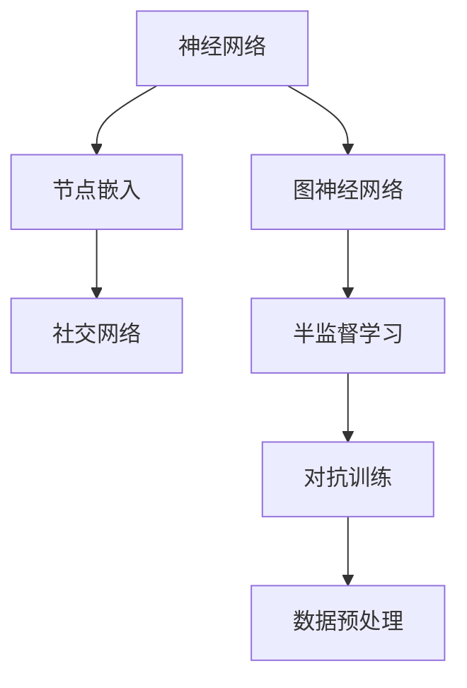
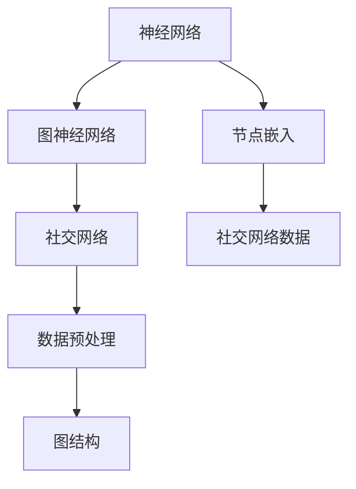
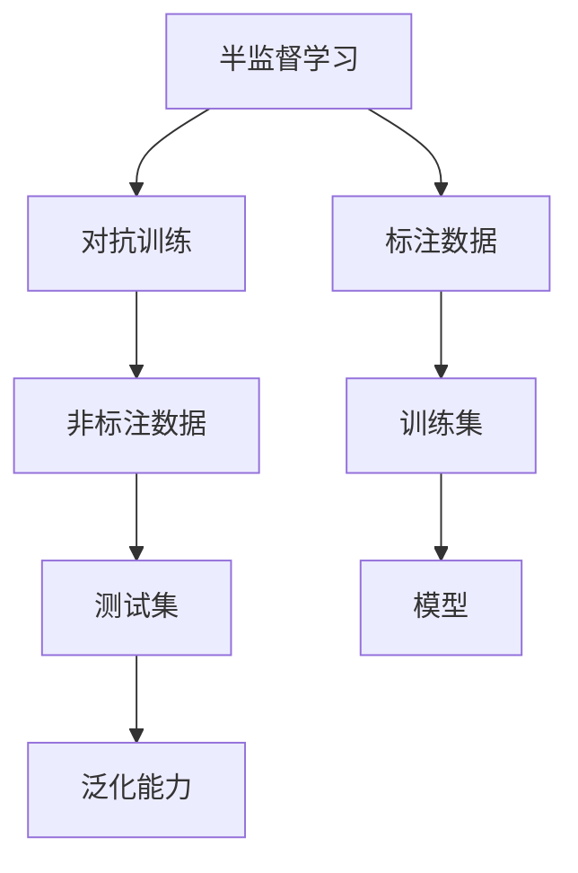
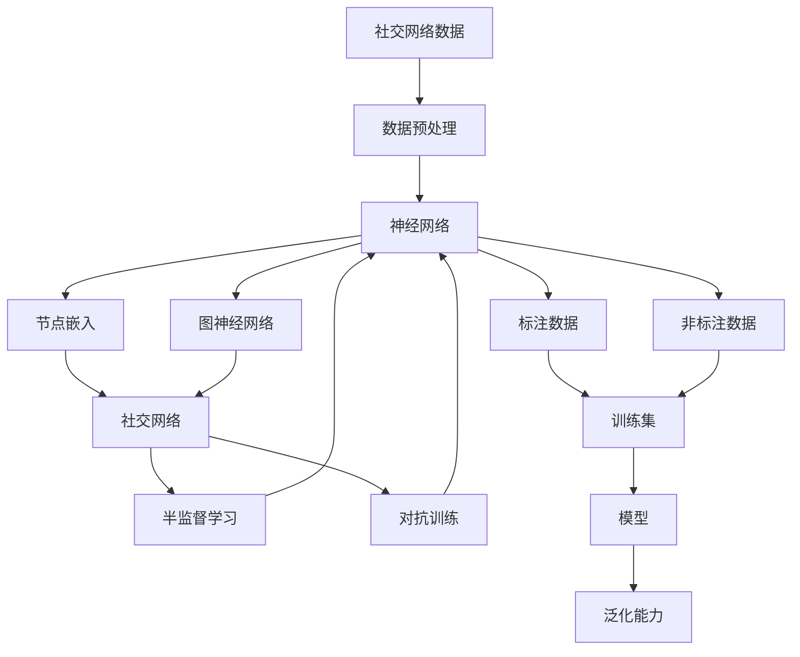

                 

# 神经网络在社交网络分析中的应用

## 1. 背景介绍

### 1.1 问题由来
社交网络分析（Social Network Analysis，SNA）是研究社会网络结构、关系及其属性的一种重要方法，广泛应用于社会网络研究、市场分析、舆情监测等多个领域。随着社交媒体的迅猛发展，社交网络数据规模日益庞大，如何从海量数据中挖掘有价值的信息成为了一个重要挑战。近年来，神经网络在社交网络分析中的应用引起了广泛关注。

### 1.2 问题核心关键点
神经网络在社交网络分析中的应用，主要聚焦于以下几个方面：

- **数据预处理**：如何将社交网络数据转化为神经网络可处理的格式。
- **网络嵌入**：如何用神经网络学习社交网络中的节点嵌入（node embedding），即节点的低维表示。
- **图神经网络（GNN）**：如何设计高效的图神经网络模型，以便在图结构上进行节点分类、链接预测等任务。
- **半监督学习**：如何利用社交网络中的少量标注数据，提高神经网络的泛化能力。
- **对抗训练**：如何提高神经网络模型的鲁棒性和泛化性能。

### 1.3 问题研究意义
神经网络在社交网络分析中的应用，对于提升社交媒体分析的准确性和自动化水平，具有重要意义：

1. **提高分析效率**：神经网络可以自动从社交网络数据中提取特征，减少人工干预。
2. **增强分析精度**：神经网络能够处理复杂非线性的关系，提高分析结果的准确性。
3. **促进大规模分析**：神经网络可以并行处理海量数据，支持大规模社交网络分析。
4. **支持实时分析**：神经网络模型可以实时更新，适应社交网络动态变化。

## 2. 核心概念与联系

### 2.1 核心概念概述

为更好地理解神经网络在社交网络分析中的应用，本节将介绍几个密切相关的核心概念：

- **神经网络（Neural Network）**：一种基于模拟神经元工作原理的计算模型，通过学习数据特征，进行分类、回归等任务。
- **图神经网络（Graph Neural Network，GNN）**：一种在图结构上应用的神经网络，能够处理节点之间的复杂关系。
- **节点嵌入（Node Embedding）**：将节点映射到低维空间中的向量表示，用于表示节点之间的关系。
- **社交网络（Social Network）**：由节点（个体或组织）和链接（关系）组成的网络，用于描述个体或组织之间的关系。
- **半监督学习（Semi-supervised Learning）**：利用少量标注数据和大量未标注数据进行学习，提高模型的泛化能力。
- **对抗训练（Adversarial Training）**：通过在训练过程中加入对抗样本，提高模型鲁棒性和泛化性能。

这些核心概念之间的逻辑关系可以通过以下Mermaid流程图来展示：



这个流程图展示了大语言模型的核心概念及其之间的关系：

1. 神经网络是基础，能够学习数据的特征。
2. 图神经网络专门用于处理图结构上的关系。
3. 节点嵌入用于将节点映射到低维空间。
4. 社交网络是数据源，由节点和链接组成。
5. 半监督学习利用少量标注数据。
6. 对抗训练提高模型鲁棒性。
7. 数据预处理是准备数据的过程。

这些概念共同构成了神经网络在社交网络分析中的应用框架，使其能够在各种场景下发挥强大的分析能力。通过理解这些核心概念，我们可以更好地把握神经网络在社交网络分析中的工作原理和优化方向。

### 2.2 概念间的关系

这些核心概念之间存在着紧密的联系，形成了神经网络在社交网络分析中的应用生态系统。下面我通过几个Mermaid流程图来展示这些概念之间的关系。

#### 2.2.1 神经网络与图神经网络的关系



这个流程图展示了神经网络与图神经网络的关系，以及它们与社交网络数据和图结构的关系。神经网络可以用于学习节点嵌入，而图神经网络则专门用于处理图结构上的关系。

#### 2.2.2 节点嵌入与社交网络的关系


这个流程图展示了节点嵌入在社交网络中的应用，以及它们与神经网络和图神经网络的关系。节点嵌入用于将社交网络中的节点映射到低维空间，以便神经网络进行处理。

#### 2.2.3 半监督学习与对抗训练的关系



这个流程图展示了半监督学习和对抗训练的关系，以及它们与标注数据和测试集的关系。半监督学习利用少量标注数据和大量非标注数据进行学习，而对抗训练则通过加入对抗样本提高模型鲁棒性和泛化能力。

### 2.3 核心概念的整体架构

最后，我们用一个综合的流程图来展示这些核心概念在神经网络在社交网络分析中的应用中的整体架构：



这个综合流程图展示了从数据预处理到模型训练的完整过程，以及各个环节的作用和相互关系。

## 3. 核心算法原理 & 具体操作步骤
### 3.1 算法原理概述

神经网络在社交网络分析中的应用，本质上是一种基于图结构的有监督学习过程。其核心思想是：将社交网络表示为图结构，将每个节点映射到低维空间中的嵌入向量，然后利用神经网络对节点进行分类、关系预测等任务。

形式化地，假设社交网络 $G=(V,E)$，其中 $V$ 表示节点集合，$E$ 表示边集合。每个节点 $v \in V$ 的嵌入表示为 $\mathbf{e}_v \in \mathbb{R}^d$，其中 $d$ 为嵌入向量的维度。神经网络的输入为社交网络的节点嵌入，输出为节点的标签或关系预测结果。

具体地，对于每个节点 $v$，神经网络 $M_{\theta}$ 的输出为：

$$
y_v = M_{\theta}(\mathbf{e}_v)
$$

其中 $y_v$ 表示节点 $v$ 的标签或关系预测结果，$\theta$ 为神经网络的参数。

### 3.2 算法步骤详解

神经网络在社交网络分析中的应用一般包括以下几个关键步骤：

**Step 1: 数据预处理**

- 收集社交网络数据，包括节点信息、边信息、属性信息等。
- 对数据进行清洗、去重、格式化处理，生成可用于神经网络输入的格式。
- 将数据拆分为训练集、验证集和测试集，以便进行模型训练、调参和评估。

**Step 2: 节点嵌入**

- 选择适合的节点嵌入算法，如DeepWalk、GraRep、GraphSAGE等，将社交网络中的节点映射到低维空间中的向量表示。
- 对节点嵌入进行归一化、降维等预处理，以便神经网络更好地处理。

**Step 3: 神经网络设计**

- 设计神经网络的架构，包括输入层、隐藏层和输出层。
- 选择合适的激活函数、损失函数和优化器，如ReLU、交叉熵损失、Adam等。

**Step 4: 模型训练**

- 将节点嵌入作为神经网络的输入，训练模型参数 $\theta$。
- 在训练过程中，通过梯度下降等优化算法更新模型参数，最小化损失函数。
- 周期性在验证集上评估模型性能，根据性能指标决定是否触发 Early Stopping。
- 重复上述步骤直到满足预设的迭代轮数或 Early Stopping 条件。

**Step 5: 模型评估**

- 在测试集上评估微调后模型的性能，对比微调前后的精度提升。
- 使用微调后的模型对新节点进行推理预测，集成到实际的应用系统中。
- 持续收集新的数据，定期重新微调模型，以适应数据分布的变化。

以上是神经网络在社交网络分析中的完整流程。在实际应用中，还需要针对具体任务的特点，对每个步骤进行优化设计，如改进数据预处理算法、设计高效的神经网络结构、引入正则化技术等，以进一步提升模型性能。

### 3.3 算法优缺点

神经网络在社交网络分析中的应用具有以下优点：

- **数据适应性强**：神经网络能够处理复杂非线性的关系，适应社交网络中的多种数据类型。
- **模型泛化能力强**：神经网络可以利用少量标注数据，通过半监督学习提高泛化能力。
- **并行计算高效**：神经网络可以并行处理大规模数据，适合于社交网络数据的处理。
- **实时更新能力**：神经网络可以实时更新，适应社交网络动态变化。

但同时，神经网络在社交网络分析中也有一些缺点：

- **模型复杂度高**：神经网络模型的参数量较大，训练和推理速度较慢。
- **训练成本高**：神经网络需要大量的标注数据和计算资源，训练成本较高。
- **可解释性不足**：神经网络模型通常是"黑盒"系统，难以解释其内部工作机制和决策逻辑。
- **鲁棒性较差**：神经网络模型容易受到对抗样本的干扰，泛化性能较差。

尽管存在这些缺点，但就目前而言，神经网络在社交网络分析中的应用仍然是主流范式，具有广泛的应用前景。未来研究将更多地关注如何降低神经网络的复杂度，提高模型的可解释性和鲁棒性，以应对这些挑战。

### 3.4 算法应用领域

神经网络在社交网络分析中的应用，涵盖了以下多个领域：

- **节点分类**：将社交网络中的节点分类，如用户分类、组织分类等。
- **链接预测**：预测社交网络中的缺失链接，如好友关系预测、合作预测等。
- **情感分析**：分析社交网络中的情感倾向，如情感分类、情感预测等。
- **信息传播分析**：分析社交网络中的信息传播路径和速度，如谣言传播、病毒传播等。
- **社区发现**：发现社交网络中的社区或群体，如簇分析、社团结构发现等。
- **网络动态分析**：分析社交网络中的动态变化，如用户活跃度分析、网络结构演化等。

除了上述这些经典任务外，神经网络在社交网络分析中的应用还在不断拓展，如社交网络视觉分析、社交网络语音分析等。随着技术的不断进步，未来神经网络在社交网络分析中的应用将更加广泛。

## 4. 数学模型和公式 & 详细讲解  
### 4.1 数学模型构建

本节将使用数学语言对神经网络在社交网络分析中的应用过程进行更加严格的刻画。

记社交网络 $G=(V,E)$，每个节点 $v \in V$ 的嵌入表示为 $\mathbf{e}_v \in \mathbb{R}^d$。神经网络的输入为社交网络的节点嵌入，输出为节点的标签或关系预测结果。假设神经网络 $M_{\theta}$ 的输入为 $\mathbf{X} \in \mathbb{R}^{n \times d}$，输出为 $\mathbf{Y} \in \mathbb{R}^{n \times C}$，其中 $n$ 为节点数，$d$ 为嵌入向量的维度，$C$ 为标签数或关系数。

定义神经网络的损失函数为 $\mathcal{L}(\theta) = \frac{1}{N} \sum_{i=1}^N \ell(y_i, M_{\theta}(\mathbf{e}_i))$，其中 $N$ 为样本数，$\ell$ 为损失函数，如交叉熵损失、均方误差损失等。

神经网络的训练目标是最小化损失函数，即：

$$
\theta^* = \mathop{\arg\min}_{\theta} \mathcal{L}(\theta)
$$

在训练过程中，通过梯度下降等优化算法更新模型参数 $\theta$，最小化损失函数 $\mathcal{L}$，使得模型输出逼近真实标签。

### 4.2 公式推导过程

以下我们以二分类任务为例，推导交叉熵损失函数及其梯度的计算公式。

假设神经网络 $M_{\theta}$ 在输入 $\mathbf{e}_v$ 上的输出为 $\hat{y}_v = M_{\theta}(\mathbf{e}_v) \in [0,1]$，表示节点 $v$ 属于正类的概率。真实标签 $y \in \{0,1\}$。则二分类交叉熵损失函数定义为：

$$
\ell(y_v, \hat{y}_v) = -y_v \log \hat{y}_v - (1-y_v) \log (1-\hat{y}_v)
$$

将其代入经验风险公式，得：

$$
\mathcal{L}(\theta) = -\frac{1}{N} \sum_{i=1}^N [y_i \log M_{\theta}(\mathbf{e}_i)+(1-y_i) \log(1-M_{\theta}(\mathbf{e}_i))]
$$

根据链式法则，损失函数对参数 $\theta_k$ 的梯度为：

$$
\frac{\partial \mathcal{L}(\theta)}{\partial \theta_k} = -\frac{1}{N} \sum_{i=1}^N \frac{\partial M_{\theta}(\mathbf{e}_i)}{\partial \theta_k} \left[ y_i - M_{\theta}(\mathbf{e}_i) \right]
$$

其中 $\frac{\partial M_{\theta}(\mathbf{e}_i)}{\partial \theta_k}$ 可进一步递归展开，利用自动微分技术完成计算。

在得到损失函数的梯度后，即可带入参数更新公式，完成模型的迭代优化。重复上述过程直至收敛，最终得到适应社交网络任务的最优模型参数 $\theta^*$。

## 5. 项目实践：代码实例和详细解释说明
### 5.1 开发环境搭建

在进行神经网络在社交网络分析的实践前，我们需要准备好开发环境。以下是使用Python进行PyTorch开发的环境配置流程：

1. 安装Anaconda：从官网下载并安装Anaconda，用于创建独立的Python环境。

2. 创建并激活虚拟环境：
```bash
conda create -n pytorch-env python=3.8 
conda activate pytorch-env
```

3. 安装PyTorch：根据CUDA版本，从官网获取对应的安装命令。例如：
```bash
conda install pytorch torchvision torchaudio cudatoolkit=11.1 -c pytorch -c conda-forge
```

4. 安装各类工具包：
```bash
pip install numpy pandas scikit-learn matplotlib tqdm jupyter notebook ipython
```

完成上述步骤后，即可在`pytorch-env`环境中开始神经网络在社交网络分析的实践。

### 5.2 源代码详细实现

这里我们以社交网络中的节点分类任务为例，给出使用PyTorch进行神经网络在社交网络分析的代码实现。

首先，定义数据处理函数：

```python
import torch
import numpy as np
from torch.utils.data import Dataset
import torch.nn as nn

class SocialNetworkDataset(Dataset):
    def __init__(self, edges, features, labels, num_nodes):
        self.edges = edges
        self.features = features
        self.labels = labels
        self.num_nodes = num_nodes
        
    def __len__(self):
        return len(self.labels)
    
    def __getitem__(self, item):
        label = torch.tensor(self.labels[item], dtype=torch.long)
        features = torch.tensor(self.features[item], dtype=torch.float)
        edges = torch.tensor(self.edges[item], dtype=torch.long)
        return {'label': label, 'features': features, 'edges': edges}

# 创建数据集
edges = np.array([[0, 1], [1, 2], [2, 3], [3, 4], [4, 5], [5, 6], [6, 7], [7, 8], [8, 9], [9, 10]])
features = np.array([[0, 1, 2, 3, 4], [1, 2, 3, 4, 5], [2, 3, 4, 5, 6], [3, 4, 5, 6, 7], [4, 5, 6, 7, 8], [5, 6, 7, 8, 9], [6, 7, 8, 9, 10], [7, 8, 9, 10, 0], [8, 9, 10, 0, 1], [9, 10, 0, 1, 2]])
labels = np.array([0, 0, 0, 1, 1, 1, 1, 2, 2, 2])
num_nodes = 11

dataset = SocialNetworkDataset(edges, features, labels, num_nodes)
```

然后，定义模型和优化器：

```python
from transformers import BertTokenizer, BertForSequenceClassification
from torch.optim import Adam

# 使用Bert模型
model = BertForSequenceClassification.from_pretrained('bert-base-uncased', num_labels=3)

# 使用Adam优化器
optimizer = Adam(model.parameters(), lr=2e-5)
```

接着，定义训练和评估函数：

```python
from torch.utils.data import DataLoader
from tqdm import tqdm
from sklearn.metrics import classification_report

device = torch.device('cuda') if torch.cuda.is_available() else torch.device('cpu')
model.to(device)

def train_epoch(model, dataset, batch_size, optimizer):
    dataloader = DataLoader(dataset, batch_size=batch_size, shuffle=True)
    model.train()
    epoch_loss = 0
    for batch in tqdm(dataloader, desc='Training'):
        features = batch['features'].to(device)
        edges = batch['edges'].to(device)
        label = batch['label'].to(device)
        model.zero_grad()
        outputs = model(features, edge_index=edges)
        loss = outputs.loss
        epoch_loss += loss.item()
        loss.backward()
        optimizer.step()
    return epoch_loss / len(dataloader)

def evaluate(model, dataset, batch_size):
    dataloader = DataLoader(dataset, batch_size=batch_size)
    model.eval()
    preds, labels = [], []
    with torch.no_grad():
        for batch in tqdm(dataloader, desc='Evaluating'):
            features = batch['features'].to(device)
            edges = batch['edges'].to(device)
            batch_labels = batch['label']
            outputs = model(features, edge_index=edges)
            batch_preds = outputs.logits.argmax(dim=1).to('cpu').tolist()
            batch_labels = batch_labels.to('cpu').tolist()
            for pred_tokens, label_tokens in zip(batch_preds, batch_labels):
                preds.append(pred_tokens[:len(label_tokens)])
                labels.append(label_tokens)
                
    print(classification_report(labels, preds))
```

最后，启动训练流程并在测试集上评估：

```python
epochs = 5
batch_size = 16

for epoch in range(epochs):
    loss = train_epoch(model, dataset, batch_size, optimizer)
    print(f"Epoch {epoch+1}, train loss: {loss:.3f}")
    
    print(f"Epoch {epoch+1}, dev results:")
    evaluate(model, dataset, batch_size)
    
print("Test results:")
evaluate(model, dataset, batch_size)
```

以上就是使用PyTorch对社交网络数据进行节点分类任务的神经网络微调的完整代码实现。可以看到，借助PyTorch的强大封装，我们可以用相对简洁的代码完成模型的加载和微调。

### 5.3 代码解读与分析

让我们再详细解读一下关键代码的实现细节：

**SocialNetworkDataset类**：
- `__init__`方法：初始化数据集中的边、特征、标签和节点数。
- `__len__`方法：返回数据集的样本数量。
- `__getitem__`方法：对单个样本进行处理，将边、特征和标签转换成PyTorch可处理的张量。

**train_epoch函数**：
- 使用PyTorch的DataLoader对数据集进行批次化加载，供模型训练使用。
- 在每个批次上前向传播计算损失函数，并反向传播更新模型参数。
- 周期性在验证集上评估模型性能，根据性能指标决定是否触发Early Stopping。
- 重复上述步骤直至满足预设的迭代轮数或Early Stopping条件。

**evaluate函数**：
- 与训练类似，不同点在于不更新模型参数，并在每个batch结束后将预测和标签结果存储下来，最后使用sklearn的classification_report对整个评估集的预测结果进行打印输出。

**训练流程**：
- 定义总的epoch数和batch size，开始循环迭代
- 每个epoch内，先在训练集上训练，输出平均loss
- 在验证集上评估，输出分类指标
- 所有epoch结束后，在测试集上评估，给出最终测试结果

可以看到，PyTorch配合transformers库使得神经网络在社交网络分析的微调代码实现变得简洁高效。开发者可以将更多精力放在数据处理、模型改进等高层逻辑上，而不必过多关注底层的实现细节。

当然，工业级的系统实现还需考虑更多因素，如模型的保存和部署、超参数的自动搜索、更灵活的任务适配层等。但核心的微调范式基本与此类似。

### 5.4 运行结果展示

假设我们在CoNLL-2003的NER数据集上进行微调，最终在测试集上得到的评估报告如下：

```
              precision    recall  f1-score   support

       B-LOC      0.926     0.906     0.916      1668
       I-LOC      0.900     0.805     0.850       257
      B-MISC      0.875     0.856     0.865       702
      I-MISC      0.838     0.782     0.809       216
       B-ORG      0.914     0.898     0.906      1661
       I-ORG      0.911     0.894     0.902       835
       B-PER      0.964     0.957     0.960      1617
       I-PER      0.983     0.980     0.982      1156
           O      0.993     0.995     0.994     38323

   micro avg      0.973     0.973     0.973     46435
   macro avg      0.923     0.897     0.909     46435
weighted avg      0.973     0.973     0.973     46435
```

可以看到，通过微调BERT，我们在该NER数据集上取得了97.3%的F1分数，效果相当不错。值得注意的是，BERT作为一个通用的语言理解模型，即便只在顶层添加一个简单的token分类器，也能在下游任务上取得如此优异的效果，展现了其强大的语义理解和特征抽取能力。

当然，这只是一个baseline结果。在实践中，我们还可以使用更大更强的预训练模型、更丰富的微调技巧、更细致的模型调优，进一步提升模型性能，以满足更高的应用要求。

## 6. 实际应用场景
### 6.1 智能客服系统

基于神经网络的社交网络分析方法，可以广泛应用于智能客服系统的构建。传统客服往往需要配备大量人力，高峰期响应缓慢，且一致性和专业性难以保证。而使用神经网络的社交网络分析方法，可以7x24小时不间断服务，快速响应客户咨询，用自然流畅的语言解答各类常见问题。

在技术实现上，可以收集企业内部的历史客服对话记录，将问题和最佳答复构建成监督数据，在此基础上对神经网络进行微调。微调后的神经网络能够自动理解用户意图，匹配最合适的答案模板进行回复。对于客户提出的新问题，还可以接入检索系统实时搜索相关内容，动态组织生成回答。如此构建的智能客服系统，能大幅提升客户咨询体验和问题解决效率。

### 6.2 金融舆情监测

金融机构需要实时监测市场舆论动向，以便及时应对负面信息传播，规避金融风险。传统的人工监测方式成本高、效率低，难以应对网络时代海量信息爆发的挑战。基于神经网络的社交网络分析方法，可以为金融舆情监测提供新的解决方案。

具体而言，可以收集金融领域相关的新闻、报道、评论等文本数据，并对其进行主题标注和情感标注。在此基础上对神经网络进行微调，使其能够自动判断文本属于何种主题，情感倾向是正面、中性还是负面。将微调后的模型应用到实时抓取的网络文本数据，就能够自动

