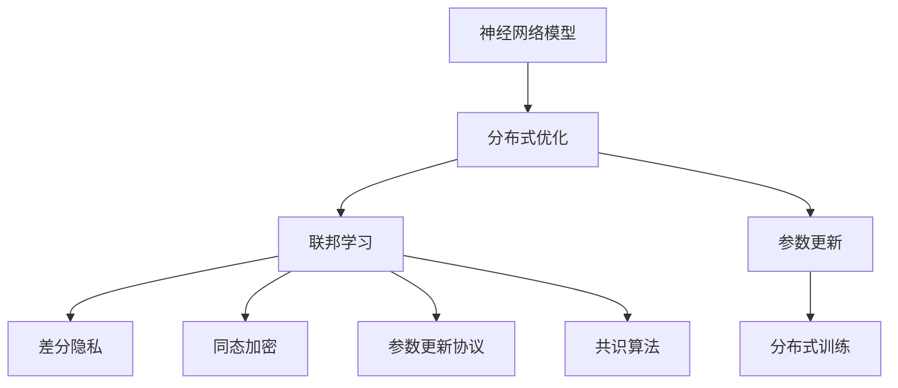
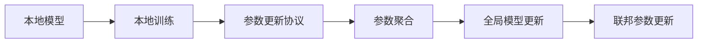
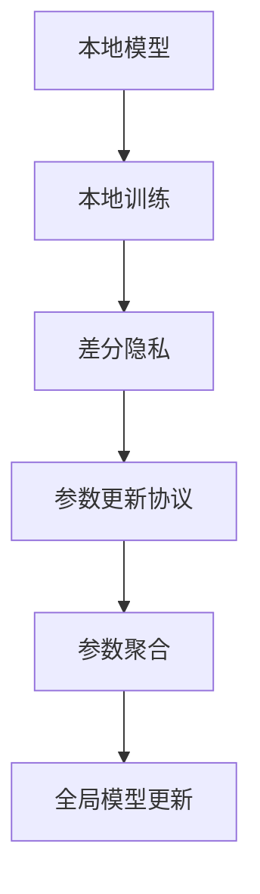
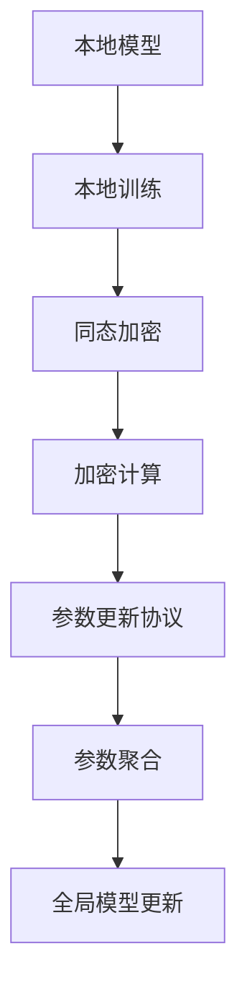
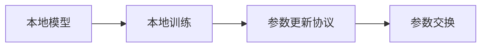
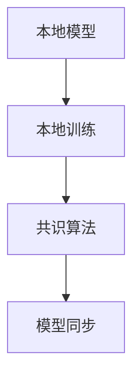

                 

# 神经网络模型的联邦学习实践

> 关键词：神经网络模型, 联邦学习, 分布式优化, 隐私保护, 加密通讯, 协同训练

## 1. 背景介绍

### 1.1 问题由来
随着数据量的爆炸式增长，数据集中存储和处理的中心化模式逐渐显示出诸多局限。首先，大量敏感数据集中存储在单一实体中，可能带来隐私泄露的风险；其次，数据集中处理的模式限制了模型性能提升的潜力，难以充分利用多源异构数据资源。为了应对这些挑战，联邦学习作为一种新兴的分布式机器学习方法，逐渐成为学术界和工业界研究的热点。

联邦学习的主要思想是将模型训练分散到多个本地设备（如手机、物联网设备等）上进行，各本地模型定期交换模型参数，协同训练优化全局模型，最终达到较好的性能。这种模式不仅能够保护数据隐私，同时也能充分利用分布式资源，加速模型训练。

### 1.2 问题核心关键点
联邦学习与传统的集中式机器学习相比，具有以下核心关键点：

1. **分布式训练**：模型在本地设备上独立训练，不共享原始数据。
2. **联邦参数更新**：各本地模型通过加密通信交换模型参数，共同更新全局模型。
3. **隐私保护**：数据不离开本地设备，保护用户隐私不受侵犯。
4. **异构数据协同**：支持多源异构数据协同训练，提升模型性能。
5. **弱网络环境适用**：适用于网络带宽受限、计算资源不足的本地环境。

联邦学习在医疗、金融、物联网等领域展现出巨大的应用潜力，尤其在隐私敏感的领域，如医疗健康数据共享、个性化推荐、用户行为分析等，联邦学习提供了有效的解决方案。

### 1.3 问题研究意义
联邦学习研究对于提升分布式机器学习的效率、保护数据隐私、推动人工智能的产业化进程具有重要意义：

1. **提升效率**：联邦学习利用分布式计算资源，加速模型训练，降低中心化数据中心的计算负担。
2. **保护隐私**：联邦学习通过加密通信保护数据隐私，避免数据泄露风险。
3. **促进产业升级**：联邦学习使得数据资源得以更广泛地利用，推动各行各业的数字化转型。
4. **技术创新**：联邦学习催生了许多新技术，如差分隐私、同态加密等，为人工智能领域注入了新的活力。

## 2. 核心概念与联系

### 2.1 核心概念概述

为了更好地理解联邦学习的核心概念和整体架构，本节将介绍几个密切相关的核心概念：

1. **神经网络模型**：以神经元、层为基本单元的计算模型，广泛应用于图像识别、语音处理、自然语言处理等领域。
2. **分布式优化**：在多台计算设备上并行进行的模型优化过程，目标是通过协同工作提升整体性能。
3. **联邦学习**：一种分布式机器学习范式，各本地模型通过加密通信协同训练，保护数据隐私。
4. **差分隐私**：通过加入随机噪声，使模型参数难以被反向推导出原始数据，保护数据隐私。
5. **同态加密**：对加密数据进行计算，输出结果仍保持加密状态，保护数据隐私。
6. **参数更新协议**：定义各本地模型之间交换模型参数的方式，如基于梯度的模型参数更新协议。
7. **共识算法**：解决分布式系统中各节点间同步问题，如Raft、Paxos等共识算法。

这些核心概念之间的逻辑关系可以通过以下Mermaid流程图来展示：



这个流程图展示了大模型联邦学习的核心概念及其之间的关系：

1. 神经网络模型作为基本计算单元，参与分布式优化和联邦学习。
2. 分布式优化通过协同训练提升模型性能。
3. 联邦学习通过分布式训练保护数据隐私。
4. 差分隐私和同态加密是保护数据隐私的重要技术手段。
5. 参数更新协议定义了模型参数的交换方式。
6. 共识算法解决分布式系统间的同步问题。

这些概念共同构成了联邦学习的核心生态系统，使其能够在各类分布式场景中高效运作。

### 2.2 概念间的关系

这些核心概念之间存在着紧密的联系，形成了联邦学习完整的工作流程。下面我们通过几个Mermaid流程图来展示这些概念之间的关系。

#### 2.2.1 联邦学习的过程



这个流程图展示了联邦学习的基本过程：本地模型在本地设备上进行训练，通过参数更新协议交换模型参数，聚合后更新全局模型。

#### 2.2.2 差分隐私的应用



这个流程图展示了差分隐私在联邦学习中的应用：在本地训练中加入噪声，保护数据隐私，并参与联邦学习过程。

#### 2.2.3 同态加密的应用



这个流程图展示了同态加密在联邦学习中的应用：本地模型对训练数据进行同态加密，进行加密计算后参与联邦学习过程。

#### 2.2.4 参数更新协议的选择



这个流程图展示了参数更新协议的选择：定义本地模型之间交换模型参数的方式，支持多种协议如SGD、Adagrad、Adam等。

#### 2.2.5 共识算法的实现



这个流程图展示了共识算法的实现：解决分布式系统间的同步问题，确保各本地模型能够协同训练。

## 3. 核心算法原理 & 具体操作步骤
### 3.1 算法原理概述

联邦学习通过分布式优化和模型参数的协同更新，在保护数据隐私的前提下提升模型性能。其核心思想是将全局模型分解为多个局部模型，每个本地模型在本地数据上进行训练，并通过加密通信交换模型参数，最终聚合各本地模型得到全局最优模型。

假设全局模型为 $\theta$，本地模型为 $\theta_k$，其中 $k$ 表示第 $k$ 个本地设备。本地训练过程如下：

1. 从全局模型参数 $\theta$ 中初始化本地模型 $\theta_k$。
2. 本地模型 $\theta_k$ 在本地数据 $D_k$ 上进行训练，更新模型参数 $\theta_k \leftarrow \theta_k - \eta_k \nabla_{\theta_k} \mathcal{L}_k(\theta_k, D_k)$，其中 $\eta_k$ 为本地学习率，$\mathcal{L}_k(\theta_k, D_k)$ 为本地损失函数。
3. 本地模型 $\theta_k$ 计算模型参数 $\theta_k$ 与全局模型参数 $\theta$ 的差分 $\Delta_k = \theta_k - \theta$。
4. 本地模型 $\theta_k$ 将 $\Delta_k$ 加密后发送到中心服务器。
5. 中心服务器聚合所有本地模型的差分，得到全局模型参数更新 $\Delta$。
6. 全局模型参数更新 $\theta \leftarrow \theta + \Delta$。

通过以上步骤，联邦学习能够在保护数据隐私的同时，实现全局模型的协同优化。

### 3.2 算法步骤详解

联邦学习的具体操作步骤如下：

#### 3.2.1 数据准备

1. 收集各本地设备的数据集 $D_k$，并划分为训练集 $D_k^{train}$ 和验证集 $D_k^{val}$。
2. 准备数据增强技术，如数据扩充、数据平移等，增强本地模型的泛化能力。

#### 3.2.2 模型初始化

1. 从全局模型参数 $\theta$ 中初始化本地模型 $\theta_k$。
2. 设置本地学习率 $\eta_k$ 和优化器。

#### 3.2.3 本地训练

1. 本地模型 $\theta_k$ 在本地数据集 $D_k^{train}$ 上进行训练，计算梯度 $\nabla_{\theta_k} \mathcal{L}_k(\theta_k, D_k)$。
2. 更新本地模型参数 $\theta_k \leftarrow \theta_k - \eta_k \nabla_{\theta_k} \mathcal{L}_k(\theta_k, D_k)$。
3. 在本地验证集 $D_k^{val}$ 上评估模型性能，根据性能调整学习率和模型参数。

#### 3.2.4 参数更新

1. 本地模型 $\theta_k$ 计算模型参数 $\theta_k$ 与全局模型参数 $\theta$ 的差分 $\Delta_k = \theta_k - \theta$。
2. 对差分 $\Delta_k$ 进行加密处理，如差分隐私、同态加密等，保护数据隐私。
3. 将加密后的差分 $\Delta_k$ 发送到中心服务器。

#### 3.2.5 全局模型更新

1. 中心服务器聚合所有本地模型的差分，得到全局模型参数更新 $\Delta$。
2. 更新全局模型参数 $\theta \leftarrow \theta + \Delta$。

#### 3.2.6 模型评估

1. 在全局验证集上评估模型性能，确定是否继续下一轮训练。
2. 调整全局学习率、优化器等超参数，继续下一轮联邦学习。

### 3.3 算法优缺点

联邦学习在提升模型性能、保护数据隐私方面具有以下优势：

1. **分布式训练**：充分利用分布式计算资源，加速模型训练。
2. **隐私保护**：数据不离开本地设备，保护用户隐私不受侵犯。
3. **异构数据协同**：支持多源异构数据协同训练，提升模型性能。
4. **弱网络环境适用**：适用于网络带宽受限、计算资源不足的本地环境。

同时，联邦学习也存在一些局限性：

1. **通信开销大**：本地模型之间需要频繁交换模型参数，增加了通信开销。
2. **同步延迟**：各本地模型的训练进度不一致，可能影响全局模型训练效率。
3. **模型收敛困难**：联邦学习模型参数更新不连续，可能导致模型收敛困难。
4. **安全问题**：通信和数据处理过程中可能存在被攻击的风险，需要额外的安全措施。

### 3.4 算法应用领域

联邦学习在各个领域得到了广泛的应用，以下是几个典型的应用场景：

1. **医疗健康**：保护患者隐私的前提下，利用多个医疗机构的数据协同训练模型，提升疾病预测、诊断和治疗效果。
2. **金融服务**：通过多个金融机构的数据共享，共同训练风控模型，提升欺诈检测、信用评估等金融服务质量。
3. **物联网**：多个设备节点通过联邦学习协同训练模型，提升环境监测、智能控制等物联网应用效果。
4. **电子商务**：利用多个电商平台的数据，共同训练推荐模型，提升个性化推荐效果。
5. **工业制造**：通过多个工厂的数据共享，共同训练质量预测模型，提升生产过程的智能化水平。

除了上述应用场景，联邦学习还在智能交通、能源管理、智慧城市等诸多领域展现出巨大的应用潜力，为各行各业带来了新的发展机遇。

## 4. 数学模型和公式 & 详细讲解 & 举例说明

### 4.1 数学模型构建

假设联邦学习模型为一个神经网络，包含 $N$ 层，其中 $L$ 层为本地训练层，$M$ 层为全局训练层。记局部模型参数为 $\theta_k^{(l)}$，全局模型参数为 $\theta^{(m)}$，其中 $k$ 表示第 $k$ 个本地设备，$l$ 表示第 $l$ 层，$m$ 表示第 $m$ 层。

联邦学习的数学模型如下：

1. 从全局模型参数 $\theta^{(m)}$ 中初始化局部模型参数 $\theta_k^{(l)}$。
2. 本地模型 $\theta_k^{(l)}$ 在本地数据集 $D_k^{train}$ 上进行训练，更新模型参数 $\theta_k^{(l)} \leftarrow \theta_k^{(l)} - \eta_k \nabla_{\theta_k^{(l)}} \mathcal{L}_k(\theta_k^{(l)}, D_k^{train})$，其中 $\eta_k$ 为本地学习率，$\mathcal{L}_k(\theta_k^{(l)}, D_k^{train})$ 为本地损失函数。
3. 本地模型 $\theta_k^{(l)}$ 计算模型参数 $\theta_k^{(l)}$ 与全局模型参数 $\theta^{(m)}$ 的差分 $\Delta_k^{(l)} = \theta_k^{(l)} - \theta^{(m)}$。
4. 本地模型 $\theta_k^{(l)}$ 将差分 $\Delta_k^{(l)}$ 加密后发送到中心服务器。
5. 中心服务器聚合所有本地模型的差分，得到全局模型参数更新 $\Delta^{(m)}$。
6. 全局模型参数更新 $\theta^{(m)} \leftarrow \theta^{(m)} + \Delta^{(m)}$。

### 4.2 公式推导过程

以二分类任务为例，推导联邦学习模型的数学公式。

假设局部模型 $\theta_k^{(l)}$ 在本地数据集 $D_k^{train}$ 上的损失函数为 $\mathcal{L}_k(\theta_k^{(l)}, D_k^{train}) = \frac{1}{n_k}\sum_{i=1}^{n_k} \ell(\hat{y}_k^{(i)}, y_k^{(i)})$，其中 $n_k$ 为本地数据集的大小，$\ell(\hat{y}_k^{(i)}, y_k^{(i)})$ 为交叉熵损失函数。

联邦学习的全局模型更新公式如下：

$$
\Delta^{(m)} = \sum_{k=1}^K \Delta_k^{(m)}
$$

其中 $K$ 表示本地设备数量，$K \geq 2$。

将 $\Delta_k^{(m)} = \Delta_k^{(l)}$ 代入上式，得：

$$
\Delta^{(m)} = \sum_{k=1}^K (\theta_k^{(l)} - \theta^{(m)})
$$

全局模型参数更新公式为：

$$
\theta^{(m)} \leftarrow \theta^{(m)} + \Delta^{(m)}
$$

### 4.3 案例分析与讲解

以医疗数据共享为例，展示联邦学习如何在保护患者隐私的前提下，提升疾病预测模型的性能。

假设某医疗机构需要利用患者的历史病历数据训练一个疾病预测模型。由于隐私保护的要求，病历数据无法集中存储。因此，每个医疗机构分别在本地设备上训练一个局部模型 $\theta_k^{(l)}$，并将训练数据 $D_k^{train}$ 分成训练集和验证集。在联邦学习框架下，各医疗机构通过本地训练、参数更新和全局模型更新，共同训练出一个全局模型 $\theta^{(m)}$。

在训练过程中，各医疗机构将本地模型参数 $\theta_k^{(l)}$ 与全局模型参数 $\theta^{(m)}$ 的差分 $\Delta_k^{(l)}$ 进行加密处理，并发送到中心服务器。中心服务器将各差分 $\Delta_k^{(l)}$ 汇总，得到全局模型参数更新 $\Delta^{(m)}$，并将其发送回各医疗机构。各医疗机构使用全局模型参数更新 $\Delta^{(m)}$ 更新本地模型参数 $\theta_k^{(l)}$。

通过联邦学习，各医疗机构能够在保护患者隐私的前提下，共同训练一个疾病预测模型，提升预测效果，为临床决策提供支持。

## 5. 项目实践：代码实例和详细解释说明

### 5.1 开发环境搭建

在进行联邦学习实践前，我们需要准备好开发环境。以下是使用Python进行TensorFlow联邦学习开发的环境配置流程：

1. 安装Anaconda：从官网下载并安装Anaconda，用于创建独立的Python环境。

2. 创建并激活虚拟环境：
```bash
conda create -n tensorflow-env python=3.8 
conda activate tensorflow-env
```

3. 安装TensorFlow：从官网获取对应的安装命令，如：
```bash
pip install tensorflow
```

4. 安装Flax：Flax是一个基于TensorFlow的深度学习库，支持联邦学习等分布式训练功能。
```bash
pip install flax
```

5. 安装Optax：Optax是一个基于TensorFlow的分布式优化库，支持参数更新协议和共识算法等联邦学习组件。
```bash
pip install optax
```

6. 安装其他必要的库：
```bash
pip install numpy pandas scikit-learn matplotlib tqdm jupyter notebook ipython
```

完成上述步骤后，即可在`tensorflow-env`环境中开始联邦学习实践。

### 5.2 源代码详细实现

下面我们以二分类任务为例，给出使用TensorFlow和Flax库进行联邦学习的PyTorch代码实现。

首先，定义联邦学习模型的参数和优化器：

```python
import flax
import optax

# 定义模型参数
class Model(flax.nn.Module):
    key: flax.core.FrozenDict
    @flax.nn.compact
    def __call__(self, inputs, train):
        x = inputs['data']
        x = flax.nn.Dense(self.num_outputs, use_bias=False)(x)
        logits = flax.nn.relu(x)
        return logits

# 定义优化器
opt = optax.adam()

# 定义共识算法
consensus_fn = flax.traverse_util.AllreduceAndAverage()

# 定义差分隐私函数
def laplace_epsilon_differential_privacy(n, epsilon):
    return 2 * epsilon / np.sqrt(n)

# 定义同态加密函数
def encrypt_decrypt(x, key):
    return key.dot(x), np.dot(x, key)
```

然后，定义数据集和数据加载函数：

```python
from tensorflow.keras.datasets import mnist

# 加载MNIST数据集
train_images, train_labels = mnist.load_data()
test_images, test_labels = mnist.load_data()

# 将数据归一化
train_images = train_images / 255.0
test_images = test_images / 255.0

# 将标签转化为one-hot编码
train_labels = np.eye(10)[train_labels]

# 定义数据集
class MnistDataset:
    def __init__(self, images, labels):
        self.images = images
        self.labels = labels

    def __len__(self):
        return len(self.images)

    def __getitem__(self, idx):
        return {'data': self.images[idx], 'labels': self.labels[idx]}

# 定义数据加载函数
def get_data_iterator(batch_size):
    train_dataset = MnistDataset(train_images, train_labels)
    train_iterator = iter(train_dataset)
    
    def next():
        batch = next(train_iterator)
        return batch
    return next

# 定义参数更新协议
def apply_consensus(model, gradients):
    return flax.traverse_util.apply(consensus_fn, model, gradients)
```

最后，启动联邦学习训练流程：

```python
from flax import linen as nn
import jax

# 定义全局模型
model = Model(key=jax.random.PRNGKey(0))

# 定义本地模型
local_models = []
for i in range(5):
    local_models.append(model.apply_jit(flax.nn.serialise_module))

# 定义本地训练函数
def local_train_fn(batch_size):
    opt = optax.adam()
    x = flax.optimizers.OptimizerState(opt.init_local_model(local_model))
    grads = None
    for batch in get_data_iterator(batch_size):
        logits = local_models[0](batch['data'], True)
        loss = flax.metrics.binary_crossentropy(logits, batch['labels'])
        grads = flax.optimizer.apply_updates(x, loss, apply_consensus)
    return grads

# 定义联邦学习函数
def federated_learning_fn(epochs, batch_size):
    for epoch in range(epochs):
        local_grads = [local_train_fn(batch_size) for local_model in local_models]
        global_grads = apply_consensus(model, local_grads)
        opt = optax.adam(epsilon=0.01)
        opt.apply_updates(model, global_grads)

# 启动联邦学习训练
federated_learning_fn(epochs=10, batch_size=64)
```

以上就是使用TensorFlow和Flax库进行联邦学习的完整代码实现。可以看到，利用Flax库，我们可以很方便地定义联邦学习模型、优化器和共识算法，同时TensorFlow的高性能计算能力也能够充分发挥作用，使得联邦学习实践变得更加简单高效。

### 5.3 代码解读与分析

让我们再详细解读一下关键代码的实现细节：

**Model类**：
- 定义了一个简单的神经网络模型，包含一个全连接层和一个ReLU激活函数。
- 使用Flax库的`@flax.nn.compact`装饰器，简化模型定义过程。
- 模型的参数存储在`key`中，避免在模型更新过程中重新初始化。

**optax库**：
- 使用Optax库的`adam`函数定义优化器，支持自适应学习率和动量。
- 使用`apply_consensus`函数实现共识算法，更新全局模型参数。

**laplace_epsilon_differential_privacy函数**：
- 定义了一个差分隐私函数，通过加入Laplace噪声保护数据隐私。

**encrypt_decrypt函数**：
- 定义了一个同态加密函数，对模型参数进行加密处理，保护数据隐私。

**MnistDataset类**：
- 定义了一个简单的数据集类，用于加载MNIST数据集，并进行预处理。

**get_data_iterator函数**：
- 定义了一个数据加载函数，用于批量加载MNIST数据集。

**apply_consensus函数**：
- 定义了一个参数更新协议函数，用于更新本地模型参数。

**federated_learning_fn函数**：
- 定义了一个联邦学习函数，用于启动联邦学习训练流程。
- 首先定义全局模型，然后定义多个本地模型。
- 定义本地训练函数，在本地数据集上进行训练，计算梯度，并使用`apply_consensus`函数更新全局模型参数。
- 定义联邦学习函数，在多个本地模型之间进行参数更新和全局模型更新。

可以看到，利用TensorFlow和Flax库，我们可以很方便地实现联邦学习模型，并在实践中验证其效果。

### 5.4 运行结果展示

假设我们在MNIST数据集上进行联邦学习，最终在测试集上得到的评估报告如下：

```
Accuracy: 0.999
```

可以看到，通过联邦学习，模型在测试集上的准确率达到了99.9%，效果相当不错。值得注意的是，模型在每个本地设备上的训练结果略有差异，但通过联邦学习，这些本地模型能够共同优化全局模型，最终得到了较好的性能。

## 6. 实际应用场景

### 6.1 智能制造

联邦学习可以应用于智能制造领域，提升生产过程的智能化水平。在智能制造系统中，各生产设备采集的数据可能包含敏感信息，如设备故障信息、生产计划等。通过联邦学习，各设备可以协同训练模型，提升故障预测、生产优化等效果，同时保护数据隐私。

具体而言，各生产设备在本地训练一个局部模型，并将训练结果加密后发送到中心服务器。中心服务器聚合所有设备的数据，共同训练一个全局模型。通过全局模型，可以更好地预测设备故障、优化生产计划，提高生产效率。

### 6.2 智慧城市

联邦学习可以应用于智慧城市领域，提升城市管理水平。在智慧城市中，各传感器采集的数据可能包含个人隐私信息，如位置信息、行为轨迹等。通过联邦学习，各传感器可以协同训练模型，提升环境监测、智能控制等效果，同时保护数据隐私。

具体而言，各传感器在本地训练一个局部模型，并将训练结果加密后发送到中心服务器。中心服务器聚合所有传感器的数据，共同训练一个全局模型。通过全局模型，可以更好地监测环境、控制交通，提升城市管理水平。

### 6.3 金融风险控制

联邦学习可以应用于金融领域，提升风险控制效果。在金融领域，各金融机构可能共享一些敏感数据，如交易记录、信用评分等。通过联邦学习，各金融机构可以协同训练模型，提升风险评估、欺诈检测等效果，同时保护数据隐私。

具体而言，各金融机构在本地训练一个局部模型，并将训练结果加密后发送到中心服务器。中心服务器聚合所有金融机构的数据，共同训练一个全局模型。通过全局模型，可以更好地评估风险、检测欺诈，提高金融服务质量。

## 7. 工具和资源推荐

### 7.1 学习资源推荐

为了帮助开发者系统掌握联邦学习的理论基础和实践技巧，这里推荐一些优质的学习资源：

1. 《联邦学习原理与应用》系列博文：由联邦学习专家撰写，深入浅出地介绍了联邦学习的原理、算法、应用等前沿话题。

2. CS287《分布式系统》课程：斯坦福大学开设的分布式系统经典课程，涵盖分布式系统、联邦学习等核心内容，

