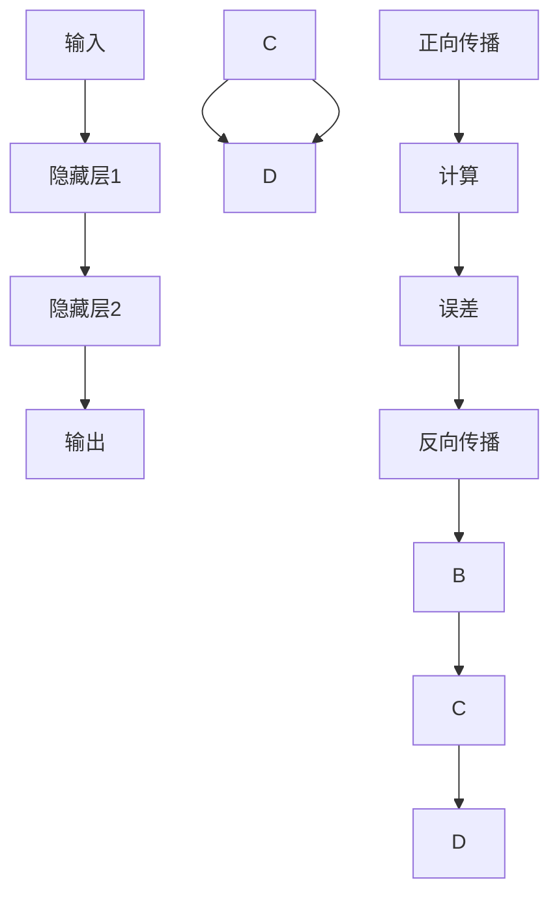
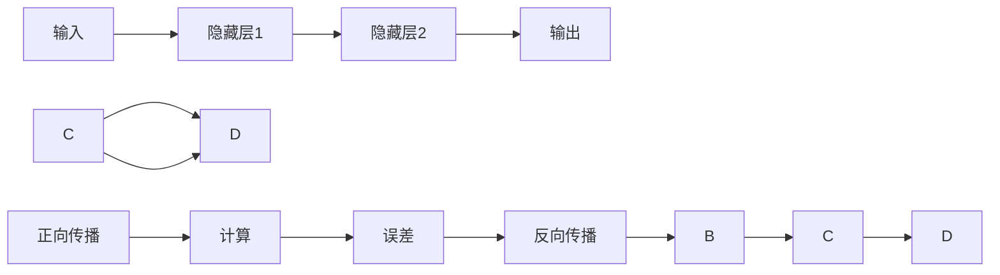

                 

# 神经网络：人工智能的基石

## 1. 背景介绍

人工智能(AI)作为21世纪最重要的技术之一，已经深入到我们生活的方方面面。从智能音箱、推荐系统、自动驾驶，到医疗诊断、金融预测、天气预报，人工智能技术在各个领域展现出了其强大的能力。然而，这背后最核心的驱动力之一，便是神经网络(Neural Network)。

神经网络是模仿人脑神经元处理信息的机制，通过学习大量数据，从而自动提取特征、识别模式、进行预测。自上世纪80年代以来，神经网络经历了从简单到复杂、从学术研究到产业应用的发展历程，已经成为人工智能领域不可或缺的关键技术。

本文将详细探讨神经网络的基本原理、核心算法、典型模型以及实际应用，带你全面了解神经网络这一人工智能的基石，洞察其背后的奥秘和价值。

## 2. 核心概念与联系

### 2.1 核心概念概述

神经网络是一个由多个神经元层级组成的计算模型，每一层由多个神经元组成。神经元接收输入信号，通过加权和激活函数进行计算，输出一个值。神经网络的每一层都可以看作是一个线性变换，再叠加一个非线性函数。通过对多层的组合，神经网络可以学习到复杂的非线性关系。

以下是神经网络的基本组成部分及其功能：

- **输入层**：接收原始数据，如图像像素、音频采样、文本单词等。
- **隐藏层**：经过加权和激活函数，提取输入数据的高级特征。
- **输出层**：根据任务需求，输出预测结果，如分类标签、回归值等。

神经网络的核心在于其连接权重和激活函数的选择。连接权重控制着信息流的流动，而激活函数则决定着非线性变换的形式。不同的权重和激活函数，可以组合成不同类型和功能的神经网络。

### 2.2 核心概念之间的联系

神经网络的多个层级之间存在着复杂的交互，每一层的输出都会作为下一层的输入，通过多次迭代和反向传播，神经网络逐渐学习到数据的高级表示。这种层次化的结构使得神经网络能够处理高维、非线性的数据，具有强大的泛化能力和学习效率。

以下是一个简单的神经网络结构示意图，展示了其各层之间的联系：


### 2.3 核心概念的整体架构

神经网络的整体架构可以视为一个计算图，每个神经元都是一个计算节点，连接权重表示边。在训练过程中，通过正向传播计算各层神经元的输出，再通过反向传播更新连接权重，优化模型参数。以下是一个完整的神经网络架构示意图：



## 3. 核心算法原理 & 具体操作步骤

### 3.1 算法原理概述

神经网络的训练过程通过正向传播和反向传播完成。正向传播用于计算网络输出，反向传播用于更新连接权重，优化模型参数。训练过程的目标是最小化预测误差，使得模型能够更好地适应数据分布。

以下是一个基本的神经网络训练流程图：



### 3.2 算法步骤详解

神经网络的训练步骤包括以下几个关键步骤：

**Step 1: 准备数据集**

- 准备训练集、验证集和测试集，对数据进行预处理，如标准化、归一化、截断等。
- 将数据集划分为小批次进行训练，每个批次包含多个样本。

**Step 2: 初始化模型参数**

- 随机初始化连接权重，可以是均匀分布或正态分布。
- 设置优化算法及其参数，如SGD、Adam、RMSprop等，以及学习率、批大小、迭代轮数等超参数。

**Step 3: 正向传播**

- 将训练集数据分批次输入模型，每个批次的数据传入网络，前向传播计算每层神经元的输出。
- 计算预测结果与真实标签之间的误差，如均方误差、交叉熵等。

**Step 4: 反向传播**

- 通过误差反向传播计算每层神经元对误差的贡献，即梯度。
- 根据梯度更新连接权重，优化模型参数。

**Step 5: 重复训练**

- 重复上述步骤，直至模型收敛或达到预设的迭代轮数。

**Step 6: 测试模型**

- 在测试集上评估模型性能，如准确率、召回率、F1分数等指标。

### 3.3 算法优缺点

神经网络的训练和应用具有以下优点：

- 强大的泛化能力：通过多层非线性变换，能够学习到复杂的模式和规律。
- 自动特征提取：不需要手动设计特征，自动从数据中提取重要特征。
- 高灵活性：适用于各种类型的数据，如图像、音频、文本等。

同时，神经网络也存在一些缺点：

- 计算复杂度高：需要大量的计算资源和时间。
- 训练数据需求高：需要大量标注数据，否则容易出现过拟合。
- 模型难以解释：神经网络的决策过程往往是黑箱，难以解释和调试。
- 参数调节复杂：需要人工调整学习率、批大小、迭代轮数等超参数。

### 3.4 算法应用领域

神经网络在各个领域都展现出了强大的应用能力，以下是一些典型应用：

- **计算机视觉**：如图像分类、目标检测、人脸识别等任务。
- **自然语言处理**：如文本分类、机器翻译、情感分析等任务。
- **语音识别**：如语音识别、语音合成、声音分类等任务。
- **推荐系统**：如协同过滤、内容推荐、广告推荐等任务。
- **游戏AI**：如自动驾驶、机器人控制等任务。
- **医学影像**：如医学图像识别、疾病预测等任务。
- **金融预测**：如股票预测、风险评估等任务。

## 4. 数学模型和公式 & 详细讲解 & 举例说明

### 4.1 数学模型构建

神经网络的数学模型可以通过神经元的形式表示。以一个简单的单层神经网络为例，其模型可以表示为：

$$
\hat{y} = W^T\sigma(z)
$$

其中：
- $W$ 为连接权重矩阵，$z$ 为输入向量。
- $\sigma$ 为激活函数，通常使用Sigmoid、ReLU等。
- $\hat{y}$ 为预测结果。

神经网络的目标是最小化预测误差，可以使用均方误差、交叉熵等损失函数。以下是一个简单的均方误差损失函数：

$$
L = \frac{1}{n}\sum_{i=1}^n (\hat{y}_i - y_i)^2
$$

其中，$n$ 为样本数，$y_i$ 为真实标签。

### 4.2 公式推导过程

以一个简单的三层神经网络为例，推导其正向传播和反向传播的过程。假设输入为 $x$，输出为 $y$，隐藏层为 $h$，激活函数为 $\sigma$。则正向传播过程可以表示为：

$$
h = \sigma(W_2h_1 + b_2)
$$

$$
y = \sigma(W_3h_2 + b_3)
$$

其中，$h_1$ 和 $h_2$ 分别为隐藏层1和隐藏层2的输出，$b_2$ 和 $b_3$ 分别为隐藏层1和隐藏层2的偏置项。

假设使用均方误差损失函数，则误差 $L$ 可以表示为：

$$
L = \frac{1}{n}\sum_{i=1}^n (y_i - \hat{y}_i)^2
$$

其中，$n$ 为样本数，$y_i$ 为真实标签，$\hat{y}_i$ 为预测结果。

反向传播过程需要先计算误差的梯度，再根据梯度更新权重。设误差的梯度为 $\delta$，则反向传播过程可以表示为：

$$
\delta = \frac{\partial L}{\partial y}
$$

$$
\delta_h = \frac{\partial L}{\partial h}
$$

$$
\delta_{h_1} = \frac{\partial L}{\partial h_1}
$$

$$
\delta_{h_2} = \frac{\partial L}{\partial h_2}
$$

其中，$\delta$ 表示输出层的误差梯度，$\delta_h$ 表示隐藏层的误差梯度。

根据链式法则，有：

$$
\delta = -2\frac{\partial L}{\partial y}
$$

$$
\delta_h = \delta \frac{\partial y}{\partial h}
$$

$$
\delta_{h_1} = \delta_h \frac{\partial h_1}{\partial h_2}
$$

$$
\delta_{h_2} = \delta_h \frac{\partial h_2}{\partial h_1}
$$

将误差梯度代入权重更新公式，有：

$$
W_3 \leftarrow W_3 - \eta \frac{\partial L}{\partial W_3}
$$

$$
b_3 \leftarrow b_3 - \eta \frac{\partial L}{\partial b_3}
$$

$$
W_2 \leftarrow W_2 - \eta \frac{\partial L}{\partial W_2}
$$

$$
b_2 \leftarrow b_2 - \eta \frac{\partial L}{\partial b_2}
$$

其中，$\eta$ 为学习率。

### 4.3 案例分析与讲解

以图像分类为例，假设使用LeNet-5模型，训练MNIST数据集。具体实现步骤如下：

1. 准备数据集：将MNIST数据集划分为训练集、验证集和测试集，对数据进行标准化处理。
2. 初始化模型：随机初始化LeNet-5模型参数，设置优化算法及超参数。
3. 正向传播：将训练集数据分批次输入模型，前向传播计算输出。
4. 计算误差：计算预测结果与真实标签之间的均方误差。
5. 反向传播：通过误差反向传播计算各层误差梯度，更新模型参数。
6. 重复训练：重复上述步骤，直至模型收敛或达到预设的迭代轮数。
7. 测试模型：在测试集上评估模型性能，如准确率等指标。

## 5. 项目实践：代码实例和详细解释说明

### 5.1 开发环境搭建

神经网络的实现通常使用深度学习框架，如TensorFlow、PyTorch等。以下是在PyTorch中进行神经网络训练的开发环境搭建流程：

1. 安装Anaconda：从官网下载并安装Anaconda，用于创建独立的Python环境。
2. 创建并激活虚拟环境：
```bash
conda create -n pytorch-env python=3.8 
conda activate pytorch-env
```

3. 安装PyTorch：根据CUDA版本，从官网获取对应的安装命令。例如：
```bash
conda install pytorch torchvision torchaudio cudatoolkit=11.1 -c pytorch -c conda-forge
```

4. 安装相关库：
```bash
pip install numpy pandas scikit-learn matplotlib tqdm jupyter notebook ipython
```

完成上述步骤后，即可在`pytorch-env`环境中开始神经网络训练。

### 5.2 源代码详细实现

以下是一个使用PyTorch进行图像分类任务的神经网络实现示例：

```python
import torch
import torch.nn as nn
import torch.optim as optim
import torchvision
import torchvision.transforms as transforms
from torch.utils.data import DataLoader

# 定义神经网络模型
class LeNet(nn.Module):
    def __init__(self):
        super(LeNet, self).__init__()
        self.conv1 = nn.Conv2d(1, 6, kernel_size=5)
        self.conv2 = nn.Conv2d(6, 16, kernel_size=5)
        self.fc1 = nn.Linear(16*4*4, 120)
        self.fc2 = nn.Linear(120, 84)
        self.fc3 = nn.Linear(84, 10)

    def forward(self, x):
        x = torch.relu(self.conv1(x))
        x = nn.MaxPool2d(kernel_size=2)(x)
        x = torch.relu(self.conv2(x))
        x = nn.MaxPool2d(kernel_size=2)(x)
        x = x.view(-1, 16*4*4)
        x = torch.relu(self.fc1(x))
        x = torch.relu(self.fc2(x))
        x = self.fc3(x)
        return x

# 加载MNIST数据集
transform = transforms.Compose([transforms.ToTensor(), transforms.Normalize((0.5,), (0.5,))])
trainset = torchvision.datasets.MNIST(root='./data', train=True, download=True, transform=transform)
trainloader = DataLoader(trainset, batch_size=64, shuffle=True)
testset = torchvision.datasets.MNIST(root='./data', train=False, download=True, transform=transform)
testloader = DataLoader(testset, batch_size=64, shuffle=False)

# 定义优化器和损失函数
model = LeNet()
criterion = nn.CrossEntropyLoss()
optimizer = optim.SGD(model.parameters(), lr=0.001, momentum=0.9)

# 训练模型
for epoch in range(10):
    running_loss = 0.0
    for i, data in enumerate(trainloader, 0):
        inputs, labels = data
        optimizer.zero_grad()
        outputs = model(inputs)
        loss = criterion(outputs, labels)
        loss.backward()
        optimizer.step()
        running_loss += loss.item()
        if i % 100 == 99:
            print('[%d, %5d] loss: %.3f' % (epoch + 1, i + 1, running_loss / 100))
            running_loss = 0.0

# 测试模型
correct = 0
total = 0
with torch.no_grad():
    for data in testloader:
        images, labels = data
        outputs = model(images)
        _, predicted = torch.max(outputs.data, 1)
        total += labels.size(0)
        correct += (predicted == labels).sum().item()

print('Accuracy of the network on the 10000 test images: %d %%' % (100 * correct / total))
```

### 5.3 代码解读与分析

我们逐步解析以上代码的实现细节：

**LeNet类**：
- 定义了LeNet-5神经网络的结构，包括两个卷积层、三个全连接层和两个激活函数。
- 在`forward`方法中，将输入数据通过卷积、池化、线性变换等操作，输出最终的分类结果。

**数据集加载**：
- 使用`torchvision.datasets.MNIST`加载MNIST数据集，并进行预处理。
- 使用`DataLoader`对数据集进行批次化加载，以便于神经网络训练。

**模型训练**：
- 定义优化器为SGD，学习率为0.001，动量为0.9。
- 在每个epoch中，循环遍历训练集，计算损失函数，反向传播更新模型参数。
- 使用`running_loss`变量记录每个批次的损失，每隔100个batch输出一次。
- 在测试集上评估模型性能，计算准确率。

## 6. 实际应用场景

神经网络在实际应用中已经展现出了其强大的能力，以下是一些典型应用：

### 6.1 计算机视觉

计算机视觉是神经网络最重要的应用领域之一，如图像分类、目标检测、人脸识别等任务。以图像分类为例，神经网络可以通过学习大量图片数据，学习到图片的高级特征，从而实现对不同类别的识别。

### 6.2 自然语言处理

自然语言处理(NLP)是神经网络的另一个重要应用领域。通过训练神经网络，可以实现文本分类、机器翻译、情感分析等任务。以机器翻译为例，神经网络可以通过学习大量的双语对照文本，学习到语言之间的映射关系，从而实现从一种语言到另一种语言的翻译。

### 6.3 语音识别

语音识别是神经网络在信号处理领域的典型应用。通过训练神经网络，可以实现对语音的自动转写、语音情感识别等任务。以语音转写为例，神经网络可以通过学习大量的语音和文本数据，学习到语音和文本之间的映射关系，从而实现对语音的自动转写。

### 6.4 推荐系统

推荐系统是神经网络在互联网领域的重要应用之一。通过训练神经网络，可以实现协同过滤、内容推荐等任务。以协同过滤为例，神经网络可以通过学习用户和物品之间的关系，为用户推荐相关的物品。

## 7. 工具和资源推荐

### 7.1 学习资源推荐

为了帮助开发者系统掌握神经网络的理论基础和实践技巧，这里推荐一些优质的学习资源：

1. 《深度学习》书籍：由Ian Goodfellow等作者撰写，是深度学习领域的经典教材，详细介绍了深度学习的原理和应用。
2. 《神经网络与深度学习》课程：由Michael Nielsen教授开设，从基础的神经网络理论到深度学习的应用，系统介绍了深度学习的基础知识和实践技巧。
3. CS231n《卷积神经网络》课程：斯坦福大学开设的计算机视觉课程，讲解了卷积神经网络的基本原理和应用，是计算机视觉领域的经典课程。
4. CS224n《序列模型》课程：斯坦福大学开设的自然语言处理课程，讲解了序列模型的基本原理和应用，是自然语言处理领域的经典课程。
5. CS20SI《机器学习》课程：斯坦福大学开设的机器学习课程，讲解了机器学习的基本原理和应用，是机器学习领域的经典课程。
6. arXiv论文预印本：人工智能领域最新研究成果的发布平台，包括大量尚未发表的前沿工作，学习前沿技术的必读资源。
7. 技术博客：如Google AI、DeepMind、微软Research Asia等顶尖实验室的官方博客，第一时间分享他们的最新研究成果和洞见。

### 7.2 开发工具推荐

高效的开发离不开优秀的工具支持。以下是几款用于神经网络开发的常用工具：

1. TensorFlow：由Google主导开发的开源深度学习框架，支持分布式训练，适合大规模工程应用。
2. PyTorch：由Facebook开发的开源深度学习框架，灵活性高，易于调试和优化。
3. Keras：高层次的深度学习框架，提供了丰富的模型库和工具支持，适合快速迭代研究。
4. MXNet：由亚马逊开发的开源深度学习框架，支持分布式训练，适合大规模工程应用。
5. Caffe：由Berkeley大学开发的开源深度学习框架，高效性高，适合大规模图像识别任务。
6. Theano：由蒙特利尔大学开发的开源深度学习框架，支持GPU加速，适合研究性应用。
7. MXNet Gluon：MXNet的高层次深度学习框架，提供了丰富的模型库和工具支持，适合快速迭代研究。
8. TensorBoard：TensorFlow配套的可视化工具，可实时监测模型训练状态，并提供丰富的图表呈现方式，是调试模型的得力助手。
9. Weights & Biases：模型训练的实验跟踪工具，可以记录和可视化模型训练过程中的各项指标，方便对比和调优。
10. Jupyter Notebook：交互式的开发环境，支持代码编写、数据分析、可视化等，是数据科学和机器学习领域的重要工具。

### 7.3 相关论文推荐

神经网络作为人工智能领域的重要技术，其研究和应用始终备受关注。以下是几篇奠基性的相关论文，推荐阅读：

1. AlexNet：ImageNet Large Scale Visual Recognition Challenge，使用卷积神经网络在图像分类任务上取得了突破性成果，奠定了深度学习在计算机视觉领域的地位。
2. VGGNet：Very Deep Convolutional Networks for Large-Scale Image Recognition，通过增加网络深度，显著提升了图像分类的准确率。
3. ResNet：Deep Residual Learning for Image Recognition，通过引入残差连接，解决了深度网络退化的问题，使得网络可以更深、更宽。
4. LeNet-5：Training a Convolutional Neural Network on Street View Numbers，使用卷积神经网络实现了数字识别任务，奠定了卷积神经网络在图像分类领域的基础。
5. LSTM：Long Short-Term Memory，通过长短期记忆网络，解决了循环神经网络在序列数据上的处理问题。
6. GAN：Generative Adversarial Networks，通过生成对抗网络，实现了高质量的图像生成和数据增强。
7. Attention Mechanism：用于改进序列模型和图像模型，能够更好地处理长序列和复杂数据。

## 8. 总结：未来发展趋势与挑战

### 8.1 研究成果总结

神经网络作为人工智能的核心技术之一，其研究和应用已经取得了丰硕的成果。自上世纪80年代以来，神经网络经历了从简单到复杂、从学术研究到产业应用的发展历程，已经成为人工智能领域不可或缺的关键技术。

### 8.2 未来发展趋势

展望未来，神经网络技术将呈现以下几个发展趋势：

1. 深度学习网络的规模将继续扩大。随着算力成本的下降和数据规模的扩张，深度神经网络将变得更加强大和复杂。
2. 更高效的模型结构将出现。诸如残差连接、注意力机制等技术，将使神经网络更加高效和灵活。
3. 更多的模型优化算法将涌现。深度神经网络在训练过程中，需要大量的计算资源和时间。更高效的优化算法，如自适应学习率、剪枝、量化等，将进一步提升模型的训练效率和计算效率。
4. 更多的应用场景将涌现。神经网络在图像、语音、文本等领域展现出强大的应用能力。随着技术的不断进步，神经网络将在更多领域得到应用，为各行各业带来变革性的影响。

### 8.3 面临的挑战

尽管神经网络技术已经取得了瞩目成就，但在迈向更加智能化、普适化应用的过程中，它仍面临着诸多挑战：

1. 训练数据需求高。深度神经网络需要大量的训练数据，数据获取和标注成本高。
2. 模型鲁棒性不足。神经网络面对小样本和异常数据时，泛化性能往往大打折扣。
3. 模型难以解释。神经网络的决策过程往往是黑箱，难以解释和调试。
4. 计算资源需求高。深度神经网络的训练和推理需要大量的计算资源。
5. 模型参数量大。深度神经网络的参数量往往非常大，难以在资源受限的环境下应用。
6. 模型训练时间长。深度神经网络的训练需要很长时间，难以快速迭代和优化。

### 8.4 研究展望

面对神经网络技术所面临的挑战，未来的研究需要在以下几个方面寻求新的突破：

1. 更高效的网络结构。设计更简单、更高效的网络结构，减少参数量和计算资源消耗，使得神经网络能够更加快速、灵活地应用。
2. 更高效的优化算法。研究更高效的优化算法，使得神经网络能够更快地收敛和训练。
3. 更强的模型泛化能力。研究更强的模型泛化能力，使得神经网络能够更好地适应新数据和新场景。
4. 更好的模型解释性。研究更好的模型解释性，使得神经网络的决策过程更加透明和可解释。
5. 更广泛的应用场景。研究更广泛的应用场景，使得神经网络能够更加高效、便捷地应用。

总之，神经网络作为人工智能的核心技术之一，其研究和应用前景广阔。随着技术的不断进步和应用的不断拓展，神经网络必将为人类带来更多的价值和改变。未来，我们需要更多跨学科的合作，共同推动神经网络技术的进步和发展。

## 9. 附录：常见问题与解答

**Q1：神经网络是否只能用于图像和语音处理？**

A: 神经网络不仅可以用于图像和语音处理，还可以应用于自然语言处理、推荐系统、游戏AI等多个领域。在自然语言处理中，神经网络可以用于文本分类、机器翻译、情感分析等任务。在推荐系统中，神经网络可以用于协同过滤、内容推荐等任务。

**Q2：神经网络是否只能使用GPU加速？**

A: 神经网络可以使用多种硬件进行加速，如CPU、GPU、TPU等。其中，GPU是最常用的加速设备，因为它可以提供高速并行计算能力。但并不是所有情况下都需要使用GPU，比如在CPU性能足够高的服务器上，也可以进行高效的神经网络训练。

**Q3：神经网络是否总是需要大规模训练数据？**

A: 神经网络通常需要大量的训练数据，但在某些场景下，可以通过迁移学习、少样本学习等方法，在少量数据上进行有效的训练和微调。例如，在自然语言处理中，可以使用预训练语言模型进行微调，以适应新的文本数据。

**Q4：神经网络是否总是需要手动设计特征？**

A: 神经网络可以通过自动提取特征，避免手动设计特征的麻烦。但在某些场景下，手动设计特征可能更有效，比如在图像分类任务中，可以手动设计卷积核进行特征提取。

**Q5：神经网络是否总是黑盒模型？**

A: 神经网络可以设计成黑盒模型，也可以设计成可解释的模型。在设计神经网络时，可以通过引入可解释性组件，如可解释的激活函数、可解释的卷积核等，使得神经网络的决策过程更加透明和可解释。

**Q6：神经网络是否总是适合所有任务？**

A: 神经网络并不是总是适合所有

