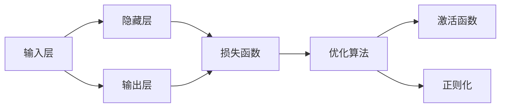
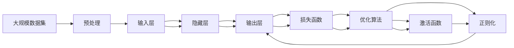

                 

# 神经网络：人工智能的基石

> 关键词：神经网络, 人工智能, 深度学习, 反向传播, 梯度下降, 卷积神经网络(CNN), 循环神经网络(RNN), 自编码器, 生成对抗网络(GAN), 前馈神经网络, 序列模型

## 1. 背景介绍

### 1.1 问题由来
人工智能（AI）已经成为现代社会最重要的科技领域之一。在过去的几十年中，深度学习（Deep Learning）技术的突飞猛进极大地推动了人工智能的发展，使得机器在图像识别、语音识别、自然语言处理、机器人控制等诸多领域取得了突破性的进展。而神经网络（Neural Network）作为深度学习的主流模型，其核心思想源自人类大脑的神经系统，通过对大量数据进行学习，可以发现数据的内在规律，实现高效的复杂模式识别。

神经网络自20世纪80年代以来就成为了人工智能领域的研究热点。从最初的感知机（Perceptron）到多层感知机（Multilayer Perceptron, MLP），再到卷积神经网络（Convolutional Neural Network, CNN）和循环神经网络（Recurrent Neural Network, RNN），神经网络技术已经从理论探索逐步走向工程实践，成为实现人工智能的关键技术。

### 1.2 问题核心关键点
神经网络的核心思想是通过一系列可学习的参数构建一个复杂的非线性函数映射，将输入数据映射到目标输出。其主要组成部分包括：

- **输入层**：接收原始数据。
- **隐藏层**：通过一系列可学习的权重和偏置进行特征变换，实现数据压缩和特征提取。
- **输出层**：将隐藏层提取的特征映射到目标输出空间。

神经网络通过反向传播算法（Backpropagation）实现参数的更新，不断优化模型性能。反向传播算法基于梯度下降优化策略，通过链式法则计算损失函数对模型参数的导数，以最小化损失函数为目标，更新模型参数。

神经网络的学习过程可以分为两个主要阶段：**前向传播（Forward Propagation）**和**反向传播（Backpropagation）**。前向传播是将输入数据通过网络逐层传递，计算输出结果的过程。反向传播则是在前向传播的基础上，计算输出与真实标签之间的误差，并反向计算每层参数的梯度，进而更新参数以减少误差。

## 2. 核心概念与联系

### 2.1 核心概念概述

神经网络的核心概念包括：

- **前向传播**：将输入数据通过网络逐层传递，计算输出结果的过程。
- **反向传播**：计算输出与真实标签之间的误差，并反向计算每层参数的梯度，进而更新参数以减少误差。
- **损失函数**：衡量模型输出与真实标签之间的差异，常用的损失函数包括交叉熵损失、均方误差损失等。
- **优化算法**：常用的优化算法包括随机梯度下降（Stochastic Gradient Descent, SGD）、Adam、Adagrad等，用于最小化损失函数。
- **激活函数**：用于引入非线性变换，常用的激活函数包括ReLU、Sigmoid、Tanh等。
- **正则化**：防止过拟合的技术，包括L1正则、L2正则、Dropout等。

神经网络的这些核心概念通过一组数学公式和算法连接在一起，形成一个高效的模型训练框架。通过学习这些概念，我们可以更好地理解神经网络的工作原理和优化方法。

### 2.2 概念间的关系

这些核心概念之间存在着紧密的联系，形成了神经网络的完整训练框架。通过以下Mermaid流程图，我们可以更清晰地理解这些概念之间的关系：



这个流程图展示了神经网络从输入层到输出层，以及损失函数、优化算法、激活函数和正则化技术之间的联系：

- 输入层接收原始数据，并通过隐藏层进行特征提取。
- 隐藏层通过一系列可学习的权重和偏置进行特征变换，并传递到输出层。
- 输出层将隐藏层提取的特征映射到目标输出空间。
- 损失函数衡量模型输出与真实标签之间的差异。
- 优化算法最小化损失函数，更新模型参数。
- 激活函数引入非线性变换。
- 正则化技术防止过拟合。

### 2.3 核心概念的整体架构

最后，我们用一个综合的流程图来展示这些核心概念在大规模神经网络训练过程中的整体架构：



这个综合流程图展示了从数据预处理到神经网络训练的完整过程。大规模数据集经过预处理后输入神经网络，通过前向传播计算输出结果。然后通过损失函数衡量输出误差，反向传播计算梯度，优化算法更新参数。激活函数和正则化技术用于提升模型性能。

## 3. 核心算法原理 & 具体操作步骤

### 3.1 算法原理概述

神经网络的训练过程主要通过反向传播算法实现。反向传播算法基于梯度下降优化策略，通过链式法则计算损失函数对模型参数的导数，以最小化损失函数为目标，更新模型参数。

假设神经网络有$L$层，第$l$层的输入为$x^{(l)}$，输出为$a^{(l)}$，参数为$\theta^{(l)}$，则前向传播的计算公式为：

$$
a^{(l)} = \sigma(\mathbf{W}^{(l)} x^{(l-1)} + b^{(l)})
$$

其中$\sigma$表示激活函数，$\mathbf{W}^{(l)}$和$b^{(l)}$分别为第$l$层的权重和偏置。

假设输出层的目标输出为$y$，则损失函数$J(\theta)$可定义为：

$$
J(\theta) = \frac{1}{N} \sum_{i=1}^N \ell(y_i, \hat{y_i})
$$

其中$\ell$为损失函数，$\hat{y_i}$为模型输出，$y_i$为真实标签。

### 3.2 算法步骤详解

神经网络的训练过程可以分为以下步骤：

1. **数据预处理**：将原始数据转换为适合输入神经网络的格式，并进行归一化、标准化等预处理。

2. **初始化模型参数**：随机初始化神经网络的权重和偏置。

3. **前向传播**：将输入数据通过神经网络，计算出每一层的输出结果。

4. **计算损失函数**：将输出结果与真实标签进行比较，计算损失函数。

5. **反向传播**：通过链式法则计算每一层的梯度，并更新参数以减少误差。

6. **参数更新**：根据优化算法（如SGD、Adam等）更新模型参数。

7. **迭代训练**：重复以上步骤，直至模型收敛或达到预设的训练轮数。

### 3.3 算法优缺点

神经网络作为一种高效的模型训练框架，具有以下优点：

1. **强大的表达能力**：通过多层的非线性变换，神经网络可以处理复杂的非线性问题。

2. **高效的并行计算**：神经网络中的数据流和计算流具有高度的并行性，适合在GPU等高性能设备上进行大规模训练。

3. **广泛的应用场景**：神经网络已经成功应用于图像识别、语音识别、自然语言处理等多个领域。

然而，神经网络也存在一些缺点：

1. **数据需求量大**：神经网络需要大量的标注数据进行训练，数据获取成本较高。

2. **过拟合风险高**：神经网络具有较强的拟合能力，容易过拟合。

3. **模型复杂度高**：神经网络模型参数量大，训练复杂度高。

4. **训练时间长**：神经网络训练时间较长，尤其是大规模数据集和复杂模型。

### 3.4 算法应用领域

神经网络在众多领域中得到了广泛的应用，以下是一些典型应用场景：

- **计算机视觉**：卷积神经网络（CNN）在图像识别、目标检测、人脸识别等领域取得了巨大成功。

- **自然语言处理**：循环神经网络（RNN）和长短时记忆网络（LSTM）在机器翻译、情感分析、文本生成等领域表现优异。

- **语音识别**：深度神经网络（DNN）和卷积神经网络（CNN）在语音识别、语音合成等领域取得了重要进展。

- **推荐系统**：神经网络模型在协同过滤、基于内容的推荐等领域表现出色。

- **游戏AI**：神经网络在游戏AI、自动驾驶等领域展示了强大的潜力。

## 4. 数学模型和公式 & 详细讲解  
### 4.1 数学模型构建

神经网络的训练过程可以表示为以下几个数学模型：

1. **前向传播**：

$$
a^{(l)} = \sigma(\mathbf{W}^{(l)} x^{(l-1)} + b^{(l)})
$$

2. **损失函数**：

$$
J(\theta) = \frac{1}{N} \sum_{i=1}^N \ell(y_i, \hat{y_i})
$$

3. **梯度计算**：

$$
\frac{\partial J}{\partial \theta^{(l)}} = \frac{1}{N} \sum_{i=1}^N \frac{\partial \ell}{\partial \hat{y_i}} \frac{\partial \hat{y_i}}{\partial z_i^{(l)}} \frac{\partial z_i^{(l)}}{\partial \theta^{(l)}}
$$

其中$z_i^{(l)} = a^{(l-1)} W^{(l)} + b^{(l)}$，$\hat{y_i}$为模型输出，$\ell$为损失函数。

4. **优化算法**：

$$
\theta^{(l)} \leftarrow \theta^{(l)} - \eta \nabla_{\theta^{(l)}} J(\theta)
$$

其中$\eta$为学习率，$\nabla_{\theta^{(l)}} J(\theta)$为损失函数对参数的梯度。

### 4.2 公式推导过程

以下我们以一个简单的神经网络为例，推导其训练过程的数学公式。

假设输入数据为$x$，神经网络有1个隐藏层和1个输出层，激活函数为ReLU，损失函数为均方误差损失。

前向传播的计算公式为：

$$
a^{(1)} = W^{(1)} x + b^{(1)}
$$

$$
a^{(2)} = W^{(2)} a^{(1)} + b^{(2)}
$$

$$
\hat{y} = \sigma(a^{(2)})
$$

损失函数为：

$$
J(\theta) = \frac{1}{N} \sum_{i=1}^N (y_i - \hat{y_i})^2
$$

梯度计算为：

$$
\frac{\partial J}{\partial W^{(1)}} = \frac{1}{N} \sum_{i=1}^N (y_i - \hat{y_i}) \frac{\partial \hat{y_i}}{\partial a^{(2)}} \frac{\partial a^{(2)}}{\partial z^{(2)}} \frac{\partial z^{(2)}}{\partial a^{(1)}} \frac{\partial a^{(1)}}{\partial W^{(1)}}
$$

$$
\frac{\partial J}{\partial b^{(1)}} = \frac{1}{N} \sum_{i=1}^N (y_i - \hat{y_i}) \frac{\partial \hat{y_i}}{\partial a^{(2)}} \frac{\partial a^{(2)}}{\partial z^{(2)}} \frac{\partial z^{(2)}}{\partial a^{(1)}} \frac{\partial a^{(1)}}{\partial b^{(1)}}
$$

$$
\frac{\partial J}{\partial W^{(2)}} = \frac{1}{N} \sum_{i=1}^N (y_i - \hat{y_i}) \frac{\partial \hat{y_i}}{\partial a^{(2)}} \frac{\partial a^{(2)}}{\partial z^{(2)}} \frac{\partial z^{(2)}}{\partial W^{(2)}}
$$

$$
\frac{\partial J}{\partial b^{(2)}} = \frac{1}{N} \sum_{i=1}^N (y_i - \hat{y_i}) \frac{\partial \hat{y_i}}{\partial a^{(2)}} \frac{\partial a^{(2)}}{\partial z^{(2)}} \frac{\partial z^{(2)}}{\partial b^{(2)}}
$$

通过以上公式，我们可以计算每一层参数的梯度，并使用优化算法（如SGD、Adam等）更新模型参数，从而实现神经网络的训练。

### 4.3 案例分析与讲解

以手写数字识别任务为例，我们可以使用卷积神经网络（CNN）进行训练。以下是CNN的训练过程：

1. **数据预处理**：将原始图像转换为灰度图像，并进行归一化处理。

2. **模型搭建**：搭建一个包含2个卷积层和2个全连接层的CNN模型。

3. **初始化参数**：随机初始化模型参数。

4. **前向传播**：将图像通过卷积层和全连接层进行特征提取和分类。

5. **计算损失函数**：将模型输出与真实标签进行比较，计算均方误差损失。

6. **反向传播**：通过链式法则计算每一层的梯度，并更新参数以减少误差。

7. **参数更新**：根据优化算法（如SGD、Adam等）更新模型参数。

8. **迭代训练**：重复以上步骤，直至模型收敛或达到预设的训练轮数。

通过CNN模型，我们可以将手写数字图像转换为数字标签，实现高效的数字识别任务。

## 5. 项目实践：代码实例和详细解释说明

### 5.1 开发环境搭建

在进行神经网络项目实践前，我们需要准备好开发环境。以下是使用Python进行TensorFlow开发的环境配置流程：

1. 安装Anaconda：从官网下载并安装Anaconda，用于创建独立的Python环境。

2. 创建并激活虚拟环境：
```bash
conda create -n tensorflow-env python=3.8 
conda activate tensorflow-env
```

3. 安装TensorFlow：根据CUDA版本，从官网获取对应的安装命令。例如：
```bash
conda install tensorflow -c tensorflow -c conda-forge
```

4. 安装TensorFlow Addons：用于扩展TensorFlow的功能，如自适应学习率、权重正则化等。
```bash
pip install tensorflow-addons
```

5. 安装各类工具包：
```bash
pip install numpy pandas scikit-learn matplotlib tqdm jupyter notebook ipython
```

完成上述步骤后，即可在`tensorflow-env`环境中开始神经网络项目的开发。

### 5.2 源代码详细实现

下面我们以手写数字识别任务为例，给出使用TensorFlow实现卷积神经网络（CNN）的代码实现。

```python
import tensorflow as tf
from tensorflow.keras import datasets, layers, models
import matplotlib.pyplot as plt

# 加载数据集
(train_images, train_labels), (test_images, test_labels) = datasets.mnist.load_data()

# 数据预处理
train_images = train_images.reshape((60000, 28, 28, 1))
test_images = test_images.reshape((10000, 28, 28, 1))
train_images, test_images = train_images / 255.0, test_images / 255.0

# 构建模型
model = models.Sequential()
model.add(layers.Conv2D(32, (3, 3), activation='relu', input_shape=(28, 28, 1)))
model.add(layers.MaxPooling2D((2, 2)))
model.add(layers.Conv2D(64, (3, 3), activation='relu'))
model.add(layers.MaxPooling2D((2, 2)))
model.add(layers.Conv2D(64, (3, 3), activation='relu'))
model.add(layers.Flatten())
model.add(layers.Dense(64, activation='relu'))
model.add(layers.Dense(10, activation='softmax'))

# 编译模型
model.compile(optimizer='adam',
              loss='sparse_categorical_crossentropy',
              metrics=['accuracy'])

# 训练模型
history = model.fit(train_images, train_labels, epochs=10, 
                    validation_data=(test_images, test_labels))

# 评估模型
test_loss, test_acc = model.evaluate(test_images, test_labels, verbose=2)
print(test_acc)
```

以上就是使用TensorFlow实现CNN模型的完整代码实现。可以看到，TensorFlow的高级API使得模型的构建和训练变得异常简洁高效。

### 5.3 代码解读与分析

让我们再详细解读一下关键代码的实现细节：

**模型搭建**：
- 使用`Sequential`模型依次添加卷积层、池化层和全连接层。
- 卷积层使用`Conv2D`，设置卷积核大小、通道数和激活函数。
- 池化层使用`MaxPooling2D`，设置池化窗口大小。
- 全连接层使用`Dense`，设置神经元数和激活函数。

**训练过程**：
- 使用`compile`方法设置优化器、损失函数和评估指标。
- 使用`fit`方法进行模型训练，设置训练轮数、验证集等参数。
- 训练过程中，模型会自动进行前向传播、反向传播和参数更新。
- 使用`evaluate`方法在测试集上评估模型性能，输出损失和准确率。

**运行结果展示**：
- 训练过程中，模型在训练集和验证集上的准确率逐渐提升。
- 训练结束后，在测试集上评估模型性能，输出最终准确率。

可以看到，TensorFlow的高级API使得神经网络的实现变得异常便捷，开发者可以将更多精力放在模型设计和数据处理上，而不必过多关注底层实现细节。

当然，工业级的系统实现还需考虑更多因素，如模型的保存和部署、超参数的自动搜索、更灵活的任务适配层等。但核心的训练过程基本与此类似。

## 6. 实际应用场景

### 6.1 计算机视觉

神经网络在计算机视觉领域已经得到了广泛应用，以下是一些典型应用场景：

- **图像分类**：使用卷积神经网络（CNN）对图像进行分类。例如，LeNet、AlexNet、VGG、ResNet等模型在图像分类任务上表现优异。

- **目标检测**：使用区域卷积神经网络（R-CNN）、YOLO、SSD等模型进行目标检测。

- **人脸识别**：使用卷积神经网络（CNN）或循环神经网络（RNN）进行人脸识别。

- **图像分割**：使用全卷积神经网络（FCN）或U-Net等模型进行图像分割。

### 6.2 自然语言处理

神经网络在自然语言处理（NLP）领域同样表现出色，以下是一些典型应用场景：

- **文本分类**：使用循环神经网络（RNN）或长短时记忆网络（LSTM）进行文本分类。

- **机器翻译**：使用序列到序列（Seq2Seq）模型或Transformer模型进行机器翻译。

- **文本生成**：使用生成对抗网络（GAN）或变分自编码器（VAE）进行文本生成。

- **语音识别**：使用深度神经网络（DNN）或卷积神经网络（CNN）进行语音识别。

### 6.3 推荐系统

神经网络在推荐系统领域也有广泛应用，以下是一些典型应用场景：

- **协同过滤**：使用矩阵分解模型或深度神经网络（DNN）进行协同过滤。

- **基于内容的推荐**：使用神经网络模型提取用户和物品的特征，进行相似度计算。

- **实时推荐**：使用神经网络模型对用户行为进行实时预测，进行个性化推荐。

### 6.4 未来应用展望

随着神经网络技术的不断发展，未来在诸多领域将有更多创新应用：

- **自适应学习**：神经网络将能够根据数据分布的变化，自适应调整模型参数，实现动态学习。

- **多模态融合**：神经网络将能够同时处理图像、语音、文本等多种模态数据，实现跨模态信息融合。

- **联邦学习**：通过分布式训练，神经网络能够在保护隐私的前提下，联合多方的数据进行模型训练。

- **量子计算**：量子计算机将能够加速神经网络模型的训练和推理，推动AI技术的发展。

总之，神经网络技术在未来将有更加广泛的应用前景，极大地拓展了人工智能的边界。

## 7. 工具和资源推荐

### 7.1 学习资源推荐

为了帮助开发者系统掌握神经网络技术的理论基础和实践技巧，这里推荐一些优质的学习资源：

1. **《深度学习》**：Ian Goodfellow、Yoshua Bengio和Aaron Courville合著的经典教材，系统介绍了深度学习的理论基础和应用实践。

2. **《神经网络与深度学习》**：Michael Nielsen的在线教材，适合初学者理解神经网络的基本概念和数学推导。

3. **《Deep Learning Specialization》**：由Andrew Ng主讲的深度学习课程，包括多个单元，涵盖神经网络、卷积神经网络、循环神经网络等内容。

4. **《TensorFlow官方文档》**：TensorFlow官方提供的详细文档，包括模型搭建、训练、推理等各个环节的详细教程。

5. **Kaggle竞赛平台**：一个数据科学竞赛平台，提供丰富的数据集和模型，适合实践和探索新算法。

通过对这些资源的学习实践，相信你一定能够快速掌握神经网络技术的精髓，并用于解决实际的AI问题。

### 7.2 开发工具推荐

高效的开发离不开优秀的工具支持。以下是几款用于神经网络微调开发的常用工具：

1. **TensorFlow**：由Google主导开发的开源深度学习框架，适合大规模工程应用。

2. **PyTorch**：由Facebook主导开发的开源深度学习框架，适合快速迭代研究。

3. **MXNet**：由亚马逊主导开发的深度学习框架，支持多种编程语言和硬件平台。

4. **Keras**：一个高层次的深度学习API，可以运行在TensorFlow、Theano等后端上，适合快速原型开发。

5. **JAX**：一个高性能的Python库，支持自动微分、JIT编译等特性，适合深度学习研究和开发。

6. **PyTorch Lightning**：一个基于PyTorch的轻量级深度学习框架，提供了丰富的模板和集成服务。

合理利用这些工具，可以显著提升神经网络模型的开发效率，加快创新迭代的步伐。

### 7.3 相关论文推荐

神经网络技术的发展源于学界的持续研究。以下是几篇奠基性的相关论文，推荐阅读：

1. **AlexNet**：Alex Krizhevsky等在2012年提出的卷积神经网络，开创了深度学习在计算机视觉领域的先河。

2. **LeNet**：Yann LeCun等在1998年提出的卷积神经网络，首次在手写数字识别任务上取得了显著进展。

3. **VGG**：Karen Simonyan和Andrew Zisserman在2014年提出的卷积神经网络，通过大量实验验证了深度网络的效果。

4. **ResNet**：Kaiming He等在2015年提出的残差网络，通过残差连接解决了深度网络训练中的梯度消失问题。

5. **LSTM**：Sepp Hochreiter和Jürgen Schmidhuber在1997年提出的长短时记忆网络，在序列建模方面取得了重要进展。

这些论文代表了大规模神经网络技术的演进脉络。通过学习这些前沿成果，可以帮助研究者把握学科前进方向，激发更多的创新灵感。

除上述资源外，还有一些值得关注的前沿资源，帮助开发者紧跟神经网络技术的最新进展，例如：

1. **arXiv论文预印本**：人工智能领域最新研究成果的发布平台，包括大量尚未发表的前沿工作，学习前沿技术的必读资源。

2. **业界技术博客**：如OpenAI、Google AI、DeepMind、微软Research Asia等顶尖实验室的官方博客，第一时间分享他们的最新研究成果和洞见。

3. **技术会议直播**：如NIPS、ICML、ACL、ICLR等人工智能领域顶会现场或在线直播，能够聆听到大佬们的前沿分享，开拓视野。

4. **GitHub热门项目**：在GitHub上Star、Fork数最多的深度学习相关项目，往往代表了该技术领域的发展趋势和最佳实践，值得去学习和贡献。

5. **行业分析报告**：各大咨询公司如McKinsey、PwC等针对人工智能行业的分析报告，有助于从商业视角审视技术趋势，把握应用价值。

总之，对于神经网络技术的学习和实践，需要开发者保持开放的心态和持续学习的意愿。多关注前沿资讯，多动手实践，多思考总结，必将收获满满的成长收益。

## 8. 总结：未来发展趋势与挑战

### 8.1 总结

本文对神经网络技术进行了全面系统的介绍。首先阐述了神经网络的基本概念和优化算法，明确了神经网络在深度学习中的核心地位。其次，从原理到实践，详细讲解了神经网络的训练过程，提供了代码实现和运行结果展示，帮助读者深入理解神经网络的工作机制。同时，本文还探讨了神经网络在计算机视觉、自然语言处理、推荐系统等多个领域的广泛应用，展示了其强大的表达能力。

通过本文

